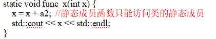
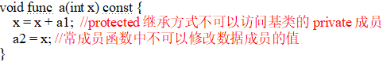
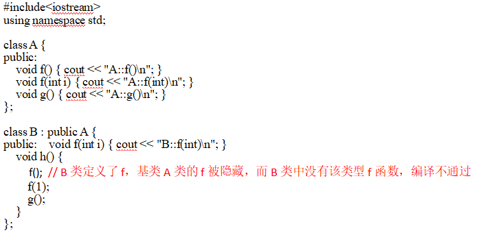
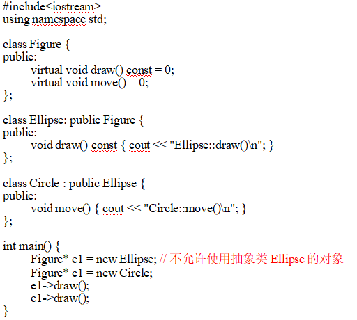

# 期末复习

## C++设计理念

+ **兼容性与效率并重** ：兼容C语言底层操作，同时引入面对对象特性，兼顾硬件效率与高级抽象。
+ **零开销抽象** ：语言特性（如类、虚函数）不为未使用的功能产生额外运行时开销。
+ **渐进式演化**：舍弃非通用特性（如并行支持），聚焦通用性，通过头文件机制保障编译一致性及类型安全。

## 面对对象程序设计

**面对对象程序设计**（OOP）是一种以**对象**为核心的编程范式，其核心思想是将数据（属性）和操作数据的方法（行为）封装为独立的实体（即对象），并通过**类**定义对象的模板。

## 类与对象

+ 类属于类型的范畴，是静态的程序实体，用于描述对象的特征，通常包含数据成员和成员函数定义。
+ 对象属于值的范围，是程序运行时（动态）的尸体，由数据及能对其施加的操作构成是面对对象程序的基本计算单位。
+ 对象是类的实例，对象需要通过类来创建，一个类可以创建多个对象。而类是一组对象的抽象，描述了一组具有相同特性和行为的对象。

## 继承与封装

+ 二者的矛盾：
  + 在派生类中定义新的成员函数或对基类已有成员函数重定义时，往往需要直接访问基类的一些private成员（特别是private数据成员），否则新的功能无法实现；
  + 而类的private成员不允许外界使用的，否则会打破数据封装。
+ c++对矛盾的处理：protected访问控制
  + 用protected说明的成员不能通过对象使用，但可以在派生类中使用
  + c++类向外界提供两种接口：
    + public：通过对象（类的实例用户）使用
    + public + protected：供派生类使用
+ protected访问控制的作用：
  + protected成员在**基类内部**和**派生类内部**可直接访问，但在类外部（包括非派生类）不可访问
  + private过于严格（派生类无法访问），public过于开放（破坏封装）。protected提供有限开放，仅对派生类暴露必要成员，解决“封装性”与“代码复用/扩展性”之间的冲突。
  + 防止非继承关系的代码误修改基类内部状态，减少耦合和潜在错误（如数据不一致）
+ 多继承：
  + 多继承用于派生类同时作为多个基类的子类型时的场景，能够增强语言的表达能力，使语言能够自然、方便地描述问题领域中的存在与对象类之间的多继承关系。
  + 多继承带来的两个主要问题分别是：名冲突和重复继承问题
  + 名冲突问题是指多个基类中的同名函数产生冲突，解决办法是基类名受限
  + 重复继承问题是指菱形继承中，同一个类的成员被继承了两次，在派生类中有两份拷贝，解决办法是虚基类（虚继承）

## STL中迭代器

+ 迭代器实现了抽象的指针功能，他们指向容器中的数据元素，用于对容器中的数据元素进行遍历和访问。
+ 迭代器是容器和算法之间的桥梁：传给算法的不是容器，而是指向容器中元素的迭代器，算法通过迭代器实现对容器中数据元素的访问。这样使得算法与容器保持独立，从而提高算法的通用性。

## 自定义类型转换操作符

+ 歧义问题：自定义类型转换操作符与单参数构造函数同时存在给编译造成歧义。
+ 解决办法：
  + 显示类型转换
  + 给A类的构造函数A（int）加上explict修饰，禁止把它作为隐式类型转换符使用

## 友元

+ 为了提高在类的外部对类的数据成员的访问效率，在c++中，可以指定某些与一个类密切相关的、又不适合作为该类成员的程序实体直接访问该类的非public成员，这些程序实体称为该类的友元。
+ 友元不是一个类的成员，而是一种单向的关系，不具有对称性，不能传递。

## 表达式

+ **影响因素**：
  + 操作数、操作符和标点符号组成的序列，表⽰⼀个计算过程
  + 优先级 a+b*c 解决相邻两个运算符的运算顺序 
  + 结合性 a+b-c 
  + 求值次序 (a+b)*(a-b) 解决不相邻的两个运算符的运算顺序 与编译系统有关*
  + *类型转换 int x=10; float y=2.0; x*y
+ **副作用**：
  + **成员变量修改**：在常量成员函数（`const`）中，若成员变量被声明为`mutable`，则允许修改其值
  + **全局/静态变量修改**：函数或表达式可能修改外部状态（如全局变量、静态变量）。
  + **动态内存管理**：表达式涉及`new`/`delete`时，若未正确释放内存会导致资源泄漏
  + **文件/网络操作**：读写文件或网络请求可能改变外部资源状态（如文件指针偏移）
  + **异常抛出**：`throw`语句会中断当前执行流，跳转到异常处理块（`try-catch`）。
  + **提前返回**：`return`语句可能提前终止函数，影响资源清理逻辑。
  + **输入/输出操作**：`cin`/`cout`或系统调用（如`rand()`）依赖外部状态，多次调用结果可能不同
  + **静态变量修改**：函数内的静态变量在多次调用间保持状态，导致相同输入产生不同输出

## 指针与引用的区别

+ **本质区别** 
  + **指针**：存储对象地址的独立变量（如 `int* p = &x;`），可修改指向不同对象或置为 `nullptr`（空指针）。
  +  **引用**：对象的别名（如 `int& r = x;`），**必须初始化且不可重绑定**（始终指向初始对象）。

+ **语法操作**
  +  指针需解引用（`*p`）访问对象，引用直接操作（`r = 5`等价于 `x = 5`）。 指针支持算术运算（如 `p++`），引用不支持。

+ **安全性** 
  + 指针可能悬空（指向已释放内存）或为空，引用无此风险（但可能绑定到无效对象）

## 继承与虚继承的差异

+ **普通继承**：
  + 每个派生类独立包含基类的完整副本。
  + 在多继承中，若多个基类共享同一基类（如“菱形继承”），派生类会存在多个重复基类副本，导致数据冗余和访问歧义。

+ **虚继承**：
  - 通过`virtual`关键字声明（如`class B: virtual public A`），确保共享基类在派生类中仅有一个副本。
  - 解决“菱形继承”问题，避免数据冗余和歧义。

+ **关键差异**：
  - **副本数量**：普通继承产生多个基类副本；虚继承共享单一副本。
  - **语法**：虚继承需显式使用`virtual`关键字。
  - **应用场景**：虚继承专用于解决多继承中的基类冗余问题。

## 实现两个版本的下标重载

在C++中，同时实现`const`和非`const`版本的下标运算符重载（`operator[]`）是为了严格遵循**const正确性**原则：

1. **非const版本**：返回普通引用（如`T&`），允许修改容器元素（例如`vec[i] = 10`），提供读写能力。
2. **const版本**：返回`const`引用（如`const T&`），禁止修改`const`对象的元素（如`const vector<int>`），确保只读访问的安全性。

这种设计在编译期强制执行访问权限，平衡灵活性与安全性，避免`const`对象被意外修改。

## 左值引用与右值引用

### **相同点**

- **均为别名机制**：两者均为对象提供别名，避免直接复制数据（如`int& lref = a;`与`int&& rref = 10;`）。

### **不同点**

1. **绑定对象类型**

   - **左值引用**：绑定**具名对象**（左值），如变量（`int x; int& lr = x;`）。
   - **右值引用**：绑定**临时对象**（右值），如表达式结果或显式构造的临时量（`int&& rr = 5;`）。

2. 

   **可修改性与安全性**

   - **左值引用**：可修改原对象（除非声明为`const`）；**非常量左值引用无法绑定临时对象**（如`A& aa = getA();`编译错误）。
   - **右值引用**：允许修改临时对象（如移动语义中转移资源所有权）。

3. 

   **生命周期管理**

   - **常量左值引用**：可延长临时对象生命周期（如`const string& s = generate();`）。
   - **右值引用**：直接绑定临时对象，支持高效资源转移（如`string&& s = generate();`）。

## Lambda与函数

Lambda表达式用于定义匿名函数对象，支持内联编写函数逻辑，并通过捕获列表访问外部变量（值捕获`=`或引用捕获`&`），简化代码。

**与函数对象的差异**：

1. **语法简洁性**：Lambda无需显式定义类（如函数对象需声明`operator()`）。
2. **捕获外部变量**：Lambda通过捕获列表直接访问作用域内变量，函数对象需通过构造函数传递。
3. **生命周期管理**：Lambda可自动捕获变量的值或引用，函数对象需手动管理状态。

## MFC提供的“文档-视”结构为程序设计带来什么好处

**职责分离**：文档类专注数据管理（存储、序列化），视图类处理显示与交互，实现数据与UI解耦。

**多视图同步**：一个文档可关联多个视图（如表格与图表），数据变更时自动同步更新。

**框架自动化**：内置文件序列化、打印预览等功能，减少重复代码。

**扩展灵活**：新增功能只需修改单一模块（如增视图类型无需改文档）。

## 什么情况下两个类满足子类型关系

**公有继承**：派生类需通过`public`继承基类（如`class D : public B`），确保“**is-a**”关系成立。

**行为兼容性**：派生类对象必须能替代基类对象使用，且不破坏基类契约（遵循**里氏替换原则**）。例如，派生类重写虚函数时需保持语义一致，避免违反基类约束（如正方形继承长方形时修改宽高导致状态矛盾）。

**接口扩展而非收缩**：派生类可扩展新功能，但不应减少基类接口（如隐藏基类公有成员）。

## inline函数的作⽤？随意使⽤所可能导致的问题？并请阐述合理使⽤的建议。
+ **作⽤：**
  + （1）提⾼程序的可读性；
  + （2）提⾼程序的运⾏效率；
  + （3）可以弥补宏定义不能进⾏类型检查的缺陷。 
+ **导致的问题：**
  + （1）增⼤⽬标代码，因为在调⽤时，必须在调⽤该函数的每个⽂本⽂件中定义；
  + （2）病态换页；
  + （3）降低指令快取装置的命中率；
+ **建议：**
  + （1）仅对使⽤频率较⾼的⼩段代码使⽤内联；
  + （2）将内联函数的定义放到头⽂件中；
  + （3）在内联函数中不能含有负复杂的结构控制语句，如switch、while等；
  + （4）递归函数不能⽤来做内联函数；
## RAII (资源获取即初始化) 的含义
1. 含义： 将资源的生命周期与栈对象的生命周期绑定。在构造函数中获取资源（如内存、锁、文件），在析构函数中释放资源。

2. 核心价值：

+ 自动化： 利用栈对象离开作用域时自动调用析构函数的特性，确保资源百分之百释放。

+ 异常安全： 即使程序发生异常导致提前退出，已创建的栈对象仍会执行析构，有效防止资源泄漏。

## 什么是纯虚函数、虚函数和⾮虚函数？

1. **纯虚函数**：语法为`virtual void f() = 0;`。它只提供接口声明，不提供实现，要求派生类**必须继承接口并实现**。原则上，当基类无法为函数提供合理默认行为时使用。
2. **虚函数**：提供接口声明及**默认实现**。派生类继承接口和实现，但允许**重写**。原则上，当希望派生类拥有灵活定制权时使用。
3. **非虚函数**：普通成员函数，不建议重写。派生类必须继承接口及**强制性实现**。原则上，用于体现类体系中的不变性，确保所有子类行为一致。

**设计建议**：若要实现多态，基类析构函数必须为虚函数；若不希望子类修改逻辑，则严禁定义为虚函数。

# 题目

+ 静态成员函数只能访问静态成员变量

   

+ 常成员函数中不可以修改数据成员的值

   

  修改：移除 `const`限定符或避免修改成员变量。

+ 派生类 `B`定义了 `void f(int i)`，**覆盖了基类所有同名函数**（包括无参的 `f()`）

   

+ 虚函数要全部override过后才能赋值
  

  上述Circle可以但是Ellipse不可以

+ 常量对象只能调用声明为 `const`的成员函数和静态成员函数

+ 若成员中存在指针，需要深拷贝，不然浅拷贝都指向同一区域，一个释放，全部变为空指针
+ 