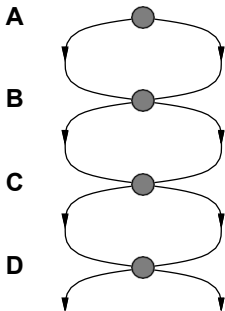
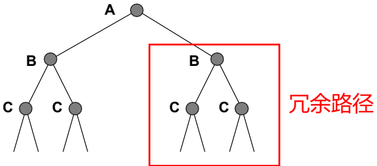
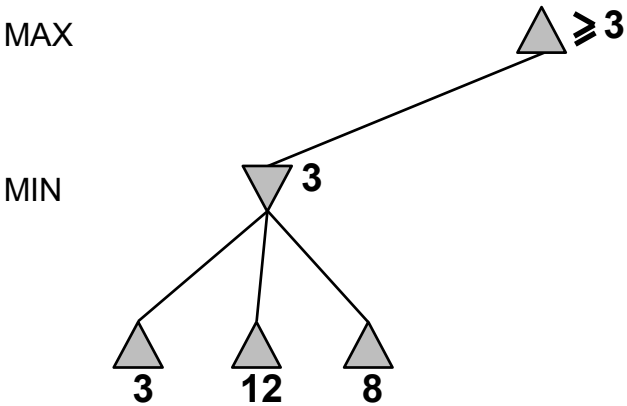
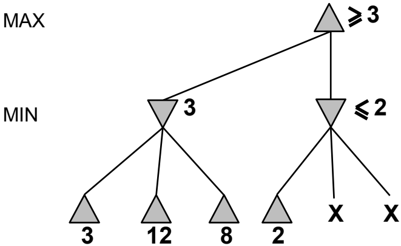
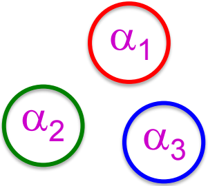
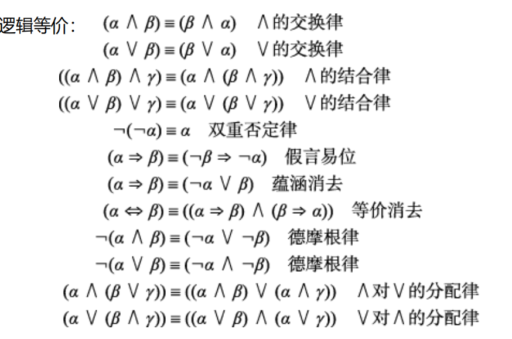
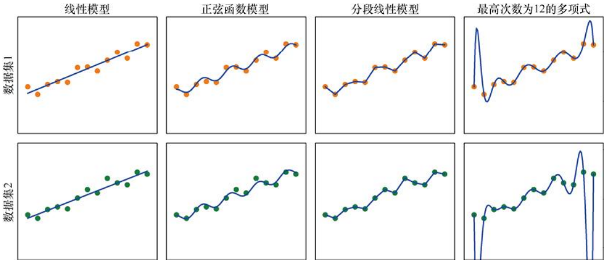
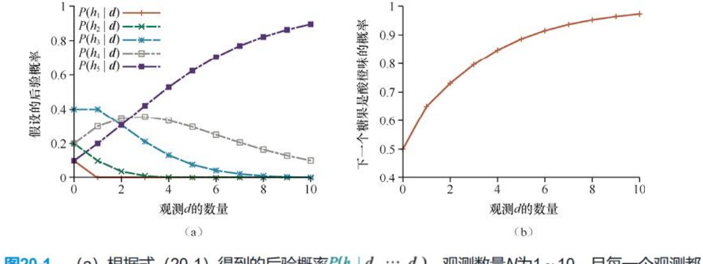

# 人工智能导论重要知识点复习大纲

## 题型

画图题，计算题，证明题，问答题

## 1. 第三章：通过搜索进行问题求解

### 1.1 搜索算法基础

- 

  **树搜索算法**：通过扩展节点从初始状态形成路径，搜索树中的节点对应状态空间中的状态，边对应动作。

  - 图搜索与树搜索的区别：如果算法检查冗余路径，称为图搜索；否则为树搜索。

  - 

     

  - 

     

- **最佳优先搜索**：使用代价函数f(n)对节点排序，优先扩展最优节点。

  - 算法实现：包括节点扩展、路径代价更新和冗余路径处理。
- 

### 1.2 无信息搜索策略

- 不提供状态与目标接近程度的线索，包括：

  - **广度优先搜索**：扩展最浅的未扩展节点，使用FIFO队列实现。

    - 特点：完备但可能内存消耗大。

    - 

       

      （示例图显示搜索过程）

  - **深度优先搜索**：扩展最深的未扩展节点，使用LIFO队列实现。

    - 特点：可能陷入无限深度，但内存效率高。

  - 其他策略：一致代价搜索、深度受限搜索、迭代加深搜索。

### 1.3 有信息（启发式）搜索策略

- 使用启发式函数h(n)估计到目标的代价，提高搜索效率。

  - **贪心最佳优先搜索**：优先扩展h(n)最小的节点，以快速接近目标。
- 示例：罗马尼亚旅行问题，使用直线距离作为启发式。
  
- **A\*搜索**：结合路径代价g(n)和启发式h(n)，f(n)=g(n)+h(n)。
  - 要求启发式可容许（h(n) ≤ h*(n)），保证最优性。

## 2. 第五章：对抗搜索和博弈

### 2.1 极小化极大搜索

- 用于零和博弈（如象棋），玩家交替操作，最大化自身收益，最小化对手收益。

  - **算法实现**：递归计算每个节点的极小化极大值，MAX节点取最大值，MIN节点取最小值。

  - 

     

  - 终止状态：直接返回效用值；非终止状态使用评价函数估计。

### 2.2 资源受限下的搜索

- 问题：真实博弈中无法搜索到叶节点。

  - **深度受限搜索**：限制搜索深度，使用评价函数替代终止效用值。
  + 仅搜索到树中的有限深度
    + 对于非终止状态使用**评价函数**替代终止效用函数
- **评价函数**：估计非终止状态的期望效用，通常为特征的线性加权（如棋子的数量）。
  
  - 要求：计算速度快，与真实获胜机会相关。
-  无法保证最优性
  
  - 使用迭代加深确定合适的搜索深度

### 2.3 α-β剪枝

- 优化极小化极大搜索，剪除不影响结果的子树。

  - **原理**：在搜索过程中维护α（MAX最佳值）和β（MIN最佳值），当节点值超出范围时剪枝。

  - 性质：不影响根节点极小化极大值，但中间节点值可能错误；好的遍历顺序提高效率。

  - 

     

## 3. 第七章：逻辑智能体

### 3.1 逻辑的一般概念

- **逻辑**：形式化语言，用于表示信息和推理世界。

  - 语法：定义合规语句；语义：定义语句真值规则。

  - 

     

  - 

    

- **蕴含**：语句α蕴含β（α ⊨ β）当且仅当α为真的每个模型中β也为真。

  - 示例：Wumpus世界中，根据规则和观测推断无底洞位置。

### 3.2 命题逻辑

- **语法**：原子语句和复合语句，使用逻辑联结词（¬、∧、∨、⇒、⇔）。
- **语义**：通过真值表计算语句真值，模型为命题符号赋值。
- 示例：Wumpus世界知识库构建，使用符号表示状态（如Px,y表示无底洞）。
- **命题定理证明**：
- **逻辑等价**：如德摩根律、分配律。
- **推断规则**：如肯定前件、合取消去、归结。
- **归结证明**：将语句转换为合取范式（CNF），使用归结规则推导空子句。
- 

## 4. 第十二章：不确定性的量化

### 4.1 基本概率记号

- **样本空间Ω**：所有可能世界的集合，概率模型为每个世界赋予概率（0 ≤ P(ω) ≤ 1）。

- **随机变量**：表示事件，概率分布P(X)描述变量取值概率。
- 联合概率分布：多变量概率表，如P(Weather, Cavity)。
  
- **边缘概率**：通过求和消元部分变量，得到子分布。

- **条件概率**：P(a|b) = P(a∧b)/P(b)，反映证据下的信念度。

- **链式法则**：联合分布分解为条件概率乘积。

### 4.2 贝叶斯法则与应用

- **贝叶斯法则**：P(b|a) = P(a|b)P(b)/P(a)，用于从果推因。
- 示例：脑膜炎诊断，结合先验概率和证据更新后验概率。
  
- **独立性与条件独立性**：
- 独立性：P(a∧b) = P(a)P(b)；条件独立性：给定Z，X与Y独立。

### 4.3 朴素贝叶斯模型

- 假设结果变量在给定原因下条件独立，简化联合分布计算。

  - 公式：P(Cause, Effect₁,...,Effectₙ) = P(Cause) ∏ᵢ P(Effectᵢ|Cause)。

  - 应用：分类问题，如根据症状诊断疾病。

## 5. 第十三章：概率推理

### 5.1 贝叶斯网络

- **知识表示**：有向无环图，节点为随机变量，边表示直接影响，每个节点关联条件概率分布。

  - 

     

    （示例：Burglary网络）

- 

  **语义**：

  - 全局语义：联合分布为局部条件分布乘积，P(x₁,...,xₙ) = ∏ᵢ P(xᵢ|parents(Xᵢ))。

  - 局部语义：给定父节点，变量条件独立于非子孙节点。

- **条件独立性-D分离**：通过路径激活性判断独立性，用于简化推理。

### 5.2 精确推断

- **枚举法**：通过求和隐藏变量计算查询后验概率，包括选择证据条目、求和消元、归一化。
- 示例：Burglary网络，计算P(B|j,m)。
  
- **优化**：利用条件独立性减少计算量，如变量消元算法。

## 6. 第十九章：样例学习

### 6.1 监督学习

- **基础**：从输入-输出对学习函数映射，假设空间H包含所有可能函数。
- 目标：找到泛化能力强的假设，避免过拟合和欠拟合。
  
- 偏差-方差权衡：简单假设低方差但高偏差，复杂假设反之。
  
- **评估**：使用训练集、验证集和测试集；k-折交叉验证处理数据不足。

### 6.2 线性回归与分类

- **线性回归**：拟合线性函数y = w₁x + w₀，最小化平方误差损失。
- 解法：梯度下降（批量或随机），更新权重逼近最优解。
  
- **分类**：扩展至多类别，如逻辑回归。

### 6.3 非参数模型

- **最近邻模型**：基于实例学习，保留所有训练样例。

  - k-近邻：根据距离度量（如欧几里得距离）找最近k个样例，进行分类或回归。

  - 

     

## 7. 第二十章：概率模型学习

### 7.1 贝叶斯学习

- **框架**：将学习视为假设空间概率分布的贝叶斯更新，后验分布P(h|d) ∝ P(d|h)P(h)。

  - 预测：P(X|d) = ∑ᵢ P(X|hᵢ)P(hᵢ|d)。

  - 

    

### 7.2 最大后验与最大似然学习

- **最大后验学习**：选择最大化P(h|d)的假设，即最大化P(d|h)P(h)。

- **最大似然学习**：选择最大化P(d|h)的假设，适用于大数据集（先验影响小）。
- 示例：离散模型参数学习，如糖果袋口味比例估计。

### 7.3 完全数据学习

- **最大似然参数学习**：通过求导解似然函数最大值，估计参数。
- 流程：写似然函数、求对数似然导数、解方程、验证二阶导。
  
- 问题：小数据集可能概率为0，需平滑处理。

