# 微观经济学复习笔记

> 依据本文件夹内课件、已有 Markdown 笔记和作业材料整理。适合考前按章复习：先抓主线，再背概念、公式和图形结论。

## 导言：课程与学习方法

### 1. 课程定位

微观经济学研究个体经济主体的决策以及市场机制如何配置资源。核心问题包括：

- 消费者如何在预算约束下选择商品组合。
- 企业如何在技术和成本约束下选择产量。
- 市场价格如何由需求和供给决定。
- 不同市场结构下，价格、产量、利润和效率如何变化。
- 市场为何会失灵，政府政策如何介入。

### 2. 学习重点

- 多画图：供求图、无差异曲线、成本曲线、市场结构图、外部性图。
- 多算题：均衡、弹性、效用最大化、成本函数、利润最大化、要素需求。
- 多比较：完全竞争、垄断、垄断竞争、寡头；私人最优与社会最优；短期与长期。
- 多联系现实：价格管制、税收、工资差异、公共物品、环境政策、信息不对称。

---

## 第一章：需求、供给和均衡价格

### 1. 本章主线

本章建立微观经济学最基础的供求模型：需求和供给共同决定市场均衡价格与均衡数量；弹性用于衡量变量对价格、收入等因素变化的敏感程度；供求模型可以解释价格管制、税收归宿和“谷贱伤农”等现象。

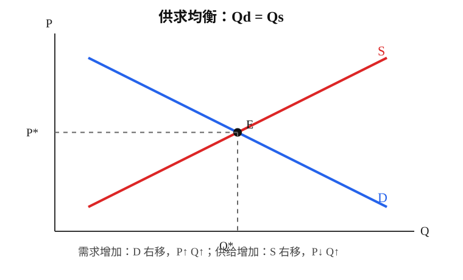

### 2. 需求

需求是消费者在一定时期内，在各种可能价格水平上愿意且能够购买的商品数量。它同时要求“购买意愿”和“支付能力”。

需求的表示方法：

- 需求表：列出价格与需求量组合。
- 需求曲线：通常横轴为数量 `Q`，纵轴为价格 `P`，一般向右下方倾斜。
- 需求函数：如 `Qd = a - bP`，其中 `b > 0`。

需求规律：其他条件不变时，价格上升，需求量下降；价格下降，需求量上升。原因主要是替代效应和收入效应。

需求规律的特例：

- 吉芬商品：价格上升，需求量反而上升。
- 完全无弹性需求：需求曲线垂直。
- 无限弹性需求：需求曲线水平。

影响需求的非价格因素：

- 消费者收入。
- 消费者偏好。
- 相关商品价格：替代品、互补品。
- 消费者预期。
- 政府政策。

易错区分：

- 需求量的变动：由本商品价格变化引起，表现为沿同一条需求曲线移动。
- 需求的变动：由价格以外因素变化引起，表现为需求曲线整体移动。

### 3. 供给

供给是生产者在一定时期内，在各种可能价格水平上愿意且能够出售的商品数量。它同时要求“供给能力”和“出售意愿”。

供给规律：其他条件不变时，价格上升，供给量增加；价格下降，供给量减少。供给曲线一般向右上方倾斜。

影响供给的非价格因素：

- 生产技术水平。
- 生产成本或投入品价格。
- 生产者目标。
- 相关商品价格。
- 生产者预期。
- 政府政策。

易错区分：

- 供给量的变动：由本商品价格变化引起，沿供给曲线移动。
- 供给的变动：由价格以外因素变化引起，供给曲线整体移动。

### 4. 市场均衡

均衡是供给和需求相等时，价格和数量不再自发变动的状态。

均衡条件：

```text
Qd = Qs
```

均衡价格是供求相等时的价格，均衡数量是该价格下的交易数量。

供求变动的三步分析法：

1. 判断事件影响需求、供给，还是二者都影响。
2. 判断曲线移动方向。
3. 用供求图判断新均衡价格和数量。

常见结论：

- 需求增加：均衡价格上升，均衡数量增加。
- 需求减少：均衡价格下降，均衡数量减少。
- 供给增加：均衡价格下降，均衡数量增加。
- 供给减少：均衡价格上升，均衡数量减少。
- 需求和供给同时变动时，价格或数量可能不确定，要看移动幅度。

### 5. 弹性

弹性衡量一个变量对另一个变量变化的敏感程度，用百分比变化之比表示，不受计量单位影响。

需求价格弹性：

```text
Ed = 需求量变动百分比 / 价格变动百分比
```

通常取绝对值来判断大小：

- `Ed = 0`：完全无弹性。
- `0 < Ed < 1`：缺乏弹性。
- `Ed = 1`：单位弹性。
- `Ed > 1`：富有弹性。
- `Ed = ∞`：无限弹性。

影响需求价格弹性的因素：

- 替代品越多，弹性越大。
- 商品越不重要，弹性越大。
- 支出占收入比重越大，弹性越大。
- 调整时间越长，弹性越大。

弹性与总收益：

- 需求富有弹性：降价会增加总收益，涨价会减少总收益。
- 需求缺乏弹性：降价会减少总收益，涨价会增加总收益。
- 单位弹性：价格变化不改变总收益。

其他弹性：

- 收入弹性 `Em`：`Em > 0` 为正常品，`Em < 0` 为低档品；正常品中 `0 < Em < 1` 为必需品，`Em > 1` 为奢侈品。
- 交叉价格弹性 `Ec`：`Ec > 0` 为替代品，`Ec < 0` 为互补品。
- 供给价格弹性：供给量对价格变化的敏感程度，受调整时间、生产技术类型、现有生产能力等影响。

### 6. 供求分析应用

价格管制：

- 支持价格：最低限价，高于均衡价格，会导致供给过剩。
- 限制价格：最高限价，低于均衡价格，会导致供给短缺。

税收效应：

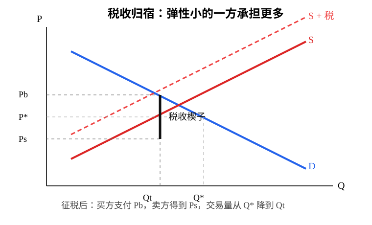

- 无论向买方还是卖方征税，最终都会在买方支付价格和卖方得到价格之间形成税收楔子。
- 税收会减少交易量。
- 法定纳税人与实际税负承担者不同。
- 弹性小的一方承担更多税负。

典型考点：

- “谷贱伤农”：粮食需求缺乏弹性，丰收使供给增加、价格大幅下降，价格下降比例大于销量增加比例，农民总收益下降。
- 毒品政策：若毒品需求缺乏弹性，单纯打击供给可能提高总支出；减少需求的教育政策更可能降低总支出和相关犯罪。

---

## 第二章：消费者选择

### 1. 本章主线

本章研究消费者如何在收入有限的情况下选择商品组合，使效用最大化。核心工具是偏好、效用函数、无差异曲线、预算约束线和消费者均衡条件。

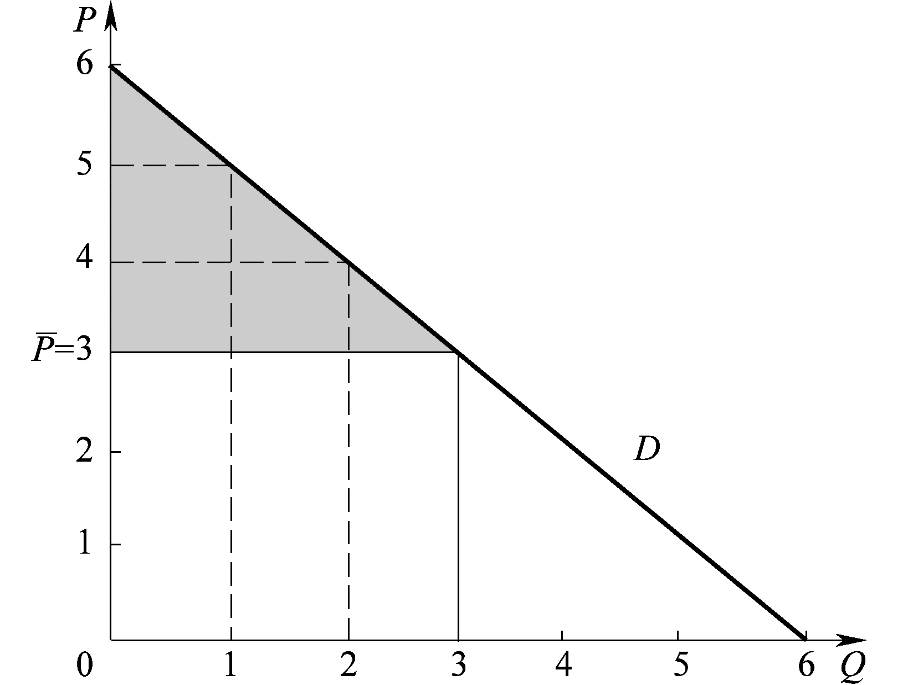

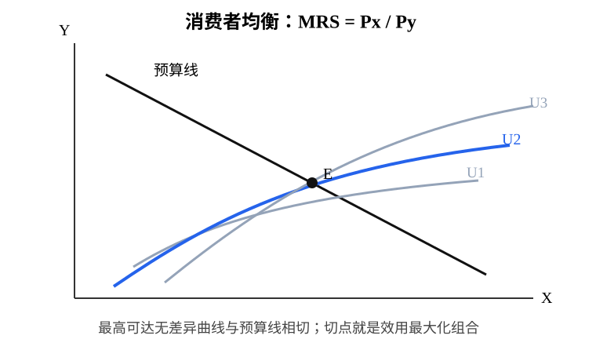

### 2. 效用与偏好

效用是消费者从消费中获得的满足感，是主观评价。

偏好通常满足：

- 可排序性：消费者能比较任意两个商品组合。
- 传递性：若 A 优于 B，B 优于 C，则 A 优于 C。
- 多比少好：其他条件相同时，商品越多越好。
- 偏好多样性：消费者通常偏好组合消费。

效用函数用数学形式表示偏好，例如：

- 完全互补型：`U(x,y) = min{x, y/3}`，两种商品按固定比例消费，无差异曲线呈直角形。
- 柯布-道格拉斯型：如 `U = x^a y^b`，无差异曲线凸向原点。

### 3. 无差异曲线与边际替代率

无差异曲线表示能给消费者带来同等效用的商品组合。

典型性质：

- 向右下方倾斜。
- 离原点越远，效用越高。
- 同一消费者的无差异曲线不能相交。
- 通常凸向原点，反映边际替代率递减。

边际替代率：

```text
MRSxy = MUx / MUy
```

含义是在效用不变时，消费者愿意用多少 `y` 替代一单位 `x`。

### 4. 预算约束

预算线表示在收入和价格给定时，消费者能够购买的商品组合。

```text
Px x + Py y = I
```

预算线斜率为：

```text
- Px / Py
```

价格变化会使预算线旋转，收入变化会使预算线平移。

### 5. 消费者均衡

一般情况下，消费者均衡发生在预算线与最高可达无差异曲线的切点。

均衡条件：

```text
MRSxy = Px / Py
MUx / Px = MUy / Py
```

经济含义：每一元钱花在不同商品上带来的边际效用相等。

特殊情况：

- 完全互补品：均衡在直角拐点处，由固定比例和预算约束共同决定，不用切点条件。
- 完全替代品：均衡可能在角点处。

### 6. 需求曲线推导

当商品价格变化时，消费者重新选择最优消费组合。把不同价格下的最优购买量连起来，就得到个人需求曲线。

高频解题套路：

1. 写预算约束。
2. 计算边际效用 `MUx`、`MUy`。
3. 套用 `MUx/Px = MUy/Py`。
4. 与预算约束联立求最优消费束。
5. 遇到完全互补品，先写固定比例，再联立预算约束。

易错点：

- “无差异曲线不能相交”只针对同一个消费者，不同消费者的无差异曲线可以在图上经过同一点。
- 效用大小本身通常没有可比意义，关键是偏好排序。
- 消费者均衡不是“买最多”，而是在预算约束下达到最高效用。

---

## 第三章：企业的生产和成本

### 1. 本章主线

本章研究企业生产的技术约束和成本约束。生产函数说明投入如何转化为产出，成本函数说明不同产量对应的成本，为后续分析企业利润最大化打基础。

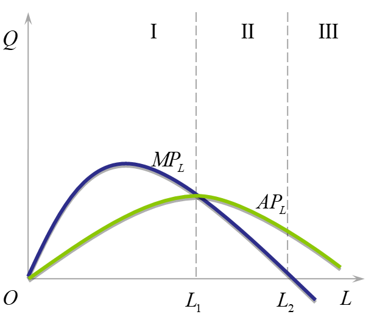

### 2. 生产函数

生产函数表示在既定技术条件下，投入要素与最大产量之间的关系。

```text
Q = f(L, K)
```

短期与长期：

- 短期：至少有一种生产要素固定，如资本 `K` 固定。
- 长期：所有生产要素都可以变动。

短期生产函数：

```text
Q = f(L, Kbar)
```

核心概念：

- 总产量 `TP`：一定投入下的总产出。
- 平均产量 `AP = TP / L`。
- 边际产量 `MP = ΔTP / ΔL`，连续形式为 `dTP/dL`。

边际报酬递减规律：在技术和其他投入不变时，连续增加一种可变要素，其边际产量最终会递减。

### 3. 短期生产三阶段

第 I 阶段：

- `AP` 递增。
- `MP > AP`。
- 可变要素投入不足，固定要素未充分利用。

第 II 阶段：

- `AP` 递减。
- `MP > 0`。
- 是短期生产的合理投入区间。

第 III 阶段：

- `MP < 0`。
- 可变要素投入过多，总产量下降。

### 4. 成本概念

短期成本：

- 总成本：`TC = FC + VC`。
- 固定成本 `FC`：不随产量变化。
- 可变成本 `VC`：随产量变化。
- 平均成本：`AC = TC/Q`。
- 平均固定成本：`AFC = FC/Q`。
- 平均可变成本：`AVC = VC/Q`。
- 边际成本：`MC = ΔTC/ΔQ = dTC/dQ`。

成本曲线关系：

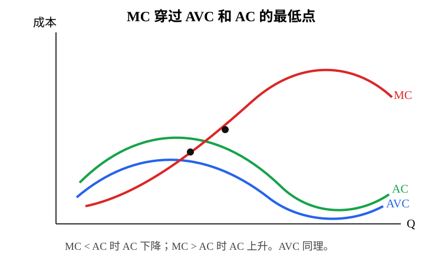

- `MC`、`AVC`、`AC` 通常呈 U 形。
- `MC` 依次穿过 `AVC` 和 `AC` 的最低点。
- 当 `MC < AC` 时，`AC` 下降；当 `MC > AC` 时，`AC` 上升。
- 当 `MC < AVC` 时，`AVC` 下降；当 `MC > AVC` 时，`AVC` 上升。

生产与成本的关系：

```text
MC = w / MPL
```

工资率 `w` 不变时，边际产量越高，边际成本越低。

### 5. 长期成本

长期中所有要素可变，企业可以选择最优规模。

长期平均成本 `LAC` 是短期平均成本曲线的包络线。规模经济、规模不经济和规模报酬变化共同决定其形状。

### 6. 解题套路

生产函数题：

1. 已知 `TP(L)`，求导得到 `MP(L)`。
2. 用 `AP(L) = TP(L)/L` 求平均产量。
3. 用 `MP = AP` 判断 `AP` 最大点。
4. 用 `MP = 0` 判断总产量最大点。
5. 判断给定劳动投入属于哪一生产阶段。

成本函数题：

1. 已知 `TC`，求导得 `MC`。
2. 已知 `MC`，积分得 `TC` 或 `VC`，常数项通常是固定成本。
3. 用 `AC = TC/Q`、`AVC = VC/Q`、`AFC = FC/Q`。
4. 求 `AVC` 最小值时，可用 `MC = AVC`。
5. 求 `AC` 最小值时，可用 `MC = AC`。

---

## 第五章：不完全竞争市场

### 1. 本章主线

市场结构可以从完全竞争到完全垄断排列：完全竞争、垄断竞争、寡头、垄断。不完全竞争市场中，企业通常具有一定市场势力，因此面对向右下方倾斜的需求曲线，价格高于边际成本，可能产生效率损失。

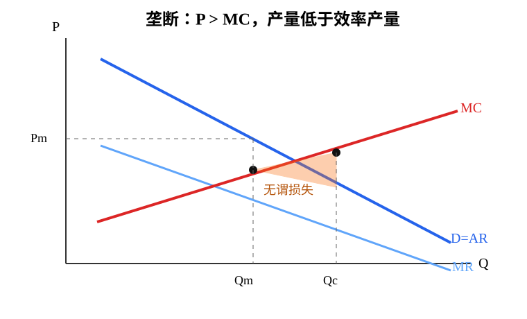

### 2. 垄断

垄断是整个市场只有一个卖者，企业面对整个市场需求曲线。

垄断形成原因：

- 资源垄断：关键资源由一家企业控制。
- 特许垄断：政府授予独家经营权。
- 专利垄断：企业拥有专利权。
- 自然垄断：规模经济显著，市场容量有限，一家企业生产成本最低。

垄断企业的收益：

- 需求曲线就是平均收益曲线：`D = AR`。
- 因为降价才能卖出更多产品，所以 `MR < P`。
- 若需求曲线为直线，`MR` 与 `AR` 纵截距相同，但斜率绝对值通常是 `AR` 的 2 倍。

垄断利润最大化：

```text
MR = MC
```

先由 `MR = MC` 决定产量，再根据需求曲线决定价格。

垄断短期结果：

- 可能盈利：`P > AC`。
- 可能亏损：`P < AC`。
- 可能不亏不盈：`P = AC`。

垄断长期结果：

- 有亏损时企业可能退出。
- 有经济利润时，由于进入壁垒，利润不会被新企业进入消除。
- 长期可盈利或不亏不盈。

重要结论：垄断企业没有供给曲线。因为供给曲线要求价格和供给量之间存在稳定的一一对应关系，但垄断企业的最优产量同时取决于需求曲线、边际收益曲线和边际成本曲线。

### 3. 价格歧视

价格歧视是把相同成本的产品以不同价格出售。

条件：

- 生产者有市场势力。
- 消费者之间不能转售。
- 能区分不同消费者或不同购买单位的支付意愿。

类型：

- 一级价格歧视：对每一单位产品都收取消费者愿意支付的最高价格，几乎完全榨取消费者剩余。
- 二级价格歧视：按购买数量或区段定价，如阶梯价格。
- 三级价格歧视：对不同需求弹性群体定不同价格，弹性大者低价，弹性小者高价。

市场势力测度：

```text
MR = P(1 - 1/E)
```

垄断均衡 `MR = MC`，弹性绝对值越大，消费者越敏感，市场势力越小；弹性绝对值越小，市场势力越大。

### 4. 垄断竞争

垄断竞争的特点：

- 企业数量多，单个企业市场份额小。
- 产品有差异。
- 企业有一定定价能力，但替代品较多。
- 典型例子：餐馆、书店、服装店。

需求曲线：

- 企业面临向右下方倾斜的需求曲线。
- 产品替代性强于垄断、弱于完全竞争。

短期均衡：

```text
MR = MC
```

企业可能盈利、亏损或不亏不盈。

长期均衡：

- 若存在经济利润，新企业进入，需求曲线向左下方移动。
- 若存在亏损，企业退出，剩余企业需求增加。
- 长期达到不亏不盈，需求曲线与平均成本曲线相切。

与完全竞争相比，垄断竞争长期中通常有：

- `P > MC`，存在一定效率损失。
- 经济利润为零。
- 产品差异带来选择多样性。

### 5. 寡头

寡头是少数几家企业控制大部分市场。

核心特征：相互依赖。每个企业决策时都必须考虑其他企业的反应。

形成原因：

- 规模经济。
- 市场容量有限。
- 资源控制。
- 政府特许。
- 专利技术。

古诺模型：

- 企业同时选择产量。
- 每个企业把对方产量当作既定，选择自己的最优产量。
- 最终结果可理解为纳什均衡。

价格领袖模型：

- 某一企业率先定价，其他企业跟随。
- 支配型价格领袖中，大企业根据市场需求减去小企业供给后的剩余需求来定价。

斯威齐模型：

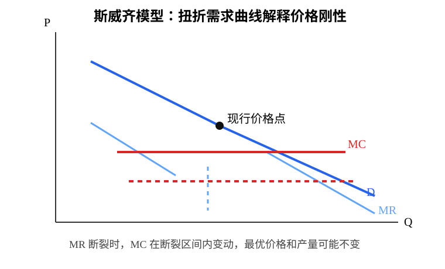

- 用扭折需求曲线解释寡头市场价格刚性。
- 若某企业涨价，其他企业不跟随，销量大幅减少，需求曲线上半段较平缓。
- 若某企业降价，其他企业跟随，销量增加有限，需求曲线下半段较陡峭。
- 边际收益曲线出现间断，边际成本在一定范围内变化时，最优价格和产量不变。

卡特尔：

- 多个企业达成协议，像垄断者一样控制总产量和价格。
- 可以提高联合利润，但不稳定。
- 成员有偷跑动机：在其他成员遵守协议时，自己降价或多产可获得更多利润。

### 6. 博弈论与策略行为

博弈三要素：

- 参与人。
- 策略。
- 收益。

纳什均衡：在某一策略组合下，任何参与人单独改变策略都不能获得更高收益。换言之，每个人的策略都是对其他人策略的最优反应。

常见考点：

- 收益矩阵中找相对优势策略。
- 判断占优策略均衡。
- 判断纳什均衡。
- 用博弈解释卡特尔不稳定、策略性贸易政策、先发优势等。

### 7. 不同市场比较

| 项目 | 完全竞争 | 垄断竞争 | 寡头 | 垄断 |
| --- | --- | --- | --- | --- |
| 企业数量 | 很多 | 很多 | 少数 | 一家 |
| 产品 | 同质 | 有差异 | 同质或差异 | 无近似替代品 |
| 价格控制 | 无 | 较弱 | 较强且相互依赖 | 强 |
| 长期利润 | 0 | 0 | 可能存在 | 可能存在 |
| 效率 | `P = MC` | `P > MC` | 通常 `P > MC` | `P > MC` |

静态效率上，完全竞争通常最高。不完全竞争价格较高、产量较少，产生无谓损失。但若考虑技术进步和创新，不完全竞争企业可能因利润和市场势力拥有更强创新激励。

---

## 第六章：生产要素市场和收入分配

### 1. 本章主线

本章把商品市场中的企业决策扩展到生产要素市场，解释劳动、土地、资本等要素的价格如何决定，以及收入分配如何形成。

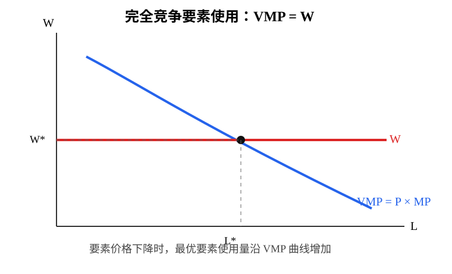

### 2. 完全竞争企业的要素需求

假定一种生产要素 `L`，一种产品 `Q`。产品价格 `P` 和要素价格 `W` 都由市场决定，单个企业不能影响。

要素带来的边际收益：

- 边际产品 `MP`：增加一单位要素带来的产量增加。
- 边际收益产品 `MRP = MR × MP`。
- 完全竞争产品市场中 `MR = P`，因此：

```text
MRP = VMP = P × MP
```

要素使用的边际成本：

```text
MFC = W
```

完全竞争企业的要素使用原则：

```text
VMP = W
```

含义：增加一单位要素带来的产值等于该单位要素的价格。

企业要素需求曲线：

- 单个完全竞争企业的要素需求曲线与 `VMP` 曲线重合。
- 因边际产品递减，`VMP` 通常向右下方倾斜。

市场要素需求曲线：

- 不是简单把各企业 `VMP` 曲线水平相加。
- 因为要素价格变动会引起所有企业调整产量，从而影响产品价格。
- 应将各企业“行业调整曲线”水平相加。

### 3. 要素供给一般理论

要素所有者面对的问题：在“供给要素获得收入”和“保留要素自用获得直接效用”之间选择。

效用函数可写为：

```text
U = U(C, H)
```

其中 `C` 为消费，`H` 为自用要素数量，总资源量满足：

```text
L + H = Lbar
C = W × L
```

要素供给的机会成本是放弃自用带来的效用。

一般均衡思想：

- 供给要素的边际效用收益等于保留自用的边际效用收益。
- 图形上表现为预算线与无差异曲线相切。

随着要素价格上升，预算线旋转，最优自用数量变化，从而得到要素供给曲线。

### 4. 劳动与工资

劳动供给本质上是消费者在消费和闲暇之间选择。

工资 `W` 是闲暇的机会成本。工资上升会产生两种效应：

- 替代效应：闲暇变贵，消费者减少闲暇，增加劳动供给。
- 收入效应：实际收入提高，消费者买得起更多消费和闲暇，可能减少劳动供给。

劳动供给曲线：

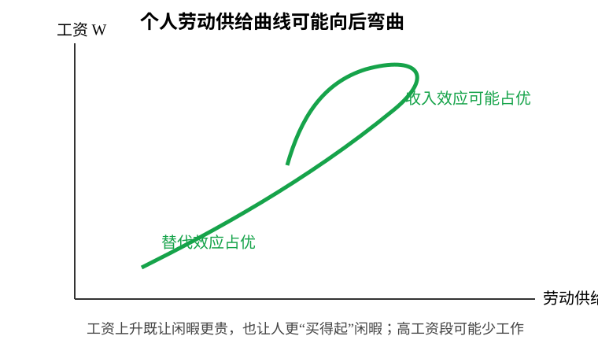

- 工资较低时，替代效应通常大于收入效应，工资上升使劳动供给增加。
- 工资很高时，收入效应可能超过替代效应，工资上升反而使劳动供给减少。
- 因此个人劳动供给曲线可能向后弯曲。
- 市场劳动供给曲线不一定向后弯曲，因为高工资会吸引新劳动者进入。

工资决定：

- 劳动需求曲线向右下方倾斜。
- 劳动供给曲线通常向右上方倾斜。
- 二者交点决定均衡工资和劳动数量。

工资差异的原因：

```text
W = P × MPL
```

不同劳动者的边际产出不同，或产品价格不同，会导致工资差异。人力资本、特殊技能、行业差异都会影响 `VMP`。

### 5. 土地与地租

土地通常指自然资源，其显著特点是数量有限。

若土地没有自用价值，土地服务供给固定不变，供给曲线垂直。

地租由土地需求决定：

- 土地供给固定。
- 土地需求曲线向右下方倾斜。
- 地租产生的根本原因是土地稀缺和供给固定。
- 直接原因是土地需求。

若土地需求下降到足够低，地租可能为零。

### 6. 资本与利息

资本是经济制度生产出来，并作为投入要素用于进一步生产的物品。

资本有两类价格：

- 资本本身的市场价格。
- 资本服务的价格，即利率。

资本供给可理解为储蓄决策，即在当前消费和未来消费之间选择。

利率上升的影响：

- 提高储蓄回报，鼓励储蓄。
- 但在很高利率下，也可能因收入效应使储蓄减少。

因此贷款或资本供给曲线一般向右上方倾斜，但也可能向后弯曲。

资本市场均衡：

- 短期资本数量固定，短期供给曲线垂直。
- 资本需求曲线向右下方倾斜。
- 长期均衡要求储蓄等于折旧。

### 7. 垄断条件下的要素市场

产品卖方垄断、要素买方竞争：

- 企业在产品市场有垄断势力，`MR < P`。
- 在要素市场是竞争买者，`MFC = W`。
- 要素使用原则：

```text
MRP = W
```

- 由于 `MRP = MR × MP`，其要素需求曲线与 `MRP` 曲线重合。

要素买方垄断、产品卖方竞争：

- 企业购买要素数量会影响要素价格，`W = W(L)` 且 `W' > 0`。
- 边际要素成本 `MFC` 高于要素供给曲线。
- 产品市场竞争，所以 `MR = P`，要素边际收益为 `VMP`。
- 要素使用原则：

```text
VMP = MFC
```

买方垄断没有稳定的要素需求曲线。原因与垄断企业没有商品供给曲线类似：要素价格与最优要素使用量之间不存在稳定的一一对应关系。

---

## 第八章：市场失灵和微观经济政策

### 1. 本章主线

市场失灵是指市场机制不能有效发挥作用，难以实现帕累托效率。主要原因包括垄断、外部性、公共物品和公共资源、信息不完全和不对称。广义市场失灵还包括收入分配不平等。

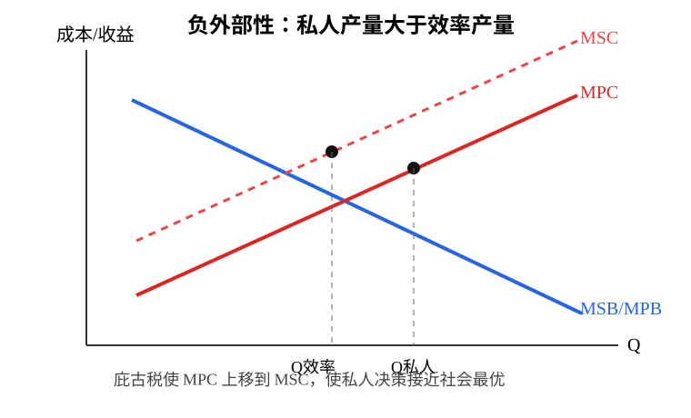

### 2. 垄断与低效率

垄断均衡满足：

```text
MR = MC < P
```

因此价格高于边际成本，存在福利改善空间，不满足帕累托效率。

与完全竞争相比，垄断通常：

- 价格更高。
- 产量更低。
- 消费者剩余减少。
- 产生无谓损失。

完全价格歧视下可能达到 `P = MC` 的效率结果，但现实中难以完全实现。

寻租：

- 租金是超过要素供给所需最低报酬的收入。
- 企业为获得或维持垄断地位而消耗资源，就是寻租。
- 寻租不创造价值，还会加重社会成本。

垄断管制：

- 边际成本定价：`P = MC`，效率较高，但若自然垄断中 `P < AC`，企业亏损，需要补贴。
- 平均成本定价：`P = AC`，企业不亏损，但通常仍未达到帕累托最优。
- 反垄断政策：限制反竞争协议、独家经营、兼并垄断等。

### 3. 外部性

外部性是一个经济主体的行为对未参与交易的第三方产生影响，且这种影响没有通过市场价格反映。

类型：

- 生产正外部性：如果园给养蜂者带来收益。
- 生产负外部性：如工厂污染河流。
- 消费正外部性：如邻居从花园美化中受益。
- 消费负外部性：如噪音扰民。

核心关系：

- 私人成本 `MPC`。
- 社会成本 `MSC`。
- 私人收益 `MPB`。
- 社会收益 `MSB`。

效率要求：

```text
MSB = MSC
```

负外部性：

- 若 `MSC > MPC` 或 `MSB < MPB`。
- 私人产量大于社会有效产量。
- 结论：产量太多。

正外部性：

- 若 `MSB > MPB` 或 `MSC < MPC`。
- 私人产量小于社会有效产量。
- 结论：产量太少。

纠正政策：

- 行政命令：排放标准、产量限制、强制使用清洁技术。
- 庇古税：对负外部性征税，使私人边际成本上升到社会边际成本。
- 补贴：对正外部性补贴，使私人收益接近社会收益。

科斯定理：

在产权清晰、交易成本足够低时，无论产权最初如何分配，私人协商都能使外部性内部化，达到有效率结果。

限制：

- 交易成本高时，协商难以达成。
- 参与者过多时，谈判困难。
- 产权界定本身可能需要政府。

### 4. 公共物品和公共资源

物品分类依据：排他性和竞争性。

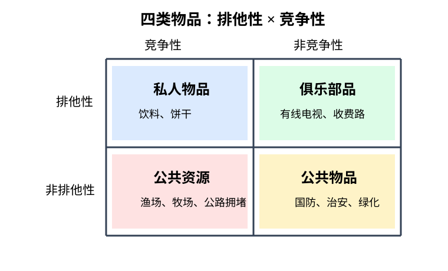

| 类型 | 排他性 | 竞争性 | 例子 |
| --- | --- | --- | --- |
| 私人物品 | 有 | 有 | 饮料、饼干 |
| 俱乐部物品 | 有 | 无或弱 | 有线电视、不拥挤收费公路 |
| 公共资源 | 无 | 有 | 渔业资源、牧场、公共道路拥堵时 |
| 公共物品 | 无 | 无 | 国防、治安、绿化 |

公共物品问题：

- 非排他性导致搭便车。
- 非竞争性意味着一个人使用不减少别人使用。
- 私人市场难以有效供给。

公共物品政策：

- 政府提供。
- 成本收益分析决定是否提供以及提供规模。
- 当边际收益大于边际成本时，可以扩大公共项目；当边际收益低于边际成本时，应停止扩张。

公共资源问题：

- 非排他性导致免费使用。
- 竞争性导致使用过度。
- 典型现象是公地悲剧。

公共资源政策：

- 管制：禁渔期、限额、许可证。
- 征税或收费：提高使用成本。
- 界定产权：承包制、牧场产权、排污权等。

### 5. 信息不完全和信息不对称

信息不完全：交易者缺乏足够信息，导致生产和交易盲目，从而市场失灵。

质量信息不完全时，消费者可能根据价格推断质量，使需求曲线出现异常形态。

信息不对称：交易双方掌握的信息不相同，一方拥有信息优势，另一方处于信息劣势。

例子：

- 餐饮业：商家更知道食品卫生状况。
- 劳动市场：求职者更知道自身能力。
- 信贷市场：借款人更知道还款风险。
- 保险市场：投保人更知道自身风险。

逆向选择：

- 交易前的信息不对称。
- 信息优势一方更可能带来不利交易对象。
- 结果可能是好产品、低风险者退出市场，市场萎缩甚至消失。

道德风险：

- 交易后的信息不对称。
- 一方在交易后采取对另一方不利但难以观察的行为。
- 如买保险后降低防盗努力。

市场应对机制：

- 发信号：信息优势方主动传递信息，如学历、证书、品牌、名片。
- 甄别：信息劣势方设计机制区分类型，如保险免赔额、不同合同菜单。
- 效率工资：企业支付高于市场工资，以吸引高能力者并提高偷懒成本。

政府政策：

- 强制真实、充分的信息披露。
- 建立质量标准。
- 检验检疫。
- 证券市场信息披露制度。

### 6. 收入分配不平等

收入分配不平等可视为广义市场失灵。

洛伦兹曲线：

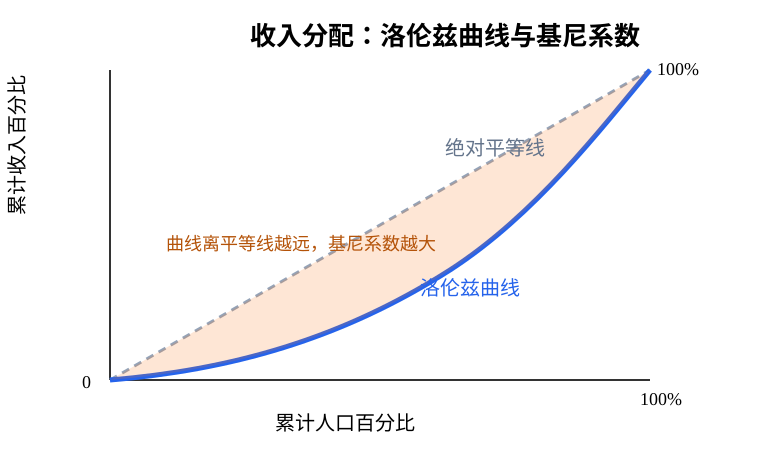

- 将人口按收入从低到高排序。
- 横轴表示累计人口百分比。
- 纵轴表示累计收入百分比。
- 越接近 45 度线，收入分配越平等。
- 越远离 45 度线，收入分配越不平等。

基尼系数：

```text
G = A / (A + B)
```

其中 `A` 为平等线与洛伦兹曲线之间面积，`B` 为洛伦兹曲线以下面积。

含义：

- `G = 0`：绝对平均。
- `G = 1`：绝对不平等。
- 通常 `0.4` 被视为警戒线。

常见区间：

- `0.2` 以下：高度平均。
- `0.2 - 0.4`：基本合理。
- `0.4 - 0.5`：差距较大。
- `0.5 - 0.6`：差距悬殊。
- `0.6` 以上：高度不平均。

收入再分配政策：

- 社会保障制度。
- 现金转移支付。
- 实物转移支付，如医疗、食品、住房援助。

注意：再分配政策可以缓解贫困，但不一定能从根本上解决贫困；还需要权衡公平与效率。

---

## 总复习：高频公式与判断

### 1. 均衡与弹性

```text
Qd = Qs
Ed = (ΔQ/Q) / (ΔP/P)
TR = P × Q
```

- 需求富有弹性：降价增收，涨价减收。
- 需求缺乏弹性：降价减收，涨价增收。
- 税负由弹性较小的一方承担更多。

### 2. 消费者选择

```text
Px x + Py y = I
MRSxy = MUx / MUy
MUx / Px = MUy / Py
```

- 一般均衡看切点。
- 完全互补看固定比例。
- 完全替代可能看角点。

### 3. 生产与成本

```text
AP = TP/L
MP = dTP/dL
TC = FC + VC
AC = TC/Q
AVC = VC/Q
AFC = FC/Q
MC = dTC/dQ
MC = w/MPL
```

- `MC` 穿过 `AVC`、`AC` 最低点。
- 短期合理生产区间通常是第 II 阶段。

### 4. 市场结构

```text
完全竞争：P = MR = MC
垄断：MR = MC，且 P > MR
垄断竞争长期：P > MC，经济利润为 0
```

- 垄断没有供给曲线。
- 寡头核心是相互依赖。
- 卡特尔容易因背约动机而不稳定。

### 5. 要素市场

```text
MRP = MR × MP
VMP = P × MP
完全竞争要素使用：VMP = W
卖方垄断要素使用：MRP = W
买方垄断要素使用：VMP = MFC
```

- 工资差异来自边际产品价值差异。
- 个人劳动供给曲线可能向后弯曲。
- 地租来自土地稀缺和供给固定。

### 6. 市场失灵

```text
效率条件：MSB = MSC
负外部性：私人产量 > 社会有效产量
正外部性：私人产量 < 社会有效产量
```

- 公共物品：非排他、非竞争，易搭便车。
- 公共资源：非排他、竞争，易过度使用。
- 逆向选择发生在交易前，道德风险发生在交易后。
- 科斯定理成立条件：产权清晰、交易成本足够低。
