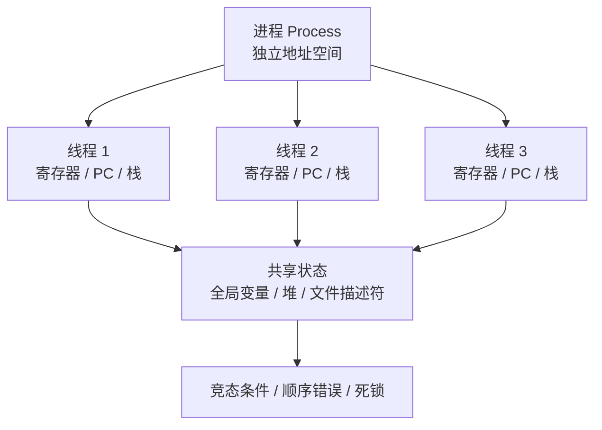
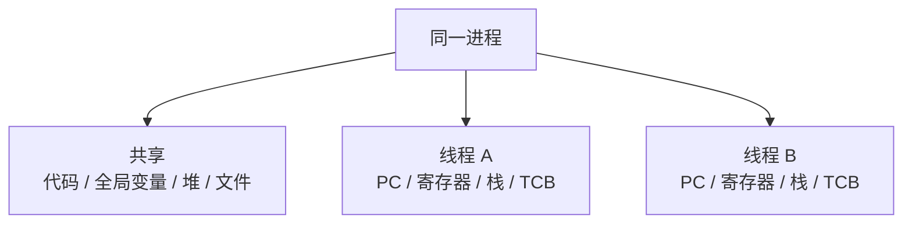
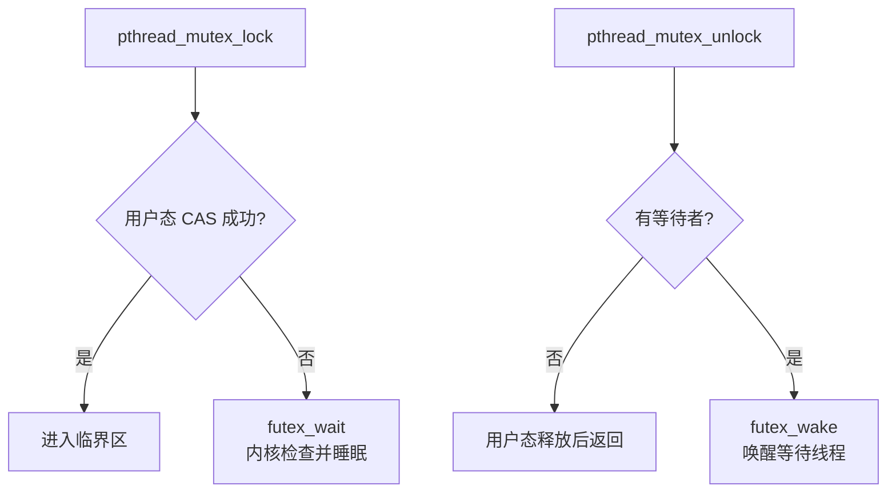
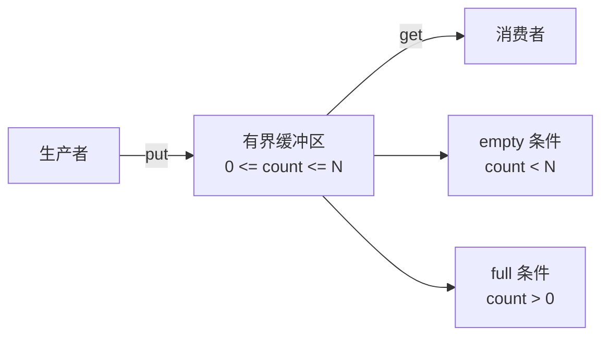
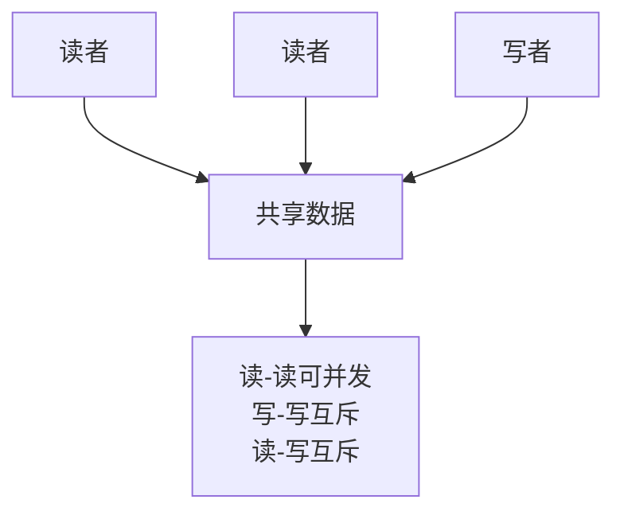
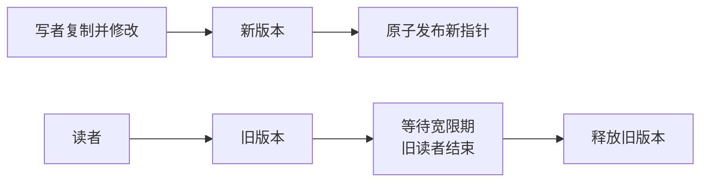

# 并发

> 来源：`3.[并发]多处理器编程.pdf`、`4.[并发]互斥.pdf`、`5.[并发]互斥_进阶.pdf`、`6.[并发]同步.pdf`、`7.[并发]同步_进阶.pdf`、`8.[并发]并发bugs.pdf`  
> 主线：操作系统和并发库把“多个执行流共享同一份状态”包装成可控的程序结构；互斥解决“不能同时做”的问题，同步解决“必须等条件成立再做”的问题，而并发 bug 和死锁则来自这些约束没有被正确表达。

## 1. 总览：并发到底难在哪里

并发的本质是：多个执行流在同一段时间内推进，并且可能共享内存、文件、设备或其他资源。



并发程序比顺序程序难，是因为“未来”的可能性太多：

1. 调度器可以在很多位置切换线程。
2. 一条高级语言语句常常会被编译成多条机器指令。
3. 编译器和处理器可能重排指令。
4. 多核处理器的缓存和内存模型会让不同核心看到的顺序不完全一样。

例子：`sum++` 看上去是一条语句，但实际至少包含读、加、写三步。两个线程同时执行时，可能都读到旧值，最后只加了一次。

并发部分可以分成四条线：

| 主线 | 核心问题 | 代表机制 |
| --- | --- | --- |
| 多线程编程 | 多个执行流如何共享一个进程的资源 | Pthread、TCB、共享地址空间 |
| 互斥 | 如何保证临界区一次只有一个线程进入 | 锁、原子指令、自旋锁、futex |
| 同步 | 如何让线程等待某个条件成立 | 条件变量、信号量、生产者消费者 |
| 并发问题 | 程序为什么会卡死或结果错误 | 原子性违反、顺序违反、死锁、饥饿、活锁 |

一个统一的理解方式：

1. **线程**提供并发执行的基本单位。
2. **锁**保护共享数据，避免不该同时发生的访问。
3. **条件变量和信号量**表达线程之间的等待关系。
4. **经典同步问题**训练我们把真实需求翻译成状态、条件和唤醒。
5. **并发 bug**提醒我们：只要漏掉一个状态或顺序约束，程序就可能在少见调度下失败。

## 2. 多处理器编程与线程

### 2.1 为什么要学多处理器编程

单核时代，程序员常常可以指望处理器频率提升带来性能提升。但频率提升遇到功耗和散热瓶颈后，硬件主要通过增加核心数继续提升吞吐量。

这意味着：

1. 想利用硬件性能，程序需要并行。
2. 多个核心会真正同时执行代码。
3. 共享内存上的错误不再只是“时间片切换”造成，也可能来自真实的同时访问。

### 2.2 线程的存储结构

线程可以理解为：共享同一进程地址空间的执行流。

| 内容 | 是否共享 | 说明 |
| --- | --- | --- |
| 代码段 | 共享 | 同一进程内线程执行同一份程序代码 |
| 全局变量 | 共享 | 容易产生竞态条件 |
| 堆 | 共享 | `malloc` 出来的对象可被多个线程访问 |
| 打开的文件 | 共享 | 文件偏移、文件表项可能成为共享状态 |
| 寄存器 / PC | 私有 | 每个线程有自己的执行位置 |
| 栈 | 私有 | 每个线程有自己的函数调用链 |
| TCB | 私有 | 线程控制块记录线程元信息 |



状态机视角：每个线程都是一个状态机。调度器每次选择一个线程走一步，而这一步可能改变其他线程随后看到的共享状态。

### 2.3 Pthread 基本 API

| API | 作用 | 关键点 |
| --- | --- | --- |
| `pthread_create` | 创建线程 | 传入线程号、属性、入口函数、参数 |
| `pthread_join` | 等待线程结束并回收资源 | 类似进程中的 `wait` |
| `pthread_exit` | 结束当前线程 | 可向 `join` 者传回返回值 |
| `pthread_detach` | 设置线程结束后自动回收 | detach 后不能再 `join` |
| `sched_yield` / `pthread_yield` | 主动让出 CPU | 只是建议调度器运行别人，不保证同步 |

线程入口函数必须形如：

```c
void *thread_work(void *arg);
```

一个最小例子：

```c
#include <pthread.h>
#include <stdio.h>

void *thread_work(void *arg) {
    char *name = (char *)arg;
    printf("thread %s is running\n", name);
    return "done";
}

int main() {
    pthread_t t;
    void *ret;

    pthread_create(&t, NULL, thread_work, "A");
    pthread_join(t, &ret);

    printf("thread returned: %s\n", (char *)ret);
    return 0;
}
```

编译时通常需要链接 pthread：

```bash
gcc demo.c -o demo -pthread
```

## 3. 并发程序的三个基本风险

### 3.1 原子性丧失

原子性要求一段操作要么完整发生，要么完全不发生；中间状态不能被其他线程观察或干扰。

典型错误：

```c
sum++;
```

可能被拆成：

```text
load sum -> register
register = register + 1
store register -> sum
```

如果两个线程交错执行，就可能丢失一次更新。

解决思路：用锁或原子指令把“读-改-写”包成不可分割的临界区。

### 3.2 顺序性丧失

有些程序隐含假设：“语句 S2 一定在 S1 之后执行”。但在并发中，如果没有同步关系，另一个线程可能先看到 S2 的效果，或者根本看不到 S1 的效果。

典型错误：

```c
// T1
data = 42;
ready = 1;

// T2
while (!ready) ;
printf("%d\n", data);
```

如果编译器或 CPU 重排，或者没有合适的内存可见性保证，`T2` 可能看到 `ready == 1` 却没看到正确的 `data`。

解决思路：用锁、条件变量、信号量或内存屏障建立 happens-before 关系。

### 3.3 全局一致性丧失

多处理器上，每个核心都有缓存和写缓冲。硬件内存模型不一定保证所有核心看到完全一致的访存顺序。

例子：

```c
int x = 0, y = 0;

// T1
x = 1;
int r1 = y;

// T2
y = 1;
int r2 = x;
```

在弱内存模型或带写缓冲的模型中，可能出现两个线程都读到 `0` 的结果。直觉上的“总得有一个先写完”并不总能直接套用到现代处理器。

解决思路：不要依赖裸共享变量表达同步；使用语言和系统提供的同步原语。

## 4. 互斥：让临界区一次只进一个线程

### 4.1 基本概念

| 概念 | 含义 |
| --- | --- |
| 临界区 critical section | 访问共享资源的一段代码 |
| 竞态条件 race condition | 多个线程以不受控顺序访问共享状态，导致结果依赖调度 |
| 互斥 mutual exclusion | 任意时刻最多一个线程在临界区 |
| 活性 liveness | 好事终将发生，例如等待的线程最终能前进 |
| 安全性 safety | 坏事不会发生，例如两个线程不会同时进入临界区 |
| 有界等待 bounded waiting | 想进入临界区的线程不会无限期排队 |

临界区解决方案通常要满足：

1. **互斥**：临界区内最多一个线程。
2. **行进**：如果临界区为空且有人想进入，最终有人能进入。
3. **有界等待**：一个线程不会永远被别人插队。

### 4.2 为什么简单标志位不行

错误尝试：

```c
int flag = 0;

void lock() {
    while (flag == 1)
        ;
    flag = 1;
}

void unlock() {
    flag = 0;
}
```

失败原因：`while (flag == 1)` 和 `flag = 1` 不是一个原子操作。两个线程可能同时看到 `flag == 0`，然后都进入临界区。

### 4.3 关中断为什么不通用

在单处理器内核中，关闭中断可以避免当前 CPU 被中断打断，从而保护一小段内核临界区。

但它不是通用方案：

1. 用户态程序不能随意关中断。
2. 多处理器上，关掉本 CPU 中断不能阻止其他 CPU 同时访问共享数据。
3. 如果关中断后死循环，系统可能失去响应。
4. NMI 等不可屏蔽中断仍可能打断执行。

### 4.4 Peterson 算法

Peterson 算法是两个线程的软件互斥算法。核心思想是：既记录“我想进”，也记录“冲突时我让谁先进”。

```c
int intent[2] = {0, 0};
int turn = 0;

void lock(int self) {
    int other = 1 - self;
    intent[self] = 1;
    turn = other;
    while (intent[other] && turn == other)
        ;
}

void unlock(int self) {
    intent[self] = 0;
}
```

理解重点：

1. `intent[self] = 1` 表示自己想进入。
2. `turn = other` 表示发生冲突时先让对方。
3. 如果双方都想进，`turn` 只会偏向其中一个，另一个等待。

它适合教学理解互斥条件，但现实系统通常依赖硬件原子指令和同步库。

### 4.5 硬件原子指令

现代 CPU 提供原子读-改-写指令，用来实现锁。

| 原子操作 | 思路 |
| --- | --- |
| Test-And-Set | 原子地把变量设为 1，并返回旧值 |
| Compare-And-Swap / Compare-And-Exchange | 如果当前值等于期望值，就替换成新值 |
| Fetch-And-Add | 原子地加一个数，并返回旧值 |
| LL/SC | 先链接读，后条件写；如果期间被别人改过则写失败 |

基础自旋锁：

```c
typedef struct lock {
    int locked;
} lock_t;

void lock(lock_t *lk) {
    while (__sync_lock_test_and_set(&lk->locked, 1) == 1)
        ;
}

void unlock(lock_t *lk) {
    __sync_lock_release(&lk->locked);
}
```

自旋锁适合临界区很短、等待时间很短的场景。若持锁线程被调度走，其他线程会白白烧 CPU。

## 5. 互斥进阶：公平性、内核锁与 Futex

### 5.1 Ticket Lock：用排队解决饥饿

普通自旋锁不能保证公平：锁释放时，谁抢到取决于调度和时序，某些线程可能长期抢不到。

Ticket Lock 像排队叫号：

```c
typedef struct lock_ticket {
    int ticket;
    int turn;
} lock_t;

void lock(lock_t *lk) {
    int myturn = __sync_fetch_and_add(&lk->ticket, 1);
    while (lk->turn != myturn)
        ;
}

void unlock(lock_t *lk) {
    __sync_fetch_and_add(&lk->turn, 1);
}
```

| 字段 | 含义 |
| --- | --- |
| `ticket` | 下一个要发出的号码 |
| `turn` | 当前允许进入临界区的号码 |

优点是先来先服务，缺点是等待者仍然在自旋。

### 5.2 内核自旋锁与中断

内核中有一个特殊风险：中断处理程序可能也需要同一把锁。

危险场景：

1. 普通内核代码拿到自旋锁。
2. 当前 CPU 上发生中断。
3. 中断处理程序也尝试拿同一把锁。
4. 中断处理程序一直自旋，但持锁代码已被中断打断，无法释放锁。

结果：当前 CPU 死锁。

因此内核自旋锁常常要配合本地关中断。正确做法不是简单地“关中断、开中断”，而是保存原来的中断状态，并处理嵌套关中断。

```c
void acquire(spinlock_t *lk) {
    push_off();   // 保存并关闭本地中断，记录嵌套层数
    while (__sync_lock_test_and_set(&lk->locked, 1) == 1)
        ;
}

void release(spinlock_t *lk) {
    __sync_lock_release(&lk->locked);
    pop_off();    // 嵌套层数归零后，按原状态恢复中断
}
```

### 5.3 从自旋到阻塞

用户态锁有三种典型形态：

| 方案 | 拿不到锁时 | 优点 | 问题 |
| --- | --- | --- | --- |
| 自旋 | 一直循环检查 | 临界区很短时快 | 浪费 CPU |
| yield | 主动让出 CPU | 减少空转 | 可能造成大量上下文切换 |
| sleep/wakeup | 阻塞等待，释放时唤醒 | 不浪费 CPU | 必须避免唤醒丢失 |

唤醒丢失的典型竞态：

1. 线程 A 发现锁被占用，准备睡眠。
2. 线程 B 释放锁并发出唤醒。
3. A 还没真正睡下，所以错过唤醒。
4. A 随后睡眠，可能再也没人唤醒它。

### 5.4 Futex：快路径在用户态，慢路径进内核

Linux futex（Fast Userspace Mutex）的核心思想是“两阶段锁”：

1. **无竞争时**：在用户态用原子指令直接拿锁，不进内核。
2. **有竞争时**：调用 `futex_wait` 进入内核睡眠。
3. **释放时如有等待者**：调用 `futex_wake` 唤醒等待线程。

关键点：`futex_wait(addr, expected)` 会在内核中原子地检查 `*addr == expected`，只有条件仍成立才睡眠，因此避免“检查后准备睡眠”和“真正睡眠”之间的唤醒丢失。



日常使用 `pthread_mutex_lock/unlock` 即可，不需要手写 futex。

### 5.5 锁粒度与并发数据结构

锁不仅要正确，还要有合适的粒度。

| 锁粒度 | 做法 | 优点 | 缺点 |
| --- | --- | --- | --- |
| 粗粒度锁 | 一把锁保护整个数据结构 | 简单、容易正确 | 并发度低 |
| 细粒度锁 | 不同部分用不同锁保护 | 并发度高 | 容易死锁，设计复杂 |
| 分层/近似方案 | 本地状态批量同步到全局状态 | 减少争用 | 读取值可能不是完全实时 |

Sloppy Counter 的思路：每个 CPU 有本地计数器和本地锁，本地达到阈值后再合并到全局计数器。

```c
typedef struct counter_approx {
    int global;
    pthread_mutex_t global_lock;
    int local[NUM_CPUS];
    pthread_mutex_t local_lock[NUM_CPUS];
    int threshold;
} counter_approx_t;
```

它牺牲了一点实时精确性，换取更高吞吐。

## 6. 同步：让线程等到条件成立

### 6.1 互斥和同步的区别

互斥关注“不能同时做”，同步关注“什么时候可以做”。

| 问题 | 例子 | 常用机制 |
| --- | --- | --- |
| 互斥 | 两个线程不能同时修改链表 | mutex、spinlock |
| 同步 | 缓冲区空时消费者必须等待 | condition variable、semaphore |
| 顺序控制 | `B` 必须在 `A` 完成后执行 | join、信号量、条件变量 |

`pthread_join` 就是一种同步：主线程必须等子线程结束后才能继续。

### 6.2 生产者消费者问题

生产者消费者问题是同步的核心例子：

1. 生产者向有界缓冲区放数据。
2. 消费者从有界缓冲区取数据。
3. 缓冲区满时生产者必须等待。
4. 缓冲区空时消费者必须等待。
5. 修改缓冲区本身必须互斥。



### 6.3 条件变量

条件变量用于等待某个共享状态满足条件。它本身不保存条件，真正的条件必须由共享变量表达。

Pthread API：

| API | 作用 |
| --- | --- |
| `pthread_cond_init` | 初始化条件变量 |
| `pthread_cond_wait` | 释放 mutex 并睡眠；醒来后重新获得 mutex |
| `pthread_cond_signal` | 唤醒一个等待线程 |
| `pthread_cond_broadcast` | 唤醒所有等待线程 |
| `pthread_cond_destroy` | 销毁条件变量 |

使用条件变量的标准模式：

```c
pthread_mutex_lock(&m);
while (!condition) {
    pthread_cond_wait(&cv, &m);
}
// condition 为真，执行受保护操作
pthread_mutex_unlock(&m);
```

必须用 `while`，不是 `if`：

1. 被唤醒不代表条件一定仍然成立。
2. 可能被错误唤醒或虚假唤醒。
3. 多个等待者被唤醒后，先运行的线程可能已经消耗条件。

### 6.4 用条件变量解决生产者消费者

有界缓冲区通常需要两个条件变量：

| 条件变量 | 谁等待 | 条件 |
| --- | --- | --- |
| `not_full` | 生产者 | `count < N` |
| `not_empty` | 消费者 | `count > 0` |

```c
pthread_mutex_t m = PTHREAD_MUTEX_INITIALIZER;
pthread_cond_t not_full = PTHREAD_COND_INITIALIZER;
pthread_cond_t not_empty = PTHREAD_COND_INITIALIZER;

void put(item_t x) {
    pthread_mutex_lock(&m);
    while (count == N) {
        pthread_cond_wait(&not_full, &m);
    }
    buffer[in] = x;
    in = (in + 1) % N;
    count++;
    pthread_cond_signal(&not_empty);
    pthread_mutex_unlock(&m);
}

item_t get() {
    pthread_mutex_lock(&m);
    while (count == 0) {
        pthread_cond_wait(&not_empty, &m);
    }
    item_t x = buffer[out];
    out = (out + 1) % N;
    count--;
    pthread_cond_signal(&not_full);
    pthread_mutex_unlock(&m);
    return x;
}
```

经验法则：

1. 条件变量必须配合互斥锁使用。
2. 共享状态和条件变量操作要受同一把锁保护。
3. 等待条件要写成 `while`。
4. 不同逻辑条件尽量使用不同条件变量。
5. 如果无法精确判断该唤醒谁，可以使用 `broadcast`，但会增加无效唤醒。

### 6.5 信号量

信号量可以理解为“带整数状态的同步原语”。

| 操作 | 常见名字 | 含义 |
| --- | --- | --- |
| `P` | `sem_wait` / down | 如果值大于 0 就减 1 继续；否则阻塞 |
| `V` | `sem_post` / up | 值加 1；如果有人等待就唤醒一个 |

Pthread/POSIX API：

```c
#include <semaphore.h>

sem_t sem;
sem_init(&sem, 0, initial_value);
sem_wait(&sem);
sem_post(&sem);
sem_destroy(&sem);
```

信号量的几种含义：

| 初值 | 用法 |
| --- | --- |
| `1` | 二值信号量，可当互斥锁 |
| `0` | 表达“等待某事件发生” |
| `N` | 表达“最多 N 个资源可用” |

用信号量解决生产者消费者：

```c
sem_t empty;   // 空槽数，初值 N
sem_t full;    // 数据数，初值 0
sem_t mutex;   // 保护缓冲区，初值 1

void producer(item_t x) {
    sem_wait(&empty);
    sem_wait(&mutex);
    put_to_buffer(x);
    sem_post(&mutex);
    sem_post(&full);
}

item_t consumer() {
    sem_wait(&full);
    sem_wait(&mutex);
    item_t x = get_from_buffer();
    sem_post(&mutex);
    sem_post(&empty);
    return x;
}
```

注意顺序：要先等待资源数量（`empty/full`），再进入保护缓冲区的互斥区。若消费者先拿 `mutex` 再等 `full`，缓冲区为空时它会拿着锁睡眠，生产者无法进入缓冲区生产，导致死锁。

## 7. 同步进阶：经典问题

### 7.1 互斥锁、条件变量、信号量的关系

| 原语 | 擅长表达 | 不擅长之处 |
| --- | --- | --- |
| 互斥锁 | 保护临界区 | 不能单独表达复杂等待条件 |
| 条件变量 | 任意布尔条件 | 本身无记忆，必须配合共享状态 |
| 信号量 | 资源计数、顺序控制 | 复杂非整数条件不直观 |

条件变量更通用，信号量更简洁。不要因为一个原语能模拟另一个，就把所有问题都硬塞进去。

### 7.2 读者写者问题

读者写者问题的规则：

1. 多个读者可以同时读。
2. 写者和写者互斥。
3. 写者和读者互斥。



读者优先的基本思路：

1. 记录当前读者数量 `readers`。
2. 第一个读者进入时获取写锁，阻止写者。
3. 最后一个读者离开时释放写锁。
4. 写者进入时直接获取写锁。

这种实现简单，但如果读者源源不断，写者可能饥饿。

写者优先的改进：如果有写者等待，后来的读者先不要进入。这样保护写者，但如果写者源源不断，读者也可能饥饿。

公平读写锁：用队列或 ticket 思路，让读者和写者按到达顺序获得机会，避免一类线程长期压制另一类。

POSIX 提供了读写锁：

```c
pthread_rwlock_t rw;
pthread_rwlock_rdlock(&rw);  // 读锁
pthread_rwlock_wrlock(&rw);  // 写锁
pthread_rwlock_unlock(&rw);
```

### 7.3 RCU：读者几乎不阻塞

RCU（Read-Copy-Update）适合读多写少的数据结构。基本思想：

1. 读者不加传统锁，直接读当前版本。
2. 写者复制一份数据，在副本上修改。
3. 写者发布新版本，让后来的读者看到新数据。
4. 等旧读者都离开后，再释放旧版本。



RCU 的关键不是“写者不需要同步”，而是把写拆成发布新版本和回收旧版本两个阶段。难点在于判断所有旧读者已经结束，也就是宽限期。

### 7.4 哲学家就餐问题

问题设定：

1. N 个哲学家围成一圈。
2. 每两人之间一只筷子。
3. 每个人吃饭需要同时拿到左右两只筷子。

天真的方案：

```c
sem_wait(&forks[left(i)]);
sem_wait(&forks[right(i)]);
eat();
sem_post(&forks[right(i)]);
sem_post(&forks[left(i)]);
```

如果所有人同时拿起左边筷子，再等待右边筷子，就会形成死锁。

常见解决思路：

| 方案 | 做法 | 效果 |
| --- | --- | --- |
| 全局大锁 | 拿筷子前先拿一把全局锁 | 简单但并发度很低 |
| 限制人数 | 最多允许 `N - 1` 人同时尝试拿筷子 | 打破环路等待 |
| 资源编号排序 | 总是先拿编号小的筷子，再拿编号大的 | 打破循环等待 |
| 奇偶策略 | 奇数先拿左，偶数先拿右 | 降低同时等待同一方向的风险 |

哲学家问题的意义不在吃饭，而在训练我们识别“多个线程持有一部分资源、等待另一部分资源”的死锁结构。

## 8. 并发 Bug

### 8.1 现实中的并发问题

并发 bug 的危险在于：它们往往只在少数调度、少数负载、少数硬件时序下出现。

典型案例包括：

1. Therac-25 放疗设备事故：软件竞态使患者受到过量辐射。
2. 北美大停电：能源管理系统中的竞争条件触发连锁问题。
3. 大型系统中长期潜伏的并发 bug：代码可能运行多年才第一次遇到触发条件。

### 8.2 非死锁类 bug

经验研究常把大量非死锁并发 bug 分成两类：

| 类型 | 含义 | 典型修复 |
| --- | --- | --- |
| 原子性违反 Atomicity Violation | 本该连续执行的一段操作被其他线程插入 | 加锁扩大原子区 |
| 顺序违反 Order Violation | 本该先发生的操作没有先发生 | 条件变量、信号量、join、初始化屏障 |

原子性违反例子：

```c
if (ptr != NULL) {
    use(ptr);
}
```

如果另一个线程在检查后、使用前把 `ptr` 释放或置空，就会出错。修复方式通常是用锁保护“检查和使用”整个过程。

顺序违反例子：

```c
// T1
init(obj);
ready = 1;

// T2
if (ready) {
    use(obj);
}
```

如果没有同步，`T2` 可能在初始化真正完成前使用对象。修复方式是用条件变量、信号量或线程 join 明确等待初始化完成。

### 8.3 死锁

死锁是指一组线程互相等待，导致所有线程都无法继续。

最典型的二线程死锁：

```c
// T1
lock(A);
lock(B);

// T2
lock(B);
lock(A);
```

如果 `T1` 拿到 `A`，`T2` 拿到 `B`，它们之后都会等待对方释放锁。

死锁的四个必要条件：

| 条件 | 含义 | 破坏方式 |
| --- | --- | --- |
| 互斥 Mutual Exclusion | 资源不能同时被多个线程使用 | 尽量使用可共享资源，但很多锁天然互斥 |
| 持有并等待 Hold and Wait | 持有一个资源时继续等待其他资源 | 一次性申请全部资源，或失败后释放已持有资源 |
| 不可抢占 No Preemption | 资源不能被强制夺走 | 支持超时、撤销、回滚或抢占 |
| 循环等待 Circular Wait | 线程之间形成等待环 | 给资源全局排序，按固定顺序获取 |

死锁一定导致饥饿，但饥饿不一定是死锁。饥饿可能只是线程总抢不到机会，没有形成等待环。

### 8.4 死锁预防、避免、检测

处理死锁有三类策略：

| 策略 | 思路 | 例子 |
| --- | --- | --- |
| 预防 prevention | 从结构上破坏死锁必要条件 | 所有锁按全局顺序获取 |
| 避免 avoidance | 运行时避免进入不可挽回状态 | 银行家算法、安全状态判断 |
| 检测与恢复 detection/recovery | 允许死锁发生，再检测并处理 | 等待图找环，杀死或回滚线程 |

资源排序为什么有效：

如果所有线程都按同一个全局顺序获取锁，就不可能形成“我等编号更小的资源，而别人又等我手上编号更大的资源”的环。等待边只能朝一个方向走，无法回到起点。

### 8.5 活锁

活锁和死锁都关乎活性，但表现不同：

| 类型 | 状态 |
| --- | --- |
| 死锁 | 线程都不动了，互相等待 |
| 活锁 | 线程一直在动，但总是在互相避让，系统没有有效进展 |

例子：两个线程都发现冲突后释放资源、睡眠、重试。如果它们总是同时释放、同时醒来、同时重试，就可能一直失败。

随机退避可以降低活锁概率：

```c
while (!try_acquire_both()) {
    release_any_held();
    sleep(random_time());
}
```

## 9. 解题和写代码的检查清单

写并发程序时，可以按下面顺序检查：

1. **共享状态是什么**：哪些变量、数据结构、文件偏移会被多个线程访问？
2. **不变量是什么**：例如 `0 <= count <= N`、链表指针始终连通。
3. **谁保护状态**：每个共享状态对应哪把锁？
4. **等待条件是什么**：线程什么时候必须睡眠？什么时候能继续？
5. **谁负责唤醒**：状态改变后，应该 `signal` 还是 `broadcast`？
6. **是否用 `while` 重查条件**：醒来后条件可能已经不成立。
7. **锁顺序是否固定**：多个锁是否有全局顺序？
8. **是否拿锁睡眠**：等待信号量或 I/O 前，是否持有不该持有的锁？
9. **是否可能饥饿**：读者优先、写者优先、自旋锁抢占是否会让某类线程长期等待？
10. **是否依赖裸变量同步**：如果是，应该改用锁、条件变量、信号量或语言级原子操作。

考试或复习时抓住一句话：

> 互斥保护“共享状态的一致性”，同步表达“线程之间的先后条件”，死锁来自“持有一些资源并等待另一些资源”的环。
