# 持久化

> 来源：`13.[持久化]设备管理.pdf`、`14.[持久化]文件系统.pdf`  
> 主线：应用程序想保存数据，但不能直接乱写磁盘；操作系统通过设备驱动、块层、文件系统，把“原始存储设备”抽象成“文件和目录”。

## 1. 总览：持久化在操作系统中的位置

持久化要解决的问题是：程序结束、机器重启、断电之后，数据仍然存在。

在计算机系统中，持久化不是单独一层完成的，而是多层配合：

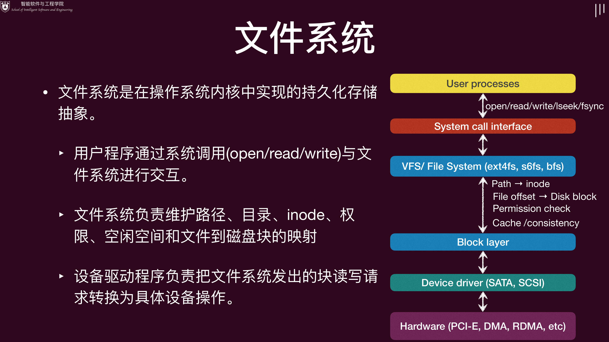

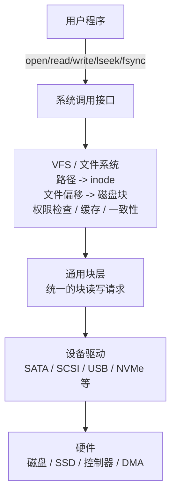
```mermaid
flowchart TD
    A["用户程序"] -->|"open/read/write/lseek/fsync"| B["系统调用接口"]
    B --> C["VFS / 文件系统<br/>路径 -> inode<br/>文件偏移 -> 磁盘块<br/>权限检查 / 缓存 / 一致性"]
    C --> D["通用块层<br/>统一的块读写请求"]
    D --> E["设备驱动<br/>SATA / SCSI / USB / NVMe 等"]
    E --> F["硬件<br/>磁盘 / SSD / 控制器 / DMA"]
```

这一层层抽象带来三个好处：

1. **安全**：应用不能直接把整块磁盘写坏。
2. **共享**：多个程序可以通过文件名共享同一份数据。
3. **独立**：文件系统不必关心底层到底是机械硬盘、SSD 还是其他块设备。

例子：你写 `printf("hello")` 到文件时，程序看到的是 `write(fd, buf, len)`；文件系统看到的是“向某个 inode 的某个偏移写入字节”；块层看到的是“写几个磁盘块”；设备驱动看到的是“向控制器寄存器发命令”；硬件看到的是“把电子或磁性状态改掉”。

## 2. I/O 设备与设备管理

### 2.1 设备类型

操作系统通常把设备分成两类：

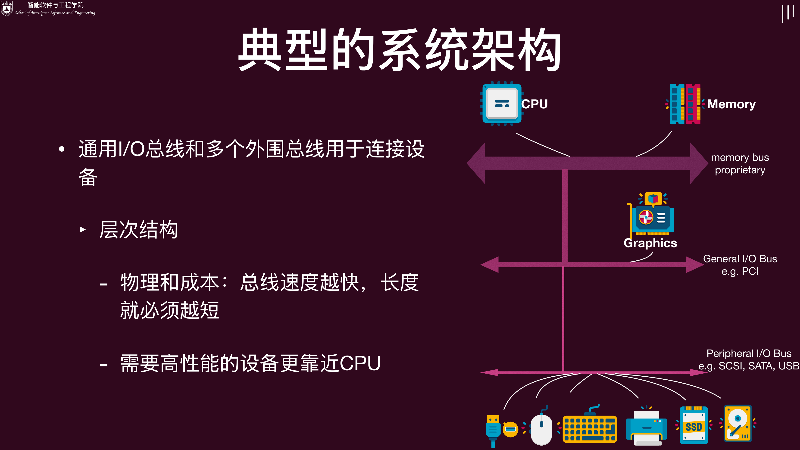

| 类型 | 特点 | 例子 |
| --- | --- | --- |
| 块设备 | 以固定大小的块保存信息，可以按块寻址 | 磁盘、SSD、U 盘 |
| 字符设备 | 传递字符流，不支持随机寻址 | 键盘、串口、终端 |

文件系统主要建立在**块设备**上，因为文件最终要落到一个个数据块里。

### 2.2 一个典型设备的结构

设备通常由两部分组成：

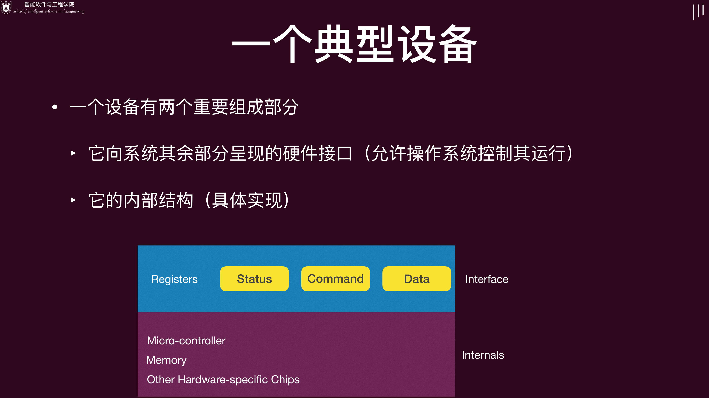

1. **硬件接口**：暴露给操作系统的寄存器。
2. **内部结构**：设备自己的控制器、缓存、芯片和机械或闪存结构。

常见寄存器：

| 寄存器 | 作用 |
| --- | --- |
| 状态寄存器 | OS 读取它，判断设备是否忙、是否完成、是否错误 |
| 命令寄存器 | OS 写入命令，要求设备读、写、复位等 |
| 数据寄存器 | OS 和设备之间交换数据 |

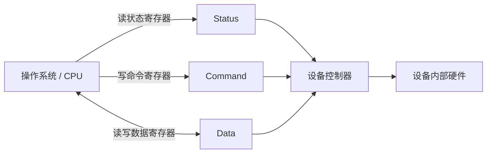
```mermaid
flowchart LR
    OS["操作系统 / CPU"] -->|"读状态寄存器"| S["Status"]
    OS -->|"写命令寄存器"| C["Command"]
    OS <-->|"读写数据寄存器"| D["Data"]
    S --> DEV["设备控制器"]
    C --> DEV
    D --> DEV
    DEV --> HW["设备内部硬件"]
```

例子：磁盘驱动要读一个扇区时，会先等待磁盘不忙，然后写入扇区号，再向命令寄存器写“读”命令，最后等中断通知完成。

### 2.3 CPU 如何访问设备寄存器

有两种方式：

| 方式 | 做法 | 特点 |
| --- | --- | --- |
| 端口映射 I/O | 给寄存器分配 I/O 端口号，用特殊指令访问，如 x86 的 `in/out` | 通常是特权指令，访问路径与内存分开 |
| 内存映射 I/O | 把寄存器映射到内存地址，用 `load/store` 访问 | 编程像访问内存，但必须小心缓存 |

**内存映射 I/O 的坑**：设备状态会变化，如果 CPU 把对应地址缓存起来，之后轮询读到的可能是缓存旧值，而不是设备真实状态。因此设备寄存器所在地址通常要禁用缓存。

### 2.4 轮询与中断

OS 发出 I/O 请求后，需要知道设备什么时候完成，有两种方式：

| 方式 | 思路 | 优点 | 缺点 |
| --- | --- | --- | --- |
| 轮询 polling | CPU 不断检查状态寄存器 | 简单、切换开销低 | 低速设备会浪费 CPU |
| 中断 interrupt | 设备完成后主动通知 CPU | CPU 不必干等 | 中断和上下文切换有开销 |

实际系统常常混合使用：短时间先轮询，时间长了就睡眠等中断。

例子：如果 SSD 很快，轮询几微秒可能比睡眠再被唤醒更划算；如果键盘输入很慢，让 CPU 一直检查键盘状态就很浪费。

### 2.5 Programmed I/O 与 DMA

数据传输可以由 CPU 或 DMA 控制。

| 方式 | 谁搬数据 | 特点 |
| --- | --- | --- |
| Programmed I/O | CPU 一字节或一字地搬 | 硬件简单，但数据越多越浪费 CPU |
| DMA | 设备控制器直接在设备和内存间搬 | CPU 只负责设置任务，完成后收中断 |

DMA 的典型流程：


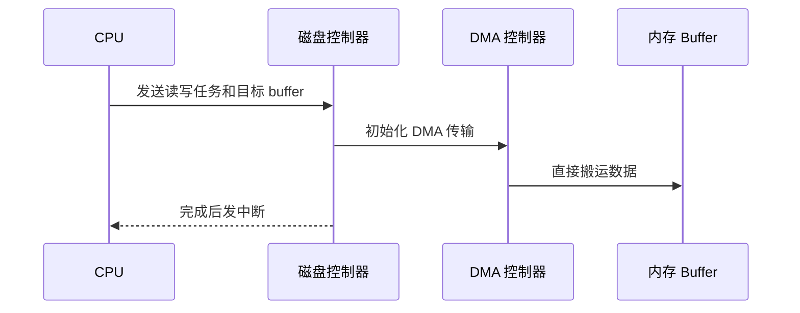
```mermaid
sequenceDiagram
    participant CPU
    participant Disk as 磁盘控制器
    participant DMA as DMA 控制器
    participant Mem as 内存 Buffer
    CPU->>Disk: 发送读写任务和目标 buffer
    Disk->>DMA: 初始化 DMA 传输
    DMA->>Mem: 直接搬运数据
    Disk-->>CPU: 完成后发中断
```

例子：读取 4 MB 文件时，如果每个字节都由 CPU 搬，CPU 会被 I/O 拖住；DMA 可以让 CPU 去运行其他线程，等数据到内存后再处理。

### 2.6 设备驱动：上半部和下半部

设备差异很大，所以内核用**设备驱动**屏蔽硬件细节。驱动通常分两部分：

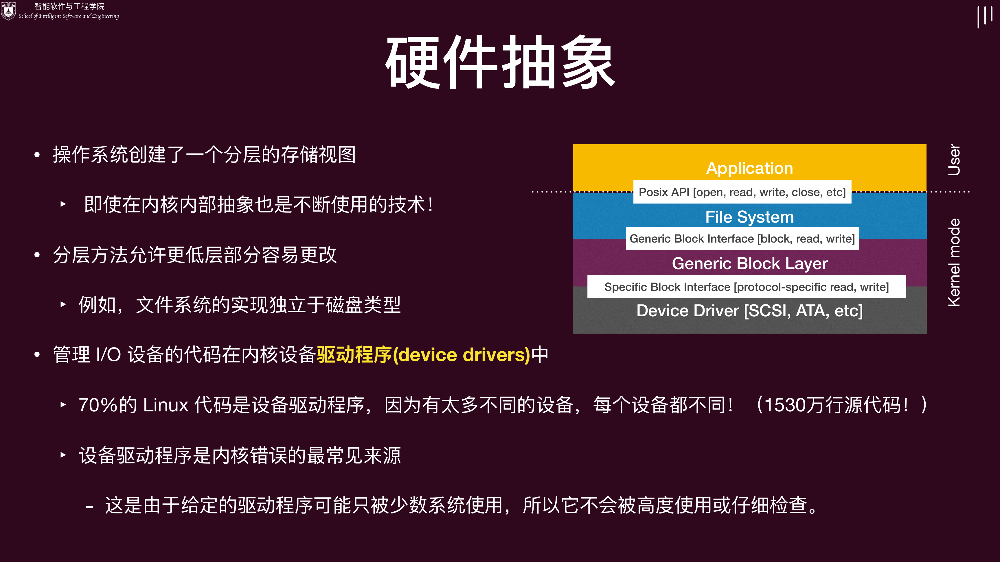

| 部分 | 运行时机 | 主要职责 |
| --- | --- | --- |
| 上半部 | 系统调用路径中 | 实现 `open/read/write/ioctl` 等接口，发起 I/O，请求未完成时让线程睡眠 |
| 下半部 | 中断处理路径中 | 处理设备完成事件，取回输入或发送下一块输出，唤醒等待线程 |

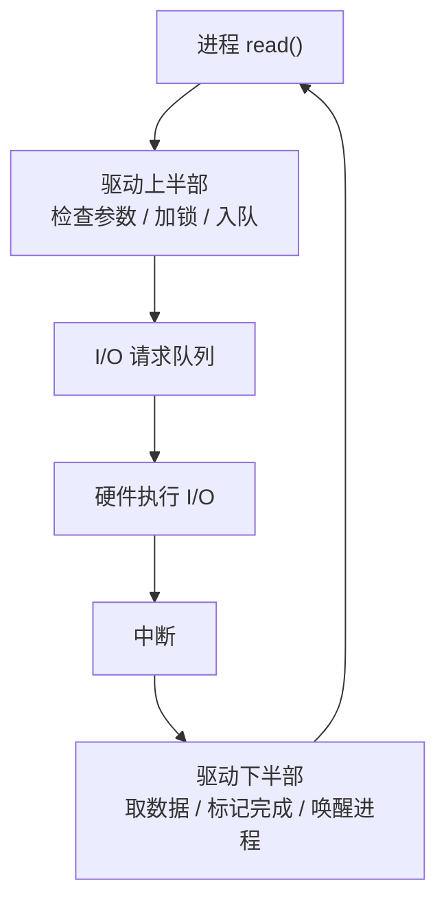
```mermaid
flowchart TD
    P["进程 read()"] --> U["驱动上半部<br/>检查参数 / 加锁 / 入队"]
    U --> Q["I/O 请求队列"]
    Q --> H["硬件执行 I/O"]
    H --> I["中断"]
    I --> L["驱动下半部<br/>取数据 / 标记完成 / 唤醒进程"]
    L --> P
```

例子：xv6 的 IDE 驱动会用锁保护请求队列。第一个请求直接启动磁盘；后续请求排队。中断到来后，驱动把读到的数据放进 buffer，标记 `B_VALID`，清除 `B_DIRTY`，再唤醒睡眠进程，并启动下一个请求。

## 3. 磁盘与 SSD

### 3.1 机械硬盘结构

机械硬盘由盘片、盘面、磁道、柱面、扇区、磁头和磁臂组成。

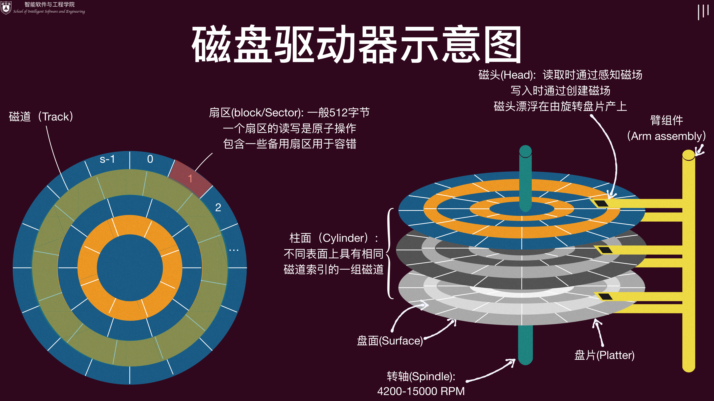

| 概念 | 含义 |
| --- | --- |
| 扇区 sector | 最小读写单位，传统上常见 512B；一个扇区读写通常视为原子操作 |
| 磁道 track | 同一盘面上的一圈扇区 |
| 柱面 cylinder | 多个盘面上半径相同的一组磁道 |
| 磁头 head | 读写磁性状态 |
| 磁臂 arm | 移动磁头到目标磁道 |

现代磁盘一般向 OS 暴露**逻辑块地址 LBA**，也就是 `0..N-1` 的线性编号。OS 不必知道真实的盘面、磁道、扇区位置。

### 3.2 磁盘访问时间

一次磁盘 I/O 的时间：

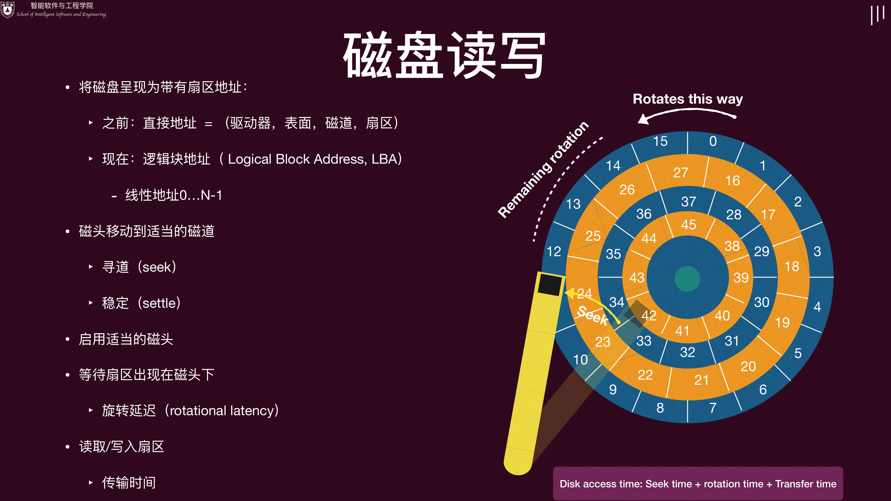

```text
T_IO = T_seek + T_rotation + T_transfer
```

| 部分 | 含义 |
| --- | --- |
| 寻道时间 `T_seek` | 磁头移动到目标磁道 |
| 旋转延迟 `T_rotation` | 等目标扇区转到磁头下 |
| 传输时间 `T_transfer` | 真正读写数据 |

例子：顺序读 100 MB 时，寻道和旋转只发生少量几次，主要时间花在传输上，所以吞吐高；随机读很多 4 KB 小块时，每次都可能寻道和等待旋转，所以吞吐会差很多。

### 3.3 磁盘布局优化

磁盘硬件和系统会做一些优化：

1. **磁道偏移 Track Skew**：跨磁道顺序读时，给下一个磁道的扇区编号做偏移，避免换道后错过下一个扇区。
2. **多区域 Multi-Zoned**：外圈磁道更长，能放更多扇区；磁盘按区域组织，每个区域内每条磁道扇区数相同。
3. **磁盘缓存**：磁盘控制器有小缓存。读一个扇区时可能顺便读整条磁道；写可以直写，也可以写回。

### 3.4 磁盘调度算法

磁盘 I/O 昂贵，调度目标是减少磁头移动。

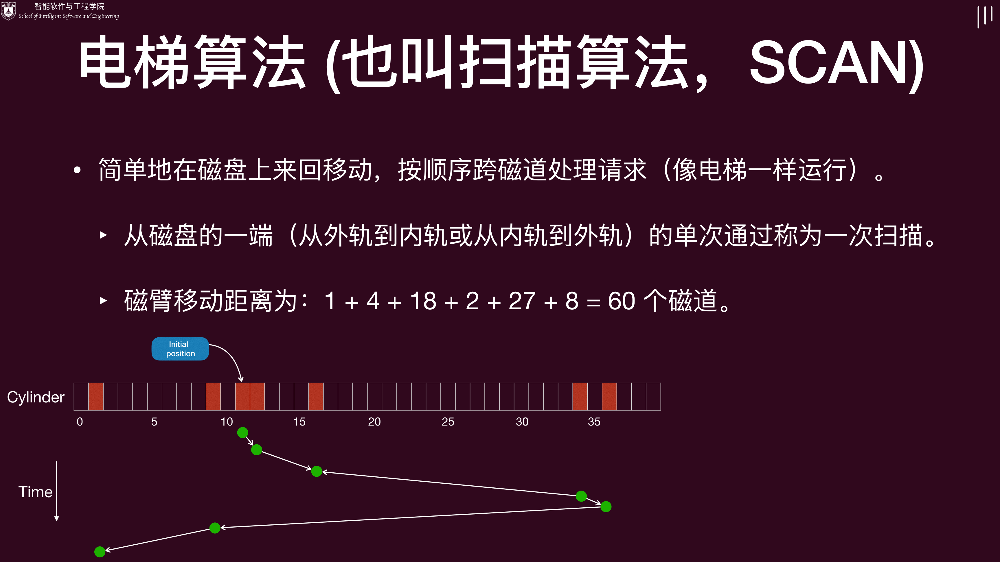

| 算法 | 思路 | 优点 | 问题 |
| --- | --- | --- | --- |
| FCFS | 按请求到达顺序处理 | 公平、简单、符合提交顺序 | 随机请求会导致大量寻道 |
| SSTF | 优先处理离当前磁头最近的请求 | 平均寻道小 | 远处请求可能饥饿 |
| SCAN / 电梯算法 | 磁头沿一个方向扫描，处理沿途请求，到头后反向 | 避免极端来回跳 | 实现比 FCFS 复杂 |
| F-SCAN | 扫描期间冻结当前队列，新请求进入下一轮 | 减轻饥饿 |
| C-SCAN | 只朝一个方向扫描，到头后回到起点 | 等待时间更均匀 |
| SPTF | 同时考虑寻道和旋转延迟 | 更接近真实最短定位时间 | OS 通常不知道磁头精确位置 |

例子：请求磁道序列是 `16, 12, 34, 9, 36, 1`，当前在 11。FCFS 会来回跳；SSTF 会先找近的 `12, 16, 9...`；SCAN 则像电梯一样沿一个方向服务沿途请求。

### 3.5 SSD 与 FTL

SSD 没有机械运动部件，所以没有寻道和旋转延迟，随机访问比机械硬盘快得多。但 SSD 有新问题：

1. 闪存页可以读写，但擦除通常以更大的块为单位。
2. 一个块擦除次数有限，会磨损。
3. 覆盖写很贵，通常不能像磁盘那样原地改。

SSD 通过 **FTL（Flash Translation Layer，闪存转换层）**解决：

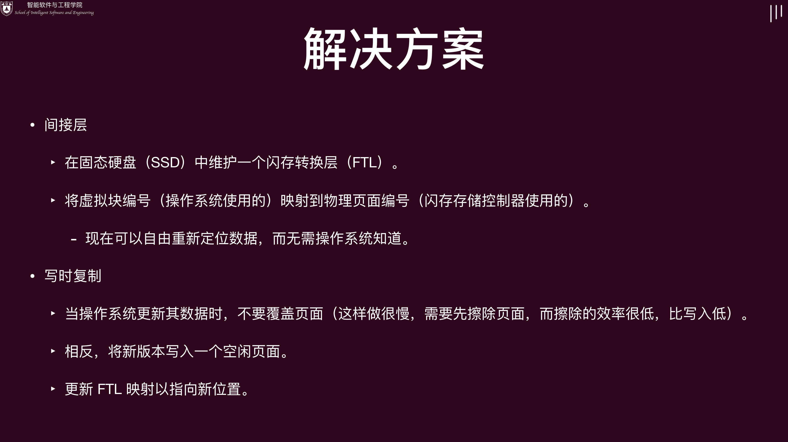

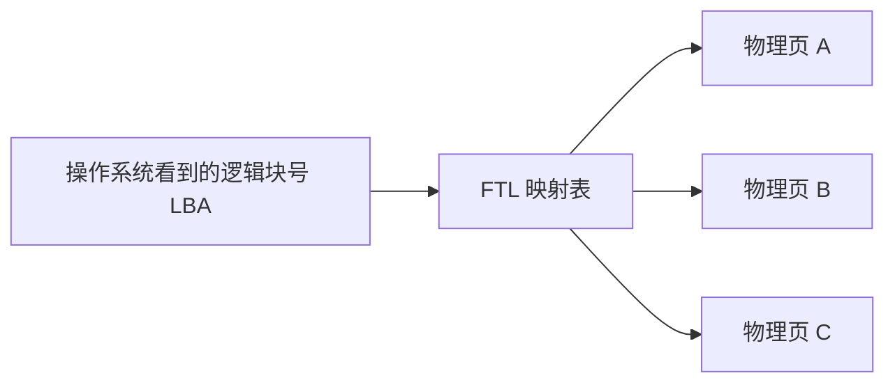
```mermaid
flowchart LR
    OS["操作系统看到的逻辑块号 LBA"] --> FTL["FTL 映射表"]
    FTL --> P1["物理页 A"]
    FTL --> P2["物理页 B"]
    FTL --> P3["物理页 C"]
```

FTL 的关键策略：

| 策略 | 含义 |
| --- | --- |
| 间接映射 | 把 OS 的逻辑块号映射到真实物理页 |
| 写时复制 | 更新数据时写到新空闲页，不原地覆盖 |
| 磨损均衡 | 让写入分散到不同块，避免某些块过早坏掉 |
| 垃圾回收 | 回收旧版本页所在的块，擦除后加入空闲列表 |

例子：你删除照片后，文件系统可能认为空间空了，但 SSD 旧物理页可能还保留数据，直到后台垃圾回收和擦除发生。这也是为什么 SSD 上“删除”和“彻底擦除”不是一回事。

## 4. 文件系统抽象

### 4.1 为什么需要文件系统

如果应用程序直接访问磁盘：

1. 一个 bug 就可能破坏整块磁盘。
2. 多个程序难以共享数据。
3. 没有统一命名、权限、隔离和可靠性机制。

文件系统提供四类能力：

| 能力 | 说明 |
| --- | --- |
| 持久性和命名 | 文件和目录保存到显式删除为止，可用路径访问 |
| 访问与保护 | 提供 `open/read/write`，并检查权限 |
| 磁盘空间管理 | 分配文件块、跟踪空闲空间、支持快速访问 |
| 可靠性 | 尽量避免崩溃后丢失或破坏数据 |

### 4.2 文件、文件名、文件类型

**文件**是 OS 创建的逻辑存储单元，是一组字节或记录。文件类型由系统和应用共同理解。

Unix 常见文件类型：

| 类型 | `ls -l` 标记 | 说明 |
| --- | --- | --- |
| 普通文件 | `-` | 文本、代码、图片、可执行文件 |
| 目录 | `d` | 维护文件系统层次 |
| 符号链接 | `l` | 保存另一个路径名 |
| 管道 | `p` | 进程间通信 |
| 块设备 | `b` | 如磁盘设备文件 |
| 字符设备 | `c` | 如终端设备 |
| 套接字 | `s` | 网络或本地 IPC |

例子：`/dev/sda` 是块设备文件；`/dev/tty` 是字符设备文件；`/tmp/a.txt` 是普通文件。

### 4.3 文件元数据与 inode

文件除了数据本身，还有元数据：

1. 文件大小。
2. 数据块位置。
3. 所有者、组。
4. 权限。
5. 创建、访问、修改时间。
6. 链接计数。
7. 文件类型和其他标志。

Unix 中，文件控制块称为 **inode**。inode 保存“文件是什么、在哪里”，但一般不保存文件名。文件名保存在目录项里。

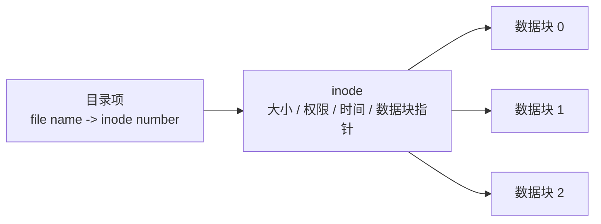
```mermaid
flowchart LR
    D["目录项<br/>file name -> inode number"] --> I["inode<br/>大小 / 权限 / 时间 / 数据块指针"]
    I --> B0["数据块 0"]
    I --> B1["数据块 1"]
    I --> B2["数据块 2"]
```

例子：`README.md` 这个名字在目录里；它对应的 inode 里保存大小、权限，以及内容在哪些磁盘块。

### 4.4 文件访问 API

常见系统调用：

| API | 作用 |
| --- | --- |
| `open` / `creat` | 打开或创建文件，返回文件描述符 |
| `read` | 从当前偏移读取字节，并推进偏移 |
| `write` | 从当前偏移写入字节，并推进偏移 |
| `close` | 关闭文件描述符 |
| `lseek` | 显式修改文件偏移 |
| `fsync` | 把脏数据尽快推到磁盘，增强持久性 |

例子：复制文件的核心循环就是：

```c
while ((n = read(in_fd, buffer, 4096)) > 0) {
    write(out_fd, buffer, n);
}
```

这段代码看起来只是在读写字节，但 OS 背后会解析路径、检查权限、查 inode、读写缓存页、发块 I/O。

### 4.5 文件描述符、打开文件表、inode 表

Unix 中有三层关键内核表：

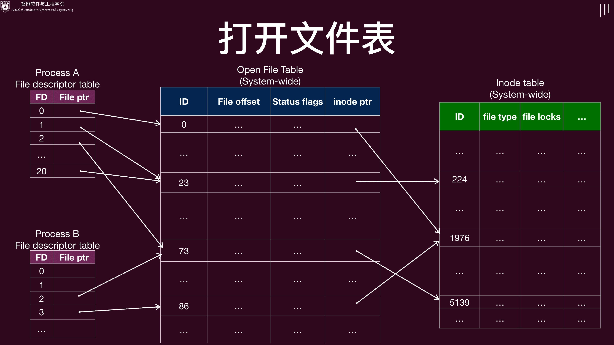


```mermaid
flowchart LR
    FD["每进程文件描述符表<br/>fd -> open file ptr"] --> OF["系统打开文件表<br/>偏移 / 打开标志 / 访问模式"]
    OF --> IT["系统 inode 表<br/>类型 / 权限 / 大小 / 数据块位置"]
```

区别很重要：

| 结构 | 范围 | 保存什么 |
| --- | --- | --- |
| 文件描述符表 | 每个进程私有 | fd 到打开文件对象的指针 |
| 打开文件表 | 系统范围 | 当前偏移、打开模式、状态标志 |
| inode 表 | 系统范围 | 文件元数据 |

例子 1：两个进程分别 `open("a.txt")`，通常有两个打开文件表项，所以偏移量互不影响。

例子 2：进程 `fork()` 后，父子进程的 fd 可以指向同一个打开文件表项，所以共享文件偏移。父进程读 10 字节，子进程下次读会从新的偏移继续。

例子 3：`dup(fd)` 得到的新 fd 与旧 fd 指向同一个打开文件表项，因此也共享偏移。

## 5. 目录、路径、链接、权限与挂载

### 5.1 目录与路径解析

目录本身也是一种文件，内容是“文件名到 inode 号”的映射。

Unix 目录项可理解为：

```text
<file_name, inode_number>
```

路径解析例子：查找 `/usr/ast/mbox`


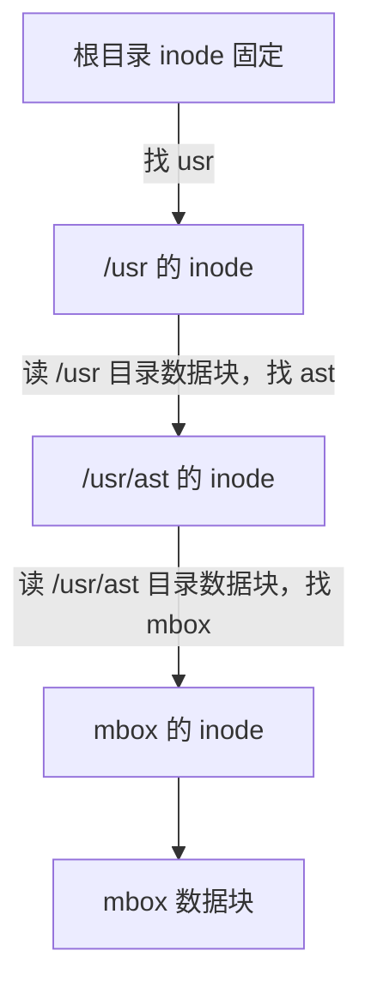
```mermaid
flowchart TD
    R["根目录 inode 固定"] -->|"找 usr"| U["/usr 的 inode"]
    U -->|"读 /usr 目录数据块，找 ast"| A["/usr/ast 的 inode"]
    A -->|"读 /usr/ast 目录数据块，找 mbox"| M["mbox 的 inode"]
    M --> D["mbox 数据块"]
```

每一级目录都要读目录数据并查找名字。目录缓存和 inode 缓存能显著减少重复路径解析的成本。

### 5.2 目录操作

常见目录相关操作：

| 操作 | 说明 |
| --- | --- |
| `mkdir` | 创建目录，初始含 `.` 和 `..` |
| `rmdir` | 删除空目录 |
| `opendir/readdir/closedir` | 遍历目录项 |
| `rename` | 改名或移动目录项 |
| `link` | 创建硬链接 |
| `unlink` | 删除目录项；Unix 中删除文件本质上是 unlink |

文件系统通常不允许用户直接写目录文件，因为目录是关键元数据，必须由文件系统维护一致性。

### 5.3 硬链接与软链接

| 对比 | 硬链接 | 软链接 / 符号链接 |
| --- | --- | --- |
| 本质 | 目录中多一个名字，指向同一个 inode | 一个特殊文件，内容是目标路径名 |
| 是否共享 inode | 是 | 否 |
| 能否跨文件系统 | 不能 | 可以 |
| 能否链接目录 | 通常不能 | 可以 |
| 删除链接本身 | 链接计数减一，计数为 0 才删除文件 | 只删除符号链接文件，目标不变 |
| 目标删除后 | 只要还有硬链接，数据仍在 | 产生悬空链接 |

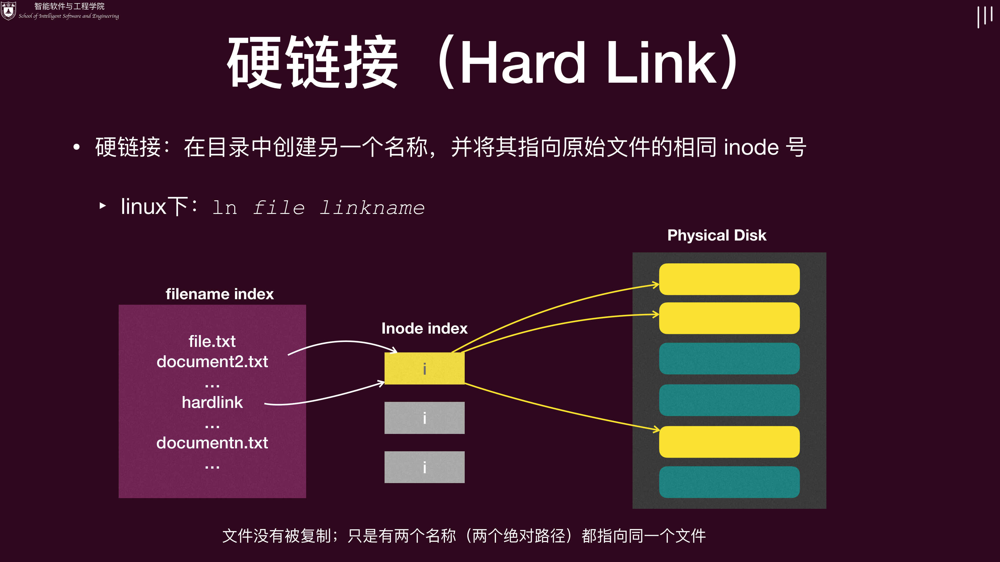

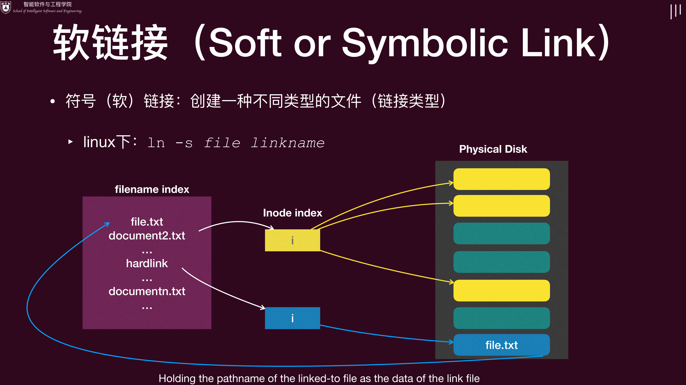

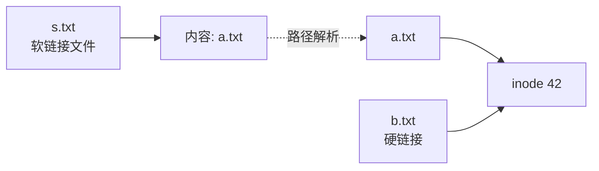
```mermaid
flowchart LR
    A["a.txt"] --> I["inode 42"]
    B["b.txt<br/>硬链接"] --> I
    S["s.txt<br/>软链接文件"] --> P["内容: a.txt"]
    P -.路径解析.-> A
```

例子：

```bash
ln a.txt b.txt      # 硬链接：a.txt 和 b.txt 指向同一个 inode
ln -s a.txt s.txt   # 软链接：s.txt 保存字符串 "a.txt"
```

如果删除 `a.txt`：

1. `b.txt` 仍能访问原数据，因为 inode 链接计数还没归零。
2. `s.txt` 可能失效，因为它保存的路径名找不到了。

### 5.4 文件保护

文件保护的目标是防止意外或恶意破坏。

可以从访问控制矩阵理解：

| 主体 / 对象 | file1 | file2 | dir1 |
| --- | --- | --- | --- |
| UserA | `rw` | `r` | `list/modify` |
| GroupB | `r` | `rw` | `list` |

Unix 常用简化形式：

1. 三类用户：所有者、组、其他人。
2. 三种权限：读、写、执行。
3. 用 9 位编码，例如 `rwxrw-r--`。

例子：`chmod 761 file`

| 类别 | 数字 | 二进制 | 权限 |
| --- | --- | --- | --- |
| owner | 7 | 111 | `rwx` |
| group | 6 | 110 | `rw-` |
| other | 1 | 001 | `--x` |

目录上的权限含义不同：读表示能列目录，写表示能增删目录项，执行表示能进入或穿过目录。

### 5.5 文件系统挂载

一个文件系统在访问前要先挂载。挂载就是把一个文件系统的根目录接到现有目录树的某个挂载点上。

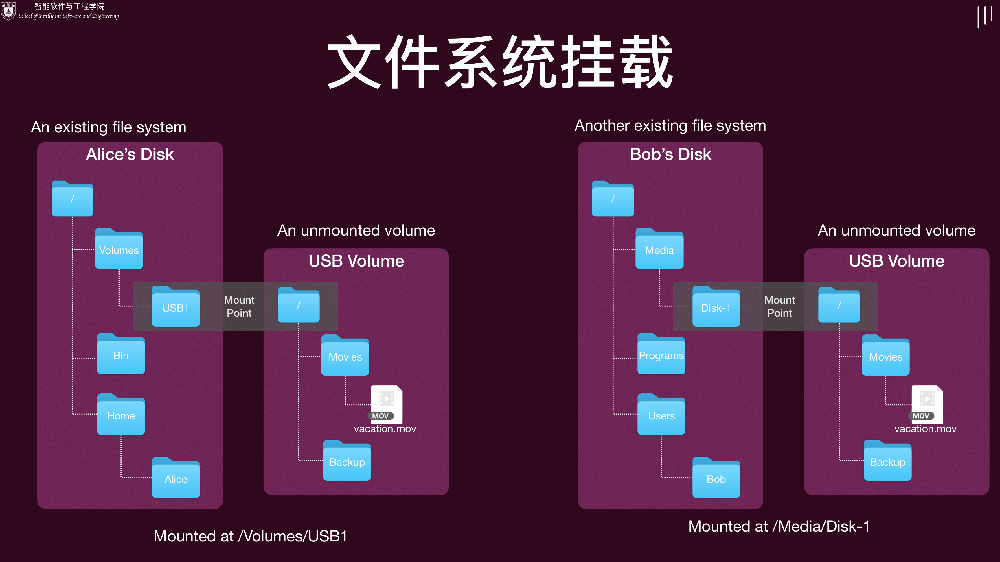

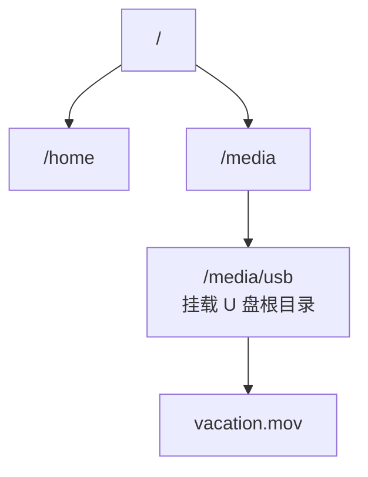
```mermaid
flowchart TD
    R["/"] --> HOME["/home"]
    R --> MEDIA["/media"]
    MEDIA --> USB["/media/usb<br/>挂载 U 盘根目录"]
    USB --> F["vacation.mov"]
```

例子：

```bash
mkfs.ext4 /dev/sdb1
mount /dev/sdb1 /media/usb
```

挂载后，访问 `/media/usb/a.txt` 实际是在访问 `/dev/sdb1` 上的文件系统。

## 6. 文件系统的磁盘布局

一个简化的 Unix 文件系统通常包括：

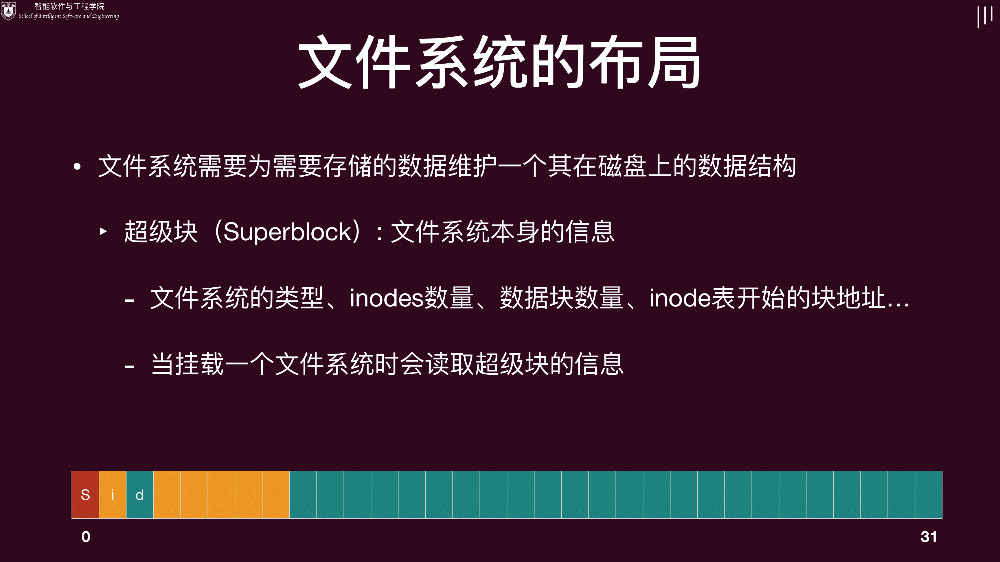


```mermaid
flowchart LR
    B["Boot Block"] --> S["Superblock"]
    S --> IB["inode Bitmap"]
    IB --> DB["Data Bitmap"]
    DB --> IT["inode Table"]
    IT --> DA["Data Blocks"]
```

| 区域 | 作用 |
| --- | --- |
| Boot Block | 启动相关信息；不启动的分区可为空 |
| Superblock | 文件系统总体信息，如类型、块数、inode 数、各区域位置 |
| inode Bitmap | 哪些 inode 空闲 |
| Data Bitmap | 哪些数据块空闲 |
| inode Table | 每个文件的元数据 |
| Data Blocks | 文件和目录的实际内容 |

挂载文件系统时，OS 会读取超级块，建立内存中的挂载表、缓存、打开文件表等结构。

## 7. 文件数据块组织方式

文件系统要回答：文件偏移 `offset` 对应哪个磁盘块？

### 7.1 连续分配

每个文件占据连续数据块，只需记录起始块和长度。

| 优点 | 缺点 |
| --- | --- |
| 顺序访问快，随机定位简单 | 创建时可能要知道大小；增长困难；外部碎片 |

例子：块大小 1 KB，文件 20 KB，占连续 20 个块。读第 13 KB，只要 `start + 13` 即可。

变体是 **extent**：一个文件由多个连续区间组成，每个区间是一个 extent。比完全连续分配更灵活，但仍可能碎片化。

### 7.2 链表分配

每个数据块保存指向下一个块的指针。

| 优点 | 缺点 |
| --- | --- |
| 没有外部碎片，文件容易增长 | 随机访问慢；每块要留指针空间；指针损坏影响后续块 |

例子：读文件第 100 个块，必须从第 1 块沿指针走 99 次。

### 7.3 FAT 文件分配表

FAT 是链表分配的变体：把所有“下一块指针”集中放在一张表里。


```mermaid
flowchart LR
    F["目录项: start=9"] --> T9["FAT[9] = 10"]
    T9 --> T10["FAT[10] = 11"]
    T10 --> T11["FAT[11] = 17"]
    T11 --> END["FAT[17] = EOF"]
```

| 优点 | 缺点 |
| --- | --- |
| FAT 可缓存进内存，随机访问比链表好 | 大磁盘下 FAT 很大，占内存；表损坏影响大 |

例子：1 TB 磁盘、4 KB 块，共约 `2^28` 个块。如果每个 FAT 项 4 字节，一张 FAT 约 1 GB，缓存成本很高。

### 7.4 索引分配与多级索引

索引分配为每个文件保存一个指针数组，数组第 `i` 项指向文件第 `i` 个数据块。

为兼顾小文件和大文件，Unix inode 常用直接指针加间接指针：

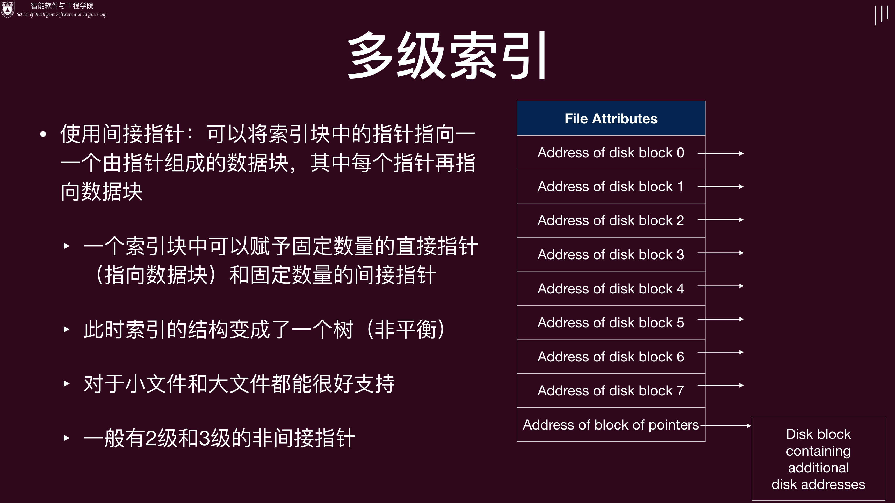

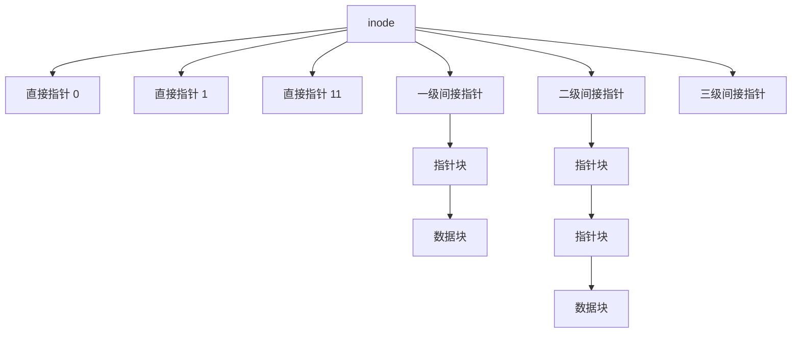
```mermaid
flowchart TD
    I["inode"] --> D0["直接指针 0"]
    I --> D1["直接指针 1"]
    I --> D11["直接指针 11"]
    I --> S["一级间接指针"]
    I --> DD["二级间接指针"]
    I --> T["三级间接指针"]
    S --> SB["指针块"]
    SB --> B["数据块"]
    DD --> DB1["指针块"]
    DB1 --> DB2["指针块"]
    DB2 --> B2["数据块"]
```

假设块大小 4 KB，指针 4 字节，一个指针块可放 `4096 / 4 = 1024 = 2^10` 个指针。若 inode 有 12 个直接指针、1 个一级、1 个二级、1 个三级：

| 指针类型 | 可寻址大小 |
| --- | --- |
| 12 个直接指针 | `12 * 4 KB = 48 KB` |
| 一级间接 | `2^10 * 4 KB = 4 MB` |
| 二级间接 | `2^20 * 4 KB = 4 GB` |
| 三级间接 | `2^30 * 4 KB = 4 TB` |

这很适合真实文件系统：多数文件很小，可以直接指针快速访问；少数大文件通过间接指针扩展。

## 8. 目录组织与空闲空间管理

### 8.1 目录项设计

目录需要保存“文件名到文件索引”的映射。常见做法：

| 做法 | 特点 |
| --- | --- |
| 固定长度文件名 | 实现简单，但短文件名浪费空间 |
| 可变长度目录项 | 节省空间，但删除后会留下不定大小空洞 |
| 固定长度项 + 文件名单独管理 | 删除项后空间更容易复用，但需要管理文件名区域 |
| 哈希表 / B+ 树 | 大目录查询快，但实现复杂 |

ext2 目录项会记录 inode 号、目录项长度、文件名长度和文件类型，文件名最长可达 255 字符。

例子：如果一个目录只有几十个文件，线性扫描就够了；如果一个目录有几十万个文件，哈希或 B+ 树能显著加速查找。

### 8.2 空闲空间管理

常见结构：

| 方法 | 思路 | 优点 | 缺点 |
| --- | --- | --- | --- |
| Bitmap | 每个块用 1 bit 表示空闲或占用 | 容易找连续空间 | 需要额外空间 |
| 空闲列表 | 空闲块串成链表 | 几乎不浪费额外空间 | 找连续空间困难，可能额外 I/O |
| B 树等复杂结构 | 管理空闲区间 | 适合大文件系统 | 实现复杂 |

位图空间例子：1 TB 磁盘、4 KB 块，需要 `2^40 / 2^12 = 2^28` 位，也就是 32 MB 位图。这个开销通常可以接受。

### 8.3 块大小选择

块太大：

1. 小文件浪费空间，产生内部碎片。
2. 例如 1 字节文件也占一个 64 KB 块。

块太小：

1. 大文件需要很多块，元数据变多。
2. 顺序读写会触发更多寻道和 I/O 管理开销。

历史上常见块大小为 1 KB 到 4 KB；大容量磁盘上更大的块也常见。

## 9. 读文件、写文件、创建文件时发生了什么

### 9.1 读取 `/foo/bar` 的开头 3 个块

简化流程：


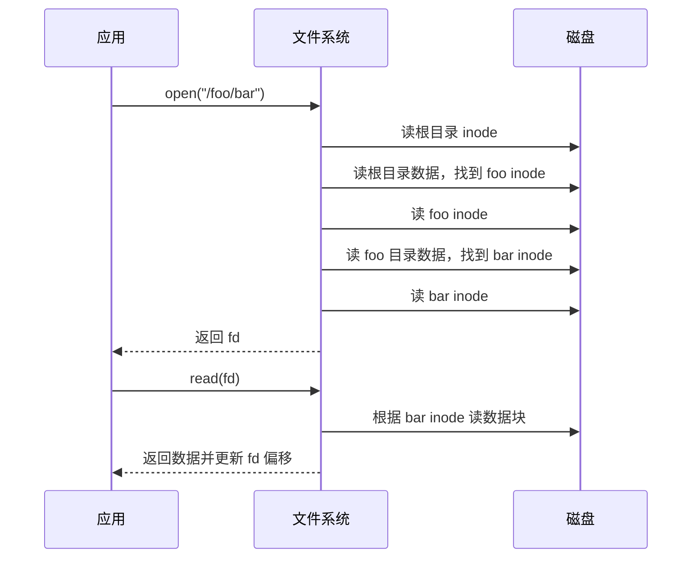
```mermaid
sequenceDiagram
    participant App as 应用
    participant FS as 文件系统
    participant Disk as 磁盘
    App->>FS: open("/foo/bar")
    FS->>Disk: 读根目录 inode
    FS->>Disk: 读根目录数据，找到 foo inode
    FS->>Disk: 读 foo inode
    FS->>Disk: 读 foo 目录数据，找到 bar inode
    FS->>Disk: 读 bar inode
    FS-->>App: 返回 fd
    App->>FS: read(fd)
    FS->>Disk: 根据 bar inode 读数据块
    FS-->>App: 返回数据并更新 fd 偏移
```

读文件通常会更新访问时间，但现代系统为了性能可能延迟或弱化 atime 更新。

### 9.2 写文件

写已有文件可能只是覆盖旧块；如果追加导致文件变大，则需要：

1. 查空闲块位图，找到空闲数据块。
2. 修改位图，标记为占用。
3. 写新数据块。
4. 修改 inode，让它指向新数据块。
5. 更新文件大小、修改时间等元数据。

### 9.3 创建文件并写入

创建 `/foo/bar` 并写入数据更复杂：


1. 路径解析到 `/foo` 目录。
2. 找空闲 inode 并标记占用。
3. 初始化新 inode。
4. 在 `/foo` 目录数据中新增 `bar -> inode` 的目录项。
5. 更新 `/foo` 目录 inode 的时间、大小等。
6. 为 `bar` 分配数据块。
7. 写数据块，更新 `bar` 的 inode。

这说明为什么一个看似简单的 `write()` 会修改很多磁盘结构，也为后面的“崩溃一致性”埋下问题。

## 10. 文件系统性能

### 10.1 缓存与缓冲

磁盘比内存慢得多，所以文件系统大量使用缓存。

| 技术 | 作用 |
| --- | --- |
| 块缓存 / 页缓存 | 把常用磁盘块放进内存，减少重复 I/O |
| 哈希表 | 快速判断某个块是否已在缓存 |
| 替换算法 | 缓存满时选择淘汰对象，如 LRU |
| 预取 | 顺序读时提前读后续块 |
| 写缓冲 | 延迟、合并、重排写操作，提高吞吐 |

现代系统通常把虚拟内存页和文件系统缓存页合并为统一页缓存。

例子：第一次 `cat big.log` 需要从磁盘读；第二次立刻执行，很多数据可能已在页缓存中，所以明显更快。

### 10.2 写缓冲的取舍

写缓冲可以：

1. 合并多个小写入。
2. 把相邻块一起写。
3. 避免无意义写入，例如创建文件后很快删除。

但风险是：崩溃时还没落盘的脏数据会丢失。

例子：编辑器保存文件后，如果没有 `fsync`，应用看到 `write()` 成功不代表数据已经物理落盘。断电时可能丢最后几秒的数据。

### 10.3 FFS 快速文件系统

原始 Unix 文件系统把磁盘当随机访问数组，数据分布差，顺序文件也可能分散在各处，带宽利用率很低。

FFS 的思想：文件系统要有磁盘意识。

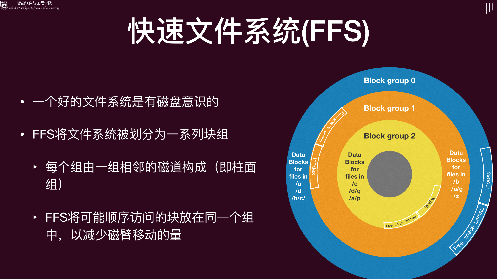

关键做法：

1. 把文件系统划分为块组。
2. 把相关数据放在同一组，减少磁臂移动。
3. 文件的数据块尽量和 inode 放在同一组。
4. 同一目录中的文件尽量放在一起。
5. 新目录放到目录较少、空闲 inode 较多的组，平衡空间。

注意：这些优化主要针对机械硬盘。SSD 没有寻道和旋转，碎片整理反而会增加写入和磨损。

## 11. 文件系统可靠性：崩溃一致性

### 11.1 问题从哪里来

文件系统更新常常需要多个磁盘写，但磁盘通常只保证单个扇区或单个块写的原子性。

以“给文件追加一个数据块”为例，需要写：

1. 新数据块 `data`。
2. 文件 inode，让它指向新块。
3. 数据块位图 `bitmap`，标记新块已使用。

如果三者中途崩溃，就可能不一致：

| 成功写入 | 结果 |
| --- | --- |
| 只有 data | 元数据没指向它，写入丢失，但文件系统结构可能一致 |
| 只有 inode | inode 指向一个位图认为空闲的块，可能读到垃圾或未来被别人覆盖 |
| 只有 bitmap | 块被标记占用但无人引用，空间泄露 |
| inode + data | 数据可读，但 bitmap 不一致 |
| bitmap + data | 空间占用但没有 inode 引用 |
| inode + bitmap | 元数据一致，但数据块可能是垃圾 |

理想情况是：文件系统从一个一致状态**原子地**转到另一个一致状态。但真实硬件不直接支持“多个块一起原子写”。

### 11.2 fsck 一致性检查

`fsck` 的思路是：允许崩溃造成不一致，重启时扫描并修复。

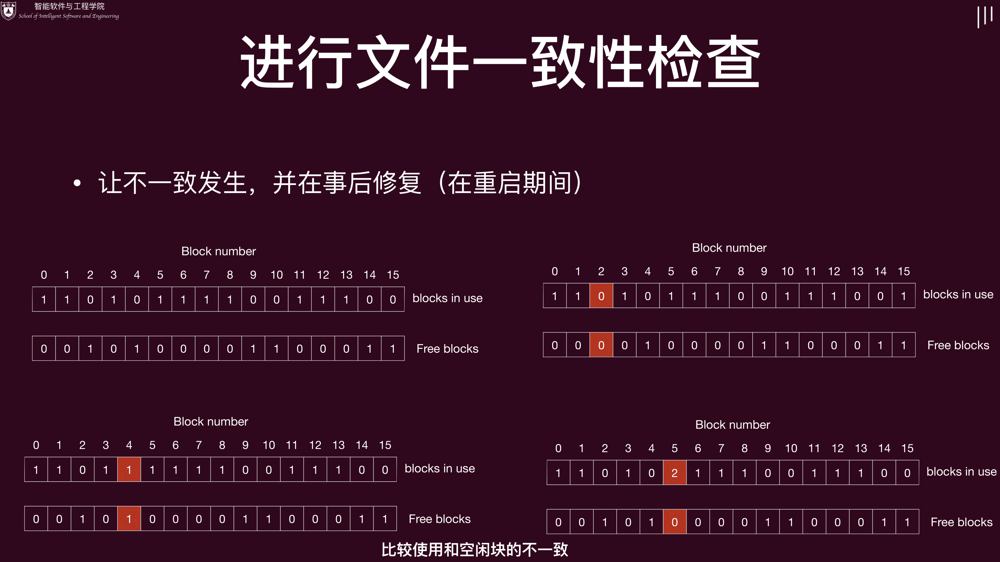

它会检查：

1. 超级块是否合理，必要时用备份超级块。
2. 扫描 inode，重建或修正空闲块位图和 inode 位图。
3. 检查 inode 类型、字段是否有效。
4. 扫描目录树，重新计算链接计数。
5. 无目录引用但已分配的 inode 可放入 `lost+found`。
6. 检查重复块指针和越界块指针。
7. 检查目录中的 `.` 和 `..`，以及目录项指向的 inode 是否存在。

缺点：

1. 慢，需要扫描大量磁盘结构。
2. 它通常只能保证“变一致”，不一定知道哪个状态才是用户真正想要的“正确”状态。

例子：一个块同时被两个 inode 指向，`fsck` 可能复制数据块或清掉某个 inode，但它并不知道用户到底想保留哪份语义。

### 11.3 日志 Journaling / Write-Ahead Logging

日志的核心思想：**先把将要做的更新写进日志，再覆盖真正位置**。

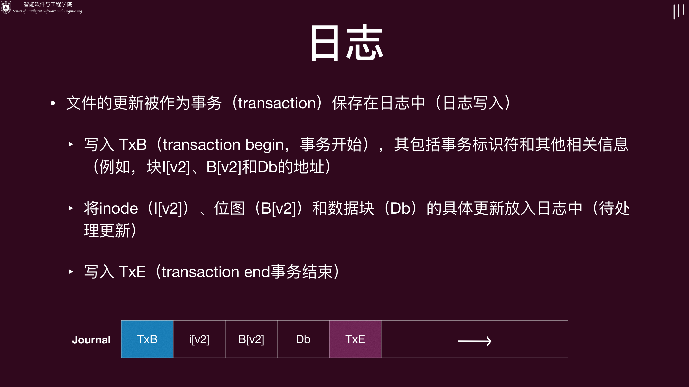

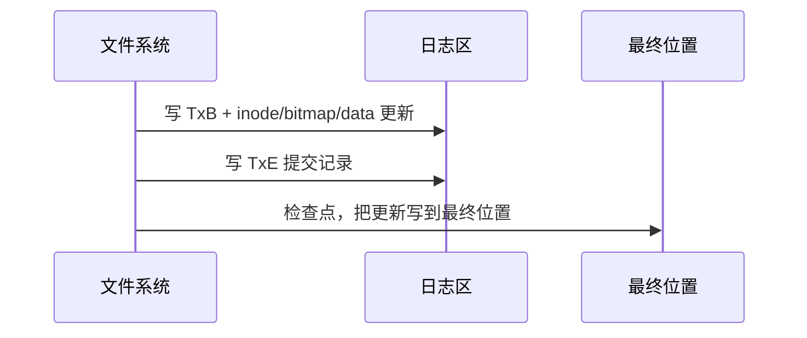
```mermaid
sequenceDiagram
    participant FS as 文件系统
    participant J as 日志区
    participant Home as 最终位置
    FS->>J: 写 TxB + inode/bitmap/data 更新
    FS->>J: 写 TxE 提交记录
    FS->>Home: 检查点，把更新写到最终位置
```

事务日志通常包含：

1. `TxB`：事务开始，含事务 ID 和相关块地址。
2. 待更新内容：如 `inode[v2]`、`bitmap[v2]`、`data block`。
3. `TxE`：事务结束，表示事务完整提交。

重要顺序：

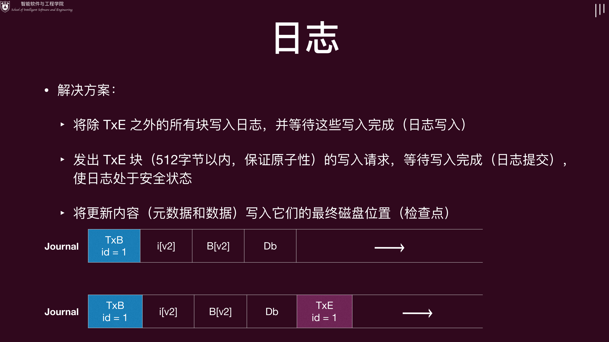

1. 先写除 `TxE` 以外的日志内容，并等待完成。
2. 再写 `TxE`，且 `TxE` 要足够小，最好能原子写。
3. 再把更新写到最终位置，也叫 checkpoint。

恢复规则：

| 崩溃位置 | 恢复行为 |
| --- | --- |
| `TxE` 写入前崩溃 | 忽略该事务 |
| `TxE` 写入后、checkpoint 前崩溃 | 重放该事务 |
| checkpoint 后崩溃 | 更新已在最终位置，日志可回收 |

### 11.4 数据日志与元数据日志

| 类型 | 做法 | 优点 | 缺点 |
| --- | --- | --- | --- |
| 数据日志 | 数据和元数据都写日志 | 最安全，数据不易变垃圾 | 数据写两次，代价高 |
| 元数据日志 | 只记录元数据 | 更常见，开销低 | 若顺序不当，文件可能指向垃圾数据 |

更好的元数据日志顺序是：先把用户数据写到最终数据块，再记录并提交元数据日志。这样 inode 不会指向尚未正确写入的数据。

例子：ext3、ext4、NTFS 都使用日志思想，但具体模式和默认策略不同。

### 11.5 有限循环日志

日志不能无限增长。事务 checkpoint 后，日志记录就可以释放。实际文件系统把日志当成循环缓冲区，并用日志超级块记录哪些事务尚未 checkpoint。

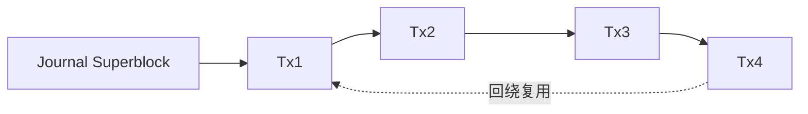
```mermaid
flowchart LR
    JS["Journal Superblock"] --> T1["Tx1"]
    T1 --> T2["Tx2"]
    T2 --> T3["Tx3"]
    T3 --> T4["Tx4"]
    T4 -.回绕复用.-> T1
```

## 12. 日志结构文件系统 LFS

日志化文件系统的日志是为了恢复；**日志结构文件系统 LFS** 更进一步：把整个文件系统都当成日志，所有新写入都追加到末尾。

### 12.1 为什么需要 LFS

传统文件系统即使有缓存，写大量小文件时仍会频繁寻道。LFS 想把随机小写变成大段顺序写。

核心做法：

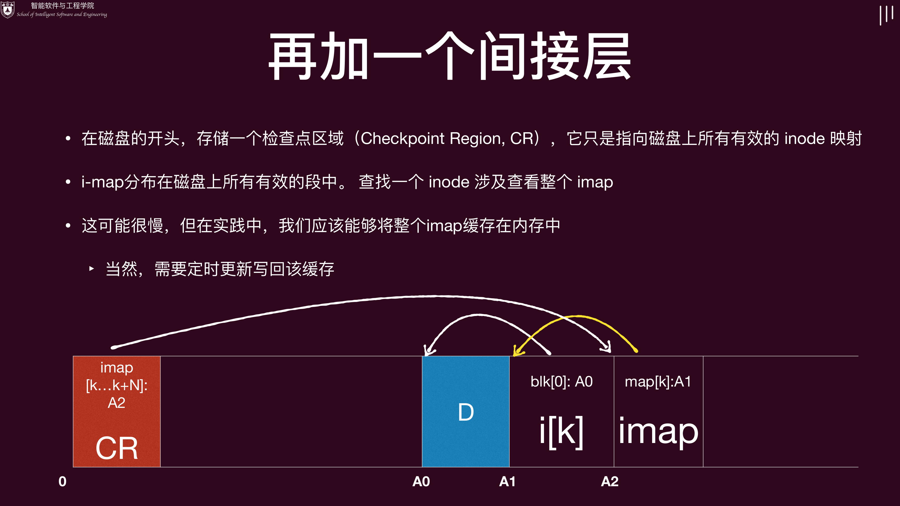

1. 不原地修改旧数据。
2. 修改时把新数据块、新 inode、新映射都写到日志末尾。
3. 在内存里积累到几 MB 的 segment，再批量顺序写。

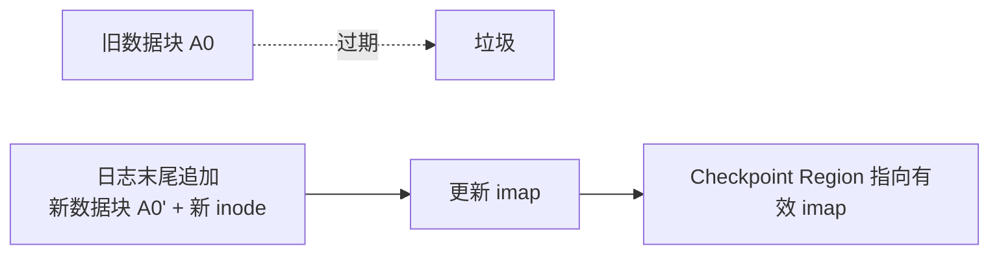
```mermaid
flowchart LR
    OLD["旧数据块 A0"] -.过期.-> G["垃圾"]
    NEW["日志末尾追加<br/>新数据块 A0' + 新 inode"] --> MAP["更新 imap"]
    MAP --> CR["Checkpoint Region 指向有效 imap"]
```

### 12.2 LFS 如何找到 inode

传统文件系统可以通过 inode 号在固定 inode 表中定位 inode。LFS 中 inode 会被写到日志任意位置，所以需要额外映射：

| 结构 | 作用 |
| --- | --- |
| imap | inode 号到 inode 当前位置的映射 |
| Checkpoint Region, CR | 位于磁盘固定位置，指向有效 imap |

查找流程：先读 CR，找到 imap，再由 imap 找到 inode，再由 inode 找到数据块。

### 12.3 垃圾回收与段摘要

LFS 永远追加写，旧版本会变成垃圾。磁盘有限，所以必须垃圾回收。

垃圾回收希望释放整个 segment：

1. 如果段里全是垃圾，直接回收。
2. 如果段里部分有效，把有效块复制到日志末尾，释放旧段。

如何判断数据块是否仍有效？LFS 使用**段摘要块 SSB**，记录段中每个数据块属于哪个 inode、哪个文件偏移。垃圾回收时检查对应 inode 是否仍然引用该块。

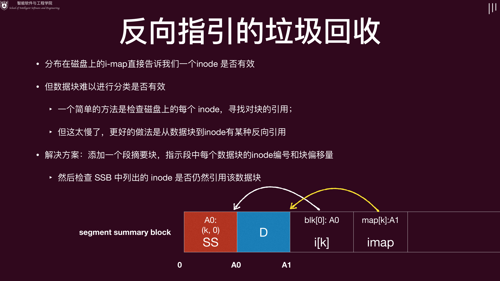

例子：如果 SSB 说某块是 inode 10 的第 0 块，但当前 inode 10 的第 0 块已经指向新地址，那么旧块就是垃圾。

## 13. 关键对比表

### 13.1 HDD 与 SSD

| 维度 | HDD | SSD |
| --- | --- | --- |
| 延迟来源 | 寻道、旋转、传输 | 闪存访问、FTL、擦除和垃圾回收 |
| 顺序 vs 随机 | 顺序远快于随机 | 随机访问相对强 |
| 优化重点 | 减少寻道，保持局部性 | 减少写放大，磨损均衡 |
| 是否适合碎片整理 | 可能有帮助 | 通常不建议 |

### 13.2 文件分配方式

| 方式 | 顺序访问 | 随机访问 | 增长 | 碎片 | 典型问题 |
| --- | --- | --- | --- | --- | --- |
| 连续分配 | 很快 | 很快 | 差 | 外部碎片 | 需要提前知道大小 |
| Extent | 快 | 快 | 中等 | 仍可能碎片 | extent 管理复杂 |
| 链表 | 中等 | 差 | 好 | 无外部碎片 | 指针损坏、随机访问慢 |
| FAT | 中等 | 较好 | 好 | 无外部碎片 | 大表占内存 |
| 多级索引 | 好 | 好 | 好 | 取决于分配策略 | 间接指针有额外访问 |

### 13.3 fsck 与日志

| 方案 | 思路 | 优点 | 缺点 |
| --- | --- | --- | --- |
| fsck | 崩溃后全盘检查修复 | 实现相对直接 | 慢，只能修一致，不保证语义正确 |
| Journaling | 更新前先写日志，崩溃后重放 | 恢复快，避免全盘扫描 | 写放大，需要严格写入顺序 |

## 14. 常见例题式理解

### 例 1：为什么 `unlink` 不等于立刻删除数据？

`unlink("a.txt")` 删除的是目录项。若 inode 链接计数减到 0，并且没有打开文件引用，文件数据才会被释放。

如果进程已经打开了 `a.txt`，即使目录项被删，进程仍可通过 fd 读写它。等最后一个 fd 关闭后，空间才真正释放。

### 例 2：为什么 `fork()` 后父子进程读同一个 fd 会互相影响？

`fork()` 后父子进程的 fd 指向同一个系统打开文件表项，而文件偏移保存在打开文件表项里。因此父进程读 100 字节会推进共享偏移，子进程再读会从后面继续。

如果父子进程分别重新 `open()` 同一路径，则通常有两个打开文件表项，偏移互不影响。

### 例 3：为什么数据库常常调用 `fsync`？

`write()` 成功只表示数据进入内核缓冲或页缓存，不一定已经落盘。数据库需要保证事务提交后断电也能恢复，所以会用 `fsync` 或类似机制强制把关键日志写到持久介质。

### 例 4：为什么小文件很多时 inode 和目录设计很重要？

真实系统中大量文件都很小，常见大小可能只有几 KB。若每个小文件都要多次间接索引、目录线性扫描、分散写块，性能会很差。所以文件系统会优化小文件、目录查找、局部性和缓存。

### 例 5：为什么日志提交记录 `TxE` 要最后写？

如果 `TxE` 先写了，而真正的日志内容还没写全，崩溃恢复时文件系统会误以为事务完整，重放垃圾数据。让 `TxE` 最后写，并等待前面的日志块完成，可以把“是否提交”变成一个可靠判断。

### 例 6：为什么 SSD 删除文件后旧数据可能还在？

文件系统删除文件通常只是释放 inode、目录项和位图；SSD 的 FTL 又采用写时复制，旧物理页可能还没擦除。直到垃圾回收真正擦除对应块，旧数据才消失。

## 15. 一句话复习

1. **设备管理**：OS 通过寄存器、轮询/中断、DMA 和驱动管理各种 I/O 设备。
2. **磁盘**：机械硬盘慢在寻道和旋转，所以顺序访问、调度、局部性很重要。
3. **SSD**：没有机械延迟，但要处理擦除、磨损、FTL、写时复制和垃圾回收。
4. **文件系统抽象**：文件是字节集合，目录是名字到 inode 的映射。
5. **inode**：保存文件元数据和数据块指针，通常不保存文件名。
6. **打开文件表**：fd、打开文件表、inode 表三层结构解释了偏移共享、`fork`、`dup`。
7. **链接**：硬链接是 inode 别名，软链接是路径名别名。
8. **布局**：超级块、位图、inode 表、数据块共同构成磁盘上的文件系统。
9. **分配策略**：连续、链表、FAT、多级索引各有访问性能和空间管理取舍。
10. **性能**：缓存、预取、写缓冲、FFS 块组都在减少 I/O 成本。
11. **可靠性**：多块更新遇到崩溃会不一致，fsck 和日志是两类经典解决方案。
12. **LFS**：把写入都变成追加日志，用 imap、CR 和垃圾回收维持可查找和可复用。
