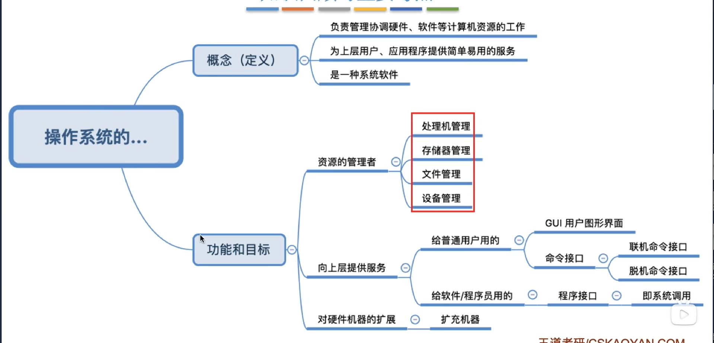
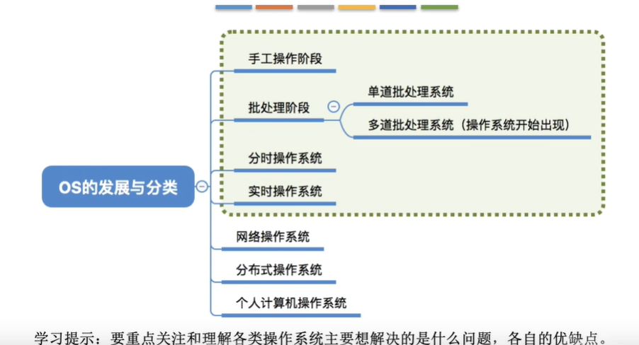
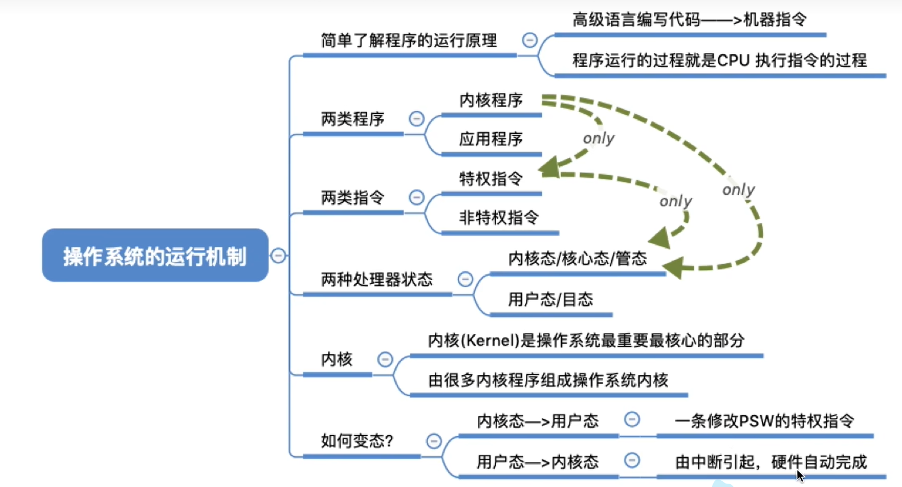
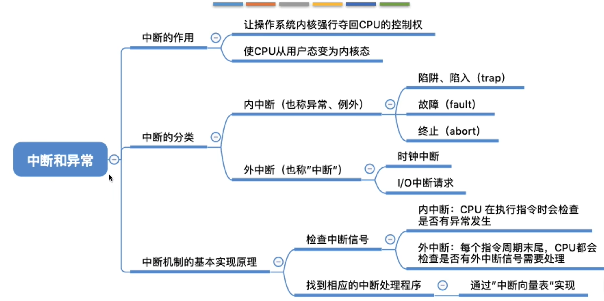

# 操作系统

**操作系统**（Operating System，OS）是指控制和管理整个计算机系统的硬件和软件资源，并合理的组织调度计算机的工作和资源分配；以提供给用户和其它软件方便的接口和环境；它是计算机系统中最基本的系统软件

 

## 操作系统的四个特征

### 并发

指两个或多个事件在同一时间间隔内发生。宏观上同时，微观上交替

### 共享

资源共享，是指系统中的资源可供内存中多个并发执行的进程共同使用

### 虚拟

虚拟是只把一个物理上的实体变为若干个逻辑上的对应物

### 异步

在多道程序环境下，允许过个程序并发执行，但程序有限，进程的执行不是一贯到底的，而是走走停停，以不可预知的速度向前推进。 

## 操作系统的分类

### 运行机制

### 异常和中断

