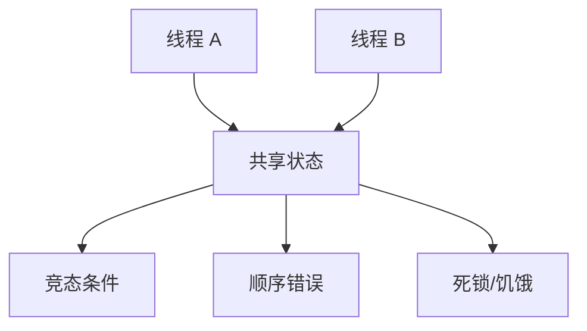
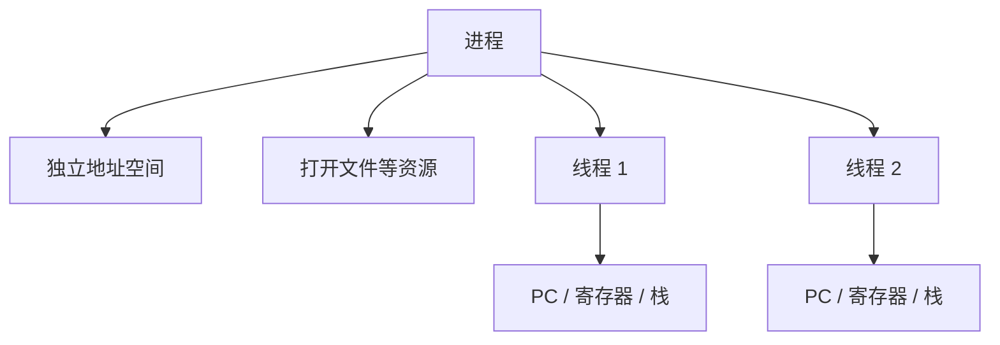
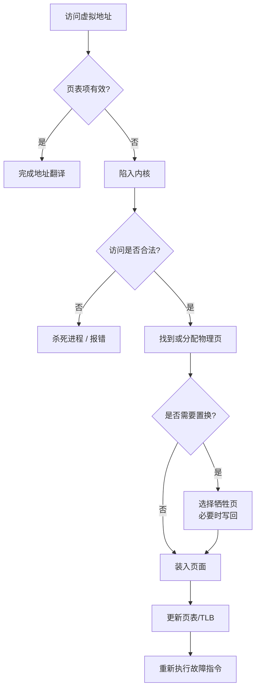
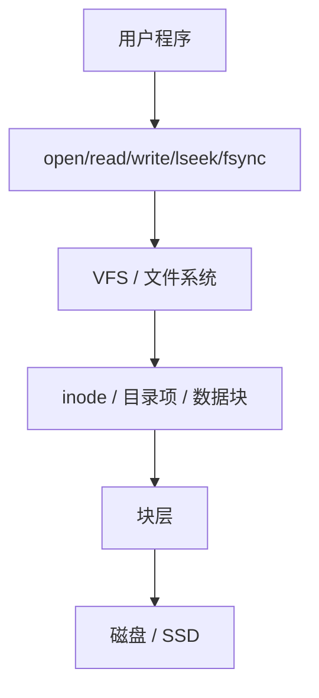
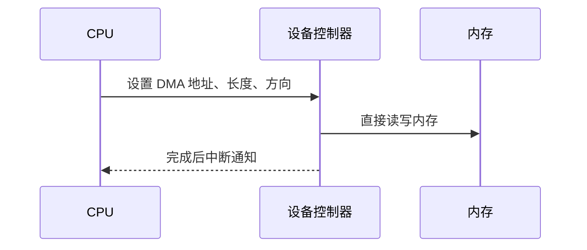

#  操作系统期末复习笔记

> 来源：`OS2026大纲.pdf`、`20260618183712-钮鑫涛预定的会议-逐字稿文本-1.pdf`、课程 PDF（绪论、并发、虚拟化、持久化）以及已整理的 `并发/并发.md`、`虚拟化/虚拟化.md`、`持久化/持久化.md`。  
> 使用方式：这份笔记按期末考试范围重排，不追求覆盖课件所有细节；先看“考试范围和策略”，再按“并发 - 虚拟化 - 持久化”复习，最后用检查清单查漏。

## 1. 考试范围和策略

### 1.1 题型

根据大纲和会议文字稿，本次考试题型大致是：

| 题型 | 数量/形式 | 复习重点 |
| --- | --- | --- |
| 单项选择 | 约 5 题 | 概念辨析、容易混淆的机制 |
| 基本概念 | 约 5 题，回答限制在 55 字以内 | 用一句话说清“是什么、为什么、什么时候用” |
| 综合题 | 约 5 题，包括计算和少量代码填空 | 经典应用题：调度、fork/exec、虚拟内存、文件系统、信号量 |

老师口头强调：

1. 基本没有完整编程题，主要是给出结果、代码填空或补一小句。
2. 不考汇编和 x86 语法。
3. 不考证明题。
4. 没有画图题，但调度题可以自己画甘特图辅助。
5. 不考 mini lab，实验内容本身没有专门复习必要。
6. 计算量不大，关键是想到正确切入点。
7. 第一道问答题可能有点难，不要卡太久。

### 1.2 重点与不考点

大纲范围：

| 模块 | 大纲考点 |
| --- | --- |
| 并发 | 内存一致性模型、互斥、条件变量、信号量、安全性与活性 |
| 虚拟化 | 进程和线程、上下文切换、`fork`、`execve`、`exit`、调度算法、虚拟内存、TLB、多级页表、缺页异常、页面置换算法 |
| 持久化 | DMA、软链接、硬链接、inode 多级索引、磁盘原理 |

会议文字稿中额外校正：

| 内容 | 结论 | 备注 |
| --- | --- | --- |
| 驱动程序 | 不考 | 老师说“大纲写错，驱动程序不考” |
| 死锁检测、银行家算法 | 不考 | “大纲里没有就不会考” |
| 读者写者问题 | 不考 | 了解即可 |
| 哲学家就餐问题 | 不考 | 不作为考点 |
| x86 / 汇编 | 不考 | 不需要背汇编语法 |
| 有限状态机 | 不直接考 | 理解状态机有助于分析，但不是考点 |
| mini lab | 不考 | 考试和实验不同 |
| 内存一致性模型 | 了解，偏选择题 | 老师提到“有意思，不重要” |

### 1.3 复习优先级

| 优先级 | 内容 |
| --- | --- |
| 第一优先级 | 调度算法、`fork/exec/exit` 行为、虚拟地址翻译、TLB、多级页表、缺页和置换、文件读写和 inode 索引、信号量同步 |
| 第二优先级 | 互斥、条件变量、安全性与活性、软硬链接、磁盘访问时间和调度 |
| 第三优先级 | 内存一致性模型、上下文切换细节、DMA |
| 跳过或只看概念 | 驱动程序细节、读者写者、哲学家就餐、死锁检测、银行家算法、汇编 |

## 2. 55 字概念题模板

答概念题时不要背长定义，按这三个句式压缩：

1. **是什么**：它是操作系统中的某种抽象、机制或策略。
2. **解决什么问题**：它用于隔离、共享、调度、同步、持久化或加速。
3. **关键限制/代价**：它依赖某个状态、会产生某种开销或有某个边界条件。

例子：

| 概念 | 55 字内答案示例 |
| --- | --- |
| 进程 | 进程是运行中程序的资源容器，拥有独立地址空间、打开文件等资源，可包含一个或多个线程。 |
| 线程 | 线程是进程内的执行流，共享进程地址空间和资源，但拥有自己的 PC、寄存器、栈和线程状态。 |
| 上下文切换 | 上下文切换是 OS 保存当前线程/进程 CPU 状态并恢复另一个执行流状态，使 CPU 在多个任务间切换。 |
| TLB | TLB 是页表项缓存，用于加速虚拟地址到物理地址的翻译；未命中时需查页表。 |
| 缺页异常 | 缺页异常是访问页表中无有效映射的虚拟页时触发的异常，内核负责分配、调入或置换页面。 |
| 信号量 | 信号量是带整数计数的同步原语，`P` 获取资源或阻塞，`V` 释放资源并可能唤醒等待线程。 |
| 硬链接 | 硬链接是多个目录项指向同一 inode；它们共享文件内容和元数据，删除一个名字不一定删除文件。 |
| 软链接 | 软链接是保存目标路径的特殊文件；路径失效后链接会悬空，可跨文件系统。 |

## 3. 并发

> 大纲重点：内存一致性模型、互斥、条件变量、信号量、安全性与活性。  
> 会议校正：读者写者、哲学家就餐、死锁检测、银行家算法不考；信号量是明确重点。

### 3.1 并发的核心问题

并发程序难在多个线程共享状态，并且执行顺序不确定。



常见风险：

| 风险 | 含义 | 典型解决 |
| --- | --- | --- |
| 原子性丧失 | 一组本该不可分割的操作被其他线程插入 | 互斥锁、原子指令 |
| 顺序性丧失 | 本该先发生的事件没有建立同步关系 | 条件变量、信号量、join |
| 可见性/一致性问题 | 一个核心的写入不一定按直觉立即被另一个核心看见 | 锁、内存屏障、语言级原子 |

### 3.2 安全性与活性

| 属性 | 直觉 | 并发例子 |
| --- | --- | --- |
| 安全性 safety | 坏事不会发生 | 临界区内最多一个线程 |
| 活性 liveness | 好事终将发生 | 等待锁的线程最终能进入临界区 |
| 有界等待 bounded waiting | 不会无限期等待 | 想进临界区的线程不会永远被插队 |

做题时看到“不会出现两个线程同时进入”“不会读到不一致状态”，多半是安全性；看到“最终能执行”“不会一直卡住”，多半是活性。

### 3.3 内存一致性模型

这部分会议里说偏了解，可能作为选择题出现。

关键理解：

1. 顺序一致性是最符合直觉的模型：所有线程的操作像按某个全局顺序交错执行，且每个线程内部顺序不变。
2. 现代处理器和编译器可能重排指令，因此裸共享变量不能可靠表达同步。
3. 锁、条件变量、信号量等同步原语不仅提供互斥或等待，还建立内存可见性关系。

经典例子：

```c
int x = 0, y = 0;

// T1
x = 1;
r1 = y;

// T2
y = 1;
r2 = x;
```

在直觉顺序模型下，很难接受 `r1 == 0 && r2 == 0`；但在带写缓冲或弱内存模型中，这类结果可能出现。

考试抓住一句话：

> 不要用普通共享变量“猜”同步顺序；用锁、条件变量、信号量等同步原语显式建立顺序。

### 3.4 互斥

互斥解决：多个线程不能同时访问某个临界区。

| 概念 | 含义 |
| --- | --- |
| 临界区 | 访问共享状态的一段代码 |
| 竞态条件 | 结果依赖线程交错顺序 |
| 互斥锁 | 保证一次只有一个线程进入临界区 |

错误锁例子：

```c
int flag = 0;

void lock() {
    while (flag == 1)
        ;
    flag = 1;
}
```

错因：检查 `flag` 和设置 `flag` 不是原子的，两个线程可能同时看到 `flag == 0`。

正确锁依赖硬件原子指令：

```c
while (__sync_lock_test_and_set(&locked, 1) == 1)
    ;
```

考点不是背具体函数，而是理解：锁必须把“检查并占用”做成一个原子动作。

### 3.5 条件变量

条件变量解决：线程必须等某个条件成立才能继续。

标准模式：

```c
pthread_mutex_lock(&m);
while (!condition) {
    pthread_cond_wait(&cv, &m);
}
// 条件成立，执行操作
pthread_mutex_unlock(&m);
```

必须记住：

1. 条件变量本身不保存条件，条件保存在共享变量里。
2. 条件变量必须配合互斥锁使用。
3. `pthread_cond_wait` 会原子地释放锁并睡眠，醒来后重新获得锁。
4. 等待条件必须用 `while`，不要用 `if`。

为什么用 `while`：

1. 可能虚假唤醒。
2. 可能多个线程被唤醒后，先运行者已经消耗条件。
3. `signal` 只代表“条件可能变了”，不代表“条件一定为真”。

### 3.6 信号量

信号量是大纲和会议都明确提到的重点，尤其适合综合题或代码填空。

| 操作 | 含义 |
| --- | --- |
| `P` / `sem_wait` | 若计数大于 0，则减 1 并继续；否则阻塞 |
| `V` / `sem_post` | 计数加 1，并可能唤醒等待线程 |

不同初值的意义：

| 初值 | 用途 |
| --- | --- |
| `1` | 二值信号量，可实现互斥 |
| `0` | 等待某个事件发生 |
| `N` | 表示有 N 个同类资源可用 |

生产者消费者标准模板：

```c
sem_t empty;  // 空槽数量，初值 N
sem_t full;   // 已有数据数量，初值 0
sem_t mutex;  // 保护缓冲区，初值 1

void producer(item_t x) {
    sem_wait(&empty);
    sem_wait(&mutex);
    put(x);
    sem_post(&mutex);
    sem_post(&full);
}

item_t consumer() {
    sem_wait(&full);
    sem_wait(&mutex);
    item_t x = get();
    sem_post(&mutex);
    sem_post(&empty);
    return x;
}
```

顺序不能乱：

1. 先等资源数量：生产者等 `empty`，消费者等 `full`。
2. 再拿互斥锁进入缓冲区。
3. 退出缓冲区后释放互斥锁。
4. 最后通知对方资源数量变化。

错误顺序示例：消费者先拿 `mutex` 再等 `full`。如果缓冲区为空，消费者会拿着锁睡眠，生产者无法进入缓冲区生产，导致死锁。

### 3.7 并发题常见问法

| 问法 | 答题抓手 |
| --- | --- |
| 这段程序是否安全 | 找共享变量、临界区、是否加锁 |
| 是否可能死锁 | 找“持有资源并等待资源”的环 |
| 为什么条件变量要配锁 | 保护共享条件，避免检查条件和睡眠之间丢失唤醒 |
| 为什么用 `while` 等待 | 醒来后条件不一定仍成立 |
| 信号量初值是多少 | 看资源初始数量或事件是否已发生 |
| `P/V` 顺序怎么填 | 先资源计数，再互斥；先释放互斥，再通知资源变化 |

## 4. 虚拟化

> 大纲重点：进程和线程、上下文切换、`fork`、`execve`、`exit`、调度算法、虚拟内存、TLB、多级页表、缺页异常、页面置换算法。  
> 会议强调：`fork/exec`、调度、内存是大题重点；上下文切换可能偏选择或概念。

### 4.1 进程与线程

| 对象 | 拥有什么 | 共享什么 | 私有重点 |
| --- | --- | --- | --- |
| 进程 | 地址空间、资源、至少一个线程 | 进程间默认不共享地址空间 | 地址空间隔离 |
| 线程 | 执行流 | 同进程线程共享代码、堆、全局变量、文件 | PC、寄存器、栈、TCB |

进程是资源容器，线程是调度执行单位。



### 4.2 上下文切换

上下文切换做的事：

1. 保存当前执行流的 PC、寄存器、栈指针等 CPU 状态。
2. 切换到内核调度逻辑。
3. 选择下一个可运行线程/进程。
4. 恢复下一个执行流的 CPU 状态。
5. 返回用户态继续执行。

进程切换通常比线程切换更重，因为可能涉及地址空间切换、页表切换、TLB 影响等。

概念题可以答：

> 上下文切换是 OS 保存当前任务 CPU 上下文并恢复另一个任务上下文的机制，使多个任务共享 CPU，但会产生保存恢复和缓存/TLB 开销。

### 4.3 `fork`

`fork()` 创建子进程。子进程从 `fork` 返回处继续执行，看起来像父进程的副本。

返回值：

| 位置 | 返回值 |
| --- | --- |
| 子进程 | `0` |
| 父进程 | 子进程 PID |
| 失败 | `-1` |

典型题型：判断输出次数、进程数、变量值。

```c
fork();
fork();
fork();
```

若都成功，最终进程数是 `2^3 = 8`。

`fork` 复制/继承的内容：

| 内容 | 行为 |
| --- | --- |
| 地址空间 | 逻辑上复制；现代系统常用写时复制 |
| 寄存器现场 | 复制，但返回值不同 |
| 文件描述符 | 复制 fd 表项，通常指向同一个打开文件表项 |
| PID | 父子不同 |

文件偏移易错点：

> 父子进程继承的文件描述符常指向同一个内核打开文件对象，因此可能共享文件偏移。

### 4.4 写时复制 COW

`fork` 后如果立即复制全部内存太慢，现代系统使用写时复制：

1. 父子进程先共享同一批物理页。
2. 页表把这些页标成只读。
3. 某一方写入时触发异常。
4. 内核复制该页，再让写入继续。

考点：

1. COW 优化 `fork` 性能。
2. 只有写入共享页时才真正复制。
3. `fork` 后立刻 `exec` 时，COW 可以避免无意义复制。

### 4.5 `execve`

`execve` 用新程序替换当前进程的用户态映像。

它不会创建新进程：

| 变化 | 不变 |
| --- | --- |
| 代码段、数据段、堆、栈、入口点 | PID |
| 用户态地址空间内容 | 某些进程属性 |
| 命令行参数和环境变量 | 未被 close-on-exec 关闭的文件描述符 |

常见组合：

```c
pid_t pid = fork();
if (pid == 0) {
    execve(path, argv, envp);
    exit(1); // exec 失败才会执行到这里
} else {
    waitpid(pid, NULL, 0);
}
```

### 4.6 `exit` 与 `wait`

`exit` 结束当前进程，释放大部分资源，但退出状态会暂时保留给父进程读取。

| 状态 | 含义 |
| --- | --- |
| 僵尸进程 | 子进程已退出，父进程未 `wait`，内核保留退出信息 |
| 孤儿进程 | 父进程先退出，子进程仍运行，通常被 `init` 或类似进程接管 |

`wait/waitpid` 的作用：

1. 等待子进程结束。
2. 获取退出状态。
3. 回收僵尸进程资源。

### 4.7 调度：机制与策略分离

调度机制回答“如何切换”，调度策略回答“切到谁”。

| 概念 | 含义 |
| --- | --- |
| 机制 | 时钟中断、陷入内核、保存恢复上下文 |
| 策略 | FCFS、SJF、SRTF、RR、优先级、实时调度等 |

常见指标：

| 指标 | 公式/含义 |
| --- | --- |
| 周转时间 turnaround | 完成时间 - 到达时间 |
| 响应时间 response | 第一次运行时间 - 到达时间 |
| 等待时间 waiting | 在就绪队列中等待的总时间 |
| 吞吐量 throughput | 单位时间完成任务数 |
| 公平性 fairness | 任务获得 CPU 的均衡程度 |

### 4.8 常见调度算法

| 算法 | 思路 | 优点 | 缺点 |
| --- | --- | --- | --- |
| FCFS | 先到先服务 | 简单 | 短任务可能被长任务拖住 |
| SJF | 先运行最短任务 | 平均周转时间好 | 需要知道运行时间，长任务可能饥饿 |
| SRTF | 抢占式最短剩余时间优先 | 对短任务更友好 | 切换频繁，长任务可能饥饿 |
| RR | 时间片轮转 | 响应时间较好 | 时间片太小切换开销大，太大退化为 FCFS |
| 优先级调度 | 高优先级先运行 | 表达重要性 | 低优先级可能饥饿，需要老化 |
| MLFQ | 多级反馈队列 | 兼顾交互和批处理 | 参数较多 |

调度计算题步骤：

1. 按到达时间列出任务。
2. 根据算法画时间线或甘特图。
3. 标出每个任务第一次运行时间、完成时间。
4. 计算响应时间、周转时间、等待时间。

RR 易错点：

1. 时间片用完但任务未完成，要回到队尾。
2. 新到达任务插入就绪队列时，要按题目约定处理同一时刻顺序。
3. I/O 阻塞任务回来后通常进入就绪队列。

### 4.9 实时调度

实时调度关注 deadline。

| 算法 | 思路 |
| --- | --- |
| RMS | 周期越短，优先级越高；静态优先级 |
| EDF | deadline 越早，优先级越高；动态优先级 |

可能考概念辨析：

1. 实时系统不是“跑得快”，而是“按时完成”。
2. 硬实时错过 deadline 是系统失败；软实时允许偶尔错过但质量下降。

### 4.10 虚拟内存与地址翻译

虚拟内存让每个进程以为自己拥有独立、连续的地址空间。

地址翻译：

```text
虚拟地址 = 虚拟页号 VPN + 页内偏移 offset
物理地址 = 物理页框号 PFN + 页内偏移 offset
```

页大小为 `2^k` 字节时：

1. offset 占 `k` 位。
2. VPN 是虚拟地址剩余高位。
3. PFN 来自页表项。

做题模板：

1. 根据页大小确定 offset 位数。
2. 把虚拟地址拆成 VPN 和 offset。
3. 查 TLB，命中则直接得 PFN。
4. 未命中查页表。
5. 页表有效则形成物理地址并更新 TLB。
6. 页表无效则触发缺页异常。

### 4.11 TLB

TLB 是页表项缓存，用于加速地址翻译。

| 情况 | 处理 |
| --- | --- |
| TLB hit | 直接得到 PFN |
| TLB miss + 页表有效 | 查页表，更新 TLB，再访问 |
| TLB miss + 页表无效 | 触发缺页异常 |

有效访问时间常见公式：

```text
EAT = hit_rate * hit_cost + (1 - hit_rate) * miss_cost
```

若题目给 TLB 命中时间、内存访问时间、页表访问次数，要小心把“翻译”和“真正访问数据”的内存访问都算进去。

### 4.12 多级页表

多级页表的目的：减少页表占用的物理内存，不为不存在的虚拟地址范围分配底层页表。

地址拆分：

```text
虚拟地址 = 一级索引 + 二级索引 + ... + 页内偏移
```

优点：

1. 稀疏地址空间下节省内存。
2. 按需分配底层页表页。

代价：

1. TLB 未命中时需要多次内存访问查页表。
2. 页表遍历更复杂。

### 4.13 缺页异常

缺页异常流程：



考点：

1. 缺页是异常，不是普通函数调用。
2. 处理完后通常重新执行导致缺页的指令。
3. 如果访问非法地址，不是调页，而是报错或终止进程。

### 4.14 页面置换算法

| 算法 | 思路 | 重点 |
| --- | --- | --- |
| OPT | 换掉未来最久不用的页 | 理想算法，只作比较 |
| FIFO | 换掉最早进入内存的页 | 简单，但可能 Belady 异常 |
| LRU | 换掉最久未使用的页 | 利用局部性，精确实现较贵 |
| Clock | 近似 LRU，使用引用位 | 指针扫描，引用位置 0 给第二次机会 |
| Working Set | 保留最近窗口内用过的页 | 用工作集刻画局部性 |

页面置换题步骤：

1. 列出引用串。
2. 逐步维护内存帧。
3. 每次访问判断命中或缺页。
4. 缺页且内存满时按算法替换。
5. 统计缺页次数或缺页率。

FIFO 易错点：它按进入内存时间替换，不按最近访问时间替换。

LRU 易错点：每次命中也要更新“最近使用”顺序。

Clock 易错点：遇到引用位为 1 的页，把引用位清 0 并跳过；遇到 0 才替换。

## 5. 持久化

> 大纲重点：DMA、软链接、硬链接、inode 多级索引、磁盘原理。  
> 会议校正：驱动程序不考。老师还提到文件读写是主要章节大题之一，因此文件系统路径、打开文件表、读写流程也要会。

### 5.1 文件系统总览

文件系统把底层块设备抽象为文件和目录。



核心对象：

| 对象 | 含义 |
| --- | --- |
| 文件描述符 fd | 进程 fd 表中的整数索引 |
| 打开文件表项 | 记录文件偏移、打开模式、引用计数等 |
| inode | 文件元数据和数据块索引 |
| 目录项 | 文件名到 inode 的映射 |
| 数据块 | 真正存放文件内容的块 |

### 5.2 `open/read/write` 流程

`open(path)` 大致流程：

1. 从根目录或当前目录开始路径解析。
2. 逐级查目录项，找到目标 inode。
3. 做权限检查。
4. 在系统打开文件表中创建表项。
5. 在进程 fd 表中分配一个 fd，指向打开文件表项。

`read(fd, buf, n)` 大致流程：

1. 用 fd 找到进程 fd 表项。
2. 找到系统打开文件表项和当前文件偏移。
3. 根据 inode 把文件偏移映射到磁盘块。
4. 读取块，拷贝数据到用户缓冲区。
5. 更新文件偏移。

`write(fd, buf, n)` 大致流程：

1. 找到 fd 对应打开文件表项。
2. 根据当前偏移和 inode 找到或分配数据块。
3. 写入数据。
4. 更新 inode 大小、时间等元数据。
5. 更新文件偏移。

易错点：

1. `fd` 是进程私有整数，但可能指向共享的打开文件表项。
2. `dup` 或 `fork` 后的 fd 可能共享文件偏移。
3. 两次独立 `open` 同一文件，通常得到不同打开文件表项，偏移不共享。

### 5.3 硬链接与软链接

硬链接：

```text
nameA -> inode 10
nameB -> inode 10
```

软链接：

```text
link -> "path/to/target"
```

对比：

| 项目 | 硬链接 | 软链接 |
| --- | --- | --- |
| 本质 | 目录项直接指向同一 inode | 一个保存目标路径的特殊文件 |
| 是否共享 inode | 是 | 否 |
| 删除原文件名后 | 只要链接数不为 0，文件仍存在 | 可能变成悬空链接 |
| 能否跨文件系统 | 通常不能 | 可以 |
| 能否链接目录 | 通常不允许普通用户创建 | 可以指向目录路径 |
| inode 引用计数 | 会增加目标 inode link count | 不增加目标 inode link count |

典型题：

1. 创建硬链接后，两个名字看到同一内容。
2. 删除一个硬链接只是删除一个目录项，inode link count 减 1。
3. link count 为 0 且没有打开文件引用时，文件数据才可回收。
4. 软链接目标路径不存在时，软链接本身仍存在，但解析失败。

### 5.4 inode 多级索引

inode 保存文件元数据和数据块地址。为了支持不同大小文件，常用多级索引。

典型结构：

```text
inode
  direct pointers
  single indirect pointer -> block of data block pointers
  double indirect pointer -> block of indirect block pointers
  triple indirect pointer -> ...
```

计算题模板：

给定：

1. 块大小 `B` 字节。
2. 块号指针大小 `P` 字节。
3. 直接指针数量 `D`。

则：

```text
每个索引块可存指针数 = B / P
直接索引容量 = D * B
一级间接容量 = (B / P) * B
二级间接容量 = (B / P)^2 * B
三级间接容量 = (B / P)^3 * B
```

找某个文件偏移对应块：

1. `logical_block = offset / B`。
2. `block_offset = offset % B`。
3. 若 `logical_block < D`，走直接指针。
4. 否则减去直接块数量，判断落在一级、二级还是三级间接范围。

易错点：

1. 题目问“最大文件大小”时，算的是数据块容量，不要把索引块本身当文件数据。
2. 题目问“访问某字节要读多少块”时，要把 inode、索引块、数据块是否已缓存看清楚。

### 5.5 磁盘原理

机械硬盘结构：

| 概念 | 含义 |
| --- | --- |
| 扇区 | 最小读写单位之一，传统常见 512B |
| 磁道 | 同一盘面上一圈扇区 |
| 柱面 | 多个盘面上半径相同的一组磁道 |
| 磁头 | 读写磁性状态 |
| 磁臂 | 移动磁头到目标磁道 |

一次磁盘 I/O 时间：

```text
T_IO = T_seek + T_rotation + T_transfer
```

| 部分 | 含义 |
| --- | --- |
| 寻道时间 | 磁头移动到目标磁道 |
| 旋转延迟 | 等目标扇区转到磁头下 |
| 传输时间 | 真正读写数据 |

典型判断：

1. 顺序 I/O 快，因为寻道和旋转开销摊薄。
2. 随机小 I/O 慢，因为每次都可能付出寻道和旋转延迟。
3. SSD 没有机械寻道和旋转，但有擦除、写放大、FTL 等问题。

### 5.6 磁盘调度

大纲写“磁盘原理”，磁盘调度不一定是重点，但属于经典题。至少会辨析：

| 算法 | 思路 | 问题 |
| --- | --- | --- |
| FCFS | 按请求到达顺序处理 | 简单但寻道可能很大 |
| SSTF | 选离当前磁头最近的请求 | 远处请求可能饥饿 |
| SCAN | 像电梯一样沿一个方向服务 | 等待更均衡 |
| C-SCAN | 只向一个方向服务，到头后回起点 | 等待时间更均匀 |

如果遇到磁盘调度题：

1. 画出磁道数轴。
2. 标出当前磁头位置和移动方向。
3. 按算法逐步选择请求。
4. 累加移动距离。

### 5.7 DMA

DMA 用于让设备控制器直接在设备和内存之间搬运数据，CPU 只负责设置任务和处理完成中断。



优点：

1. 大块 I/O 不需要 CPU 逐字节搬运。
2. CPU 可在传输期间执行其他任务。
3. 提高 I/O 吞吐，降低 CPU 占用。

注意：驱动程序细节不考，但 DMA 的基本目的和流程仍在大纲范围内。

## 6. 经典综合题模板

### 6.1 `fork` 输出题

步骤：

1. 给每个 `fork` 后的进程画分支。
2. 根据返回值判断父/子分支走哪段。
3. 注意缓冲区：如果 `printf` 没有换行且在 `fork` 前执行，缓冲可能被复制。
4. 注意 `wait` 只约束父子进程先后，不约束兄弟进程全部顺序。

结论模板：

```text
进程数：...
可能输出：...
确定顺序：由 wait / pipe / 信号量约束的部分是 ...
不确定顺序：没有同步约束的部分可交错。
```

### 6.2 调度题

步骤：

1. 列表：进程、到达时间、运行时间、优先级。
2. 画时间线。
3. 算完成时间。
4. 算周转、等待、响应。

公式：

```text
周转时间 = 完成时间 - 到达时间
响应时间 = 第一次运行时间 - 到达时间
等待时间 = 周转时间 - 实际运行时间
```

### 6.3 地址翻译题

步骤：

1. 页大小 -> offset 位数。
2. 虚拟地址 -> VPN + offset。
3. 查 TLB。
4. TLB miss 查页表。
5. 有效则 PFN + offset；无效则缺页。

常见陷阱：

1. offset 原样带到物理地址。
2. TLB 存的是 VPN 到 PFN 的映射，不是完整虚拟地址到完整物理地址。
3. 多级页表每一级索引位数要按题目给定拆。

### 6.4 页面置换题

步骤：

1. 画内存帧表。
2. 对引用串逐项模拟。
3. 命中不计缺页，但 LRU/Clock 状态可能要更新。
4. 缺页时按算法替换。
5. 统计缺页次数。

### 6.5 inode 索引题

步骤：

1. 算每个索引块能放多少指针：`B / P`。
2. 算直接、一级、二级、三级容量。
3. 把目标偏移换成逻辑块号。
4. 判断落在哪一级。
5. 若问 I/O 次数，要看 inode、索引块、数据块是否已缓存。

### 6.6 信号量填空题

判断信号量含义：

1. 是否是互斥：初值通常 `1`。
2. 是否是资源数量：初值是资源数。
3. 是否是事件发生：初值通常 `0`。

填空顺序：

```text
等待自己需要的资源
进入互斥区
修改共享状态
退出互斥区
通知别人可用资源增加
```

## 7. 易错点总表

| 模块 | 易错点 | 正确理解 |
| --- | --- | --- |
| 并发 | `if` 等条件变量 | 必须用 `while` 重查条件 |
| 并发 | 先拿互斥锁再等资源信号量 | 可能拿锁睡眠导致死锁 |
| 并发 | 信号量 `P/V` 随便换顺序 | 顺序表达资源依赖，不能乱换 |
| 并发 | 普通变量可同步线程 | 普通变量不可靠，要用同步原语 |
| 进程 | `execve` 创建新进程 | `execve` 替换当前进程映像，不改变 PID |
| 进程 | `fork` 后父子共享普通变量 | 地址空间逻辑独立，写时复制；修改不会互相影响 |
| 进程 | `fork` 后文件偏移一定独立 | 继承 fd 可能共享打开文件表项和偏移 |
| 调度 | SJF/SRTF 混淆 | SJF 非抢占，SRTF 抢占 |
| 调度 | RR 时间片越小越好 | 太小会增加上下文切换开销 |
| 内存 | TLB miss 等于缺页 | TLB miss 只是 TLB 没缓存；页表无效才缺页 |
| 内存 | 页内偏移参与页表查找 | 页表用 VPN 查，offset 原样拼到物理地址 |
| 内存 | FIFO 和 LRU 一样 | FIFO 看进入内存时间，LRU 看最近访问时间 |
| 文件 | 文件名就是文件 | 文件名是目录项，真正文件由 inode 表示 |
| 文件 | 删除一个硬链接就删除文件 | link count 为 0 且无打开引用时才回收 |
| 文件 | 软链接等价硬链接 | 软链接保存路径，可悬空，可跨文件系统 |
| inode | 最大文件大小漏算间接索引 | 一级/二级/三级容量按指针数幂次计算 |
| 磁盘 | 只算传输时间 | 机械盘还要考虑寻道和旋转延迟 |

## 8. 考前一小时速查

### 8.1 并发速查

1. 安全性：坏事不发生；活性：好事终将发生。
2. 锁保护临界区，条件变量等待条件，信号量表示资源计数或事件。
3. 条件变量固定写法：`lock -> while (!cond) wait -> do -> unlock`。
4. 生产者消费者：`empty=N`，`full=0`，`mutex=1`。
5. `sem_wait(empty/full)` 在 `sem_wait(mutex)` 之前。

### 8.2 虚拟化速查

1. 进程是资源容器，线程是执行流。
2. `fork` 返回两次：父进程返回子 PID，子进程返回 0。
3. `execve` 不创建新进程，只替换进程映像。
4. 周转时间 = 完成 - 到达；等待时间 = 周转 - 运行。
5. 虚拟地址 = VPN + offset；offset 不变。
6. TLB miss 不一定缺页。
7. FIFO 按进入内存时间，LRU 按最近使用时间。

### 8.3 持久化速查

1. fd -> 打开文件表项 -> inode -> 数据块。
2. `fork`/`dup` 后 fd 可能共享文件偏移。
3. 硬链接共享 inode，软链接保存路径。
4. inode 多级索引容量按 `B/P` 展开。
5. 磁盘 I/O = 寻道 + 旋转 + 传输。
6. DMA 是设备和内存直接搬数据，减少 CPU 搬运。

## 9. 最后复习建议

1. 先把大纲内概念各写一遍 55 字答案。
2. 做几道经典题：`fork` 进程数、调度甘特图、地址翻译、页面置换、inode 索引、信号量填空。
3. 选择题要细心，老师说往年选择题全对很少。
4. 遇到想不到的题不要死磕，尤其是前面可能有一道“有巧思”的题。
5. 不要把时间花在明确不考的内容：汇编、证明、mini lab、读者写者、哲学家、死锁检测、银行家算法、驱动程序细节。

一句话总纲：

> 并发考“共享状态如何正确协作”，虚拟化考“CPU 和内存如何被抽象给进程”，持久化考“文件名、inode、块设备如何把数据保存下来”。
