# 虚拟化

> 来源：`9.[虚拟化]进程.pdf`、`10.[虚拟化]调度.pdf`、`11.[虚拟化]地址空间.pdf`、`12.[虚拟化]地址空间_续.pdf`  
> 主线：操作系统通过“进程”和“虚拟内存”两个核心抽象，让每个程序都以为自己独占 CPU 和内存；再通过调度、地址翻译、分页、TLB、缺页处理和页面置换，把这种幻觉落到真实硬件上。

## 1. 总览：虚拟化到底在虚拟什么

虚拟化的本质是：用一层抽象把复杂、有限、共享的物理资源包装成更简单、更安全、更像“独占”的逻辑资源。

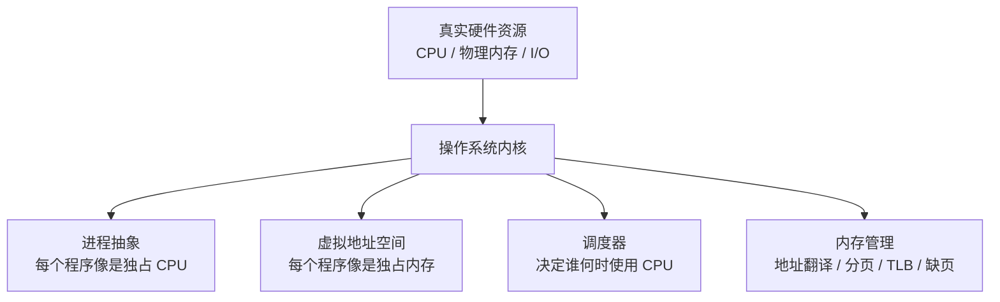
```mermaid
flowchart TD
    HW["真实硬件资源<br/>CPU / 物理内存 / I/O"] --> OS["操作系统内核"]
    OS --> P["进程抽象<br/>每个程序像是独占 CPU"]
    OS --> VM["虚拟地址空间<br/>每个程序像是独占内存"]
    OS --> SCH["调度器<br/>决定谁何时使用 CPU"]
    OS --> MM["内存管理<br/>地址翻译 / 分页 / TLB / 缺页"]
```

虚拟化部分可以分成三条线：

| 主线 | 核心问题 | 代表机制 |
| --- | --- | --- |
| 进程管理 | 如何把运行中的程序抽象成可管理对象 | PCB、进程状态、进程树、`fork/exec/wait/exit` |
| CPU 调度 | 多个可运行进程如何共享 CPU | FCFS、SJF、SRTF、RR、优先级、MLFQ、Lottery、实时调度、CFS |
| 内存管理 | 多个进程如何安全、灵活地共享物理内存 | 地址空间、分段、分页、页表、TLB、缺页、页面置换 |

一个统一的理解方式：

1. **进程**是“运行中程序”的抽象。
2. **调度**是“把 CPU 时间分给不同进程”的策略。
3. **虚拟内存**是“把物理内存包装成每个进程自己的地址空间”的机制。
4. **缺页和置换**是“物理内存不够时仍然运行大程序”的工程方案。

例子：你打开浏览器、编辑器和终端，机器只有有限 CPU 核和有限内存，但每个程序都像是自己在连续运行、自己有完整内存空间。这就是虚拟化带来的幻觉。

## 2. 进程抽象

### 2.1 什么是进程

进程没有唯一绝对定义，常见说法包括：

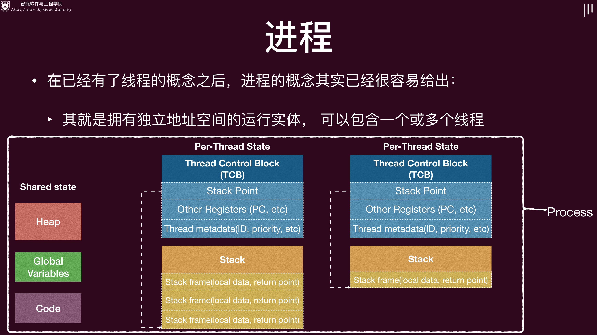

1. 正在执行的程序。
2. 可被分配给处理器并执行的实体。
3. 拥有当前状态和一组系统资源的活动单元。
4. 在有线程概念后，进程可以理解为：**拥有独立地址空间的运行实体，可以包含一个或多个线程**。

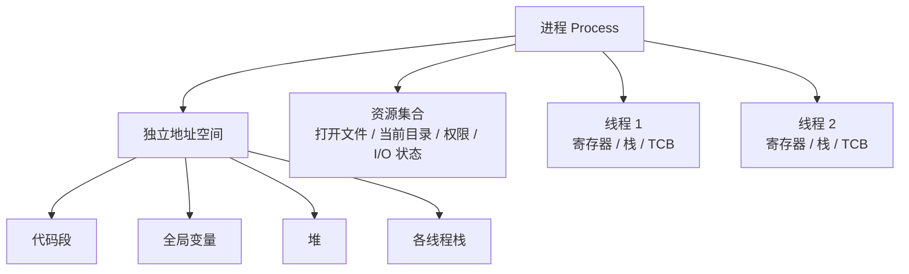
```mermaid
flowchart TD
    P["进程 Process"] --> AS["独立地址空间"]
    P --> R["资源集合<br/>打开文件 / 当前目录 / 权限 / I/O 状态"]
    P --> T1["线程 1<br/>寄存器 / 栈 / TCB"]
    P --> T2["线程 2<br/>寄存器 / 栈 / TCB"]
    AS --> CODE["代码段"]
    AS --> DATA["全局变量"]
    AS --> HEAP["堆"]
    AS --> STACKS["各线程栈"]
```

进程和线程的区别：

| 对象 | 拥有什么 | 共享什么 | 私有/独有的重点 |
| --- | --- | --- | --- |
| 进程 | 地址空间、资源、一个或多个线程 | 进程内线程共享地址空间和资源 | 进程之间相互隔离 |
| 线程 | 执行流 | 同进程线程共享代码、全局变量、堆、打开文件 | 寄存器、PC、栈、TCB |

例子：浏览器可以是一个进程，里面有多个线程：UI 线程、网络线程、渲染线程。它们共享浏览器进程的内存，但每个线程有自己的栈和执行位置。

### 2.2 PCB：进程控制块

操作系统需要为每个进程维护元信息，这些信息通常放在 PCB（Process Control Block）或类似结构中。

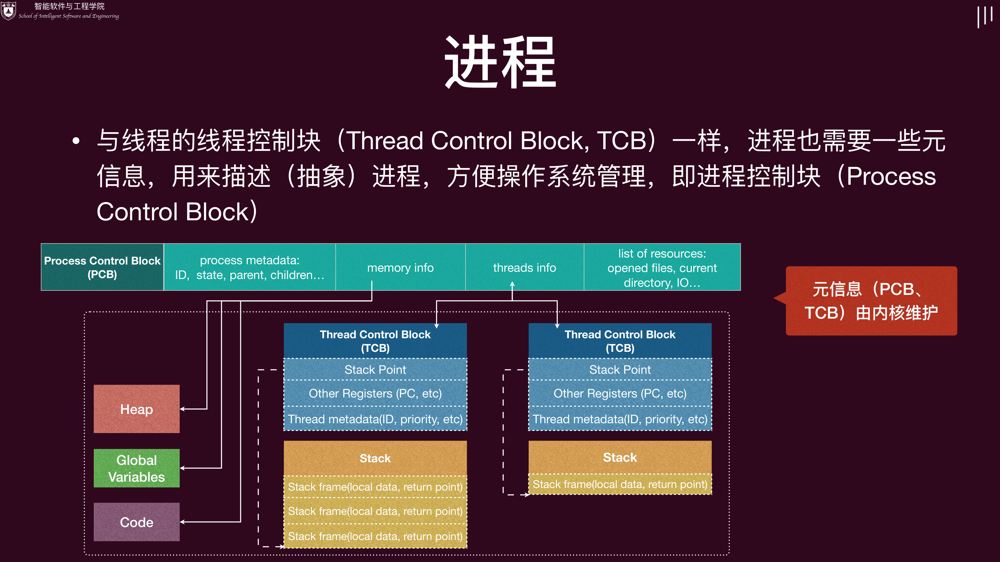

PCB 常见内容：

| 类别 | 内容 |
| --- | --- |
| 身份信息 | PID、父进程、子进程列表、进程组 |
| 状态信息 | new、ready、running、waiting、finished |
| CPU 上下文 | 程序计数器、寄存器、内核栈、上下文切换信息 |
| 内存信息 | 地址空间、页表、段信息、堆栈边界 |
| 资源信息 | 打开的文件、当前工作目录、I/O 状态、权限 |
| 调度信息 | 优先级、时间片、运行时间、等待时间 |

不同系统实现不同：

1. Linux 用 `task_struct` 统一描述任务。若两个 `task_struct` 共享同一个地址空间，它们就是同一进程中的线程。
2. Solaris 区分进程、轻量级进程和内核线程。
3. Windows 用 `EPROCESS` 表示进程，用 `ETHREAD` 表示线程。

### 2.3 进程树与第一个进程

进程通常由另一个进程创建，因此形成进程树。

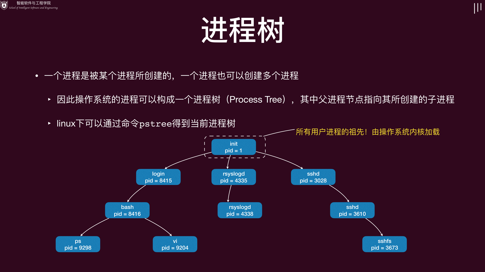

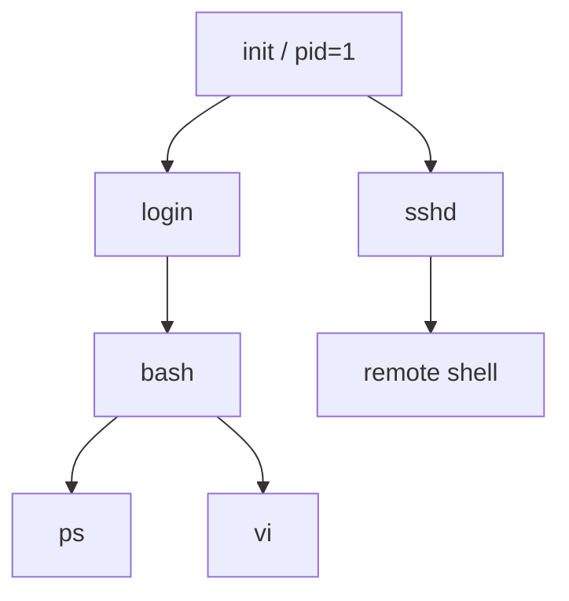
```mermaid
flowchart TD
    INIT["init / pid=1"] --> LOGIN["login"]
    INIT --> SSHD["sshd"]
    LOGIN --> BASH["bash"]
    BASH --> PS["ps"]
    BASH --> VI["vi"]
    SSHD --> SHELL["remote shell"]
```

第一个用户进程通常由内核启动，之后其他进程通过系统调用不断派生。

启动路径可以粗略理解为：

```text
CPU reset -> firmware -> 加载内核 -> 内核初始化 -> 启动第一个进程 -> 用户进程树展开
```

例子：Linux 里可以用 `pstree` 看到当前系统的进程树。

### 2.4 进程生命周期

单线程进程的典型状态：

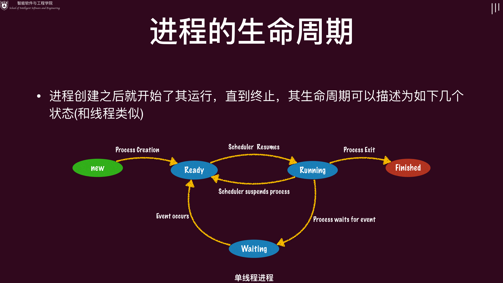

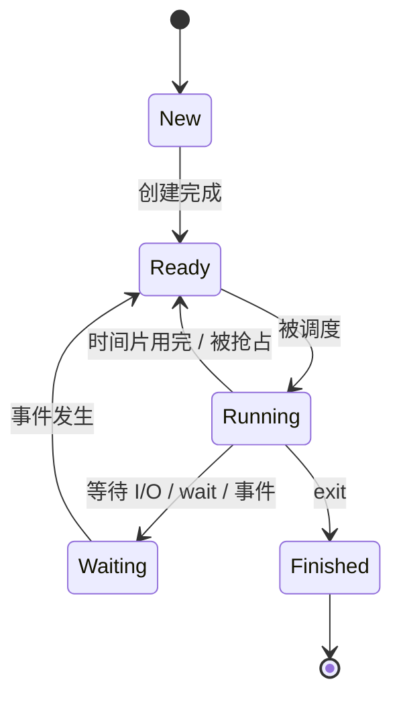
```mermaid
stateDiagram-v2
    [*] --> New
    New --> Ready: 创建完成
    Ready --> Running: 被调度
    Running --> Ready: 时间片用完 / 被抢占
    Running --> Waiting: 等待 I/O / wait / 事件
    Waiting --> Ready: 事件发生
    Running --> Finished: exit
    Finished --> [*]
```

多线程进程中，每个线程也有自己的 ready/running/waiting 状态，但整个进程的终止还与所有线程和资源回收有关。

### 2.5 僵尸进程与孤儿进程

进程终止后，内核需要保留一小部分退出信息给父进程读取。如果子进程结束但父进程还没有 `wait`，它就是**僵尸进程**。

| 类型 | 场景 | 处理方式 |
| --- | --- | --- |
| 僵尸进程 zombie | 子进程已退出，但父进程未 `wait` | 父进程 `wait/waitpid` 后回收 |
| 孤儿进程 orphan | 父进程先退出，子进程仍运行 | 通常被 `init` 或类似进程接管 |

例子：父进程创建子进程后一直不调用 `wait()`，子进程退出后就会在进程表中留下退出状态，直到父进程回收。

## 3. 进程系统调用

### 3.1 `fork`：创建进程

`fork()` 创建一个新的子进程。子进程几乎是父进程的副本，包括内存、寄存器现场、打开文件描述符等。

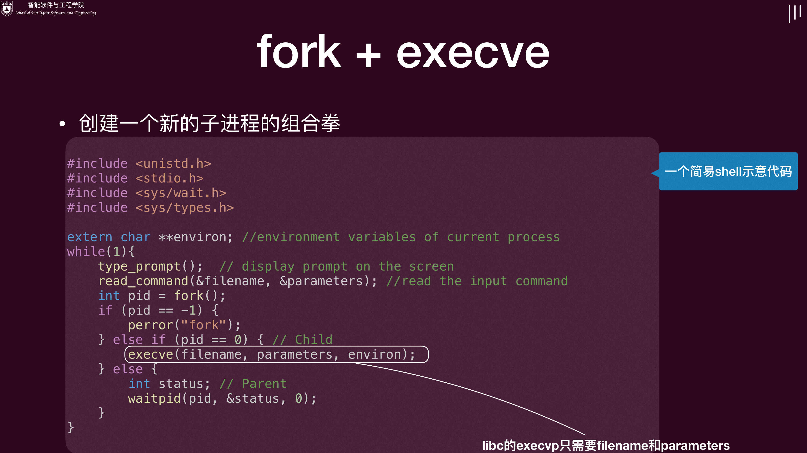

区别在返回值：

| 位置 | `fork()` 返回值 |
| --- | --- |
| 子进程 | `0` |
| 父进程 | 子进程 PID |
| 失败 | `-1`，设置 `errno` |

```c
pid_t pid = fork();
if (pid == 0) {
    // 子进程
} else if (pid > 0) {
    // 父进程
} else {
    // fork 失败
}
```

一个很容易考的点：连续 `fork()` 会指数级增加进程数。

```c
fork();
fork();
fork();
```

如果每次都成功，最终进程数是 `2^3 = 8`。

### 3.2 `fork` 会复制哪些东西

`fork` 会让父子进程各自独立继续执行 `fork` 后面的指令。

复制或继承的内容包括：

1. 地址空间内容，看起来像复制了一份。
2. 寄存器现场。
3. 打开的文件描述符。
4. 一些进程属性。

但也有差异：

1. PID 不同。
2. 父子关系不同。
3. `fork` 返回值不同。
4. 多线程进程 `fork` 时，子进程只复制调用 `fork` 的那个线程。

例子：父进程打开了一个文件后 `fork`，父子进程会有各自的 fd 表项，但这些 fd 表项通常指向同一个系统打开文件表项，因此共享文件偏移。

### 3.3 写时复制 Copy-On-Write

早期 `fork` 如果真的复制整个地址空间，开销很大，尤其是父进程随后马上 `exec` 时，复制完全浪费。

现代系统使用写时复制：

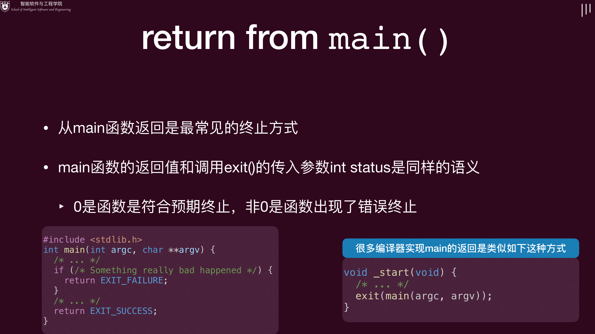

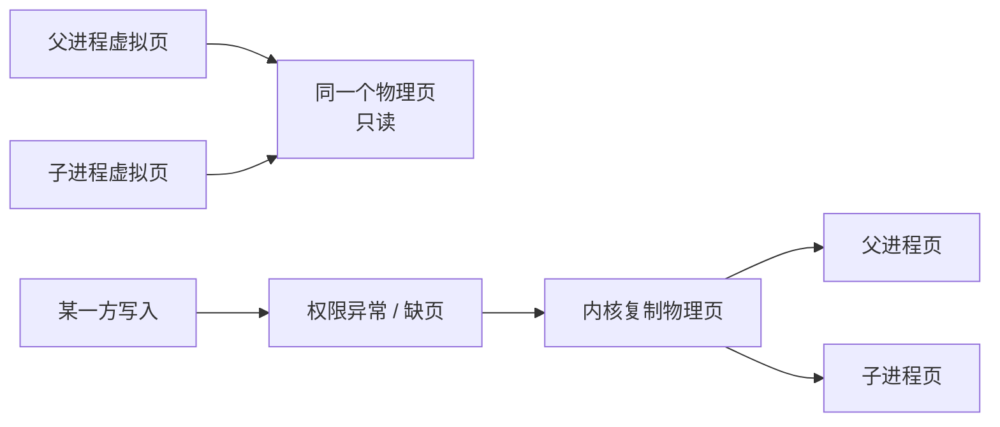
```mermaid
flowchart LR
    P1["父进程虚拟页"] --> F["同一个物理页<br/>只读"]
    P2["子进程虚拟页"] --> F
    W["某一方写入"] --> PF["权限异常 / 缺页"]
    PF --> C["内核复制物理页"]
    C --> F1["父进程页"]
    C --> F2["子进程页"]
```

做法：

1. 父子进程先共享同一份物理页。
2. 共享页标记为只读。
3. 任一方写入时触发异常。
4. 内核复制该页，给写入者一份私有副本。

例子：`fork` 后马上 `execve`，子进程几乎不写旧地址空间，因此 COW 避免了大量无意义复制。

### 3.4 `execve`：替换当前进程映像

`execve(pathname, argv, envp)` 不创建新进程，而是把**当前进程**重置成某个可执行文件的初始状态。

```text
原进程 PID 不变
地址空间被新程序替换
代码、数据、堆、栈重新初始化
打开文件描述符默认可能继续存在，除非设置 FD_CLOEXEC
```

常见组合：

```c
pid_t pid = fork();
if (pid == 0) {
    execve(filename, argv, envp);
    // execve 成功不会返回
} else {
    waitpid(pid, &status, 0);
}
```

这就是 shell 执行命令的核心套路：父进程 fork 出子进程，子进程 exec 成目标程序，父进程 wait。

### 3.5 `exit`、`wait`、信号

进程退出时要释放资源并通知父进程。

常见退出过程：

1. 关闭属于进程的文件描述符。
2. 释放地址空间、页表等资源。
3. 把退出状态留给父进程。
4. 给父进程发送 `SIGCHLD`。
5. 父进程通过 `wait/waitpid` 回收子进程状态。

如果父进程不关心子进程，可以忽略 `SIGCHLD`，某些系统会让子进程结束后直接被内核完全清除。

信号也是一种进程间通信机制，用于通知进程发生了某个事件。

## 4. 调度基础

### 4.1 什么是调度

调度是为了满足既定目标，对计算任务进行资源分配的行为。

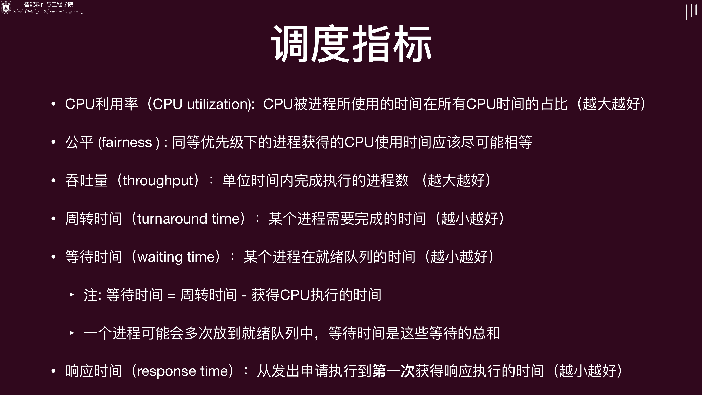

调度对象可以是：

1. 进程。
2. 线程。
3. 数据流。
4. 网络连接。
5. GPU 任务。

操作系统课程中主要讨论 CPU 调度：多个可运行进程/线程如何共享 CPU。

### 4.2 调度指标

| 指标 | 含义 | 越大越好还是越小越好 |
| --- | --- | --- |
| CPU 利用率 | CPU 被有效使用的比例 | 越大越好 |
| 公平性 | 同等优先级任务获得相近 CPU 时间 | 越公平越好 |
| 吞吐量 | 单位时间完成的任务数 | 越大越好 |
| 周转时间 | 任务从提交到完成的总时间 | 越小越好 |
| 等待时间 | 任务在就绪队列中等待的总时间 | 越小越好 |
| 响应时间 | 从请求执行到第一次得到 CPU 的时间 | 越小越好 |

关系：

```text
等待时间 = 周转时间 - 实际运行时间
```

一个进程可能多次进入就绪队列，等待时间是这些等待的总和。

### 4.3 调度时机

当 CPU 回到操作系统掌控时，调度器可能运行：

1. 发生系统调用，如 `fork()`、`exit()`。
2. 当前进程阻塞，如 `wait()`、等待 I/O。
3. 发生中断，如 I/O 中断、时钟中断。
4. 时间片到期。

### 4.4 机制与策略

操作系统设计中常强调“机制与策略分离”。

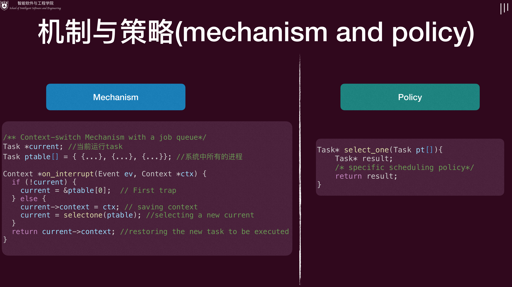

| 概念 | 问题 | 例子 |
| --- | --- | --- |
| 机制 | 怎么做 | 保存/恢复上下文，维护就绪队列，处理时钟中断 |
| 策略 | 选择谁 | FCFS、SJF、RR、MLFQ、CFS |


```mermaid
flowchart LR
    INT["中断 / 系统调用"] --> SAVE["保存当前上下文"]
    SAVE --> POLICY["调度策略选择下一个任务"]
    POLICY --> RESTORE["恢复新任务上下文"]
    RESTORE --> RUN["运行用户程序"]
```

例子：上下文切换机制不关心你用 FCFS 还是 RR；调度策略只决定从队列中挑哪个任务。

## 5. 批处理任务调度

### 5.1 FCFS / FIFO：先来先服务

FCFS 按到达就绪队列的顺序执行。

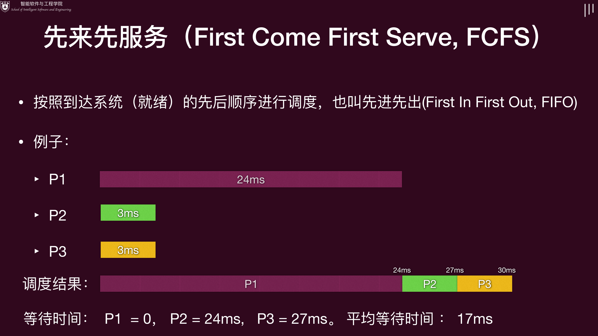

例子：

```text
P1 = 24ms, P2 = 3ms, P3 = 3ms
顺序：P1 -> P2 -> P3
等待时间：P1=0, P2=24, P3=27
平均等待时间 = (0+24+27)/3 = 17ms
```

问题是**护航效应**：长任务排在前面，会让后面的短任务长时间等待。

如果顺序改成：

```text
P2 -> P3 -> P1
等待时间：0, 3, 6
平均等待时间 = 3ms
```

短任务明显受益。

### 5.2 SJF：最短任务优先

SJF 总是选择运行时间最短的任务先执行。对于所有任务同时到达且非抢占的情况，SJF 可以最小化平均等待时间。

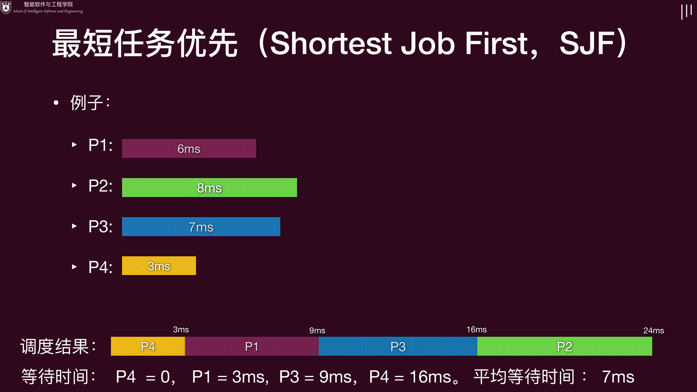

例子：

```text
P1=6ms, P2=8ms, P3=7ms, P4=3ms
SJF 顺序：P4 -> P1 -> P3 -> P2
等待时间：P4=0, P1=3, P3=9, P2=16
平均等待时间 = 7ms
```

SJF 最优性的直觉：如果一个长任务排在短任务前面，交换它们会减少短任务等待的时间，而长任务只多等短任务的时间；总体等待会下降。

缺点：

1. 不公平。
2. 长任务可能饿死。
3. 运行时间很难提前知道。
4. 容易被“切成小任务”的行为欺骗。

### 5.3 SRTF：最短剩余时间优先

SRTF 是 SJF 的抢占式版本。每次调度都选择**剩余运行时间最短**的任务。

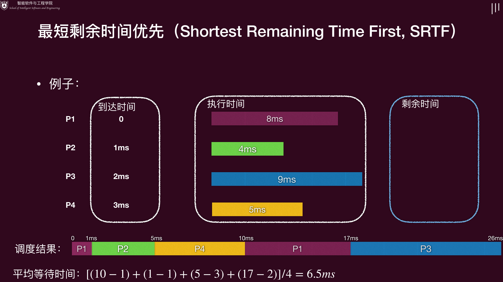

例子：

| 进程 | 到达时间 | 总运行时间 |
| --- | --- | --- |
| P1 | 0 | 8ms |
| P2 | 1ms | 4ms |
| P3 | 2ms | 9ms |
| P4 | 3ms | 5ms |

调度过程：

```text
0-1: P1
1-5: P2
5-10: P4
10-17: P1
17-26: P3
```

平均等待时间：

```text
P1 等待 = 10 - 1 = 9
P2 等待 = 1 - 1 = 0
P4 等待 = 5 - 3 = 2
P3 等待 = 17 - 2 = 15
平均 = (9+0+2+15)/4 = 6.5ms
```

### 5.4 运行时间预测

SJF/SRTF 需要知道任务运行时间，实际系统通常只能预测。课件给出指数移动平均：

```text
τ_{n+1} = α t_n + (1 - α) τ_n
```

| 符号 | 含义 |
| --- | --- |
| `t_n` | 第 n 次实际运行时间 |
| `τ_n` | 对第 n 次运行时间的预测 |
| `τ_{n+1}` | 对下一次运行时间的预测 |
| `α` | 最近历史的权重 |

当 `α=0`，完全不看最近历史；当 `α=1`，只看最近一次。通常 `α` 可取 0.5 左右。

## 6. 交互式任务调度

### 6.1 CPU 密集型与 I/O 密集型

| 类型 | 特征 | 例子 |
| --- | --- | --- |
| CPU 密集型 | 长时间计算，很少等待外部事件 | 数值计算、压缩、渲染 |
| I/O 密集型 | 经常等待磁盘、网络、键盘等 I/O | 编辑器、终端、网络服务 |

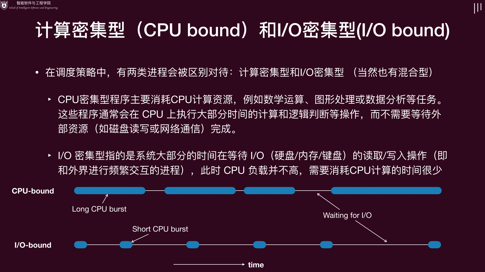

I/O 密集型任务通常每次只需要短 CPU burst，但希望响应快。

### 6.2 RR：时间片轮转

Round Robin 给每个任务固定时间片。用完没结束，就放回队尾。

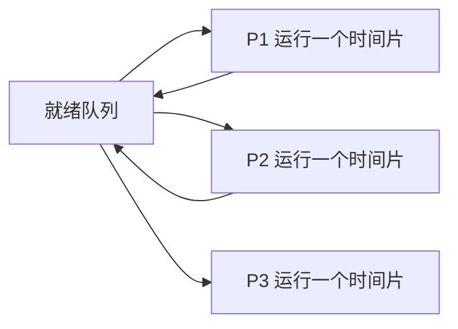
```mermaid
flowchart LR
    Q["就绪队列"] --> P1["P1 运行一个时间片"]
    P1 --> Q
    Q --> P2["P2 运行一个时间片"]
    P2 --> Q
    Q --> P3["P3 运行一个时间片"]
```

时间片选择很重要：

1. 太小：上下文切换开销大。
2. 太大：退化成 FCFS，响应时间变差。
3. 实际常见时间片大约 10ms 到 100ms，通常远大于上下文切换开销。

例子：`P1=8ms, P2=5ms, P3=3ms`，时间片 4ms：

```text
P1(4) -> P2(4) -> P3(3完成) -> P1(4完成) -> P2(1完成)
```

RR 响应时间好，但平均周转时间可能比 SJF 差。

### 6.3 优先级调度

每个进程有优先级，调度器选择最高优先级任务。

SJF 也可看成一种优先级调度：预测 CPU burst 越短，优先级越高。

Linux 中常见优先级：

| 类型 | 范围 | 说明 |
| --- | --- | --- |
| 实时任务 | 0-99 | 高优先级，可用 `chrt` 设置 |
| 普通任务 | 100-139 | 与 nice 值相关，可用 `nice/renice` 调整 |

问题：低优先级进程可能饿死。

解决：**老化 aging**，即等待越久优先级越高。

### 6.4 MLFQ：多级反馈队列

MLFQ 让任务在不同优先级队列间移动，以动态区分交互型和 CPU 密集型任务。

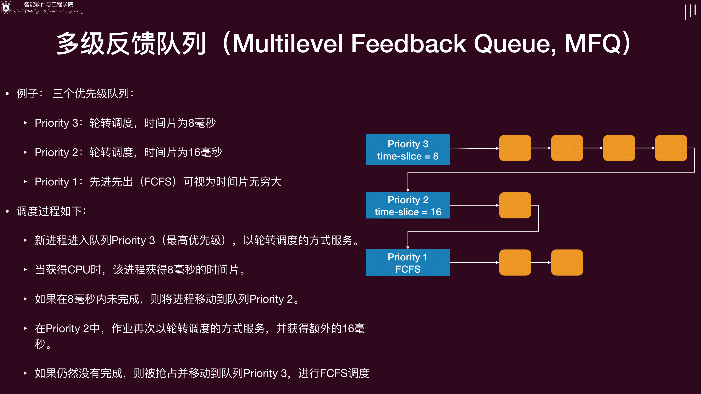

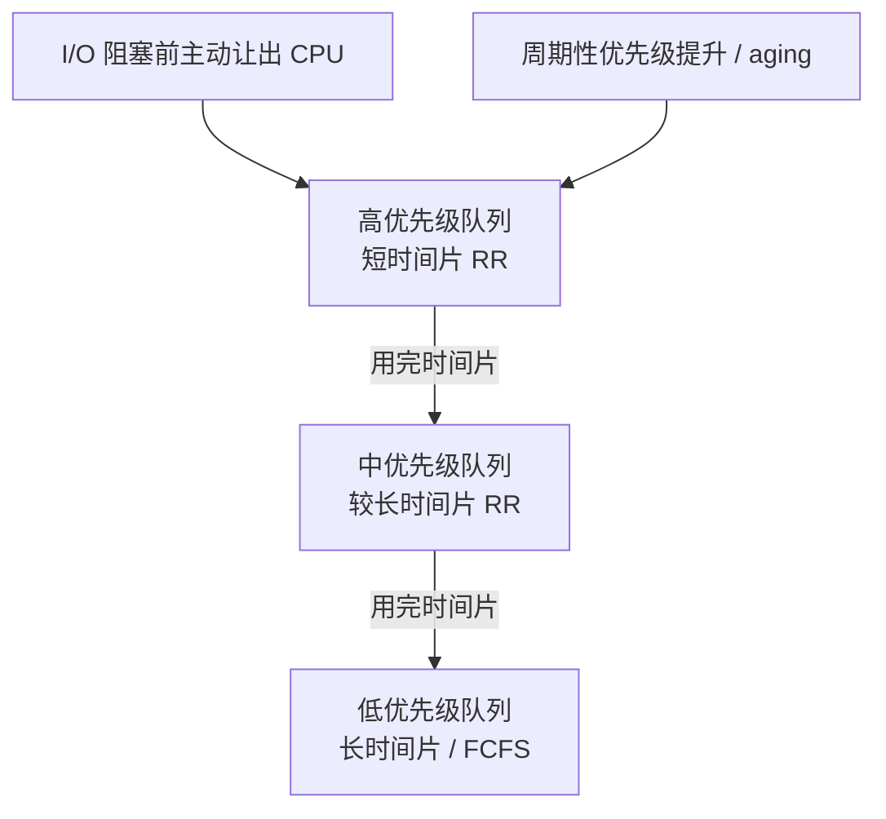
```mermaid
flowchart TD
    Q3["高优先级队列<br/>短时间片 RR"] -->|用完时间片| Q2["中优先级队列<br/>较长时间片 RR"]
    Q2 -->|用完时间片| Q1["低优先级队列<br/>长时间片 / FCFS"]
    IO["I/O 阻塞前主动让出 CPU"] --> Q3
    AGE["周期性优先级提升 / aging"] --> Q3
```

典型规则：

1. 新进程进入最高优先级队列。
2. 高优先级队列时间片短，低优先级队列时间片长。
3. 如果进程用完整个时间片，降低优先级。
4. 如果进程因 I/O 阻塞提前让出 CPU，保持较高优先级。
5. 周期性把所有进程提升到高优先级，防止饥饿。

效果：

| 进程类型 | 行为 | MLFQ 结果 |
| --- | --- | --- |
| I/O 密集型 | 经常提前阻塞 | 留在高优先级，响应快 |
| CPU 密集型 | 总是用完整时间片 | 下沉到低优先级，减少切换开销 |

MLFQ 也可能被欺骗：程序在时间片快用完前主动睡眠，让调度器误以为它是交互型。解决方法是跟踪较长时间窗口内的累计 CPU 使用量，而不只看单个时间片是否用完。

### 6.5 Lottery：乐透调度

Lottery 调度给每个任务分配若干张彩票，每次随机抽一张中奖票。票数越多，获得 CPU 的概率越大。

例子：

```text
A 有 80 张票，B 有 20 张票
长期看 A 获得约 80% CPU，B 获得约 20% CPU
```

优点：

1. 简单灵活。
2. 可表达比例份额。
3. 每个任务至少一张票可避免彻底饿死。

缺点：短期结果有随机波动。

## 7. 实时与现代调度

### 7.1 实时系统

实时系统中，任务必须在 deadline 前完成。错过 deadline 可能等同于失败。

周期任务常用参数：

| 参数 | 含义 |
| --- | --- |
| `P_i` | 周期 |
| `C_i` | 每周期需要的计算时间 |
| `D_i` | 截止期限，简单模型中常等于周期 |

准入控制基本条件：

```text
Σ(C_i / P_i) <= 1
```

意思是所有周期任务的 CPU 利用率总和不能超过 100%。

### 7.2 Rate Monotonic：单调速率调度

Rate Monotonic 按周期分配固定优先级：周期越短，频率越高，优先级越高。

例子：

```text
P1: 周期 50, 计算 20
P2: 周期 100, 计算 35
```

利用率：

```text
20/50 + 35/100 = 0.75 <= 1
```

P1 周期更短，所以优先级高。P1 可以抢占 P2。

### 7.3 EDF：最早截止期限优先

EDF（Earliest Deadline First）动态选择截止期限最近的任务。和 Rate Monotonic 不同，EDF 优先级会随当前 deadline 变化。

| 算法 | 优先级是否固定 | 依据 |
| --- | --- | --- |
| Rate Monotonic | 固定 | 周期长短 |
| EDF | 动态 | 当前最早 deadline |

### 7.4 Linux CFS：完全公平调度器

CFS 的目标是公平：每个普通进程获得相等份额的 CPU 时间。

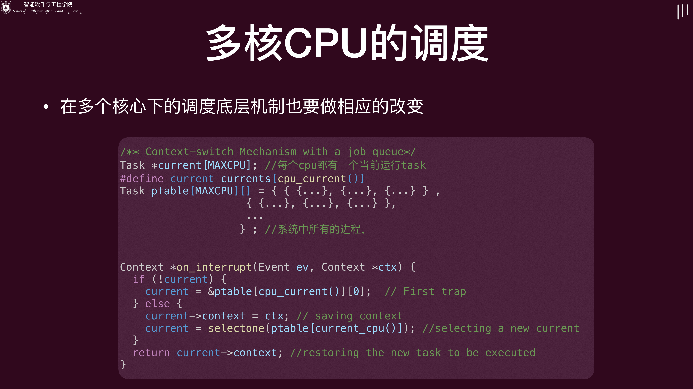

核心思路：

1. 不维护传统时间片队列，而是维护按虚拟运行时间排序的红黑树。
2. 每次选择虚拟运行时间最小的任务。
3. 任务运行后，其虚拟运行时间增加。
4. 权重高的任务，虚拟运行时间增长更慢，因此获得更多 CPU。


```mermaid
flowchart LR
    RB["红黑树<br/>按 vruntime 排序"] --> L["最左节点<br/>vruntime 最小"]
    L --> RUN["被调度运行"]
    RUN --> UPDATE["更新 vruntime"]
    UPDATE --> RB
```

公式直觉：

```text
权重越高 -> vruntime 增长越慢 -> 更容易再次成为最小 -> 获得更多 CPU
```

睡眠后唤醒的任务不能简单把 vruntime 保持很小，否则会被疯狂补偿；CFS 会把它的 vruntime 调整到当前就绪任务中较小的合理位置附近。

### 7.5 多核调度

多核系统有两种典型思路：

| 方式 | 含义 | 优点 | 问题 |
| --- | --- | --- | --- |
| 全局队列 | 所有 CPU 从同一个队列取任务 | 负载均衡简单 | 队列锁竞争严重 |
| 每 CPU 队列 | 每个 CPU 有私有运行队列 | 锁竞争少、缓存局部性好 | 可能负载不均，需要迁移 |

多核调度还要考虑：

1. **缓存亲和性**：线程继续在同一 CPU 上运行，缓存命中率更好。
2. **NUMA**：线程最好运行在靠近其内存的 CPU 上。
3. **负载均衡**：避免一个 CPU 很忙，另一个 CPU 空闲。
4. **优先级反转**：高优先级任务等待低优先级任务持有的锁，调度器需要配合锁机制处理。

## 8. 内存管理基础

### 8.1 为什么需要虚拟内存

物理内存本质上只是可读写字节数组。进程抽象出现后，内存就有了语义：它代表进程状态。操作系统必须保护这种状态。

非法情况包括：

1. 一个进程修改另一个进程的内存。
2. 进程申请内存时占用了已经被使用的区域。
3. 进程违反读写执行权限。
4. 用户程序修改内核代码或数据。

早期单道程序系统没有这些问题，因为一次只有一个程序。多道程序出现后，多个进程同时在内存中，必须隔离。

### 8.2 保护键与基址界限

IBM/360 曾使用 Protection Key：把物理内存分块，每块有 key；当前进程也有 key，访问时检查是否匹配。问题是寄存器需求太大，机制不够通用。

更通用的早期方案是基址和界限：

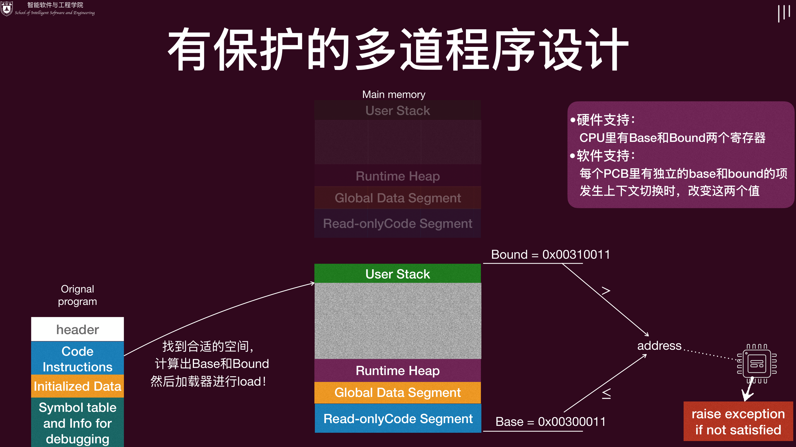

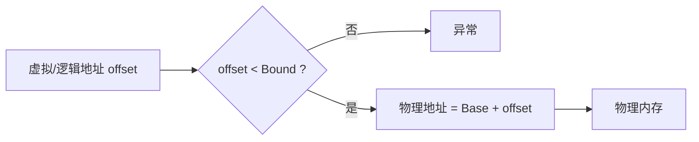
```mermaid
flowchart LR
    VA["虚拟/逻辑地址 offset"] --> CHECK{"offset < Bound ?"}
    CHECK -->|否| EX["异常"]
    CHECK -->|是| ADD["物理地址 = Base + offset"]
    ADD --> MEM["物理内存"]
```

硬件有 `Base` 和 `Bound/Limit` 寄存器；PCB 中保存每个进程的基址和界限。上下文切换时，OS 切换这些寄存器。

缺点：

1. 每个进程仍要占一段连续物理内存。
2. 地址空间内部未使用区域浪费。
3. 共享和细粒度保护不方便。
4. 应用仍可能感知物理布局或受到加载位置影响。

### 8.3 虚拟地址空间

虚拟内存引入另一层间接：程序使用虚拟地址，硬件 MMU 自动翻译成物理地址。

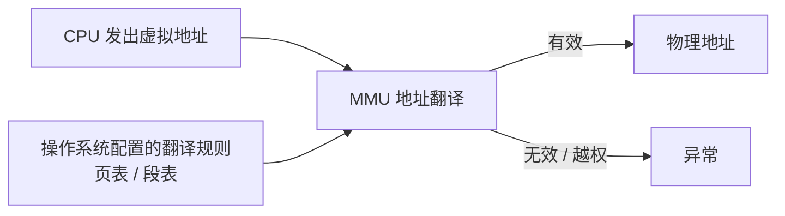
```mermaid
flowchart LR
    CPU["CPU 发出虚拟地址"] --> MMU["MMU 地址翻译"]
    PT["操作系统配置的翻译规则<br/>页表 / 段表"] --> MMU
    MMU -->|有效| PA["物理地址"]
    MMU -->|无效 / 越权| EX["异常"]
```

地址翻译可以看成函数：

```text
f(pid, virtual address) -> physical address
```

虚拟内存带来的能力：

| 能力 | 说明 |
| --- | --- |
| 保护 | 不同进程虚拟地址映射到不同物理区域 |
| 动态重定位 | 进程物理位置可运行时改变 |
| 数据共享 | 不同进程虚拟页映射到同一物理页 |
| 连续假象 | 虚拟地址连续，物理内存可不连续 |
| 透明性 | 应用不必知道物理地址 |

Linux 中可通过 `/proc/[pid]/maps` 查看进程虚拟地址空间；可通过 `brk`、`mmap`、`munmap` 改变映射。

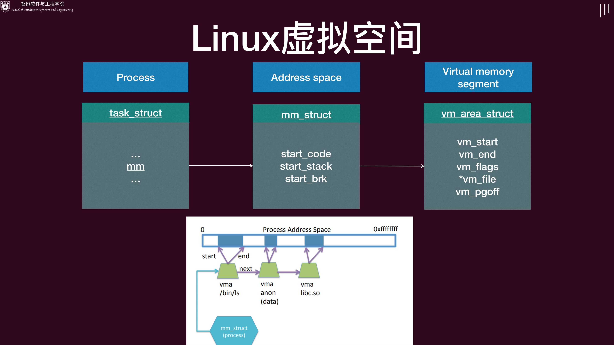

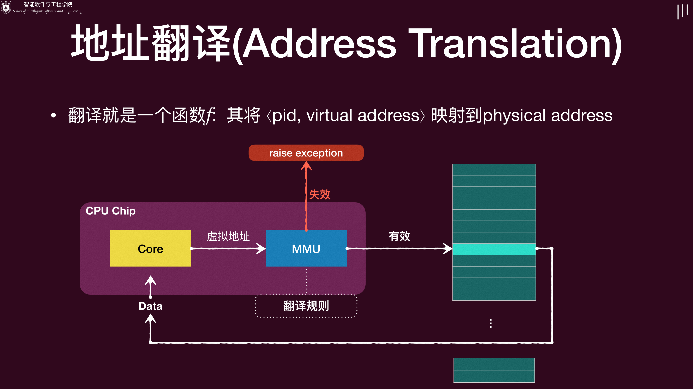

## 9. 连续分配与空闲内存管理

### 9.1 固定分区与可变分区

连续分配让每个进程占一段连续物理内存。

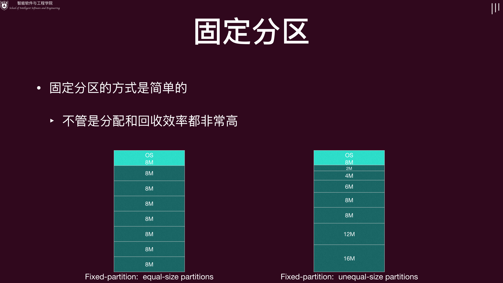

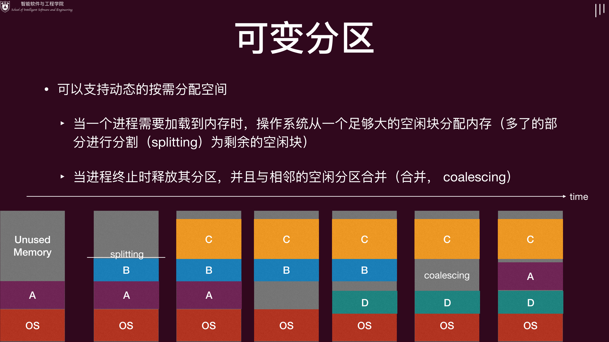

| 方式 | 做法 | 优点 | 缺点 |
| --- | --- | --- | --- |
| 固定分区 | 启动时把内存切成固定大小区域 | 分配回收简单 | 内部碎片，进程大小受限，分区数限制并发数 |
| 可变分区 | 按进程需求从空闲块中切一块 | 更灵活 | 外部碎片，需要复杂空闲管理 |

可变分区中的操作：

1. 分配时从足够大的空闲块中切出一块，剩余部分继续空闲。
2. 回收时与相邻空闲块合并。

### 9.2 内部碎片与外部碎片

| 碎片类型 | 发生位置 | 例子 |
| --- | --- | --- |
| 内部碎片 | 已分配分区内部 | 分区 8MB，进程只用 6MB，剩余 2MB 不能给别人 |
| 外部碎片 | 已分配分区之间 | 总空闲很多，但分散成小洞，放不下大进程 |

外部碎片可通过紧缩 compaction 缓解：移动内存内容，把空闲空间聚合成大块。但代价高，通常只在 slow path 中做。

### 9.3 空闲内存管理

操作系统要维护空闲区域。

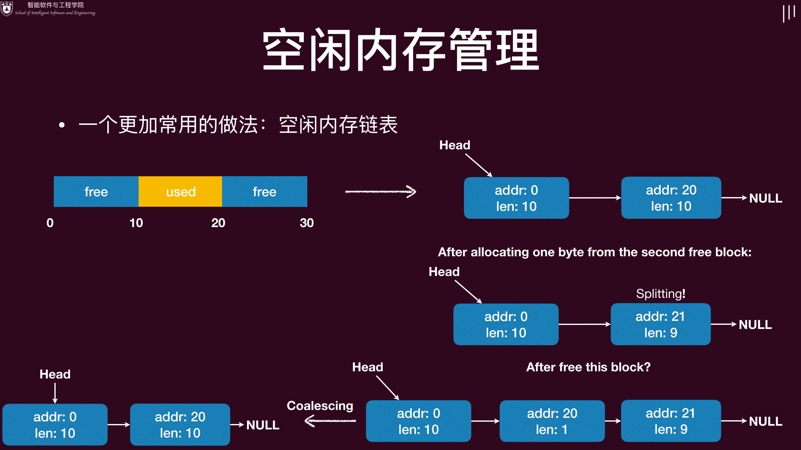

常见做法：

| 结构 | 思路 | 优缺点 |
| --- | --- | --- |
| Bitmap | 每个分配单元 1 bit 表示空闲/占用 | 简单，但找连续 k 位可能慢 |
| 空闲链表 | 每个空闲块记录地址和长度 | 常见，需要处理分裂和合并 |
| 红黑树等 | 按大小或地址组织空闲块 | 搜索更快，实现复杂 |

基本分配策略：

| 策略 | 做法 | 特点 |
| --- | --- | --- |
| First-fit | 找第一个足够大的空闲块 | 搜索少，常用 |
| Next-fit | 从上次结束位置继续找 | 更均匀扫描 |
| Best-fit | 找最小的足够大空闲块 | 可能留下很多小碎片 |
| Worst-fit | 找最大的空闲块 | 剩余块大，但也要遍历 |

### 9.4 Buddy System：伙伴系统

伙伴系统用于分配物理上连续的页，按 2 的幂管理。

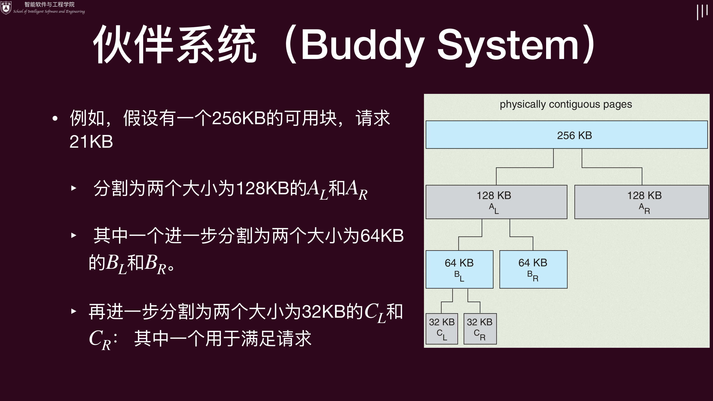

规则：

1. 请求大小向上取整到 2 的幂。
2. 大块可不断拆成两个大小相等的伙伴。
3. 释放时，如果伙伴也空闲，则合并成更大块，递归向上。

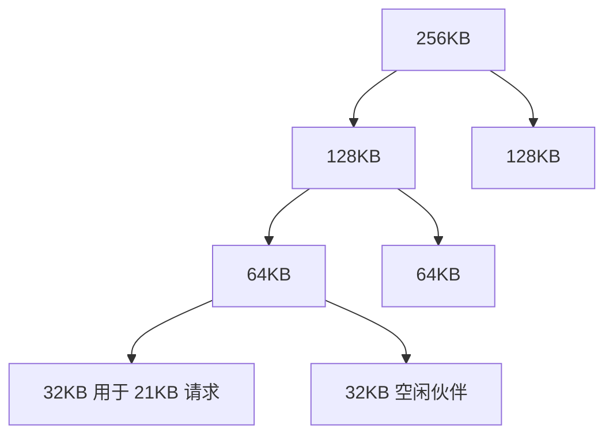
```mermaid
flowchart TD
    A["256KB"] --> B1["128KB"]
    A --> B2["128KB"]
    B1 --> C1["64KB"]
    B1 --> C2["64KB"]
    C1 --> D1["32KB 用于 21KB 请求"]
    C1 --> D2["32KB 空闲伙伴"]
```

优点：伙伴地址容易计算，合并效率高。

缺点：内部碎片。例如请求 21KB，实际分配 32KB，浪费 11KB。

Linux 用伙伴系统分配较大粒度的连续物理页。

### 9.5 Slab / SLUB 分配器

内核经常分配几十或几百字节的小对象，如果直接用伙伴系统会浪费。

Slab 思路：

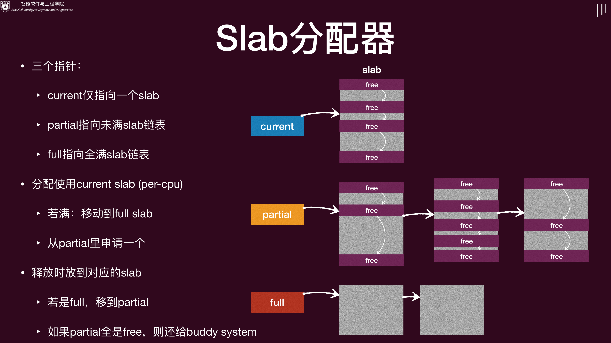

1. 从伙伴系统拿大块内存。
2. 切成固定大小的小对象池。
3. 对每种大小或每种常用结构体维护独立缓存。
4. 分配和释放小对象非常快。

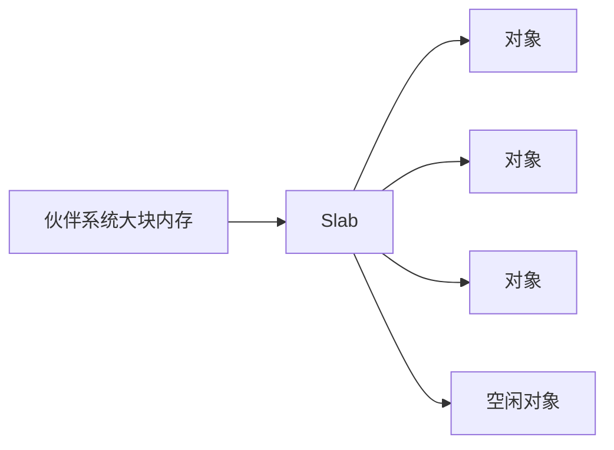
```mermaid
flowchart LR
    BUDDY["伙伴系统大块内存"] --> SLAB["Slab"]
    SLAB --> O1["对象"]
    SLAB --> O2["对象"]
    SLAB --> O3["对象"]
    SLAB --> O4["空闲对象"]
```

Slab 通常维护：

1. `current slab`：当前分配用。
2. `partial slab`：部分空闲。
3. `full slab`：已满。

多核下可用 per-CPU slab 减少锁竞争。

## 10. 分段

### 10.1 为什么需要分段

连续分配把进程当成一个整体，但进程内部有不同逻辑区域：代码、数据、堆、栈。它们大小和权限不同。

分段把虚拟地址空间划分成多个逻辑段。


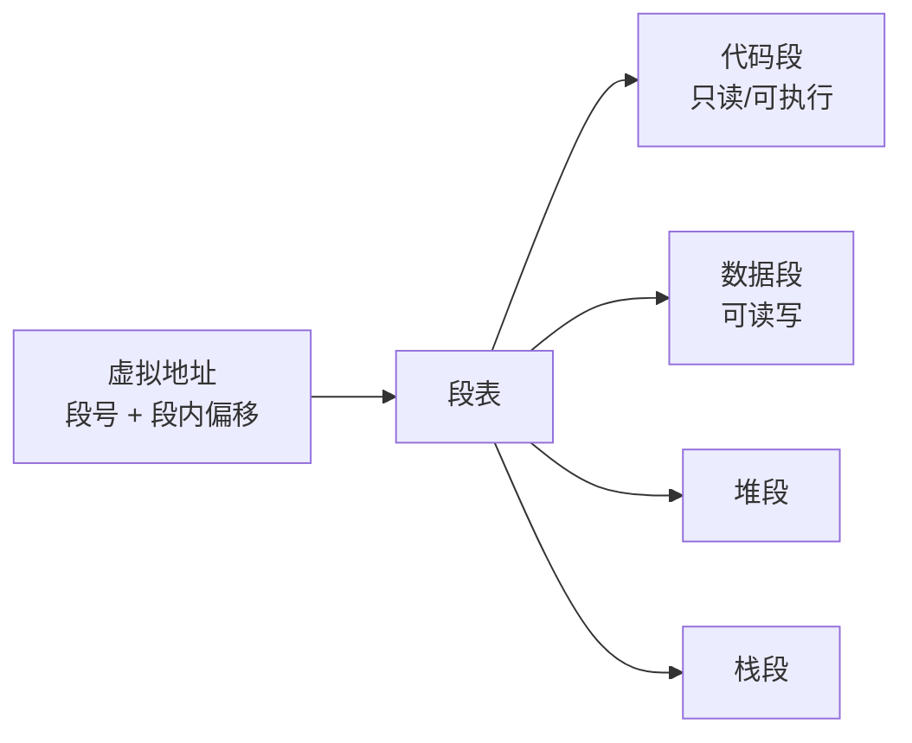
```mermaid
flowchart LR
    VA["虚拟地址<br/>段号 + 段内偏移"] --> ST["段表"]
    ST --> S1["代码段<br/>只读/可执行"]
    ST --> S2["数据段<br/>可读写"]
    ST --> S3["堆段"]
    ST --> S4["栈段"]
```

段是虚拟地址空间中连续的逻辑单元，但不同段可映射到物理内存中不相邻的位置。

### 10.2 分段地址翻译

每个进程有段表。段表项包含：

| 字段 | 作用 |
| --- | --- |
| 段基址 base | 该段在物理内存中的起始地址 |
| 段界限 limit | 段长度，检查偏移是否越界 |
| 权限 | 读/写/执行 |
| 有效位 | 段是否存在 |

翻译过程：

```text
虚拟地址 = 段号 + 段内偏移
查段表[段号]
检查 offset < limit 且权限合法
物理地址 = base + offset
```

优点：

1. 按逻辑区域管理内存。
2. 可对不同段设置不同权限。
3. 可共享段，例如多个进程共享只读代码段。
4. 不需要映射未使用的虚拟地址区域。

缺点：

1. 段大小不固定，物理内存仍会有外部碎片。
2. 内存分配仍是动态可变分区问题。
3. 如果程序使用模式和段设计不匹配，管理会麻烦。

## 11. 分页

### 11.1 分页的基本思想

分页把虚拟内存和物理内存都切成固定大小块：

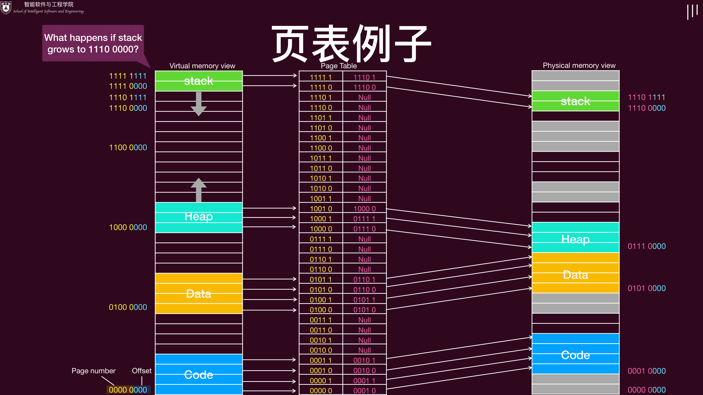

| 名称 | 含义 |
| --- | --- |
| 虚拟页 VPN | 虚拟地址空间中的固定大小块 |
| 物理页帧 PFN | 物理内存中的固定大小块 |
| 页表 | 记录 VPN 到 PFN 的映射 |
| 页表项 PTE | 页表中的一项 |

任意虚拟页可以映射到任意物理页帧。


```mermaid
flowchart LR
    VA["虚拟地址<br/>VPN + offset"] --> PT["页表"]
    PT --> PFN["物理页帧号 PFN"]
    PFN --> PA["物理地址<br/>PFN + offset"]
```

分页优点：

1. 没有外部碎片。
2. 物理内存不需要连续。
3. 分配和回收以页为单位，简单统一。
4. 支持按页权限、共享、换入换出。

缺点：

1. 页表可能很大。
2. 可能有内部碎片，最后一页未必用满。
3. 地址翻译需要额外访存，需要 TLB 加速。

### 11.2 页表项内容

页表项常见字段：

| 字段 | 作用 |
| --- | --- |
| 物理页帧号 PFN | 指向实际物理页 |
| 存在位 present | 页是否在物理内存中 |
| 保护位 | 是否可读/写/执行，用户态是否可访问 |
| 脏位 dirty | 页自载入后是否被修改 |
| 引用位 / 访问位 referenced | 页是否被访问过，用于置换 |
| 有效位 | 该虚拟页是否合法 |

例子：如果程序写一个只读代码页，硬件检查 PTE 权限失败，触发异常。

### 11.3 页表大小问题

单级线性页表就是一个数组，每个虚拟页一个 PTE。

例子：32 位地址空间，页大小 4KB，PTE 4B。

```text
虚拟页数 = 2^32 / 2^12 = 2^20
页表大小 = 2^20 * 4B = 4MB
```

一个进程 4MB 页表还可以接受，但如果很多进程，或 64 位地址空间，单级页表就太大。实际程序也只使用虚拟地址空间的一小部分，为未使用区域分配页表很浪费。

### 11.4 多级页表

多级页表只为实际使用的虚拟地址区域分配下级页表。


```mermaid
flowchart LR
    VA["虚拟地址"] --> L1["一级页表索引"]
    L1 --> L2["二级页表"]
    L2 --> PTE["页表项"]
    PTE --> PF["物理页帧"]
```

优点：节省页表空间，适合稀疏地址空间。

缺点：一次地址翻译可能需要多次内存访问，因此更依赖 TLB。

### 11.5 倒排页表

倒排页表不为每个虚拟页建表，而是为每个物理页建一项。每项记录：

1. 使用该物理页的进程。
2. 该进程的哪个虚拟页映射到这里。

优点：表大小约等于物理页数，而不是虚拟页数。

缺点：按虚拟地址查物理地址更困难，查找慢，页表局部性差，通常需要哈希辅助。

## 12. TLB

### 12.1 为什么需要 TLB

分页地址翻译会增加访存次数。没有 TLB 时，访问一个数据可能要：

1. 访问页表，找到 PFN。
2. 访问真正数据。

TLB（Translation Lookaside Buffer）是 MMU 中的小型高速缓存，缓存最近的 VPN -> PFN 翻译。

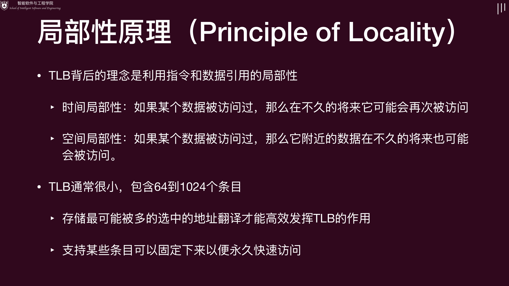

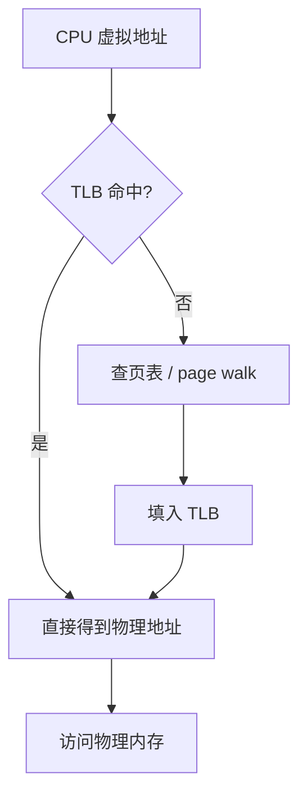
```mermaid
flowchart TD
    CPU["CPU 虚拟地址"] --> TLB{"TLB 命中?"}
    TLB -->|是| PA["直接得到物理地址"]
    TLB -->|否| WALK["查页表 / page walk"]
    WALK --> FILL["填入 TLB"]
    FILL --> PA
    PA --> MEM["访问物理内存"]
```

### 12.2 TLB 有效访问时间

假设：

1. TLB 查找时间 20ns。
2. 内存访问时间 100ns。
3. TLB 命中率 80%。

若命中：

```text
20 + 100 = 120ns
```

若未命中，简化为先查页表再访问数据：

```text
20 + 100 + 100 = 220ns
```

平均：

```text
EAT = 0.8 * 120 + 0.2 * 220 = 140ns
```

命中率越高，地址翻译越接近一次普通访存。

### 12.3 TLB Miss 处理

TLB miss 有两种处理方式：

| 类型 | 做法 | 代表 |
| --- | --- | --- |
| 硬件处理 | 硬件知道页表格式，自动 page walk | x86 常见 |
| 软件处理 | 触发异常，由 OS 填 TLB | MIPS 等 RISC 设计 |

上下文切换时，TLB 中旧进程的映射可能不再正确，需要：

1. 清空 TLB。
2. 或使用带 ASID/PCID 的标记 TLB，让不同进程的 TLB 项共存。

## 13. 交换与真正的虚拟内存

### 13.1 Swapping：进程级交换

如果物理内存装不下所有进程，可以把整个进程暂时换出到后备存储，之后再换回。

问题：交换时间主要是磁盘传输时间，和交换内存量成正比。

例子：100MB 进程，磁盘传输速率 50MB/s。

```text
换出或换入时间 = 100MB / 50MB/s = 2s
```

如果进程正在进行 I/O，而 I/O 缓冲区在它的地址空间里，把这部分页换出可能导致 I/O 失败或数据丢失。因此 I/O 相关页常需要锁定在内存中。

现代系统通常不再频繁使用传统“整个进程交换”，而是在内存很低时启用变体。移动系统常不支持传统交换，可能要求应用释放内存或直接终止应用。

### 13.2 部分驻留与需求分页

如果单个进程本身大于物理内存，整个进程交换也不够。关键观察：程序不是所有代码和数据都会同时活跃。

虚拟内存让进程只有常用页驻留在物理内存中，其他页可以在磁盘或文件中。

优点：

1. 程序可超过物理内存。
2. 每个程序启动时不必全部加载。
3. 同时运行更多进程。
4. 物理内存像所有页面的缓存。

## 14. 缺页异常

### 14.1 缺页发生条件

PTE 中有 present 位。访问虚拟页时：

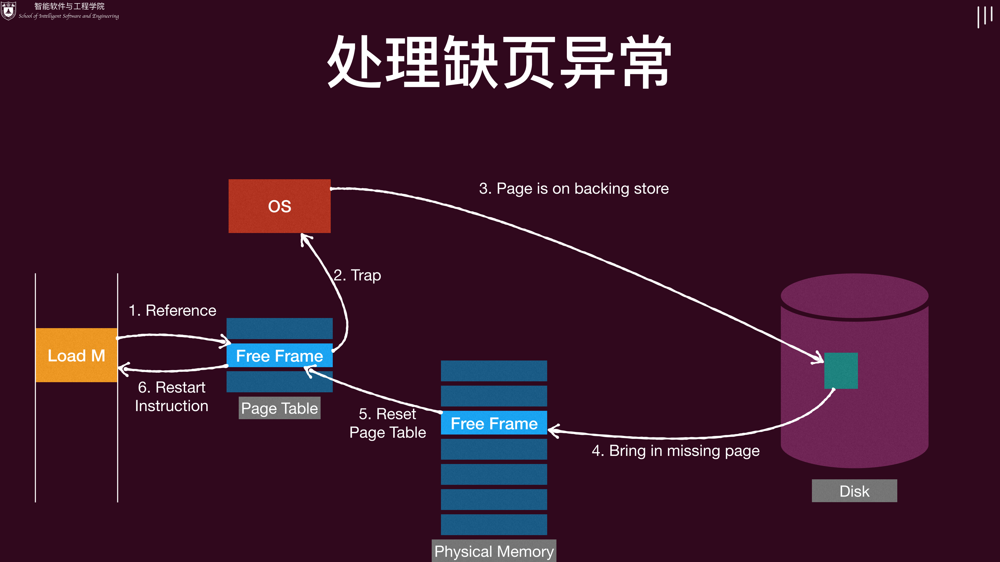

1. present=1：页在内存，正常翻译。
2. present=0：页不在内存，发生缺页异常。

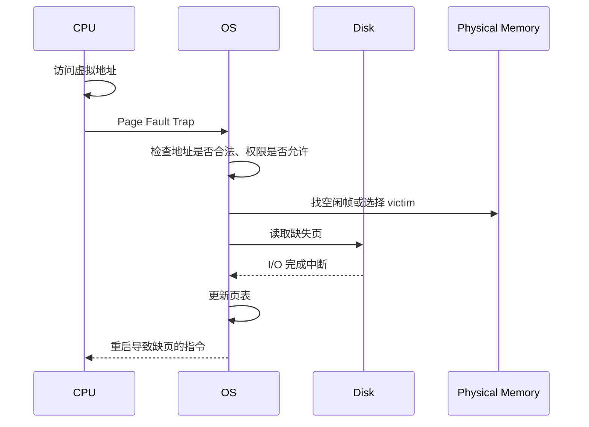
```mermaid
sequenceDiagram
    participant CPU
    participant OS
    participant Disk
    participant MEM as Physical Memory
    CPU->>CPU: 访问虚拟地址
    CPU->>OS: Page Fault Trap
    OS->>OS: 检查地址是否合法、权限是否允许
    OS->>MEM: 找空闲帧或选择 victim
    OS->>Disk: 读取缺失页
    Disk-->>OS: I/O 完成中断
    OS->>OS: 更新页表
    OS-->>CPU: 重启导致缺页的指令
```

### 14.2 缺页处理流程

具体步骤：

1. 硬件陷入内核，保存 PC 和寄存器。
2. OS 判断异常是缺页，并确定出错虚拟地址。
3. 检查地址是否合法，访问权限是否匹配。
4. 找空闲物理帧；没有则页面置换。
5. 如果 victim 是脏页，先写回磁盘。
6. 从磁盘或文件读入所需页。
7. I/O 完成后更新页表和帧状态。
8. 恢复导致缺页的指令，重新执行。

### 14.3 缺页性能

有效访问时间：

```text
EAT = (1 - p) * 内存访问时间 + p * 缺页异常开销
```

例子：内存访问 200ns，平均缺页处理 8ms。

```text
EAT = (1 - p) * 200 + p * 8,000,000
    = 200 + p * 7,999,800 ns
```

如果 `p=0.001`，即 1000 次访问 1 次缺页：

```text
EAT ≈ 8200ns
```

比 200ns 慢约 40 倍。所以缺页率必须非常低。

若希望性能下降小于 10%，要求：

```text
200 + p * 7,999,800 < 220
p < 0.0000025
```

也就是约 400,000 次访问不到 1 次缺页。

### 14.4 缺页的其他用法

缺页不只是“内存不够”的处理机制，还可用于：

| 用法 | 原理 |
| --- | --- |
| Copy-On-Write | 共享页标只读，写入时缺页并复制 |
| Zero-Filled On Demand | 新页先映射到全零只读页，写入时再分配 |
| Memory-Mapped Files | 文件页按需读入内存，写后变脏再写回文件 |

#### Zero Pages

很多页一开始全是 0，如 BSS、堆新页、栈新页。系统可让它们先指向同一个全零物理页，并标记只读。

读零页不需要分配真正新页；写时触发缺页，再复制出私有页。

#### mmap

`mmap(addr, len, prot, flags, fd, offset)` 可以把文件内容映射到进程地址空间。

效果：

1. 访问映射区域像访问内存。
2. 首次访问某页时缺页，OS 从文件读入对应内容。
3. 写映射区域会使页变脏，必要时写回文件。
4. 多进程映射同一文件可共享物理页，实现共享内存。

## 15. 页面置换

### 15.1 何时调入页面

| 策略 | 说明 |
| --- | --- |
| Demand Paging | 访问时缺页再调入，简单常用 |
| Prefetching | 根据历史或顺序访问预测提前调入 |

按需分页简单，但第一次访问会慢。预取可以提高顺序访问效率，但随机访问时可能浪费内存和 I/O。

### 15.2 页面置换做什么

当没有空闲帧时，需要选择一个 victim frame：

1. 找到近期最不可能再访问的页。
2. 如果是脏页，写回磁盘。
3. 更新所有引用它的页表项。
4. 移除相关 TLB 项。
5. 把新页读入该帧。
6. 重启引发缺页的指令。

有些页不能换出，需要锁定：

1. 内核关键页。
2. 正在用于 I/O 的缓冲页。
3. 某些实时或特殊用途页。

### 15.3 页面缓冲与页面守护进程

系统通常不会等内存完全满才行动，而是维护一定数量的空闲帧。

策略：

1. 低水位以下，后台页面守护进程开始回收页。
2. 一直回收到高水位。
3. 批量写出脏页，提高磁盘效率。

Linux 中相关后台进程包括 `kswapd`。

### 15.4 FIFO

FIFO 替换最早进入内存的页。

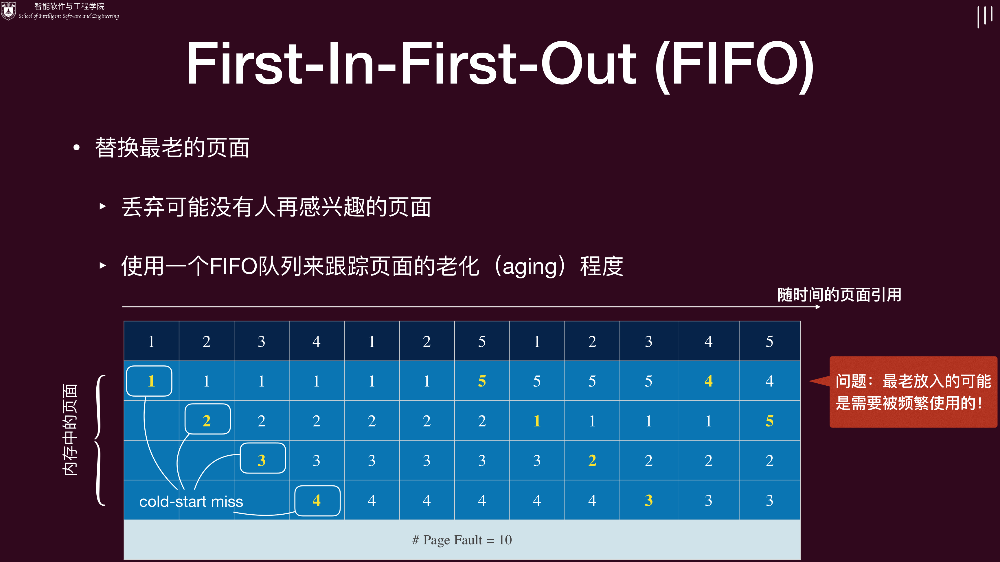

优点：简单。

缺点：最早进入的页可能很常用，并且可能出现 Belady 异常。

Belady 异常：给更多页帧，缺页次数反而更多。FIFO 可能发生这种情况。

### 15.5 Optimal / MIN

Optimal 替换未来最长时间不会被访问的页。

优点：理论最优。

缺点：需要预知未来，无法实际实现。通常作为比较基准。

### 15.6 LRU

LRU 替换最长时间未被使用的页。

依据局部性：过去很久没用的页，未来短期可能也不会用。

缺点：精确 LRU 开销大。每次内存引用都要更新时间戳或链表。

### 15.7 Second Chance / Clock

Second Chance 用引用位近似 LRU。

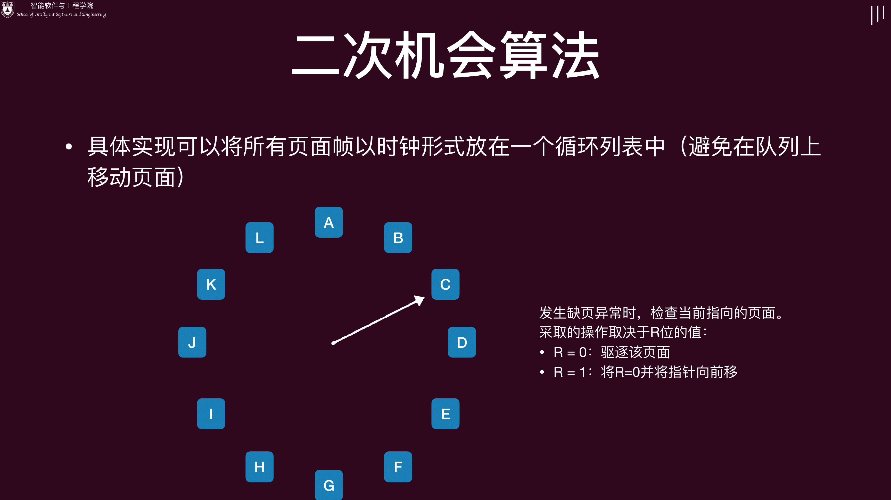

规则：

1. 每个页有引用位 `R`。
2. 访问页时硬件把 `R=1`。
3. 置换时检查队首或时钟指针指向的页。
4. 若 `R=0`，替换。
5. 若 `R=1`，改为 `0`，给第二次机会，继续检查下一个。


```mermaid
flowchart LR
    A["页 A R=1"] --> B["页 B R=0"] --> C["页 C R=1"] --> D["页 D R=0"] --> A
```

Clock 是 Second Chance 的循环链表实现，避免频繁移动队列元素。

### 15.8 NRU

NRU 用引用位 R 和修改位 M 分成四类：

| 类别 | 含义 | 替换优先级 |
| --- | --- | --- |
| `(0,0)` | 最近没用，干净 | 最适合替换 |
| `(0,1)` | 最近没用，脏 | 其次，需写回 |
| `(1,0)` | 最近用过，干净 | 不太适合 |
| `(1,1)` | 最近用过，脏 | 最不适合 |

从最低编号的非空类中选一个页替换。

## 16. 抖动、局部性与工作集

### 16.1 抖动 Thrashing

如果进程没有足够页帧，几乎每次访问都缺页，CPU 大部分时间都在等待磁盘换页，这就是抖动。

例子：访问序列不断循环 `0,1,2,3`，但只有 3 个帧。无论 FIFO 还是 LRU，都可能频繁缺页。

调度器可能让问题更糟：

1. 缺页导致进程等待 I/O。
2. CPU 利用率下降。
3. 调度器以为进程太少，于是装入更多进程。
4. 内存更紧张，缺页更多。
5. CPU 利用率进一步下降。

### 16.2 局部性原理

| 类型 | 含义 | 例子 |
| --- | --- | --- |
| 时间局部性 | 刚访问过的位置，近期可能再访问 | 循环中的变量 |
| 空间局部性 | 附近位置，近期可能被访问 | 顺序扫描数组 |

程序执行会在不同局部区域之间切换。好的页面置换算法就是利用局部性。

### 16.3 工作集模型

工作集 `w(t, x)`：在时间窗口 `(t-x, t)` 内访问过的页集合，用它近似未来一段时间会访问的页集合。

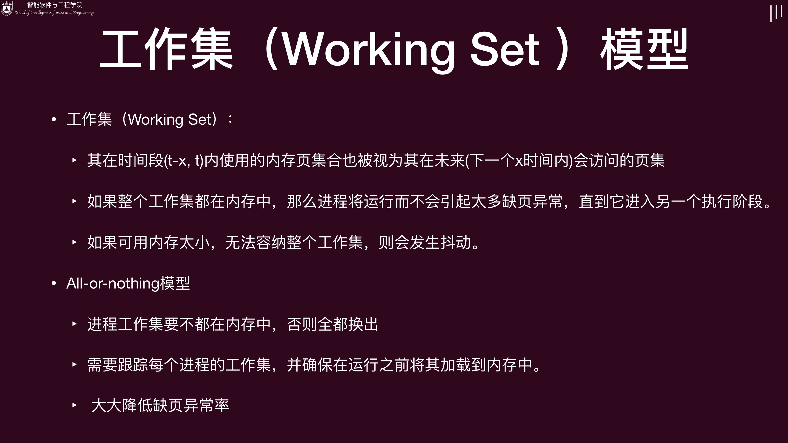


```mermaid
flowchart LR
    W["最近 x 时间窗口"] --> PAGES["访问过的页集合"]
    PAGES --> WS["工作集"]
    WS --> RUN["整个工作集在内存中 -> 低缺页率"]
    WS --> TH["内存容不下工作集 -> 抖动"]
```

All-or-nothing 思路：进程工作集要么都在内存中运行，要么暂时换出，避免半吊子运行导致抖动。

跟踪工作集：

1. 周期性时钟中断扫描页面。
2. 若访问位为 1，记录上次使用时间为当前时间。
3. 若访问位为 0，计算 age。
4. 若 `age > x`，认为不在工作集。
5. 清零访问位，进入下一周期。

### 16.4 本地置换与全局置换

| 策略 | victim 来源 | 优点 | 缺点 |
| --- | --- | --- | --- |
| 本地置换 | 只从本进程分配的帧中选 | 性能更可控 | 可能内存利用不足 |
| 全局置换 | 从所有进程帧中选 | 吞吐量高，更常见 | 进程之间相互影响 |

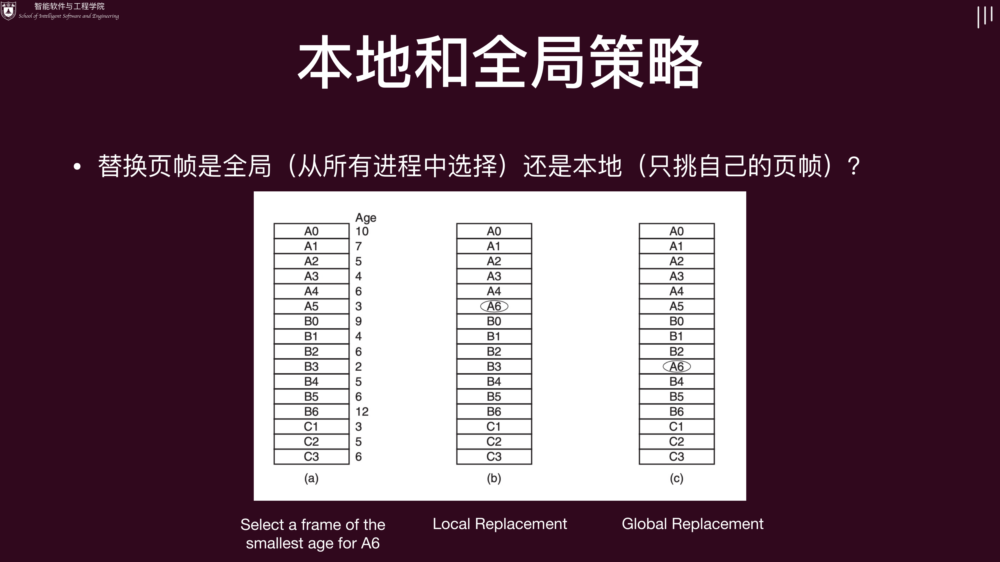

全局置换时，OS 要决定每个进程分多少帧：

1. 平均分配。
2. 按进程大小比例分配。
3. 按优先级分配。
4. 按缺页频率 PFF 动态调整。

PFF 思路：

```text
缺页率太高 -> 给该进程更多帧
缺页率太低 -> 从该进程拿走一些帧
```

## 17. 操作系统对分页的支持

### 17.1 进程创建

创建进程时，OS 需要：

1. 确定程序和数据大小。
2. 创建并初始化页表。
3. 为页表分配空间。
4. 为交换区分配空间。
5. 在进程表中记录页表和交换空间信息。

### 17.2 进程执行

运行进程时，OS 需要：

1. 设置页表基址寄存器。
2. 上下文切换时处理 TLB，清空或使用带标记 TLB。
3. 可选地预先调入一些页。
4. 页面守护进程后台检查内存状态。

### 17.3 缺页异常

缺页时，OS 需要：

1. 找到所需页在磁盘或文件中的位置。
2. 找可用物理帧，必要时置换。
3. 读入页面。
4. 更新页表。
5. 备份并重启导致缺页的指令。

### 17.4 进程终止

进程结束时，OS 需要：

1. 释放页表。
2. 释放页帧。
3. 释放交换空间。
4. 对共享页帧，只能在最后一个引用进程结束后释放。

## 18. 关键对比表

### 18.1 进程相关系统调用

| 调用 | 作用 | 关键点 |
| --- | --- | --- |
| `fork` | 创建子进程 | 父子从同一位置继续执行，返回值不同 |
| `execve` | 替换当前进程映像 | PID 不变，地址空间被新程序替换 |
| `wait/waitpid` | 等待并回收子进程 | 防止僵尸进程 |
| `exit` | 退出进程 | 关闭 fd，释放资源，通知父进程 |
| `signal` | 注册信号处理 | 事件通知和进程间通信机制 |

### 18.2 调度算法

| 算法 | 类型 | 优点 | 缺点 |
| --- | --- | --- | --- |
| FCFS | 非抢占 | 简单公平 | 护航效应 |
| SJF | 非抢占 | 平均等待时间优 | 需要知道运行时间，长任务饥饿 |
| SRTF | 抢占 | 响应新短任务 | 预测困难，开销大 |
| RR | 抢占 | 响应时间好 | 时间片选择困难，周转可能差 |
| Priority | 可抢占/非抢占 | 表达任务重要性 | 低优先级饥饿 |
| MLFQ | 动态优先级 | 兼顾交互和批处理 | 可被 gaming，需要 aging |
| Lottery | 概率比例 | 灵活表达份额 | 短期随机波动 |
| CFS | 现代公平调度 | 公平、支持权重 | 实现复杂 |

### 18.3 内存管理机制

| 机制 | 优点 | 缺点 |
| --- | --- | --- |
| 基址界限 | 简单，支持保护和重定位 | 必须连续分配，粗粒度 |
| 分段 | 贴合程序逻辑，权限和共享方便 | 外部碎片 |
| 单级分页 | 无外部碎片，分配简单 | 页表大，翻译慢 |
| 多级页表 | 节省稀疏地址空间页表 | 多次访存，依赖 TLB |
| 倒排页表 | 表大小与物理内存相关 | 查找复杂，局部性差 |
| TLB | 大幅加速地址翻译 | miss 代价高，上下文切换要处理 |

### 18.4 页面置换算法

| 算法 | 思路 | 特点 |
| --- | --- | --- |
| FIFO | 换出最早进入内存的页 | 简单，可能 Belady 异常 |
| Optimal | 换出未来最久不用的页 | 理论最优，不可实现 |
| LRU | 换出最久未使用的页 | 利用局部性，精确实现贵 |
| Second Chance / Clock | 用引用位近似 LRU | 实用、开销较低 |
| NRU | 用引用位和修改位分类 | 优先换出未用且干净页 |
| Working Set | 保证工作集驻留 | 可减少抖动，跟踪成本高 |

## 19. 常见例题式理解

### 例 1：`fork()` 后为什么会执行两遍后续代码？

`fork()` 创建子进程后，父子进程都从 `fork()` 返回处继续执行。区别只在返回值不同。因此 `fork` 后面的 `printf` 可能被父子各执行一次。

### 例 2：为什么 `fork + execve` 还需要 `fork`？

因为 `execve` 替换的是当前进程。如果 shell 直接 `execve("ls")`，shell 自己就没了。用 `fork` 先造一个子进程，子进程 `execve` 成目标程序，父进程 shell 保留下来继续接收命令。

### 例 3：为什么 COW 要把共享页标成只读？

因为用户态写内存本来不会通知内核。把共享页标成只读后，一旦写入就触发权限异常，内核借此知道该复制页面。

### 例 4：为什么 RR 时间片不能太小？

时间片太小会频繁上下文切换，CPU 时间浪费在保存和恢复寄存器、切换地址空间、处理 TLB 等开销上。若上下文切换 10 微秒，时间片 20 微秒，系统一半时间都在切换。

### 例 5：为什么分页没有外部碎片但有内部碎片？

页大小固定，任意虚拟页可放入任意物理帧，所以不需要连续大块，没有外部碎片。但一个文件或段的最后一页可能没用满，页内剩余空间无法给别人用，是内部碎片。

### 例 6：为什么 TLB 命中率很重要？

没有 TLB 命中，一次内存访问可能变成多次访存；若还触发缺页，代价从纳秒级变成毫秒级。即使很低的缺页率，也能显著拖慢程序。

### 例 7：为什么缺页后要“重启导致缺页的指令”？

因为该指令第一次执行时没有拿到所需数据页。OS 把页调入并更新页表后，需要让 CPU 重新执行这条指令，这次地址翻译才会成功。

### 例 8：为什么工作集太大就会抖动？

如果进程当前局部性需要 4 个页，但只给它 3 个帧，那么刚换入的页很快又被换出，几乎每次访问都缺页。CPU 大部分时间等待磁盘，真正执行很少。

## 20. 一句话复习

1. **进程**是拥有独立地址空间和资源集合的运行实体。
2. **PCB**保存进程身份、状态、上下文、内存和资源信息。
3. **进程树**由父子创建关系形成，`init` 或类似进程是用户进程祖先。
4. **僵尸进程**是已退出但未被父进程 wait 回收的进程。
5. **`fork`**复制当前进程，父子返回值不同。
6. **`execve`**替换当前进程映像，常与 `fork` 配合创建新程序。
7. **COW**让 `fork` 先共享物理页，写时再复制。
8. **调度指标**包括利用率、公平性、吞吐量、周转时间、等待时间、响应时间。
9. **SJF**平均等待时间好，但依赖运行时间预测且可能饥饿。
10. **RR**改善响应时间，但时间片太小会增加切换开销。
11. **MLFQ**用动态优先级区分交互型和 CPU 密集型任务。
12. **CFS**用虚拟运行时间和红黑树实现公平调度。
13. **虚拟内存**让每个进程看到独立、连续、受保护的地址空间。
14. **分段**按逻辑区域管理，但会产生外部碎片。
15. **分页**按固定页管理，避免外部碎片，但页表可能很大。
16. **TLB**缓存地址翻译，是分页性能的关键。
17. **缺页异常**让 OS 按需把页从磁盘或文件调入内存。
18. **页面置换**在内存不足时选择 victim 页。
19. **LRU/Clock/NRU**都在尝试利用局部性近似未来访问。
20. **工作集**描述进程当前活跃页集合，工作集放不下就会抖动。
