# 第07章 第二部分：ER / EER 模型设计

资料来源：`第07章/第07章_2_ER模型设计2026.pdf`

本部分重点：ER 模型基本概念、联系的分类与基数约束、EER 扩展成分，以及 ER/EER 建模案例。

## 一、ER 模型回顾

### 1. ER 模型是什么

实体-联系模型（Entity-Relationship Model，简称 ER 模型）是一种概念模型。它把现实世界需求抽象为实体、属性、联系等基本概念，并用 E-R 图表示。

ER 模型最核心的三个概念：

- 实体（Entity）
- 属性（Attribute）
- 联系（Relationship）

相关概念：

- 实体型（Entity Type）
- 实体值 / 实体实例（Entity Value / Entity Instance）
- 实体集（Entity Set）
- 属性域（Domain）
- 码 / 关键字 / 键 / 标识符（Key / Identifier）
- 联系的度（Degree）
- 联系的函数关系

### 2. 实体、属性、实体型、实体集

实体：客观存在并可相互区别的事物，可以是具体的人、事、物，也可以是抽象概念。每个实体有实体名，同类实体具有相同实体名。

属性：实体具有的某一特性。每个属性有属性名，同一实体内属性名互不相同。属性可取值的集合称为属性域。

实体型：实体名及其所有属性名的集合。

实体值：一个实体所有属性值的集合，也称实体实例。

实体集：同一类型实体的集合。同一实体集中的实体具有相同实体型，但实体值互不相同。

码：唯一标识实体的属性集，也称关键字、键、标识符。通过码的取值可区分同一实体集中的不同实体。

关于 `entity` 的语义：

- 有些资料用 `entity` 表示具有相同实体型的一组实体，即实体集，其中单个对象称为 `entity instance`。
- 另一些资料中，`entity` 仅指现实世界中的一个客观对象，实体集合称为 `entity set`。

### 3. 联系

联系表示现实世界中事物内部以及事物之间的联系，在信息世界中反映为实体内部的联系和实体之间的联系。

联系可描述：

- 联系名：区分不同联系。
- 联系属性：联系本身需要记录的信息。
- 联系的度：参与联系的实体型数量。
- 联系的函数关系：1:1、1:n、m:n 等。

联系的度：

- 二元联系：两个实体型之间的联系。
- 三元联系：三个实体型之间的联系。
- N 元联系：N 个实体型之间的联系，统称多元联系。
- 一元联系 / 递归联系：单个实体集内部实体之间的联系。

更准确地说，联系的度也可理解为参与一个联系中的实体个数。例如“职工领导职工”是一元联系，但每次联系涉及两个职工角色，因此联系度可看作 2。

## 二、ER 图表示法

ER 图提供实体型、属性、联系的图形表示：

- 实体型：矩形，框内写实体名。
- 属性：椭圆，用无向边连接到对应实体型。
- 联系：菱形，框内写联系名，用无向边连接相关实体型，并标注联系类型或基数约束。
- 联系也可以有属性。

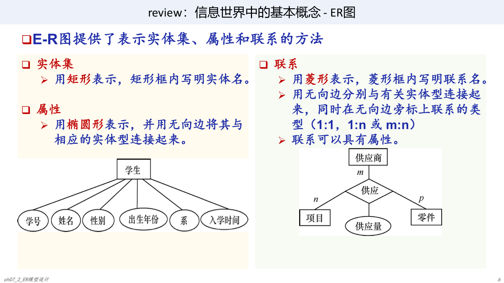

例：学生实体可有学号、姓名、性别、出生年份、系、入学时间等属性。

联系属性示例：学生与课程的“选修”联系可以带有“成绩”属性，因为成绩不是学生或课程单独固有的属性，而是学生选修某门课程后产生的信息。

## 三、联系的分类与函数关系

### 1. 二元联系

两个实体型之间的联系可分为：

- 一对一（1:1）：A 中每个实体至多对应 B 中一个实体，B 中每个实体也至多对应 A 中一个实体。
- 一对多（1:n）：A 中每个实体可对应 B 中多个实体；B 中每个实体至多对应 A 中一个实体。
- 多对多（m:n）：A 中每个实体可对应 B 中多个实体，B 中每个实体也可对应 A 中多个实体。

典型例子：

- 1:1：居民与身份证；学生与学生证。
- 1:n：宿舍与学生；人与银行卡。
- m:n：学生与课程；旅客与航班。

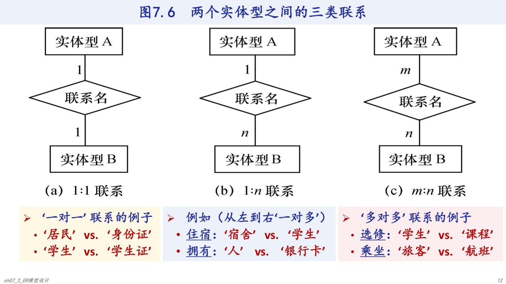

### 2. 多元联系

两个以上实体型之间也可存在 1:1、1:n、m:n 联系。

例 1：课程、教师、参考书。

- 一门课程可以由若干教师讲授，使用若干参考书。
- 每个教师只讲授一门课程，每本参考书只供一门课程使用。
- 因此课程与教师、参考书之间是一对多联系。

例 2：供应商、项目、零件。

- 一个供应商可向多个项目供应多种零件。
- 一个项目可使用多个供应商供应的多种零件。
- 一种零件可由不同供应商供给多个项目。
- 因此三者之间是多对多联系。

### 3. 单个实体型内部联系

同一实体集内部的实体之间也可以有联系。

例：职工实体型内部有“领导”联系。某一职工（干部）领导若干职工，而一个职工只被另一个职工直接领导，因此这是职工实体集内部的一对多联系。

### 4. 工厂物资管理 ER 图实例

物资管理涉及实体：

- 仓库：仓库号、面积、电话号码。
- 零件：零件号、名称、规格、单价、描述。
- 供应商：供应商号、姓名、地址、电话号码、账号。
- 项目：项目号、预算、开工日期。
- 职工：职工号、姓名、年龄、职称。

实体之间的联系：

- 仓库与零件：m:n。一个仓库可存放多种零件，一种零件可存放在多个仓库中，联系属性为库存量。
- 仓库与职工：1:n。一个仓库有多个保管员，一个职工只能在一个仓库工作。
- 职工与职工：1:n。仓库主任领导若干保管员，一个职工只被一个直接领导管理。
- 供应商、项目、零件：m:n。供应商可向多个项目供应多种零件，项目可使用不同供应商供应的零件，零件可由不同供应商供给。

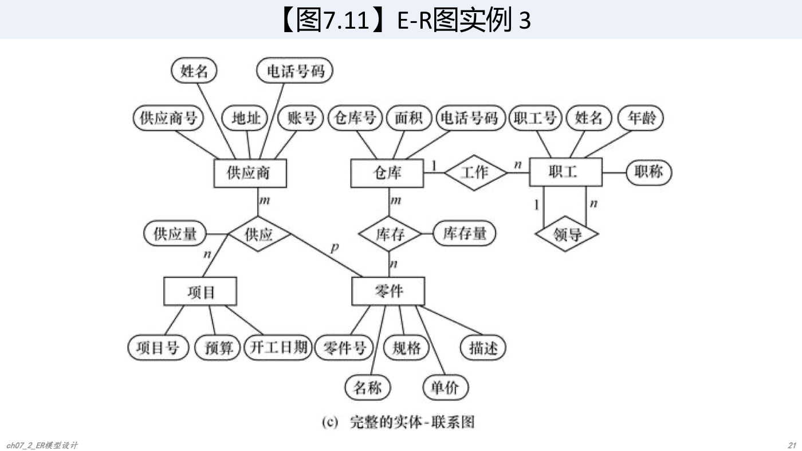

## 四、扩展 ER 模型（EER）

ER 模型常用于概念建模，但复杂语义表达能力有限，因此引入扩展 ER 模型（Extended Entity-Relationship Model，EER 模型）。

EER 模型保留 ER 模型中实体集、属性、联系的表示方式，并增加扩展成分：

- ISA 联系。
- part_of 联系。
- 弱实体。
- 联系上的基数约束。
- 属性划分。
- 属性基数。

## 五、ISA 联系

ISA 联系表示父类-子类语义，即 “is a”。若某个实体型是另一个实体型的子类型，可用 ISA 联系表示。

表示方法：用三角形 `△` 表示。三角形顶点连接父类型，其他边连接子类型。

ISA 联系性质：

- 子类型继承父类型所有属性。
- 子类型可以有自己的属性。
- 子类型也可以继续拥有子类型。

例：学生是父类型，研究生和本科生是学生的子类型。研究生可有导师姓名、研究方向等自己特有的属性。

### 1. 分类属性

ISA 联系描述对父实体型中实体的一种分类方法。

分类属性是父实体型中的一个属性，标注在 ISA 三角形旁边。根据分类属性的值，把父实体型实体分派到不同子实体型中。

例：学生的分类属性可以是“学生类别”，取值不同则进入“研究生”或“本科生”子类型。

### 2. 不相交约束与可重叠约束

可重叠约束：父类中一个实体可同时属于多个子类。ISA 三角形中没有叉号表示可重叠。

不相交约束：父类中一个实体最多属于一个子类。ISA 三角形中用 `X` 表示。

例：

- 一个学生不能既是本科生又是研究生，这是不相交约束。
- 一名在职研究生可以既是学生又是教师或职工，这是可重叠约束。

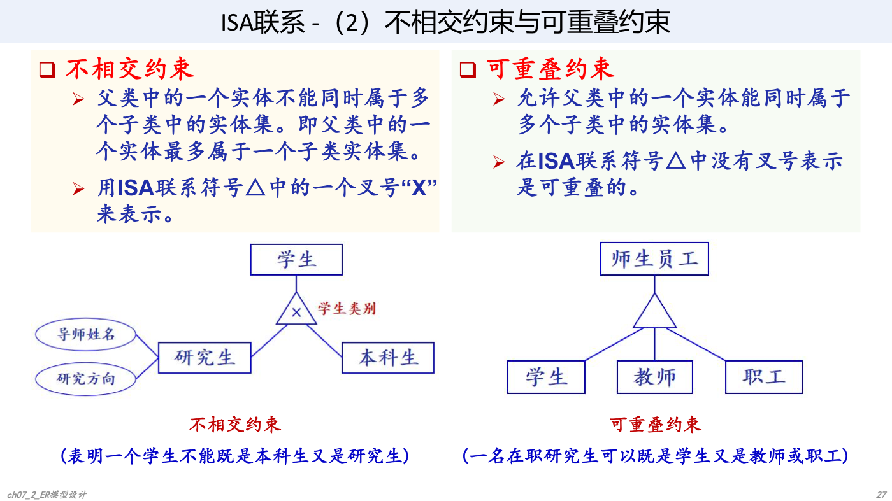

### 3. 完备性约束

完全特化（total specialization）：父类中的每个实体必须属于某个子类，用父类到子类的双线连接表示。

部分特化（partial specialization）：允许父类中某些实体不属于任何子类，用单线连接表示。

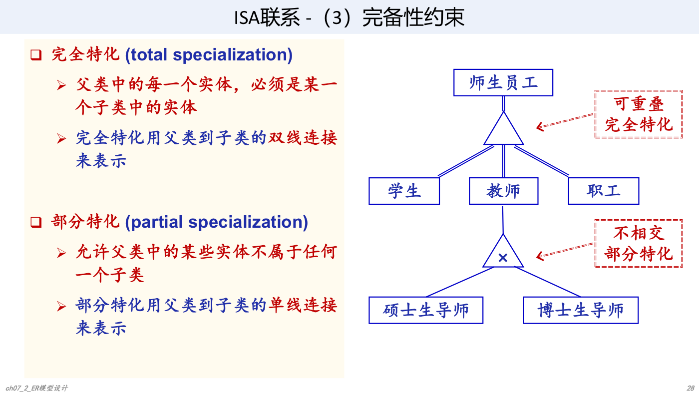

## 六、part_of 联系与弱实体

### 1. part_of 联系

part_of 联系描述某个实体型是另一个实体型的一部分。

part_of 分为两类：

- 非独占 part_of：整体实体被破坏后，部分实体仍可独立存在。
- 独占 part_of：整体实体被破坏后，部分实体不能独立存在。

表示方法：

- 非独占 part_of：可用非强制参与的基数约束表示，例如汽车与轮子。
- 独占 part_of：可用弱实体和识别联系表示，例如贷款与还款。

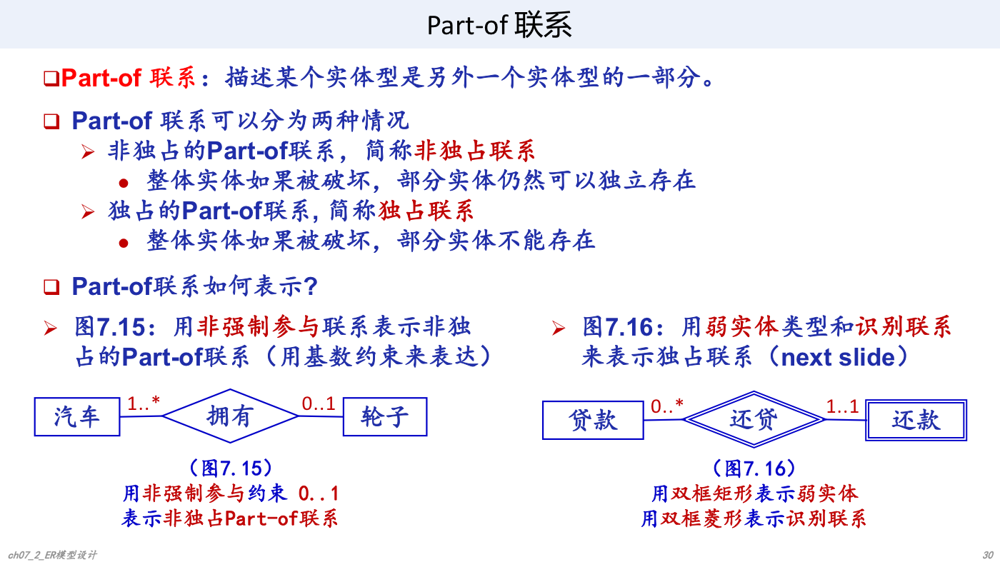

### 2. 弱实体

弱实体型：如果一个实体型的存在依赖于其他实体型的存在，则称为弱实体型。否则称为强实体型。

表示方法：

- 双框矩形表示弱实体型。
- 双框菱形表示识别联系。
- 从弱实体到识别联系可用有向箭头表示依附关系。

例：`Line_items` 通过识别联系 `has_item` 依附于 `Orders`。`Orders` 本身也可能是弱实体。

例：职工与家属、学生与家长。

- 职工可没有登记家属，也可登记多位家属。
- 每位家属至少与一位职工相关，也可能与多位职工相关。
- 每位学生至少登记一位家长，也可登记多位家长。
- 每位家长至少与一位学生相关，也可与多位学生相关。

## 七、联系上的基数约束

### 1. 基本含义

基数约束说明某实体型中的任一实体在联系中出现的最少次数和最多次数，是对 1:1、1:n、m:n 的细化。

表示为：

```text
min..max
```

其中：

- `0 <= min <= max`
- `min` 是最小参与基数，常取 `0` 或 `1`
- `max` 是最大参与基数，常取 `1` 或 `*`
- `*` 表示多，即大于 1 的任意数目

含义：

- `min = 1`：实体必须至少参与一次联系。
- `min = 0`：实体可以不参与联系。
- `max = 1`：实体最多参与一次联系。
- `max = *`：实体可以多次参与联系。

例：

- `card(汽车, 拥有) = 1..*`：每辆汽车至少拥有一个轮子，可拥有多个轮子。
- `card(轮子, 拥有) = 0..1`：一个轮子可不属于汽车，最多属于一辆汽车。
- `card(贷款, 还贷) = 0..*`：贷款可暂时没有还款，也可有多次还款。
- `card(还款, 还贷) = 1..1`：每笔还款必须且只能属于一笔贷款。

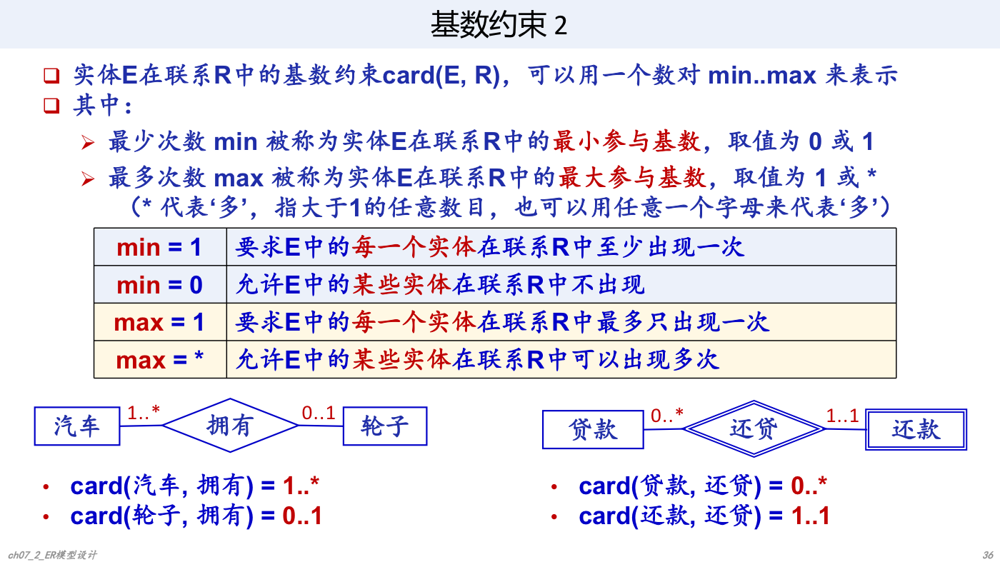

### 2. 基数约束例子

例 1：教师与课程班级。

- 教师可以不上课，也可担任多个课程班级的授课任务：`0..*`。
- 每个课程班级必须且仅安排一位任课教师：`1..1`。

例 2：职工与项目。

- 每位职工至少参与一个项目：`1..*`。
- 一个项目可暂时没有职工，也可有多位职工：`0..*`。
- 联系 `works_on` 可有属性 `percent`，表示参与比例。

例 3：职工直接上下级联系。

- 一位职工如果有上级，最多只能有一位直接上级：`0..1`。
- 一位职工如果有下级，可有多位直接下级：`0..*`。
- 因为同一实体型 Employees 参与同一联系的不同角色，需在线上标注角色名，如 `manager_of`、`reports_to`。

### 3. 强制参与与非强制参与

按最小参与基数 `min` 划分：

- 强制参与（mandatory participation）：`min = 1`，每个实体都必须参与联系。
- 非强制参与 / 可选参与（optional participation）：`min = 0`，实体可参与也可不参与。

例：

- 汽车与“拥有”是强制参与。
- 轮子与“拥有”是非强制参与。
- 贷款与“还贷”是非强制参与。
- 还款与“还贷”是强制参与。

### 4. 单值参与与多值参与

按最大参与基数 `max` 划分：

- 单值参与：`max = 1`，每个实体在联系中最多出现一次。
- 多值参与：`max = *`，每个实体可在联系中出现多次。

例：

- 汽车与“拥有”：强制、多值参与。
- 轮子与“拥有”：非强制、单值参与。
- 贷款与“还贷”：非强制、多值参与。
- 还款与“还贷”：强制、单值参与。

### 5. 函数关系与基数约束

二元联系中，可根据两个实体型在联系中的最大参与基数判断函数关系：

| 函数关系 | 最大参与基数特征 |
| --- | --- |
| 一对一 | 两个实体型都是单值参与 |
| 多对多 | 两个实体型都是多值参与 |
| 多对一 | 若 E 单值参与、F 多值参与，则从 E 到 F 是多对一 |

基数约束包含函数关系，并能表达更多语义。因此，基数约束比单纯的 1:1、1:n、m:n 更精确。

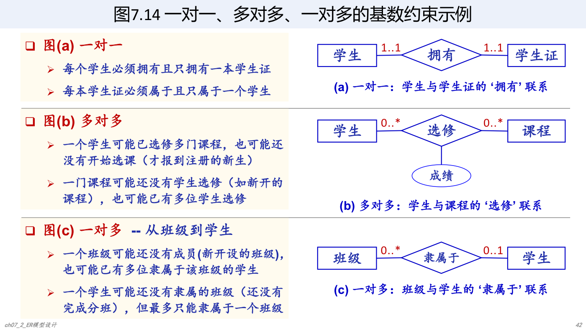

图中示例：

- 学生与学生证：`1..1` 对 `1..1`，一对一。每个学生必须拥有且只拥有一本学生证，每本学生证必须属于且只属于一个学生。
- 学生与课程：`0..*` 对 `0..*`，多对多。学生可未选课或选多门课，课程可未被选或被多人选。
- 班级与学生：班级端多值、学生端单值。一个班级可没有成员或有多名学生，一个学生可未分班但最多属于一个班级。

为什么需要基数约束：

- 对普通商品销售，用函数关系或基数约束区别不大。
- 对具体商品销售，如汽车、房子，函数关系可能产生歧义。新车销售中，一辆汽车最多只能在订单联系中出现一次；用基数约束可清楚表达“汽车是单值参与，顾客和供应商是多值参与”。

## 八、属性的划分与属性基数

### 1. 属性分类

属性可按作用和属性域划分：

- 标识符（Identifier）：唯一标识实体实例的属性或属性集。关系数据库中对应候选键、候选码、关键字等。
- 主标识符（Primary Identifier）：DBA 从多个标识符中选择的一个主要标识符，对应关系数据库中的主键。
- 描述符（Descriptor）：非键属性，用来描述实体或联系。
- 单值属性（Single-valued Attribute）：每个实体实例在该属性上取一个简单值。
- 组合属性（Composite Attribute）：由多个简单属性共同描述一个性质。
- 多值属性（Multi-valued Attribute）：一个实体实例在该属性上可取多个值。

### 2. 标识符与描述符

标识符可以是单个属性，也可以是属性集。一个实体可有多个标识符，但通常只选择一个作为主标识符，并在 ER 图中用下划线标注。

描述符是非键属性，主要起描述作用。

例：学生实体中，`sid` 可作为主标识符；`student_name` 是组合属性，可分解为 `lname`、`fname`、`midinitial`。

### 3. 多值属性表示

例：员工实体 `Employees`。

- `eid` 是主标识符。
- `emp_address` 是组合属性，可由 `staddress`、`city`、`state` 等组成。
- `hobbies` 是多值属性。

多值属性可用两种方式表示：

- 方法一：实体型与属性之间用双线段连接。
- 方法二：定义属性基数。

### 4. 属性基数

属性基数用二元组 `(x, y)` 描述一个实体在某属性上取值数量特征。

含义：

- `(0, ?)`：该属性可为空，允许实体没有该属性值。
- `(1, ?)`：该属性不能为空，每个实体必须有值。
- `(?, 1)`：该属性最多一个值，是单值属性或组合属性。
- `(?, *)`：该属性可有多个值，是多值属性。

例：学生属性基数。

- 每位学生必须有且仅有一个 `sid`：`(1, 1)`。
- 每位学生必须有且仅有一个 `student_name`：`(1, 1)`。
- `student_name` 必须包含 `lname` 和 `fname`：二者均为 `(1, 1)`。
- `midinitial` 可以没有，最多一个：`(0, 1)`。

例：员工属性基数。

- `eid`：`(1, 1)`。
- `emp_address`：`(0, 1)`。
- `hobbies`：`(1, *)`。
- 地址中的 `staddress`、`city`、`state`、`zipcode`：均为 `(1, 1)`。

有属性基数约束后，就不需要再用双线段表示多值属性。

## 九、ER / EER 模型设计案例

### Case Study 1：图书借阅管理

需求要点：

- 图书：书号、书名。书号是标识属性；不同图书可有相同书名。
- 读者：借书证号、姓名、身份证号、居住地址、联系电话。借书证号和身份证号都可单独作为标识属性；最多登记一个居住地址；必须留一个或多个联系电话。
- 出版社：出版社名称、办公地址、联系电话。出版社名称是标识属性。
- 每本图书只能由一个出版社出版发行。
- 每个读者可同时借阅多本图书，也可在不同时候借阅同一本图书。
- 系统需记录每次借阅的借阅日期和归还日期，类型为时间戳。

建模关键：

- 借阅不是简单的读者-图书 m:n 联系，因为同一读者可在不同时候借同一本书，需要区分每次借阅事件。
- 借阅日期、归还日期应作为借阅联系或借阅实体的属性。
- 读者联系电话是多值属性。

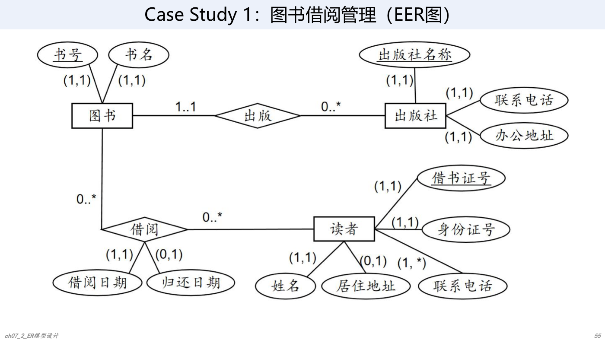

### Case Study 2：考试监考安排

需求要点：

- 课程：课程号、课程名，课程号是标识属性。
- 教师：工作证编号、姓名，工作证编号是标识属性。
- 教室：考试教室是标识属性。
- 考试：考试时间包括开始时间和结束时间；一门课期末考试只安排一场，可分多个教室同时进行。
- 每门课程至少有一位或多位主讲教师；教师可不担任主讲，也可主讲多门课程。
- 同一时间内，一间教室只能安排一门课程考试。
- 课程主讲教师必须作为主考教师参加自己主讲课程的监考。
- 同一教师主讲的不同课程不能安排在同一时间考试。
- 每间考试教室除主考教师外，还需安排一位或多位监考教师。
- 一位教师可在不同时间担任不同课程监考，但同一时间只能在指定一间教室监考。

建模关键：

- “主讲”“主考”“监考”是不同语义角色，不能简单合并。
- 考试时间和考试教室共同影响约束，尤其是同一时间教室不可冲突、教师不可冲突。
- 一场考试可对应多个教室，每个教室还要安排监考教师，因此应把考试场次、教室安排、教师角色清楚区分。

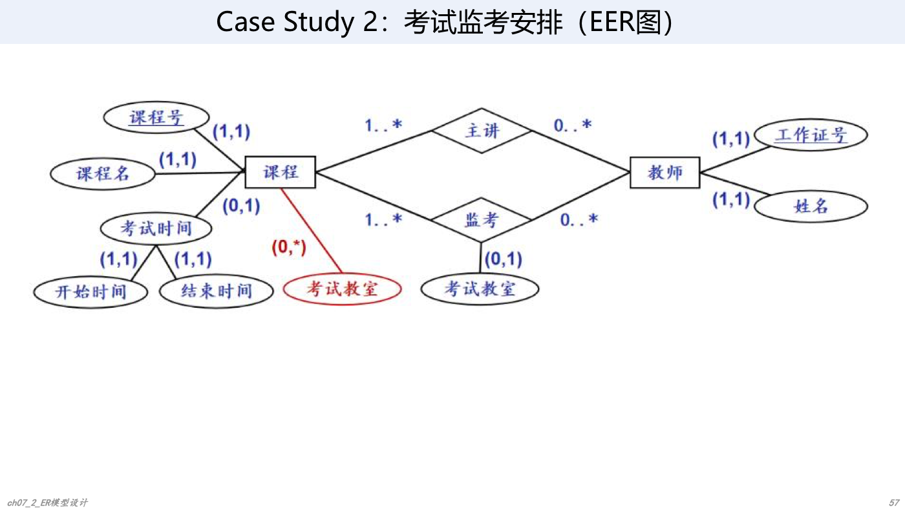

### Case Study 3：篮球联赛管理

需求要点：

- 球员：姓名、出生日期、身高、身份证号码；身份证号码是标识属性。
- 球队：名称、所在省份和城市、创建时间；球队名称是标识属性。
- 场馆：名称、地址、座位数；场馆名称是标识属性。
- 比赛：比赛编号、比赛日期、主队及客队得分；比赛编号是标识属性。
- 同一支球队中，球员球衣号码互不相同。
- 每支球队有且只有一个主场馆；一个场馆可作为多支球队主场。
- 球队由多名球员组成；每个球员最多效力一支球队，并确定球衣号码。
- 赛季中球员可能被交易到其他球队，交易后通常更换球衣号码。
- 比赛采用主客场双循环赛制，每两支球队打 2 场，分别在双方主场馆进行。
- 所有属性都是单值属性。

建模关键：

- 球员与球队的效力关系带有球衣号码；若考虑交易历史，还应记录效力时间或交易记录。
- 比赛需要区分主队与客队两个角色，并记录双方得分。
- 球队与场馆是多对一语义：每队一个主场，场馆可服务多队。

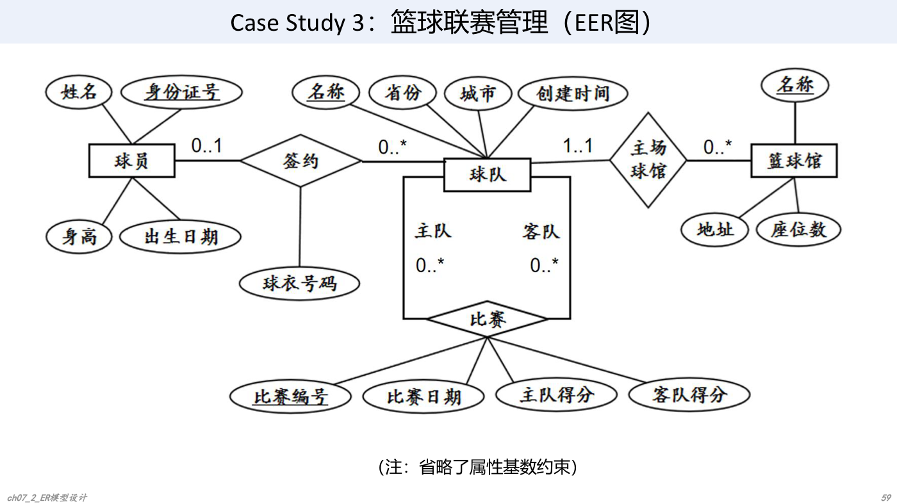

## 十、总结

ER / EER 建模需要掌握：

- ER 基本概念：实体、实体型、实体集、属性、码、联系。
- ER 图表示：矩形表示实体，椭圆表示属性，菱形表示联系。
- 联系设计：二元、多元、一元联系；联系上的属性；函数关系与基数约束。
- EER 扩展：ISA、part_of、弱实体、联系基数、属性基数。
- 常见模型设计选择：
  - 实体还是属性。
  - 实体还是联系。
  - ISA 联系还是普通联系。
  - 单个多元联系还是多个二元联系。
  - 属性属于实体还是属于联系。

关键判断方法：

- 如果某信息依附于实体自身，建为实体属性。
- 如果某信息只在联系发生后才有意义，建为联系属性。
- 如果对象需要独立描述、参与其他联系，通常建为实体。
- 如果要表达更精确的数量约束，优先使用 `min..max` 基数约束，而不是只写 1:n 或 m:n。
- 如果实体存在依赖另一个实体，考虑弱实体和识别联系。
- 如果存在父类-子类语义，考虑 ISA 联系，并明确不相交/可重叠、完全/部分特化。

