# 第07章 第三部分：数据库逻辑结构设计

资料来源：`第07章/第07章_3_逻辑结构设计2026.pdf`

本部分重点：把概念数据模型（EER 模型）转换为关系数据库模式，并处理非原子属性、联系、ISA 联系、规范化、性能调整、约束和视图设计。

## 一、逻辑结构设计的基本任务

数据库逻辑结构设计的基本任务：将概念结构设计阶段得到的概念数据模型（EER 模型）转换成用户所选 DBMS 支持的逻辑数据模型。

由于概念设计阶段常用 EER 模型，而目前最流行的是关系数据库系统，所以逻辑设计的核心任务是：

- 将 EER 模型转换成等价的关系数据库模式。

基本方法：

- 每个实体集通常转换成一个关系模式。
- 每个联系通常也转换成一个关系模式。
- 在某些情况下，联系可合并到相关实体集对应的关系模式中。

实体集转换的大体对应：

| E-R / EER 概念 | 关系数据库概念 |
| --- | --- |
| 实体名 | 表名 |
| 属性名 | 列名 |
| 单值属性 | 表中的列 |
| 组合属性 | 多个简单列 |
| 实体标识符 | 候选键 |
| 主标识符 | 主键 |
| 实体实例 | 行 |

联系转换的一般方法：

- 联系名作为关系名。
- 联系自身属性成为关系属性。
- 参与联系的实体集的标识属性也成为该关系属性。
- 这些标识属性是原实体关系的主码，同时也是联系关系中的外码。

逻辑转换中还要处理：

1. 命名与属性域。
2. 非原子属性。
3. 联系转换。
4. ISA 联系转换。
5. 规范化。
6. RDBMS 性能调整。
7. 约束条件设置。
8. 关系视图设计。

## 二、命名与属性域处理

关系和属性命名原则：

- 尽量采用 EER 模型中的原有名称。
- 可以重新命名，但必须避免命名冲突。
- 同一个数据库模式中，关系名必须唯一。
- 同一个关系模式中，属性名必须唯一。

属性域定义：

- 根据 DBMS 选型进行必要的数据类型转换。
- 例如概念模型中的“时间戳”“字符串”“编号”等，要转换为具体 DBMS 支持的数据类型。

## 三、规则1：实体集转换为关系

规则：每个实体集都单独转换成一个独立关系。

转换结果：

- 关系名：可直接使用实体集名。
- 属性：实体集的单值属性，以及组合属性拆开的成员属性。
- 主码：实体集的主标识符。
- 候选码：实体集中的其他标识符。
- 如果拆分组合属性后出现属性重名，需要重命名。

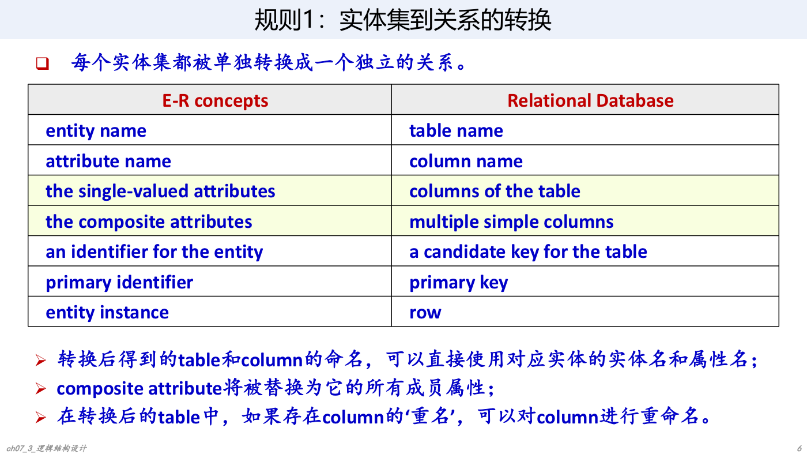

例：课程实体集。

若“课程”实体有属性：课程号、课程名、课程类型、学分、学时。其中“学时”是组合属性，可由周学时、理论学时、实验学时、实践学时、总学时组成。

转换为课程关系时，应将“学时”横向展开：

```text
课程(
  课程号 primary key,
  课程名 NOT NULL,
  课程类型 NOT NULL,
  学分 NOT NULL,
  周学时 NOT NULL,
  理论学时,
  实验学时,
  实践学时,
  总学时 NOT NULL
)
```

注意：成员属性上的约束要根据原组合属性及成员属性的属性基数约束决定。

## 四、非原子属性处理

非原子属性主要包括：

- 组合属性。
- 多值属性。

### 1. 组合属性

组合属性处理方式：横向展开成多个简单属性。

例：`Employees` 实体中有组合属性 `emp_address`，其成员属性为 `staddress`、`city`、`state`、`zipcode`。

转换后关系：

```text
Employees(eid, staddress, city, state, zipcode, ...)
```

如果 `emp_address` 的属性基数表示“地址可为空；但一旦有地址，四个成员属性必须都有值”，则转换后不能只靠属性级 `NOT NULL` 表达。因为四个成员属性必须“全空或全非空”，这类约束需要用表级 `CHECK` 约束定义。

### 2. 多值属性

例：学生实体有多值属性“选读课程”。

原始概念：

```text
学生(学号, 姓名, 选读课程)
```

某学生 `S1307 王承志` 可同时有多个选读课程：Database、Operating System、Computer Network。

多值属性有两种处理方法。

方法一：关系模式不变，但把一个实体实例纵向展开成多个元组：

```text
学生关系一(学号, 姓名, 选读课程)
S1307, 王承志, Database
S1307, 王承志, Operating System
S1307, 王承志, Computer Network
```

此时关系码由原主标识符和多值属性联合构成，即 `(学号, 选读课程)`。但该关系最高只能满足 1NF，通常还要进一步规范化。

方法二：把多值属性单独分解出去，和原实体集主标识符组成新关系：

```text
学生(学号, 姓名)
选课(学号, 选读课程)
```

其中 `选课` 的码是 `(学号, 选读课程)`。

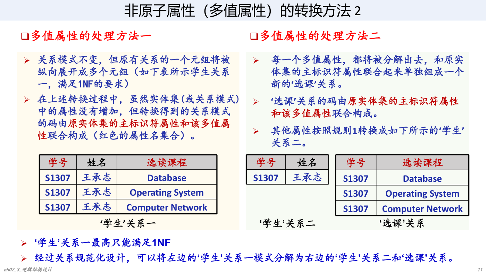

## 五、规则2：多值属性转换为关系

规则：每个多值属性单独转换成一个关系。

转换对应：

| E-R / EER 概念 | 关系数据库概念 |
| --- | --- |
| 多值属性名 | 新关系名 |
| 原实体主标识符 | 新关系中的列 |
| 多值属性 | 新关系中的列 |
| 原实体主标识符 + 多值属性 | 新关系主键 |
| 实体实例 + 多值属性的一个元素 | 新关系的一行 |

例：

```text
学生(学号, 姓名)
选课(学号, 选读课程)
```

注意：根据规则自动得到的主键不一定最终正确，仍需通过后续规范化设计验证、纠错和补充。

例：课程班实体中，如果“课程班时间地点”是多值且带组合结构，转换可得到：

```text
课程班(课程班编号, 学年, 学期)
课程班时间地点(课程班编号, 星期, 节次, 教室)
```

其中 `课程班时间地点` 的主键可能暂定为 `(课程班编号, 星期, 节次, 教室)`，但最终是否合理，需要规范化检查。

## 六、联系转换总原则

一般情况下，一个联系可以转换成一个关系。

但某些情况下，联系可归并到相关实体集对应的关系模式中，即把联系与某个或几个相关实体集共同转换成一个关系模式。

二元联系转换时，需要综合考虑：

- 函数关系：1:1、1:n、m:n。
- 参与方式：全参与 / 非全参与。

参与方式由最小参与基数决定：

- `min_card(E, R) = 1`：实体 E 在联系 R 中全参与，也称强制参与。
- `min_card(E, R) = 0`：实体 E 在联系 R 中非全参与，也称可选参与。

## 七、规则3：一对一二元联系转换

一对一联系两端最大参与基数都是 `1`，可根据全参与情况转换成 3、2 或 1 个关系。

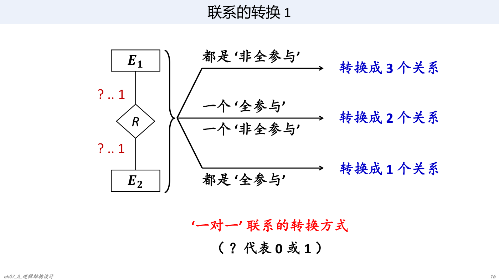

### 1. 两端都是非全参与：转换成 3 个关系

形式：

```text
E1(k1, ...)
E2(k2, ...)
R(k1, k2, ...)
```

说明：

- `k1`、`k2` 分别是 `E1`、`E2` 的主码。
- 在 `R` 中，`k1` 和 `k2` 都是外码。
- 因为是一对一，`k1` 和 `k2` 都可作为 `R` 的候选码。

例：共享电单车与电池。

- 一辆电单车最多安装一块电池。
- 一块电池最多被安装在一辆电单车上。
- 两端都是 `0..1`，因此转换为三个关系：

```text
电单车(单车二维码, 位置)
电池(电池二维码, 充电时间)
装配(单车二维码, 电池二维码, 装配时间)
```

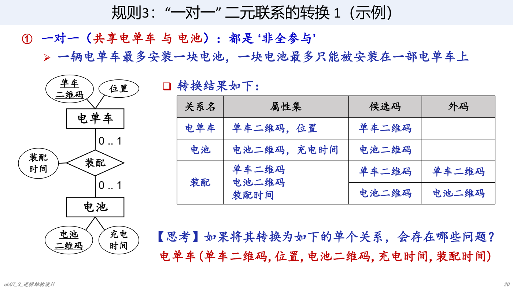

不宜直接合并成：

```text
电单车(单车二维码, 位置, 电池二维码, 充电时间, 装配时间)
```

原因：电单车可没有电池，电池也可未装配，合并后容易产生大量空值，并且难以表示未装配电池的信息。

### 2. 一端全参与、一端非全参与：转换成 2 个关系

若 `E1` 全参与，`E2` 非全参与，可将联系合并到全参与端 `E1`：

```text
E1(k1, ..., k2, R的属性)
E2(k2, ...)
```

说明：

- `k1` 是 `E1` 主码。
- `k2` 是 `E2` 主码，也是 `E1` 中的外码。

例：人与驾驶证。

- 驾驶证必须属于一个人：驾驶证全参与。
- 人可以没有驾驶证，最多有一个驾驶证：人非全参与。

转换为：

```text
人(身份证号, 姓名)
驾驶证(档案编号, 准驾车型, 有效期限, 身份证号)
```

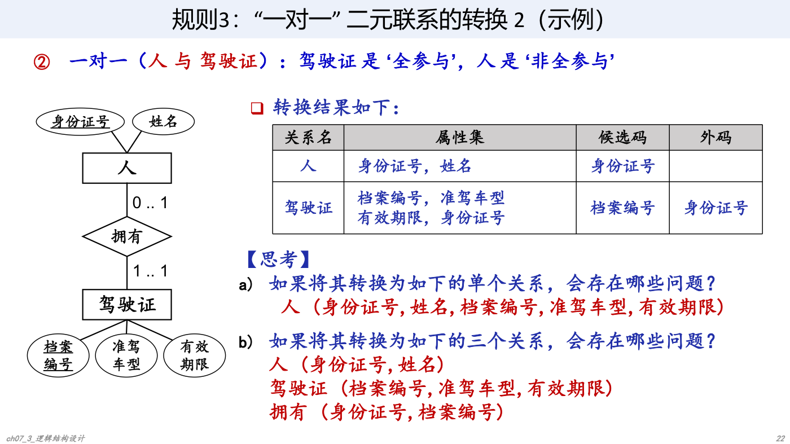

不宜合并成人关系：

```text
人(身份证号, 姓名, 档案编号, 准驾车型, 有效期限)
```

原因：大量没有驾驶证的人会产生空值。

转换成三个关系也可以表达，但会多一个不必要的关系，查询时还要连接，效率和简洁性较差。

### 3. 两端都是全参与：转换成 1 个关系

若两端都是 `1..1`，三者可合并成一个关系：

```text
R(k1, E1属性, k2, E2属性, 联系属性)
```

其中 `k1`、`k2` 都是候选码。

例：学生与校园卡。

- 每个学生必须且只拥有一张校园卡。
- 每张校园卡必须且只属于一个学生。

转换为：

```text
学生(学号, 姓名, 校园卡ID, 有效期限)
```

其中 `学号` 和 `校园卡ID` 都可作为候选码。

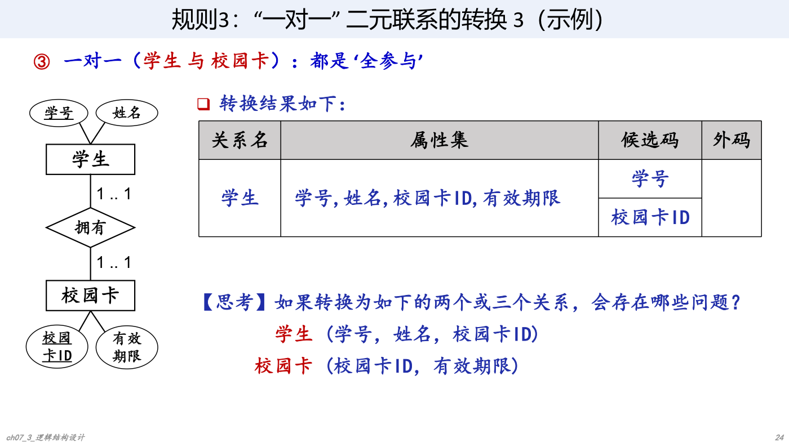

## 八、规则4：一对多二元联系转换

一对多联系的关键：通常把联系合并到“多端”对应关系中；如果多端是非全参与，也可单独建联系关系。

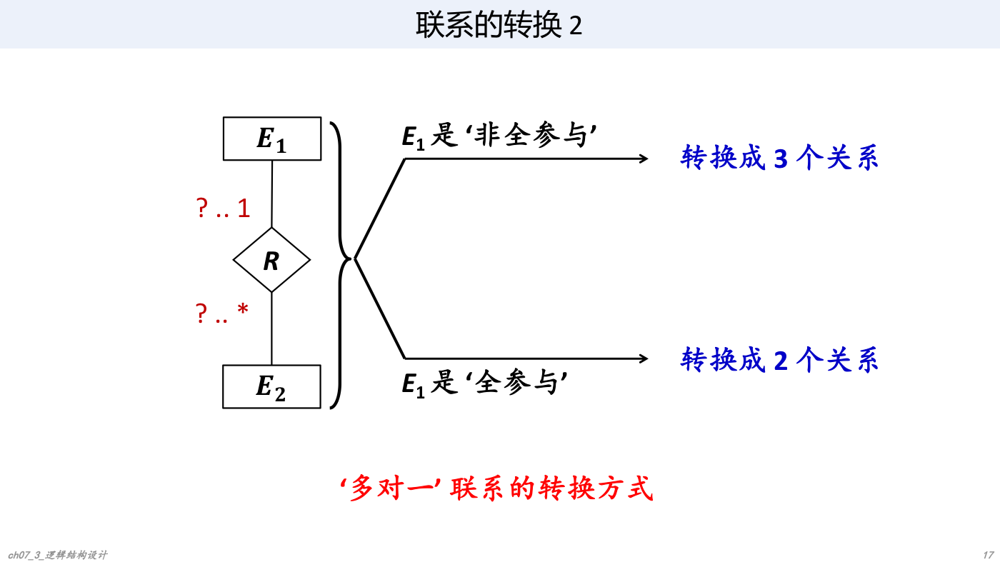

### 1. 多端全参与：转换成 2 个关系

若 `E2` 是多端，且 `E2` 全参与：

```text
E1(k1, ...)
E2(k2, ..., k1, R的属性)
```

说明：

- `k2` 是 `E2` 主码。
- `k1` 是 `E1` 主码，也是 `E2` 中外码。
- 联系属性也放入 `E2`。

### 2. 多端非全参与：通常转换成 3 个关系

若 `E2` 是多端，但 `E2` 非全参与：

```text
E1(k1, ...)
E2(k2, ...)
R(k2, k1, R的属性)
```

说明：

- `R` 的码通常是 `k2`，因为每个 `E2` 实体最多对应一个 `E1` 实体。
- `k1` 是 `R` 的外码。
- 不能把 `R` 合并到 `E1`，否则无法自然表示多端的多个实体。
- 也可将 `E2` 与 `R` 合并，因为它们具有相同码，但要注意非全参与可能带来空值。

## 九、规则5：多对多二元联系转换

多对多联系必须单独转换成一个关系，通常得到 3 个关系。

```text
E1(k1, ...)
E2(k2, ...)
R(k1, k2, R的属性)
```

说明：

- `(k1, k2)` 联合构成 `R` 的主码。
- `k1`、`k2` 同时是 `R` 的外码。

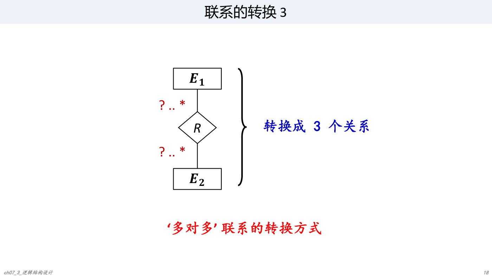

例：教师、课程、课程班、学生。

根据 ER 模型：

- “授课”可合并到“课程班”关系。
- “主讲”可单独转换，也可合并到“课程班”关系。
- “修读”是学生与课程班的多对多联系，必须单独转换。

转换结果：

```text
教师(工号, 姓名)
课程(课程号, 课程名)
课程班(课程班号, 学年, 学期, 课程号)
学生(学号, 姓名)
主讲(工号, 课程班号)
修读(学号, 课程班号, 成绩)
```

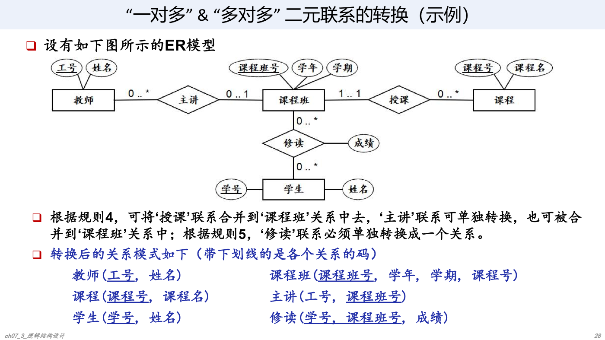

## 十、规则6：多元联系转换

多个实体集之间的多元联系通常单独转换成一个关系。

转换方法：

- 每个实体集转换成一个关系模式。
- 多元联系单独转换成一个关系模式。
- 联系关系属性包括：
  - 联系自身属性。
  - 每个参与实体集对应关系的主码。

一般情况下，多元联系转换后的关系主码由所有参与实体集的主标识符联合组成。

但主码并非总是机械地由所有外码组成。某些场景如图书借阅、商品零售，需要通过后续规范化设计确认真正的码。

## 十一、规则7：单个实体集内部联系转换

单个实体集内部的联系可参照二元或多元联系转换规则。

处理步骤：

1. 按联系中承担的不同角色，把同一实体集看成两个实体集。
2. 按普通二元联系转换。
3. 最后把两个实体集转换得到的关系合并为一个关系。

### 1. 内部一对一联系

可先转换成：

```text
E1(k, ...)
E2(k, ...)
R(k1, k2, R的属性)
```

最终只保留一个实体关系，并注意区分主码和外码在联系中的角色。

### 2. 内部一对多联系

联系通常合并到“单值参与”端，最终可得到：

```text
E(k, ..., k', R的属性)
```

其中：

- `k` 是实体自身主码。
- `k'` 是同一实体关系中的外码，指向该关系的主码。
- 必须用清晰命名区分角色。

例：职工直接上下级。

- 一个上级可管理多个下级：`0..*`。
- 一个下级最多有一个直接上级：`0..1`。

转换为：

```text
职工(工号, 姓名, ..., 上级职工工号)
```

其中 `工号` 是主码，`上级职工工号` 是外码，引用 `职工(工号)`。

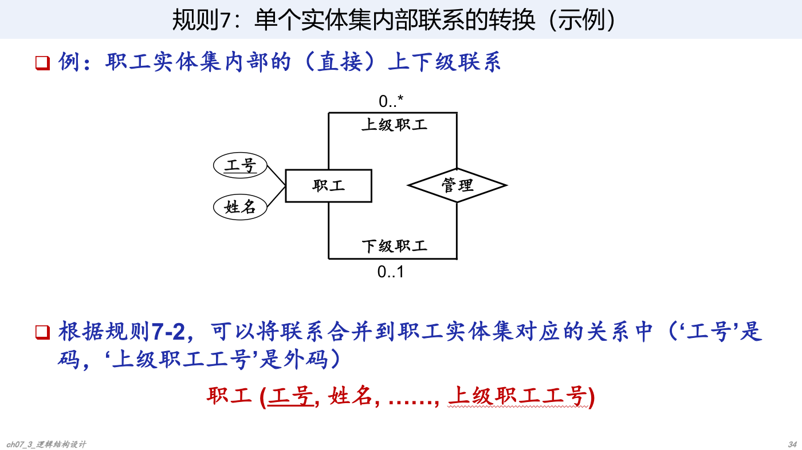

### 3. 内部多对多联系

最终通常得到两个关系：

```text
E(k, ...)
R(k1, k2, R的属性)
```

其中：

- `(k1, k2)` 是 `R` 的主码。
- `k1`、`k2` 都是外码，均引用 `E(k)`。
- 必须明确 `k1` 和 `k2` 在联系中的不同角色。

## 十二、规则8：ISA 联系转换

ISA 联系可有三种转换方式。

假设超实体集 `S` 有属性：

```text
S(k, A1, A2, ..., An)
```

其中 `k` 是标识属性。

子实体集：

```text
E1(B11, B12, ..., B1i)
E2(B21, B22, ..., B2j)
```

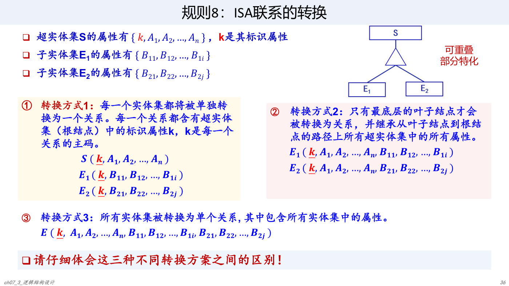

### 1. 方式1：每个实体集单独转换

```text
S(k, A1, A2, ..., An)
E1(k, B11, B12, ..., B1i)
E2(k, B21, B22, ..., B2j)
```

特点：

- 每个关系都包含超实体集标识属性 `k`。
- `k` 是每个关系主码。
- 子类关系中的 `k` 同时引用父类关系。
- 适合可重叠、部分特化等较复杂 ISA 语义，冗余较少，语义清晰。

### 2. 方式2：只转换叶子结点

```text
E1(k, A1, A2, ..., An, B11, B12, ..., B1i)
E2(k, A1, A2, ..., An, B21, B22, ..., B2j)
```

特点：

- 只有最底层子类型转成关系。
- 子类型继承从叶子到根路径上所有父类属性。
- 适合不相交且完全特化的 ISA 联系。
- 若父类实体可能不属于任何子类，则不适合。
- 若一个父类实体可属于多个子类，则会重复存储父类属性。

### 3. 方式3：所有实体集合并为一个关系

```text
S(k, A1, A2, ..., An, B11, ..., B1i, B21, ..., B2j)
```

特点：

- 所有属性放在一个关系中。
- 查询简单，不需要连接。
- 子类特有属性会产生较多空值。
- 需要额外属性或约束区分实体属于哪些子类。

### 4. ISA 转换示例

例 1：师生员工、学生、教师、职工。

若不考虑在职研究生：

- 师生员工与学生、教师、职工是不相交、完全特化。
- 第一层 ISA 可采用方式2，转换为学生、教师、职工三个关系。
- 其他 ISA 联系可采用方式1，例如教师下再分硕士生导师、博士生导师，可保留教师关系，并增加：

```text
硕士生导师(...)
博士生导师(...)
```

例 2：Persons、Consultants、Employees、Managers、Non_Managers。

讲义示例中：

- 第一层 ISA 采用方式2。
- 第二层 ISA 采用方式1。

转换结果：

```text
Consultants(personid primary key, address, vendorno unique)
Employees(personid unique, address, empid primary key)
Managers(empid primary key, expenseno unique)
Non_Managers(empid primary key, union_no unique)
```

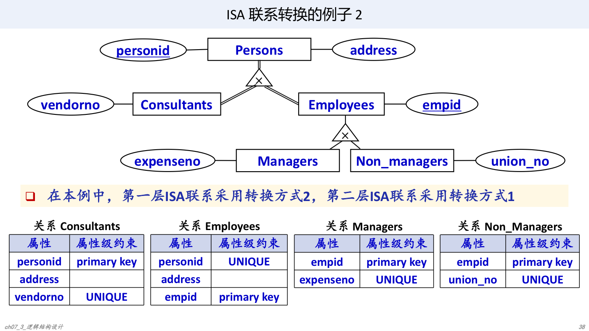

## 十三、规范化

从 EER 转换得到的关系模式只是初步模式，必须进行关系规范化设计。

目标：

- 确保所有关系模式至少满足第三范式（3NF）。
- 检查转换过程中自动确定的主码是否正确。
- 检查是否存在部分函数依赖、传递函数依赖等问题。
- 必要时分解或调整关系模式。

特别注意：

- 多值属性转换得到的关系码不一定最终正确。
- 多元联系转换得到的关系码也不一定总是所有外码的组合。
- 规范化是从“机械转换”走向“正确关系模式”的关键步骤。

## 十四、RDBMS 性能调整

为了满足性能、存储空间和其他限制，需要对关系模式进行调整。

主要方法：

1. 逆规范化。
2. 关系分割。
3. 尽量使用快照。

### 1. 逆规范化

逆规范化是有意识地引入冗余，减少关系连接次数，提高系统性能。

适用场景：

- 某些查询频繁跨多个关系连接。
- 系统对响应时间要求高。
- 冗余带来的维护代价可接受。

### 2. 关系分割

关系分割用于调整每个关系大小，提高单个关系上的数据存取效率。

常用方法：

- 水平分割：将一个关系的元组集合划分为若干不相交子集，每个子集对应一个子关系模式。
- 垂直分割：将一个关系模式纵向分解为若干子关系模式。这里不同于规范化设计中的模式分解，重点是性能调整。

### 3. 快照

快照（snapshot）可以用一条 `SELECT` 查询语句，为数据库中的某张表或某个查询结果创建一个不可修改、持久化的数据备份。

语法：

```sql
create snapshot <snapshot-name> as <select-statement>;
```

执行创建快照时，DBMS 执行对应查询，并把结果以“表”的形式持久存储在数据库中。

应用程序可直接访问快照中的查询结果，不必每次重新执行复杂查询，因此可提高访问效率。

适用场景：

- 业绩统计。
- 库存盘点。
- 实时计费。

快照维护方式：

- DBMS 周期性自动刷新快照结果。
- 用户手工执行快照刷新命令。

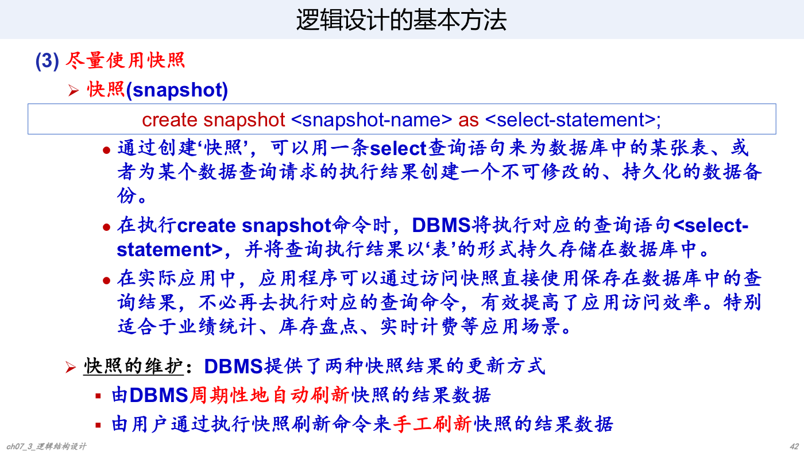

## 十五、约束条件设置

逻辑设计阶段还要设置各类约束：

- 完整性约束。
- 安全性约束。
- 数据类型约束。
- 数据量约束。
- 重新定义每个表的候选键、主码和外码。

常见完整性约束包括：

- 主键约束。
- 外键约束。
- 唯一约束。
- 非空约束。
- 检查约束。

其中，组合属性拆分后的“全空或全非空”约束、多属性之间的取值关系等，通常需要表级 `CHECK` 或触发器等机制表达。

## 十六、关系视图设计

关系视图是在关系模式基础上直接面向操作用户的视图，也就是用户外模式。

RDBMS 通常通过 `view` 提供关系视图功能。视图可根据用户需求随时定义或重新定义。

关系视图作用：

- 提供数据逻辑独立性。
- 满足不同用户的不同数据需求。
- 提供一定的数据安全和保密功能。

例：同一基础表可为普通用户、业务人员、管理员定义不同视图，只暴露其需要访问的列和行。

## 十七、数据库逻辑设计案例

讲义列出可参考的逻辑设计案例：

- 案例1：图书借阅管理，对应复习思考题13。
- 案例2：考试监考安排管理，对应复习思考题14。
- 案例3：CBA 篮球联赛信息管理，对应复习思考题15。
- 案例4：邮件信息管理，对应复习思考题16。
- 案例5：电子图书借阅管理，对应复习思考题17。
- 案例6：民用航班信息管理，对应复习思考题18。

这些案例的详细关系模式可参考第七章复习题中的数据库设计案例参考答案。

## 十八、转换规则速查

| 编号 | 对象 | 转换规则 |
| --- | --- | --- |
| 规则1 | 实体集 | 每个实体集转换为一个关系，主标识符为主码 |
| 规则2 | 多值属性 | 单独转换为关系，主码通常为“原实体主码 + 多值属性” |
| 规则3 | 1:1 二元联系 | 两端非全参与转 3 个关系；一端全参与转 2 个关系；两端全参与转 1 个关系 |
| 规则4 | 1:n 二元联系 | 通常把联系合并到 n 端；若 n 端非全参与，可单独成关系 |
| 规则5 | m:n 二元联系 | 必须单独转换为关系，主码通常为两端主码组合 |
| 规则6 | 多元联系 | 单独转换为关系，通常包含所有参与实体主码和联系属性 |
| 规则7 | 单实体集内部联系 | 先按角色拆成两个实体集，再按二元联系规则转换，最后合并实体关系 |
| 规则8 | ISA 联系 | 可选父子各建表、只建叶子表、全部合并一张表三种方式 |

## 十九、易错点

- 组合属性不是直接作为一列保存，而是展开为成员属性。
- 多值属性通常应单独建关系，否则最多只能满足 1NF。
- 1:1 联系不总是合并，是否合并取决于两端是否全参与。
- 1:n 联系一般合并到 n 端，而不是 1 端。
- m:n 联系必须单独建关系。
- 单实体集内部联系要给外码起能表达角色的名字，如“上级职工工号”。
- ISA 转换方式要结合不相交/可重叠、完全/部分特化选择。
- 机械转换后的主码不一定最终正确，必须经过规范化验证。
- 性能调整可能需要逆规范化，但应权衡查询效率与更新维护代价。

