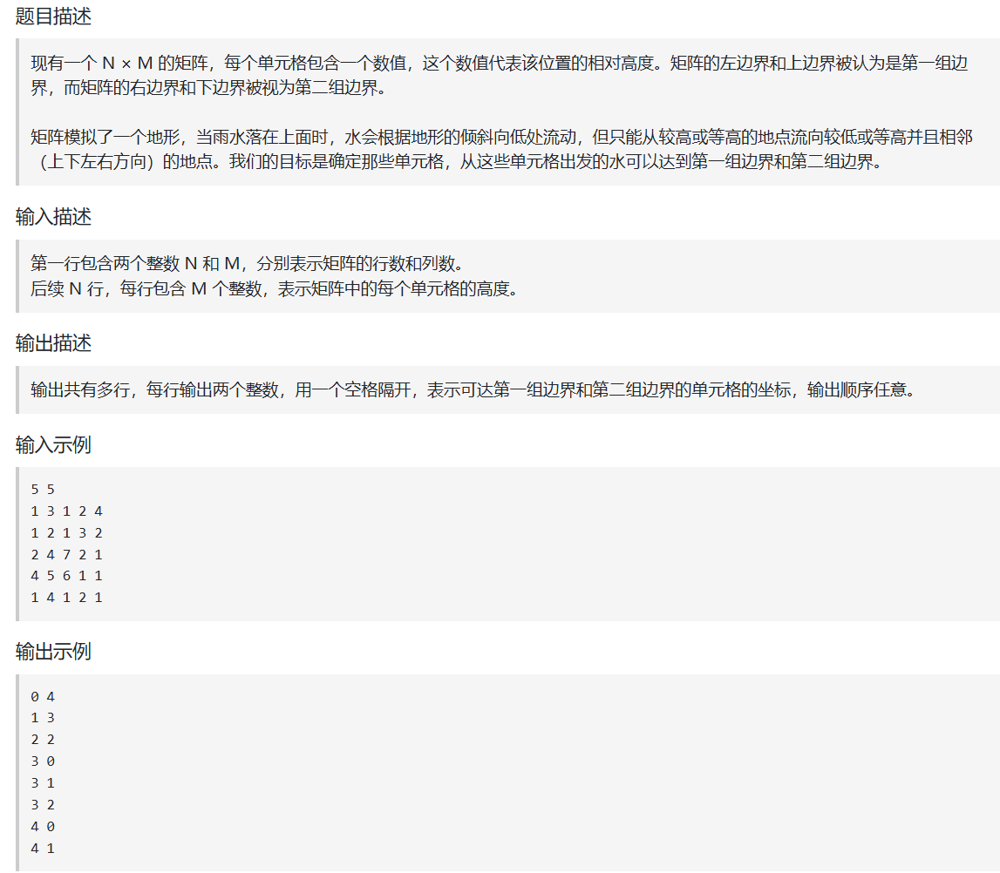
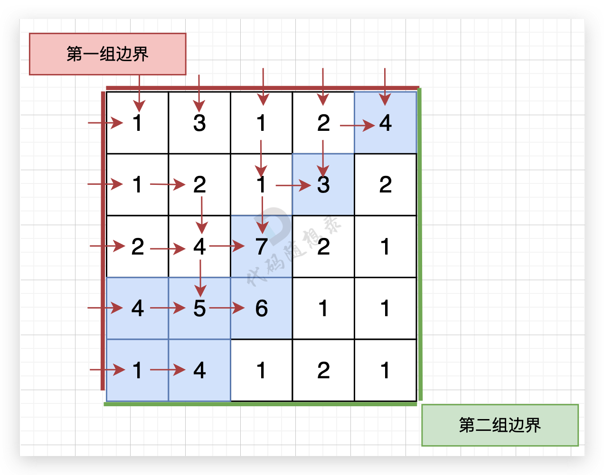

# 杂记

## 单调栈

**单调栈**是一种特殊的栈，里面的内容单调，定义非常简单，和它的名字相同，但是他能用来解决寻找**下一个更大（更小）**的元素

这是为什么？

接下来用一个经典例子来解释

给定一个数组，找到右边第一个比它大的数

**输入**[2,1,2,4,3]

**输出**[4,2,4,-1,-1]

现在我们来模拟解题过程

1.初始化一个空栈，

2.遍历数组中的每一个元素

3.对于当前元素arr[i]:

+ **while** (栈不为空 **并且** 当前元素 `nums[i]` > 栈顶元素)：
  - **弹出**栈顶元素。这意味着：**当前元素 `nums[i]` 就是被弹出元素的“下一个更大元素”**。
  - 我们将这个对应关系（被弹出元素 -> `nums[i]`) 记录下来。
+ **将**当前元素 `nums[i]` 的**索引**（或值）压入栈中。
+ （这样就能保证栈内元素从底到顶始终是**单调递减**的） 

4.遍历结束后，如果栈中还有元素，说明这些元素右边没有比它们更大的元素，它们的结果记为 -1。

**一步步拆解上面的数组 `[2, 1, 2, 4, 3]`：**

| 当前元素 | 操作                                                         | 栈 (底 -> 顶) | 说明/结果记录                                               |
| :------- | :----------------------------------------------------------- | :------------ | :---------------------------------------------------------- |
| 2        | 栈空，直接入栈                                               | [2]           |                                                             |
| 1        | 1 < 栈顶(2)，直接入栈                                        | [2, 1]        |                                                             |
| 2        | 2 > 栈顶(1)，**弹出1**，记录 `1 -> 2` 2 == 栈顶(2)，**入栈** | [2, 2]        | 1 的下一个更大元素是 2                                      |
| 4        | 4 > 栈顶(2)，**弹出2**，记录 `2 -> 4` 4 > 栈顶(2)，**弹出2**，记录 `2 -> 4` 栈空，**入栈** | [4]           | 第二个 2 的下一个更大元素是 4 第一个 2 的下一个更大元素是 4 |
| 3        | 3 < 栈顶(4)，直接入栈                                        | [4, 3]        |                                                             |
| **结束** | 栈中剩余元素 [4, 3]，它们右边没有更大元素，记录 `4 -> -1`, `3 -> -1` |               |                                                             |

**代码示例**：

```c++
#include <iostream>
#include <vector>
#include <stack>
using namespace std;

vector<int> nextGreaterElement(const vector<int>& nums) {
    int n = nums.size();
    vector<int> result(n, -1); // 初始化结果数组，全部为-1
    stack<int> st; // 单调栈，存储的是元素的索引
    
    // 遍历数组
    for (int i = 0; i < n; i++) {
        // 当栈不为空且当前元素大于栈顶元素对应的值时
        while (!st.empty() && nums[i] > nums[st.top()]) {
            // 栈顶元素的下一个更大元素就是当前元素
            result[st.top()] = nums[i];
            st.pop(); // 弹出栈顶元素
        }
        // 将当前元素的索引入栈
        st.push(i);
    }
    
    return result;
}

int main() {
    vector<int> nums = {2, 1, 2, 4, 3};
    vector<int> result = nextGreaterElement(nums);
    
    cout << "输入数组: ";
    for (int num : nums) {
        cout << num << " ";
    }
    cout << endl;
    
    cout << "下一个更大元素: ";
    for (int res : result) {
        cout << res << " ";
    }
    cout << endl;
    
    return 0;
}
```

## 析构函数

### 📚 基本定义

**析构函数** 是一种特殊的成员函数，它在对象被销毁时**自动调用**，用于执行对象的清理工作。

#### 🔧 语法形式

```c++
class ClassName {
public:
    ~ClassName();  // 析构函数声明
};

// 析构函数定义
ClassName::~ClassName() {
    // 清理代码
}
```

---

### 🎯 核心特性

#### 1. **命名规则**
- 函数名 = `~` + 类名
- **无参数**，**无返回值**
- **不能被重载**（一个类只能有一个析构函数）

#### 2. **调用时机**
析构函数在以下情况自动调用：

| 场景                                  | 示例                          |
| ------------------------------------- | ----------------------------- |
| 局部对象离开作用域                    | `{ MyClass obj; }` ← 右括号处 |
| 动态对象被 `delete`(不能是```free```) | `delete ptr;`                 |
| 对象成员所属对象销毁                  | 包含类对象销毁时              |
| 临时对象生命周期结束                  | 表达式计算完成后              |
| 栈展开时（异常处理）                  | 异常抛出时                    |

---

### 💻 详细代码示例

#### 示例1：基础用法

```c++
#include <iostream>
#include <cstring>

class String {
private:
    char* m_data;
    size_t m_length;

public:
    // 🏗️ 构造函数 - 分配资源
    String(const char* str = "") {
        std::cout << "🔧 构造函数被调用" << std::endl;
        m_length = strlen(str);
        m_data = new char[m_length + 1];  // 🎯 动态分配内存
        strcpy(m_data, str);
    }

    // 🗑️ 析构函数 - 释放资源
    ~String() {
        std::cout << "🧹 析构函数被调用，释放资源: " << (m_data ? m_data : "null") << std::endl;
        delete[] m_data;  // 🎯 关键：释放动态内存
        m_data = nullptr;
    }

    // 其他成员函数
    void print() const {
        std::cout << "内容: " << m_data << std::endl;
    }
};

void demoBasic() {
    std::cout << "\n=== 示例1：基础用法 ===" << std::endl;
    { // 开始作用域
        String s1("Hello World");  // 🏗️ 构造函数调用
        s1.print();
    } // 🧹 离开作用域，析构函数自动调用
    
    std::cout << "作用域结束" << std::endl;
}
```

#### 示例2：动态对象管理

```c++
class ResourceManager {
private:
    int* m_buffer;
    size_t m_size;

public:
    // 构造函数
    ResourceManager(size_t size) : m_size(size) {
        std::cout << "🔧 分配 " << size << " 个整数" << std::endl;
        m_buffer = new int[size];  // 🎯 动态分配
    }

    // 析构函数
    ~ResourceManager() {
        std::cout << "🧹 释放 " << m_size << " 个整数" << std::endl;
        delete[] m_buffer;  // 🎯 防止内存泄漏
        m_buffer = nullptr;
    }

    // 禁用拷贝（避免浅拷贝问题）
    ResourceManager(const ResourceManager&) = delete;
    ResourceManager& operator=(const ResourceManager&) = delete;
};

void demoDynamic() {
    std::cout << "\n=== 示例2：动态对象 ===" << std::endl;
    
    ResourceManager* ptr = new ResourceManager(100);  // 🏗️ 构造函数
    ptr->~ResourceManager();  // ❌ 可以显式调用，但通常不应该这样做
    delete ptr;  // 🧹 调用析构函数 + 释放内存
    
    std::cout << "动态对象已销毁" << std::endl;
}
```

#### 示例3：RAII模式

```c++
#include <fstream>

// 🎯 RAII（Resource Acquisition Is Initialization）示例
class FileWrapper {
private:
    std::fstream m_file;

public:
    // 构造函数获取资源
    FileWrapper(const std::string& filename, std::ios::openmode mode = std::ios::in) {
        std::cout << "🔧 打开文件: " << filename << std::endl;
        m_file.open(filename, mode);
        if (!m_file.is_open()) {
            throw std::runtime_error("无法打开文件");
        }
    }

    // 析构函数释放资源
    ~FileWrapper() {
        std::cout << "🧹 关闭文件" << std::endl;
        if (m_file.is_open()) {
            m_file.close();  // 🎯 确保文件被关闭
        }
    }

    // 使用资源
    std::string readLine() {
        std::string line;
        std::getline(m_file, line);
        return line;
    }

    // 禁止拷贝
    FileWrapper(const FileWrapper&) = delete;
    FileWrapper& operator=(const FileWrapper&) = delete;
};

void demoRAII() {
    std::cout << "\n=== 示例3：RAII模式 ===" << std::endl;
    
    try {
        FileWrapper file("example.txt");  // 🏗️ 资源获取
        auto content = file.readLine();   // 🎯 使用资源
        std::cout << "读取内容: " << content << std::endl;
    } // 🧹 无论是否异常，文件都会被正确关闭
    catch (const std::exception& e) {
        std::cout << "错误: " << e.what() << std::endl;
    }
}
```

---

### ⚠️ 重要注意事项

#### 1. **虚析构函数**

```c++
class Base {
public:
    // ✅ 如果类可能被继承，应该声明虚析构函数
    virtual ~Base() {
        std::cout << "Base 析构函数" << std::endl;
    }
};

class Derived : public Base {
private:
    int* m_data;
public:
    Derived() : m_data(new int[100]) {}
    
    // ✅ 正确：派生类析构函数自动为虚函数
    ~Derived() override {
        std::cout << "Derived 析构函数" << std::endl;
        delete[] m_data;
    }
};

void demoVirtualDestructor() {
    std::cout << "\n=== 虚析构函数示例 ===" << std::endl;
    
    Base* ptr = new Derived();
    delete ptr;  // 🎯 正确调用 Derived 和 Base 的析构函数
}
```

#### 2. **合成析构函数**

如果类没有定义析构函数，编译器会自动生成一个：

```c++
class SimpleClass {
    int x, y;
public:
    // 编译器自动生成：~SimpleClass() {}
    // 对基本类型成员，合成析构函数什么也不做
};
```

---

### 🔄 与其他语言的对比

| 语言       | 类似机制                | 特点                     |
| ---------- | ----------------------- | ------------------------ |
| **C++**    | `~ClassName()`          | 确定性销毁，手动内存管理 |
| **Java**   | `finalize()`            | ❌ 已废弃，非确定性调用   |
| **C#**     | `IDisposable` + `using` | 确定性资源管理           |
| **Python** | `__del__()`             | 非确定性，依赖垃圾回收   |
| **Rust**   | `Drop trait`            | 确定性，所有权系统       |

---

### 🎯 最佳实践总结

1. **✅ RAII原则**：在构造函数中获取资源，在析构函数中释放
2. **✅ 虚析构函数**：基类声明虚析构函数
3. **✅ 异常安全**：析构函数不应该抛出异常
4. **❌ 避免手动调用**：除非在placement new等特殊场景
5. **✅ 遵循规则五**：如果需要自定义析构函数，通常也需要拷贝/移动控制成员

```c++
// 🎯 现代C++推荐：使用智能指针避免手动析构
#include <memory>

void modernc++Style() {
    std::cout << "\n=== 现代C++风格 ===" << std::endl;
    
    // 无需手动 delete，unique_ptr 自动管理生命周期
    auto ptr = std::make_unique<String>("Modern C++");
    ptr->print();
    
    std::cout << "离开作用域，智能指针自动清理..." << std::endl;
} // 🧹 自动调用析构函数
```

---

### 📊 可视化：对象生命周期

```
对象创建 → 构造函数 🏗️
    ↓
对象使用期
    ↓
对象销毁 → 析构函数 🧹
    ↓
资源释放 ✅
```

**关键要点**：析构函数是C++中资源管理的基石，它确保了对象在生命周期结束时能够正确地清理其占用的资源，是防止资源泄漏的核心机制。

## 三分查找

### 问题描述
寻找函数 `f(x) = -x² + 4x + 1` 在区间 `[0, 5]` 上的最大值点。

### 完整代码实现

```c++
#include <iostream>
#include <cmath>
#include <iomanip>
using namespace std;

// 定义单峰函数：f(x) = -x² + 4x + 1，在 x=2 处取得最大值 5
double f(double x) {
    return -x*x + 4*x + 1;
}

// 三分查找实现
double ternary_search(double left, double right, double precision) {
    while (right - left > precision) {
        // 将区间分成三部分
        double mid1 = left + (right - left) / 3;
        double mid2 = right - (right - left) / 3;
        
        // 比较两个中间点的函数值
        if (f(mid1) < f(mid2)) {
            left = mid1;    // 最大值在 [mid1, right] 区间
        } else {
            right = mid2;   // 最大值在 [left, mid2] 区间
        }
    }
    
    // 返回区间中点作为近似极值点
    return (left + right) / 2;
}

int main() {
    double left = 0;        // 搜索区间左边界
    double right = 5;       // 搜索区间右边界  
    double precision = 1e-6; // 搜索精度
    
    cout << "寻找函数 f(x) = -x² + 4x + 1 在区间 [0, 5] 上的最大值点" << endl;
    
    double max_point = ternary_search(left, right, precision);
    double max_value = f(max_point);
    
    cout << fixed << setprecision(6);
    cout << "最大值点: x = " << max_point << endl;
    cout << "最大值: f(x) = " << max_value << endl;
    
    // 验证理论值（已知在 x=2 处取得最大值 5）
    cout << "理论值: x = 2.000000, f(x) = 5.000000" << endl;
    
    return 0;
}
```

### 运行结果
```
寻找函数 f(x) = -x² + 4x + 1 在区间 [0, 5] 上的最大值点
最大值点: x = 2.000000
最大值: f(x) = 5.000000
理论值: x = 2.000000, f(x) = 5.000000
```

### 算法说明
- **函数特性**：抛物线开口向下，是单峰函数
- **三分原理**：每次将搜索区间分成三等份，比较两个分界点的函数值
- **收敛性**：每次迭代将搜索区间缩小到原来的 2/3
- **精度控制**：当区间长度小于指定精度时停止搜索


## list

### 创建与初始化

#### 构造函数
```c++
list<int> lst1;                    // 空链表
list<int> lst2(5, 10);            // 5个元素，每个都是10
list<int> lst3 = {1, 2, 3, 4, 5}; // 初始化列表
list<int> lst4(lst3);             // 拷贝构造
list<int> lst5(lst3.begin(), lst3.end()); // 范围构造
```

#### 赋值操作
```c++
lst1 = lst2;                      // 拷贝赋值
lst1 = {1, 2, 3, 4, 5};          // 初始化列表赋值
lst1.assign(3, 100);              // 分配3个100
lst1.assign(lst2.begin(), lst2.end()); // 范围赋值
```

### 元素访问

#### 首尾元素访问
```c++
lst.front();      // 第一个元素（不检查空）
lst.back();       // 最后一个元素（不检查空）

// 安全访问示例：
if (!lst.empty()) {
    int first = lst.front();
    int last = lst.back();
}
```

#### ❗注意：list不支持随机访问
```c++
// lst[2] = 5;                    // 错误！不能使用下标
// int val = lst.at(2);           // 错误！没有at函数
```

### 容量查询

```c++
lst.empty();      // 是否为空
lst.size();       // 元素个数
lst.max_size();   // 理论最大大小
```

### 修改操作

#### 添加元素
```c++
lst.push_back(10);     // 尾部添加
lst.push_front(20);    // 头部添加
lst.emplace_back(30);  // 尾部构造（C++11）
lst.emplace_front(40); // 头部构造（C++11）

// emplace示例：
list<pair<int, string>> lst;
lst.emplace_back(1, "hello");  // 直接构造，避免拷贝
```

#### 插入元素
```c++
auto it = lst.begin();
advance(it, 2);                 // 移动到第三个位置
lst.insert(it, 99);             // 在指定位置前插入
lst.insert(it, 3, 88);          // 插入3个88
lst.insert(it, {1, 2, 3});      // 插入初始化列表
```

#### 删除元素
```c++
lst.pop_back();                 // 删除尾部
lst.pop_front();                // 删除头部
lst.erase(it);                  // 删除迭代器指向的元素
lst.erase(first, last);         // 删除范围 [first, last)
lst.remove(42);                 // 删除所有值为42的元素
lst.remove_if([](int x) {       // 删除满足条件的元素
    return x % 2 == 0; 
});
lst.clear();                    // 清空所有元素
```

### 链表操作

#### 拼接（splice） - list特有
```c++
list<int> lst1 = {1, 2, 3};
list<int> lst2 = {4, 5, 6};

lst1.splice(lst1.end(), lst2);          // 移动整个lst2到lst1末尾
lst1.splice(lst1.begin(), lst2, it);    // 移动单个元素
lst1.splice(pos, lst2, first, last);    // 移动元素范围
```

#### 排序与去重
```c++
lst.sort();                     // 默认升序排序
lst.sort(greater<int>());       // 降序排序
lst.unique();                   // 删除连续重复元素
lst.unique([](int a, int b) {   // 自定义去重条件
    return abs(a - b) < 2;
});
```

#### 合并与反转
```c++
lst1.merge(lst2);               // 合并两个有序链表
lst1.merge(lst2, greater<int>()); // 指定比较函数
lst.reverse();                  // 反转链表
```

### 查找与判断

```c++
// 查找（需要线性搜索）
auto it = find(lst.begin(), lst.end(), 42);

// 统计
int count = 0;
for (auto x : lst) {
    if (x > 10) count++;
}

// 条件判断
bool all_even = all_of(lst.begin(), lst.end(), [](int x) {
    return x % 2 == 0;
});
```

### 迭代器操作

```c++
auto begin = lst.begin();       // 指向第一个元素
auto end = lst.end();           // 指向最后一个元素之后
auto rbegin = lst.rbegin();     // 反向迭代器
auto rend = lst.rend();

// C++11 后推荐使用 auto
for (auto it = lst.begin(); it != lst.end(); ++it) {
    cout << *it << " ";
}

// 范围for循环（推荐）
for (const auto& element : lst) {
    cout << element << " ";
}
```

### 性能特点

| 操作 | 时间复杂度 | 说明 |
|------|------------|------|
| `push_back()` | O(1) | 尾部插入 |
| `push_front()` | O(1) | 头部插入 |
| `insert()` | O(1) | 已知位置插入 |
| `erase()` | O(1) | 已知位置删除 |
| `splice()` | O(1) | 链表间移动 |
| `size()` | O(1) | C++11起 |
| `sort()` | O(n log n) | 链表排序 |
| `find()` | O(n) | 线性查找 |

### 实用技巧

#### 按下标操作
```c++
// 获取第n个元素的迭代器
auto get_iterator_at_index = [](list<int>& lst, int index) {
    auto it = lst.begin();
    advance(it, index);
    return it;
};

// 按下标删除
void remove_at_index(list<int>& lst, int index) {
    if (index < 0 || index >= lst.size()) return;
    auto it = lst.begin();
    advance(it, index);
    lst.erase(it);
}
```

#### 安全遍历并删除
```c++
// 错误方式（迭代器失效）
// for (auto it = lst.begin(); it != lst.end(); ++it) {
//     if (*it % 2 == 0) {
//         lst.erase(it);  // 错误！it失效后继续使用
//     }
// }

// 正确方式
for (auto it = lst.begin(); it != lst.end(); ) {
    if (*it % 2 == 0) {
        it = lst.erase(it);  // 使用返回值更新迭代器
    } else {
        ++it;
    }
}
```

#### 自定义排序
```c++
struct Person {
    string name;
    int age;
};

list<Person> people;
people.sort([](const Person& a, const Person& b) {
    return a.age < b.age;  // 按年龄升序
});
```

### 选择 list 的场景

**适合使用 list：**
- ✅ 频繁在任意位置插入删除
- ✅ 需要稳定的迭代器（插入删除不使其他迭代器失效）
- ✅ 需要 `splice` 操作

**不适合使用 list：**
- ❌ 需要随机访问元素
- ❌ 内存受限（每个元素有额外指针开销）
- ❌ 缓存性能重要（内存不连续）

### 示例总结

```c++
#include <iostream>
#include <list>
#include <algorithm>

int main() {
    // 创建和初始化
    list<int> lst = {1, 2, 3, 4, 5};
    
    // 添加元素
    lst.push_back(6);
    lst.push_front(0);
    
    // 插入元素
    auto it = lst.begin();
    advance(it, 3);
    lst.insert(it, 99);
    
    // 删除元素
    lst.remove(3);           // 删除所有3
    lst.pop_back();          // 删除尾部
    
    // 排序和反转
    lst.sort();
    lst.reverse();
    
    // 遍历输出
    for (int x : lst) {
        cout << x << " ";
    }
    
    return 0;
}
```

## 顺流与逆流



关于这道题我们很明显可以想到一个很暴力的思路：
+ 遍历每一个点
+ 对每个点都dfs或者bfs，检测其是否能到达两个边界

但是很明显上述逻辑过于暴力，所以他造就了下述结果


这个时候我们开始思考优化

我们想到上述逻辑对n * m个点进行了操作，但是每个点又进行了一系列的递归操作

我们的初步想法是能不能减少递归次数

很遗憾，按照这个想法，我们想到了几个思路，但是都没什么用

🫥最后我们放弃，询问了ai

AI给出思路如下

+ 那么我们可以 反过来想，从第一组边界上的节点 逆流而上，将遍历过的节点都标记上。

+ 同样从第二组边界的边上节点 逆流而上，将遍历过的节点也标记上。

+ 然后两方都标记过的节点就是既可以流向第一组边界也可以流向第二组边界的节点。

+ 从第一组边界边上节点出发，如图： （图中并没有把所有遍历的方向都画出来，只画关键部分）



对于图类型的题目，我们可以尝试逆流的思想来解决题目，有时候反过来要快得多
