# 多样性测试

## 随机测试

随机测试是一种最简单的多样性测试方法，通过随机抽样生成测试数据，通常基于概率分布生成，也可用于模仿用户对软件的使用场景。它能够低成本生成大量测试，以发现隐藏的缺陷，具有很强的适用性和易用性，广泛应用于各类测试。然而，随机测试的缺陷检测效率瓶颈问题严重，随着测试进行，效率提升困难，后期能力提升困难，结合程序分析和其他测试方法改进是主要研究方向。

## 简单随机测试

简单随机测试针对输入空间Ω，以概率分布F进行随机抽样获得测试集T。默认情况下F是均匀分布，实际应用中通常采用有放回抽样以简化实现。基本思想是生成大量随机输入，记录程序输出，并分析测试结果。输入可以是数据输入、界面交互输入等。

**示例应用**：

- 

  **三角形程序**：随机生成三个整数a、b、c（范围1到100），根据三角形性质计算预期结果。

- 

  **登录系统**：使用随机生成邮箱（如faker库或正则表达式）和密码（包含大小写字母和数字，长度≥8位），模拟登录操作。

- 

  **人脸识别系统**：生成随机人脸图像，包括不同清晰度、分辨率、光照和角度等因素，以测试鲁棒性。

简单随机测试的优点是简单易用，但针对性较差，可能无法高效覆盖特定场景。

## 自适应随机测试

自适应随机测试（ART）是针对随机测试效率低下的改进方法，利用软件失效的故障模式信息指导测试。ART以概率分布F进行随机抽样，并结合距离度量反馈信息筛选获得测试集T。其设计直觉基于故障区域的连续性：非故障区域也是连续的，因此测试应更均匀分布，选择远离已执行测试的新测试以提高失效检测概率。

**ART主要步骤**：

1. 

   **初始化**：执行初始测试，收集程序行为信息（如输出、执行时间和覆盖率）。

2. 

   **执行测试**：将输入空间分成若干子区域，在每个子区域随机选择初始测试。

3. 

   **反馈控制**：根据执行结果更新输入空间，将相似测试归为同一子区域。

4. 

   **选择测试**：使用自适应策略选择距离已知故障最远的测试（如FSCS-ART算法）。

5. 

   **循环重复**：重复过程直到满足终止条件。

**距离度量**：包括欧几里得距离、曼哈顿距离、余弦相似度和汉明距离等，用于衡量测试用例之间的相似性。

**故障模式**：软件失效的故障模式分为点模式、带模式和块模式，这些模式描述了故障在输入域中的传播方式。


**示例应用**：在登录系统或人脸识别系统中，ART通过生成候选集、计算极小距离并选择最优测试，提高故障检测效率。ART适用于非均匀分布场景，如Triangle程序或NextDay程序，通过距离引导优化测试生成。

## 引导性随机测试

引导性随机测试结合随机抽样与符号执行反馈信息筛选测试集T，目标是利用符号执行的路径探索能力优化随机测试效率，提高覆盖率并发现深层次缺陷。符号执行是一种静态测试方法，通过构造符号化输入代替具体输入，探索程序路径并生成路径约束条件，最后求解这些约束得到测试输入范围。

**符号执行流程**：

1. 

   **符号化变量**：使用符号值表示程序变量。

2. 

   **模拟程序执行**：基于中间语言模拟执行，不执行实际程序。

3. 

   **记录路径条件**：记录执行过程中经过的语句序列和约束。

4. 

   **求解约束条件**：使用约束求解器得到满足路径条件的测试输入。

5. 

   **生成测试用例**：将求解结果转化为测试用例。

**挑战与改进**：

- 

  **路径爆炸问题**：程序路径数量指数级增长，通过路径剪枝、启发式搜索和抽象解释缓解。

- 

  **内部结构问题**：如指针、数组和复杂数据结构，需准确跟踪关系。

- 

  **外部函数问题**：如库函数调用，使用函数摘要或模拟执行处理。

- 

  **约束求解问题**：复杂约束可能超出求解器能力，采用简化约束、近似求解或多求解器结合。

引导性随机测试分为静态符号执行（全面探索所有路径）和动态符号执行（结合动态执行信息引导），动静态结合是优化方向。示例包括MeanVar程序，其中符号执行处理循环和计算约束。

## 等价类测试方法

等价类测试方法基于输入域或输出域的等价关系划分，假设同一等价类中的输入对缺陷检测作用等价。这允许用少量测试覆盖大量场景，提高测试效率。

### 等价类划分

等价类划分步骤包括：

1. 

   **确定划分域**：确定程序输入或输出的范围。

2. 

   **划分等价类**：将输入域或输出域划分为等价类。例如：

   - 

     输入条件规定取值范围：一个有效等价类和两个无效等价类。

   - 

     输入条件为布尔变量：一个有效等价类和一个无效等价类。

3. 

   **选择代表性测试**：从每个等价类中选择代表性数据作为测试用例。

**示例**：

- 

  **Triangle程序**：输入三个整数，无效等价类（边长≤0或>100），有效等价类（边长>0且≤100）；输出等价类包括等边、等腰、普通和无效三角形。

- 

  **NextDay程序**：考虑闰年规则，划分年份、月份和日期的等价类（如闰年、平年、30天月份等）。

- 

  **成绩计算程序**：输入等价类（考试分数0-75，作业分数0-25），输出等价类（等级A、B、C、D）。

等价类测试类型包括弱一般等价类测试（覆盖每个变量的有效等价类）、弱健壮等价类测试（增加无效等价类）、强一般等价类测试（覆盖所有有效等价类组合）和强健壮等价类测试（增加无效等价类组合）。实践中的应用如人脸识别系统，划分人脸图像、分辨率、光线和角度等因素的等价类。

## 划分随机测试

划分随机测试结合等价类划分与随机抽样，针对非完美划分场景。定义中，对于K个子域D1,...,Dk，分配概率强度P1,...,Pk，生成测试集时从每个子域随机生成Ni = Pi * N个测试。

**数学模型与度量**：

- 

  **P-度量**：测试集至少包含一个失效测试的概率。公式：简单随机测试为Pr = 1 - (1 - θ)^n，划分随机测试为Pp = 1 - ∏(1 - θ_i)^{n_i}。最佳情况是子域充满失效输入时Pp = 1。

- 

  **E-度量**：测试集触发失效次数的数学期望。简单随机测试为Er = nθ，划分随机测试为Ep = ∑n_i θ_i。E-度量比P-度量更能反映测试有效性。

- 

  **F-度量**：检测到第一个缺陷所需的测试数量，服从几何分布，用于评估软件可靠性（如平均无故障时间MTTF）。

划分随机测试在实践中的应用（如人脸识别系统）中，通过不同划分策略分析缺陷检测效果，并仿真计算度量值。它适用于输入空间非均匀分布的场景，如Triangle程序或超市管理系统。

## 组合测试

组合测试适用于多参数系统，通过覆盖参数间交互减少测试用例数量，目标是用最少用例覆盖最多缺陷。全组合测试数目指数级增长，组合测试通过控制组合强度实现高效覆盖。

### 基本概念

- 

  **参数（Parameter）**：影响软件行为的输入变量或配置选项，如浏览器、操作系统。

- 

  **取值（Value）**：每个参数的可能取值，如浏览器取值为Chrome、Firefox等。

- 

  **组合强度（Coverage Strength）**：表示需要覆盖的参数组合数量，如n-way组合：

  - 

    n=1：单因素组合，一般不讨论。

  - 

    n=2：双因素组合（Pairwise），最常用，覆盖两两参数组合。

  - 

    n=3：三因素组合（3-way），覆盖三元组合，能发现更复杂缺陷。

  - 

    k-way：覆盖k元组合，k增加时测试数量指数增长。

**示例**：办公软件字体配置，参数包括中文字体、字形、字号等，通过双因素组合生成测试集（如9个测试覆盖所有两两组合）。组合测试与等价类划分和随机测试结合，可提高适用性。

### 组合生成

组合测试生成是NP难问题，常用贪心算法：

1. 

   **候选生成**：生成所需覆盖的t-way组合集合C，初始化未覆盖集合U = C。

2. 

   **覆盖评分**：计算候选测试覆盖U中未覆盖组合的数量。

3. 

   **选择最优候选**：选择覆盖最多未覆盖组合的候选测试，加入测试集T。

4. 

   **更新未覆盖集合**：从U中移除被新测试覆盖的组合。

5. 

   **迭代**：重复直到U为空，输出测试集T。

**工具支持**：

- 

  **ACTS工具**：基于IPO算法，逐步扩展参数组合覆盖，支持GUI、约束和混合强度。示例应用于TCAS系统，生成测试用例统计。

- 

  **PICT工具**：基于贪心算法和约束过滤，快速生成Pairwise覆盖，支持命令行集成。示例应用于字体配置模型。

**高级策略**：

- 

  **带约束组合测试**：处理参数间无效组合（如国际呼叫不能使用800计费），通过约束排除无效用例。

- 

  **种子组合测试**：要求测试集包含给定种子测试，优化生成过程。

- 

  **可变强度组合测试**：允许不同参数组合强度不同（如某些参数需3-way覆盖）。

组合测试生成方法通过优化覆盖数组（如CA(N; k, m, v)）最小化测试数量，适用于大规模系统测试，如Web应用或办公软件。

## 总结

多样性测试方法通过不同策略平衡测试效率与覆盖率：随机测试提供简单广泛的探索，自适应和引导性测试利用反馈优化，等价类划分聚焦代表性数据，划分随机测试结合划分与随机抽样，组合测试针对多参数交互。这些方法可单独或结合使用，根据系统特性（如输入分布、参数数量）选择合适策略。工具如ACTS和PICT自动化生成过程，提高实践可行性。未来方向包括智能场景拓展和自适应调整，以应对复杂软件系统测试需求。

---


# 故障假设测试

故障假设测试是一种软件测试方法，通过主动假设软件中可能存在各种故障情况，从而有针对性地设计测试用例，以发现潜在缺陷。它基于对软件复杂性和不确定性的认识，旨在提高测试的覆盖率和有效性。以下将根据文档内容，从边界故障假设、变异缺陷假设和逻辑故障假设三个方面进行详细总结，结构丰富并涵盖关键概念、示例和优化技术。

## 一、边界故障假设

边界故障假设测试专注于软件在处理边界值时容易出现的错误，因为边界往往是系统逻辑发生变化的关键点。开发人员常忽视边界条件，导致缺陷。边界故障假设分为黑盒和白盒两种视角。

### 1. 黑盒边界故障假设

黑盒测试基于软件的功能需求，无需了解内部代码，通过分析输入输出变量的边界来设计测试用例。

- 

  **概述**：软件系统在边界值（如最小值、最大值附近）更容易出错。例如，数组下标越界可能导致程序崩溃。

- 

  **边界类型**：

  - 

    **数值范围边界**：对于有明确范围的输入，测试最小值、最大值、略小于最小值、略大于最大值的值。例如，输入要求1-100的整数，边界值包括1、100、0、101。

  - 

    **字符长度边界**：针对字符串输入，关注最小和最大字符长度。例如，用户名长度要求3-20字符，边界值包括3字符、20字符、2字符、21字符。

  - 

    **其他边界**：如办公软件中的页面边距、人工智能系统中的光照条件或图像分辨率等。

- 

  **测试步骤**：

  1. 

     功能理解：分析需求规格，明确输入输出。

  2. 

     变量识别：识别所有输入输出变量。

  3. 

     明确取值范围：确定每个变量的合法范围。

  4. 

     找出边界点：包括最小值、最大值及其附近值。

  5. 

     考虑特殊情况：如浮点计算、多参数组合边界。

  6. 

     设计测试用例：单变量和多变量边界测试。

- 

  **示例**：

  - 

    **Triangle程序**：三角形边长范围为[1,100]的整数。测试用例包括a=0（无效输入）、a=1（边界值）、a=100（边界值）、a=101（无效输入）。多参数测试中，任一参数无效则整体无效。

  - 

    **NextDay程序**：处理日期，涉及月份、日期和年份的边界，如2月和闰年情况。测试用例包括无效日期（如6月31日）和边界日期（如1900年1月1日）。

- 

  **挑战**：偶然正确问题，即某些边界输入可能不会触发失效，需成对测试边界值（如x+和x-）。

### 2. 白盒边界故障假设

白盒测试基于程序代码，关注内部逻辑的边界条件，如条件语句和循环语句。

- 

  **概述**：以代码实现为基线，分析判定点（如if语句、循环）的边界值。与黑盒测试相比，白盒测试更深入代码细节。

- 

  **示例**：

  - 

    **Triangle程序**：代码中的条件判断（如`1<=a<=100`）的真假边界。白盒测试需验证条件分支的边界，例如测试a=0时是否正确输出"无效输入"。

  - 

    **MeanVar程序**：计算均值和方差，关注循环边界（如数组长度为0、1或大于2）和浮点计算稳定性。例如，当数据值接近均值时，浮点误差可能被放大。

- 

  **与黑盒的区别**：白盒测试直接针对代码逻辑，而黑盒测试基于需求；两者在边界定义上可能重叠，但白盒更注重代码层面的决策点。

- 

  **计算稳定性**：在白盒测试中，需考虑数值计算的不稳定性，如浮点舍入误差。改进算法（如方差计算的平移不变性）可提高稳定性。

## 二、变异缺陷假设

变异缺陷假设（变异测试）通过微小修改代码语法生成变异体，评估测试集的有效性。它基于两个核心假设，并涉及一系列概念和优化技术。

### 1. 基本假设

- 

  **熟练程序员假设**：有缺陷的代码与正确代码非常接近，因此微小修改（变异）能模拟常见缺陷。

- 

  **耦合效应假设**：如果能检测单一缺陷，就能检测耦合的复杂缺陷，支持优先处理单一变异。

### 2. 基本概念

- 

  **变异体**：对原程序进行符合语法规则的微小修改后的版本。例如，将`for(i=0;i<10;i++)`改为`for(i=1;i<10;i++)`。

- 

  **变异体检测**：测试t能杀死变异体（即原程序与变异体输出不同）。如果输出相同，变异体存活。

- 

  **变异分数**：测试集T杀死变异体的比例，公式为（杀死变异体数/总变异体数），用于评估测试质量。

- 

  **等价变异体**：语法不同但语义相同的变异体，无法被任何测试杀死。实践中难以判定，需用足够大的测试集验证。

- 

  **变异算子**：定义变异规则的语法操作，包括：

  - 

    值变异：改变参数值（如`x=5`变为`x=10`）。

  - 

    语句变异：增删或替换语句（如`total=x-y`变为`total=x+y`）。

  - 

    决策变异：变逻辑运算符（如`if(x>y)`变为`if(x<y)`）。

  - 

    常见算子：算术操作符替换（AOR）、逻辑连接符替换（LCR）等。

### 3. 变异测试优化技术

由于变异体数量庞大，执行成本高，优化技术旨在用较小代表性集合降低成本。

- 

  **变异算子选择**：选择代表性强的算子。例如，J. Offutt提出的五大类算子（如AOR、LCR）覆盖常见故障。

- 

  **变异体随机选择**：从相似变异体中均匀随机抽样，减少冗余。

- 

  **变异体聚类抽样**：对变异体聚类后抽样，确保样本多样性。

- 

  **优化目标**：保证优化后的变异体集合M'对测试集T的评估能力不差于原集合M。关键概念包括变异体相似性、强弱关系（强变异体更难被杀死）。

### 4. 示例与应用

- 

  **Triangle程序变异分析**：对条件语句进行决策变异，如将`a==b and b==c`改为`a==b or b==c`，测试需检测这种变化。

- 

  **系统级扩展**：变异测试可应用于面向对象程序、区块链或人工智能系统，但需适应领域特性。

## 三、逻辑故障假设

逻辑故障假设是变异测试的一种特殊形式，专注于程序代码中的逻辑错误，如错误的条件设计或运算符使用。

### 1. 概述

- 

  **定义**：软件逻辑故障指代码中的逻辑错误，导致程序输出错误但不会崩溃。特点是非致命但影响预期行为。

- 

  **成本**：逻辑测试通常需要2^n个测试（n为变量数），成本高昂，因此需优化测试集。

### 2. 逻辑测试基础

- 

  **逻辑表示**：使用布尔逻辑（真/假变量和运算符）或谓词逻辑。运算符包括AND（·）、OR（+）、NOT（¯）。

- 

  **测试条件**：针对逻辑表达式s和其故障表达式m，测试对(t, t')需满足s(t)≠m(t)且t和t'仅一个输入不同。差异点称为测试点。

- 

  **测试策略**：构建最小测试集检测多故障。通过分析每个变量对输出的影响，设计测试条件。例如，对表达式`ab(cd+e)`，需测试每个文字（a、b、c等）的边界。

- 

  **挑战**：谓词逻辑与布尔逻辑的偏差、变量间约束（如高度变量不能同时为真）、测试条件可行性。

### 3. 逻辑故障结构

- 

  **故障类型**：包括操作符故障（如表达式否定故障ENF）和操作数故障（如变量引用故障VRF）。共有10类常见故障，如：

  - 

    变量否定故障（VNF）：将变量取反。

  - 

    0固化故障（SA0）：将条件替换为0。

  - 

    变量引用故障（VRF）：将变量替换为另一个。

- 

  **故障蕴含关系**：某些故障类型更强，检测强故障能保证检测弱故障。例如，Kapoor提出的关系中，VNF ≥f ENF表示变量否定故障强于表达式否定故障。

- 

  **布尔差分模型**：用于计算检测条件，公式为dF^{c,z} ≡ (c⊕z) ∧ dF^c，其中c和z表示变量变化。

- 

  **联合蕴含**：多个故障类型联合可能强于单个故障，如(CCF ∪ CDF) ≥f VRF。

### 4. 示例与应用

- 

  **TCAS II规范**：航空防撞系统的逻辑约束包含多个布尔变量，测试需处理变量间依赖关系（如不同高度范围变量不能同时为真）。

- 

  **测试步骤**：从程序符号执行生成谓词逻辑，转换为布尔逻辑，分析故障，生成极小化测试集。

## 总结

故障假设测试是一种 proactive 的测试方法，通过模拟潜在故障提高软件质量。边界故障假设关注输入输出边界，分为黑盒（需求驱动）和白盒（代码驱动）；变异缺陷假设通过变异体评估测试集，依赖熟练程序员和耦合效应假设，并可通过优化技术降低成本；逻辑故障假设专注于逻辑错误，涉及故障类型和蕴含关系。总体而言，这些方法互补，需结合使用以覆盖多种缺陷类型。实践中的挑战包括偶然正确、计算稳定性和测试成本，未来可扩展至人工智能等复杂系统。

---

# 图分析测试

以下是根据您提供的文档内容，按照指定框架总结的图分析测试相关内容。回复结构基于文档中的信息，每个部分都包含关键概念、定义、测试方法等，并紧邻相关描述嵌入了文档中出现的图片标签以增强理解。文档中没有图片的部分则不添加任何占位符。

### 一、图基础概念

图分析测试的基础是图论概念。一个图 G定义为 (V,E)，其中 V是有穷顶点集，E⊆V×V是边集。在软件测试中，图常用于表示程序结构，例如测试图 G=(V,E,v↓,v↑)包括初始顶点 v↓和终结顶点 v↑，代表软件的起始和终止状态。测试路径是从 v↓到 v↑的路径，对应程序的一种执行序列。可达性分析用于确定顶点或边是否可访问，分为语法可达性（基于程序结构）和语义可达性（基于实际执行）。

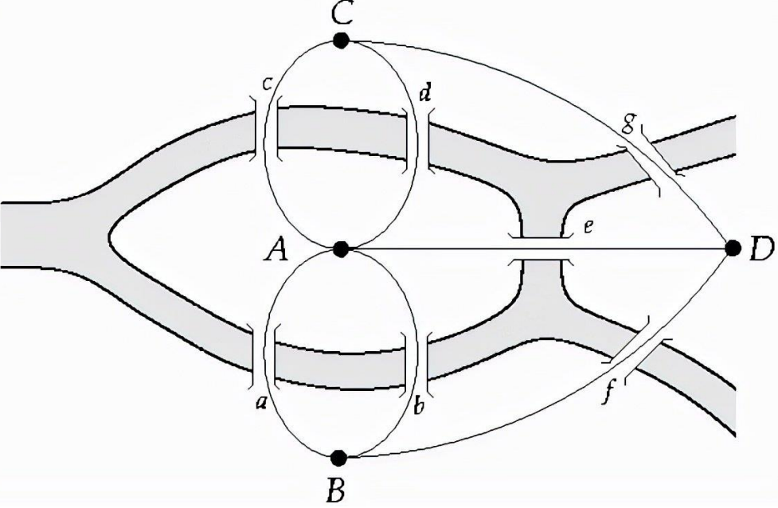

例如，文档中展示了“双菱形”图结构，对应程序中的if-then-else序列，练习要求形式化图并找出所有测试路径。可达性分析帮助识别可行测试路径，避免语义不可行的影响。

### 二、控制流图

控制流图（CFG）是程序控制流的图形化表示，用于静态分析和测试。定义上，CFG =(V,E,v↓,v↑)将每个语句映射为顶点，边表示语句间的顺序依赖。CFG生成包括语法分析、语义分析、中间代码生成、CFG构建和优化步骤。基本结构包括顺序、分支和循环，例如max函数的CFG将if-else语句映射为分支顶点。

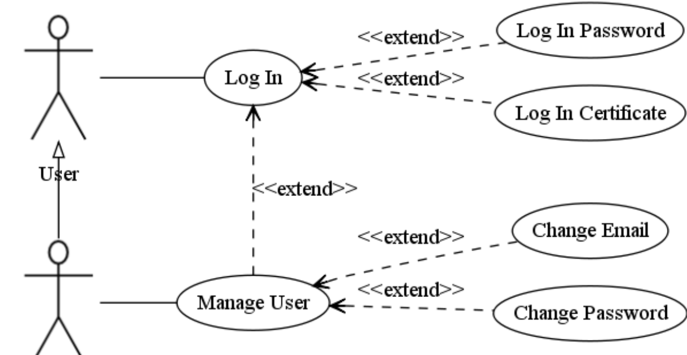

CFG支持程序优化，如冗余代码消除和代码外提。文档提供了Triangle、NextDay和MeanVar程序的CFG生成练习，强调CFG在测试中的作用，如识别死代码和循环优化。

### 三、数据流图

数据流图（DFG）关注程序中数据的流动，顶点代表操作或谓词，边代表数据从生产者到消费者的通道。DFG常与控制流图结合为CDFG，使用决策节点和数据流节点。关键概念包括变量定义（def）和引用（use），例如在顺序、分支和循环结构中，DFG需转换为单赋值形式以确保清晰性。

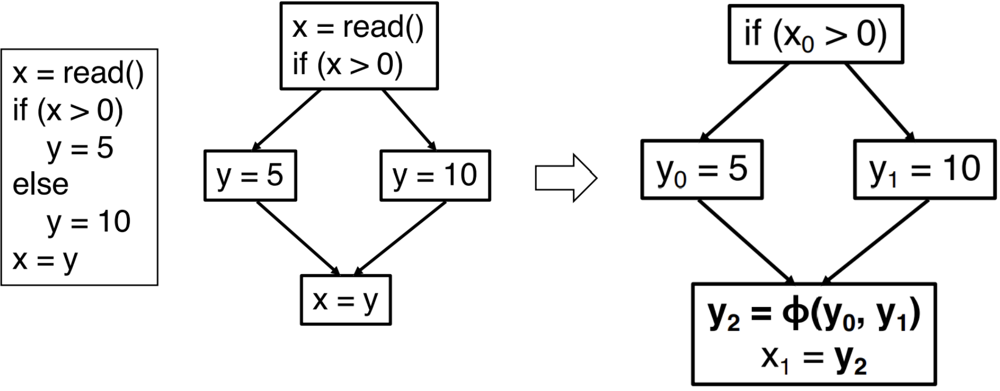

文档以Triangle程序为例，说明数据流分析步骤：定义和使用分析、绘制DFG并标记数据流信息。DFG有助于检测数据相关缺陷，如未初始化变量。

### 四、事件流图

事件流图（EFG）用于GUI测试，表示事件、状态和转换。定义上，EFG =(V,E,B,I)，其中 V是事件集合，E是边集合（表示事件间顺序），B是初始事件集合，I是受限焦点事件集合。事件序列 e1∘e2∘…∘en在状态 S0可执行，但EFG简化状态记录。

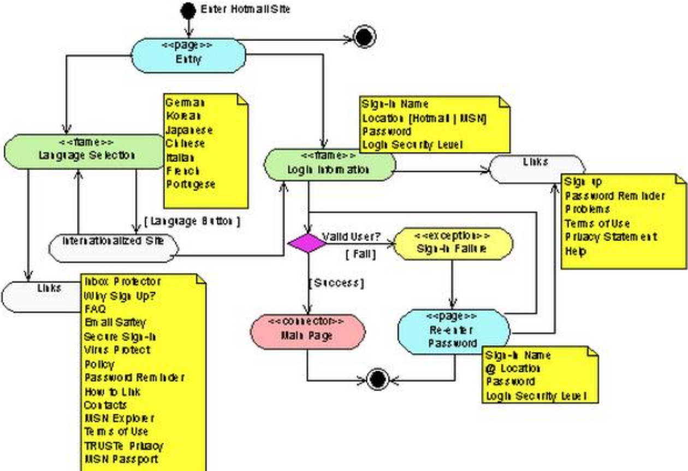

EFG生成涉及识别GUI事件和依赖关系，但GUI测试面临动态性和自动化挑战。文档以项目管理系统为例，展示EFG并检查错漏，强调事件序列的可行性。

### 五、图结构测试方法

图结构测试方法通过覆盖图的顶点、边或路径来设计测试用例。常用覆盖准则包括：

- 

  **顶点覆盖（VC）**：要求覆盖所有可达顶点。

- 

  **边覆盖（EC）**：要求覆盖所有可达边。

- 

  **边对覆盖（EPC）**：要求覆盖所有可达边对（即连续边序列）。

- 

  **完全路径覆盖（CPC）**：要求覆盖所有可达路径，但循环结构可能导致无穷路径，故常简化。

这些准则存在蕴含关系，例如EC比VC更强，但测试成本更高。文档通过“双菱形”图练习说明覆盖所有边或点所需的最小路径数，并讨论语义不可行性的影响。

### 六、主路径测试

主路径测试针对循环结构，选择简单路径（无重复顶点的路径）作为测试基础。主路径是极大化简单路径，即无法再扩展的路径。主路径覆盖准则要求测试集覆盖所有主路径，以代表程序执行路径。

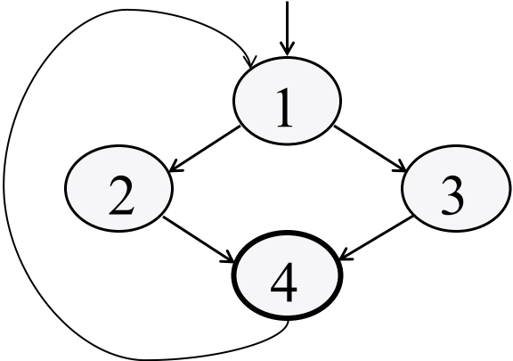

文档提供计算示例，如生成主路径集并构造测试集，强调自动化生成和语义可行性的重要性。

### 七、基路径测试

基路径测试由McCabe提出，基于圈复杂度（CC）选择线性独立路径作为测试基。圈复杂度计算公式为 CC(G)=e−n+2，其中 e是边数，n是顶点数。基本路径集合是路径向量空间的基，路径向量将路径映射为边出现次数的向量。

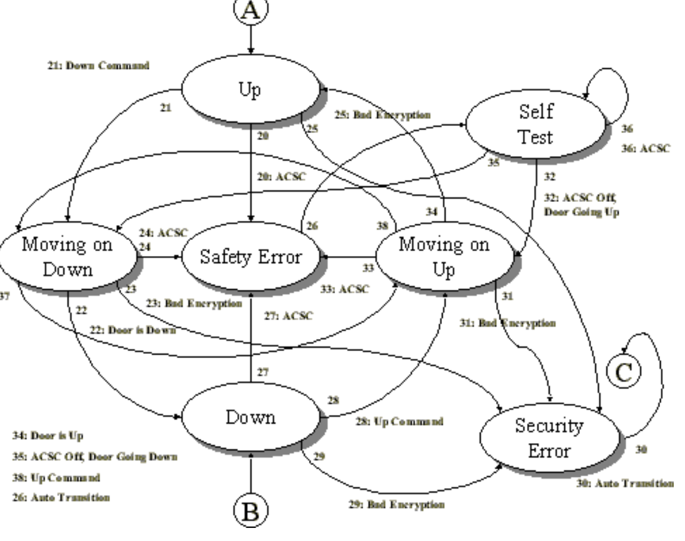

文档以示例程序展示基本路径生成和测试数据设计，但部分路径可能语义不可行。基路径测试平衡测试强度与成本，适用于复杂程序。

### 八、图元素测试

图元素测试泛指对图中顶点、边等元素的测试方法，与图结构测试方法重叠。它强调通过覆盖准则（如VC、EC）验证单个元素的可达性。例如，顶点覆盖确保每个状态被测试，边覆盖确保每个转换被验证。文档在L-路径测试部分讨论了这些准则的比较和语义影响。

### 九、数据流测试

数据流测试专注于变量的定义（def）和引用（use），检测定义-引用异常。关键概念包括：

- 

  **定义清晰路径**：变量从定义点到引用点无再次定义的路径。

- 

  **DU路径**：变量定义清晰路径的集合。

  覆盖准则包括：

- 

  **All-defs覆盖（ADC）**：覆盖每个变量的至少一条DU路径。

- 

  **All-uses覆盖（AUC）**：覆盖每个定义-引用对的至少一条路径。

- 

  **All-du-path覆盖（ADUPC）**：覆盖所有DU路径。

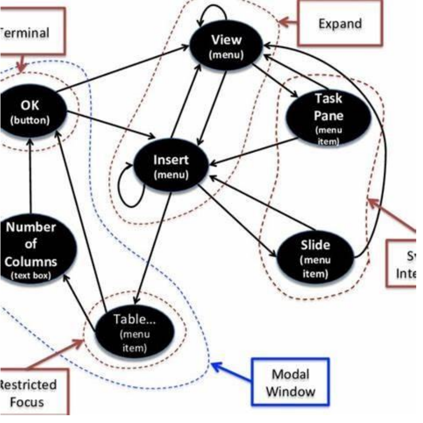

文档以MeanVar程序为例，列出DU路径表示例，强调数据流测试在发现数据依赖缺陷中的作用。

### 十、逻辑测试（谓词覆盖/分支覆盖）

逻辑测试关注程序中的逻辑表达式覆盖，常用术语包括：

- 

  **谓词（判定）**：返回真假的表达式，如分支条件。

- 

  **子句（条件）**：不包含逻辑运算符的原子谓词。

  覆盖准则包括：

- 

  **谓词覆盖/判定覆盖（DC）**：每个判定取真和假各至少一次。

- 

  **子句覆盖/条件覆盖（CC）**：每个子句取真和假各至少一次。

- 

  **条件/判定覆盖（C/DC）**：结合CC和DC。

- 

  **修正条件/判定覆盖（MC/DC）**：每个条件独立影响判定结果，用于安全关键系统（如航空软件）。


文档以TCAS II规范为例，展示复杂逻辑表达式的MC/DC测试生成练习，强调测试强度与成本的平衡。

### 总结

图分析测试通过将软件转换为图模型，应用覆盖准则来确保测试充分性。方法包括结构测试（如路径覆盖）、数据流测试和逻辑测试，每种方法针对不同测试目标。实践中需考虑语义可行性和自动化挑战，未来可结合人工智能优化测试生成。以上内容均基于文档，确保了准确性和完整性。


---


# 开发者测试

### 单元测试

#### 基本概念

单元测试是软件开发中的一种基础测试技术，针对应用程序代码被分解为的单个组件（如方法、类或模块）进行测试。其目的是验证每个单元的相关数据、使用过程和功能是否按预期工作。单元测试通常由开发者执行，是软件测试生命周期中的最早阶段，确保代码具备正确性、清晰性、规范性和高效性。例如，在一个计算器程序中，单元测试会验证`Add`方法是否能正确返回两个数字的和。

#### 测试粒度

单元测试的粒度非常细，专注于测试最小的代码单元（如单个函数或方法）。它不涉及模块间的交互或外部依赖，而是通过隔离代码单元来独立验证其行为。测试粒度细致到可以检查每个输入输出的正确性，甚至边界条件（如最小值、最大值）。

#### 测试优势

- 

  **早期发现问题**：在开发周期早期进行，降低缺陷修复成本，因为早期修复成本远低于后期。

- 

  **提高代码质量**：通过验证每个单元的功能，确保代码健壮性和可靠性。

- 

  **作为代码审查**：提供额外视角，帮助开发者从用户角度审视代码，发现潜在问题。

- 

  **支持自动化**：易于集成到持续集成（CI）流程中，提高测试效率。

- 

  **简化调试**：由于测试粒度细，错误定位更快速和准确。

### 单元测试的3A原则

#### 基本概念

3A原则是单元测试编写的规范框架，将测试过程分为三个清晰步骤：

- 

  **Arrange（准备）**：设置测试环境，初始化对象、模拟依赖项和准备输入数据。

- 

  **Act（执行）**：调用被测试的方法或功能，执行实际操作。

- 

  **Assert（断言）**：验证执行结果是否符合预期，例如使用断言语句检查返回值。

例如，在测试计算器的`Add`方法时，先准备输入值（如12和11），然后执行加法操作，最后断言结果是否为23。

#### 测试粒度

3A原则本身不改变测试粒度，但通过结构化测试代码，使测试更聚焦于单个功能或行为。每个测试方法通常只测试一个特定场景，确保粒度细致且可维护。

#### 测试优势

- 

  **提升可读性和可维护性**：清晰的步骤划分使测试代码易于理解和修改。

- 

  **突出依赖项和调用方式**：帮助识别测试中的关键元素，减少复杂性。

- 

  **增强测试可靠性**：通过标准化步骤，减少人为错误，提高测试准确性。

### 接口测试

#### 基本概念

接口测试是针对软件系统中接口（如API）的测试，验证接口是否能按照预期进行通信、数据交换和功能实现。它通常在消息层进行，作为集成测试的一部分，关注接口的功能、可靠性、性能和安全性的期望。例如，测试一个天气查询API，验证其是否能正确接收城市名称并返回天气信息。

#### 测试粒度

接口测试的粒度中等，侧重于接口之间的交互和数据流，而不是单个代码单元。它测试接口的输入输出、错误处理、安全性和性能指标，覆盖多个模块或系统的边界。

#### 测试优势

- 

  **敏捷开发支持**：提供即时反馈，帮助快速迭代代码。

- 

  **保障软件质量**：通过早期发现接口缺陷，确保系统稳定性和可靠性。

- 

  **适应现代架构**：特别适用于微服务架构和API驱动的系统。

- 

  **高效回归测试**：自动化接口测试便于在代码变更后快速验证功能。

### 集成测试

#### 基本概念

集成测试是单元测试的延伸，旨在验证软件组件集成后的协同工作能力。它检测组件间接口问题、数据一致性、并发问题等系统级缺陷，确保整个系统功能性和性能符合需求。集成测试通常在单元测试之后进行，例如通过一次性集成或增量式集成策略组装模块。

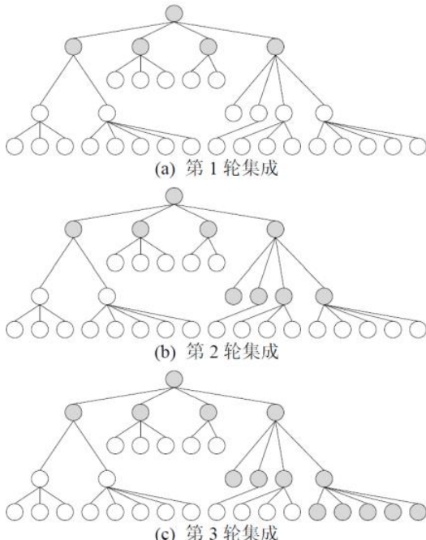

#### 测试粒度

集成测试的粒度较粗，关注多个模块或组件的交互。测试范围从少量模块的集成（如自顶向下集成）到整个系统的集成，粒度取决于策略（如增量式集成可逐步扩展）。

#### 测试优势

- 

  **检测接口缺陷**：早期发现模块间数据丢失、规格不一致或并发问题。

- 

  **确保系统协作**：验证组件集成后的整体功能，减少系统级故障。

- 

  **支持复杂系统**：通过策略如三明治集成，减少测试桩模块需求，提高效率。

- 

  **降低风险**：在软件生命周期早期暴露集成问题，避免后期高昂修复成本。

### 多样性开发者测试

#### 基本概念

多样性测试（也称为变异测试或代码覆盖测试）是一种评估测试集质量的方法。它通过修改源代码生成变异体（模拟缺陷），然后运行测试集来检测是否能识别这些变异体。多样性测试强调代码覆盖，如语句覆盖、分支覆盖等，通过路径分析和约束求解提高测试全面性。

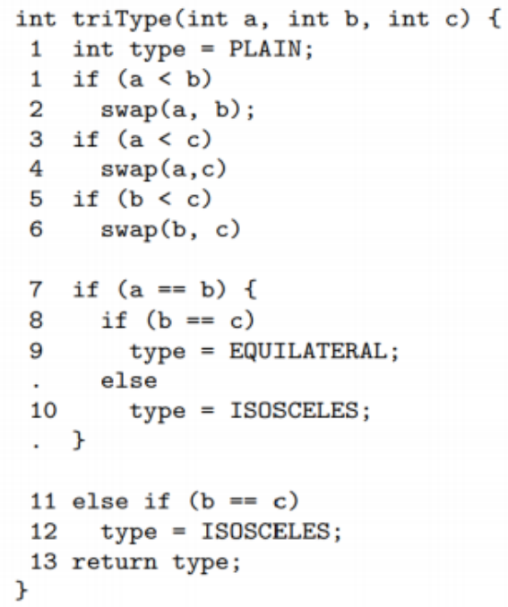

#### 测试粒度

多样性测试的粒度非常细，专注于代码逻辑结构、执行路径和条件覆盖。它涉及符号执行和约束求解，以生成测试数据覆盖特定路径，确保高代码覆盖率。

#### 测试优势

- 

  **提高测试覆盖率**：通过路径分析，发现潜在缺陷和漏洞。

- 

  **优化测试集**：评估测试有效性，识别不足并优化测试数据。

- 

  **早期缺陷检测**：结合白盒工具（如EvoSuite），在开发阶段提高代码质量。

- 

  **支持复杂逻辑**：适用于路径选择和多约束条件，提升测试精准性。

### 故障假设开发者测试

#### 基本概念

故障假设测试是开发者根据应用程序特点提出可能故障（如程序崩溃或逻辑错误），并设计测试验证这些假设的方法。它结合路径分析、边界值分析等，模拟潜在故障场景，以提高测试的全面性。例如，通过白盒边界值分析生成测试用例，覆盖路径条件的边界情况。

#### 测试粒度

故障假设测试的粒度细，关注代码级别的边界条件、路径谓词和变异体。测试往往针对特定输入或执行路径，确保细致覆盖。

#### 测试优势

- 

  **主动识别漏洞**：通过假设故障，提前发现隐藏问题。

- 

  **提升测试效率**：结合工具（如PITest）优化测试生成，减少组合爆炸。

- 

  **增强代码鲁棒性**：验证程序在异常情况下的行为，提高可靠性。

- 

  **支持复杂系统**：适用于面向对象程序，覆盖继承、多态等特性。

### 变异测试

#### 基本概念

变异测试是故障假设测试的一种具体形式，通过应用变异算子（如改变运算符、方法调用或继承关系）对源代码进行微小修改，生成变异体。测试集运行在这些变异体上，如果测试能检测到变异体与原始程序的差异，则说明测试集有效。例如，将条件运算符“<”替换为“<=”，验证测试是否失败。

#### 测试粒度

变异测试的粒度极细，针对代码语句或表达式级别。它模拟常见编程错误，确保测试覆盖代码的细微变化。

#### 测试优势

- 

  **暴露测试不足**：直接评估测试集缺陷检测能力，优化测试数据。

- 

  **提高测试覆盖率**：通过主动引入变异体，确保测试全面性。

- 

  **支持自动化**：工具如PITest集成到开发环境，提升效率。

- 

  **降低风险**：在企业级代码库中，帮助识别非生产性变异体，提高测试实用性。

总结来说，这些测试方法覆盖了从代码单元到系统集成的不同粒度，各具优势：单元测试确保基础代码质量，接口测试验证交互，集成测试关注组件协作，而多样性测试和故障假设测试通过高级技术提升测试深度和覆盖率。结合自动化和早期测试，它们共同保障软件可靠性和可维护性。

# 功能测试

功能测试是软件测试的核心组成部分，旨在验证软件系统是否按预期功能正确工作。以下是基于文档内容的详细总结，覆盖功能测试的基本概念、流程、多样性方法及故障假设测试。

## 一、功能测试基本概念

功能测试是一种黑盒测试方法，关注软件功能的正确性，而非内部实现细节。其核心目标是：

- 

  **验证功能正确性**：确保每个功能满足用户需求，如购物车添加商品、结账流程等。

- 

  **覆盖功能需求**：通过测试用例确保所有需求被验证，使用功能需求点覆盖率评估完整性。

- 

  **保障系统稳定性**：通过持续测试，确保系统在复杂流程中无错误。

功能测试与非功能测试相辅相成，但存在差异：功能测试关注“软件是否能执行预期功能”，而非功能测试关注“软件如何执行功能”（如性能、安全性）。

## 二、功能测试基本流程

功能测试遵循系统化流程，确保测试的全面性和效率：

1. 

   **确定功能需求**：明确需要测试的软件功能，例如超市管理系统的“添加用户”功能。

2. 

   **设计测试用例**：基于需求设计测试场景和步骤，考虑正常、异常和边界情况。例如：

   - 

     正常用例：输入合法用户名、密码，验证添加成功。

   - 

     异常用例：输入非法用户名或重复密码，验证系统容错。

3. 

   **执行测试与验证**：执行测试用例，观察系统行为是否符合预期，并记录结果。示例中，购物车测试需验证添加商品后数量更新，结账流程需重定向到确认页面。

最佳实践包括优先级测试、可重用测试、拥抱自动化和详细记录。

## 三、多样性功能测试

多样性功能测试通过系统化方法提高测试覆盖度，主要包括等价类划分、因果图分析和类别划分。

### 1. 等价类划分

等价类划分将输入域划分为有效和无效子集，同一子集的数据对功能实现等效。基本原则：

- 

  **完备性**：等价类的并集覆盖整个输入域。

- 

  **无冗余**：等价类之间互不相交。

**示例：三角形程序测试**

- 

  有效等价类：a+b>c（普通三角形）、a=b（等腰三角形）、a=b=c（等边三角形）。

- 

  无效等价类：a+b≤c（无效三角形）、a为null或非数字。

  通过设计测试用例（如输入[2,3,4]输出“普通三角形”），确保所有划分被覆盖。

### 2. 因果图分析

因果图通过分析输入（原因）与输出（效果）的逻辑关系，生成高效测试集。逻辑关系类型包括：

- 

  **恒等关系（EQ）**：原因A为真则效果B为真。

- 

  **逻辑非（NOT）**：原因A为真则效果B为假。

- 

  **逻辑或（OR）**：原因A或B为真则效果C为真。

- 

  **逻辑与（AND）**：原因A和B均为真则效果C为真。

**示例：三角形程序因果图**

通过构建决策表（表7.5）和测试用例（表7.6），系统化验证输入组合的输出，如输入[4,1,2]输出“无效三角形”。

### 3. 类别划分（Category-Partition, CP）

类别划分法将参数和环境变量划分为类别，并为每个类别生成选项，组合成测试框架。步骤包括：

- 

  识别参数和变量。

- 

  定义类别（如就业状态、月薪）。

- 

  生成选项（如就业状态选项为“就业”或“失业”）。

- 

  组合选项生成测试框架。

**示例：商业银行贷款程序**

类别包括就业状态、就业类型、月薪等，选项组合成测试框（如框1：就业+自雇+永久+月薪>2000+持卡人+金卡），确保测试用例覆盖有效和无效输入。

**关键定义**：

- 

  测试框完整性：当从每个选项中选择元素能形成独立输入时，测试框完整。

- 

  选项关系：包括完全嵌入、部分嵌入和不嵌入，通过定理7.1推理性质管理测试用例。

## 四、故障假设功能测试

故障假设功能测试通过模拟故障场景评估系统可靠性和容错能力，包括三个关键步骤：

### 1. 测试规划与分析

分析系统可能故障点，如用户界面交互或组件连接。重点关注系统级变异，与单元测试相比，系统测试粒度更大，覆盖所有元素交互。

### 2. 测试实施方法

实施变异测试，引入错误状态验证系统行为。文档中展示了不同测试水平的变异差异：

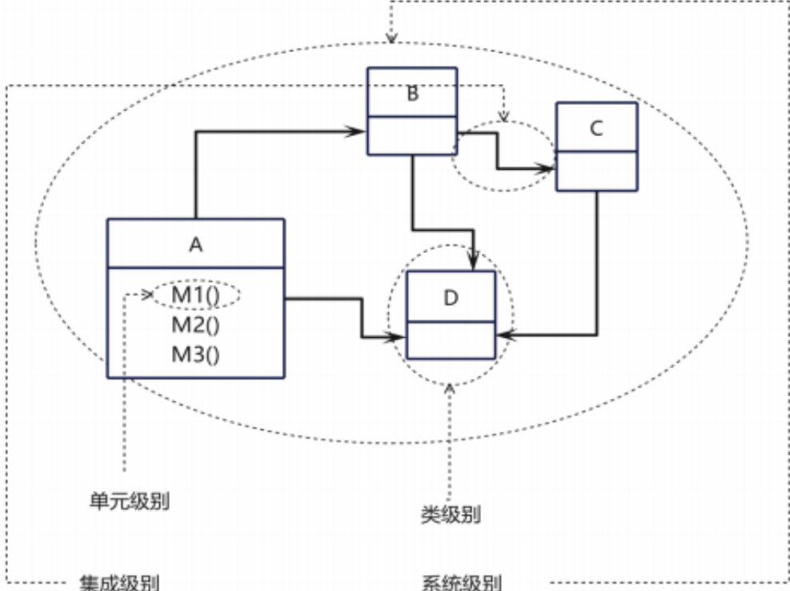

- 

  单元级别：变异单个方法，成本低但范围有限。

- 

  系统级别：变异整个系统，检测所有交互，但执行复杂（需加载整体系统）。

  **解决痛点**：通过更换整个系统或部分组件优化执行。

  **新变异算子**：包括调用相关（如CMCR、MOR）和界面相关算子（如GCPI、GCD），模拟常见故障。

### 3. 测试评估与改进

评估变异测试效果，关注“变异屏蔽”问题（错误状态被掩盖）。文档通过示例说明强变异和弱变异的局限性：

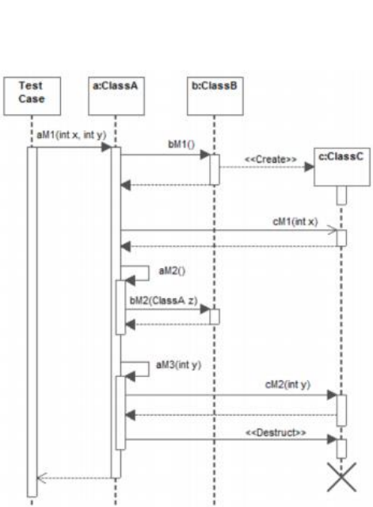

- 

  强变异：需异常状态传播到输出，检测全面但成本高。

- 

  弱变异：仅比较中间状态，可能漏检（如异常状态未影响其他对象）。

  **弹性弱变异**：结合强弱优点，动态停止执行，通过多次检查和跨对象比较提高检测效率。

## 总结

功能测试是保障软件质量的基础，通过系统化流程和多样性方法（如等价类划分、因果图分析、类别划分）确保功能正确性。故障假设测试进一步强化可靠性，通过变异测试验证系统容错能力。实践中，需结合自动化工具（如Selenium）和最佳实践，实现高效测试覆盖。文档中的示例（如三角形程序、贷款程序）生动展示了这些方法的实际应用，为测试人员提供了完整指导。


---


# 性能测试

## 一、基本概念

性能测试是一种评估软件或系统在实际运行环境中表现的测试方法。**核心目标**是通过模拟真实用户行为，评估系统在响应时间、吞吐量和资源利用率等关键指标的表现，确保其满足预定的性能需求。

**性能测试的本质**是利用负载模拟和压力测试，分析系统在不同负载下的表现，发现并解决性能瓶颈，优化资源使用效率，保障系统高效运行。

在软件生命周期中，性能测试贯穿各个阶段：

- 

  **需求分析阶段**：明确性能需求（如响应时间、并发用户数、吞吐量）

- 

  **设计阶段**：评估系统架构性能，设计非功能需求（如缓存策略）

- 

  **开发阶段**：实施单元性能测试和代码级优化

- 

  **测试阶段**：包括单元测试、集成测试和系统级测试

## 二、常见测试类型

### 1. 并发测试

**定义**：模拟多用户同时操作，评估系统在高并发下的稳定性和响应能力

**特点**：

- 

  关注多请求处理能力

- 

  旨在发现并发引起的问题（如资源竞争、死锁）

- 

  适用于用户密集型场景，如电商促销

### 2. 负载测试

**定义**：在正常负载下逐步施压，评估系统性能极限

**特点**：

- 

  评估长时间高负载下的稳定性

- 

  帮助了解系统容量并支持性能调优

- 

  关注系统的持续处理能力

### 3. 压力测试

**定义**：模拟超预期负载，测试系统在极端条件下的崩溃点和恢复能力

**特点**：

- 

  测试系统极限性能

- 

  找出最大承载能力

- 

  验证系统的故障恢复机制

**三种测试的关系**：它们可以组合使用，形成完整的性能评估体系。例如并发测试与负载测试结合模拟电商促销场景，负载测试与压力测试结合评估系统最大承载能力。

## 三、多样性性能测试

多样性性能测试是通过模拟多种不同的情境和条件，全面评估系统在各种环境下的性能表现。

### 负载多样性

测试系统在不同负载情况下的表现：

- 

  正常负载：系统日常运行状态

- 

  峰值负载：业务高峰期的负载水平

- 

  过载：超出系统处理能力的负载条件

### 网络条件多样性

评估系统在不同网络环境下的表现：

- 

  网络延迟测试

- 

  带宽限制测试

- 

  不稳定连接测试（针对移动应用特别重要）

### 软硬件配置多样性

测试系统在不同配置环境下的兼容性：

- 

  操作系统差异（Windows、Linux、macOS等）

- 

  数据库配置差异

- 

  服务器硬件配置差异

- 

  中间件参数配置

**关键技术指标**包括业务指标（并发用户数、平均响应时间、TPS等）和资源指标（CPU使用率、内存利用率等），这些指标为多样性测试提供量化评估依据。

## 四、故障假设功能测试

故障假设测试是一种重要的质量保障方法，其**核心价值**体现在：

### 测试规划与分析

- 

  基于系统架构和历史故障数据预见潜在问题

- 

  制定有针对性的测试计划

- 

  优化测试资源分配，集中测试高风险区域

### 测试实施方法

**性能变异测试**：通过引入变异算子创建包含性能缺陷的程序版本，验证测试集的有效性。基于两个经典假设：

1. 

   变异体假设：变异体应包含可检测的性能缺陷

2. 

   测试有效性假设：测试应能有效检测这些缺陷

### 测试评估与改进

通过**性能变异评分**（被杀死的变异体与非等价变异体的比率）评估测试质量，持续优化测试集。

## 五、故障变异算子

故障变异算子是性能变异测试的核心工具，主要包括七类算子：

### 1. RCL（循环扰动）

- 

  **类型**：循环扰动

- 

  **性能因素**：执行时间

- 

  **作用**：修改循环条件增加不必要的评估

### 2. URV（方法调用）

- 

  **类型**：方法调用

- 

  **性能因素**：执行时间

- 

  **作用**：删除缓存变量强制重复计算

### 3. MSL（对象生成）

- 

  **类型**：对象生成

- 

  **性能因素**：内存消耗

- 

  **作用**：在循环内生成临时对象增加内存使用

### 4. SOC（条件修改）

- 

  **类型**：条件修改

- 

  **性能因素**：执行时间

- 

  **作用**：交换逻辑条件顺序强制评估耗时操作

### 5. HWO（方法调用）

- 

  **类型**：方法调用

- 

  **性能因素**：执行时间

- 

  **作用**：注入延迟模拟重量级操作

### 6. CSO（对象生成）

- 

  **类型**：对象生成

- 

  **性能因素**：内存消耗

- 

  **作用**：强制生成新对象而非重用

### 7. MSR（集合变换）

- 

  **类型**：集合变换

- 

  **性能因素**：内存消耗

- 

  **作用**：调整集合分配空间模拟内存错误

这些算子通过模拟真实的性能缺陷模式，帮助建立全面的性能测试覆盖，确保系统在各种异常条件下的稳定性和可靠性。

## 总结

性能测试是确保软件质量的关键环节，通过系统化的测试策略和方法，可以全面评估系统性能，发现潜在瓶颈，并为优化提供依据。从基本的并发、负载、压力测试，到多样性测试和故障假设测试，形成了完整的性能保障体系。


# 适配测试

以下内容基于您提供的文档，我将详细解释基本概念、信创适配测试的关注点及原则、多样性适配测试以及故障假设适配测试。回复结构将分为四个主要部分，每个部分包含关键要点和嵌入相关图片（根据文档中的图片标签），以确保内容丰富且贴合原始文档。

## 一、基本概念

**信创**（信息技术应用创新产业）是中国为实现核心技术自主可控而构建的国产化全产业链体系。它覆盖芯片、操作系统、数据库、应用软件及网络安全等领域，旨在通过替代国外技术保障信息安全。信创的推广策略以党政机关和金融、能源等关键行业为起点（“2+8+N”策略），逐步形成从硬件到软件的自主生态。思考信创的意义：在全球交流密切的背景下，信创是保障国家信息安全、推动产业自主发展的关键举措，尤其在当前信息技术竞争加剧的形势下，其必要性日益凸显。

**信创适配测试**是信创生态中的核心环节，它促使国产软件开发商与硬件厂商、操作系统供应商等密切合作，通过测试验证产品在不同国产环境下的兼容性、性能及稳定性。例如，国产数据库软件在适配国产服务器时，需与服务器厂商共同优化数据存储性能，并与操作系统供应商协作完善安全机制。适配测试的本质是确保信创产品在真实场景中无缝集成，推动软件生态发展。

## 二、信创适配测试的关注点及原则

### 关注点

信创适配测试主要聚焦于以下方面，确保产品在多元国产环境中可靠运行：

- 

  **环境适配性**：针对龙芯、飞腾等国产芯片，麒麟、统信等国产操作系统，达梦、人大金仓等国产数据库及中间件的组合，全面检测兼容性与稳定性。

- 

  **性能层面**：模拟高并发、大数据量等实际场景，开展压力与负载测试，评估响应时间、吞吐量等指标。

- 

  **功能实现**：依据需求设计测试用例，保障产品在不同地区、网络环境及设备上功能正常。

- 

  **接口兼容性**：测试不同信创产品间接口，推动协同工作，确保数据交互无误。

### 原则

适配测试环境搭建需遵循四大原则，以保障测试的准确性和安全性：

- 

  **兼容性原则**：确保国产硬件（如CPU、服务器）与软件（如操作系统、数据库）协同工作，实现良好兼容效果。

- 

  **可扩展性原则**：预留扩展空间，适应信创产业未来发展趋势及业务增长需求。

- 

  **稳定性原则**：测试环境需高度稳定，减少因环境波动导致的测试误差，保证结果可靠。

- 

  **安全性原则**：遵循国家信息安全标准，从网络防护、数据加密到权限管理，全面防止敏感信息泄露。

## 三、多样性适配测试

多样性适配测试是信创适配测试的进阶部分，旨在覆盖信创生态中硬件、软件及应用场景的多元组合，确保产品在各种环境下正常运行。其核心目标是解决国产芯片架构各异、操作系统特性不同等问题，避免因多样性导致的兼容性问题。

### 多样性维度

- 

  **硬件多样性**：涵盖飞腾、龙芯、兆芯等国产芯片，以及不同品牌和型号的计算机设备。每种芯片在架构、性能上存在差异，测试需验证软件在不同芯片下的表现。

- 

  **软件多样性**：包括麒麟、统信UOS等国产操作系统，以及数据库、中间件等底层组件。不同操作系统在功能特性和系统优化上各有特点，办公软件需适配其差异。

- 

  **行业应用多样性**：针对政务、金融等不同行业场景测试。例如，政务办公需满足公文流转需求，金融行业则强调数据准确性和交易安全。

- 

  **应用环境多样性**：覆盖不同网络环境（如4G、5G）、硬件资源（如内存大小）及用户操作习惯。

### 等价类划分方法

在多样性测试中，常用等价类划分法设计测试用例：

- 

  **硬件层面**：将兼容信创的芯片归为有效等价类（如飞腾、龙芯），不兼容的归为无效等价类，测试产品错误处理机制。

- 

  **操作系统层面**：有效等价类包括主流国产系统（如麒麟、统信），无效类涵盖版本过旧或存在漏洞的系统，验证软件在异常环境下的稳定性。

- 

  **人工智能领域扩展**：AI信创测试还涉及芯片类型（如寒武纪思元系列）、框架（如百度飞桨）及模型规模多样化，确保AI系统在国产环境下的性能。

## 四、故障假设适配测试

故障假设适配测试通过模拟潜在故障场景，检验信创产品在异常条件下的鲁棒性。其核心是预先假设硬件、软件或交互中的故障模式，制定测试策略以提升产品质量。

### 故障类型

- 

  **硬件-硬件适配故障**：如芯片与主板接口不匹配、内存兼容性问题，可能导致信号传输不稳定或设备无法识别。

- 

  **硬件-软件适配故障**：包括指令集不匹配、驱动程序问题，或硬件性能无法满足软件需求，导致运行缓慢或功能异常。

- 

  **软件-软件适配故障**：涉及系统内核与运行库不匹配、API接口不一致，或中间件与数据库兼容性问题，可能引发数据错误或功能冲突。

### 故障表现

在测试过程中，故障常表现为：

- 

  **功能故障**：如功能缺失或异常（计算错误、数据丢失）。

- 

  **性能故障**：响应迟缓、资源占用过高或吞吐量不足。

- 

  **安全故障**：漏洞被利用或权限问题，导致系统受限。

- 

  **配置与接口故障**：环境变量设置错误或数据格式不兼容，影响软件运行。

通过故障假设测试，可以提前发现并修复问题，确保信创产品在真实部署中的可靠性。

## 总结

信创适配测试是推动国产软件生态发展的关键，其核心在于通过多样性测试覆盖多元环境，并通过故障假设测试提升产品韧性。遵循兼容性、稳定性等原则，适配测试确保信创产品从芯片到应用层的无缝集成，为国家信息安全自主可控奠定基础。如果您需要进一步细化某个主题或示例，我可以提供更多细节！

# 模糊测试

模糊测试（Fuzzing）是一种自动化的软件测试技术，通过生成大量随机或半随机的输入数据来测试程序的健壮性和安全性。其核心思想是“生成一些输入，运行程序，观察会发生什么”，旨在发现程序中的潜在缺陷，如崩溃、内存泄漏或逻辑错误。以下内容基于文档，从基本概念、整体流程、设计变异算子和设计有效反馈四个方面进行详细总结。回复结构丰富，并嵌入文档中的相关图片以增强理解。

## 一、基本概念

模糊测试起源于1988年，由Barton P. Miller首次提出。他在研究UNIX工具可靠性时，通过生成随机字符作为输入，观察系统组件的崩溃情况，从而验证软件的稳健性。模糊测试的核心目标是**通过无效或异常输入覆盖边界情况，确保程序无漏洞**。其本质是一种黑盒或灰盒测试方法，强调自动化和大规模输入生成。

**关键术语**：

- 

  **模糊器（Fuzzer）**：实现模糊测试的工具，负责生成输入、执行测试和分析结果。

- 

  **模糊运动（Fuzz Campaign）**：一次完整的测试执行过程，包括配置、输入生成和结果分析。

- 

  **缺陷预言（Bug Oracle）**：判断程序执行是否违反正确性策略的组件，如检测崩溃或异常输出。

- 

  **种子输入（Seed Input）**：作为输入生成基础的初始测试数据，可以是有效或无效数据。

模糊测试与传统测试的区别在于其**强调随机性和自动化**。例如，文档通过智驾系统测试的对比说明模糊测试的优势：A公司使用理论验证（形式化方法），B公司使用正常驾驶测试（开发者测试），而C公司采用随机场景模拟（模糊测试），后者通过24小时不间断测试更易发现边缘案例缺陷。

模糊测试的发展经历了从简单随机测试到智能引导的演进。近年来，基于覆盖率的灰盒模糊测试（如AFL）成为主流，结合轻量级插装和启发式算法，提高漏洞发现效率。

## 二、整体流程

模糊测试的整体流程是一个循环过程，包含输入生成、测试执行和结果分析三个核心组件。典型流程如下：

1. 

   **初始化**：配置测试环境，包括目标程序（PUT）和初始种子输入。

2. 

   **种子选择**：从种子队列中选择一个种子，基于覆盖率或优先级策略（如AFL的遗传算法）。

3. 

   **能量分配**：为种子分配“能量”（即变异次数），重要种子获得更多资源。

4. 

   **输入变异**：对种子进行变异生成新输入，变异策略包括比特翻转、算术操作等。

5. 

   **测试执行**：运行目标程序并监控执行状态（如代码覆盖、崩溃）。

6. 

   **结果分析**：检测崩溃或异常，保留有价值的输入用于后续变异。

7. 

   **循环迭代**：重复步骤2-6，直至资源耗尽或达到目标。

这一流程在灰盒模糊测试中尤为关键。文档以灰盒模糊测试（Greybox Fuzzing）为例，展示了其算法伪代码和一般流程：

流程的优化点包括：

- 

  **种子调度**：优先选择覆盖新路径的种子（如AFLFast使用马尔可夫链模型）。

- 

  **能量调度**：动态调整变异次数，避免资源浪费。

- 

  **并行化**：支持分布式测试以提高效率（如AFL的并行模式）。

整体流程确保了测试的全面性和自动化，但效果高度依赖变异算子和反馈机制的设计。

## 三、设计变异算子

变异算子是模糊测试的核心，决定了输入生成的多样性和有效性。变异策略分为两类：

- 

  **基于变异（Mutation-based）**：通过修改现有种子生成新输入，适用于任意输入格式。

- 

  **基于生成（Generation-based）**：依据文法规则或结构信息生成输入，适用于协议或语言解析器。

### 基于变异的算子

以AFL为例，其变异算子包括：

- 

  **比特翻转（Bitflip）**：按一定步长翻转比特位，用于探测输入结构。

- 

  **算术操作（Arithmetic）**：对整数进行加减运算，触发边界值错误。

- 

  **兴趣值替换（Interest）**：用“有趣”值（如0、-1）替换字节，测试极端情况。

- 

  ** havoc**：多重随机变异，大规模破坏输入。

- 

  **拼接（Splice）**：合并两个种子，创造混合输入。

文档通过AFL的变异过程示意图展示了这些算子的应用：

### 基于生成的算子

针对结构化输入（如网络协议），生成策略更有效。例如：

- 

  **文法引导**：使用上下文无关文法生成合规输入（如Peach框架）。

- 

  **概率模型**：从历史数据学习输入分布，生成互补用例（如Inputs from Hell工作）。

### 高级变异技术

- 

  **SLF（ICSE'19）**：通过语义分析识别输入中影响程序检查的字段，针对性变异。其流程包括字节分组、类型推断和关系建立：

变异算子的设计需平衡随机性和针对性：过于随机可能产生无效输入，而过于保守则难以触发深层次缺陷。

## 四、设计有效反馈

有效反馈是模糊测试优化的关键，通过监控程序运行时状态引导测试方向。主要反馈机制包括：

- 

  **代码覆盖率**：最常用指标，如分支覆盖、路径覆盖，帮助探索新代码区域。

- 

  **运行时信息**：如内存使用、执行时间，识别性能瓶颈或资源泄漏。

- 

  **自定义预言**：针对特定漏洞（如缓冲区溢出）设计检测逻辑。

### 搜索基于反馈

将模糊测试建模为搜索问题，使用启发式算法（如遗传算法）最大化覆盖率。以AFL为例：

- 

  **反馈机制**：轻量级插装收集分支覆盖信息。

- 

  **算法**：遗传算法选择覆盖新路径的种子进行变异。

- 

  **优势**：适用性强，易扩展到新领域。

### 梯度基于反馈

将测试建模为优化问题，使用梯度下降等方法。以Neuzz为例：

- 

  **核心思想**：用神经网络平滑程序行为，使目标函数可微分。

- 

  **流程**：训练神经网络模拟程序，计算输入梯度以生成优化输入。

- 

  **争议**：文档提到Neuzz的复现争议，强调实验设置和代码正确性的重要性。

Neuzz的工作流程如图所示：

### 反馈优化挑战

- 

  **马太效应**：优质种子易产生更多有效输入，需平衡探索与利用。

- 

  **度量统一**：不同工具覆盖率度量差异可能导致对比偏差（如AFL与LLVM插装）。

- 

  **资源效率**：白盒反馈（如符号执行）准确但昂贵，灰盒折中。

通过有效反馈，模糊测试从随机探索变为定向搜索，显著提升漏洞发现效率。例如，定向灰盒模糊测试（如AFLGo）结合距离度量，针对特定代码区域（如补丁点）优化测试。

## 总结

模糊测试是一种强大的自动化测试技术，其核心在于通过变异算子和反馈机制平衡随机性与智能引导。基本概念强调了其诞生的实用主义哲学；整体流程体现了自动化循环的迭代优化；设计变异算子展示了输入生成的多样性策略；设计有效反馈突出了数据驱动优化的重要性。未来，模糊测试将更依赖机器学习（如LLM引导）和领域特定优化（如IoT、AI模型），但需注重实验可复现性和公平比较。文档中的案例（如AFL、Neuzz）揭示了技术演进中的挑战与创新，为实践提供丰富参考。

如果您需要特定工具（如AFL）的细节或最新研究（如LLM在模糊测试中的应用），我可以进一步展开。


# 优先级

### § 优先级的基本概念

测试用例优先级（Test Case Prioritization, TCP）是回归测试中的一种优化技术，旨在通过特定优先级准则（如代码覆盖、执行时间等）对测试用例进行排序，以最大化测试目标（如早期缺陷检测速率）。当测试预算不足无法执行所有用例时，TCP 可以优化执行次序，提高缺陷检测效率。

根据文档，TCP 的一般性描述为：给定测试用例集 T，其全排列集 PT，以及优先级目标函数 f，目标是找到排列 P′∈PT，使得 f(P′)≥f(P′′)对所有其他排列 P′′成立。这意味着 TCP 通过重新排列测试用例的执行顺序，来提升测试效果（如更快地发现缺陷）。

TCP 可分为两类：

- 

  **通用测试用例优先级**：为有利于后续版本测试的用例赋予更高优先级。

- 

  **特定于版本的测试用例优先级**：根据不同软件版本的特性分配优先级。

优先级排序的典型流程包括特征提取（如代码覆盖、文本特征或缺陷特征）、优先级策略应用（如贪心或相似性策略）和评估验证。文档强调，TCP 的核心是解决测试用例庞大、冗余、失效或缺失的问题，从而降低回归测试成本。

------

### § 优先级的基本算法

TCP 算法主要基于测试用例的特征（如代码覆盖信息）进行排序。文档介绍了多种策略，包括基于贪心、基于相似性、基于搜索和基于机器学习的算法。以下重点介绍您指定的贪心算法和自适应随机算法。

#### 1. 贪心算法

贪心算法是一种常用且直观的 TCP 策略，每轮优先选择覆盖最多代码单元（如语句、分支）的测试用例。文档详细描述了两种贪心变体：

- 

  **全局贪心策略**：每轮选择覆盖最多代码单元的测试用例（多个用例覆盖相同时随机选择）。

- 

  **增量贪心策略**：每轮优先选择覆盖最多**未被已选用例覆盖**的代码单元的测试用例；当所有代码单元被覆盖后，重置排序过程。

**算法步骤（以增量贪心为例）**：

1. 

   初始化已排序用例集 S为空，代码单元覆盖状态数组为 false。

2. 

   在每一轮中，计算每个待排序用例覆盖的新代码单元数量。

3. 

   选择覆盖新单元最多的用例加入 S，并更新覆盖状态。

4. 

   重复直到所有用例排序完毕。若所有单元被覆盖，则重置覆盖状态数组。

**示例**：

文档提供了一个最大公约数程序的例子，其中测试用例 t1,t2,t3的覆盖矩阵如下：

- 

  t1覆盖语句 S1、S2、S3、S10（4个单元）。

- 

  t2覆盖 S1、S3、S4、S6、S7、S9、S10（7个单元，但部分与 t1重叠）。

  通过增量贪心排序后，可能得到序列 t2,t3,t1，以更快覆盖所有代码单元。

  贪心算法的优势是简单高效，但可能因局部最优而忽略全局分布（如代码单元被多次覆盖的影响）。文档还提到贪心算法的改进版本，如考虑代码单元权重或缺陷概率（如 PIE 模型）。

#### 2. 自适应随机算法

自适应随机策略（基于相似性的 TCP）旨在让测试用例在输入域中均匀分布，以提高缺陷检测的多样性。该算法每轮选择与已选用例集差异性最大的测试用例，使用距离度量（如 Jaccard 距离）来评估相似性。

**算法步骤**：

1. 

   **距离计算**：用例 t1和 t2之间的距离基于覆盖代码单元集合的 Jaccard 系数：

   ```
   Jaccard(t1,t2)=1−∣U(t1)∪U(t2)∣∣U(t1)∩U(t2)∣
   ```

   其中 U(t)表示用例覆盖的单元集合。

2. 

   **用例与用例集距离**：使用最小、平均或最大距离度量待选用例 tc与已选集 S的距离，例如：

   ```
   D(tc,S)=ti∈Smax{Jaccard(tc,ti)}
   ```

3. 

   每轮选择 D(tc,S)最大的用例加入排序序列。

文档通过示例程序（如字符计数程序）展示了自适应随机排序如何使测试用例分布更均匀，从而更快触发不同缺陷。

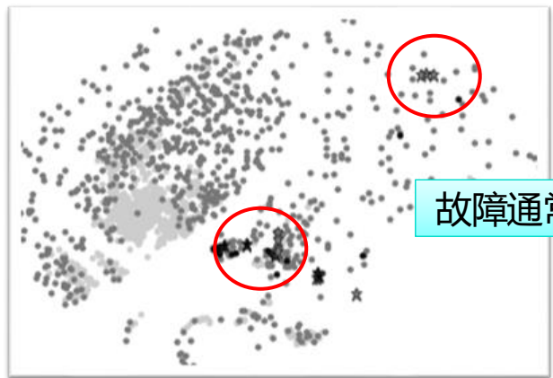

这些图片展示了失败用例在特征空间中的分布，说明了相似性策略如何通过均匀分布提高缺陷检测率。

**与贪心算法的对比**：

- 

  贪心算法关注局部覆盖最大化，可能忽略用例多样性。

- 

  自适应随机算法强调全局分布，适用于输入域广阔或覆盖信息难以获取的场景。

------

### § 优先级的评估

评估 TCP 效果的关键指标是缺陷检测速率和资源开销。文档介绍了以下主要评估准则：

1. 

   **平均故障检测百分比（APFD）**

   APFD 衡量测试用例序列检测缺陷的平均累计比例，取值范围 0~100%，值越高表示缺陷检测越快。公式为：

   ```
   APFD=1−n×mTF1+TF2+⋯+TFm+2n1
   ```

   其中 TFi是第一个检测到故障 fi的测试用例下标，n是用例数，m是故障数。

   **示例**：文档中一个包含 5 个用例和 10 个缺陷的程序，序列 A-B-C-D-E 的 APFD 为 0.5，而序列 E-D-C-B-A 的 APFD 为 0.64，表明后者更优。

2. 

   **开销感知 APFD（APFDc）**

   APFDc 考虑了测试用例的执行时间和缺陷严重程度，公式为：

   ```
   APFDc=∑j=1ntimej×∑i=1mseverityi∑i=1msei×(∑j=TFintimej−21timeTFi)
   ```

   其中 sei是缺陷严重程度，timej是用例执行时间。

3. 

   **归一化 APFD（NAPFD）**

   NAPFD 适用于实际场景中测试用例集不能检测所有缺陷或资源有限的情况，公式类似 APFD，但引入检测比例 p（已检测缺陷数与总缺陷数之比）：

   ```
   NAPFD=p−n×mTF1+⋯+TFm+2np
   ```

文档还提到，评估需结合实证研究（如 Defects4J 数据集）和实际软件演化场景，以验证 TCP 在真实环境中的有效性。

------

### 总结

测试用例优先级是回归测试的核心优化技术，通过贪心算法（强调局部覆盖）或自适应随机算法（强调全局分布）对用例排序，并以 APFD 系列指标评估效果。文档中的案例（如最大公约数程序）和图片展示了算法如何提升缺陷检测速率。未来工作可结合机器学习或多语言持续学习进一步优化 TCP。

如果您需要更详细的算法伪代码或案例数据，我可以进一步展开。