# 第 1 章 计算机网络和因特网

> 本章核心问题：
>
> 1. 因特网由什么组成？
> 2. 端系统如何接入因特网？
> 3. 数据如何在网络中传输？
> 4. 为什么网络要分层？
> 5. 如何衡量网络性能？

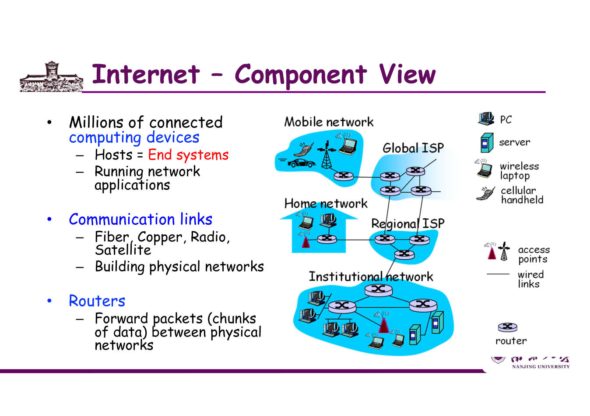

## 0. 课程与本章定位

本课程围绕计算机网络的主要层次展开：

- 计算机网络和因特网
- 应用层
- 运输层
- 网络层：数据平面
- 网络层：控制平面
- 链路层和局域网
- 无线网络和移动网络
- 计算机网络中的安全

第 1 章是全课程的入口，重点不是深入某个协议细节，而是建立网络系统的总体框架：因特网是什么、由哪些部分构成、为什么需要协议和分层、交换网络怎样共享资源，以及时延、丢包、吞吐量这些性能指标如何理解。

## 1. 网络与因特网的基本概念

### 1.1 什么是网络

网络可以抽象成：由链路将节点互连起来，使信息能够在节点之间移动的系统。

- 节点：可以是主机、服务器、路由器、交换机等。
- 链路：承载信号或比特的连接介质，如光纤、铜缆、无线电等。
- 信息：在计算机网络中通常表现为比特流、分组、报文等。

网络的种类很多，例如：

- 因特网
- 电话网络
- 无线网络
- 光网络
- 数据中心网络
- 交通网络
- 社交网络

本课程主要关注因特网。

### 1.2 因特网为什么重要

因特网正在改变很多方面：

- 商业方式：电子商务、广告、云计算。
- 人际关系：社交网络、电子邮件、即时通信、虚拟世界。
- 学习方式：Wikipedia、MOOC、搜索引擎。
- 治理和法律：电子投票、审查、版权、网络攻击。

因特网的特点之一是规模巨大。课件给出的例子包括：

- 35 亿用户。
- 1 万亿网站。
- 每天 2000 亿封电子邮件。
- 20 亿智能手机。
- 18 亿 Facebook 用户。
- 每天 40 亿 YouTube 视频观看量。
- 路由器可达到 10 Tbps 交换能力。
- 链路可达到 100 Gbps 承载能力。

因特网的另一个特点是多样性很强：

- 技术多样：光纤、无线、卫星、铜缆。
- 端设备多样：可穿戴设备、手机、数据中心、超级计算机。
- 应用多样：视频流、社交网络、文件传输、Skype、直播电视、游戏、远程医疗、即时通信。
- 用户多样：可能是恶意的、天真的、熟练的、谨慎的、偏执的。

学习因特网也等于学习如何设计复杂系统。需要不断思考：

- 系统目标和约束是什么？
- 目标之间如何排序？
- 如何分解问题？
- 谁负责什么功能？
- 组件之间的接口是什么？
- 不同设计方案之间有哪些权衡？

### 1.3 什么是因特网

因特网可以从三个角度理解。

#### 组件视角

因特网是大量计算设备互联形成的系统。

- 主机，也叫端系统，运行网络应用程序。
- 通信链路用于连接设备，介质包括光纤、铜缆、无线电、卫星链路等。
- 路由器在不同物理网络之间转发分组。
- 分组是数据被切分后的较小数据块。


#### 服务视角

因特网是为分布式应用提供通信服务的基础设施。

典型应用包括：

- Web
- VoIP
- 电子邮件
- 在线游戏
- 电子商务
- 文件共享

因特网向应用提供的通信服务可以有不同性质：

- 可靠数据传输：尽量保证源到目的地的数据正确到达。
- 尽力而为服务：不保证一定可靠，可能丢包、乱序或延迟变化。
- 对时延和吞吐量有保证的服务：这是理想化或特定网络中可能提供的服务，公共因特网默认通常不是强保证。

#### 协议视角

因特网中的所有通信活动都由协议控制。

- 网络协议规定消息的格式、发送与接收顺序，以及收到消息或发生事件后的动作。
- 常见协议包括 HTTP、TCP、IP、PPP、Ethernet 等。
- 因特网标准主要由 IETF 制定。
- RFC 是 Request for Comments，许多因特网标准以 RFC 文档形式发布。
- 因特网是 network of networks，即网络的网络。
- 公共 Internet 与私有 Intranet 都可以使用相似的网络协议体系。
- 因特网整体结构是松散层次化的。

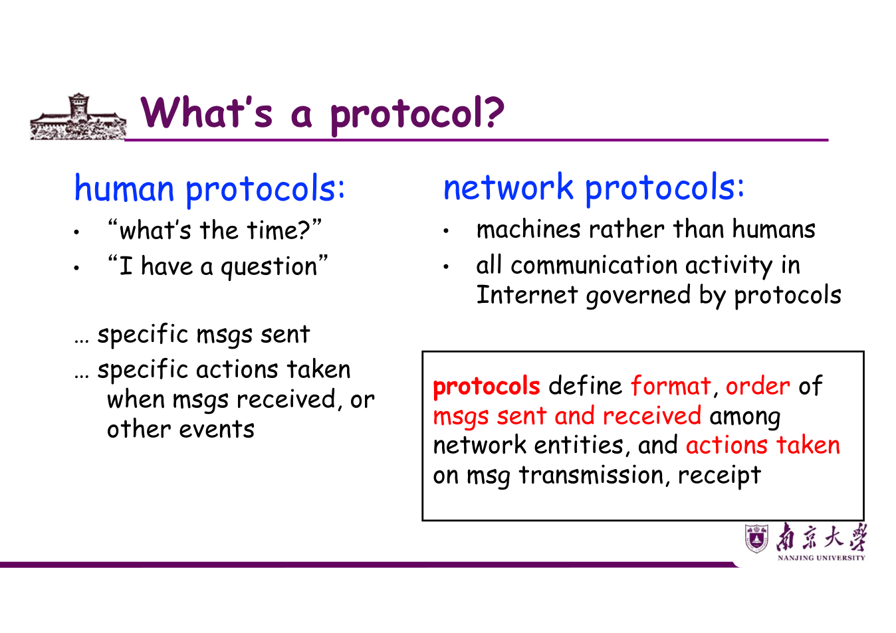

### 1.4 什么是协议

协议并不只存在于计算机中。人类交流也有协议。

例如：

- A 说：“现在几点？”
- B 回答：“2:00。”

这背后隐含了消息格式、顺序和动作。

网络协议类似，只是通信主体从人变成了机器。协议定义：

- 通信实体之间发送和接收的消息格式。
- 消息发送和接收的先后顺序。
- 发送、接收消息或发生其他事件时应该采取的动作。

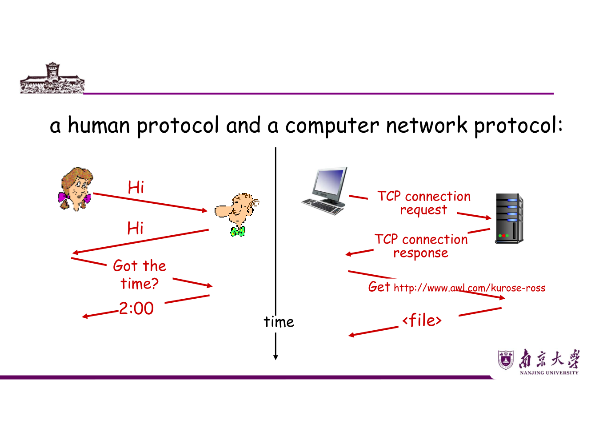

### 1.5 通信可靠性：两军问题

课件用“蓝军 A、蓝军 B 与白军作战”的例子说明通信可靠性的根本限制。

场景：

- 蓝军 A 和蓝军 B 分别在东西两个山顶。
- 单独一支蓝军打不过白军。
- A、B 同时进攻可以获胜。
- A 和 B 可以派通信兵传递消息，但通信兵可能被截获。

问题：有没有协议能保证两支蓝军 100% 同时进攻并胜利？

结论：没有办法保证 100% 成功。

原因是确认消息本身也需要确认，于是会出现无限确认链：

- A：明日正午进攻，如何？
- B：同意。
- A：收到“同意”。
- B：收到“收到同意”。
- 继续确认下去仍然无法完全消除最后一条消息丢失的不确定性。

这个例子说明：在不可靠通信信道上，完全确定的可靠协同有时无法实现。网络协议只能在特定假设下提高可靠性，而不是魔法般消除所有不确定性。

## 2. 因特网的组成：边缘、接入网络、核心

因特网可以分成三部分：

- 网络边缘：应用程序和主机所在的位置。
- 接入网络：把端系统连接到边缘路由器的网络。
- 网络核心：由互连路由器组成的网络之网。

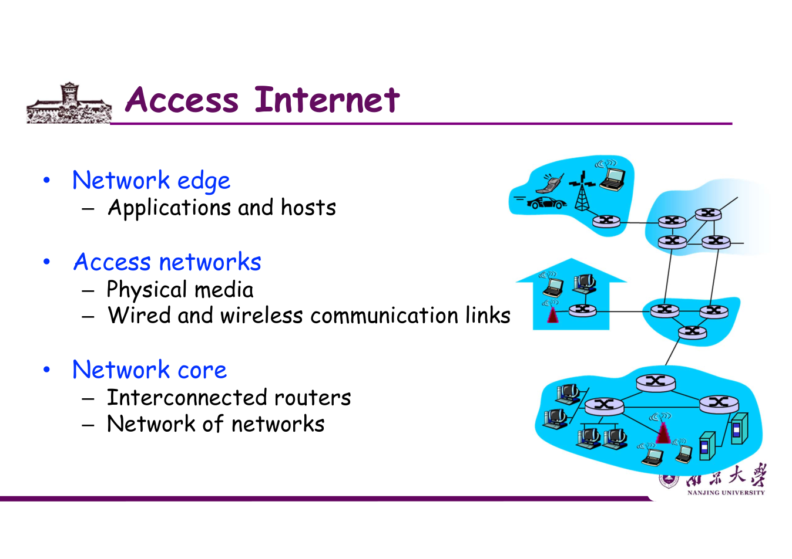

### 2.1 网络边缘

网络边缘由端系统组成，也叫主机。

端系统的特点：

- 运行应用程序，如 Web、Email 等。
- 位于网络的边缘，而不是核心转发路径中。
- 通过接入网络连接到因特网。

常见应用模型有两种。

#### 客户端/服务器模型

- 客户端主机请求服务。
- 服务器通常保持在线，等待并响应客户端请求。
- 例子：Web 浏览器和 Web 服务器、邮件客户端和邮件服务器。

#### P2P 模型

- Peer-to-peer，即对等模型。
- 对专用服务器的依赖很少，甚至没有。
- 各节点既可以请求服务，也可以提供服务。
- 例子：Skype、BitTorrent。

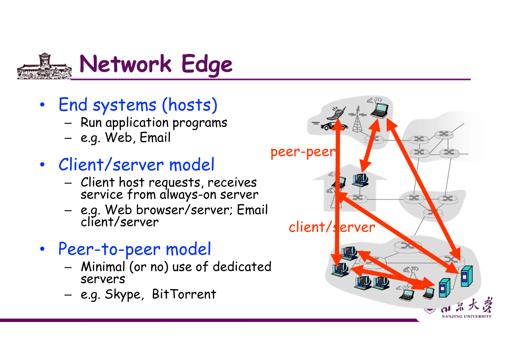

### 2.2 接入网络

接入网络解决的问题是：端系统如何连接到边缘路由器？

主要类型：

- 家庭接入网络
- 机构接入网络，如学校、公司
- 移动接入网络

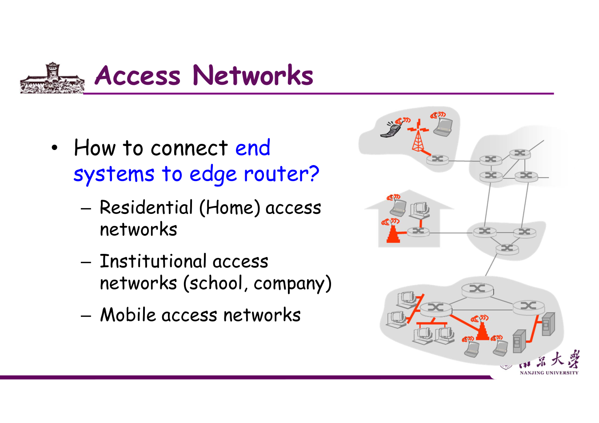

#### 家庭接入

常见方式：

- 拨号接入：通过 modem，最高约 56 Kbps。
- DSL：Digital Subscriber Line，数字用户线。
- HFC：Hybrid Fiber Coax，混合光纤同轴网络。

DSL 特点：

- 通常由电话公司部署。
- 连接到电话公司中心局。
- 上下行不对称。
- 课件示例速度：上行最高约 1 Mbps，下行最高约 8 Mbps。
- 用户到中心局通常有专用物理线路。

HFC 特点：

- 通常由有线电视公司部署。
- 使用光纤和同轴电缆混合结构。
- 家庭用户共享到 ISP 路由器的接入资源。
- 上下行不对称。
- 课件示例速度：下行最高约 30 Mbps，上行最高约 2 Mbps。

#### 机构接入：局域网

学校、公司常使用局域网连接端系统和边缘路由器。

以太网是典型技术：

- 10 Mbps
- 100 Mbps
- 1 Gbps
- 10 Gbps

现代配置通常是：端系统连接到以太网交换机，再接入更大的骨干网络。

#### 无线接入网络

无线接入通过共享无线介质把端系统连接到路由器。

两类典型无线接入：

- 无线局域网：如 802.11b/g Wi-Fi，课件示例速率为 11 Mbps 或 54 Mbps。
- 广域无线接入：由电信运营商提供，覆盖距离可达数十公里，如 3G、4G、LTE、WiMax。

### 2.3 物理介质

物理介质负责承载比特。

基本概念：

- bit：在发送方和接收方之间传播的基本信息单位。
- physical link：发送方和接收方之间的物理连接。
- guided media：导引型介质，信号在固体介质中传播，如铜缆、光纤、同轴电缆。
- unguided media：非导引型介质，信号自由传播，如无线电。

#### 双绞线

双绞线由两根绝缘铜线组成。

- Category 5：可用于 100 Mbps、1 Gbps 以太网。
- Category 6：可用于 10 Gbps。

#### 同轴电缆

同轴电缆特点：

- 两个同心铜导体。
- 支持双向通信。
- 可进行宽带传输。
- 一条电缆上可以有多个信道。

#### 光纤

光纤特点：

- 用玻璃纤维传输光脉冲，一个光脉冲可表示一个比特。
- 支持高速点到点传输，课件示例为 10 到 100 Gbps 级别。
- 误码率低。
- 中继器间距可以更远。
- 不易受电磁噪声干扰。

#### 无线电

无线电特点：

- 信号通过电磁频谱传播。
- 不需要物理线缆。
- 支持双向通信。
- 传播环境会受反射、障碍物遮挡、干扰等因素影响。

无线链路类型：

- 地面微波，课件示例可达 45 Mbps 信道。
- Wi-Fi，如 11 Mbps、54 Mbps。
- 广域蜂窝网络，如 3G 约 1 Mbps。
- 卫星链路，速率从 Kbps 到 45 Mbps 或多个小信道组合，地球同步卫星端到端时延约 270 ms。

### 2.4 家庭网络示例

现代家庭网络通常包含：

- DSL 或 cable modem
- 路由器
- 防火墙
- NAT
- 以太网交换机
- 无线接入点

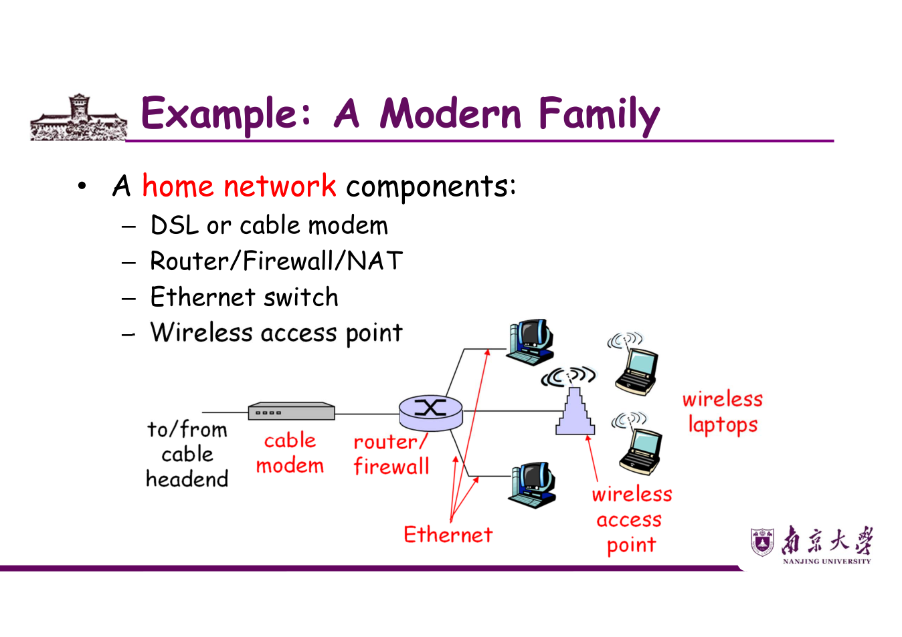

### 2.5 网络核心

网络核心是互连路由器形成的网状结构。

核心问题：数据如何通过网络传输？

主要方式：

- 电路交换：每次通信建立专用电路，电话网是典型例子。
- 分组交换：主机把应用层报文切分为分组，分组沿路径从一个路由器转发到下一个路由器，直到目的地。

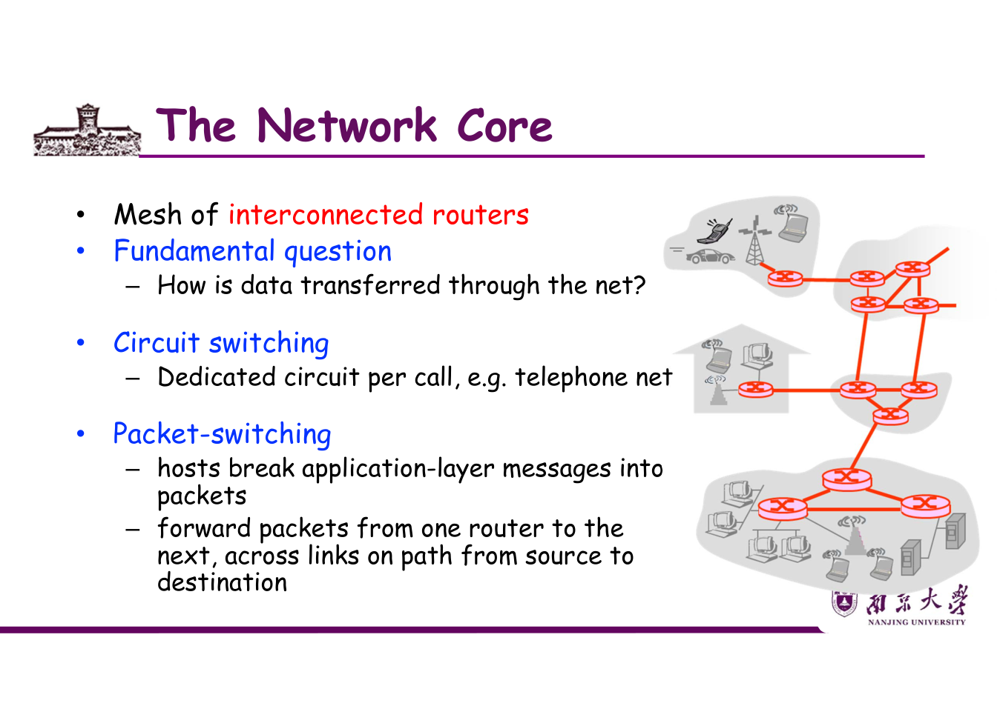

### 2.6 课堂归类题

题目：请将下列对象归类为网络边缘、接入网络、网络核心。

- A 笔记本电脑
- B 手机
- C 路由器
- D 双绞线
- E 智能家具
- F 无线路由器
- G 服务器
- H 同轴电缆
- I 交换机

答案：

- 网络边缘：A、B、E、G。
- 接入网络：D、F、H。
- 网络核心：C、I。

## 3. 交换网络与数据传输方式

当网络规模变大时，不可能让所有端系统两两直接相连。

如果 N 个节点彼此直接连接，需要约 N^2 条链路，规模不可承受。交换网络通过交换机或路由器把端系统和网络连接起来，从而支持扩展。

### 3.1 什么时候需要共享网络

网络中的交换设备和链路资源是有限的。当多个用户或多个流量同时使用同一网络资源时，就需要共享。

共享交换网络主要有三种方式：

- 电路交换
- 分组交换
- 虚电路

### 3.2 电路交换

电路交换的基本过程：

1. 源端向目的端发送资源预留请求。
2. 沿途交换设备进行接纳控制，若资源足够则建立电路。
3. 源端发送数据。
4. 通信结束后拆除电路。

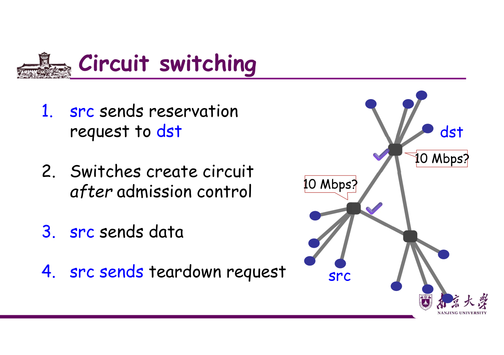

电路交换的核心特点是：每个连接预留专用资源。

优点：

- 性能可预测。
- 一旦电路建立，交换过程简单、快速。

缺点：

- 建立和拆除电路有复杂度。
- 预留资源在突发式流量下可能浪费。
- 建立电路本身会增加时延。
- 如果交换机失败，经过该交换机的电路也会失败。

### 3.3 分组交换

分组交换的核心特点：

- 每个分组都包含目的地址。
- 每个分组独立处理。
- 路由器或交换机可以缓存分组以应对短暂过载。
- 使用存储转发：分组一跳一跳前进，在交换设备中先存储或排队，再转发到下一条链路。

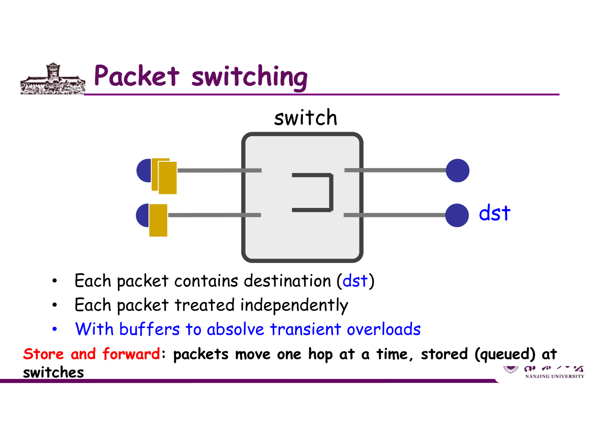

分组交换的优点：

- 网络资源利用率高。
- 实现相对简单。
- 鲁棒性好，可以绕开故障路径重新路由。

分组交换的缺点：

- 性能不可预测。
- 可能出现排队时延。
- 缓冲区满时可能丢包。
- 需要缓冲区管理和拥塞控制。

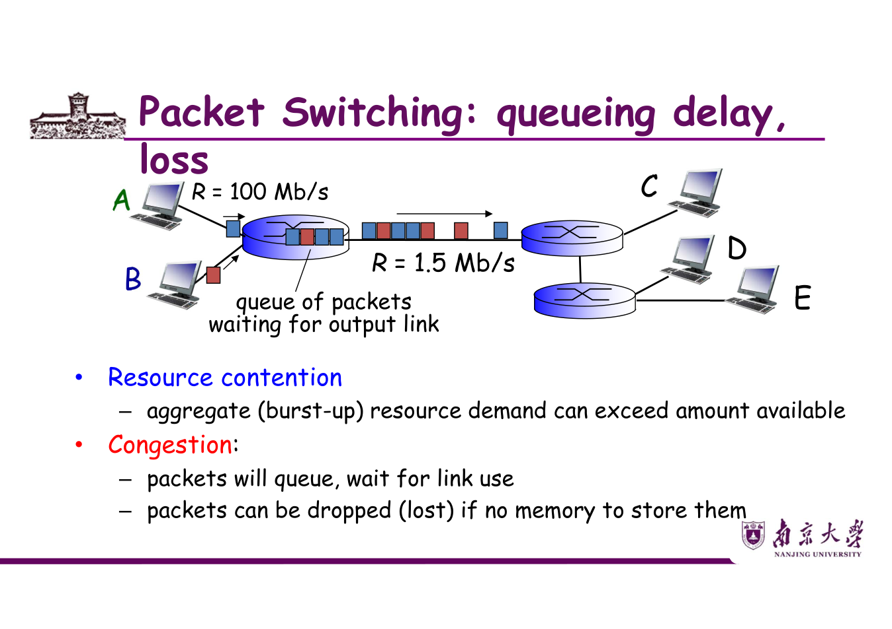

### 3.4 统计多路复用

统计多路复用指链路带宽按需共享。

思想：

- 允许接入的需求总量超过网络在同一时刻能够承载的最大量。
- 依赖“不是所有用户都会同时活跃”这一统计事实。
- 正常情况下资源利用率更高。
- 极端情况下会导致不可预测性、拥塞、排队和丢包。

课件例子：

- N 个用户共享一条 10 Mbps 链路。
- 每个用户活跃时需要 1 Mbps。
- 每个用户活跃概率为 10%，空闲概率为 90%。

如果用电路交换：

- 每个用户必须固定预留 1 Mbps。
- 最多支持 10 / 1 = 10 个用户。

如果用统计多路复用：

- 假设 N = 35。
- 同时活跃用户数大于 10 的概率小于等于 0.0004。
- 因此，在 0.9996 的概率下，每个活跃用户都可以获得超过 1 Mbps 的带宽。

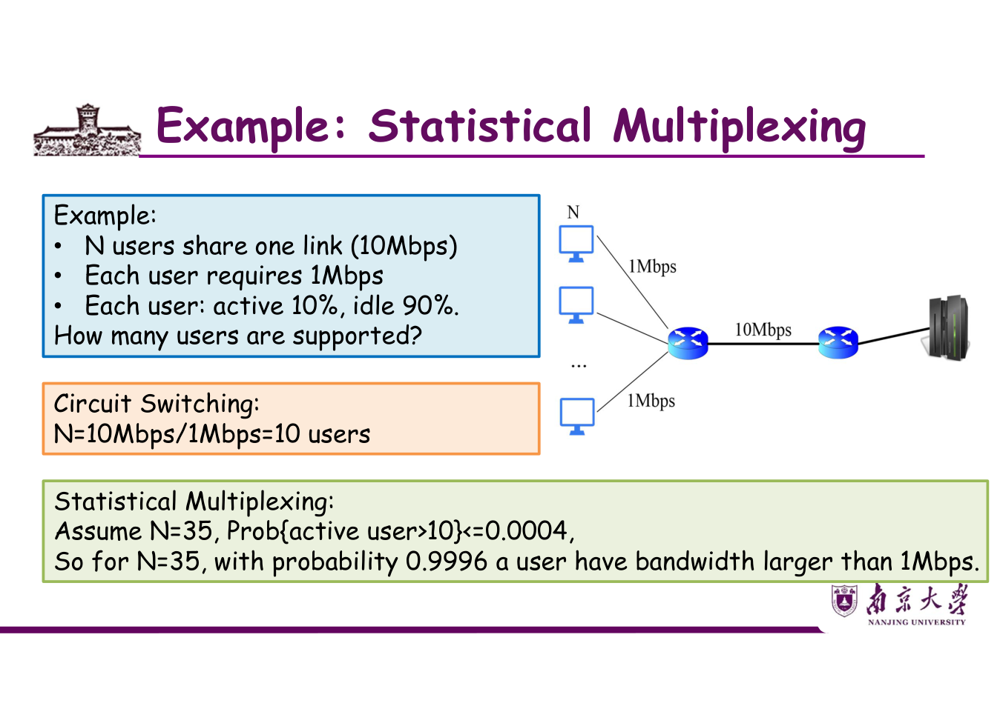

### 3.5 虚电路

虚电路是电路交换和分组交换的结合。

特点：

- 路由或主要路径先固定。
- 数据仍以分组形式传输。
- 资源共享，因此仍需要拥塞控制。
- 也可以预留部分资源，从而获得不同性能。
- 需要连接建立和拆除过程。

### 3.6 三种交换方式比较

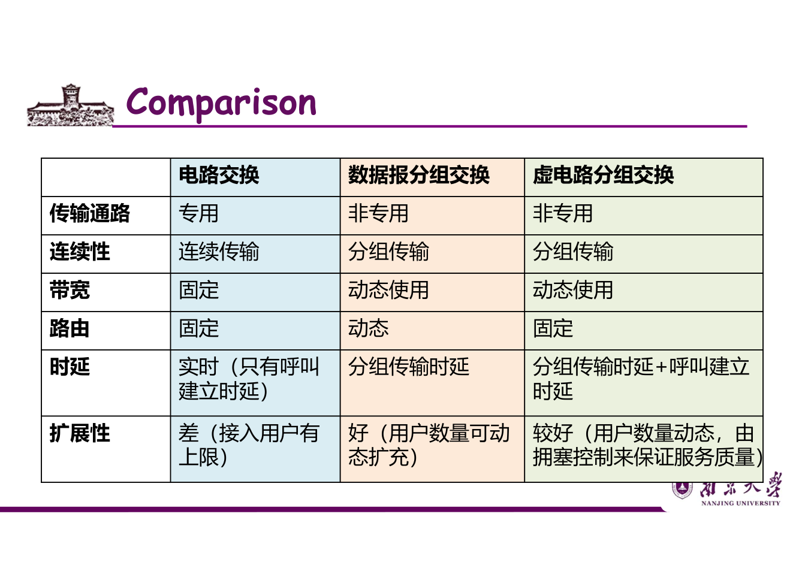

| 比较项 | 电路交换 | 数据报分组交换 | 虚电路分组交换 |
| --- | --- | --- | --- |
| 传输通路 | 专用 | 非专用 | 非专用 |
| 连续性 | 连续传输 | 分组传输 | 分组传输 |
| 带宽 | 固定 | 动态使用 | 动态使用 |
| 路由 | 固定 | 动态 | 固定 |
| 时延 | 实时传输，只有呼叫建立时延 | 分组传输时延 | 分组传输时延加呼叫建立时延 |
| 扩展性 | 差，接入用户有上限 | 好，用户数量可动态扩充 | 较好，由拥塞控制保证服务质量 |

## 4. 因特网发展历史

### 4.1 1961-1972：早期分组交换原则

关键词：诞生、分组交换网络。

重要事件：

- 1961 年：Kleinrock 用排队理论展示分组交换的有效性。
- 1964 年：Baran 将分组交换用于军事网络思想。
- 1967 年：ARPA 构想 ARPAnet。
- 1969 年：第一个 ARPAnet 节点运行，节点包括 UCLA、Stanford、UCSB、UTAH。
- 1972 年：ARPAnet 公开展示。
- 1972 年：NCP 成为第一个主机到主机协议，相关文档为 RFC001。
- 1972 年：第一个电子邮件程序出现。
- 1972 年：ARPAnet 有 15 个节点。

### 4.2 1972-1980：网络互联与新网络

关键词：成型，从单一封闭网络走向开放互联网络。

重要事件：

- 1970 年：ALOHAnet 卫星网络在夏威夷出现，是无线分组网络。
- 1973 年：Robert Metcalfe 的博士论文提出 Ethernet，以太网后来在 Xerox PARC 发展，局域网诞生。
- 1974 年：Cerf 和 Kahn 提出网络互联架构，也就是 Internet 架构思想。
- 1979 年：ARPAnet 有 200 个节点。

Cerf 和 Kahn 的互联网络原则：

- Minimalism and autonomy：最小化和自治，互联网络不要求各内部网络做大规模修改。
- Best effort service model：尽力而为服务模型。
- Stateless routers：无状态路由器。
- Decentralized control：去中心化控制。

这些原则定义了今天因特网架构的基础，也影响了 TCP/IP 设计。

### 4.3 1980-1990：新协议和网络增长

关键词：持续发展，从 NCP 走向 TCP/IP。

重要事件：

- 1983 年：TCP/IP 部署。
- 1982 年：SMTP 邮件协议定义。
- 1983 年：DNS 定义，用于域名到 IP 地址的转换。
- 1985 年：FTP 协议定义。
- 1988 年：TCP 拥塞控制出现。
- 出现 Csnet、BITnet、NSFnet、Minitel 等国家级网络。
- 大约 100,000 台主机连接到多个网络组成的联盟。

### 4.4 1990 年代与 2000 年代：Web、商业化与新应用

关键词：因特网爆炸。

重要事件：

- 1990 年代早期：ARPAnet 退役。
- 1991 年：NSF 取消 NSFnet 商业使用限制。
- 1995 年：NSFnet 退役。
- 1990 年代早期：Web 出现。
- HTML、HTTP 由 Tim Berners-Lee 推动。
- 1994 年：Mosaic 浏览器出现，之后有 Netscape Browser。
- 1990 年代后期：Web 商业化。
- 2000 年代：即时通信、P2P 文件共享、网络安全、Gbps 骨干链路快速发展。

Web 的基本组成：

- WWW
- HTTP
- HTML
- Web Server
- Browser

### 4.5 2000 年以后：新型应用不断涌现

重要趋势：

- Voice over IP
- Video over IP
- P2P 应用，如 BitTorrent、Skype、PPLive
- YouTube
- 在线游戏
- 无线网络和移动性
- 2015 年以后：区块链、AI 网络、5G 等
- 社交网络，如 Facebook、Twitter、人人、微博、微信等

## 5. 协议分层与服务模型

网络系统很复杂，包含主机、路由器、各种介质链路、应用、协议、硬件、软件等。为了组织复杂系统，需要分层。

### 5.1 为什么要分层

分层的好处：

- 明确系统结构，便于识别复杂系统的组成部分及其关系。
- 模块化，便于维护和更新。
- 某一层实现方式变化时，只要服务接口不变，就不影响其他层。

飞机旅行类比：

- 买票
- 托运行李
- 登机口装载
- 跑道起飞
- 飞机路由
- 到达后卸载、取行李、投诉等

每一层完成自己的服务，同时依赖下一层提供的服务。

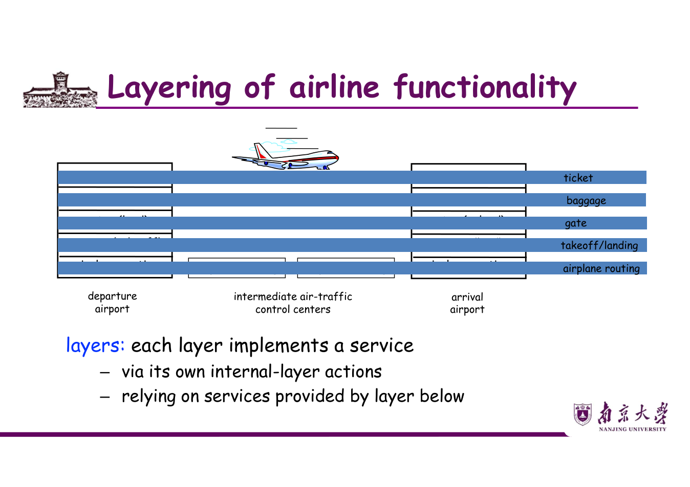

### 5.2 标准协议体系

主要有两个标准体系：

- OSI 参考模型
- TCP/IP 协议族

其他历史体系：

- IBM SNA
- DECNet
- Netware

OSI 是理论模型，TCP/IP 是今天全球因特网实际使用最广泛的协议体系。

### 5.3 OSI 七层模型

OSI 是 Open Systems Interconnection，由 ISO 制定。

OSI 七层：

1. 物理层
2. 数据链路层
3. 网络层
4. 运输层
5. 会话层
6. 表示层
7. 应用层

OSI 的基本思想：

- 每层完成通信功能的一部分。
- 每层依赖下一层提供更基础的服务。
- 每层向上一层提供服务。
- 一层变化不应要求其他层也变化。

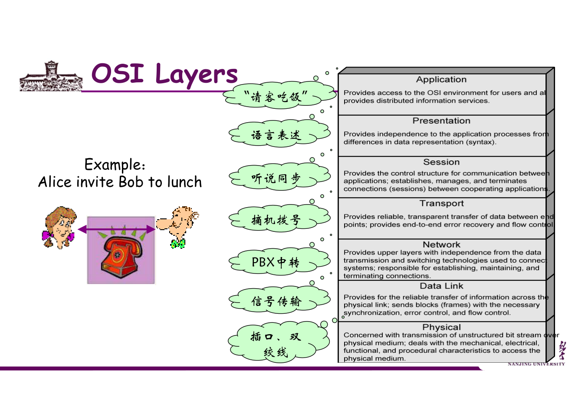

#### 物理层

功能：在链路上传输比特。

涉及内容：

- 机械特性：线缆、插头、引脚等。
- 电气或光学特性：调制、信号强度、电压水平、比特时间等。
- 功能和过程特性：物理链路的激活、维护、关闭等。

例子：

- Ethernet
- DSL
- Cable modem
- 电话 modem
- 双绞线
- 同轴电缆
- 光纤
- 无线电
- 红外

#### 数据链路层

功能：把比特组织成帧，并在直接相连的节点之间传输帧。

主要内容：

- 数据链路连接的激活、维护、关闭。
- 直接连接上的帧传输。
- 局域网中的介质访问控制。
- 比特错误检测。
- 帧重传。
- 流量控制。

上层可以在一定程度上假设链路层提供较可靠的传输。

#### 网络层

功能：跨多条链路、多个网络传输分组。

主要内容：

- 可扩展的地址设计。
- 路由算法决定分组穿越网络的路径。
- 转发负责让分组穿过一个节点。
- 拥塞控制应对流量突增。
- 在面向连接的网络中，负责连接建立、维护、拆除。

#### 运输层

功能：在端系统之间交换数据，更准确地说，是从一个主机中的进程到另一个主机中的进程传输数据。

可能提供的服务：

- 可靠字节流传输。
- 快速简单的单块传输。
- 无错误。
- 按序到达。
- 不丢失。
- 不重复。
- 连接建立、维护和释放。

#### 上三层：会话层、表示层、应用层

会话层：

- 控制应用之间的对话。
- 对话规则。
- 数据分组。
- 检查点恢复。

表示层：

- 与机器无关的数据表示。
- 数据格式和编码。
- 数据压缩和加密。

应用层：

- 为应用程序访问 OSI 环境提供手段。

在今天的 TCP/IP 体系中，会话层和表示层的许多功能通常合并到应用层或由应用自己处理。

### 5.4 TCP/IP 协议体系

TCP/IP 是全球因特网实际使用的体系。

常见层次：

- 应用层：支持网络应用，如 FTP、SMTP、HTTP。
- 运输层：进程到进程的数据传输，如 TCP、UDP。
- 网际层/网络层：跨网络传输数据报，如 IP 和路由协议。
- 链路层：相邻路由器或主机之间的数据传输，如 PPP、Ethernet。
- 物理层：在线路上传输比特。

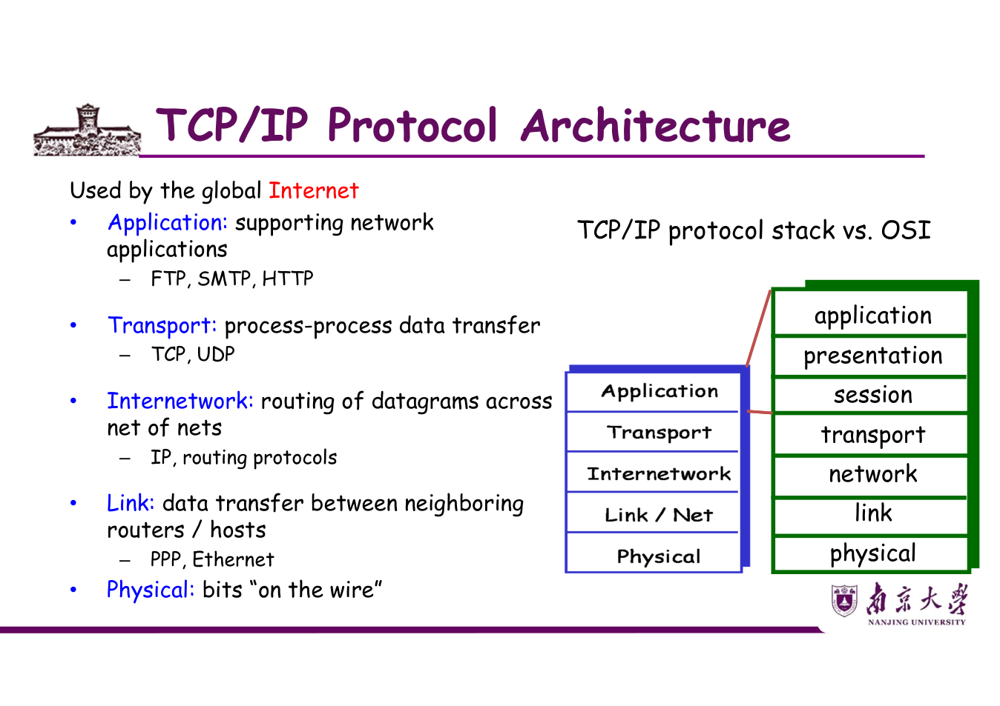

OSI 与 TCP/IP 的大致对应：

| OSI | TCP/IP |
| --- | --- |
| 应用层、表示层、会话层 | 应用层 |
| 运输层 | 运输层 |
| 网络层 | 网际层/网络层 |
| 数据链路层 | 链路层 |
| 物理层 | 物理层 |

### 5.5 IP 是分层沙漏模型的细腰

因特网分层体系常用沙漏模型理解。

核心思想：

- 网络层只有一个核心协议：IP。
- 上层可以有许多应用和运输层协议。
- 下层可以有各种链路层和物理层技术。
- 只要一个网络支持 IP，就能与其他支持 IP 的网络交换分组。

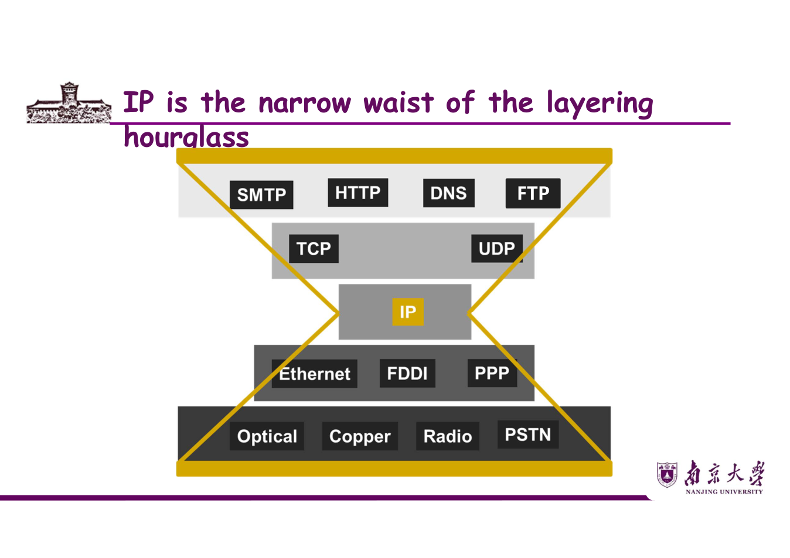

IP 作为“细腰”的意义：

- 允许任意网络互操作。
- 解耦应用和底层网络技术。
- 应用可以运行在多种网络之上。
- IP 之上和 IP 之下可以同时创新。
- 但改变 IP 本身很困难，例如 IPv4 向 IPv6 迁移很慢。

### 5.6 封装与协议数据单元

封装是分层通信中的核心机制。

每一层会给上层交下来的数据添加控制信息，形成该层的协议数据单元 PDU。

例子：

- 应用层数据交给运输层。
- 运输层把应用数据切分成 segment。
- 每个 segment 加上运输层首部。
- 首部可能包含目的端口、序号、差错检测码等。
- 然后交给网络层继续封装。

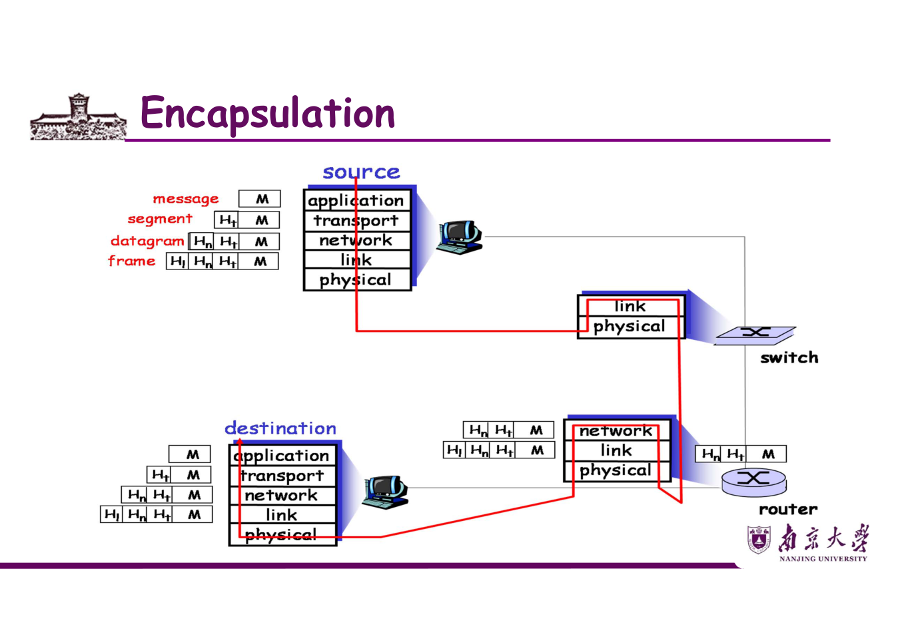

典型 PDU 名称：

- 应用层：报文 message。
- 运输层：报文段 segment。
- 网络层：数据报 datagram 或分组 packet。
- 链路层：帧 frame。
- 物理层：比特 bit。

### 5.7 分层的优缺点

优点：

- 降低复杂性。
- 提高灵活性。
- 方便标准化、维护和替换实现。

缺点：

- 会带来额外开销。
- 有时跨层信息很有用，严格分层可能降低效率。

## 6. 网络性能指标

网络性能主要从三个角度衡量：

- 时延 delay
- 丢包 loss
- 吞吐量 throughput

### 6.1 时延

时延回答的问题是：一个分组从源到目的地需要多长时间？

一个分组的时延主要由四部分组成：

- 传输时延
- 传播时延
- 排队时延
- 处理时延

其中：

- 传输时延和传播时延主要由链路属性决定。
- 排队时延和处理时延主要由流量混合情况和交换设备内部处理决定。

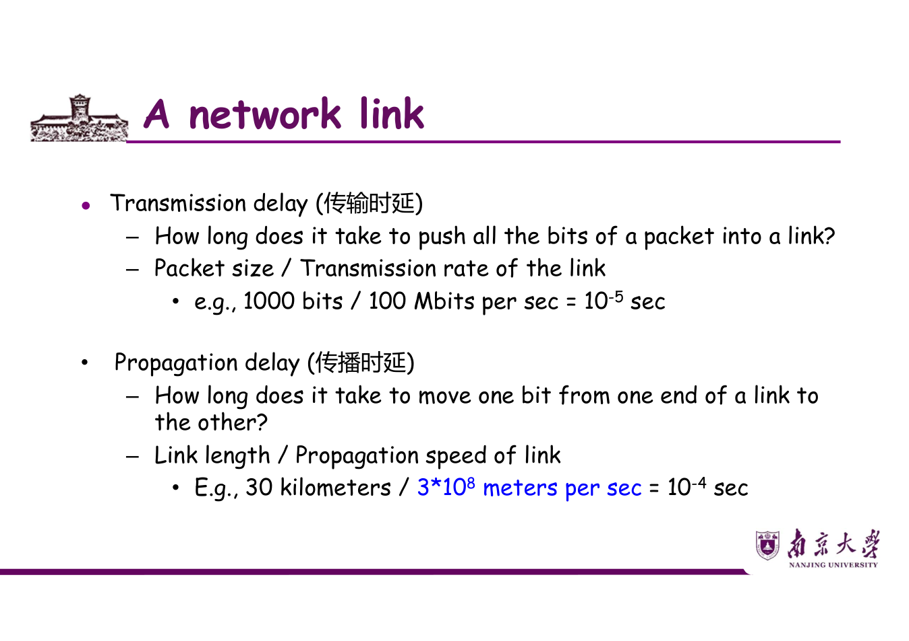

#### 传输时延

传输时延是把一个分组的所有比特推入链路所需的时间。

公式：

```text
传输时延 = 分组长度 / 链路传输速率
```

例子：

```text
1000 bits / 100 Mbits/s = 10^-5 s
```

注意：传输时延关注“把比特放上链路”的时间。

#### 传播时延

传播时延是一个比特从链路一端传播到另一端所需的时间。

公式：

```text
传播时延 = 链路长度 / 链路传播速度
```

例子：

```text
30 km / (3 * 10^8 m/s) = 10^-4 s
```

注意：传播时延关注“比特在介质中跑过去”的时间。

#### 传输时延与传播时延的例子

发送一个 100 Byte 的分组，即 800 bit。

链路 1：

- 速率：1 Mbps
- 传播时延：1 ms

计算：

```text
传输时延 = 800 / 10^6 s = 0.8 ms
总时延约 = 0.8 ms + 1 ms = 1.8 ms
```

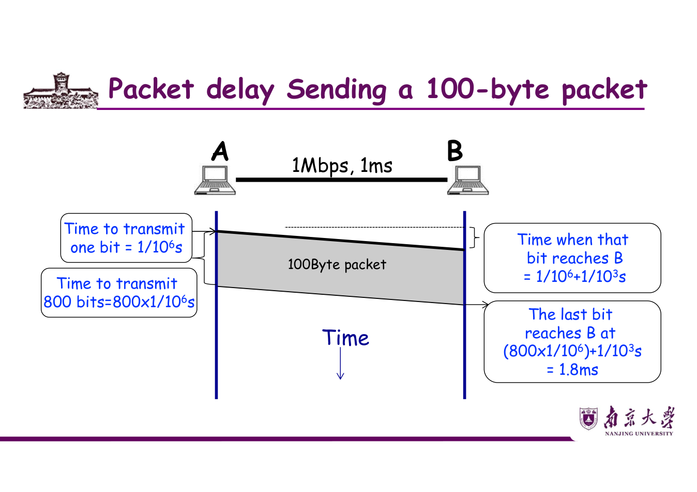

链路 2：

- 速率：1 Gbps
- 传播时延：1 ms

计算：

```text
传输时延 = 800 / 10^9 s = 0.0008 ms
总时延约 = 0.0008 ms + 1 ms = 1.0008 ms
```

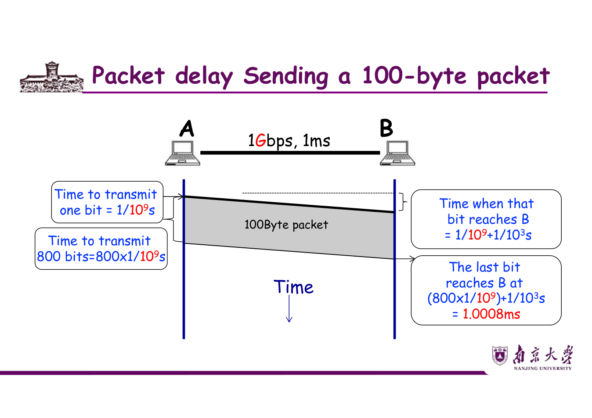

结论：

- 带宽越高，传输时延越低。
- 但传播时延由距离和传播速度决定，不会因为带宽提高而消失。
- 当带宽很高时，总时延可能主要由传播时延决定。

课件还用“管道视图”帮助理解链路：

- 链路可以看成一根管道。
- 带宽越大，单位时间能推入管道的比特越多。
- 传输时延会随着带宽增加而减小。
- 传播时延更像管道长度造成的时间，不会因为管道变粗而自动消失。

发送大文件时，文件通常会被切成许多小分组连续发送。第一个分组还在链路中传播时，后续分组可以继续被推入链路。理解这一点有助于区分“单个分组时延”和“连续数据流的吞吐量”。

#### 排队时延

排队时延是分组在缓冲区中等待处理或等待输出链路可用的时间。

排队时延取决于：

- 到达队列的平均速率。
- 到达流量是否突发。
- 输出链路的传输速率。

排队时延通常用统计指标描述：

- 平均排队时延。
- 排队时延方差。
- 时延超过某个阈值的概率。

当短时间内到达的分组超过输出链路处理能力时，会发生瞬时过载，队列增长。如果缓冲区满，后续分组可能被丢弃。

#### Little 定律

排队论中的基本术语：

- Arrival process：分组到达过程。
- A：平均到达速率。
- P：峰值到达速率。
- W：分组在队列中的平均等待时间。
- L：队列中等待的平均分组数。

Little 定律：

```text
L = A * W
```

含义：

- 平均队列长度 = 平均到达速率 × 平均等待时间。
- L 比 W 更容易通过观察队列长度计算，因此 Little 定律可帮助估计平均等待时间。

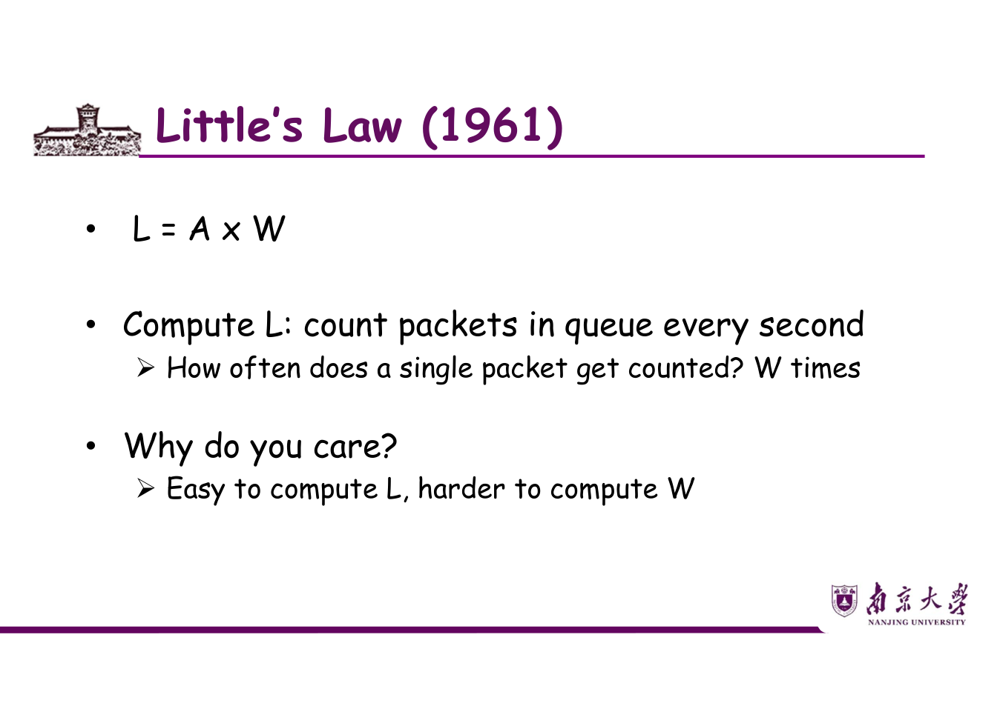

#### 处理时延

处理时延是交换机或路由器处理一个分组所花的时间。

包括：

- 检查分组首部。
- 判断输出端口。
- 执行必要的错误检查等。

在许多分析中，处理时延相对较小，可近似忽略。

#### 端到端时延

端到端路径上可能经过多段链路和多个路由器。

总时延由每一跳上的以下部分累加：

- 传输时延
- 传播时延
- 排队时延
- 处理时延

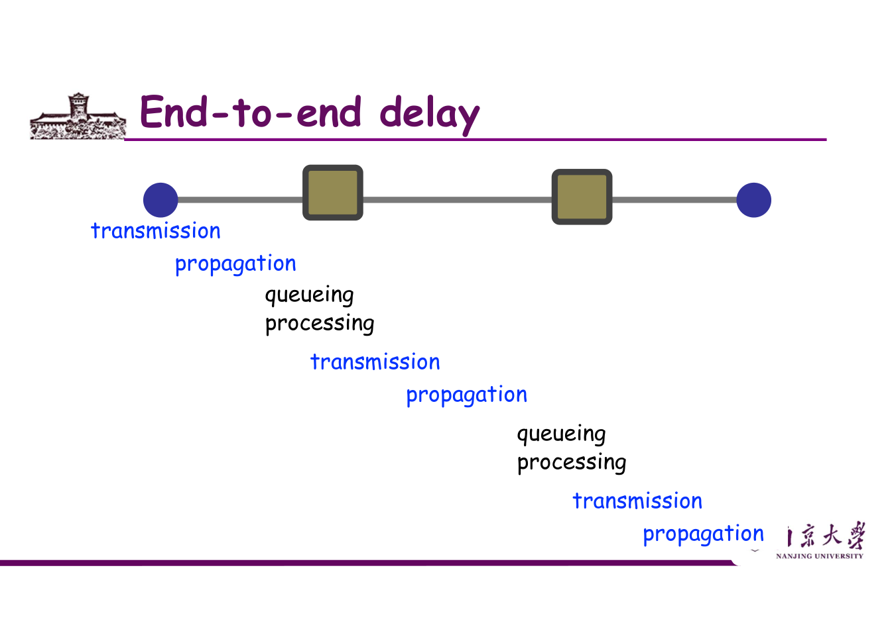

### 6.2 丢包

丢包回答的问题是：发往目的地的分组中，有多大比例被丢弃？

常见原因：

- 路由器或交换机缓冲区已满。
- 网络拥塞导致无法存储新到达分组。
- 无线链路错误等。

丢包会影响：

- 应用体验。
- 可靠传输协议的重传。
- 吞吐量。
- 时延，因为重传会增加等待时间。

### 6.3 吞吐量

吞吐量回答的问题是：目的端以什么速率从源端接收数据？

如果文件大小为 F bits，传输时间为 T，则平均吞吐量为：

```text
平均吞吐量 = F / T
```

对于一条传输速率为 R 的链路，若忽略其他开销，传输文件所需时间约为：

```text
T = F / R + 传播时延
平均吞吐量 = F / T ≈ R
```

端到端吞吐量受瓶颈链路限制。

如果路径上有两条链路：

- 第一条传输速率为 R。
- 第二条传输速率为 R'。
- 且 R' > R。

则端到端平均吞吐量为：

```text
min{R, R'} = R
```

也就是说，最慢的链路决定整体吞吐量。

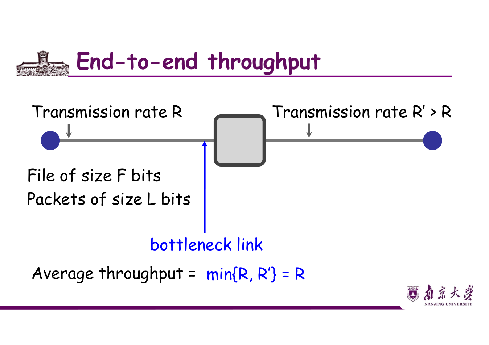

## 7. 本章重点总结

### 7.1 必须掌握的概念

- 因特网可以从组件、服务、协议三个视角理解。
- 网络协议定义消息格式、顺序和动作。
- 因特网由网络边缘、接入网络、网络核心组成。
- 网络边缘运行应用，包括客户端/服务器模型和 P2P 模型。
- 接入网络包括家庭接入、机构局域网接入、移动无线接入。
- 物理介质包括双绞线、同轴电缆、光纤、无线电等。
- 网络核心用交换设备连接大量网络。
- 电路交换预留专用资源，性能可预测但资源利用率低。
- 分组交换按需共享资源，效率高但性能不可预测，可能排队和丢包。
- 统计多路复用是分组交换高效利用资源的重要原因。
- 虚电路结合了电路交换和分组交换的特点。
- 分层降低系统复杂性，提高模块化能力。
- OSI 是七层理论模型，TCP/IP 是实际使用最广的协议体系。
- IP 是沙漏模型的细腰，使不同应用和不同底层网络能够互联。
- 封装是分层通信的基本机制。
- 性能指标包括时延、丢包、吞吐量。
- 时延由传输、传播、排队、处理四部分组成。
- 吞吐量受瓶颈链路限制。

### 7.2 易混点

#### 传输时延 vs 传播时延

- 传输时延：把整个分组放到链路上需要多久，取决于分组长度和链路速率。
- 传播时延：一个比特在链路中传播到对端需要多久，取决于距离和传播速度。

#### 路由 vs 转发

- 路由：决定路径，偏全局。
- 转发：分组到达某个节点后，从哪个输出端口发出去，偏本地。

#### 电路交换 vs 分组交换

- 电路交换：先建立连接并预留资源，适合稳定连续流量。
- 分组交换：分组独立转发，按需共享资源，适合突发流量。

#### 网络边缘 vs 网络核心

- 网络边缘：主机和应用所在位置，如手机、笔记本、服务器。
- 网络核心：负责大规模转发的路由器和交换结构。

### 7.3 常用公式

```text
传输时延 = 分组长度 / 链路传输速率
```

```text
传播时延 = 链路长度 / 传播速度
```

```text
Little 定律：L = A * W
```

```text
平均吞吐量 = 文件大小 F / 传输时间 T
```

```text
端到端吞吐量 = 路径上所有链路速率的最小值
```

## 8. 复习检查题

1. 因特网的组件视角、服务视角、协议视角分别强调什么？
2. 为什么说协议不仅规定消息格式，还规定消息顺序和动作？
3. 网络边缘、接入网络、网络核心分别包含哪些对象？
4. 客户端/服务器模型和 P2P 模型有什么区别？
5. DSL 和 HFC 的接入方式有什么不同？
6. 双绞线、同轴电缆、光纤、无线电分别有什么特点？
7. 为什么大规模网络需要交换设备，而不是所有节点直接相连？
8. 电路交换为什么性能可预测？为什么又可能浪费资源？
9. 分组交换为什么会产生排队时延和丢包？
10. 统计多路复用为什么能让 35 个用户共享 10 Mbps 链路？
11. 虚电路为什么可以看作电路交换和分组交换的结合？
12. Cerf 和 Kahn 的互联网络原则有哪些？
13. 为什么 TCP/IP 成为事实标准，而 OSI 更多是理论模型？
14. IP 作为沙漏细腰有什么好处？为什么修改 IP 很困难？
15. 封装过程中每一层为什么要添加首部？
16. 传输时延和传播时延的公式分别是什么？
17. 为什么 1 Gbps 链路的总时延不一定比 1 Mbps 链路小 1000 倍？
18. Little 定律中 L、A、W 分别表示什么？
19. 什么是瓶颈链路？它如何限制端到端吞吐量？
