# 第 2 章 应用层

> 本章核心问题：
>
> 1. 应用层协议是什么？它和网络应用有什么关系？
> 2. DNS 如何把域名解析成 IP 地址？
> 3. 电子邮件系统如何投递、存储和读取邮件？
> 4. FTP 为什么要区分控制连接和数据连接？
> 5. Web、URL、HTTP 请求/响应是如何工作的？
> 6. HTTP 如何通过连接复用、流水线、缓存提高性能？
> 7. CDN 如何把内容放到离用户更近的位置？

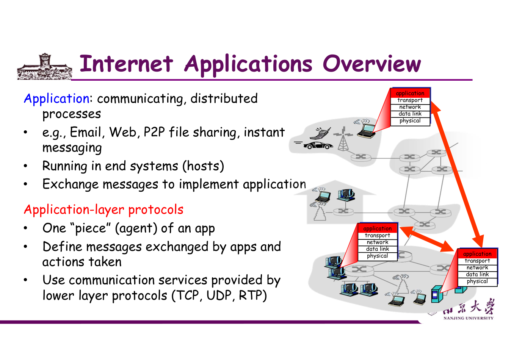

## 0. 本章内容结构

本章围绕典型 Internet 应用展开：

- Internet Applications Overview：应用层概览。
- DNS：Domain Name Service，域名服务。
- Electronic Mail：电子邮件。
- FTP：File Transfer Protocol，文件传输协议。
- WWW and HTTP：万维网与 HTTP。
- CDN：Content Distribution Network，内容分发网络。

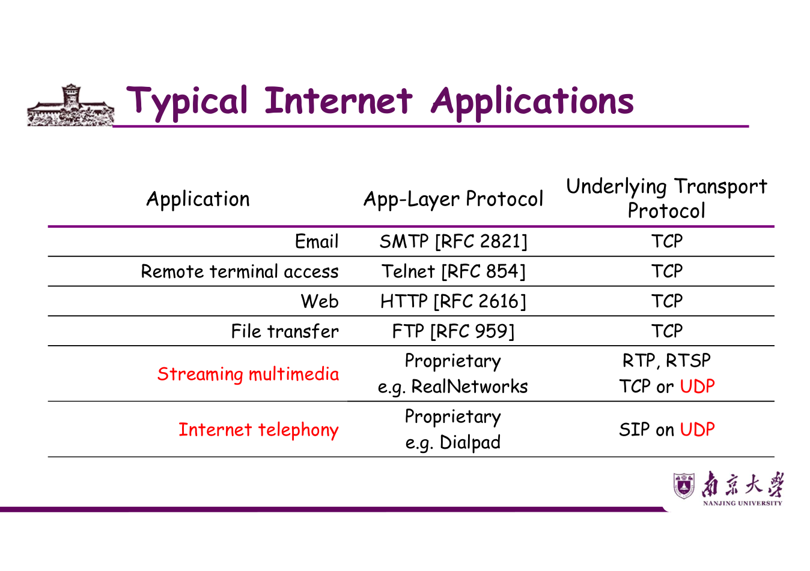

## 1. 应用层概览

### 1.1 什么是网络应用

网络应用是运行在端系统中的、彼此通信的分布式进程。

例子：

- Email
- Web
- P2P 文件共享
- 即时通信
- 流媒体
- 网络电话

网络应用运行在主机上，而不是路由器上。应用通过交换消息来实现功能。

### 1.2 应用层协议

应用层协议是应用的一部分。它规定应用进程之间如何通信。

应用层协议定义：

- 交换的消息类型，例如 request 和 response。
- 消息语法：消息中有哪些字段，字段如何分隔。
- 字段语义：字段中的信息代表什么含义。
- 进程何时发送消息、如何响应消息。

应用层协议使用下层协议提供的通信服务，例如：

- TCP
- UDP
- RTP

典型应用、应用层协议和运输层协议：

| 应用 | 应用层协议 | 底层运输协议 |
| --- | --- | --- |
| Email | SMTP | TCP |
| Remote terminal access | Telnet | TCP |
| Web | HTTP | TCP |
| File transfer | FTP | TCP |
| Streaming multimedia | RTP、RTSP 或私有协议 | TCP 或 UDP |
| Internet telephony | SIP 或私有协议 | UDP 等 |

### 1.3 应用层常用术语

#### 进程

进程是运行在主机中的程序。

- 同一主机内的两个进程通过操作系统定义的进程间通信机制通信。
- 不同主机中的进程通过应用层协议通信。

#### 用户代理

用户代理是应用上层用户界面和下层网络之间的接口。

用户代理通常负责：

- 实现用户界面。
- 实现应用层协议。

例子：

- Web：浏览器、Web 服务器。
- Email：邮件阅读器、邮件服务器。
- 流媒体：媒体播放器、媒体服务器。

### 1.4 应用体系结构

应用结构主要有两种：

- Client-Server，客户端/服务器。
- Peer-to-Peer，P2P。

#### 客户端/服务器模式

客户端特点：

- 按需启动。
- 主动联系服务器，通常先说话。
- 主机 IP 地址可能是动态的。
- 例子：Web 中浏览器是客户端，Email 中邮件阅读器是客户端。

服务器特点：

- 作为 daemon 进程长期运行，always-on。
- 为客户端提供请求的服务。
- 通常具有固定 IP 地址。
- 例子：Web 服务器发送网页，邮件服务器投递邮件。

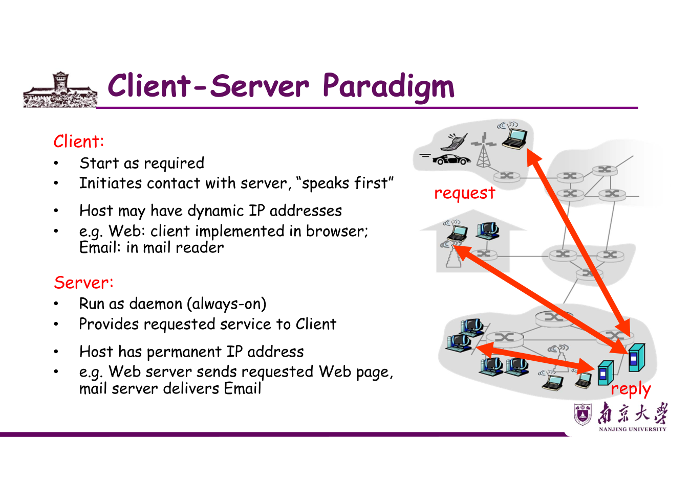

#### P2P 模式

P2P 特点：

- 没有一直在线的中心服务器，或只少量使用中心服务器。
- 任意端系统可直接通信。
- Peer 可以向其他 peer 请求服务，也可以反过来提供服务。
- 具有自扩展性：新 peer 带来新服务能力，也带来新服务需求。
- Peer 间歇连接，IP 地址可能变化。
- 可扩展性强，但管理困难。

例子：

- Gnutella
- BitTorrent
- Skype

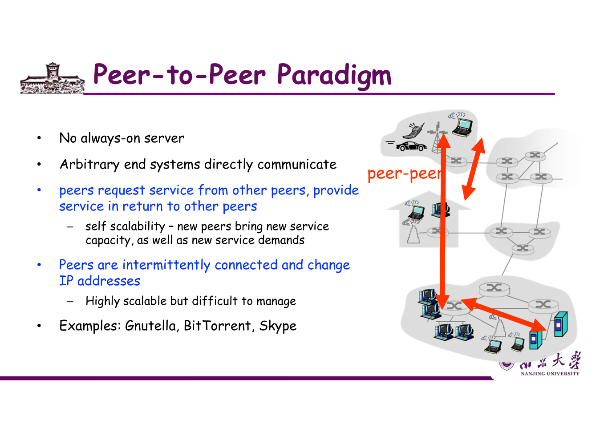

#### 混合模式

一些应用同时包含 P2P 和中心服务器。

Skype：

- 语音通信本身是 P2P。
- 中心服务器用于查找远端用户地址。
- 客户端之间直接建立连接。

即时通信：

- 两个用户聊天可以是 P2P。
- 中心服务用于检测用户是否在线和定位用户。
- 用户上线时向中心服务器注册 IP 地址。
- 需要联系某个用户时，向中心服务器查询其 IP 地址。

## 2. DNS：域名服务

### 2.1 DNS 的功能

DNS 的核心功能是把域名映射为 IP 地址。

例子：

```text
www.baidu.com -> 119.75.217.109
```

DNS 同时也是一个系统：

- 由许多名字服务器组成的层次化分布式数据库。
- 主机和名字服务器通过应用层协议通信，完成域名解析。
- 可以做负载均衡：同一个服务器名可对应一组 IP 地址。

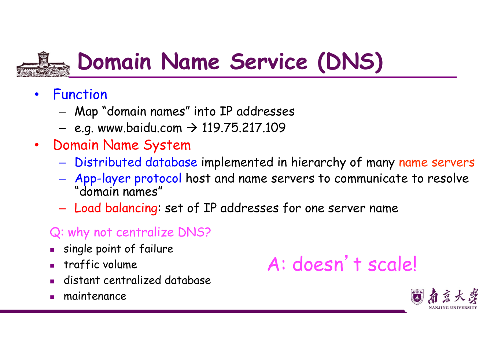

### 2.2 为什么 DNS 不能中心化

如果只用一个中心 DNS 服务器，会有很多问题：

- 单点故障：中心服务器挂掉，整个解析系统受影响。
- 流量过大：全球查询都打到一个地方。
- 距离太远：远距离访问中心数据库会增加时延。
- 维护困难：所有域名更新都集中处理，不可扩展。

结论：中心化 DNS 不具备可扩展性。

### 2.3 DNS 的目标

DNS 设计目标：

- 唯一性：不能发生命名冲突。
- 可扩展：支持大量名字和频繁更新。
- 分布式、自主管理：每个组织能管理自己的机器名，不必追踪所有人的更新。
- 高可用。
- 查询要快。

DNS 不追求完美一致性。也就是说，短时间内不同缓存或服务器看到的信息可以略有不同。

### 2.4 DNS 如何实现这些目标

核心思想：

- 划分命名空间。
- 分布式管理每个分区。
- 分布式解析每个分区。

关键是层次化。

DNS 中有三种相互关联的层次：

- 层次化命名空间。
- 层次化管理。
- 分布式服务器层次。

### 2.5 层次化命名空间

DNS 名称空间是一棵树。

- 顶级域名在靠近根的位置。
- 域是树上的子树。
- 名字是从叶子到根的路径。
- 树深度任意，但有限制，课件中提到限制为 128。
- 命名冲突容易避免，因为每个域只负责自己的子域。

例子：

```text
cse.eecs.umich.edu
```

它可以理解为：

```text
cse -> eecs -> umich -> edu -> root
```

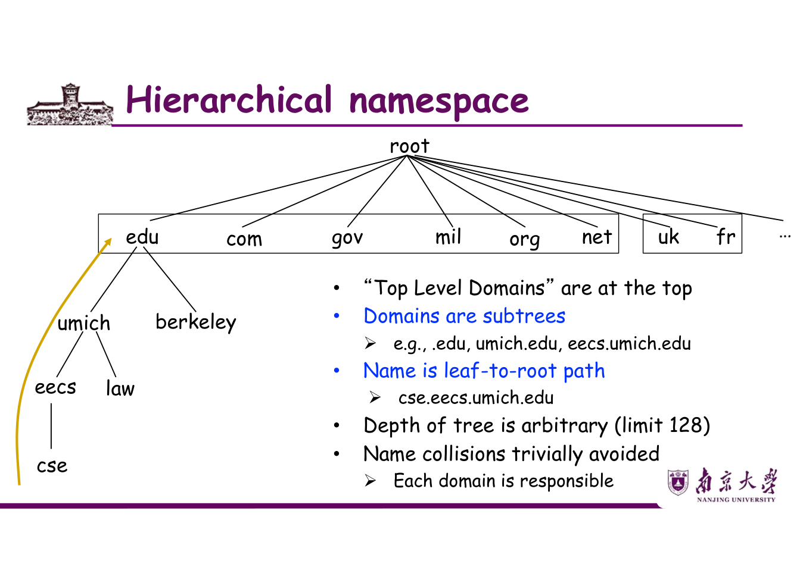

### 2.6 层次化管理与 zone

zone 对应一个管理权威，负责层次结构中的一部分。

例子：

- UMich 控制 `*.umich.edu`。
- EECS 控制 `*.eecs.umich.edu`。
- ICANN/IANA 负责更高层级的管理。

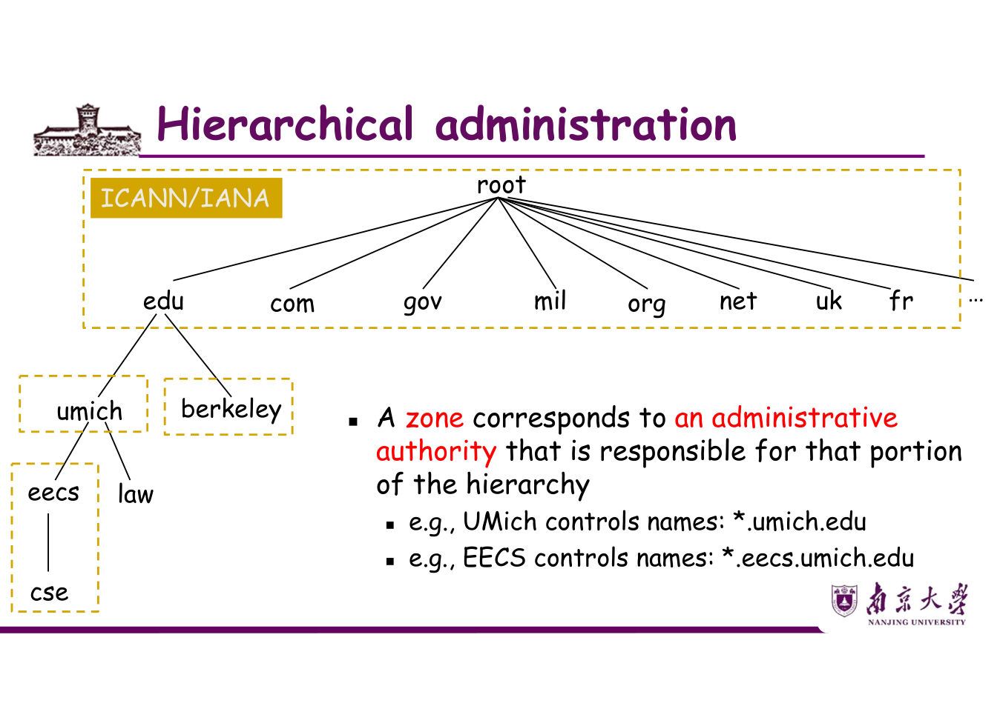

### 2.7 DNS 服务器层次

DNS 服务器主要包括：

- Root name servers：根名字服务器。
- TLD servers：顶级域服务器。
- Authoritative DNS servers：权威 DNS 服务器。
- Local name servers：本地名字服务器，也叫默认名字服务器。

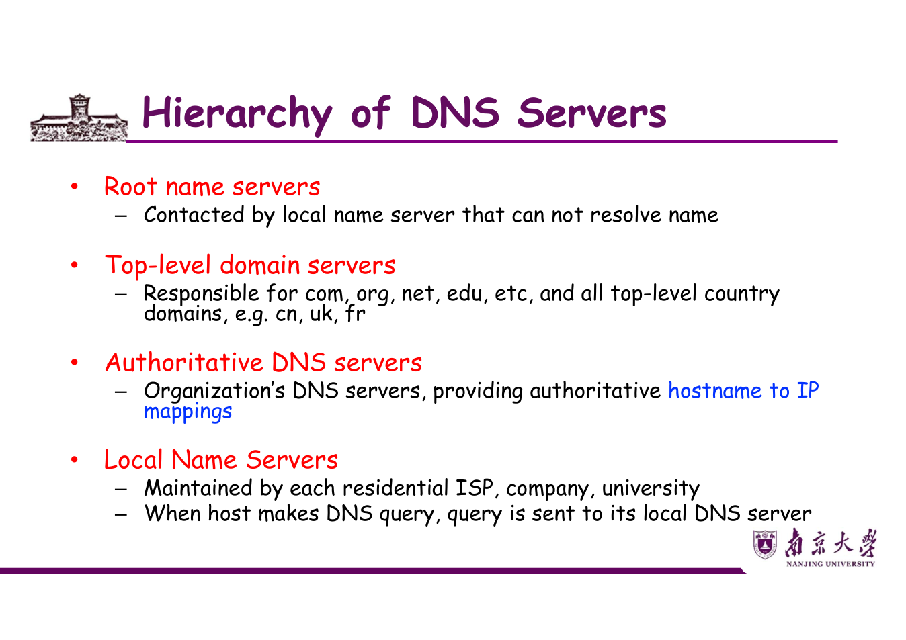

#### 根名字服务器

根名字服务器在本地服务器无法解析名字时被联系。

根服务器的作用：

- 返回对应 TLD 服务器的 IP 映射或指引。
- 不直接保存所有主机名到 IP 的映射。

课件提到全球有 13 个根名字服务器标识，但这些根服务通过多个站点部署和复制来提高可用性。

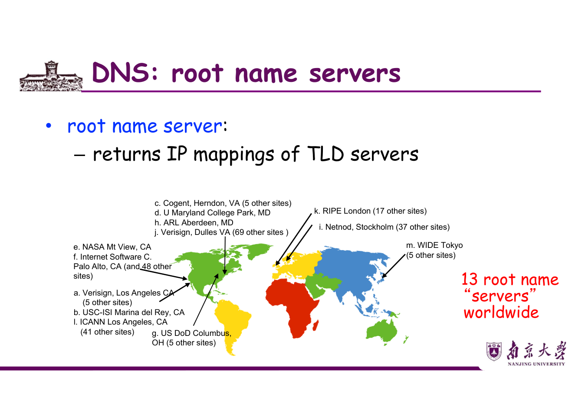

#### TLD 服务器

TLD 服务器负责顶级域：

- 通用顶级域：com、org、net、edu、aero、jobs、museums 等。
- 国家顶级域：cn、uk、fr、ca、jp 等。

例子：

- Network Solutions 维护 `.com` TLD 服务器。
- Educause 维护 `.edu` TLD 服务器。

#### 权威 DNS 服务器

权威服务器是组织自己的 DNS 服务器，为该组织的命名主机提供权威的主机名到 IP 映射。

权威服务器可以由组织自己维护，也可以由服务提供商维护。

#### 本地 DNS 服务器

本地 DNS 服务器严格来说不属于 DNS 层次结构的一部分。

通常每个 ISP、公司、大学都有本地 DNS 服务器。

主机发起 DNS 查询时：

- 查询首先发给本地 DNS 服务器。
- 本地服务器可能有最近解析结果的缓存。
- 缓存可能过期或不新。
- 若本地无法回答，它作为代理把查询转发到 DNS 层次结构中。

### 2.8 DNS 解析过程

例子：`cis.poly.edu` 的 Bob 想知道 `gaia.cs.umass.edu` 的 IP 地址。

过程：

1. Bob 的主机向本地 DNS 服务器 `dns.poly.edu` 发起查询。
2. 本地 DNS 服务器联系根 DNS 服务器。
3. 根服务器返回负责 `.edu` 的 TLD 服务器信息。
4. 本地 DNS 服务器联系 TLD 服务器。
5. TLD 服务器返回 `umass.edu` 或 `cs.umass.edu` 的权威 DNS 服务器信息。
6. 本地 DNS 服务器联系权威 DNS 服务器 `dns.cs.umass.edu`。
7. 权威 DNS 服务器返回 `gaia.cs.umass.edu` 的 IP 地址。
8. 本地 DNS 服务器把结果返回给 Bob 的主机。

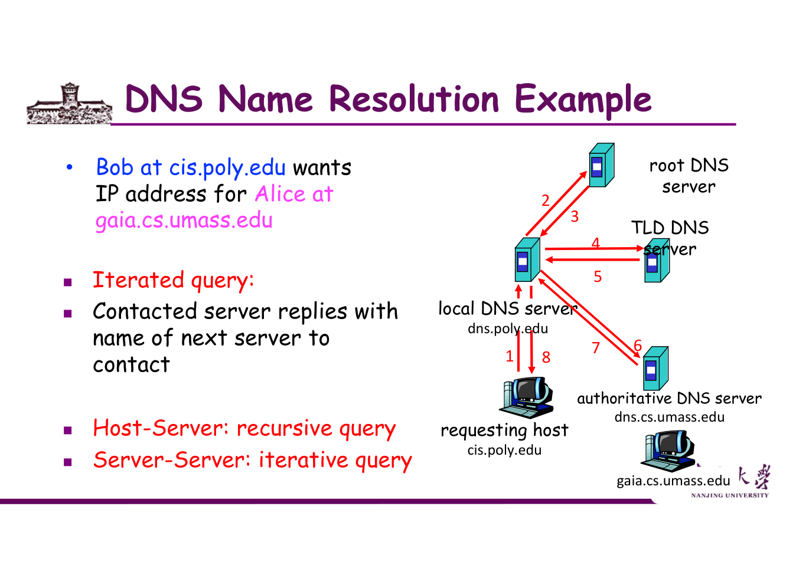

课件中强调：

- contacted server 返回下一个应联系服务器的名字或地址，这是迭代查询。
- Host 到 local server 常可看作递归查询。
- Server 到 server 常使用迭代查询。

### 2.9 DNS 资源记录

DNS resource record，简称 RR。

RR 格式：

```text
(name, value, type, ttl)
```

含义：

- name：域名。
- value：记录值。
- type：说明如何解释 value。
- ttl：time to live，缓存有效时间。

常见类型：

- A：主机名到 IP 地址。
- NS：Name Server，某域对应的名字服务器。
- MX：Mail Exchanger，邮件服务器。
- CNAME：Canonical Name，规范名或别名映射。

例子：

```text
(networkutopia.com, dns1.networkutopia.com, NS, 32768)
(dns1.networkutopia.com, 212.212.212.1, A, 5600)
```

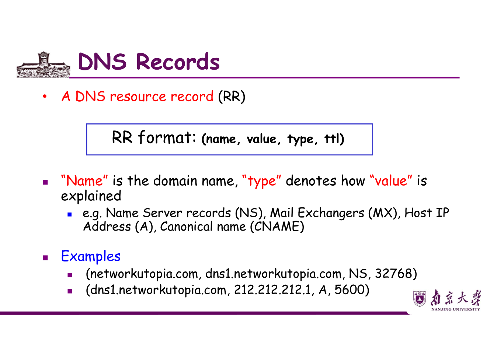

### 2.10 DNS 协议

DNS 协议特点：

- 使用 Query 和 Reply 消息。
- 查询和响应消息格式相同。
- 消息头包括 identifier、flags 等。
- 消息中还包含 resource records。
- 客户端和服务器通常使用 UDP 53 端口。
- 标准也支持 TCP，但不一定总是实现或总是使用。

### 2.11 DNS 可靠性

DNS 的高可用依赖：

- DNS 服务器复制，如 primary/secondary。
- 只要至少一个副本可用，名字服务就可用。
- 查询可以在副本之间负载均衡。
- 查询通常使用 UDP。
- 如果需要可靠性，需要在 UDP 之上实现。
- 超时时尝试其他服务器。
- 对同一服务器重试时可使用指数退避。
- 查询使用相同 identifier，不关心哪个服务器响应。

### 2.12 DNS 缓存

DNS 解析如果每次都从根开始，会带来明显时延，甚至在下载网页前就增加接近 1 秒延迟。

缓存能显著降低开销：

- 顶级域服务器很少改变。
- 热门网站会被频繁访问。
- 本地 DNS 服务器经常已经缓存了解析结果。

DNS 缓存机制：

- DNS 服务器缓存查询响应。
- 响应中包含 TTL 字段。
- TTL 到期后，服务器删除缓存项。

### 2.13 DNS 攻击

课件提到三类攻击。

#### DDoS 攻击

例子：2002 年 10 月攻击者利用僵尸网络向 13 个根服务器发送大量 ICMP 报文。

攻击未奏效的原因：

- 大部分 DNS 根服务器执行分组过滤，阻止 ICMP 报文。
- 很多域名被本地缓存，不需要访问根服务器。

更有效的攻击目标可能是 TLD 服务器，因为近年来针对 TLD 的大量 DNS 请求攻击更常见。

#### 重定向攻击

包括：

- Man-in-the-middle：中间人截获查询。
- DNS poisoning：发送伪造响应给 DNS 服务器，使其缓存错误记录。
- DNS 污染的简单应对方式之一是修改 hosts 文件，但这只适合局部绕过。

#### 利用 DNS 进行 DDoS

攻击者可发送伪造源地址的 DNS 查询，让响应流量打向目标 IP。

这种攻击依赖放大效应。

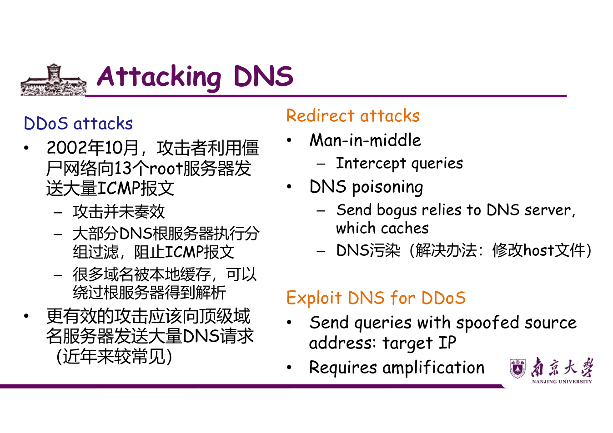

## 3. 电子邮件

### 3.1 电子邮件系统概览

电子邮件是因特网上使用最广泛的应用之一。

关键协议：

- SMTP：Simple Mail Transfer Protocol，用于传递简单文本邮件。
- MIME：Multi-purpose Internet Mail Extension，用于传递其他类型数据，如声音、图片、视频片段。
- POP：Post Office Protocol，用于从服务器取回邮件，包括授权和下载。
- IMAP：Internet Mail Access Protocol，用于在服务器上操作已存储邮件。

### 3.2 电子邮件系统组成

电子邮件系统包括：

- User Agent，用户代理。
- Mail Server，邮件服务器。
- SMTP，邮件服务器之间发送邮件的协议。

用户代理功能：

- 编写邮件。
- 编辑邮件。
- 阅读邮件。

例子：

- Eudora
- Outlook
- Foxmail
- Netscape Messenger

邮件服务器功能：

- mailbox 保存用户收到的邮件。
- outgoing message queue 保存等待发送的邮件。
- 邮件服务器之间使用 SMTP 发送邮件。

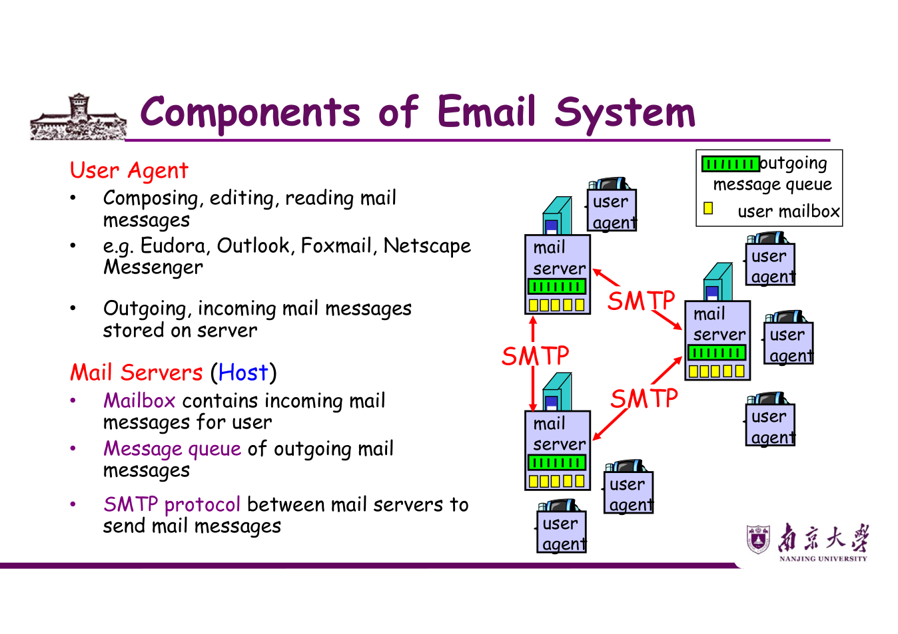

### 3.3 邮件投递三阶段

邮件投递通常分三阶段：

1. 邮件从本地用户代理到本地 SMTP 服务器。此时用户代理是 SMTP 客户端，本地服务器是 SMTP 服务器。
2. 本地服务器把邮件转发到远程 SMTP 服务器。此时本地服务器又作为 SMTP 客户端。
3. 远程用户代理使用邮件访问协议访问远程服务器上的 mailbox。常用 POP3 或 IMAP4。

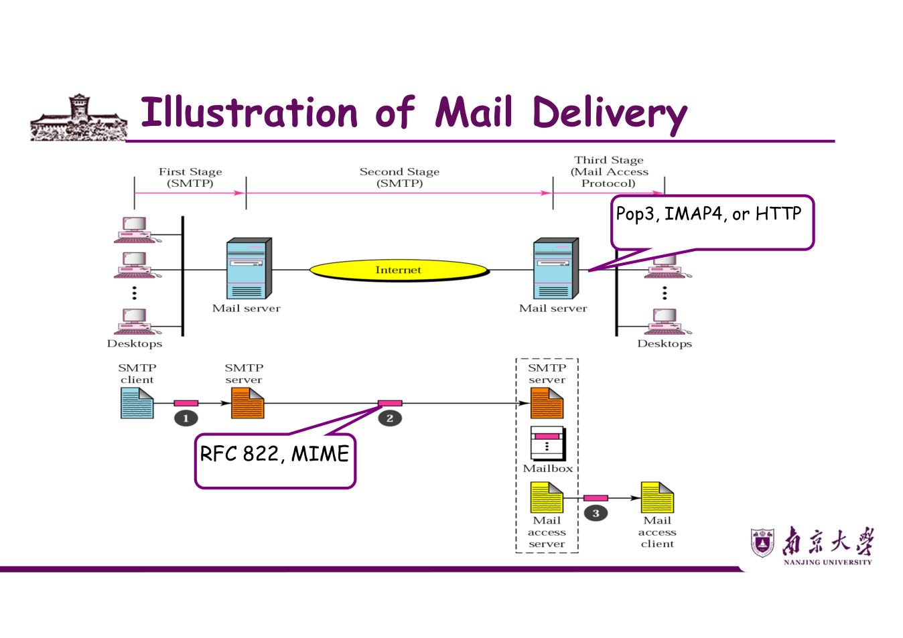

### 3.4 邮件投递场景

Alice 给 `bob@someschool.edu` 发邮件：

1. Alice 使用 UA 编写邮件。
2. Alice 的 UA 使用 SMTP 把邮件发送到 Alice 的邮件服务器，邮件进入消息队列。
3. Alice 邮件服务器中的 SMTP 客户端与 Bob 的邮件服务器建立 TCP 连接。
4. SMTP 客户端通过 TCP 连接发送 Alice 的邮件。
5. Bob 的邮件服务器把邮件放入 Bob 的 mailbox。
6. Bob 打开 UA，用 POP3 等协议读取邮件。

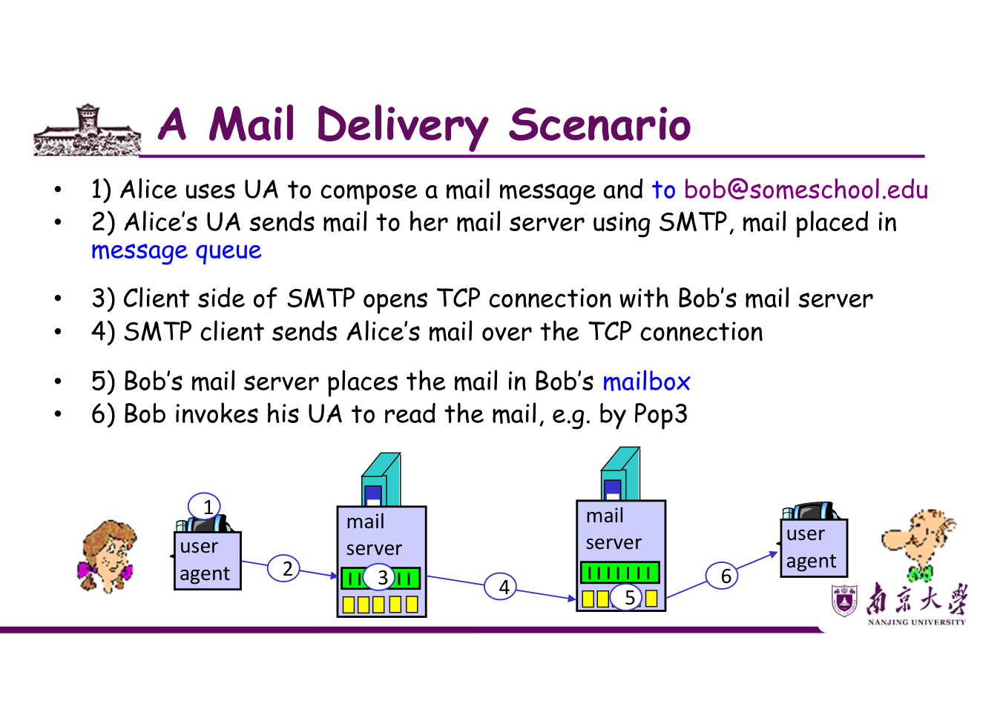

### 3.5 SMTP

SMTP 来自 RFC 821。

特点：

- 使用 TCP。
- 端口 25。
- 直接把邮件消息从客户端传到服务器。
- 需要邮件信封上的信息，即 message header。
- 可能在 message header 中添加日志信息，记录邮件经过的路径。
- SMTP 不定义邮件消息或数据格式，这些由 RFC 822 或 MIME 定义。
- SMTP 早期要求消息为 7-bit ASCII。

SMTP 传输分三阶段：

- 握手 greeting。
- 传输一封或多封邮件数据。
- 关闭连接。

SMTP 使用命令/响应交互：

- 命令是 ASCII 文本。
- 响应是状态码和短语。

可通过 telnet 手动体验 SMTP：

```text
telnet servername 25
HELO
MAIL FROM
RCPT TO
DATA
QUIT
```

### 3.6 SMTP 可靠性

SMTP 通过 TCP 连接从发送方传输邮件到接收方，因此依赖 TCP 提供可靠服务。

但仍有局限：

- 不保证恢复丢失邮件。
- 没有发件人用户层面的端到端确认。
- 错误指示的投递也不保证。
- 邮件到达主机不等于到达用户并被读取。

总体上，SMTP 通常被认为是可靠的。

### 3.7 邮件消息格式

邮件消息包含两部分：

- Header lines：头部行。
- Body：正文。

头部例子：

```text
To: Alice@sina.com
From: Bob@gmail.com
Subject: Dinner tonight
```

头部和正文之间用空行分隔。

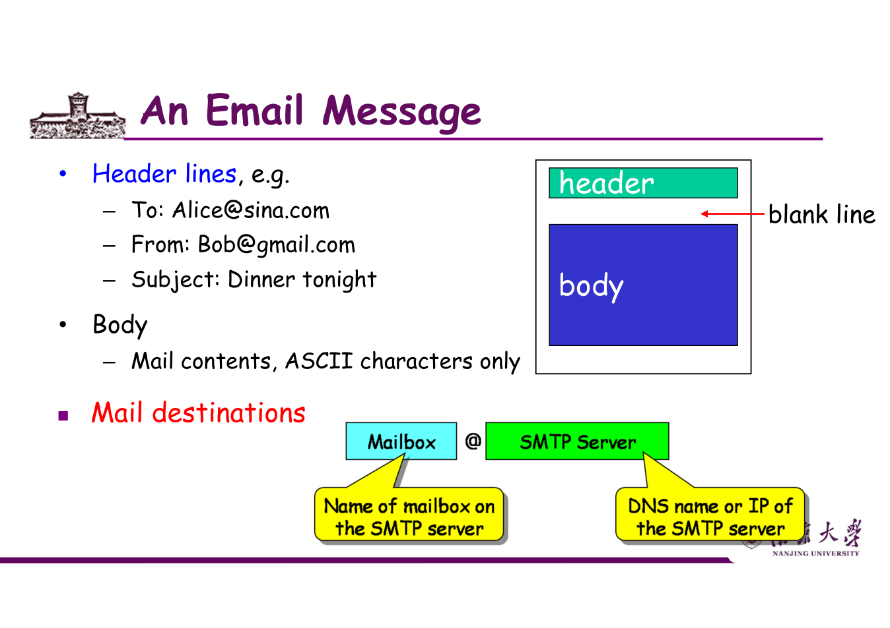

RFC 822 定义文本邮件格式：

- 简单的两部分格式：Header 和 Body。
- Header 包含传输和投递信息。
- Header 行格式是 `keyword: information value`。
- Body 承载文本内容。
- 邮件是文本行序列。
- 以两个 `<CRLF>` 结束。

### 3.8 邮件访问协议

SMTP 负责把邮件投递和存储到接收方服务器。

用户从服务器取回邮件需要邮件访问协议：

- POP3
- IMAP
- HTTP，例如 Gmail、Hotmail、Yahoo 等 Web 邮箱。

### 3.9 POP3

POP3 来自 RFC 1939。

POP3 包含授权阶段和事务阶段。

授权阶段：

- 客户端命令：
  - `user`：声明用户名。
  - `pass`：密码。
- 服务器响应：
  - `+OK`
  - `-ERR`

事务阶段常见命令：

- `list`：列出邮件编号。
- `retr`：按编号取回邮件。
- `dele`：删除邮件。
- `quit`：退出。

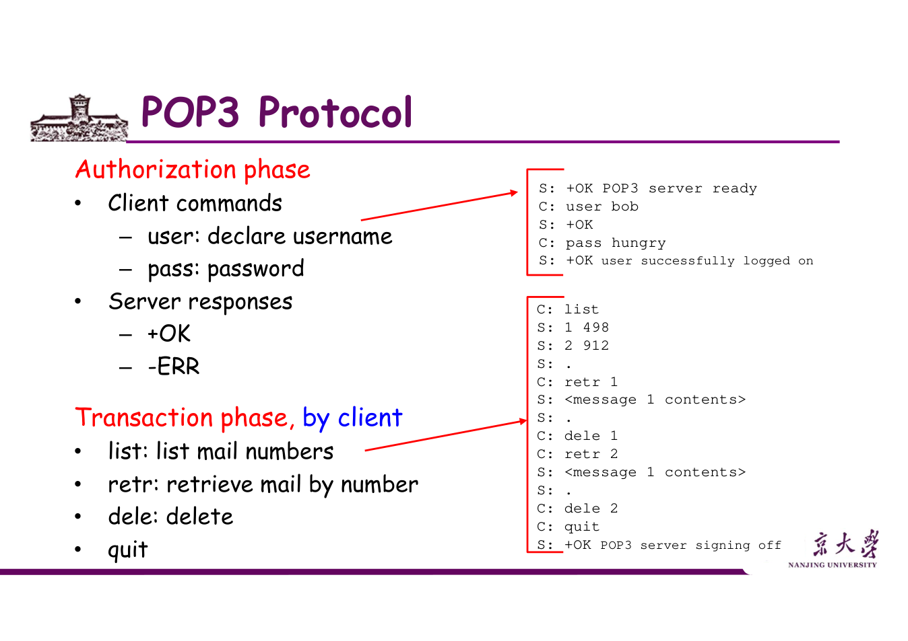

POP3 模式：

- download and delete：下载并删除。如果换客户端，可能无法再次阅读邮件。
- download and keep：下载并保留。不同客户端可能各自保存副本。

POP3 在会话之间是无状态的。

### 3.10 IMAP

IMAP 来自 RFC 1730。

特点：

- 所有消息保存在服务器上。
- 支持在服务器端组织文件夹。
- 在会话之间保留用户状态。
- 可保存文件夹名称、消息 ID 到文件夹名的映射。
- 可跟踪邮件状态，如已读、已回复、已删除。

IMAP 适合多设备、多地点访问同一个邮箱。

### 3.11 MIME

MIME 是 Multipurpose Internet Mail Extension。

作用：

- 扩展并自动化编码机制。
- 允许一封邮件中包含多个独立组件。
- 支持程序、图片、音频、视频等非纯文本内容。

特点：

- 兼容已有邮件系统。
- 所有内容编码为 7-bit ASCII。
- 非 MIME 邮件系统可忽略 MIME 头和分隔符。
- MIME 可扩展，只要发送方和接收方同意编码方案。

MIME 增加 5 个邮件头字段：

- MIME-Version
- Content-Type
- Content-Transfer-Encoding
- Content-Id
- Content-Description

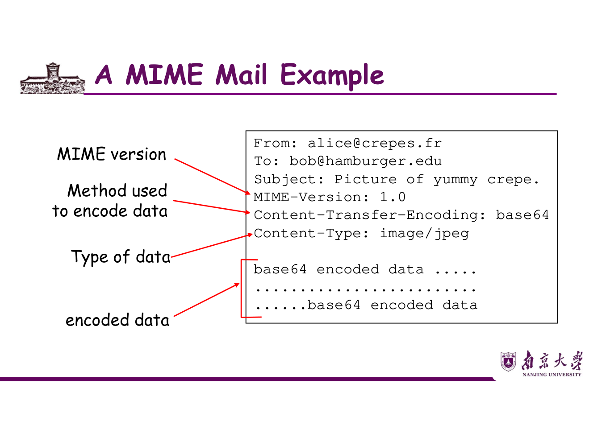

多部分邮件可使用 boundary 分隔不同部分，例如正文、图片、后续文本等。

## 4. FTP：文件传输协议

### 4.1 FTP 基本概念

FTP 来自 RFC 959。

特点：

- 使用 TCP。
- 端口 21 和 20。
- 用于向远程主机上传或从远程主机下载文件。
- 客户端/服务器模型。
- 客户端主动发起文件传输，可以上传也可以下载。
- 处理异构操作系统和文件系统。
- 需要对远程文件系统进行访问控制。

### 4.2 控制连接和数据连接

FTP 的重要特点是分离控制连接和数据连接。

过程：

- FTP 客户端联系服务器 21 端口，打开控制连接。
- 客户端通过控制连接完成授权。
- 客户端通过控制连接发送命令，浏览远程目录。
- 当服务器收到文件传输命令后，服务器打开第二条 TCP 数据连接用于文件传输。
- 每传输一个文件建立一条数据连接。
- 一个文件传完后，服务器关闭数据连接。
- 控制连接保持存在。

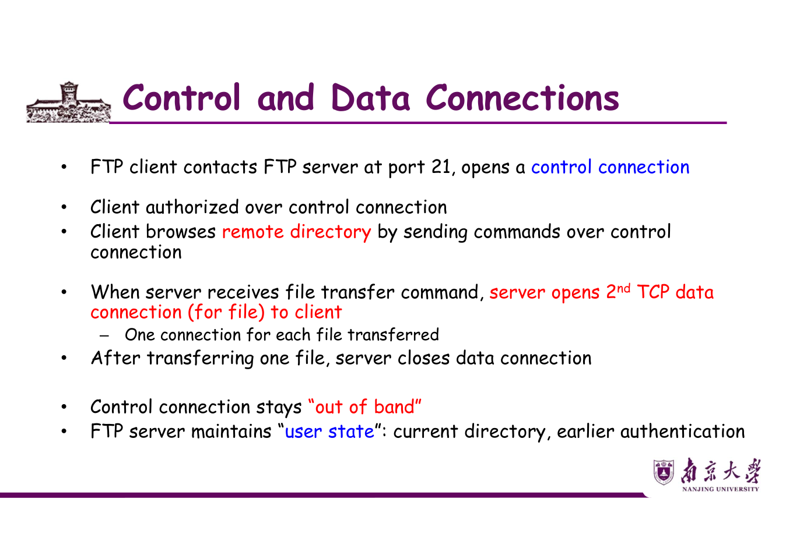

控制连接是 out-of-band，即带外控制。

FTP 服务器维护用户状态：

- 当前目录。
- 先前的认证状态。

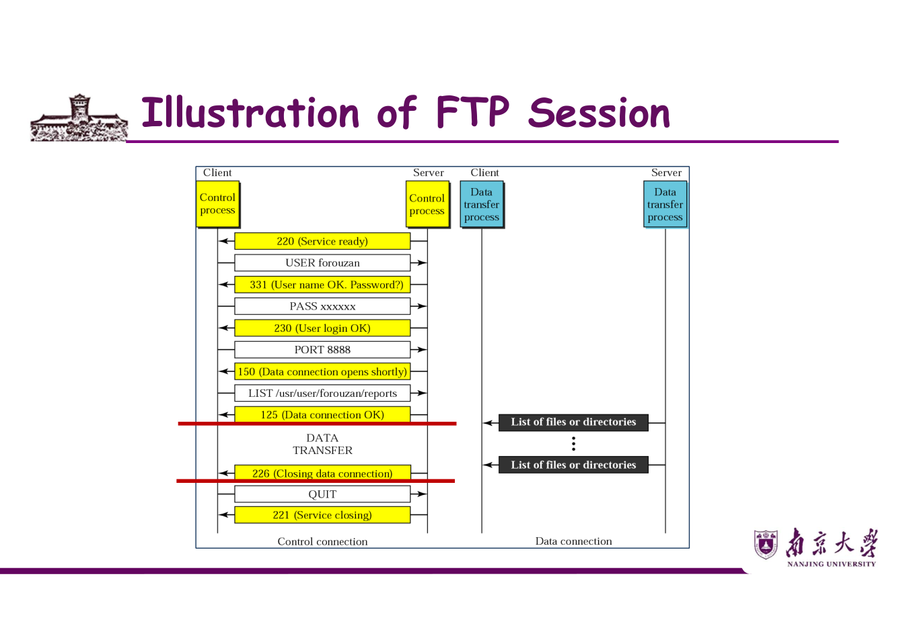

### 4.3 FTP 命令和响应

FTP 命令以 ASCII 文本通过控制通道发送。

常见命令：

- `USER username`
- `PASS password`
- `LIST`：返回当前目录文件列表。
- `RETR filename`：下载文件。
- `STOR filename`：上传文件到远程服务器。

返回码例子：

- `331 Username OK, password required`
- `125 data connection already open; transfer starting`
- `425 Can't open data connection`
- `452 Error writing file`

## 5. Web 与 HTTP

### 5.1 Web 历史

WWW 是通过 HTTP 链接起来的分布式页面数据库。

关键时间点：

- 1990 年：Tim Berners-Lee 在 CERN 实现第一个 HTTP。
- 1991 年：HTTP/0.9，支持简单 GET 命令。
- 1992 年：HTTP/1.0，支持客户端/服务器信息和简单缓存。
- 1996 年：HTTP/1.1，加入性能和安全优化。
- 2015 年：HTTP/2，使用单个 TCP 连接上的请求多路复用优化时延，改为二进制协议，并支持 server push。

### 5.2 Web 组成

Web 包含：

- 基础设施：客户端、服务器、DNS、CDN、数据中心。
- 内容：URL 命名内容，HTML 格式化内容。
- 信息交换协议：HTTP。

### 5.3 URL

URL 是 Uniform Resource Locator，用于唯一标识 WWW 上的对象。

格式：

```text
<protocol>://<host>:<port>/<path>?query_string
```

各部分含义：

- protocol：传输或解释对象的方法，如 http、ftp、Gopher。
- host：对象所在主机的 DNS 名称或 IP 地址。
- port：端口号。
- path：包含对象的文件路径。
- query_string：发送给服务器端应用的 name/value 对。

例子：

```text
http://www.nju.edu.cn:8080/somedir/page.htm
```

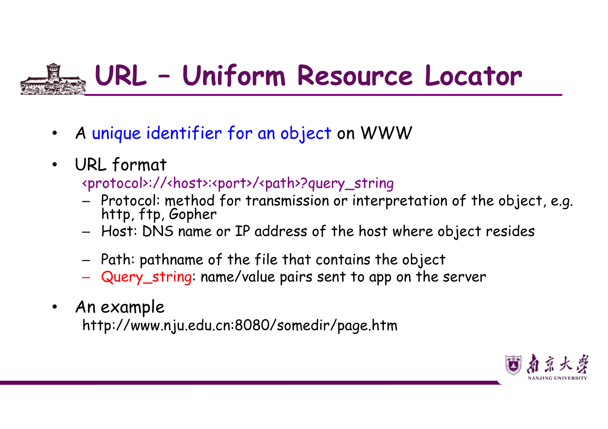

### 5.4 HTTP 基本特点

HTTP 是 Hyper Text Transfer Protocol。

特点：

- 客户端/服务器结构。
- 服务器 always-on，并且名字和地址是 well-known。
- 客户端主动联系服务器。
- 同步 request/reply 协议。
- 运行在 TCP 上。
- 默认端口 80。
- 无状态。
- HTTP/2 之前是 ASCII 文本格式。

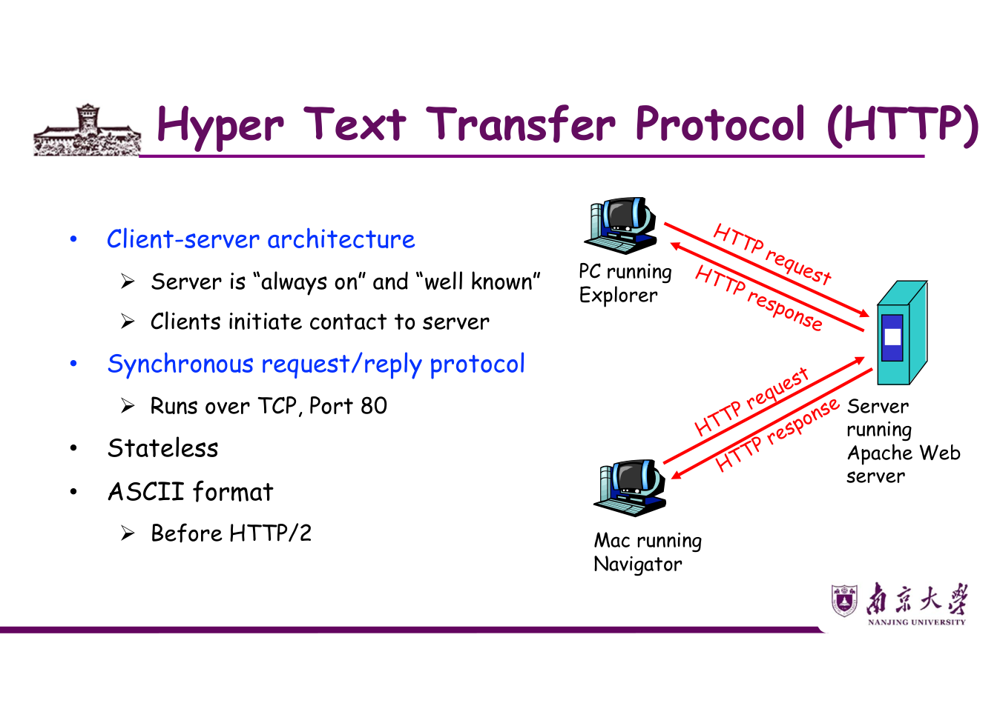

HTTP 请求/响应步骤：

1. 建立 TCP 连接。
2. 客户端发送 HTTP request。
3. 服务器返回 HTTP response。
4. 关闭连接，或者在持久连接中保持连接。

### 5.5 HTTP 方法

HTTP/1.1 常见方法：

- GET：请求资源。
- HEAD：只请求响应头，不要响应体。
- POST：向服务器发送信息，如表单数据。
- PUT：把实体主体中的文件上传到 URL 指定路径。
- DELETE：删除 URL 指定的文件。

### 5.6 HTTP 请求消息

HTTP 请求消息例子：

```http
GET /somedir/page.html HTTP/1.1
Host: www.someschool.edu
User-agent: Mozilla/4.0
Connection: close
Accept-language: fr

```

结构：

- request line：方法、资源、协议版本。
- header lines：头部行。
- 空行：表示消息头结束。

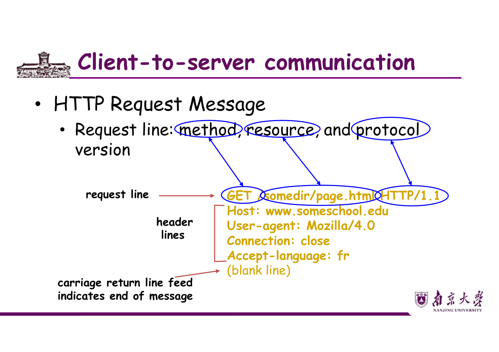

### 5.7 HTTP 响应消息

HTTP 响应消息例子：

```http
HTTP/1.1 200 OK
Connection: close
Date: Thu, 06 Jan 2017 12:00:15 GMT
Server: Apache/1.3.0 (Unix)
Last-Modified: Mon, 22 Jun 2006 ...
Content-Length: 6821
Content-Type: text/html

data data data data data ...
```

结构：

- status line：协议版本、状态码、状态短语。
- response headers：响应头。
- body：可选数据，如 HTML 文件。

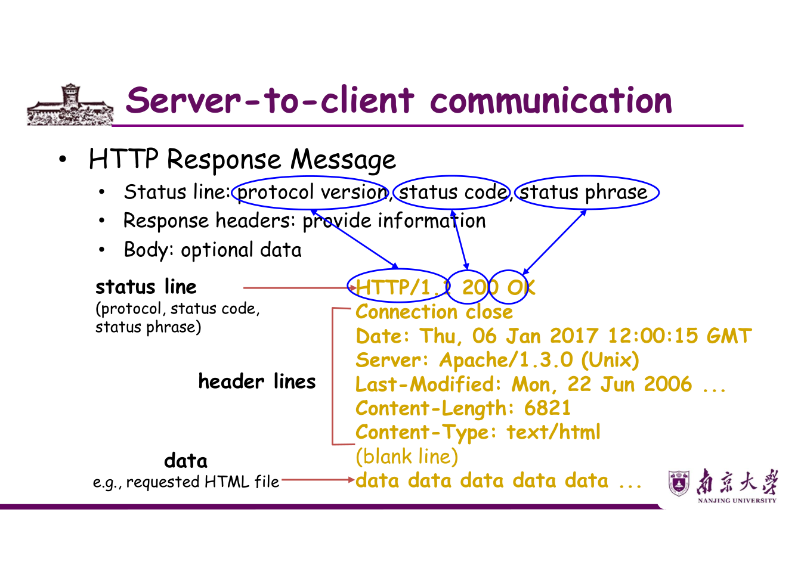

### 5.8 HTTP 无状态

HTTP 是无状态协议。

含义：

- 每个请求/响应被独立处理。
- 服务器不要求保留客户端状态。

优点：

- 提高服务器端可扩展性。
- 故障处理更简单。
- 可处理更高请求速率。
- 请求顺序不重要。

缺点：

- 一些应用需要持久状态。
- 需要识别用户或保存临时信息。
- 例子：购物车、用户画像、使用追踪。

### 5.9 Cookie：无状态协议中的状态

问题：无状态协议如何保持状态？

答案之一是 Cookie。

Cookie 是客户端侧状态维护机制：

- 客户端代表服务器保存少量状态。
- 服务器响应中通过 `Set-Cookie` 下发 Cookie。
- 客户端后续请求中通过 `Cookie` 把状态带回服务器。
- Cookie 可用于认证。

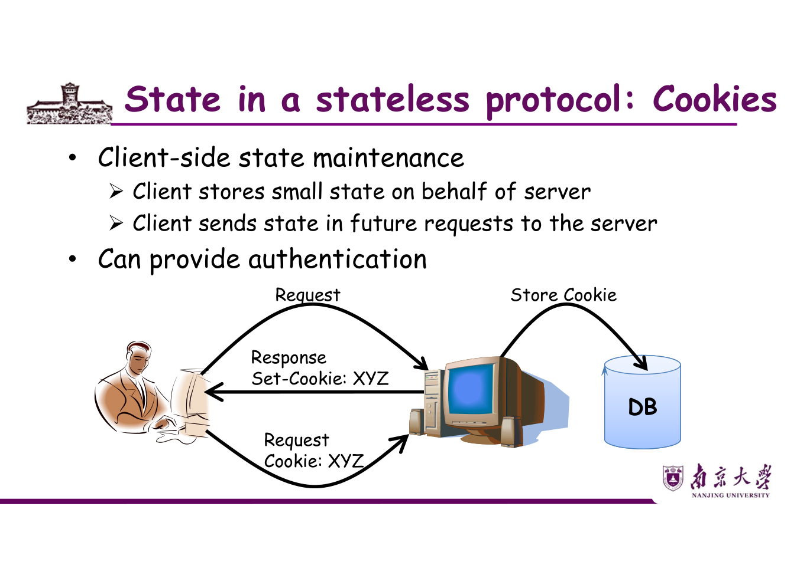

Cookie 示例：

- 用户访问 Amazon。
- Amazon 服务器为用户创建 ID，例如 1678。
- 响应中返回 `Set-Cookie: 1678`。
- 浏览器把 Cookie 存入 cookie file。
- 一周后用户再次访问，浏览器在请求中带上 `cookie: 1678`。
- 服务器根据 Cookie 查后台数据库，执行个性化操作。

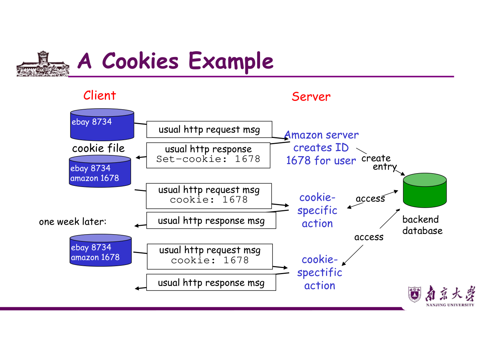

Cookie 能带来：

- 授权。
- 购物车。
- 推荐。
- 用户会话状态，例如 Web Email。

Cookie 与隐私：

- 服务器可通过 Cookie 了解大量用户信息。
- 用户可能向服务器提供姓名和邮箱。
- 搜索引擎可能跨站使用 Cookie 获取信息。
- 被攻击的浏览器可能滥用 Cookie。

## 6. Web 性能与缓存

### 6.1 Web 性能目标

用户目标：

- 快速下载。注意这不完全等同于低时延通信。
- 高可用。

内容提供者目标：

- 用户满意。
- 成本有效的基础设施。

网络目标：

- 避免过载。

优化方向：

- 改进网络协议，包括 HTTP、TCP 等。
- 缓存和复制。
- 利用规模经济，如 Web hosting、CDN、数据中心。

### 6.2 HTTP 性能问题

多数 Web 页面包含多个对象：

- HTML 文件。
- 嵌入图片。
- CSS。
- JavaScript。
- 其他资源。

朴素获取方式是一次取一个对象，每个小对象建立新的 TCP 连接。这会造成大量连接建立开销。

### 6.3 RTT 与对象响应时间

RTT 是 round-trip time，表示一个小分组从客户端到服务器再返回客户端的时间。

单个对象响应时间大致包括：

- 1 RTT：TCP 建立连接。
- 1 RTT：HTTP 请求发出并收到响应前几个字节。
- Transmission time：传输对象所需时间。

公式：

```text
对象响应时间 = 2 RTT + Transmission Time
```

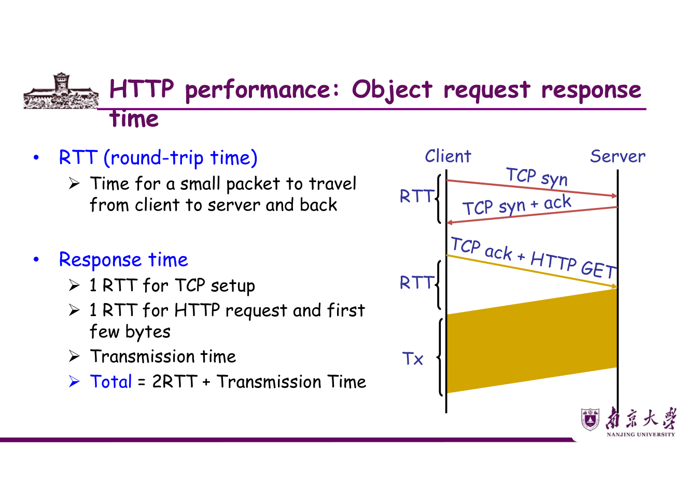

### 6.4 非持久连接

HTTP/1.0 默认使用非持久连接。

特点：

- 每个对象建立一条 TCP 连接。
- HTML 文件本身需要 `2 RTT + Δ`。
- HTML 中每个对象也各需要 `2 RTT + Δ`。
- 重复建立连接，效率低。

### 6.5 并发连接

并发请求和响应通过多条连接并行获取对象。

优点：

- 客户端体验更好。
- 内容提供者也可能更满意。

缺点：

- 不一定保持响应顺序。
- 对网络不友好，可能造成更多负载和竞争。

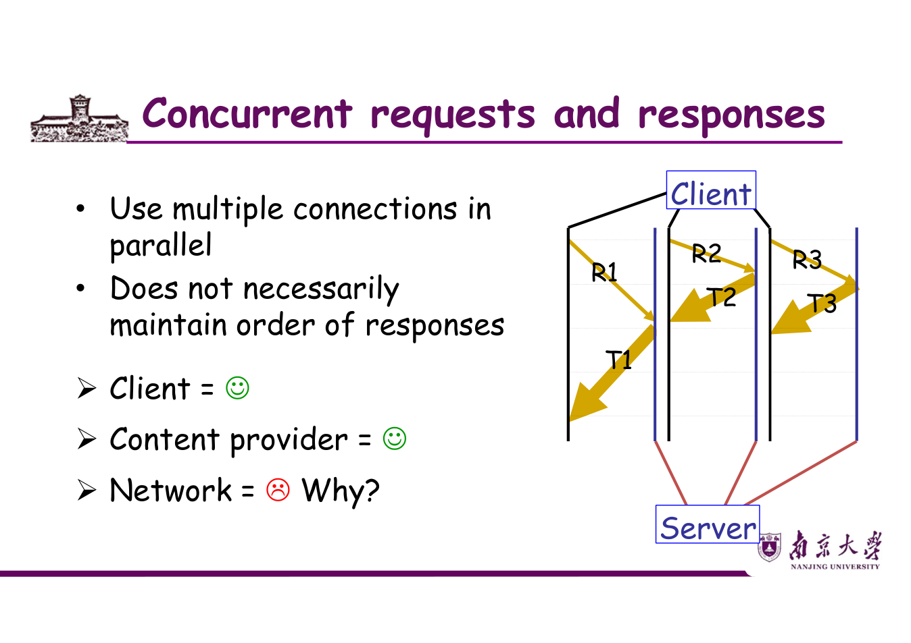

### 6.6 持久连接

HTTP/1.1 默认使用持久连接。

特点：

- 多个请求复用同一条 TCP 连接。
- 可包括当前页面之后的后续传输。
- 客户端或服务器都可以关闭连接。

优点：

- 避免反复建立和拆除连接的开销。
- 允许下层协议，如 TCP，学习 RTT 和带宽特征。

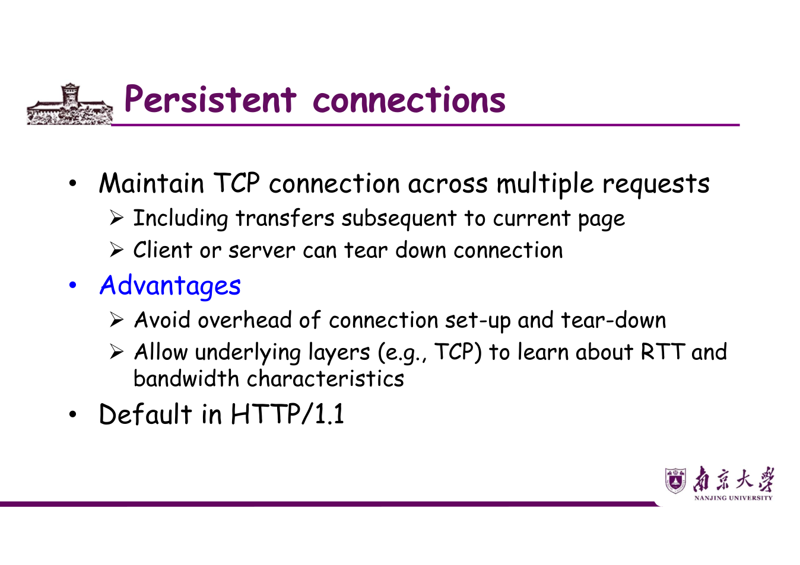

### 6.7 流水线

流水线请求/响应的思想：

- 批量发送请求和响应，减少分组数量。
- 多个请求可放入一个 TCP segment。
- 减少等待前一个响应完成后再发送下一个请求的开销。

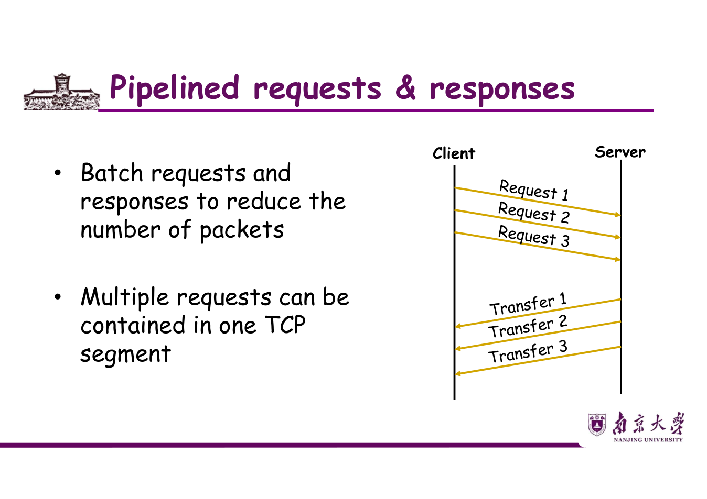

### 6.8 获取多个对象的性能对比

获取 n 个小对象时，时间主要受时延支配。

| 方式 | 近似时间 |
| --- | --- |
| 一次一个 | `~2n RTT` |
| m 个并发连接 | `~2[n/m] RTT` |
| 持久连接 | `~(n+1) RTT` |
| 流水线 | `~2 RTT` |
| 流水线 + 持久连接 | 第一次约 `~2 RTT`，之后约 `RTT` |

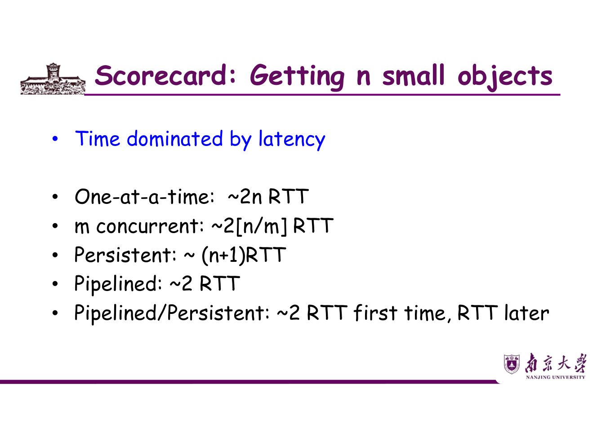

获取 n 个大对象时，每个大小为 F，时间主要受带宽支配。

| 方式 | 近似时间 |
| --- | --- |
| 一次一个 | `~ nF/B` |
| m 个并发连接 | `~ [n/m] F/B`，假设与大量用户共享且每条 TCP 连接获得相同带宽 |
| 流水线或持久连接 | `~ nF/B` |

结论：对于大对象，真正有帮助的是获得更多带宽。

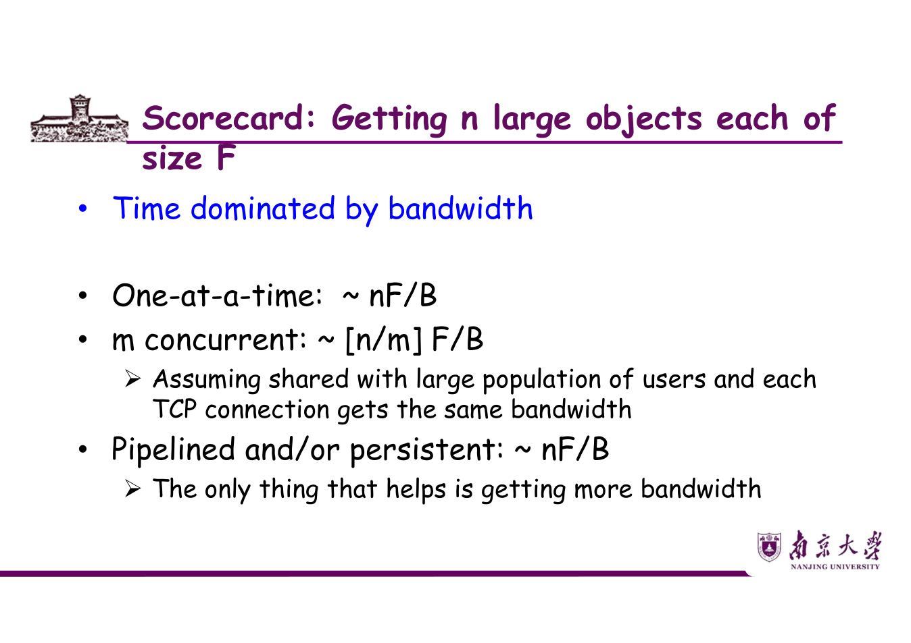

### 6.9 缓存为什么有效

缓存有效的原因是引用局部性：

- 许多用户会访问相同内容。
- 热门内容会被重复访问。
- 内容重叠很大。

但缓存也有限制：

- 仍有许多唯一请求。
- 缓存效果随缓存大小增长而增长，但常呈对数增长，即越往后收益越小。

### 6.10 HTTP 缓存机制

条件 GET 可减少不必要传输。

请求头示例：

```http
GET /somedir/page.html HTTP/1.1
Host: www.someschool.edu
User-agent: Mozilla/4.0
If-modified-since: Wed, 18 Jan 2017 10:25:50 GMT

```

机制：

- 客户端在请求中指定 `If-modified-since` 时间。
- 服务器把该时间和资源的 `Last-Modified` 时间比较。
- 如果资源没有变化，服务器返回 Not Modified。
- 如果资源变化，服务器返回 OK 和最新版本。

响应头还可以包含：

- `Expires`：资源可安全缓存多久。
- `No-cache`：忽略所有缓存，必须直接从服务器获取。

### 6.11 缓存放在哪里

缓存位置：

- Client，也就是浏览器缓存。
- Forward proxies，正向代理。
- Reverse proxies，反向代理。
- CDN。

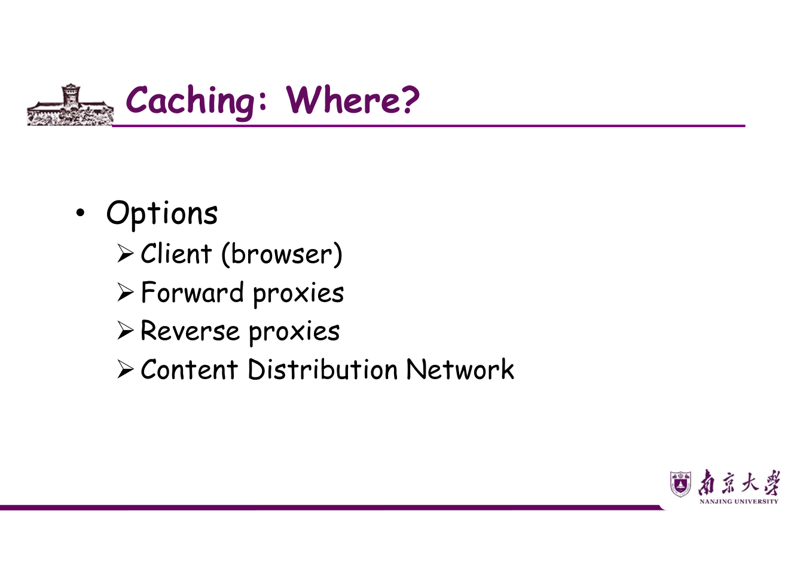

#### 反向代理缓存

反向代理靠近服务器。

作用：

- 缓存文档。
- 降低源服务器负载。
- 通常由内容提供者部署。

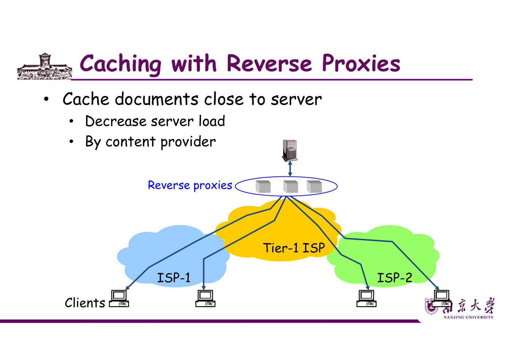

#### 正向代理缓存

正向代理靠近客户端。

作用：

- 缓存文档。
- 减少网络流量。
- 降低客户端访问时延。
- 通常由 ISP 或企业部署。

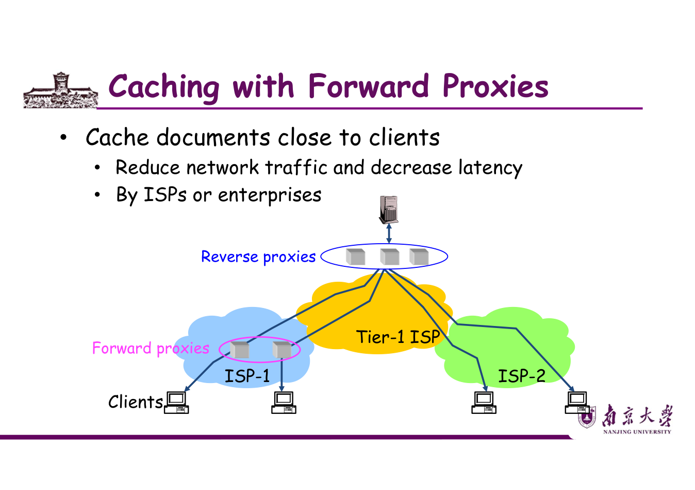

### 6.12 HTTP/1.1 与 HTTP/2

课件总结：

- HTTP/1.1 是文本协议。
- HTTP/2 是二进制协议，正在替代 HTTP/1.1。
- Web 性能优化方式包括：
  - 流水线和批处理。
  - 代理和 CDN 中缓存。
  - 数据中心。

## 7. CDN：内容分发网络

### 7.1 CDN 要解决的问题

挑战：

- 从单一 origin server 实时传输大文件，如视频。
- 保护源服务器免受 DDoS 攻击。

解决方案：

- 在 Internet 上数百台服务器复制内容。
- CDN 分发节点协调内容分发。
- 把内容放到离用户更近的位置。

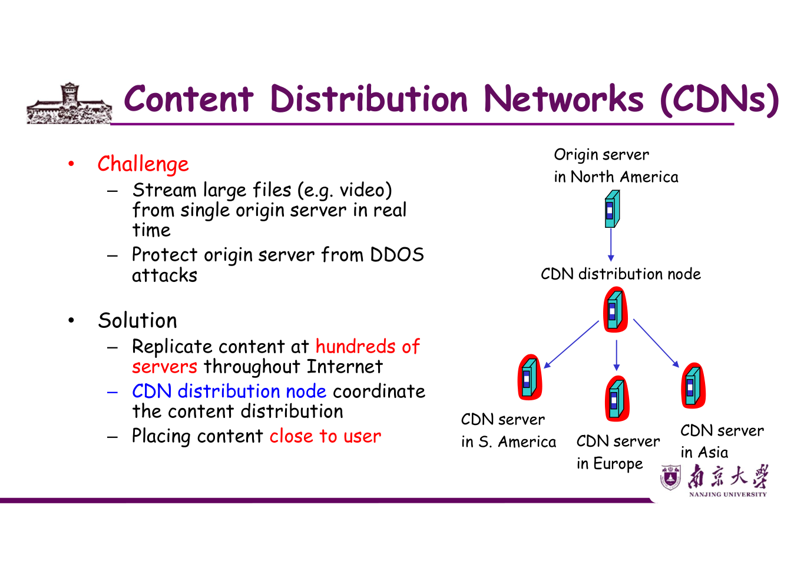

### 7.2 内容复制

CDN 中：

- 内容提供者的 origin server 是 CDN 的客户。
- CDN 把客户内容复制到 CDN 服务器。
- 内容提供者更新内容时，CDN 更新自己的服务器。
- 使用权威 DNS 服务器重定向用户请求。

### 7.3 CDN 支撑技术

CDN 使用多种技术：

- DNS：一个名字映射到多个地址。
- Routing：基于内容的路由，选择最近或最合适的 CDN 服务器。
- URL rewriting：重写 URL。
- Redirection strategy：重定向策略，考虑负载均衡、网络时延、缓存或内容局部性。

URL rewriting 例子：

```text
http://www.sina.com/sports/tennis.mov
```

可被替换为：

```text
http://www.cdn.com/www.sina.com/sports/tennis.mov
```

### 7.4 CDN 工作过程

课件中的 CDN operation：

1. URL rewriting 获取权威服务器，或通过 DNS 获取附近 CDN 服务器 IP。
2. CDN 缓存预热，必要时从 origin server 获取内容。
3. 客户端从 CDN Server 取回页面或媒体。

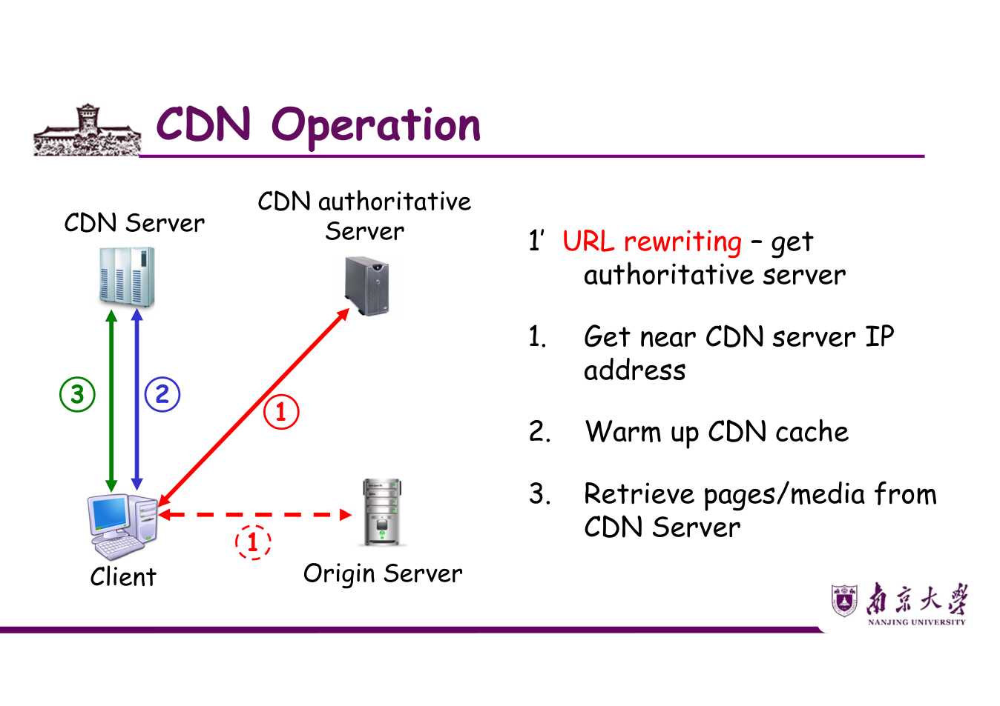

### 7.5 CDN 重定向

CDN 会创建一张 map，表示叶子 ISP 与 CDN 服务器之间的距离或代价。

当查询到达 CDN 的权威 DNS 服务器时：

- 服务器判断查询来自哪个 ISP。
- 使用 map 选择最佳 CDN 服务器。
- 将用户引导到合适的 CDN 节点。

CDN 服务器共同构成一个应用层覆盖网络。

## 8. 本章重点总结

### 8.1 必须掌握的概念

- 网络应用是运行在端系统中的分布式进程。
- 应用层协议定义消息类型、语法、语义和交互规则。
- 应用体系结构主要有客户端/服务器和 P2P。
- DNS 是层次化、分布式的域名解析系统。
- DNS 不能中心化，因为单点故障、流量、距离和维护都不可扩展。
- DNS 包含根服务器、TLD 服务器、权威 DNS 服务器、本地 DNS 服务器。
- DNS 查询常结合递归查询和迭代查询。
- DNS 资源记录格式是 `(name, value, type, ttl)`。
- DNS 使用 UDP 53 端口，也支持 TCP。
- DNS 缓存通过 TTL 控制有效期。
- 邮件系统由用户代理、邮件服务器、SMTP 和邮件访问协议组成。
- SMTP 使用 TCP 25 端口，负责服务器之间邮件传输。
- POP3 用于下载邮件，IMAP 适合服务器端管理和多设备访问。
- MIME 让邮件可以携带图片、音频、视频等非文本内容。
- FTP 使用控制连接和数据连接，控制连接在 21 端口。
- HTTP 是基于 TCP 的客户端/服务器、请求/响应、无状态协议。
- Cookie 用于在无状态 HTTP 中保存客户端侧状态。
- Web 性能受 RTT、对象数量、带宽、连接方式影响。
- 持久连接和流水线可减少连接与等待开销。
- 缓存利用引用局部性减少延迟和服务器负载。
- CDN 通过复制、DNS 重定向、URL 重写等方式把内容放近用户。

### 8.2 易混点

#### 网络应用 vs 应用层协议

- 网络应用是完整应用，例如 Web、Email。
- 应用层协议只是应用的一部分，规定进程之间如何交换消息。

#### 递归查询 vs 迭代查询

- 递归查询：被查询服务器负责继续查下去并返回最终结果。
- 迭代查询：被查询服务器返回下一步该问谁。

#### 本地 DNS 服务器 vs 权威 DNS 服务器

- 本地 DNS 服务器通常由 ISP、公司或学校提供，是主机查询入口。
- 权威 DNS 服务器保存某个域的权威记录。

#### SMTP vs POP3/IMAP

- SMTP 用于发送和转发邮件。
- POP3/IMAP 用于用户从邮件服务器读取邮件。

#### FTP 控制连接 vs 数据连接

- 控制连接传命令和响应，持续存在。
- 数据连接传文件，每个文件通常一条连接。

#### HTTP 无状态 vs Cookie

- HTTP 协议本身不保存状态。
- Cookie 让客户端在后续请求中带回服务器需要的状态信息。

#### 非持久连接 vs 持久连接

- 非持久连接每个对象一条 TCP 连接。
- 持久连接多个请求复用一条 TCP 连接。

#### 正向代理 vs 反向代理

- 正向代理靠近客户端，通常由 ISP 或企业部署。
- 反向代理靠近服务器，通常由内容提供者部署。

### 8.3 常用端口和协议

| 协议 | 端口 | 作用 |
| --- | --- | --- |
| DNS | UDP 53，支持 TCP | 域名解析 |
| SMTP | TCP 25 | 邮件发送与转发 |
| FTP 控制连接 | TCP 21 | FTP 命令和响应 |
| FTP 数据连接 | TCP 20 或动态连接 | FTP 文件数据传输 |
| HTTP | TCP 80 | Web 请求与响应 |

### 8.4 常用公式和性能结论

```text
单个 HTTP 对象响应时间 = 2 RTT + Transmission Time
```

```text
获取 n 个小对象，一次一个：约 2n RTT
```

```text
获取 n 个小对象，m 个并发：约 2[n/m] RTT
```

```text
持久连接获取 n 个小对象：约 (n+1) RTT
```

```text
流水线获取小对象：约 2 RTT
```

```text
获取 n 个大对象，每个大小 F，带宽 B：约 nF/B
```

## 9. 复习检查题

1. 应用层协议规定了哪些内容？
2. 客户端/服务器模式和 P2P 模式分别有什么优缺点？
3. 为什么 DNS 不能设计成一个中心数据库？
4. DNS 的三种层次分别是什么？
5. 根 DNS 服务器、TLD 服务器、权威 DNS 服务器、本地 DNS 服务器分别负责什么？
6. DNS 解析 `gaia.cs.umass.edu` 时，本地 DNS 服务器大致会依次联系哪些服务器？
7. DNS 资源记录 `(name, value, type, ttl)` 中每个字段是什么意思？
8. DNS 缓存如何工作？TTL 的作用是什么？
9. DNS poisoning 是什么？为什么危险？
10. 电子邮件投递为什么需要 SMTP 和 POP3/IMAP 两类协议？
11. SMTP 为什么仍然不能保证用户端到端收到邮件？
12. POP3 的 download and delete 模式有什么问题？
13. IMAP 为什么适合多设备访问？
14. MIME 如何让电子邮件支持图片和视频？
15. FTP 为什么要分控制连接和数据连接？
16. URL 的各个组成部分分别是什么？
17. HTTP 请求消息和响应消息分别由哪些部分组成？
18. HTTP 无状态带来什么优点和问题？
19. Cookie 如何在无状态 HTTP 中保存状态？
20. 为什么非持久 HTTP 对许多小对象效率低？
21. 持久连接和流水线分别优化了什么？
22. 缓存为什么有效？`If-modified-since` 如何减少传输？
23. 正向代理和反向代理有什么区别？
24. CDN 如何利用 DNS 或 URL 重写把用户导向合适服务器？
