# 第 3 章 运输层

> 本章核心问题：
>
> 1. 为什么 IP 已经能传分组，还需要运输层？
> 2. 端系统如何通过端口、socket 完成复用和分用？
> 3. 在不可靠网络上如何设计可靠传输？
> 4. 停等协议为什么低效？滑动窗口如何提升利用率？
> 5. GBN 和 Selective Repeat 有什么区别？
> 6. UDP 提供了什么，为什么还需要 UDP？
> 7. TCP 如何实现可靠、有序、字节流服务？
> 8. TCP 如何建立连接、释放连接？
> 9. TCP 如何做流量控制和拥塞控制？

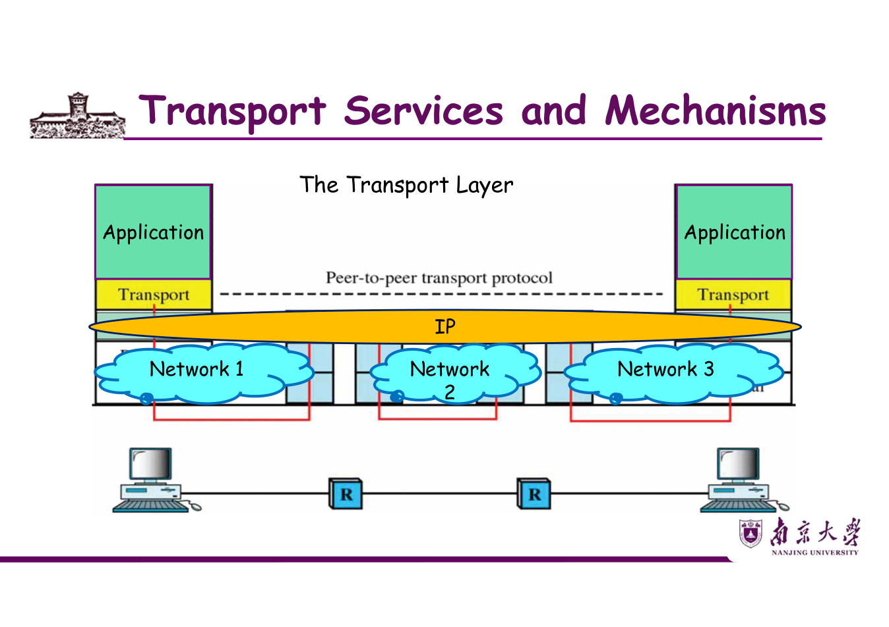

## 0. 课前回顾：第二章性能与 CDN

第三章第一份课件前半部分包含第二章 Web 性能和 CDN 的回顾，核心知识点如下。

### 0.1 获取 Web 对象的性能

获取 n 个小对象时，时间主要由时延支配：

- 一次一个对象：约 `2n RTT`。
- m 个并发连接：约 `2[n/m] RTT`。
- 持久连接：约 `(n+1) RTT`。
- 流水线：约 `2 RTT`。
- 流水线加持久连接：首次约 `2 RTT`，之后约 `RTT`。

获取 n 个大对象，每个大小为 F 时，时间主要由带宽支配：

- 一次一个：约 `nF/B`。
- m 个并发：约 `[n/m]F/B`，假设每条 TCP 连接获得相同带宽。
- 流水线或持久连接：约 `nF/B`。
- 对大对象真正有帮助的是增加带宽。

### 0.2 缓存

缓存有效是因为引用局部性：

- 许多用户会重复访问相同内容。
- 热门内容访问频繁。
- 内容重叠很大，但仍有许多唯一请求。
- 缓存效果会随缓存大小增加而提升，但通常收益逐渐递减。

HTTP 缓存机制：

- `If-modified-since`：客户端询问资源自某时间后是否修改。
- 如果未修改，服务器返回 Not Modified。
- 如果已修改，服务器返回 OK 和新版本。
- `Expires`：说明资源可安全缓存多久。
- `No-cache`：忽略缓存，必须直接向服务器获取。

缓存位置：

- 浏览器。
- 正向代理。
- 反向代理。
- CDN。

### 0.3 CDN

CDN 要解决的问题：

- 从单个源服务器实时传输大文件很困难。
- 源服务器容易成为瓶颈或 DDoS 目标。

CDN 方法：

- 在 Internet 多处复制内容。
- 用 CDN 分发节点协调内容分发。
- 将内容放到离用户更近的位置。
- 通过 DNS、内容路由、URL 重写和重定向策略选择合适节点。

## 1. 运输层基础

### 1.1 运输层提供什么服务

运输层为运行在不同主机上的应用进程提供逻辑通信。

发送端：

- 接收应用层消息。
- 将应用消息切分为 segment。
- 把 segment 交给网络层。

接收端：

- 从网络层接收 segment。
- 将 segment 重组为消息。
- 把消息交给应用层。

Internet 常见运输层协议：

- TCP
- UDP

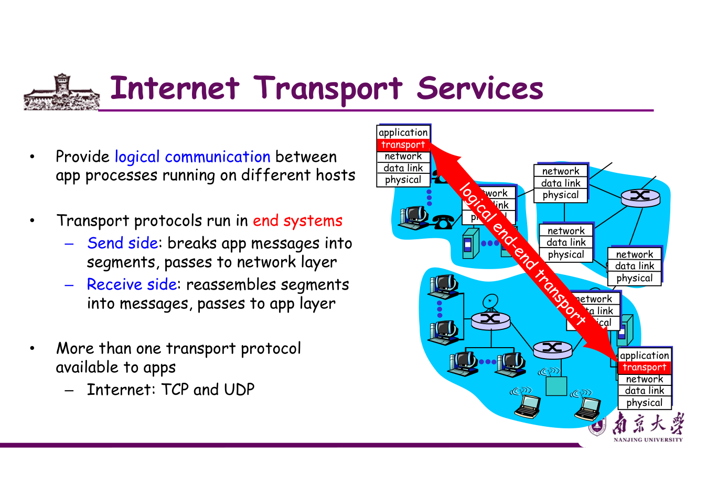

### 1.2 为什么需要运输层

IP 分组的地址是主机级别的，但端到端通信实际上发生在主机中的应用进程之间。

因此需要运输层解决：

- 哪些分组应该交给哪个应用，也就是复用和分用。
- IP 只提供 best-effort 服务，服务模型较弱。
- 分组可能损坏、延迟、丢失、乱序、重复。
- IP 不指导应用该发送多少流量、何时发送。
- 让每个应用开发者自己处理这些问题太繁琐。

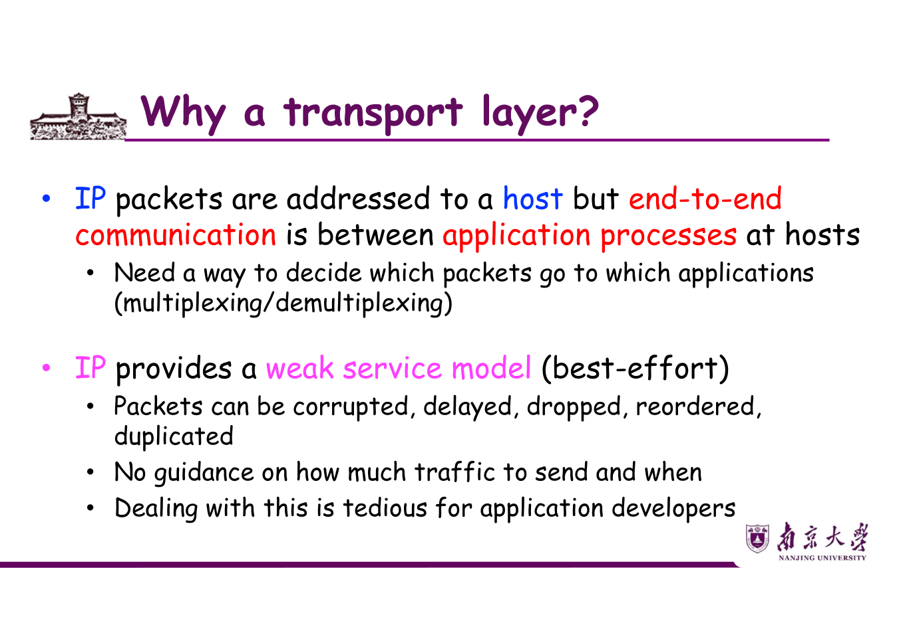

### 1.3 运输层的角色

运输层主要承担两类职责。

第一，提供进程之间的通信：

- 从多个应用进程复用数据。
- 将收到的数据分用给正确应用进程。
- 通过端口实现。

第二，可选地为应用层提供通用端到端服务：

- 可靠、有序的数据交付。
- 合理节奏的数据交付。
- 避免发送过快压垮网络。
- 避免发送过慢导致效率低。

UDP 是极简运输协议，只提供复用/分用能力。

TCP 提供可靠、有序、字节流抽象，并带有拥塞控制，但不保证具体时延、带宽等性能。

### 1.4 Socket

Socket 是应用进程与操作系统运输层交换网络消息的软件抽象。

运输层地址通常写为：

```text
<HostIP, Port>
```

重要 socket 类型：

- UDP socket：`SOCK_DGRAM`。
- TCP socket：`SOCK_STREAM`。

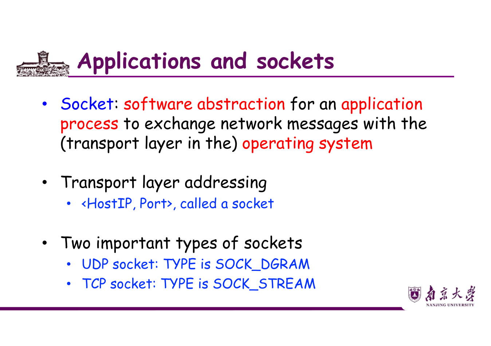

### 1.5 端口

端口是 16-bit 数字，用来区分主机上的不同应用。

端口特点：

- 运输层首部携带源端口号和目的端口号。
- Well-known ports：0 到 1023。
- Ephemeral ports：临时端口，通常由客户端临时使用。
- 操作系统保存 socket 和端口之间的映射。

UDP 的 socket 映射：

```text
(local port, local IP address) <-> socket
```

TCP 的 socket 映射：

```text
(local port, local IP, remote port, remote IP) <-> socket
```

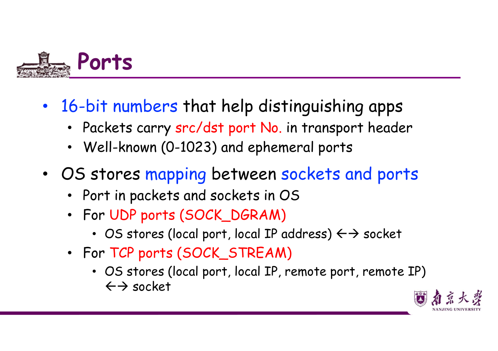

### 1.6 复用与分用

复用 Multiplexing：

- 发送端从不同 socket 收集数据块。
- 添加运输层首部。
- 交给网络层发送。

分用 Demultiplexing：

- 接收端查看收到 segment 的首部信息。
- 将数据交给正确 socket。

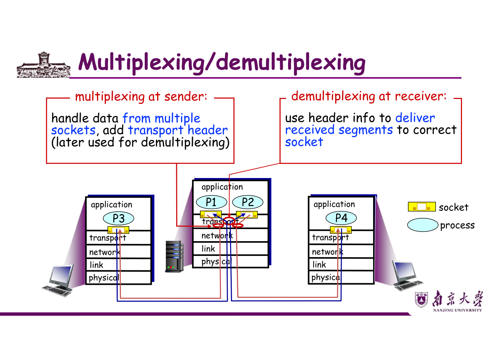

主机接收 IP datagram 时：

- 每个 datagram 有源 IP 地址、目的 IP 地址。
- 每个 datagram 承载一个运输层 segment。
- 每个 segment 有源端口号、目的端口号。
- 主机使用 IP 地址和端口号把 segment 导向合适 socket。

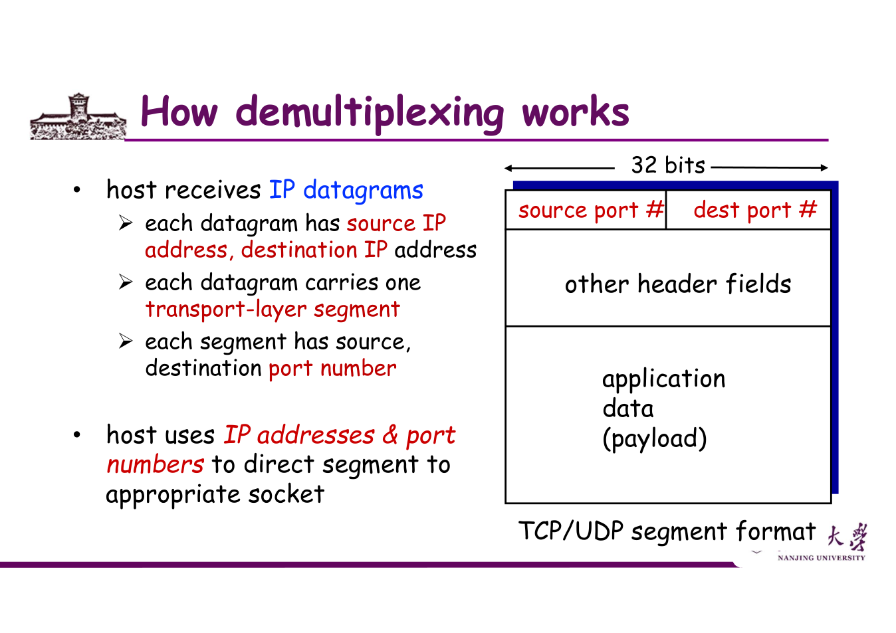

### 1.7 无连接分用：UDP

UDP socket 有主机本地端口号。

创建示例：

```java
DatagramSocket mySocket1 = new DatagramSocket(12534);
```

当主机收到 UDP segment 时：

- 检查 segment 中的目的端口号。
- 将 UDP segment 交给该端口对应的 socket。

发送 UDP datagram 时必须指定：

- 目的 IP 地址。
- 目的端口号。

结论：

- 如果多个 IP datagram 的目的端口相同，即使源 IP 或源端口不同，也会被导向目的主机上的同一个 UDP socket。

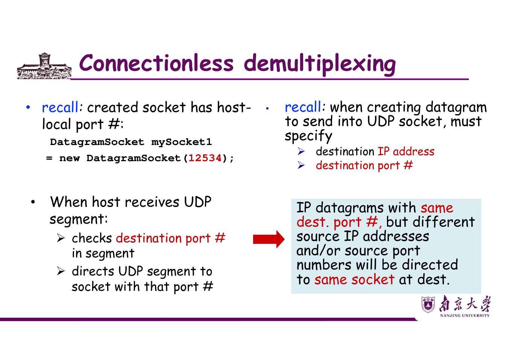

### 1.8 面向连接分用：TCP

TCP socket 由四元组标识：

```text
(source IP, source port, destination IP, destination port)
```

接收端用这四个值把 segment 导向正确 socket。

服务器可以同时支持很多 TCP socket：

- 每个 socket 由自己的四元组标识。
- Web 服务器会为不同客户端连接维护不同 socket。
- 非持久 HTTP 中，每个请求可能对应不同 socket。

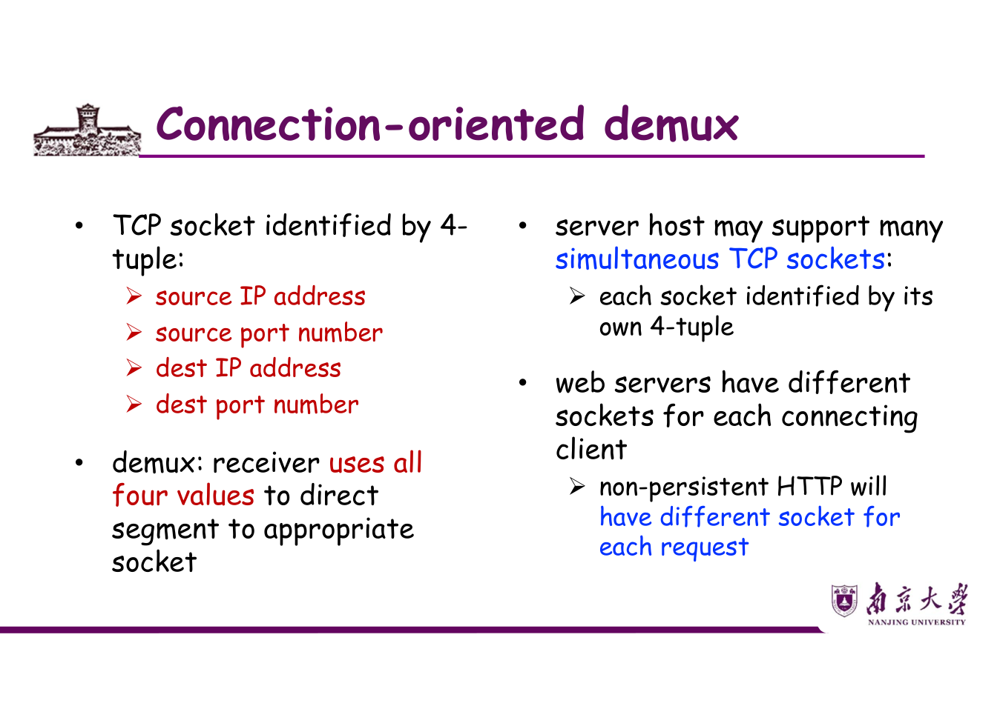

例子：

- 三个 segment 都发往服务器 B 的 IP，目的端口都是 80。
- 但源 IP 或源端口不同。
- TCP 会把它们分用到不同连接 socket。

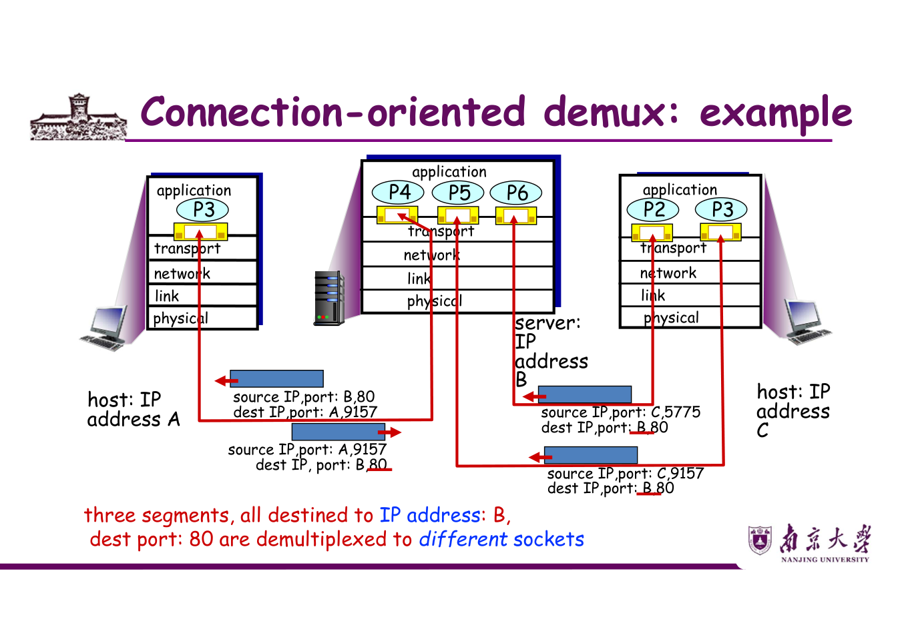

## 2. 可靠传输设计

### 2.1 为什么可靠传输困难

如果网络是完美的，可靠传输很简单：

- 发送方发送分组。
- 接收方等待分组。

但 IP 的 best-effort 网络可能发生：

- 分组损坏，出现 bit errors。
- 分组丢失。
- 分组延迟。
- 分组乱序。
- 分组重复。

### 2.2 可靠传输的基本机制

为了应对这些问题，需要组合多种机制：

- Checksum：检测损坏。
- ACK：接收方告诉发送方分组正确收到。
- NACK：接收方告诉发送方分组有错误。
- Sequence numbers：标识分组，处理重复和乱序。
- Retransmissions：发送方重传分组。
- Timeouts：判断何时重传。
- Forward error correction：无需重传也能掩盖部分错误。
- Network coding：更高效地修复错误。

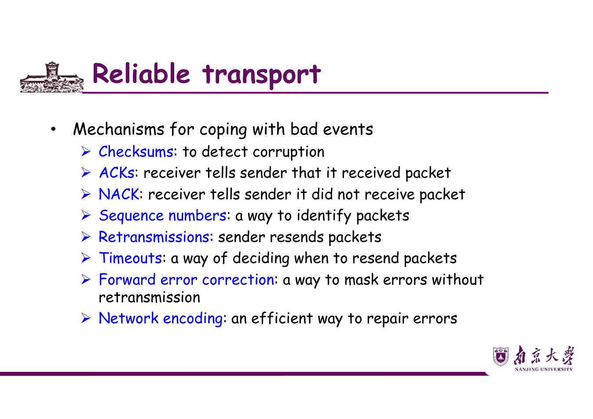

### 2.3 处理分组损坏

基本思路：

- 接收方用 checksum 检查分组。
- 如果正确，发送 ACK。
- 如果错误，发送 NACK。
- 发送方收到 NACK 后重传分组。

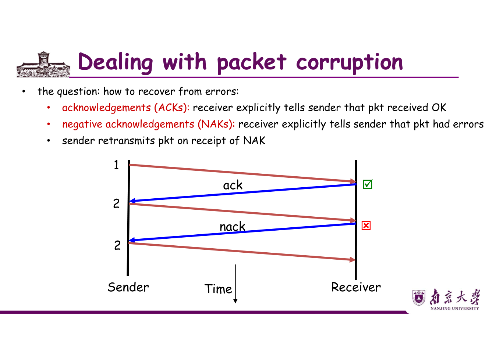

如果 ACK/NACK 自己也损坏，就会产生歧义：发送方不知道接收方到底确认的是哪个分组。

解决方法：

- 数据分组携带序号。
- ACK 分组也携带序号或确认信息。
- 发送方和接收方用序号判断重复和新数据。

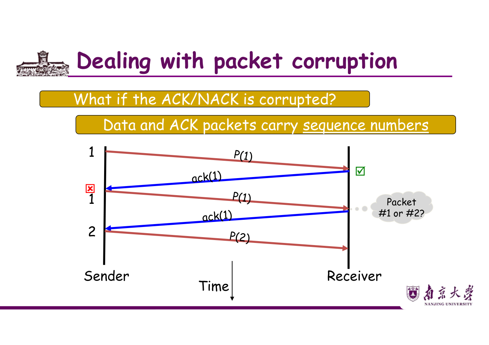

### 2.4 处理分组丢失

定时器驱动的丢失检测：

- 发送分组时启动定时器。
- 如果超时前没有收到确认，则重传。

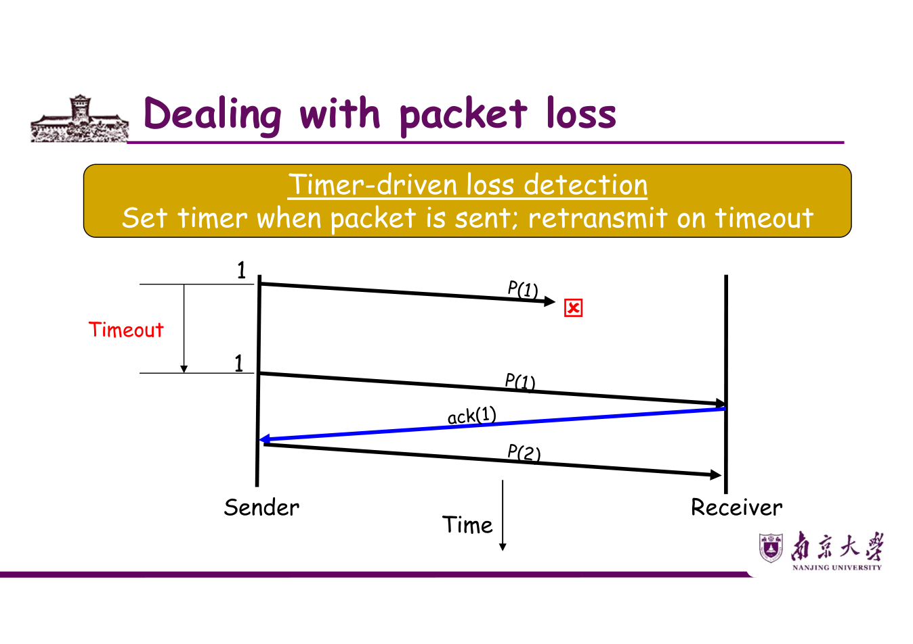

如果 ACK 丢失，也可能导致发送方超时重传，接收方会看到重复分组。因此需要序号来识别重复。

### 2.5 可靠传输方案组件

可靠传输至少需要：

- Checksum：检测 bit errors。
- Timer：检测丢失。
- ACK 或 NACK：通知接收结果。
- Sequence number：处理重复。

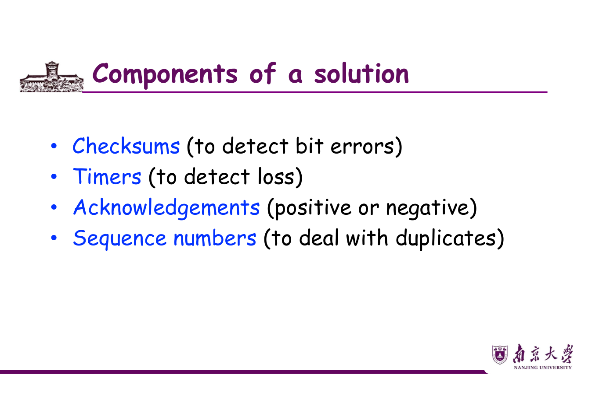

## 3. 停等协议与流水线

### 3.1 Stop and Wait

停等协议是正确但低效的可靠传输协议。

发送方：

1. 发送分组 `I`。
2. 设置或重置定时器。
3. 等待 ACK。
4. 如果收到 ACK，则 `I++`，继续发送下一个。
5. 如果收到 NACK 或超时，则重传当前分组。

接收方：

1. 等待分组。
2. 如果分组正确，发送 ACK。
3. 否则发送 NACK。
4. 重复。

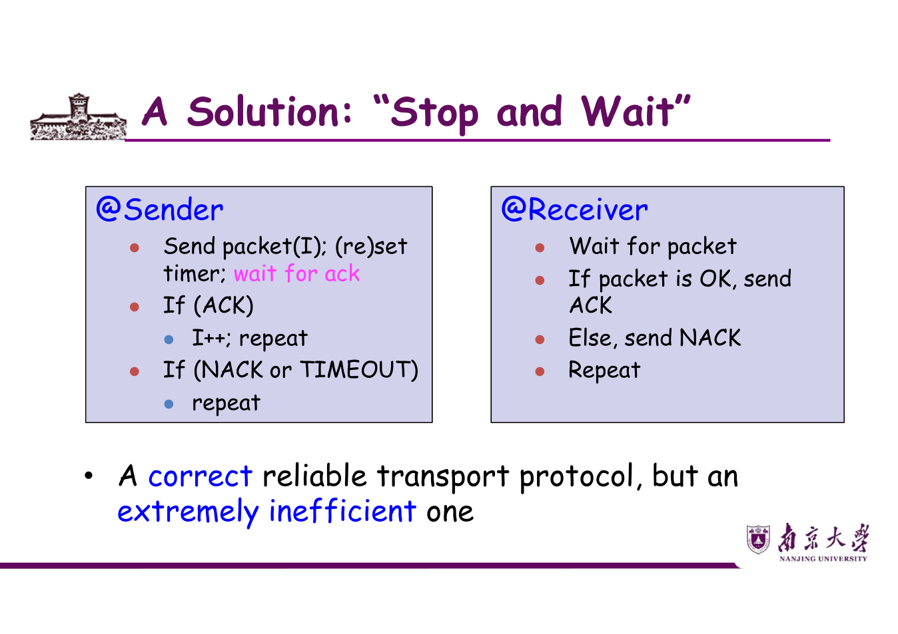

### 3.2 停等协议为什么低效

如果 `L/R << RTT`，则停等协议吞吐量近似为：

```text
Throughput ≈ DATA / RTT
```

其中：

- L：分组大小。
- R：链路带宽。
- RTT：往返时间，约等于 `2 * PropDelay`。

发送方利用率：

```text
U_sender = (L/R) / (RTT + L/R)
```

课件例子：

- 链路速率：1 Gbps。
- 传播时延：15 ms。
- 分组大小：8000 bit。
- RTT = 30 ms。
- `Dtrans = 8000 / 10^9 = 8 microseconds`。
- `U_sender = 0.008 / 30.008 ≈ 0.00027`。
- 在 1 Gbps 链路上实际吞吐量只有约 33 KB/s。

结论：协议设计可能严重限制物理资源利用率。

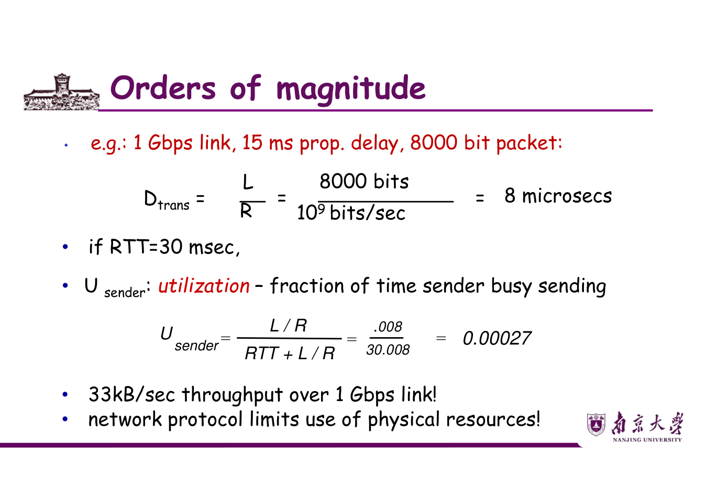

### 3.3 流水线协议

流水线允许发送方同时发送多个已经发出但尚未确认的分组，也就是允许多个 in-flight packets。

需要：

- 更大的序号范围。
- 发送方和/或接收方缓冲。

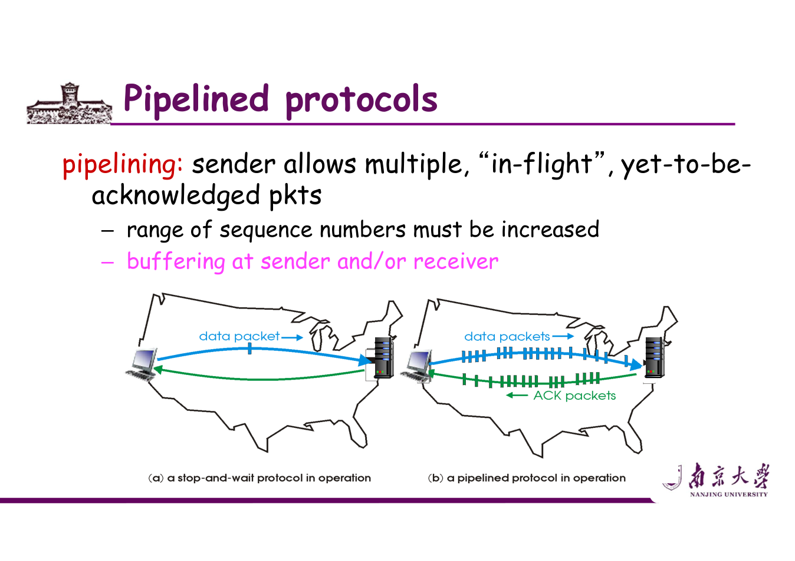

流水线能显著提高利用率。例如 3 个分组流水线可以将利用率提高约 3 倍。

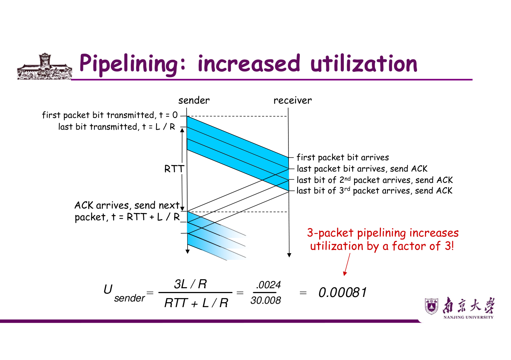

## 4. 滑动窗口协议

### 4.1 三个设计问题

可靠流水线协议需要回答三个问题：

1. 发送方可以发送哪些分组？
   - 滑动窗口。
2. 接收方如何确认分组？
   - 累积 ACK。
   - 选择 ACK。
3. 发送方应该重传哪些分组？
   - Go-Back-N。
   - Selective Repeat。

### 4.2 滑动窗口基本思想

窗口是一组相邻序号。

- 窗口大小是这组序号的数量，假设为 n。
- 发送方一次最多发送 n 个分组。
- 发送方只能发送窗口内分组。
- 接收方只能接收窗口内分组。
- 成功接收或确认后，窗口向前滑动。
- 窗口包含所有可能仍在传输中的分组。

滑动窗口也常被称为 packets in flight。

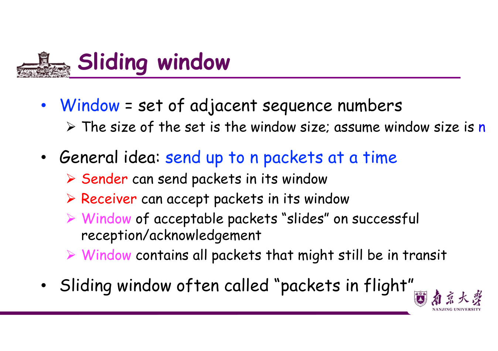

设：

- A 是发送方已经连续确认的最后一个分组。
- 发送方窗口为 `{A+1, A+2, ..., A+n}`。
- B 是接收方已经连续收到的最后一个分组。
- 接收方窗口为 `{B+1, ..., B+n}`。

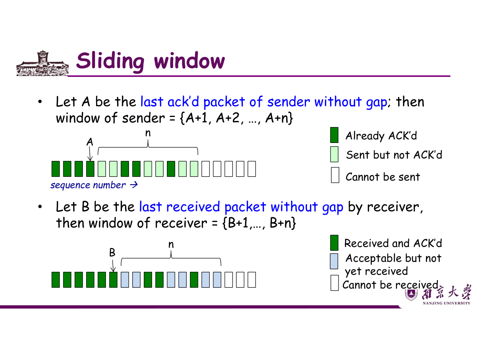

### 4.3 滑动窗口吞吐量

如果窗口大小为 n，则吞吐量大致为：

```text
MIN(n * DATA / RTT, Link Bandwidth)
```

停等协议吞吐量为：

```text
DATA / RTT
```

窗口过大时，可能带来拥塞、缓冲压力和丢包。

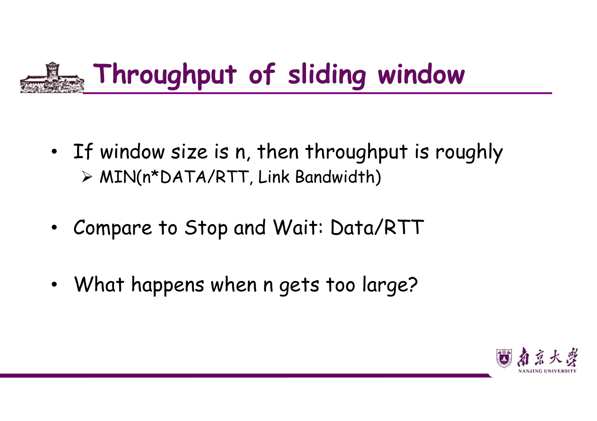

### 4.4 ACK 策略

滑动窗口中常见两种 ACK：

#### 累积 ACK

ACK 携带接收方期望的下一个按序分组序号。

如果接收方已经连续收到 `B+1` 和 `B+2`，则发送：

```text
ACK(B+3)
```

含义：B+2 以及之前的分组都已按序收到，接下来期望 B+3。

如果收到的是乱序分组，比如 B+4、B+5，但 B+1 还没到，则仍发送：

```text
ACK(B+1)
```

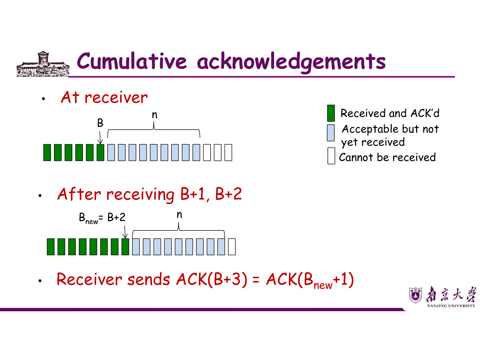

#### 选择 ACK

Selective ACK 会单独确认正确收到的分组。

优点：

- 信息更精确。
- 可减少不必要重传。

缺点：

- 需要更复杂的记录和缓冲管理。

### 4.5 Go-Back-N

GBN 规则：

- 发送方最多发送 n 个未确认分组。
- 接收方只接受按序分组。
- 接收方丢弃乱序分组。
- 接收方使用累积 ACK，ACK 序号表示下一个期望的按序分组。
- 发送方为第一个未确认分组设置定时器。
- 如果超时，重传 `A+1` 到 `A+n`。

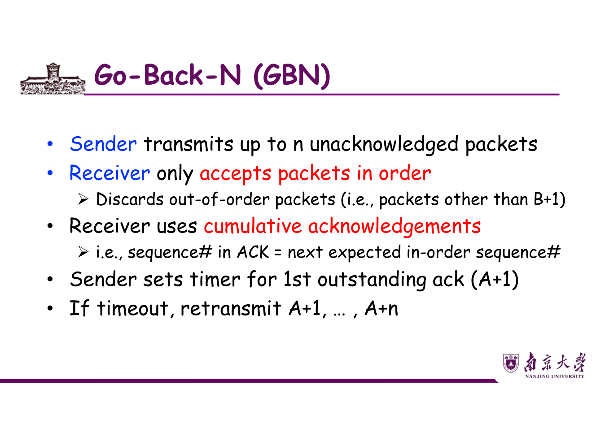

GBN 出错示例：

- 窗口大小为 3。
- 如果分组 4 丢失，后续 5、6 即使到达也会被接收方丢弃。
- 超时后发送方回退并重传 4、5、6。

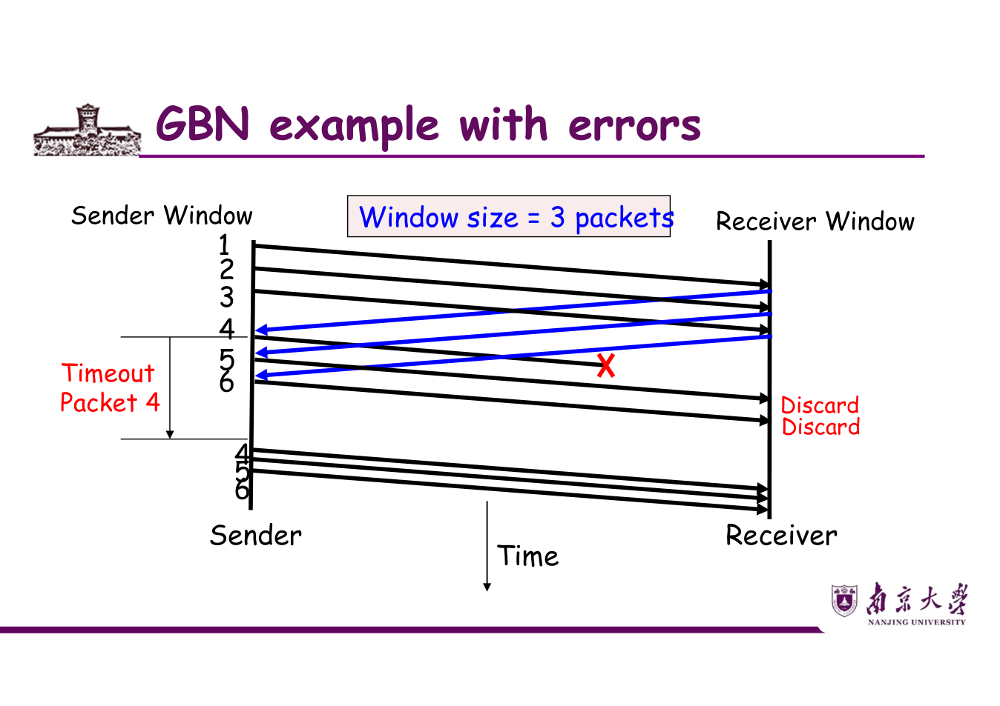

GBN 适用场景：

- 错误率低时表现较好。
- 接收方实现简单。

缺点：

- 一旦丢包，可能浪费带宽重传许多已经到达但被丢弃的分组。

### 4.6 Selective Repeat

SR 规则：

- 发送方最多发送 n 个未确认分组。
- 接收方接受窗口内的乱序分组。
- 接收方缓存乱序到达的正确分组。
- 接收方为每个正确收到的分组单独发送 ACK。
- 发送方只重传未被确认的分组。

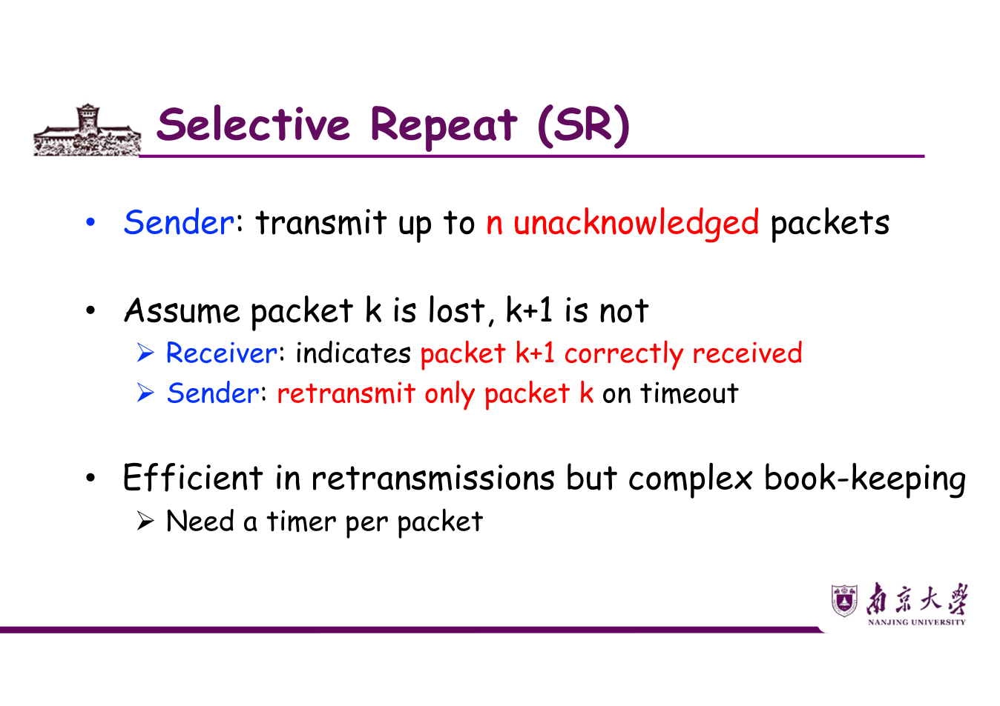

SR 出错示例：

- 假设分组 k 丢失，k+1 正确到达。
- 接收方会缓存 k+1 并发送选择 ACK。
- 发送方只需重传 k。

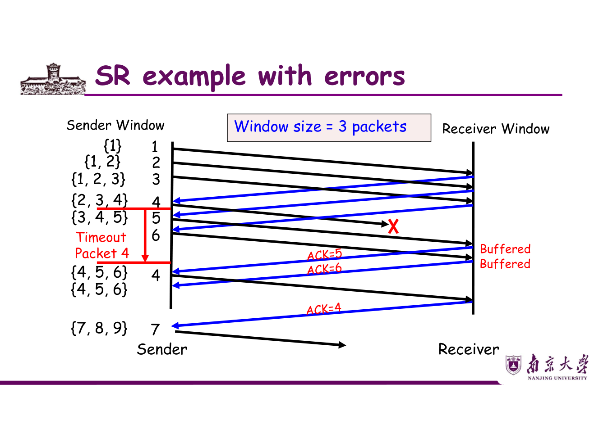

SR 适用场景：

- 错误率高时更节省带宽。
- 代价是接收方和发送方都需要更复杂的缓存与记录。

### 4.7 GBN vs SR

GBN：

- 简单。
- 错误率低时效果好。
- 乱序分组会被丢弃。
- 可能浪费带宽。

SR：

- 复杂。
- 错误率较高时更好。
- 乱序分组可缓存。
- 重传更精确。

滑动窗口观察：

- 只要窗口大小足够，滑动窗口可以充分利用链路。
- 可靠传输的核心组件仍然是 checksum、timer、ACK、sequence number、retransmission。

## 5. UDP

### 5.1 UDP 基本特点

UDP 是 User Datagram Protocol。

UDP 提供进程之间的轻量通信：

- 避免有序性和可靠性带来的开销和延迟。
- 不建立连接。
- 不维护连接状态。
- 只提供尽力而为服务。

UDP segment 可能：

- 丢失。
- 乱序到达。

UDP 使用场景：

- DNS。
- 流媒体。
- 实时语音或视频。
- 应用自己实现可靠性或容错机制的场景。

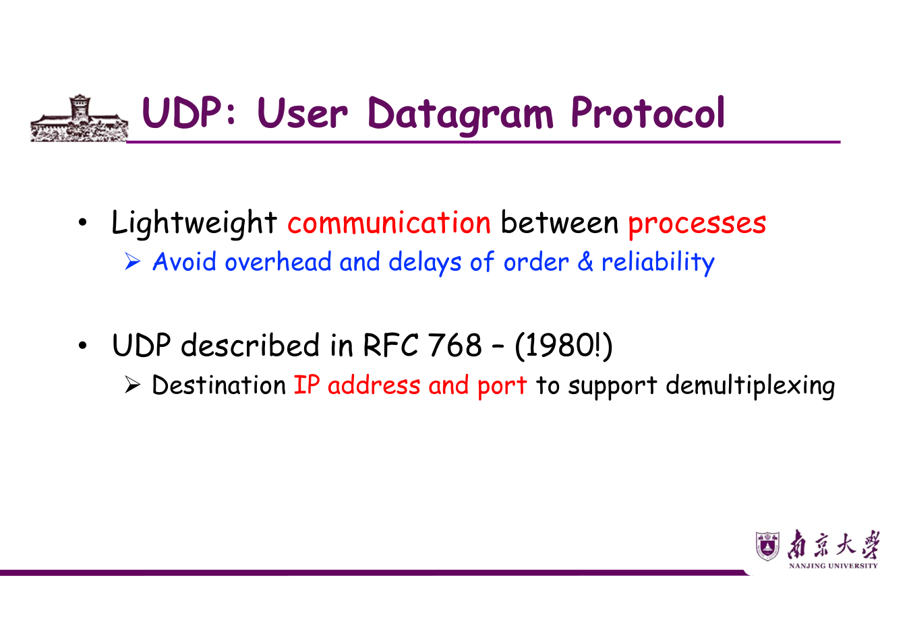

### 5.2 为什么需要 UDP

UDP 存在的原因：

- 无连接建立，避免额外延迟。
- 简单，发送方和接收方无需维护连接状态。
- 首部小。
- 应用可以更直接地控制发送内容和发送时机。
- 对实时应用而言，及时性可能比可靠性更重要。

### 5.3 UDP segment 格式

UDP 首部包含：

- Source port。
- Destination port。
- Length。
- Checksum。

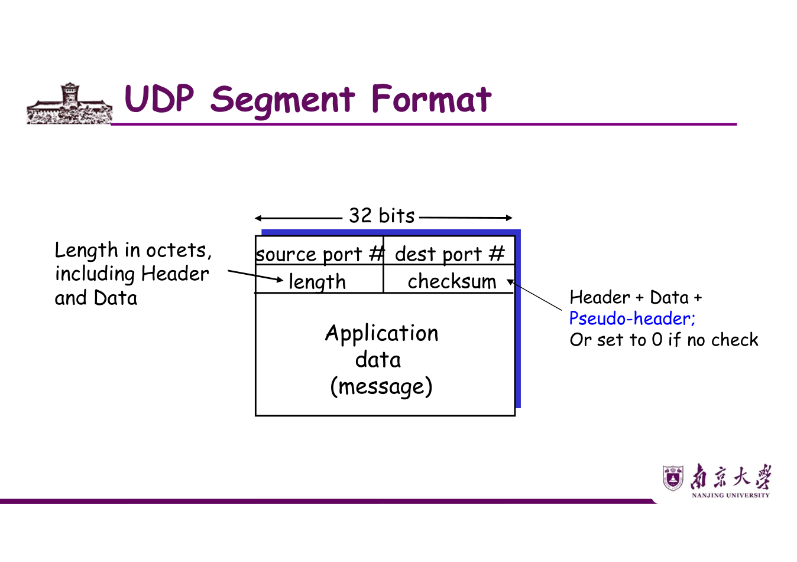

### 5.4 UDP checksum

UDP checksum 用于检测 segment 中是否出现错误。

发送方：

- 将 segment 内容看作 16-bit 整数序列。
- 对这些整数求和。
- 进位回卷。
- 对结果取反，得到 checksum。

接收方：

- 对收到内容做同样计算。
- 如果结果不符合预期，说明可能有错误。

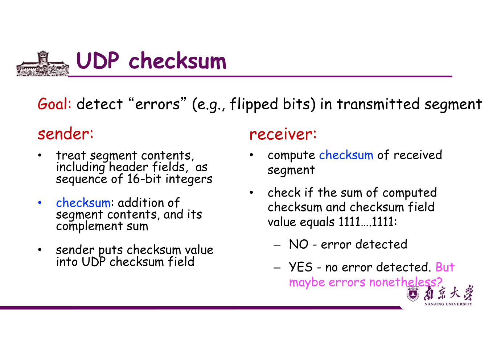

Internet checksum 示例：

```text
两个 16-bit 整数相加，若产生进位，则把进位加回低位。
最后取反得到 checksum。
```

UDP 的错误检测是可选的：

- checksum 字段为 0 表示不校验。

## 6. TCP 基础

### 6.1 TCP 抽象

TCP 提供可靠、有序、字节流服务。

可靠：

- TCP 会重传丢失分组。

有序：

- 应用看到的数据顺序与发送顺序一致。

字节流：

- TCP 不保留应用写入边界。
- 应用写入的数据被看作连续字节序列。

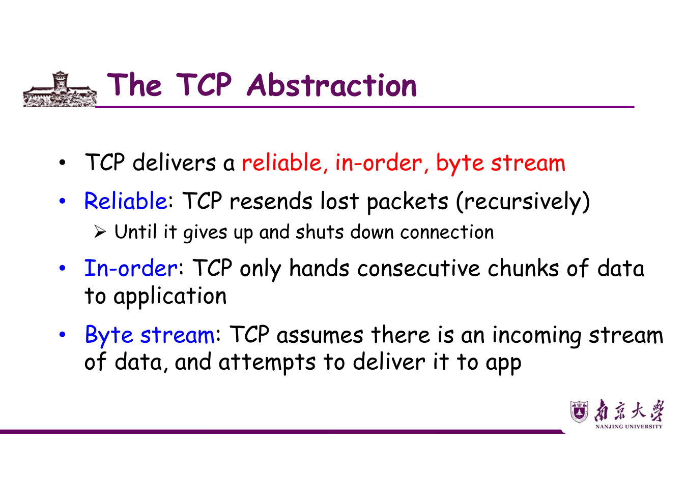

TCP 使用了前面可靠传输中的大部分机制：

- Checksum。
- 序号。
- ACK。
- 重传。
- 定时器。
- 滑动窗口。

TCP 还引入：

- 连接建立。
- 连接释放。
- 流量控制。
- 拥塞控制。

### 6.2 TCP 首部

TCP 首部字段包括：

- Source port。
- Destination port。
- Sequence number。
- Acknowledgment。
- Header length。
- Flags。
- Advertised window。
- Checksum。
- Urgent pointer。
- Options。
- Data。

Flags 包括：

- SYN。
- ACK。
- FIN。
- RST。
- PSH。
- URG。

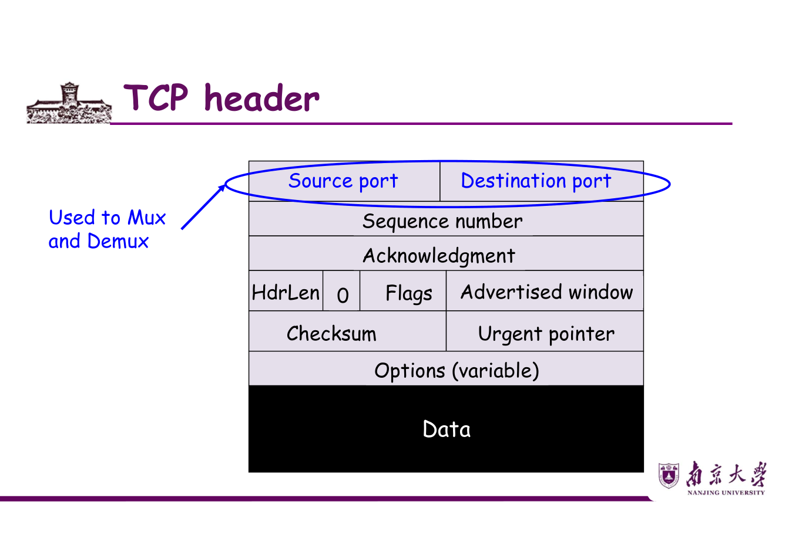

### 6.3 TCP 字节流服务

TCP 对应用提供 stream of bytes。

应用向 TCP 写入字节流，TCP 可以将其切成 segment 发送。接收端 TCP 再把字节按序交给应用。

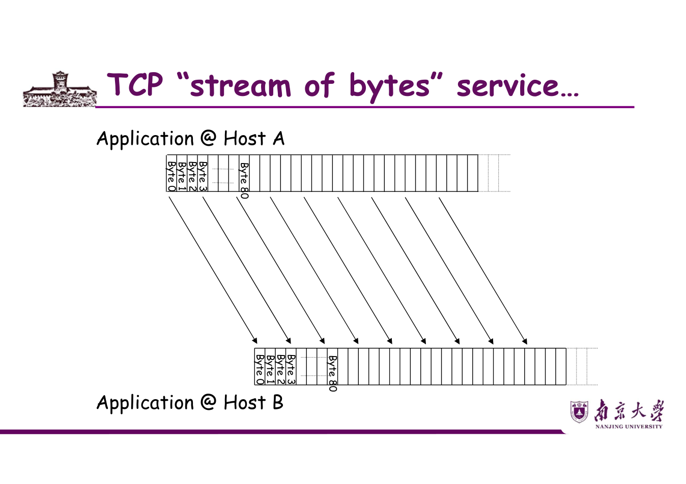

### 6.4 TCP 序号

TCP 的序号是字节序号，不是 segment 序号。

每条连接开始时选择 Initial Sequence Number，简称 ISN。

如果一个 segment 的第一个数据字节序号是 X，长度是 B，则接收方收到后通常回复：

```text
ACK = X + B
```

含义：X 到 X+B-1 的字节都已收到，下一字节期望 X+B。

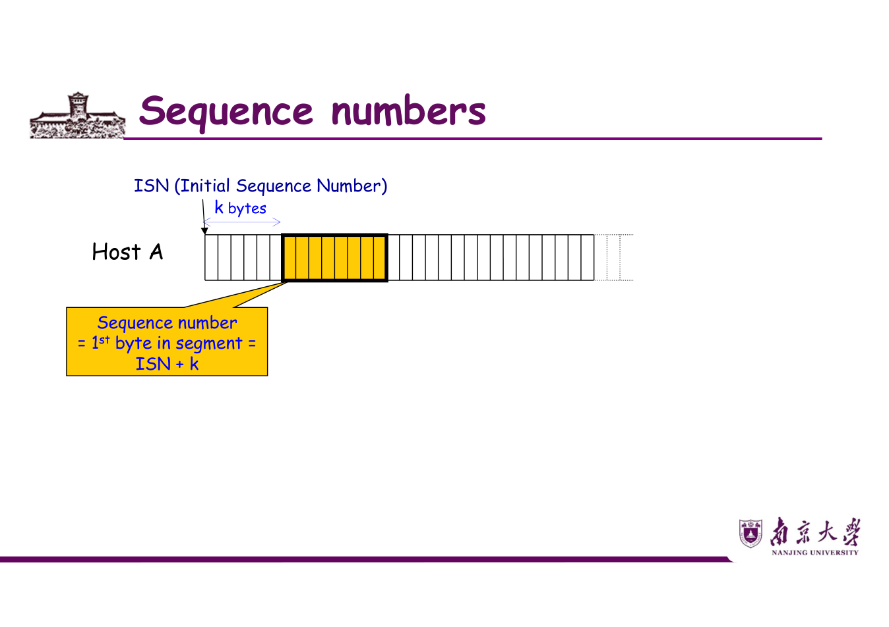

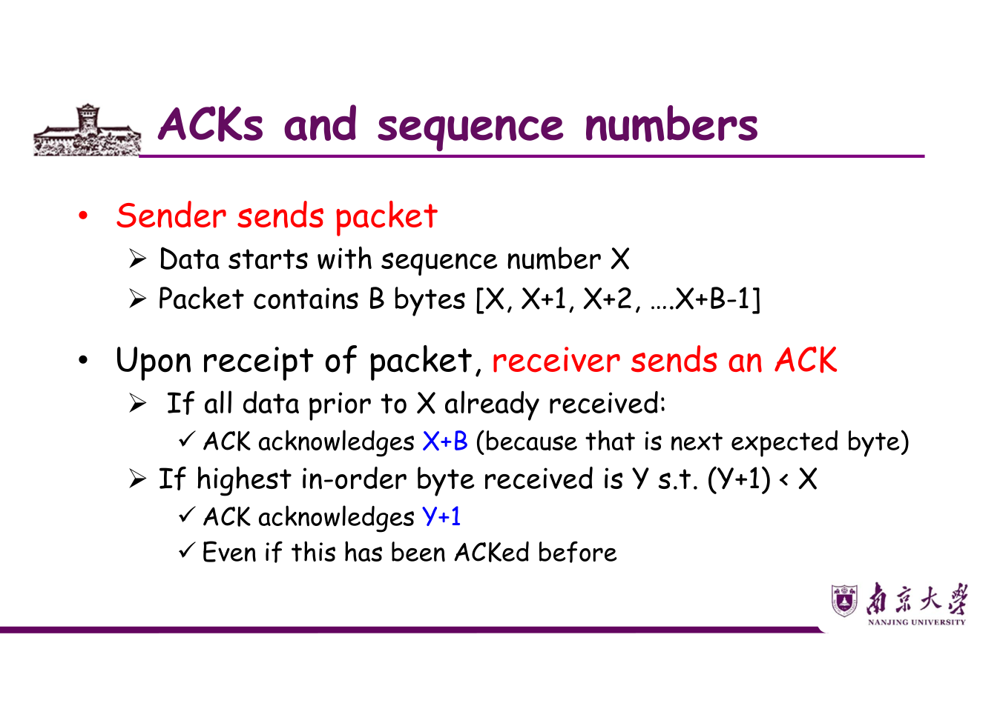

### 6.5 TCP 累积 ACK 与丢失

TCP 使用累积 ACK。

例子：

- 发送方发送序号为 100、200、300、400、500、600... 的 100B 数据段。
- 如果序号 500 的 segment 丢失，而 600、700 等后续 segment 到达。
- 接收方仍重复 ACK 500。

重复 ACK 是孤立丢失的信号：

- ACK 没有前进，说明 500 没有交付。
- 但后续 ACK 仍在回来，说明连接还活着，后续分组可能到达了。

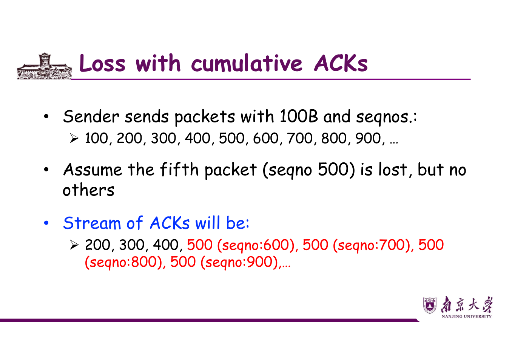

重传后有两种选择：

- 只发送缺失分组，然后根据 ACK 推动窗口。
- 或者更保守地回退重传。

TCP Reno 等实现会结合快速重传和快速恢复。

### 6.6 重传超时

如果发送方在 timeout 前没有收到 ACK，就重传窗口中的第一个分组。

Timeout 太短：

- 会导致不必要重传。

Timeout 太长：

- 丢包恢复很慢。

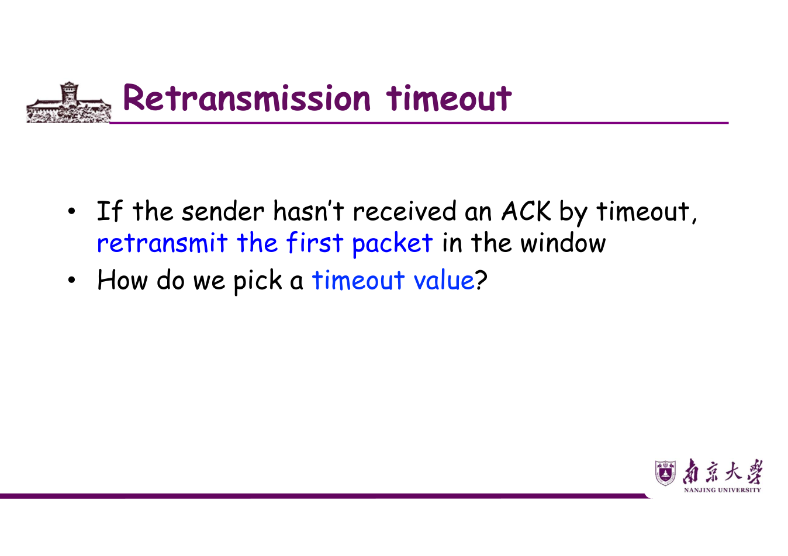

### 6.7 RTT 估计

TCP 需要估计 RTT 来设置重传定时器。

问题：

- RTT 会变化。
- ACK 可能对应原始 segment，也可能对应重传 segment，产生歧义。

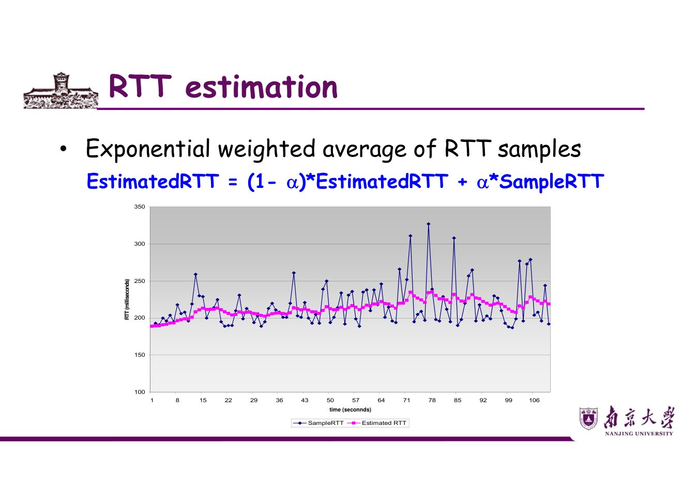

#### Karn/Partridge 算法

思想：

- 不使用重传 segment 的 SampleRTT。
- 一旦某 segment 被重传，就忽略它未来产生的 RTT 样本。

这样避免把 ACK 归属错。

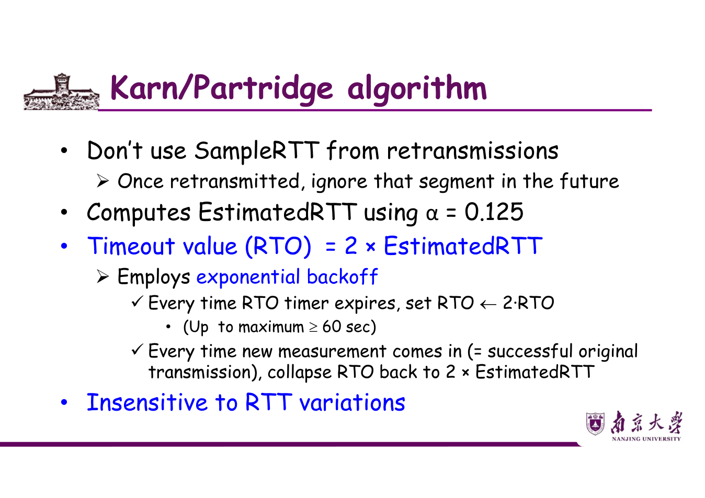

#### Jacobson/Karels 算法

问题：

- 仅估计平均 RTT 不够。
- 还需要捕获 RTT 变化程度。

Jacobson/Karels 算法引入 RTT 偏差估计，让超时值同时反映平均 RTT 和波动性。

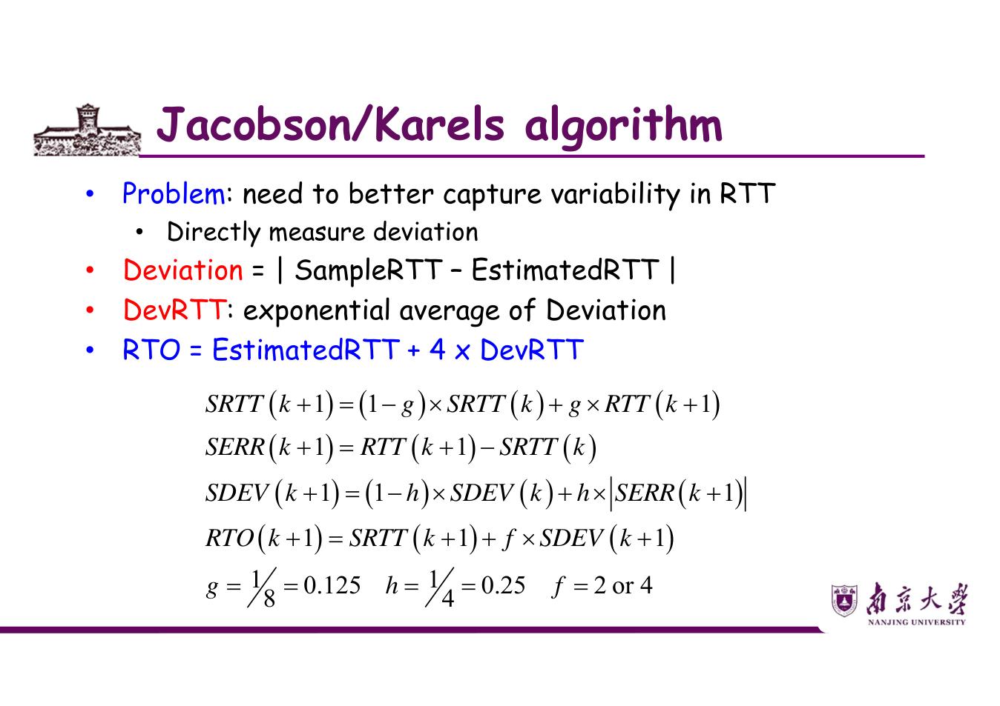

## 7. TCP 连接管理

### 7.1 为什么需要连接建立

TCP 是面向连接的协议。传输数据前，双方需要建立连接。

连接建立要解决：

- 双方确认彼此可达。
- 交换初始序号 ISN。
- 避免旧连接的过期 segment 混入新连接。
- 避免 slipped data segment 或 obsolete SYN 造成错误。

### 7.2 两次握手的问题

两次握手：

- A 发送 SYN。
- B 回复 SYN。

问题：

- 旧的 SYN 或旧数据 segment 可能在网络中延迟后重新出现。
- 接收方可能误以为这是新连接的一部分。
- 无法可靠地区分新旧连接。

ISN 可缓解问题：

- 每个新连接使用不同初始序号。
- 让旧连接数据更难被误认为新连接数据。

但更完整的方案是三次握手。

### 7.3 三次握手

三次握手用于建立 TCP 连接。

步骤：

1. A 发送 SYN，携带 A 的 ISN。
2. B 回复 SYN-ACK，确认 A 的 ISN，并携带 B 的 ISN。
3. A 回复 ACK，确认 B 的 ISN。

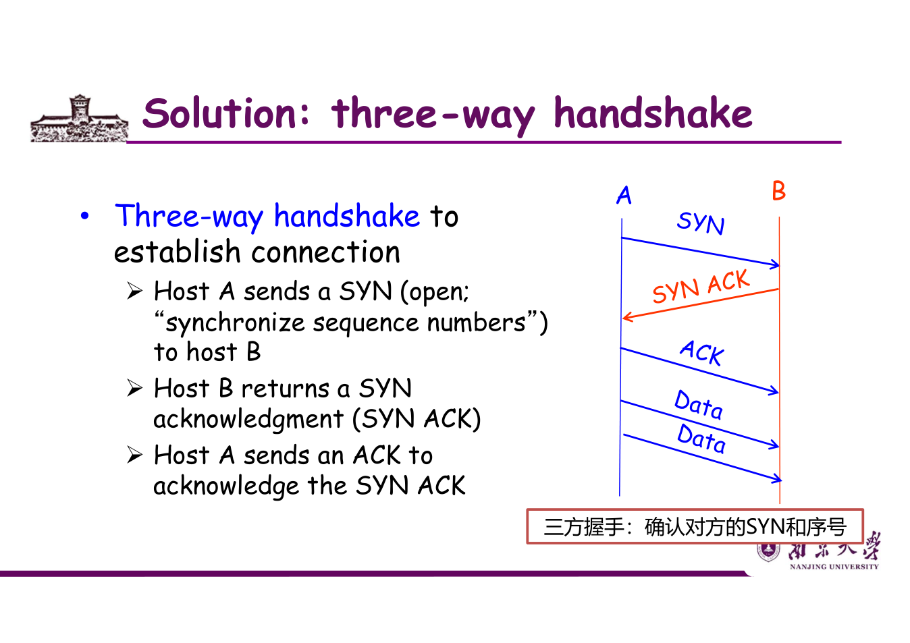

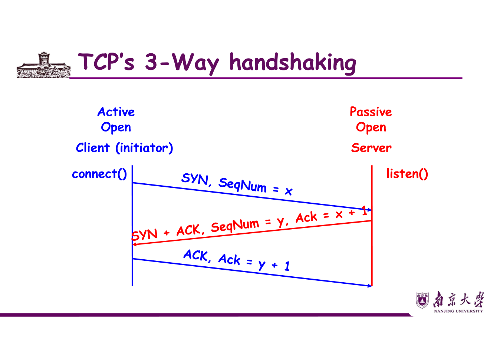

如果 SYN 丢失：

- 可能是网络丢弃，也可能是服务器忙。
- 发送方最终收不到 SYN-ACK。
- 发送方超时后重传 SYN。
- RFC 1122 和 RFC 2988 建议默认超时 3 秒，有些实现使用 6 秒。

Web 下载中的影响：

- 用户点击链接。
- 浏览器创建 socket 并调用 connect。
- connect 触发 OS 发送 SYN。
- 如果 SYN 丢失，会带来 3 到 6 秒延迟。
- 用户可能不耐烦并重试。
- 重试会中止当前 connect，创建新 socket 和新 connect，有时有效。

### 7.4 正常连接释放

TCP 可以单边关闭。

一方 A 发送 FIN：

- FIN 表示 A 不再发送数据。
- FIN 占用一个序号空间中的字节。
- B 发送 ACK 确认。
- 此时 A 到 B 方向关闭，但 B 到 A 方向仍可传数据。
- 直到 B 也发送 FIN，A 再 ACK，连接完全关闭。

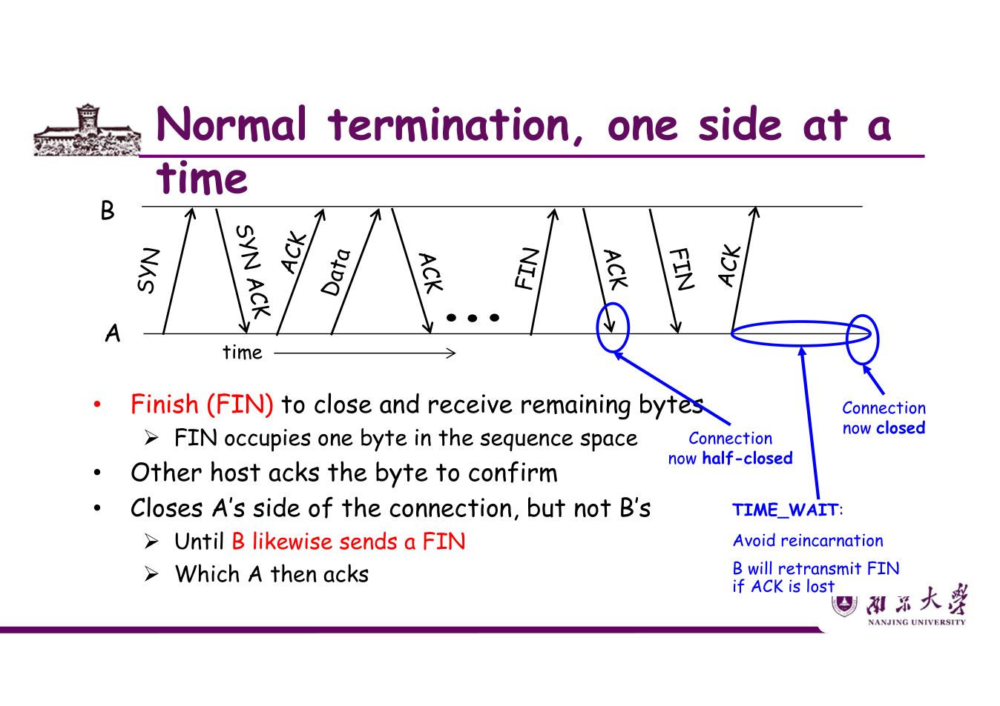

如果双方几乎同时关闭：

- B 可以在 ACK A 的 FIN 时同时设置自己的 FIN。

### 7.5 TIME_WAIT

主动关闭方进入 TIME_WAIT。

作用：

- 避免旧连接的 segment reincarnation 干扰新连接。
- 如果最后的 ACK 丢失，对端可能重传 FIN，TIME_WAIT 状态允许重新 ACK。

### 7.6 异常释放：RST

一方可以发送 RESET，简称 RST，突然终止连接。

例子：

- A 上的应用进程崩溃。

特点：

- B 不确认 RST。
- RST 不可靠交付。
- 在途数据会丢失。
- 如果 B 后续继续发送数据，会引发另一个 RST。

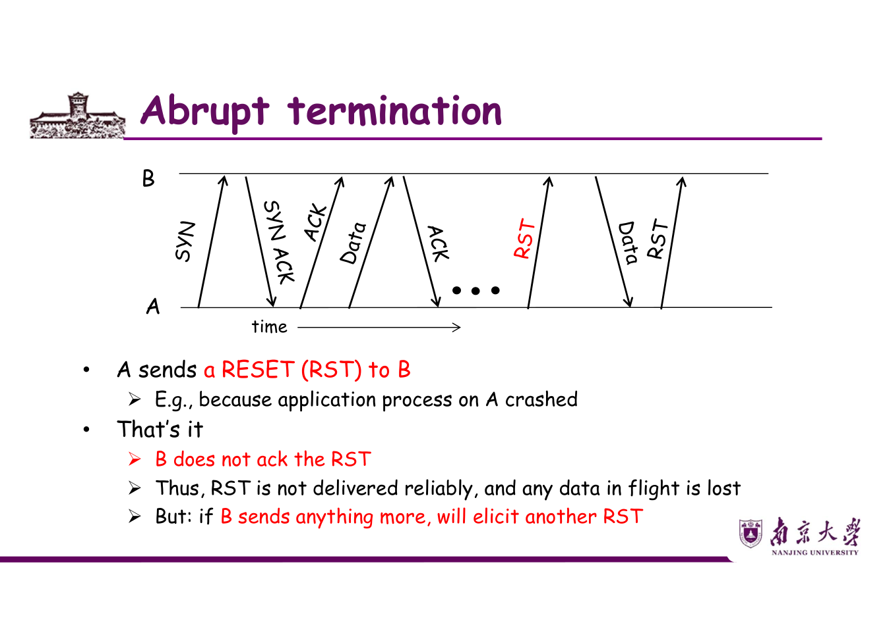

### 7.7 TCP 客户端生命周期

典型客户端状态：

- CLOSED。
- SYN_SENT。
- ESTABLISHED。
- FIN_WAIT_1。
- FIN_WAIT_2。
- TIME_WAIT。

过程：

- 发送 SYN。
- 收到 SYN-ACK。
- 发送 ACK。
- 发送 FIN。
- 收到 ACK。
- 收到 FIN。
- 发送 ACK。
- 等待一段时间。

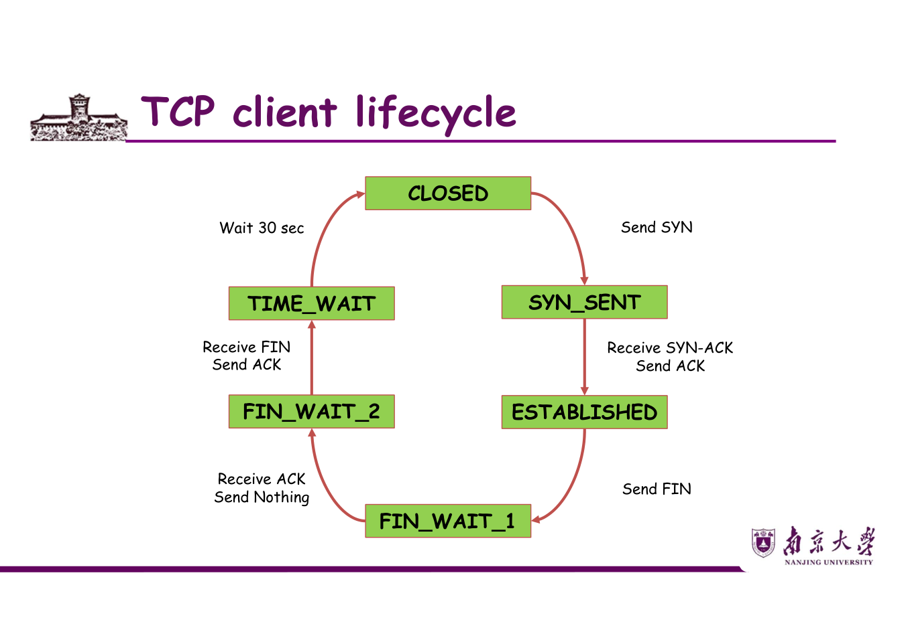

### 7.8 TCP 服务器生命周期

典型服务器状态：

- CLOSED。
- LISTEN。
- SYN_RCVD。
- ESTABLISHED。
- CLOSE_WAIT。
- LAST_ACK。

过程：

- 创建 listen socket。
- 收到 SYN。
- 发送 SYN-ACK。
- 收到 ACK。
- 进入 ESTABLISHED。
- 收到 FIN。
- 发送 ACK。
- 发送 FIN。
- 收到 ACK。

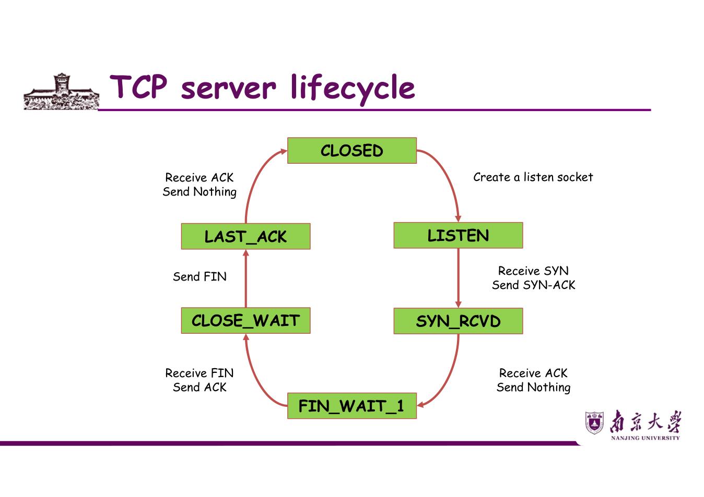

## 8. TCP 流量控制

### 8.1 流量控制要解决什么

流量控制目标：防止发送方把接收方缓冲区撑爆。

注意区分：

- 流量控制：保护接收端，避免接收方来不及处理。
- 拥塞控制：保护网络，避免网络内部过载。

### 8.2 固定滑动窗口的问题

固定滑动窗口在可靠直连链路上效果较好。

但问题是：

- 没收到 ACK 可能表示分组丢失。
- 也可能是接收方想通过停止 ACK 来控制流量。
- 发送方无法区分丢包和接收方缓冲区不足。

### 8.3 信用方案与 RWND

TCP 使用 credit scheme。

接收方在 ACK 中通告剩余缓冲空间，即 Advertised Window，也叫 RWND。

规则：

```text
bytes in flight <= RWND
```

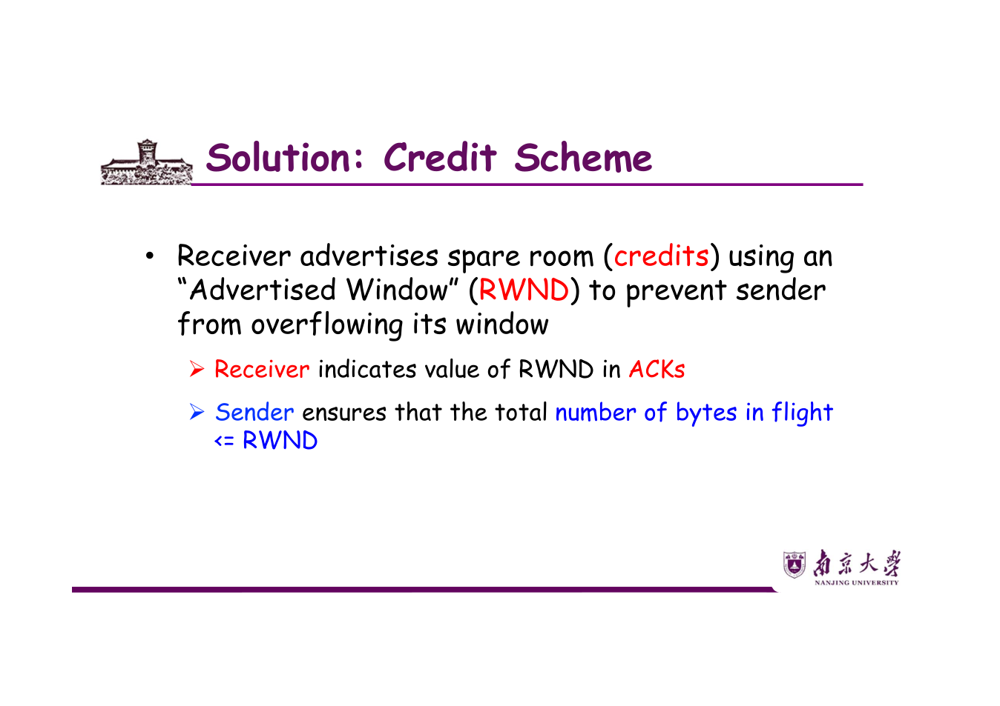

接收方窗口：

- `LastByteRead`：应用已经读取的最后一个字节。
- `LastByteReceived`：TCP 已收到的最后一个字节。
- B：接收缓冲区大小。

公式：

```text
RWND = B - (LastByteReceived - LastByteRead)
```

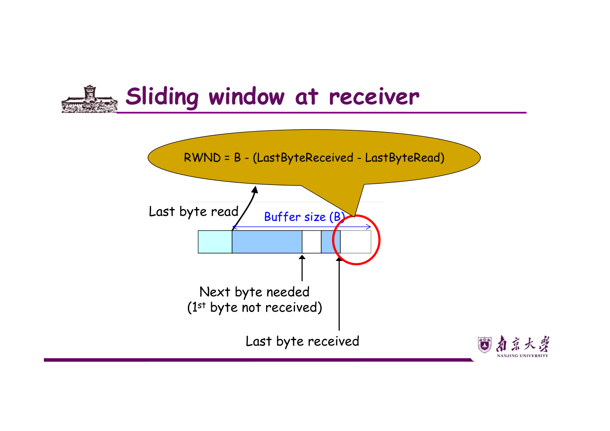

发送方窗口：

- 第一未确认字节到最后可发送字节之间的范围受 RWND 限制。

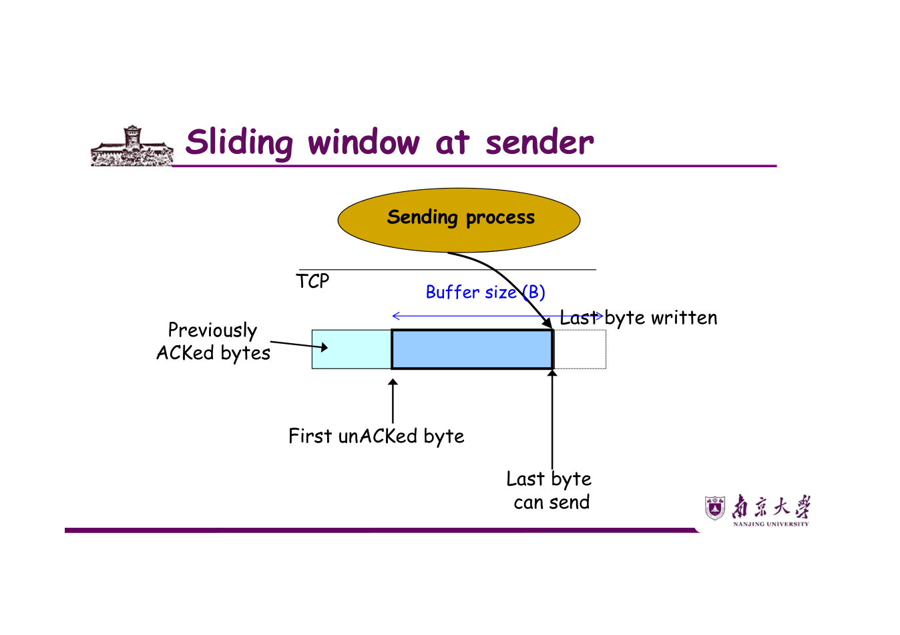

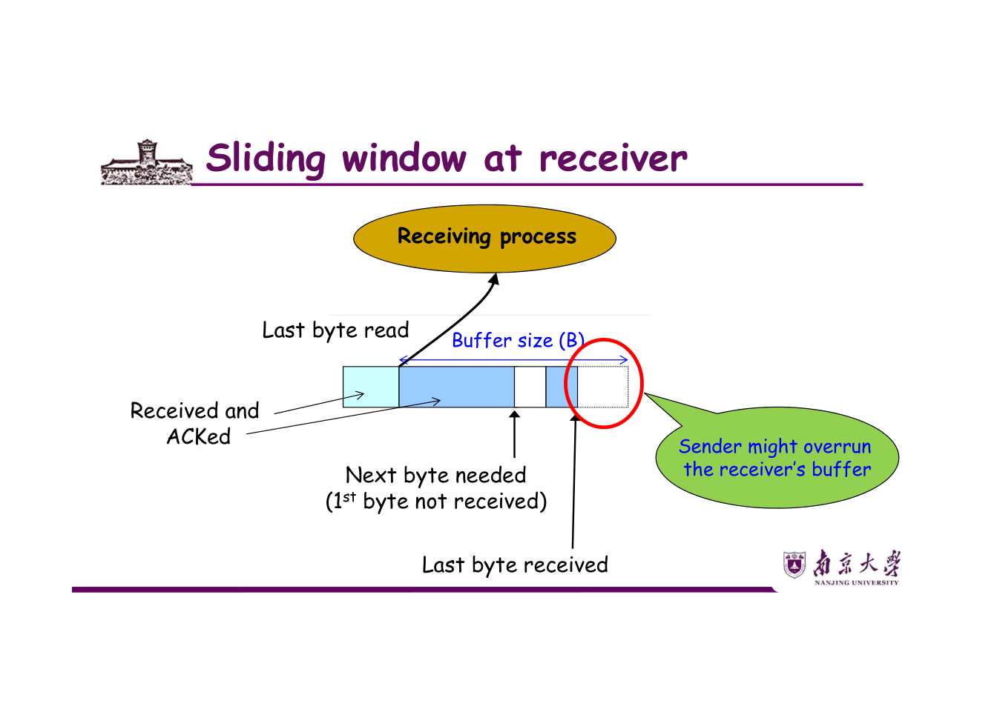

### 8.4 带流量控制的滑动窗口

发送方：

- 当新数据被 ACK 时，窗口前移。

接收方：

- 当接收进程消费数据时，窗口前移。
- 接收方通过 ACK 告诉发送方接收窗口当前右边界。
- 发送方承诺不超过该范围。

UDP 没有流量控制，因此可能因为接收缓冲区溢出而丢数据。

### 8.5 信用方案的好处

信用方案优点：

- 在 Internet 上提供更强控制。
- 将流量控制和 ACK 解耦。
- 接收方可以 ACK 但不授予新的 credit。
- 每个 octet 都有序号。
- 每个 TCP segment 首部包含 sequence number、ACK number 和 window size。

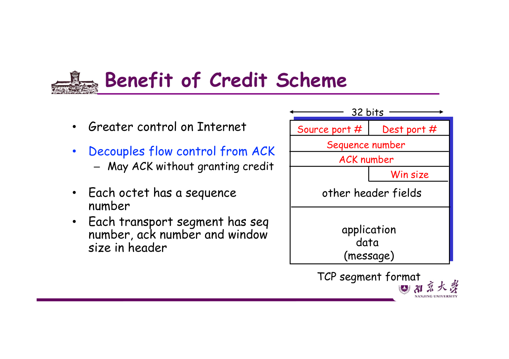

### 8.6 首部字段使用

发送 segment 时：

- `seq number` 是 segment 中第一个 octet 的序号。

ACK 包含：

```text
AN = i, W = j
```

含义：

- 到 `SN = i-1` 为止的所有 octet 已确认。
- 下一个期望 octet 是 i。
- 允许发送额外窗口 `W = j` 个 octet。
- 即允许发送 octet `i` 到 `i+j-1`。

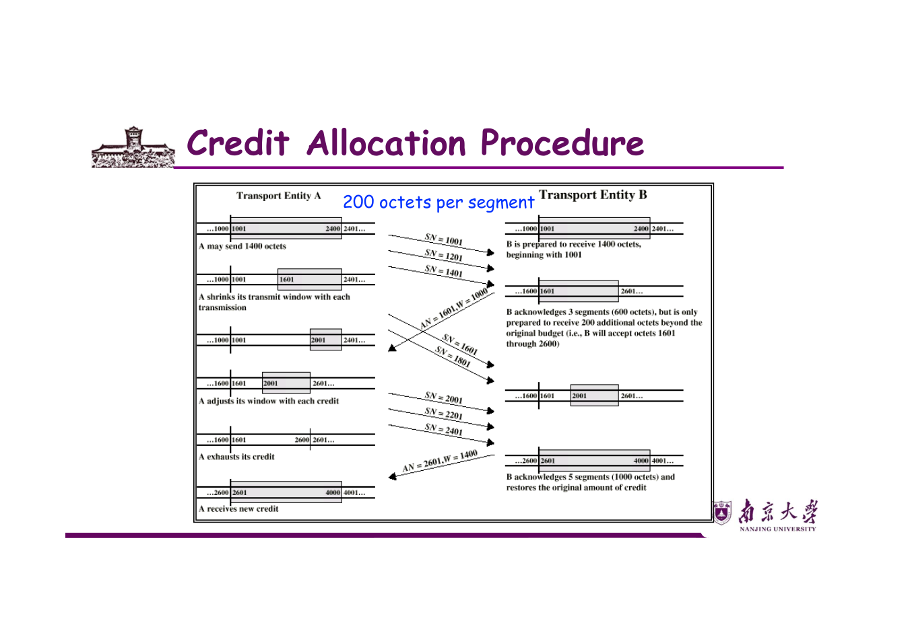

### 8.7 信用分配流量控制

假设 B 最后收到的数据 octet 是 `i-1`，B 上一次发送的 ACK/CREDIT 是：

```text
AN = i, W = j
```

如果没有新数据到达，但 B 想把 credit 增加到 k，且 `k > j`：

```text
AN = i, W = k
```

如果收到 m 个 octet，且 `m < j`，但不授予额外 credit：

```text
AN = i + m, W = j - m
```

如果 ACK/CREDIT 丢失，通常危害不大：

- 未来 ACK 会重新同步协议。
- 如果发送方超时重传数据，也会触发新的 ACK。

### 8.8 信用分配死锁

死锁场景：

1. B 发送 `AN=i, W=0` 给 A，关闭接收窗口。
2. B 后来发送 `AN=i, W=j` 重新打开窗口。
3. 但这个 reopen 报文可能丢失。
4. A 认为窗口仍关闭，B 认为窗口已打开并等待 A 发送。

解决：

- 使用 window timer。
- 如果定时器超时且没有收到任何内容，发送一些东西。
- 可以是重传之前的 segment。

## 9. TCP 拥塞控制

### 9.1 拥塞崩溃背景

1981 年 TCP 标准化并广泛部署时，没有考虑拥塞控制。

1986 年 10 月，Internet 出现一系列 congestion collapse。

课件例子：

- LBL 到 UC Berkeley 相距约 400 yards，经过两个 IMP hops。
- 吞吐量从 32 Kbps 降到 40 bps。

Van Jacobson 的研究开启了拥塞控制的重要方向。

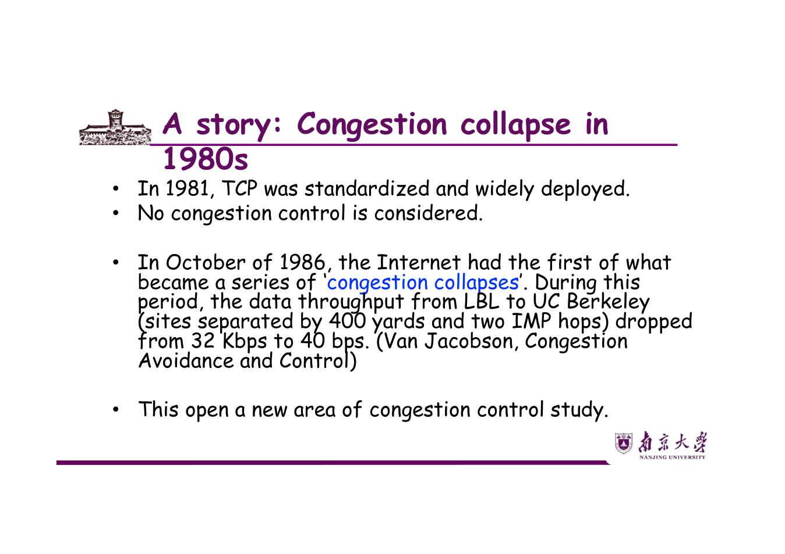

### 9.2 Jacobson 对 TCP 的修复

思路：

- 扩展 TCP 已有的窗口协议。
- 根据拥塞情况调整窗口大小。

优点：

- 不需要升级路由器。
- 不需要升级应用。
- 只需要修改 TCP 实现中的少量代码。
- 实用且有效。

### 9.3 拥塞控制设计问题

关键问题：

- 如何知道网络拥塞？
  - 网络隐式信号。
  - 网络显式信号。
- 谁负责处理拥塞？
  - 端主机，可能得到网络帮助。
- 如何处理拥塞？
  - 连续自适应。

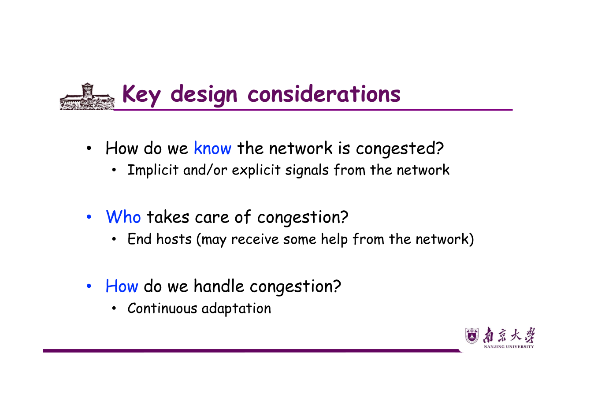

拥塞控制要考虑三件事：

- 发现可用瓶颈带宽。
- 适应带宽变化。
- 在多个流之间共享带宽。

### 9.4 拥塞控制的抽象模型

可以把路由器内部简化为某个输入输出对上的单个队列。

发送方需要选择发送速率，使其匹配瓶颈带宽。

挑战：

- 发送方事先不知道瓶颈带宽。
- 瓶颈可能是 Gbps 链路，也可能是 modem。
- 带宽可能随时间变化。
- 多个流同时竞争时，要同时解决总速率匹配和公平分配。

现实中，拥塞控制是一个资源分配问题，涉及很多流、很多链路和复杂的全局动态。

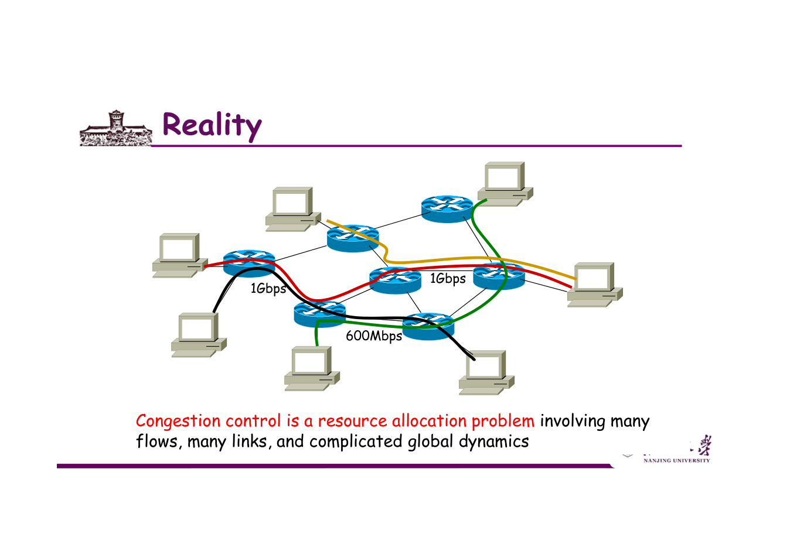

### 9.5 可能的拥塞控制方法

可选方法：

0. 不管不顾地发送。
   - 会造成大量丢包。
1. 预留。
   - 发送前预先协商带宽。
   - 利用率低。
2. 定价。
   - 不丢弃高出价者的包。
   - 需要支付模型。
3. 动态调整。
   - 主机推断拥塞程度并调整。
   - 网络向主机报告拥塞程度，主机调整。
   - 或两者结合。

动态调整非常强大：

- 不预设商业模型。
- 不预设流量特征。
- 不预设应用需求。
- 但假设端系统遵守规则。

### 9.6 如何检测拥塞

发送方检测拥塞的方式：

- 分组时延。
  - 信号噪声大，因为 delay 本身变化大。
- 路由器显式告诉端主机拥塞。
- 分组丢失。
  - TCP 已经有丢失检测机制。
  - 但非拥塞丢失也可能发生，例如 checksum 错误。

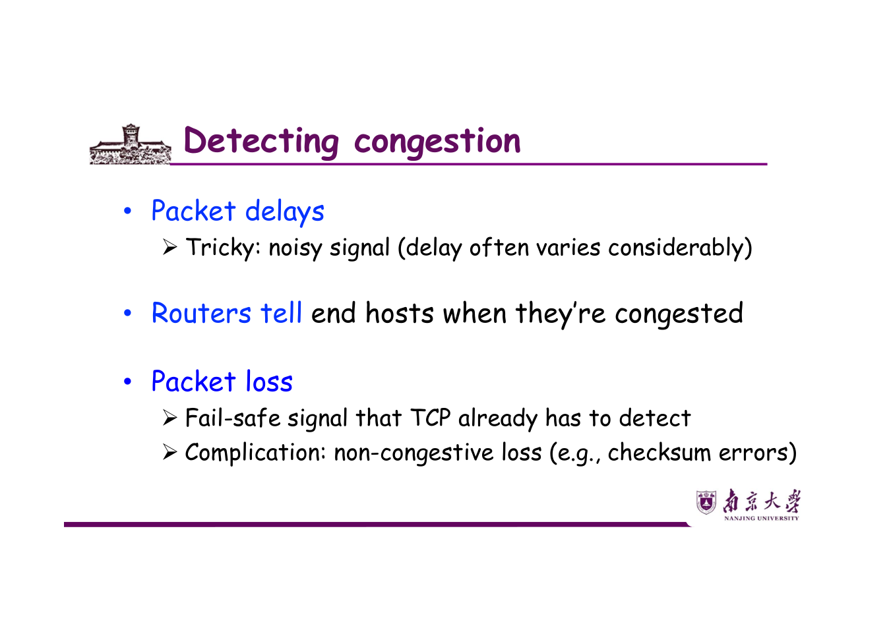

不同丢失信号含义不同：

- Duplicate ACK：通常是孤立丢失，仍能收到 ACK。
- Timeout：更严重，说明不够多的 dupACK 返回，可能发生多处丢失。

TCP 会对两类信号采用不同降速策略。

### 9.7 发送速率调整

基本结构：

- 收到确认新数据的 ACK：增加发送速率。
- 检测到丢失：降低发送速率。

增加和降低方式取决于拥塞控制阶段：

- Slow Start：发现可用瓶颈带宽。
- Congestion Avoidance：用 AIMD 适应带宽变化。

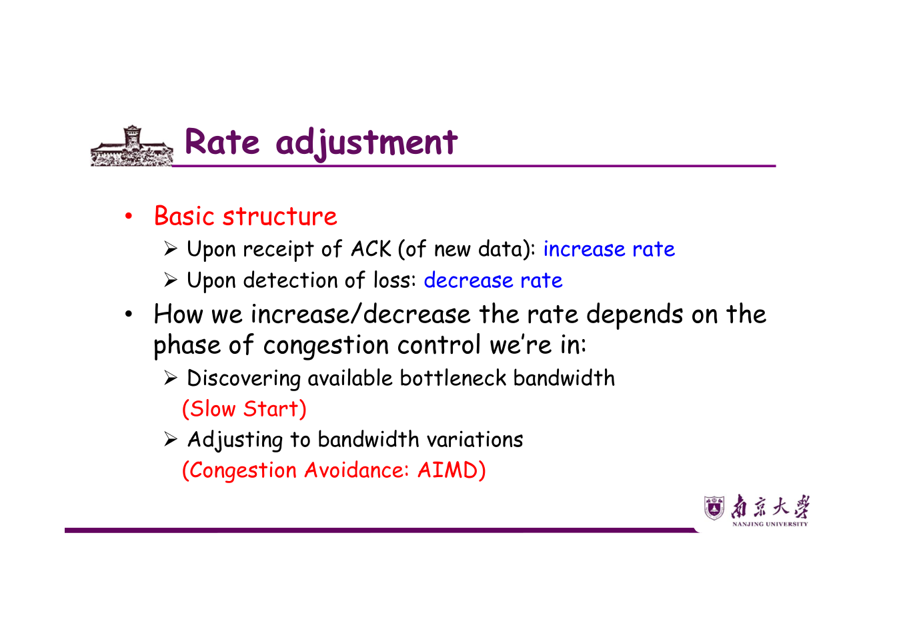

## 10. Slow Start 与 AIMD

### 10.1 Slow Start

目标：

- 安全地从小速率开始。
- 快速估计可用带宽。

为什么需要慢启动：

- RTT = 100 ms，MSS = 1000 bytes。
- 填满 1 Mbps 带宽需要窗口约 12.5 个分组。
- 填满 1 Gbps 带宽需要窗口约 12,500 个分组。
- 发送方一开始无法知道是哪种情况。

Slow Start 过程：

- 初始 `CWND = 1`。
- 初始发送速率为 `MSS / RTT`。
- 没有丢失时，每个 RTT 将 CWND 翻倍。
- 实现上，每收到一个 ACK，`CWND += 1`。

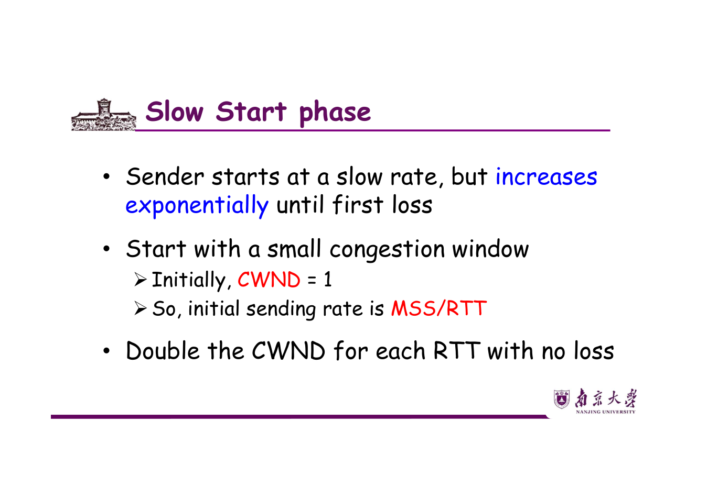

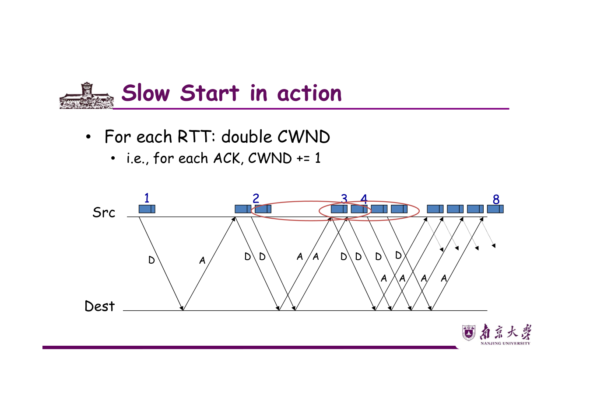

### 10.2 ssthresh

Slow Start 用于估计可用带宽。

当出现丢失时，说明速率可能过高。

引入 slow start threshold，简称 ssthresh：

- 初始值很大。
- 如果 `CWND > ssthresh`，停止 Slow Start。
- 之后进入 Congestion Avoidance。

### 10.3 Congestion Avoidance 与 AIMD

当 `CWND > ssthresh`：

- 停止快速指数增长。
- 进入维护阶段。
- 通过反复探测和回退在当前可用带宽附近震荡。

TCP 使用 AIMD：

- Additive Increase：加性增。
- Multiplicative Decrease：乘性减。

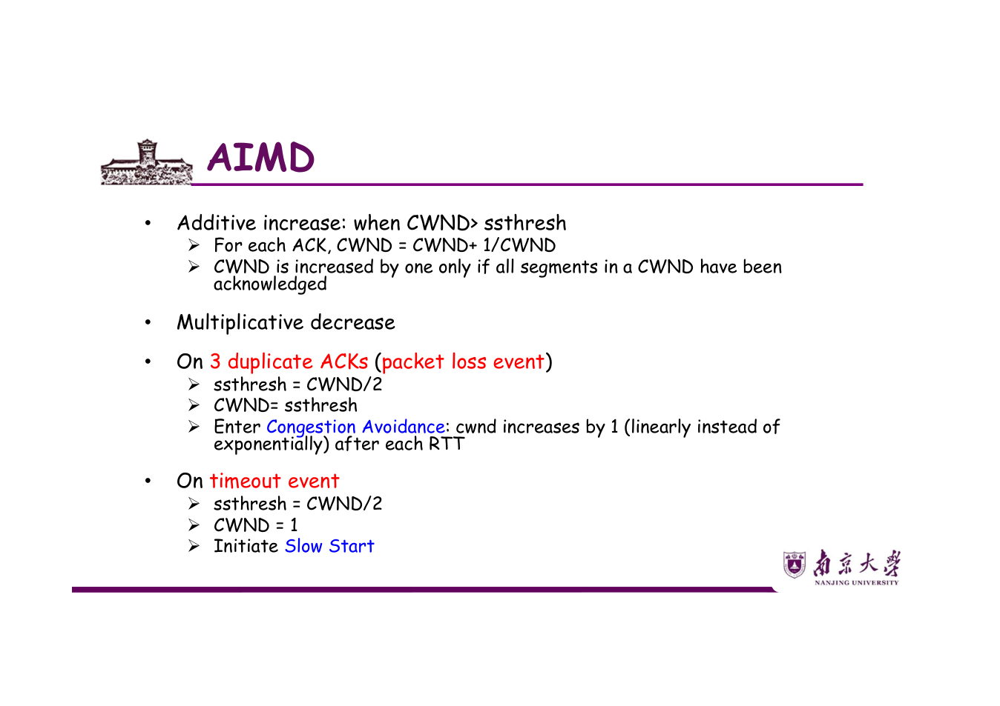

加性增：

当 `CWND > ssthresh` 时：

```text
每个 ACK: CWND = CWND + 1/CWND
```

效果：

- 一个 RTT 内约增加 1 个 MSS。
- 线性增长。

乘性减：

发生 3 个重复 ACK 时：

```text
ssthresh = CWND / 2
CWND = ssthresh
进入 Congestion Avoidance
```

发生 timeout 时：

```text
ssthresh = CWND / 2
CWND = 1
重新进入 Slow Start
```

### 10.4 TCP 锯齿

TCP 的 CWND 随时间呈锯齿状：

- Slow Start 阶段指数增长。
- Congestion Avoidance 阶段线性增长。
- 丢包时窗口减半或回到 1。
- 再继续探测带宽。

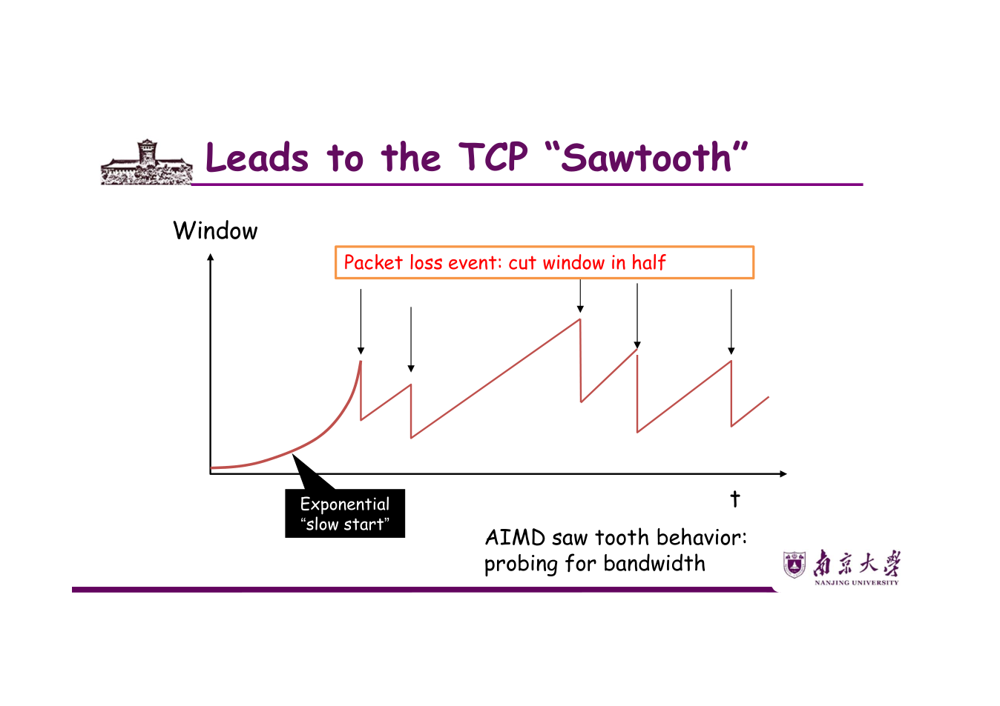

### 10.5 为什么是 AIMD

拥塞控制有两个共享带宽目标：

- Efficiency：高链路利用率。
- Fairness：每个流获得公平份额。

每个 RTT 可以做：

- 乘性增或减：`CWND -> a * CWND`。
- 加性增或减：`CWND -> CWND + b`。

四种组合：

- AIAD：温和增加，温和减少。
- AIMD：温和增加，剧烈减少。
- MIAD：剧烈增加，温和减少。
- MIMD：剧烈增加，剧烈减少。

AIMD 能在简单模型中趋向公平和高效率。

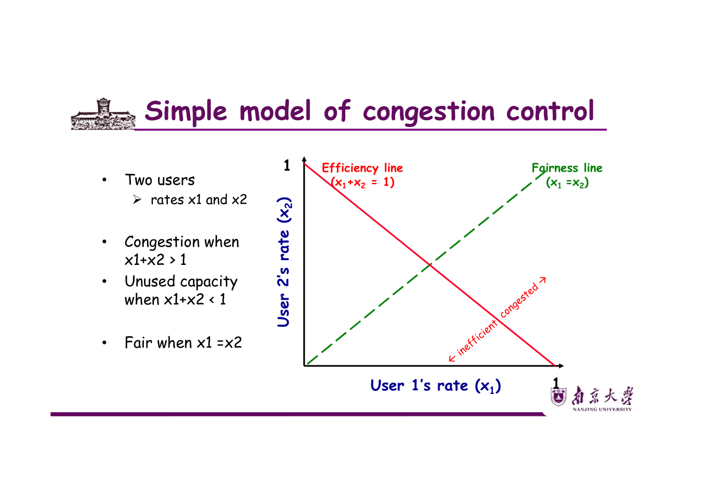

两用户模型：

- 用户速率为 `x1` 和 `x2`。
- 拥塞条件：`x1 + x2 > 1`。
- 未充分利用：`x1 + x2 < 1`。
- 公平条件：`x1 = x2`。

AIMD：

- 增加时两个用户都加同样的量。
- 减少时都乘以同样系数。
- 动态过程会向公平线靠近。

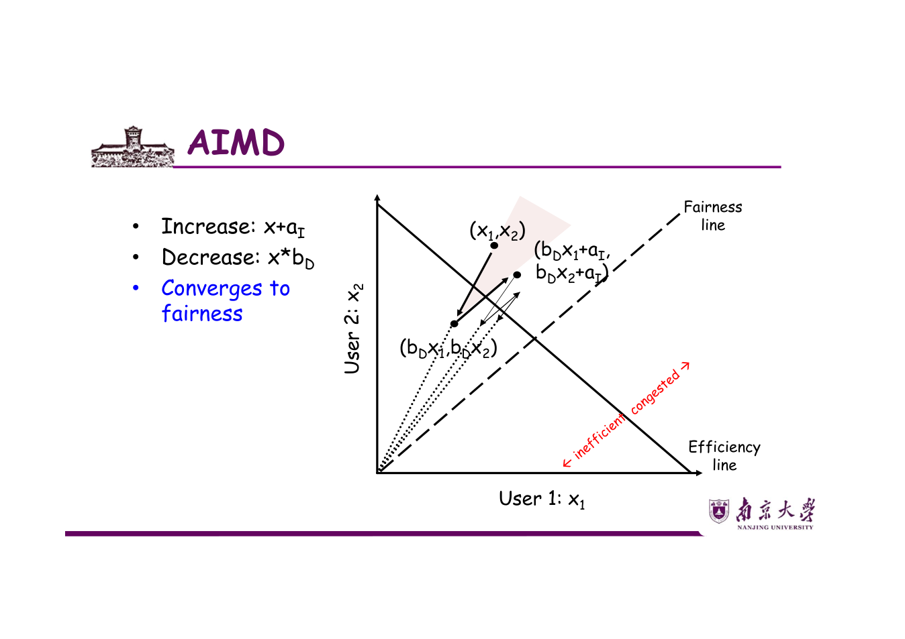

## 11. 快速恢复与 TCP 状态机

### 11.1 Fast Recovery

快速恢复思想：

- 每收到一个 duplicate ACK，说明网络中还有分组在流动。
- 因此临时给发送方 credit，让它保持一定数量的 in-flight packets。

规则：

当 `dupACKcount = 3`：

```text
ssthresh = CWND / 2
CWND = ssthresh + 3
```

快速恢复中：

```text
每个额外 dupACK: CWND = CWND + 1
```

收到 new ACK 后退出快速恢复：

```text
CWND = ssthresh
```

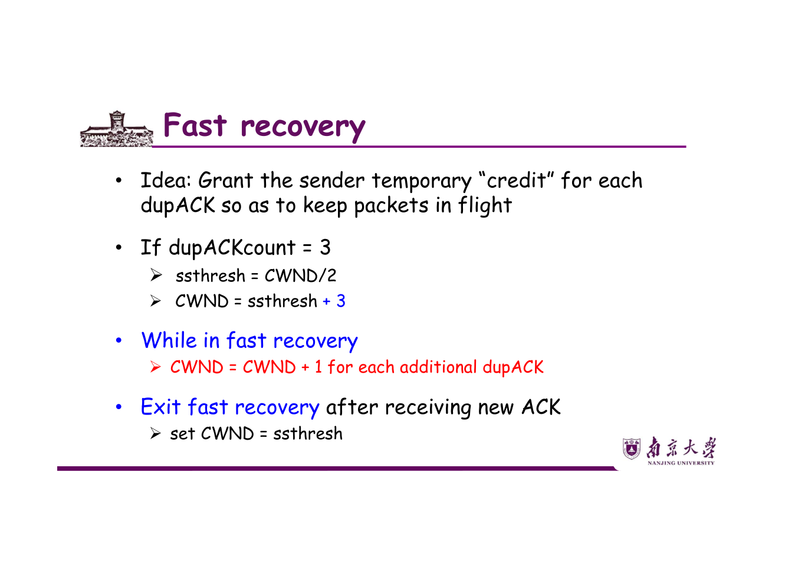

### 11.2 快速恢复示例

连接条件：

- `CWND = 10 packets`。
- 上一个 ACK 是 packet 101。
- 接收方期望下一个序号 101。
- `[101, 102, ..., 110]` 在传输中。
- packet 101 丢失。

过程要点：

- 102、103、104 到达时，接收方重复 ACK 101。
- 第 3 个重复 ACK 后，发送方重传 101。
- `ssthresh = 5`，`CWND = 8`。
- 后续重复 ACK 继续临时增加 CWND。
- 收到新 ACK 后退出快速恢复，`CWND = 5`。

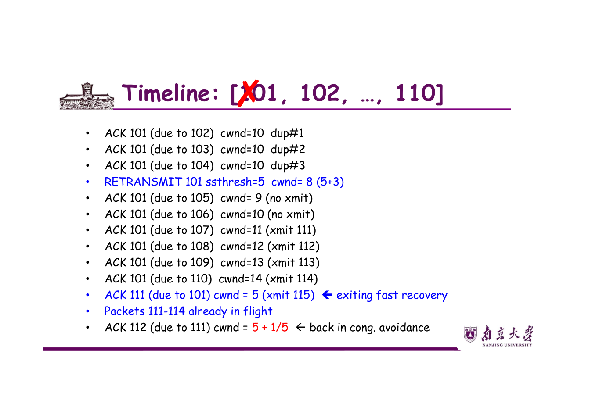

### 11.3 TCP 拥塞控制状态机

主要状态：

- Slow Start。
- Congestion Avoidance。
- Fast Recovery。

状态转换：

- `CWND > ssthresh`：Slow Start 转入 Congestion Avoidance。
- timeout：进入 Slow Start。
- 3 个 duplicate ACK：进入 Fast Recovery。
- Fast Recovery 中收到 new ACK：回到 Congestion Avoidance。
- duplicate ACK 在 Fast Recovery 中会继续调整窗口。

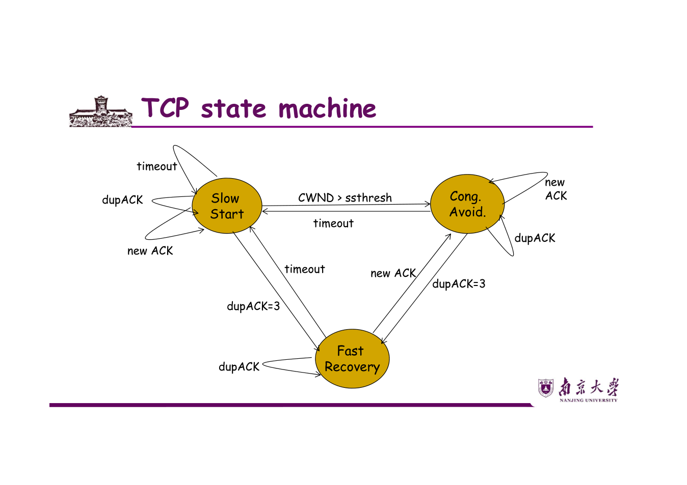

### 11.4 Timeout 和 DupACK 的区别

Timeout：

- 更严重。
- 通常进入 Slow Start。
- `CWND = 1`。

3 duplicate ACK：

- 说明可能是孤立丢包。
- 仍有 ACK 返回。
- 进入 Fast Recovery。
- 通常将窗口减半，而不是回到 1。

### 11.5 TCP 版本

TCP-Tahoe：

- 3 个 duplicate ACK 时 `CWND = 1`。

TCP-Reno：

- timeout 时 `CWND = 1`。
- 3 个 duplicate ACK 时 `CWND = CWND/2`。

TCP-NewReno：

- TCP-Reno 加改进的 fast recovery。

TCP-SACK：

- 使用 selective acknowledgements。

课件默认假设接近 TCP-SACK 或现代 TCP 行为。

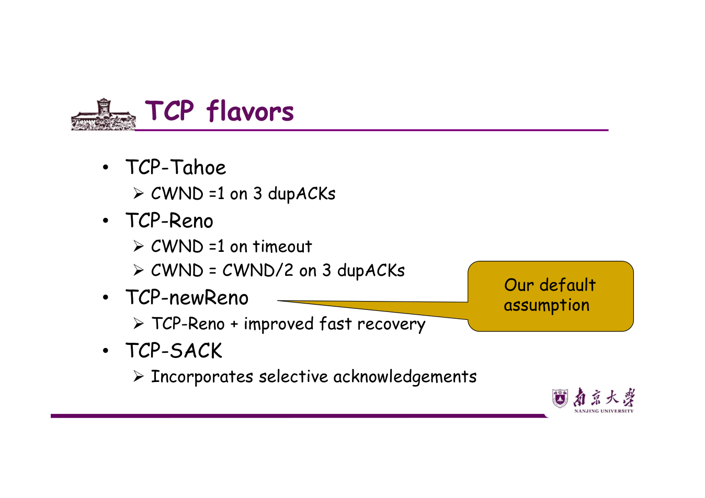

共同原则：

- 好消息时增加 CWND。
- 坏消息时减少 CWND。

## 12. 路由器辅助拥塞控制

### 12.1 TCP 的问题回顾

纯端系统 TCP 拥塞控制有一些问题：

- 会被非拥塞丢失误导。
- 填满队列导致高时延。
- 短流可能还没发现可用容量就结束了。
- AIMD 对高速链路不实用。
- 锯齿式探测对某些应用太剧烈。
- 异构 RTT 下不公平。
- 拥塞控制与可靠性机制耦合紧。
- 端主机可能作弊。

路由器帮助可能解决：

- 路由器告诉端系统是否拥塞。
- 路由器告诉端系统应该以什么速率发送。
- 路由器强制公平共享。

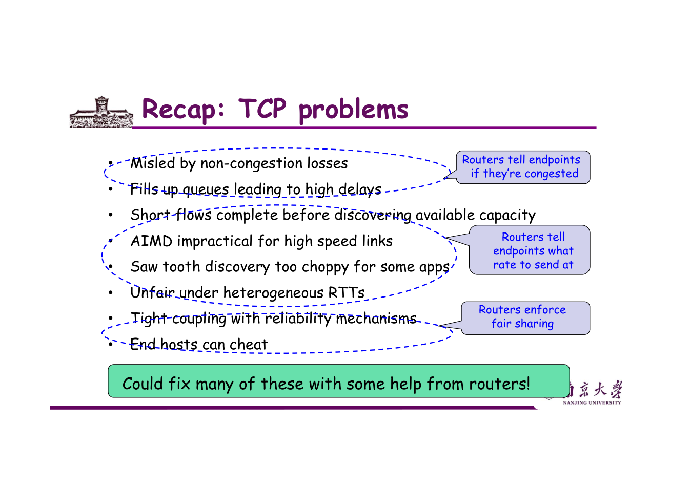

### 12.2 路由器辅助机制

拥塞控制机制包括：

- Choke Packet：抑制分组。
- Backpressure：反压。
- Warning bit：警告位。
- Random early discard：随机早期丢弃。
- Fair Queuing，FQ：公平队列。

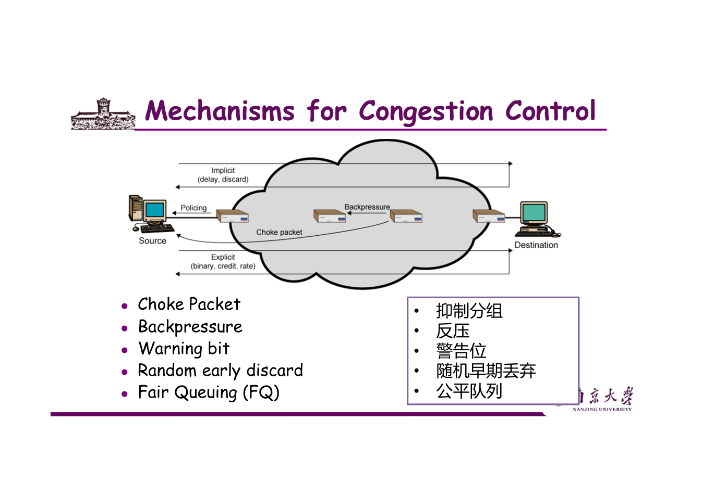

### 12.3 ECN

ECN 是 Explicit Congestion Notification。

机制：

- 在分组首部中使用一个 bit。
- 拥塞路由器设置该 bit。
- 如果数据分组带有拥塞标记，ACK 中也设置 ECN bit。
- 端主机像看到丢包一样降低发送速率。

路由器何时设置 bit 有多种策略，需要在链路利用率和分组时延之间权衡。

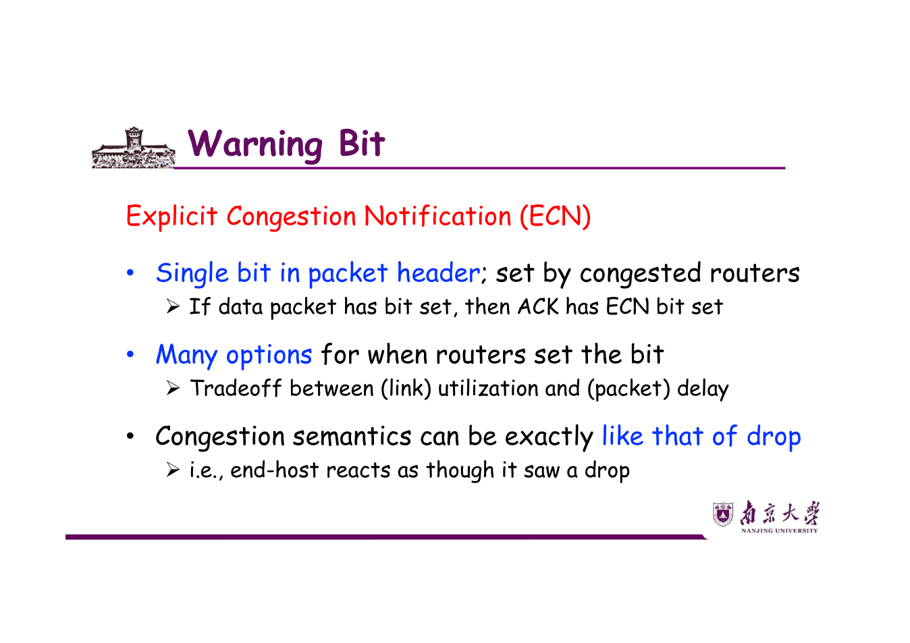

ECN 优点：

- 不会把 bit corruption 和 congestion 混淆。
- 可在不丢包前提前提示拥塞，降低排队时延。
- 比较容易增量部署。
- RFC 3168 使用 IP 首部中的 ToS/DSCP bits 定义 ECN。
- 在数据中心中较常见。

## 13. 本章重点总结

### 13.1 必须掌握的概念

- 运输层为不同主机上的应用进程提供逻辑通信。
- IP 面向主机，运输层通过端口和 socket 面向进程。
- 复用是发送端把多个应用数据合并交给网络层。
- 分用是接收端把 segment 交给正确 socket。
- UDP socket 主要按目的 IP 和目的端口分用。
- TCP socket 由源 IP、源端口、目的 IP、目的端口四元组标识。
- 可靠传输需要 checksum、ACK/NACK、序号、重传、定时器。
- 停等协议正确但低效，吞吐量约为 `DATA/RTT`。
- 流水线允许多个未确认分组在网络中，提高利用率。
- 滑动窗口限制 in-flight packets 数量。
- 累积 ACK 确认“下一个期望序号”。
- 选择 ACK 更精确但更复杂。
- GBN 丢弃乱序分组，超时后回退重传多个分组。
- SR 缓存乱序分组，只重传缺失分组。
- UDP 轻量、无连接、尽力而为，可选 checksum。
- TCP 提供可靠、有序、字节流服务。
- TCP 序号是字节序号，ACK 表示下一个期望字节。
- TCP 通过三次握手建立连接，通过 FIN 或 RST 释放连接。
- TCP 流量控制用 RWND 防止接收方缓冲区溢出。
- TCP 拥塞控制用 CWND 控制网络中的未确认数据量。
- Slow Start 指数增长，Congestion Avoidance 线性增长。
- AIMD 在效率和公平性之间取得较好平衡。
- 3 个重复 ACK 触发快速重传/快速恢复。
- timeout 通常比 duplicate ACK 更严重。
- ECN 让路由器显式通知拥塞。

### 13.2 易混点

#### 流量控制 vs 拥塞控制

- 流量控制保护接收方。
- 拥塞控制保护网络。

#### UDP 分用 vs TCP 分用

- UDP 主要看目的端口。
- TCP 看四元组。

#### Segment 序号 vs 字节序号

- 可靠传输教学例子常把分组编号。
- TCP 实际按字节编号。

#### ACK 丢失 vs 数据丢失

- ACK 丢失可能导致发送方重传。
- 接收方用序号识别重复数据。

#### GBN vs SR

- GBN 简单但可能重传很多。
- SR 复杂但更精确。

#### Timeout vs 3 duplicate ACK

- Timeout 暗示更严重拥塞，通常回到 Slow Start。
- 3 duplicate ACK 暗示孤立丢包，可快速恢复。

#### RWND vs CWND

- RWND 来自接收方，表示接收缓冲空间。
- CWND 来自发送方拥塞控制，表示网络允许的拥塞窗口。
- 实际可发送窗口通常受二者共同限制。

### 13.3 常用公式

```text
停等发送方利用率 = (L/R) / (RTT + L/R)
```

```text
停等吞吐量 ≈ DATA / RTT
```

```text
滑动窗口吞吐量 ≈ MIN(n * DATA / RTT, Link Bandwidth)
```

```text
RWND = B - (LastByteReceived - LastByteRead)
```

```text
TCP ACK = segment first byte sequence number + data length
```

```text
Slow Start: 每个 RTT 约将 CWND 翻倍
```

```text
Congestion Avoidance: 每个 RTT 约将 CWND 增加 1
```

```text
3 duplicate ACK: ssthresh = CWND/2, CWND = ssthresh 或 ssthresh+3
```

```text
timeout: ssthresh = CWND/2, CWND = 1
```

## 14. 复习检查题

1. 为什么 IP 已经提供主机到主机通信，还需要运输层？
2. 复用和分用分别发生在发送端还是接收端？
3. UDP socket 和 TCP socket 的标识方式有什么区别？
4. 为什么 TCP 服务器可以在同一个 80 端口上同时服务多个客户端？
5. 可靠传输需要哪些基本机制？
6. ACK/NACK 损坏时，为什么需要序号？
7. ACK 丢失为什么会造成重复分组？如何处理？
8. 停等协议为什么在大 RTT、高带宽链路上低效？
9. 流水线协议为什么需要更大的序号空间和缓存？
10. 滑动窗口中的 A 和 B 分别表示什么？
11. 累积 ACK 和选择 ACK 有什么区别？
12. GBN 为什么会丢弃乱序分组？
13. SR 为什么更节省带宽但更复杂？
14. UDP 为什么不建立连接？
15. UDP checksum 如何进行错误检测？
16. TCP 的字节流服务是什么意思？
17. TCP 中 sequence number 和 ACK number 的含义是什么？
18. 重传超时设置过短或过长分别有什么问题？
19. Karn/Partridge 算法为什么不使用重传 segment 的 RTT 样本？
20. 为什么 TCP 需要三次握手，而不是两次握手？
21. FIN 和 RST 的区别是什么？
22. TIME_WAIT 的作用是什么？
23. RWND 如何防止接收方缓冲区溢出？
24. 信用分配死锁如何产生？如何处理？
25. 拥塞控制和流量控制的目标有什么不同？
26. Slow Start 为什么名字叫 slow，但增长却是指数级？
27. ssthresh 的作用是什么？
28. AIMD 为什么能兼顾效率和公平？
29. TCP 锯齿图反映了什么过程？
30. 快速恢复为什么在收到 duplicate ACK 时临时增加 CWND？
31. TCP Tahoe、Reno、NewReno、SACK 的差异是什么？
32. ECN 相比丢包信号有什么优势？
