# 第 4 章 网络层：数据平面

> 本章核心问题：
>
> 1. 网络层在协议栈中负责什么？
> 2. 转发和路由有什么区别？
> 3. 数据平面和控制平面如何分工？
> 4. Internet 为什么采用 best-effort 服务模型？
> 5. 路由器内部如何完成查表、交换、排队和调度？
> 6. IPv4 分组首部有哪些关键字段？
> 7. IP 地址、子网、CIDR 和路由聚合如何支持可扩展转发？
> 8. DHCP 如何让主机自动获得网络配置？
> 9. NAT 如何工作，为什么有争议？
> 10. IPv6 解决了什么问题，和 IPv4 有哪些差别？
> 11. 通用转发、OpenFlow 和 middlebox 如何扩展传统 IP 转发模型？


## 0. 本章内容结构

网络层可以分成两个紧密相关但职责不同的部分：

- 数据平面：单台路由器本地的转发功能，决定一个到达输入端口的分组从哪个输出端口离开。
- 控制平面：全网范围的路径选择逻辑，决定源到目的地的路径以及各路由器的转发表。

本章关注数据平面。核心内容包括：

- 网络层功能和服务模型。
- 路由器结构。
- 输入端口、最长前缀匹配和交换结构。
- 输出端口、排队、缓冲和调度。
- IPv4 分组结构。
- IP 地址、子网、CIDR 和 DHCP。
- NAT。
- IPv6。
- 通用转发、SDN、OpenFlow 和 middleboxes。

## 1. 网络层概览

### 1.1 网络层的位置

网络层负责把发送主机的运输层 segment 送到接收主机。

发送端：

- 运输层把 segment 交给网络层。
- 网络层把 segment 封装进 datagram。
- datagram 继续交给链路层传输。

接收端：

- 网络层从链路层收到 datagram。
- 网络层取出其中的运输层 segment。
- 把 segment 交给运输层。

路由器也实现网络层。区别在于：

- 主机通常需要完整协议栈。
- 路由器重点处理网络层及以下层次。
- 路由器会检查经过它的每个 IP datagram 的首部字段，并根据转发表决定下一跳或输出端口。

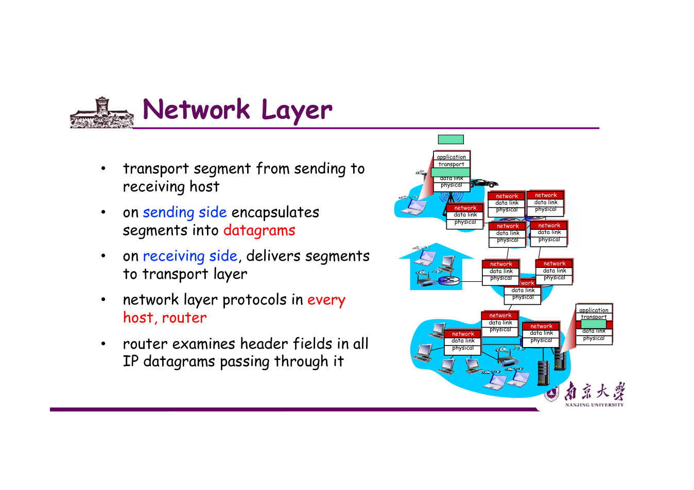

### 1.2 转发与路由

网络层有两个关键功能：forwarding 和 routing。

#### 转发 forwarding

转发是单个路由器内部的本地动作：

- 分组从输入端口到达。
- 路由器查看分组首部。
- 查找转发表。
- 把分组移动到指定输出端口。

类比旅行时进入一个城市的车站：到达苏州站后，应该从哪个站台或出口继续走，这是本地决策。

数据平面主要负责 forwarding。

#### 路由 routing

路由是全网范围的路径规划：

- 从源主机到目的主机应该经过哪些路由器？
- 路径是否最短？
- 网络状态变化后路径如何更新？

类比旅行前规划路线：南京到上海可能经过无锡、苏州等城市，这是全程路径选择。

控制平面主要负责 routing。

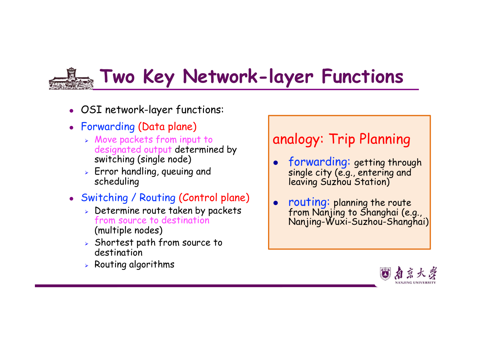

### 1.3 数据平面与控制平面

数据平面是每台路由器内部的本地功能：

- 输入：到达某个输入端口的 datagram。
- 操作：根据首部字段查转发表。
- 输出：把 datagram 转发到指定输出端口。

控制平面是全网逻辑：

- 决定 datagram 从源到目的地经过哪些路由器。
- 计算或安装各路由器中的转发表。
- 可以由分布式路由算法完成，也可以由集中式控制器完成。

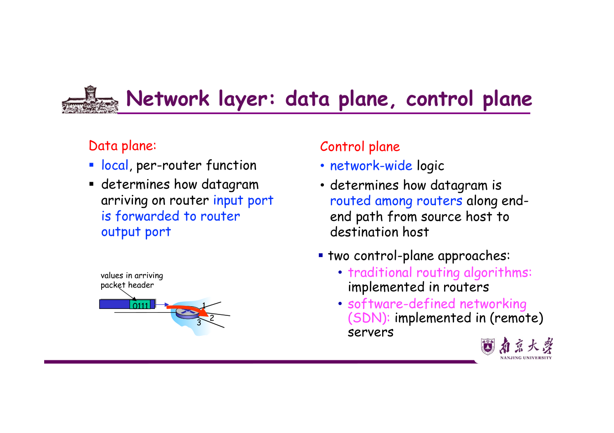

### 1.4 两种控制平面实现方式

#### 每路由器控制平面

传统 Internet 路由中，每台路由器都有自己的路由算法组件。

这些组件彼此交换路由信息，共同计算转发表：

- 控制逻辑分布在每台路由器中。
- 路由器既参与控制平面，又执行数据平面转发。
- 典型协议包括 RIP、OSPF、BGP 等，本章只先建立概念，具体路由算法在控制平面章节讨论。

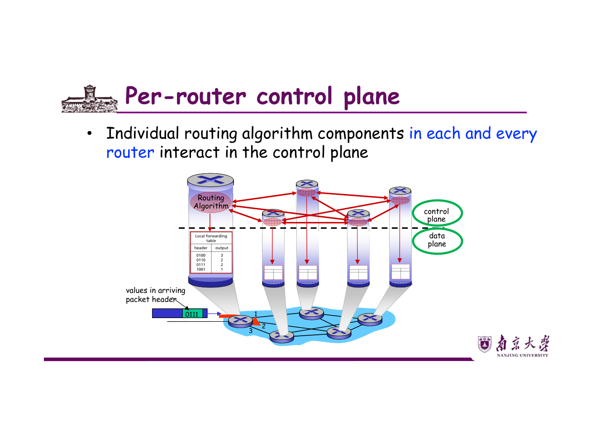

#### SDN 控制平面

SDN，Software-Defined Networking，把控制逻辑移到远程控制器。

基本思路：

- 路由器或交换设备主要负责数据平面转发。
- 远程控制器计算转发表或流表。
- 控制器把规则安装到网络设备中。

这样可以让网络控制逻辑更集中、更可编程，也更容易表达全网策略。

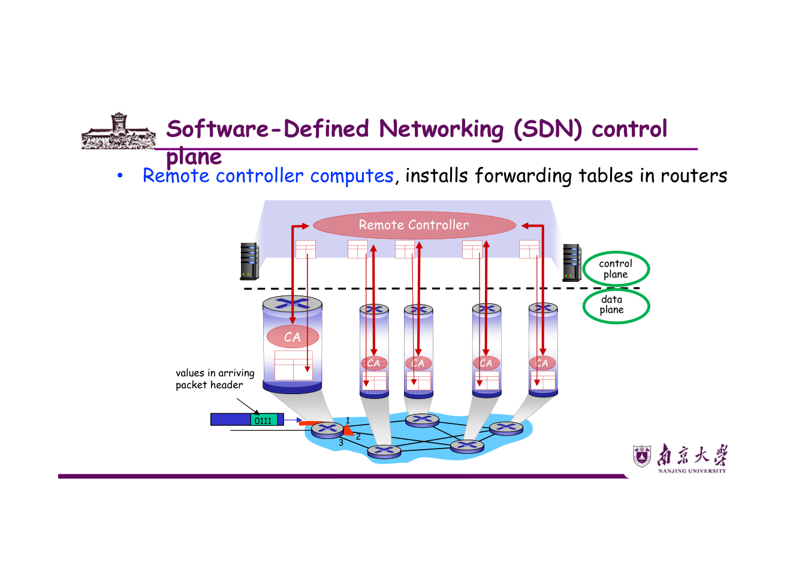

## 2. 网络服务模型

### 2.1 什么是网络服务模型

网络服务模型描述网络层为端到端分组传输提供什么样的“通道”。

可以从单个分组角度要求服务：

- 保证交付。
- 保证在 40 ms 内交付。

也可以从一条 flow 的角度要求服务：

- 按序交付。
- 保证最低带宽。
- 限制相邻分组间隔的变化。

从主机视角看，这些服务常被称为 QoS，Quality of Service。

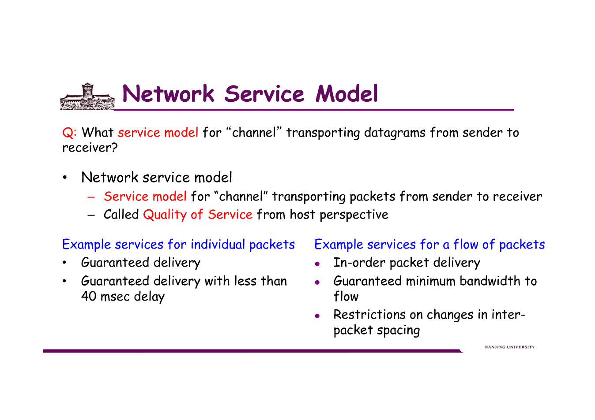

### 2.2 ATM 的服务模型例子

ATM 网络曾经定义了较丰富的服务等级，典型类型包括：

- CBR，Constant Bit Rate，恒定比特率。
- VBR，Variable Bit Rate，可变比特率。
- ABR，Available Bit Rate，可用比特率。
- UBR，Unspecified Bit Rate，未指定比特率。

这些服务模型试图让网络对不同业务提供不同保证。

### 2.3 IP 的服务模型：best effort

Internet 的 IP 层采用 best-effort 服务模型。

best effort 的含义不是“什么都不做”，而是网络层不做强承诺：

- 不保证一定交付。
- 不保证按序交付。
- 不保证时延上界。
- 不保证最小带宽。
- 不保证不重复。

如果发生拥塞、链路错误或路由变化，分组可能丢失、延迟、乱序或重复。

### 2.4 为什么 best effort 成功

best-effort 看起来很弱，但它使 Internet 得以大规模部署。

主要原因：

- 机制简单，路由器不用为每条连接维护复杂状态。
- 带宽持续提升，使许多实时应用在多数时候“足够好”。
- 应用层可以通过复制、CDN、数据中心部署来靠近用户。
- TCP 等弹性服务通过拥塞控制帮助网络稳定。
- 简单统一的 IP 层降低了接入新链路技术和新应用的门槛。

因此，Internet 把许多复杂性留给端系统和应用层，而网络层保持相对简单。

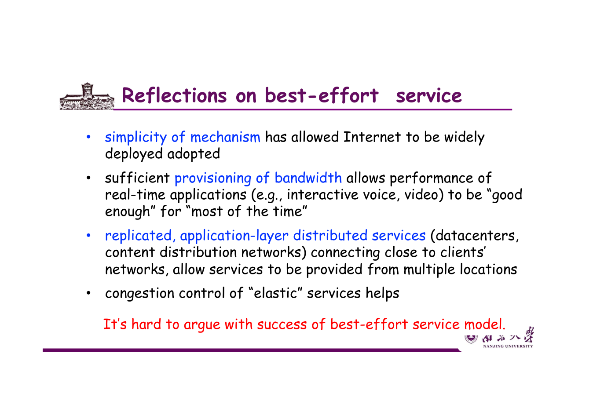

## 3. 路由器结构

### 3.1 路由器的作用

路由器是 Internet 基础设施的核心组成部分。

它连接不同网络，并在网络之间转发 IP datagram。

按部署位置和容量，路由器可以大致分为：

- Core router：核心路由器，端口速率可达 10/40/100/200/400 Gbps，总容量可到数百 Tbps。
- Edge router：边缘路由器，连接 ISP、企业或接入网络。
- Small business router：小型企业或家庭路由器，容量较小。

路由器容量常写成：

```text
Router capacity = N x R
```

其中：

- `N`：外部端口数量。
- `R`：每个端口的线速，line rate。

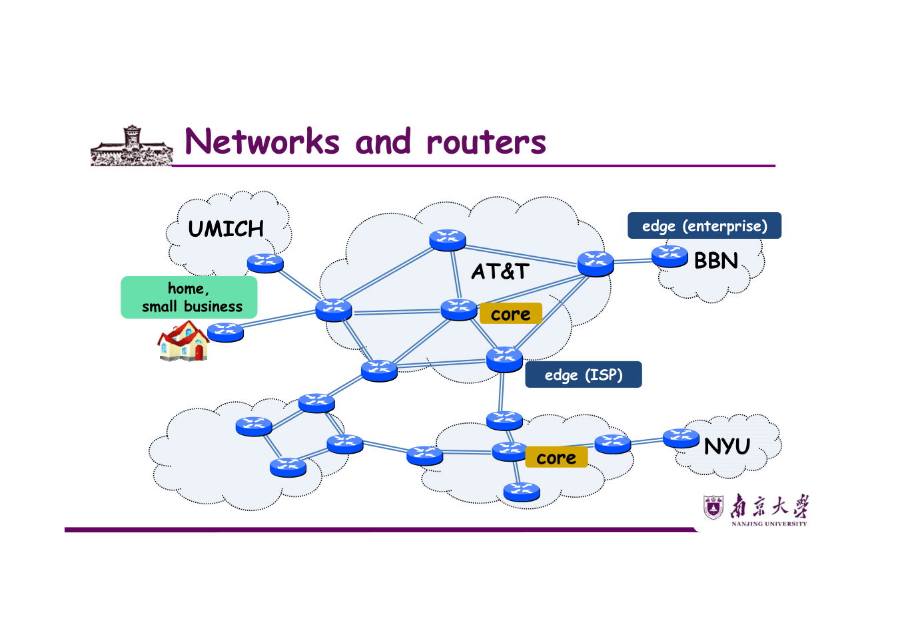

### 3.2 路由器内部总体架构

路由器内部可以分成两部分：

- 控制平面：运行路由算法和管理逻辑，计算转发表。
- 数据平面：在硬件中高速转发分组。

典型组成：

- 输入端口 input ports。
- 交换结构 switching fabric。
- 输出端口 output ports。
- 路由处理器 routing processor。

分组转发路径大致是：

```text
输入链路 -> 输入端口 -> 交换结构 -> 输出端口 -> 输出链路
```

转发表由控制平面计算后，下发到输入端口。这样输入端口可以直接查表，不必每个分组都交给中央 CPU。

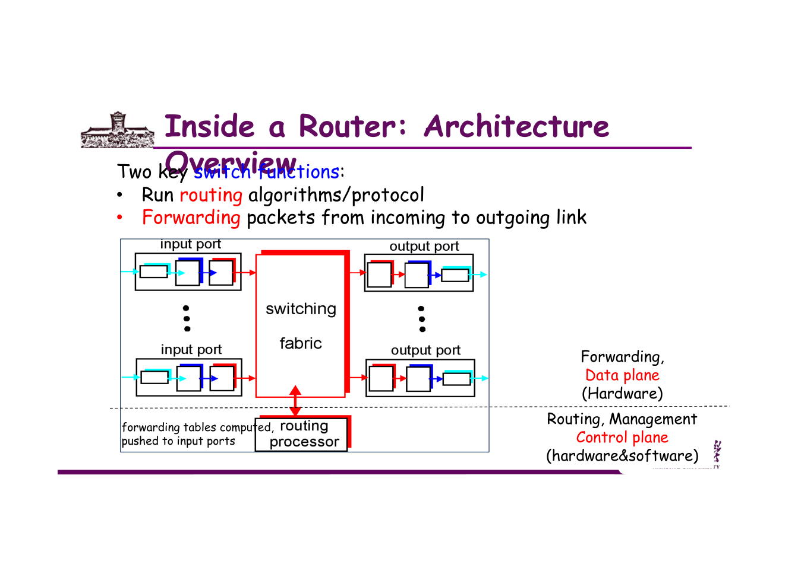

## 4. 输入端口与查表

### 4.1 输入端口负责什么

输入端口需要完成链路和网络层相关处理。

主要任务：

- 物理层接收比特。
- 链路层处理帧、错误检测等。
- 更新 IP 首部中的部分字段，如 TTL、checksum、options、fragment 相关字段。
- 根据目的 IP 地址查找输出端口。
- 如果分组到达速度超过进入交换结构的速度，需要在输入端口排队。

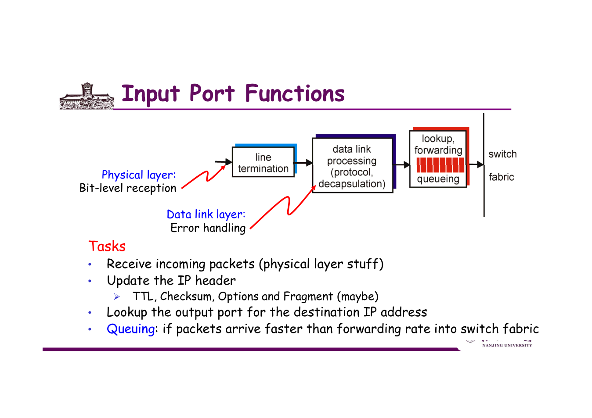

### 4.2 输入端口的速度挑战

输入端口最大的挑战是速度。

例如 40 Gbps 链路上，如果分组大小为 100 B：

```text
100 B = 800 bits
800 bits / 40 Gbps = 20 ns
```

也就是说，每 20 ns 就可能到达一个新分组。

因此，输入端口处理通常依赖专用硬件：

- ASIC。
- Network processor。
- TCAM 或其他高速查找结构。

### 4.3 为什么不能按每个地址建表

IPv4 地址有 32 bit，理论上有约 43 亿个地址。

如果转发表为每个目的地址维护一项：

- 表太大。
- 查找慢。
- 路由更新和存储都不可扩展。

解决方法是地址聚合。

路由器不为每台主机单独建表，而是把连续地址范围聚合为前缀。

## 5. 最长前缀匹配

### 5.1 基本思想

Longest Prefix Matching，最长前缀匹配，是 IP 转发查表的核心规则。

规则：

- 给定目的 IP 地址。
- 在转发表中找所有能匹配该地址的前缀。
- 选择匹配长度最长的那一项。

“最长”意味着最具体。

例如：

```text
110000** -> Port 1
110001** -> Port 2
11001*** -> Port 3
1101**** -> Port 4
```

目的地址如果匹配多个前缀，应选择最长、最具体的前缀，而不是较泛化的前缀。

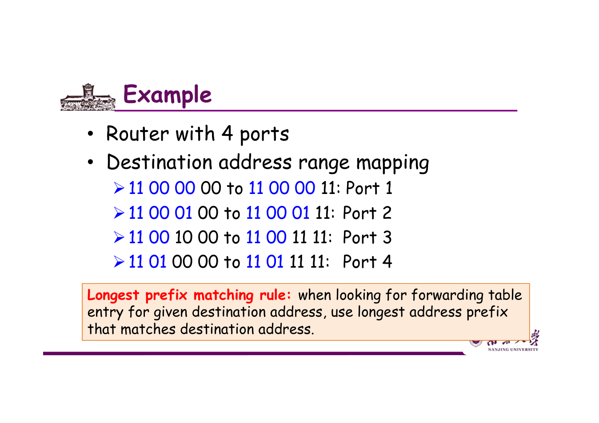

### 5.2 前缀匹配例子

假设路由器有 4 个输出端口：

| 目的地址范围 | 输出端口 |
| --- | --- |
| `11 00 00 00` 到 `11 00 00 11` | Port 1 |
| `11 00 01 00` 到 `11 00 01 11` | Port 2 |
| `11 00 10 00` 到 `11 00 11 11` | Port 3 |
| `11 01 00 00` 到 `11 01 11 11` | Port 4 |

这些范围可以写成前缀形式：

| 前缀 | 输出端口 |
| --- | --- |
| `110000**` | Port 1 |
| `110001**` | Port 2 |
| `11001***` | Port 3 |
| `1101****` | Port 4 |

前缀中的 `*` 表示任意 bit。

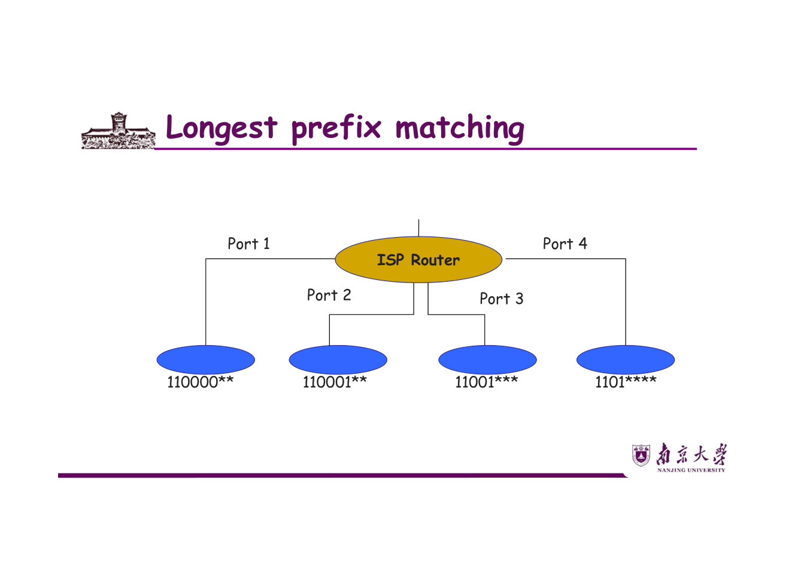

### 5.3 如何高效查找

如果逐项测试每个前缀，平均复杂度约为：

```text
O(number of entries)
```

转发表很大时，这不可接受。

二进制前缀天然具有树结构，可以用 trie 等结构加速查找：

- 地址从高位到低位逐 bit 查找。
- 每经过一个节点，如果该节点关联了输出端口，就记录为当前最佳匹配。
- 继续往下走，若匹配到更长前缀，就覆盖当前最佳匹配。
- 走不下去时，使用最后一次记录的输出端口。

这正是“最长前缀”的含义：一路向下，记住最新也最具体的匹配。

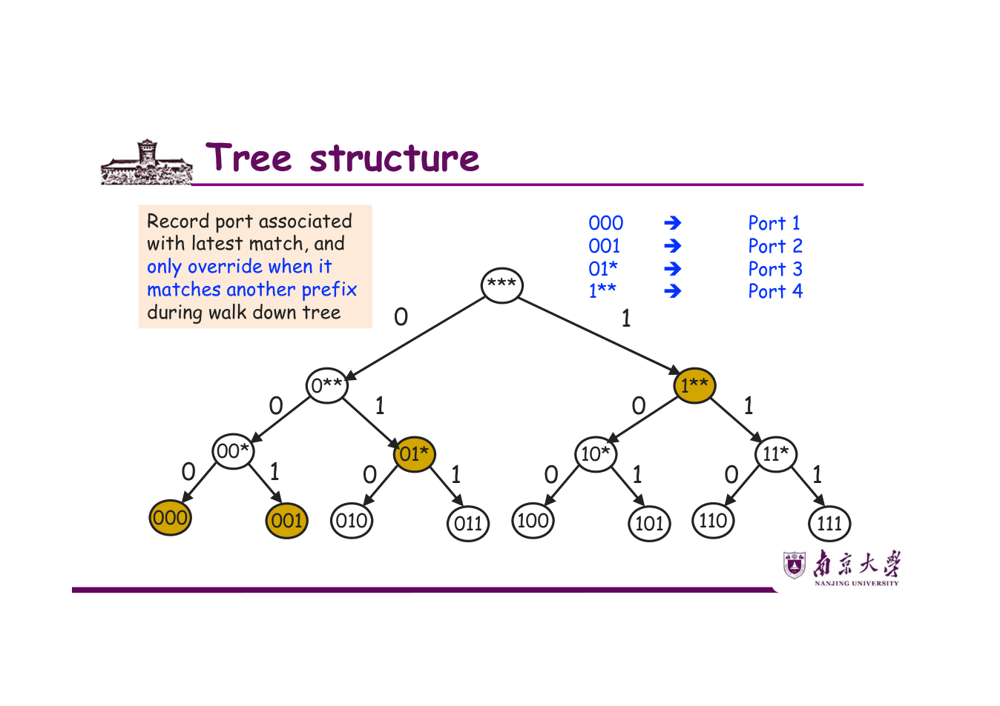

## 6. 交换结构

### 6.1 switching fabric 的作用

交换结构负责把分组从输入缓冲移动到合适的输出缓冲。

核心指标是 switching rate：

- 单位时间内能从输入端口转移到输出端口的分组量。
- 常用输入/输出线速的倍数表示。
- 对于 `N` 个输入端口，理想情况下交换速率应达到 `N` 倍线速。

三种典型交换结构：

- memory。
- bus。
- crossbar 或 mesh。

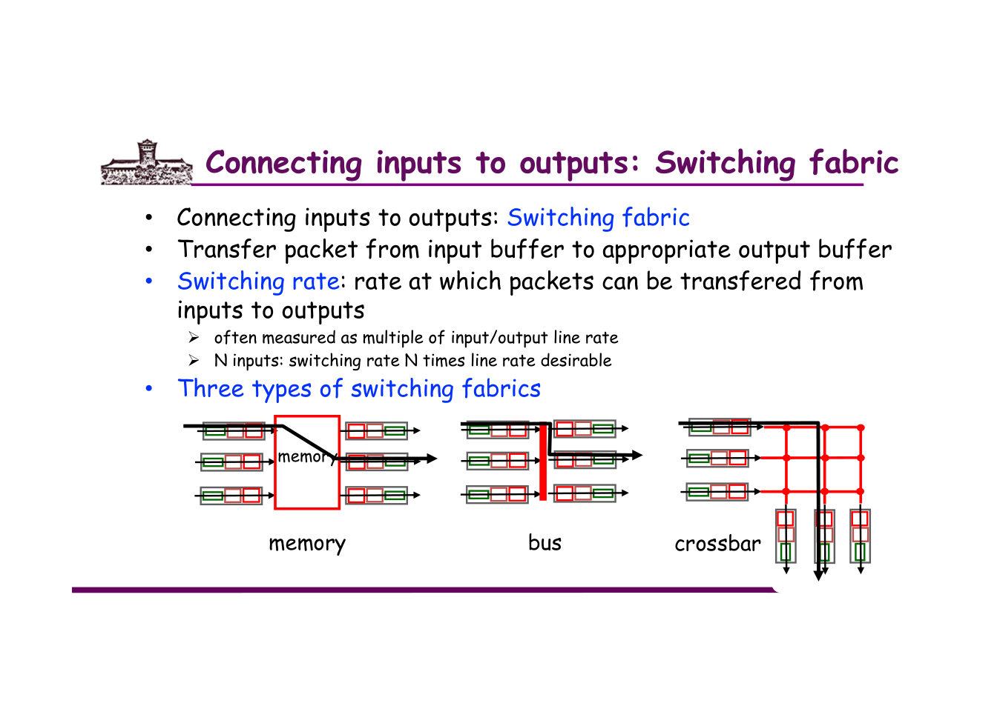

### 6.2 通过内存交换

早期路由器类似传统计算机：

- 输入端口把分组复制到系统内存。
- CPU 控制转发决策。
- 再从内存复制到输出端口。

缺点：

- 每个 datagram 至少经过两次总线或内存访问。
- 交换速率受内存带宽限制。
- 难以支持高速端口。

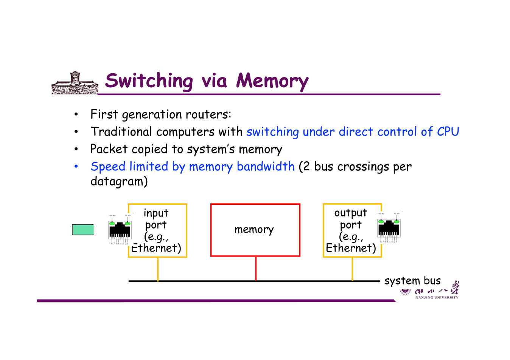

### 6.3 通过总线交换

总线交换中，输入端口通过共享总线把 datagram 传到输出端口内存。

优点：

- 比完全依赖 CPU 和系统内存更直接。
- 对接入或企业级路由器可能足够。

缺点：

- 总线是共享资源。
- 同一时间只能有限数量的数据通过。
- 总线带宽会成为瓶颈。

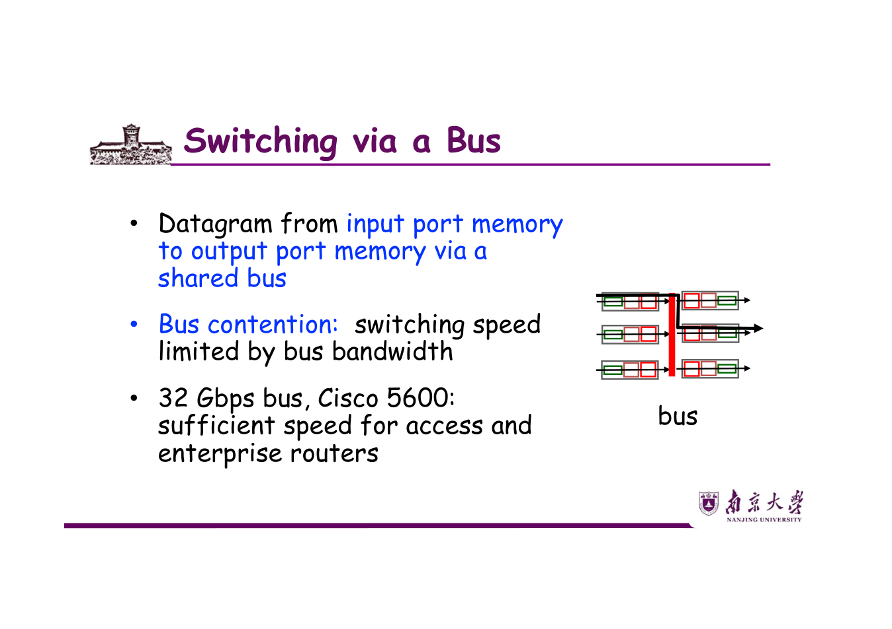

### 6.4 通过交叉开关或网格交换

为了克服总线带宽限制，可以使用 crossbar、Banyan network 等互连结构。

特点：

- 多个输入到不同输出的转移可以并行发生。
- 常将 datagram 切成固定长度 cell，在交换结构中传输。
- 更适合高速核心路由器。

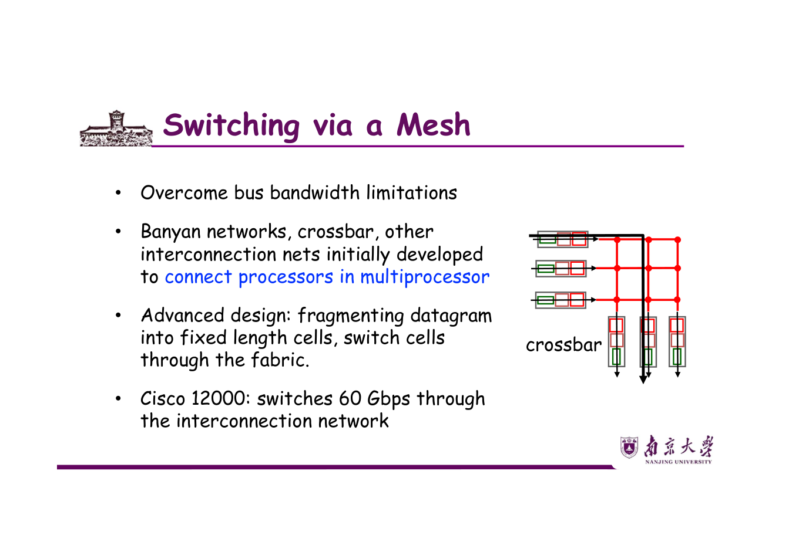

## 7. 输出端口、排队与缓冲

### 7.1 输出端口负责什么

输出端口主要处理从交换结构到输出链路的发送。

典型功能：

- packet classification：把分组归入不同 flow 或类别。
- buffer management：决定缓冲区满时丢哪个分组，或是否标记拥塞。
- scheduler：决定下一次发送哪个队列中的分组。
- 链路层封装和物理层发送。

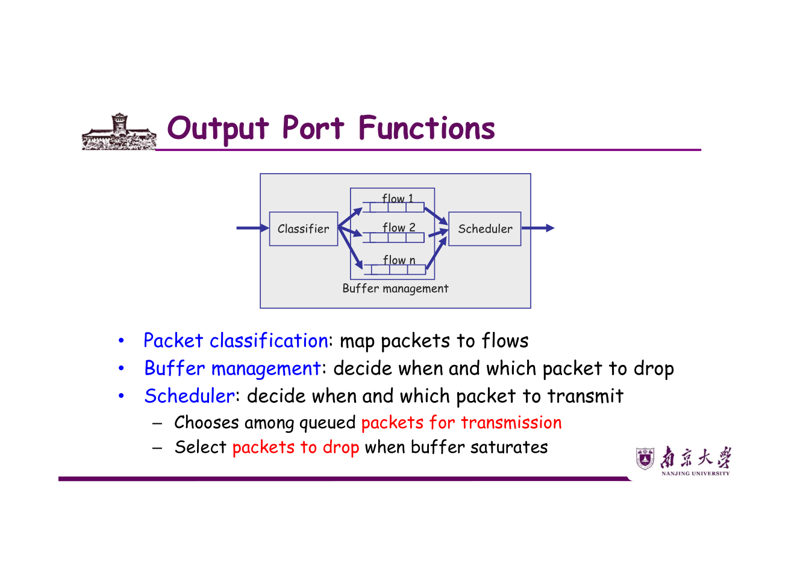

### 7.2 分组分类

Packet classification 可以基于多个首部字段：

- 源 IP 地址。
- 目的 IP 地址。
- 源 TCP/UDP 端口。
- 目的 TCP/UDP 端口。
- TOS 或 DSCP 字段。
- 协议字段。

这些字段经常以范围或通配形式指定，所以一般分类问题可以看成多维范围搜索。

分类在防火墙、QoS、负载均衡、OpenFlow 等场景中都很重要。

### 7.3 输入端口排队与 HOL blocking

如果交换结构速度低于输入端口合计到达速度，输入端口会排队。

输入排队会带来：

- 排队时延。
- 缓冲区溢出导致丢包。
- Head-of-the-Line blocking，队头阻塞。

HOL blocking 指：

- 队列头部的分组想去某个忙碌输出端口。
- 它暂时无法通过交换结构。
- 队列后面即使有分组想去空闲输出端口，也被挡住。

所以阻塞不是因为后面的分组不能转发，而是因为它排在被阻塞分组后面。

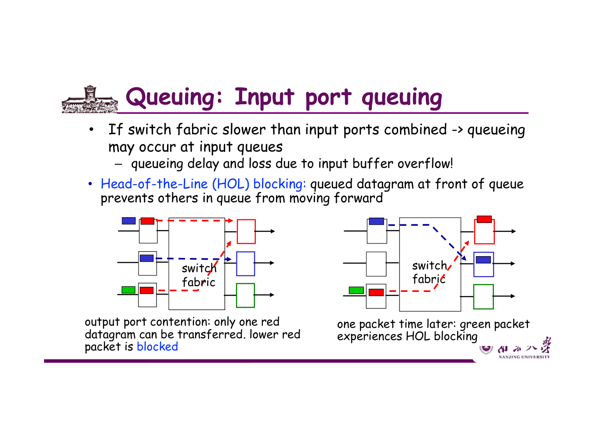

### 7.4 输出端口排队

输出排队发生在：

- 多个输入端口几乎同时把分组送到同一个输出端口。
- 交换结构到达输出端口的速率超过输出链路发送速率。

输出队列会带来：

- 排队时延。
- 缓冲区溢出。
- 分组丢失。

输出端口还需要调度策略决定谁先发。调度策略会影响公平性、优先级和网络中立性。

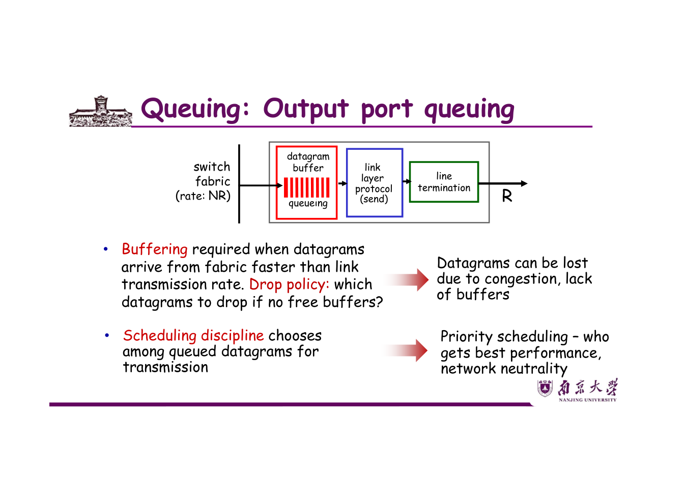

### 7.5 缓冲区应该多大

经典经验规则来自 RFC 3439：

```text
buffer size = RTT x link capacity
```

如果典型 RTT 取 250 ms，链路容量 `C = 10 Gbps`：

```text
0.25 s x 10 Gbps = 2.5 Gbit
```

但缓冲区不是越大越好。

缓冲过大可能造成 bufferbloat：

- 队列积压很长。
- 实时应用时延变大。
- TCP 反应迟钝。
- 用户感觉网络“卡”，即使没有明显丢包。

更现代的建议会考虑并发 flow 数量 `N`，许多独立 TCP 流共享瓶颈链路时，所需缓冲可以小于 `RTT x C`。

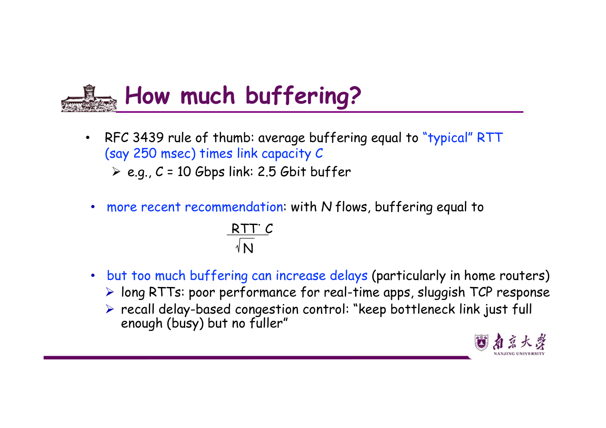

### 7.6 缓冲管理

Buffer management 主要回答两个问题：

- drop：缓冲区满时丢哪个分组？
- marking：什么时候标记分组以通知拥塞？

常见策略：

- Tail drop：缓冲区满时丢弃新到达分组。
- Priority drop：根据优先级丢弃或移除分组。
- RED：Random Early Detection，队列还没满时随机丢弃或标记，提前给端系统拥塞信号。
- ECN：Explicit Congestion Notification，不丢包而是在首部中标记拥塞。

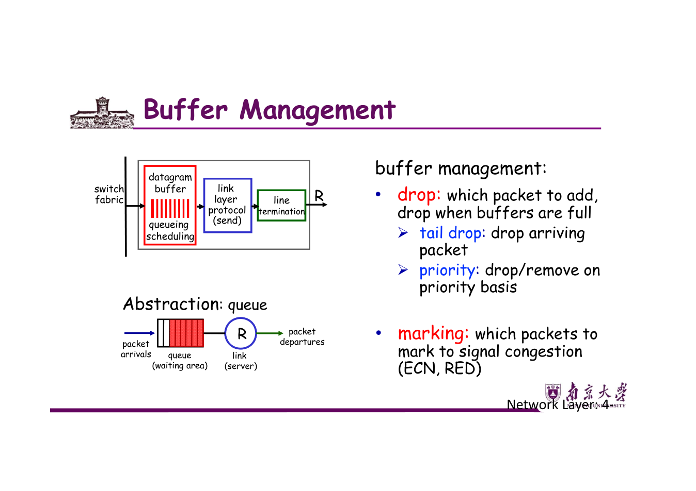

## 8. 分组调度

### 8.1 调度器的目标

调度器决定输出链路下一次发送哪个分组。

调度算法通常需要满足：

- 快：每个分组都要高速决策。
- 支持策略：公平性、优先级、隔离、带宽分配。
- 可实现：在硬件或高性能软件中可部署。

调度常以 flow 为单位组织队列。

### 8.2 FIFO

FIFO 是最简单的调度策略：

- 不做复杂分类。
- 按分组到达顺序发送。
- 缓冲区满时通常使用 tail drop。

优点：

- 简单。
- 开销小。

缺点：

- 无法区分不同 flow 或业务。
- 一个突发流量可能占据大量缓冲。
- 难以提供公平性或优先级。

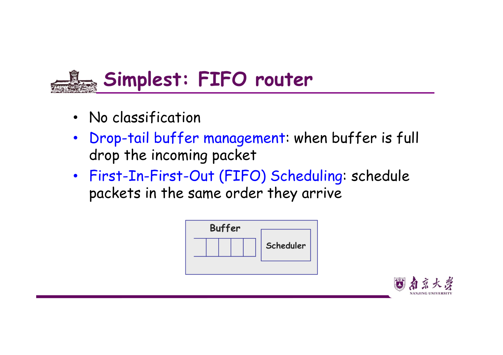

### 8.3 优先级调度

Priority scheduling 把分组分成不同优先级队列。

发送时：

- 先服务高优先级队列。
- 高优先级队列为空时才服务低优先级队列。

适合需要低时延的业务，例如语音或控制报文。

风险：

- 如果高优先级流量长期很多，低优先级队列可能饥饿。
- 需要防止用户或应用滥用高优先级标记。

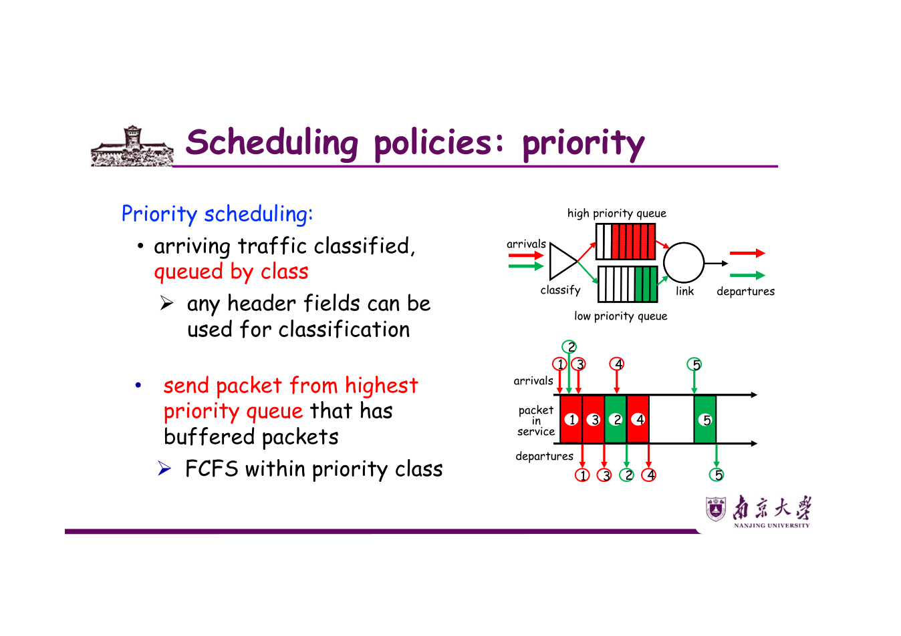

### 8.4 Round Robin

Round Robin 为每个类别或 flow 维护一个队列，轮流从非空队列中取分组发送。

特点：

- 比 FIFO 更公平。
- 每个活跃队列都有机会发送。
- 如果分组大小差异很大，按“分组个数”轮转不一定等价于按“字节数”公平。

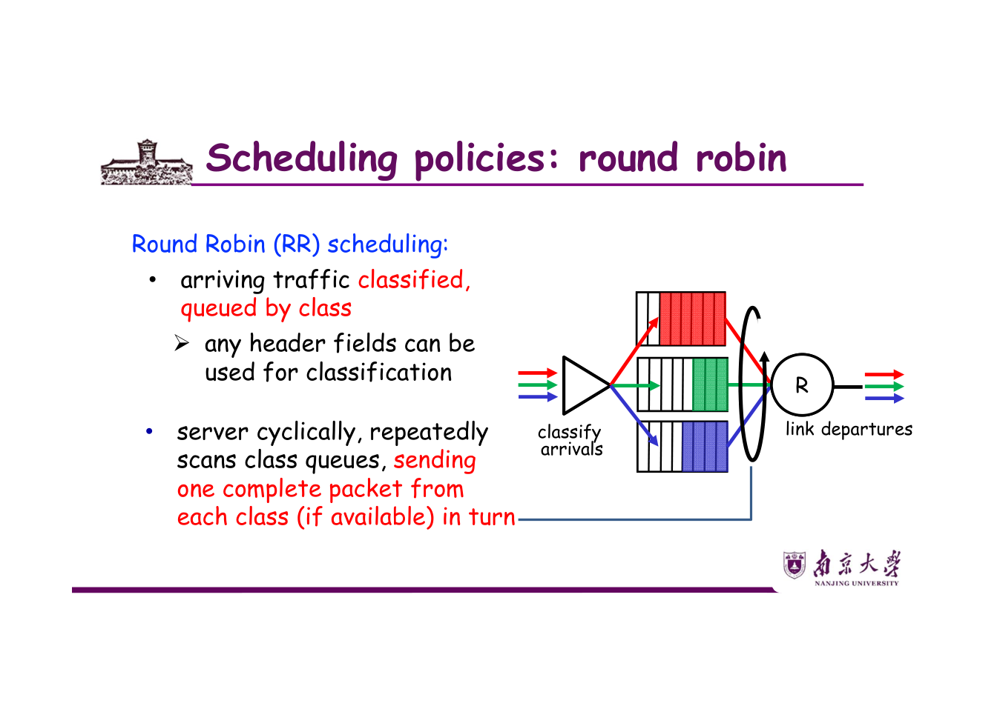

### 8.5 Weighted Fair Queueing

WFQ，Weighted Fair Queueing，是带权重的公平队列。

思想：

- 每个 flow 或类别有一个权重。
- 调度器按权重分配输出链路服务份额。
- 权重越高，长期获得的带宽越多。

如果两个队列权重分别为 2 和 1，在长期满载情况下，第一个队列可获得约两倍服务量。

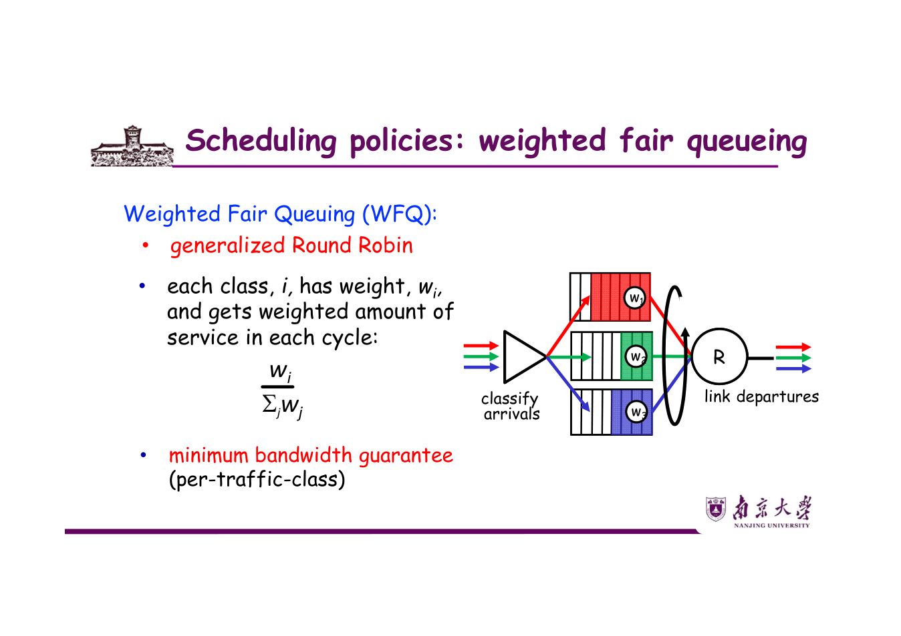

## 9. IPv4 分组结构

### 9.1 IPv4 首部总览

IPv4 datagram 由首部和数据字段组成。

首部中最重要的字段包括：

- Version。
- Header length。
- Type of Service。
- Total length。
- Identification、Flags、Fragment offset。
- Time To Live。
- Protocol。
- Header checksum。
- Source IP address。
- Destination IP address。
- Options。

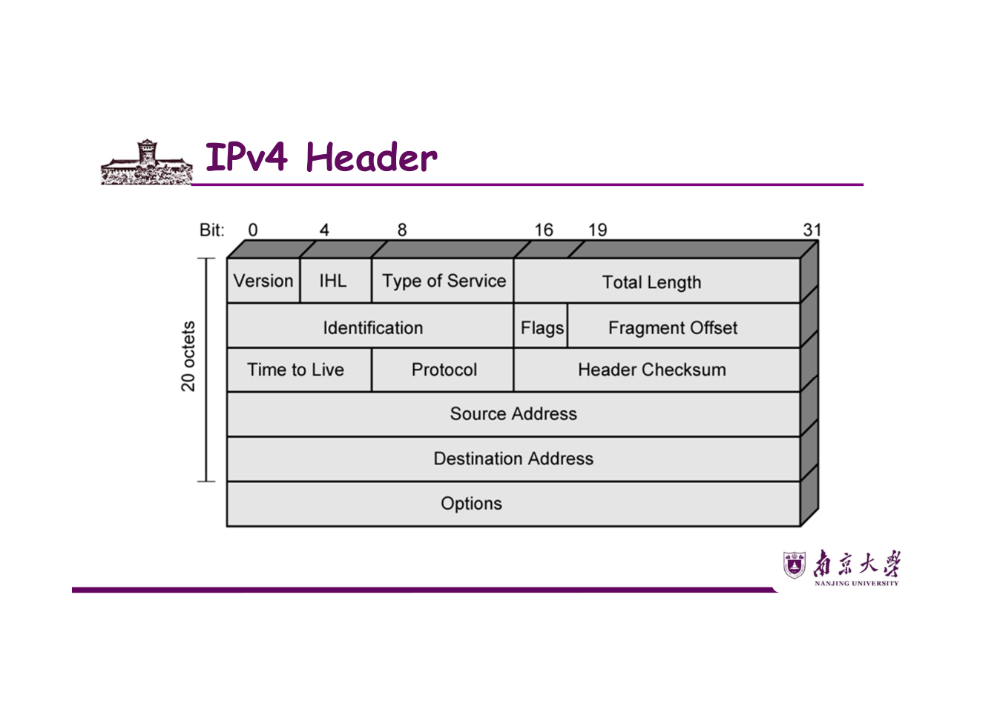

### 9.2 Version 和 Header Length

Version 字段长度为 4 bit。

- IPv4 中该字段值为 4。
- IPv6 中该字段值为 6。

Header Length 表示 IPv4 首部长度。

IPv4 首部可变长，因为可能包含 options：

- 最小首部长度为 20 B。
- 没有 options 时通常就是 20 B。
- 接收方需要根据 Header Length 找到数据字段起始位置。

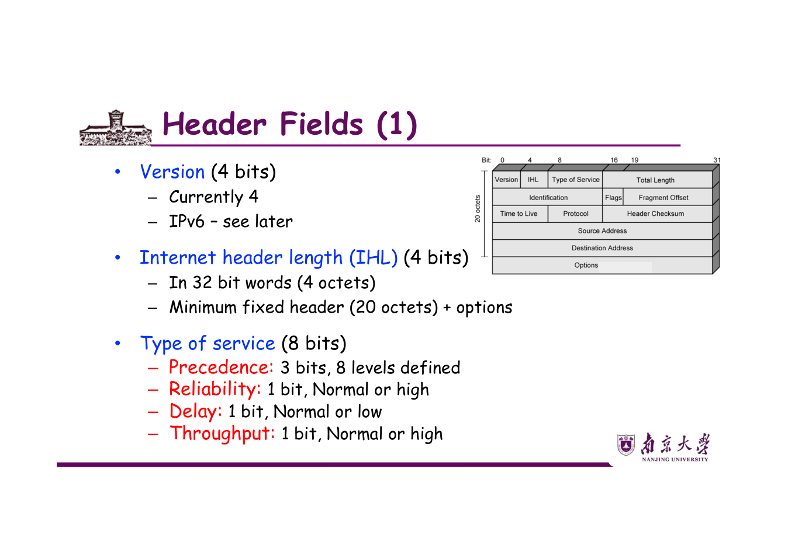

### 9.3 Type of Service 和 Total Length

Type of Service，后来演化为 DSCP/ECN 等用途，用于表达服务类别或拥塞通知。

Total Length 表示整个 IPv4 datagram 的长度：

```text
Total Length = Header Length + Data Length
```

该字段为 16 bit，所以 IPv4 datagram 最大长度为：

```text
2^16 - 1 = 65535 bytes
```

### 9.4 Fragmentation 相关字段

IPv4 支持分片。

相关字段：

- Identification：标识属于同一个原始 datagram 的分片。
- Flags：包含是否允许分片、后面是否还有分片等信息。
- Fragment Offset：说明当前分片在原始数据中的位置。

分片的背景是不同链路有不同 MTU。

如果 datagram 大于下一条链路 MTU，IPv4 路由器可能对其分片。

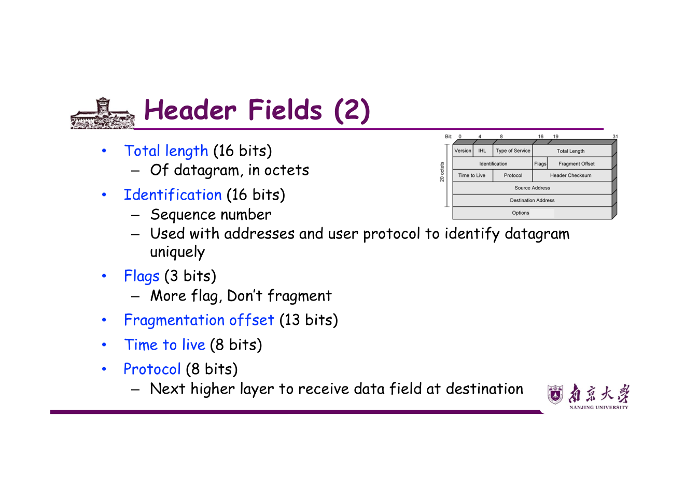

### 9.5 TTL

TTL，Time To Live，用来限制分组在网络中的生存时间。

实际使用中，TTL 通常表示跳数上限：

- 每经过一个路由器，TTL 减 1。
- TTL 变为 0 时，路由器丢弃该分组。

作用：

- 防止路由环路导致分组无限转发。
- `traceroute` 等工具也利用 TTL 逐跳探测路径。

### 9.6 Protocol

Protocol 字段告诉接收主机，IP 数据部分应该交给哪个上层协议。

常见值：

| Protocol 值 | 上层协议 |
| --- | --- |
| 6 | TCP |
| 17 | UDP |
| 1 | ICMP |

这个字段类似运输层中的端口，但粒度是“上层协议类型”，不是“应用进程”。

### 9.7 Header Checksum

IPv4 header checksum 只覆盖 IP 首部，不覆盖数据字段。

每个路由器都可能修改首部：

- TTL 会减 1。
- 某些 options 或分片字段可能变化。

所以每跳都需要重新计算首部 checksum。

IPv6 删除了首部 checksum，以减少路由器处理开销。

### 9.8 Source 和 Destination Address

Source IP address 表示源主机或源接口地址。

Destination IP address 表示目的主机或目的接口地址。

路由器转发主要查看目的 IP 地址，并用最长前缀匹配查找输出端口。

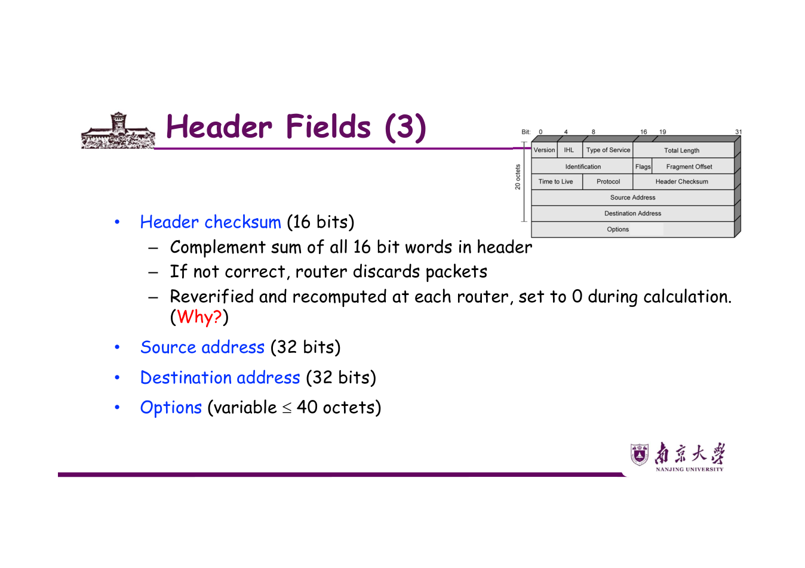

## 10. IP 地址

### 10.1 IP 地址的作用

IP 地址用于标识网络接口，而不是简单标识一台机器。

如果一台主机或路由器有多个物理接口，它通常需要多个 IP 地址。

这样设计有利于路由：

- 地址包含网络位和主机位。
- 路由器根据网络前缀转发。
- 同一网络中的接口共享相同网络前缀。

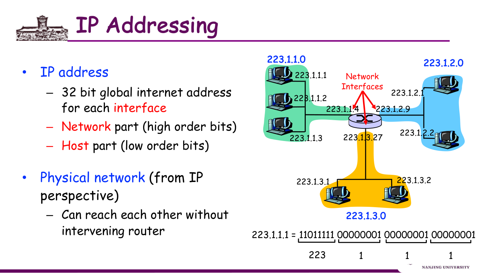

### 10.2 物理网络计数

理解 IP 地址前，先区分主机、路由器接口和物理网络。

一个子网通常可以理解为：

- 一组接口。
- 这些接口不经过路由器即可彼此到达。
- 它们共享相同网络前缀。

路由器连接多个子网，因此路由器的每个接口属于不同子网。

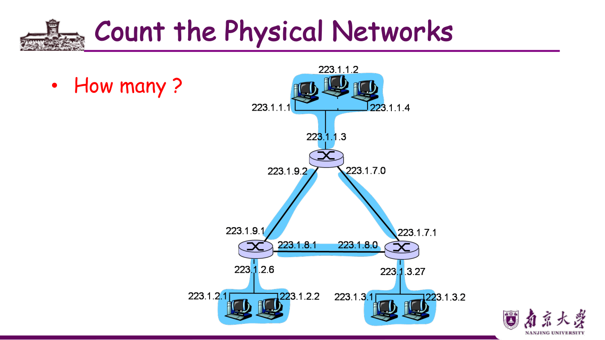

### 10.3 点分十进制表示

IPv4 地址长度为 32 bit，常写成点分十进制：

```text
223.1.1.1
```

每一段是 8 bit，范围为 0 到 255。

二进制和十进制对应示例：

```text
11011111 00000001 00000001 00000001
= 223.1.1.1
```

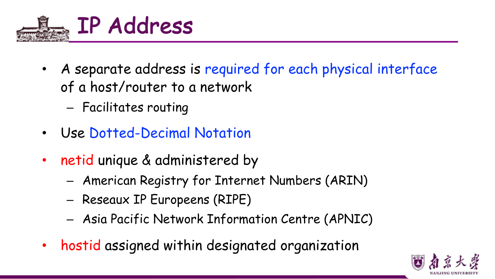

## 11. 有类地址

### 11.1 IPv4 地址格式

早期 IPv4 使用有类地址，按开头 bit 划分 A、B、C、D、E 类。

| 类别 | 开头 bit | 用途 |
| --- | --- | --- |
| A | `0` | 大型网络 |
| B | `10` | 中型网络 |
| C | `110` | 小型网络 |
| D | `1110` | 组播 |
| E | `1111` | 保留 |

有类地址的问题是粒度粗，容易浪费地址空间。

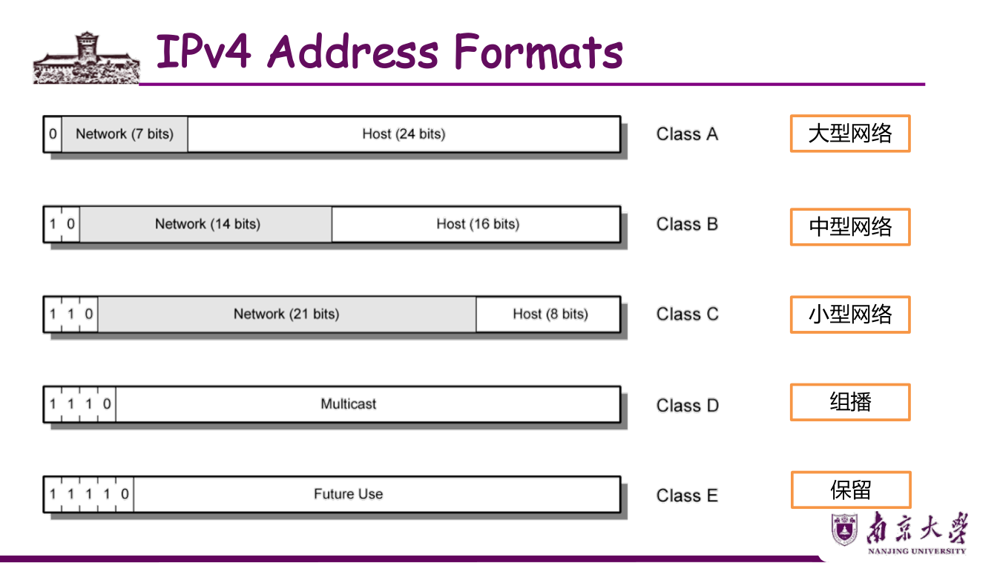

### 11.2 A 类地址

A 类地址特点：

- 首位为 `0`。
- 地址范围：`1.x.x.x` 到 `126.x.x.x`。
- 网络号长度为 8 bit，其中首位固定为 0。
- 主机号长度为 24 bit。

可用网络数约：

```text
2^7 - 2 = 126
```

每个网络可容纳主机数：

```text
2^24 - 2 = 16777214
```

需要扣除：

- 主机位全 0：网络地址。
- 主机位全 1：广播地址。

`127.*.*.*` 保留为 loopback，用于本地回环测试。

### 11.3 B 类地址

B 类地址特点：

- 开头为 `10`。
- 地址范围：`128.0.x.x` 到 `191.255.x.x`。
- 前两个字节属于网络地址。
- 可支持 `2^14 = 16384` 个 B 类网络。
- 每个网络最多约 `2^16 - 2 = 65534` 台主机。

### 11.4 C 类地址

C 类地址特点：

- 开头为 `110`。
- 地址范围：`192.0.0.x` 到 `223.255.255.x`。
- 前三个字节属于网络地址。
- 可支持 `2^21` 个 C 类网络。
- 每个网络最多 `2^8 - 2 = 254` 台主机。

### 11.5 有类地址的问题

有类地址不够灵活：

- A 类太大，数量太少。
- C 类太小，很多组织不够用。
- B 类适中但很快被大量分配。
- 路由表条目膨胀。

这些问题推动了子网和 CIDR 的出现。

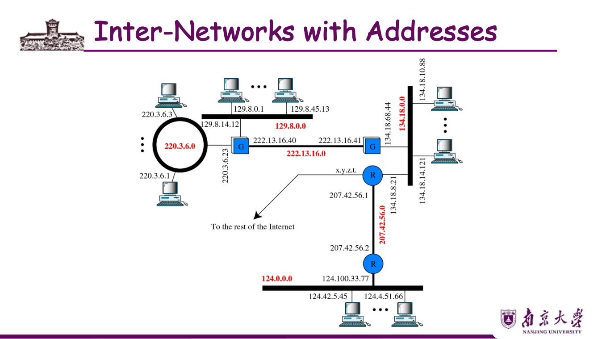

## 12. 子网与子网掩码

### 12.1 为什么需要子网

子网解决网络地址粒度不足的问题。

基本思想：

- 原本的 host 部分再划分为 subnet number 和 host number。
- 每个 LAN 可以分配一个子网号。
- 组织内部路由器根据子网号进行本地路由。
- 对外部 Internet 来说，整个组织仍可表现为一个网络。

这样可以隔离内部网络增长，减少全局路由复杂度。

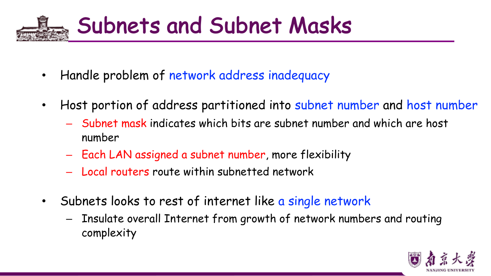

### 12.2 子网掩码

子网掩码用于说明 IP 地址中哪些 bit 属于网络或子网部分，哪些 bit 属于主机部分。

例如：

```text
255.255.255.0
= 11111111.11111111.11111111.00000000
```

前 24 bit 是网络前缀，后 8 bit 是主机号。

也可以写成 CIDR 形式：

```text
192.168.1.0/24
```

其中 `/24` 表示前缀长度为 24 bit。

### 12.3 子网例子

如果一个组织有多个 LAN：

- 每个 LAN 是一个子网。
- 路由器接口连接不同子网。
- 每个子网拥有自己的网络前缀。

从组织内部看，路由需要区分这些子网。

从组织外部看，可以只宣传更聚合的网络前缀。

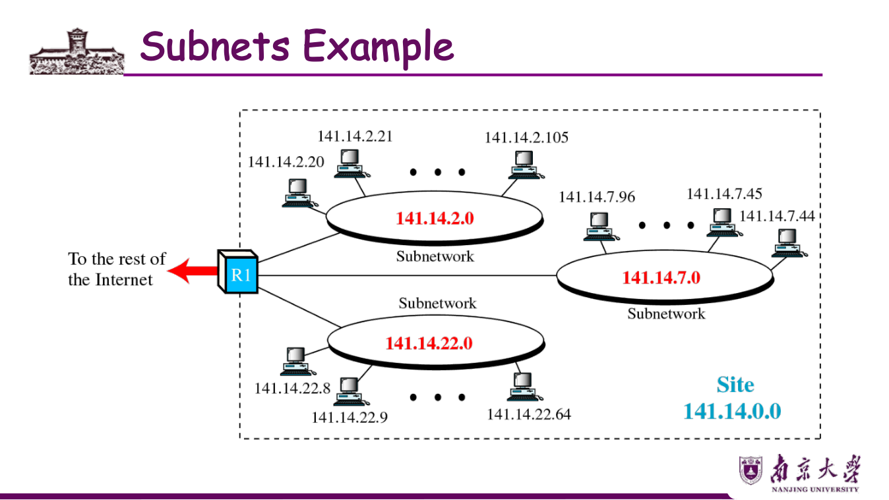

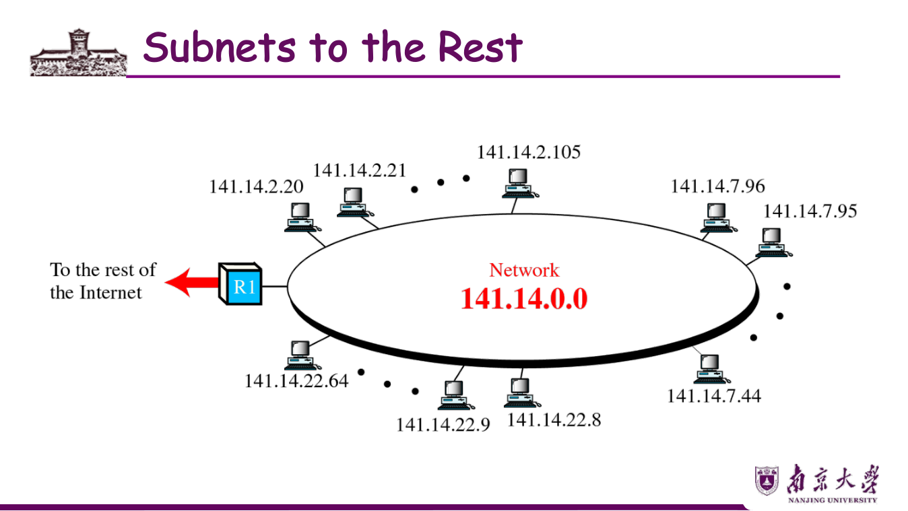

## 13. CIDR 与路由聚合

### 13.1 CIDR 表示法

CIDR，Classless Inter-Domain Routing，取消固定 A/B/C 类边界，用任意长度前缀表示网络。

格式：

```text
A.B.C.D/n
```

其中 `n` 是网络前缀长度。

例如：

```text
10.217.112.0/20
```

含义：

- 前 20 bit 是网络前缀。
- 后 12 bit 是主机部分。
- 子网掩码为 `255.255.240.0`。

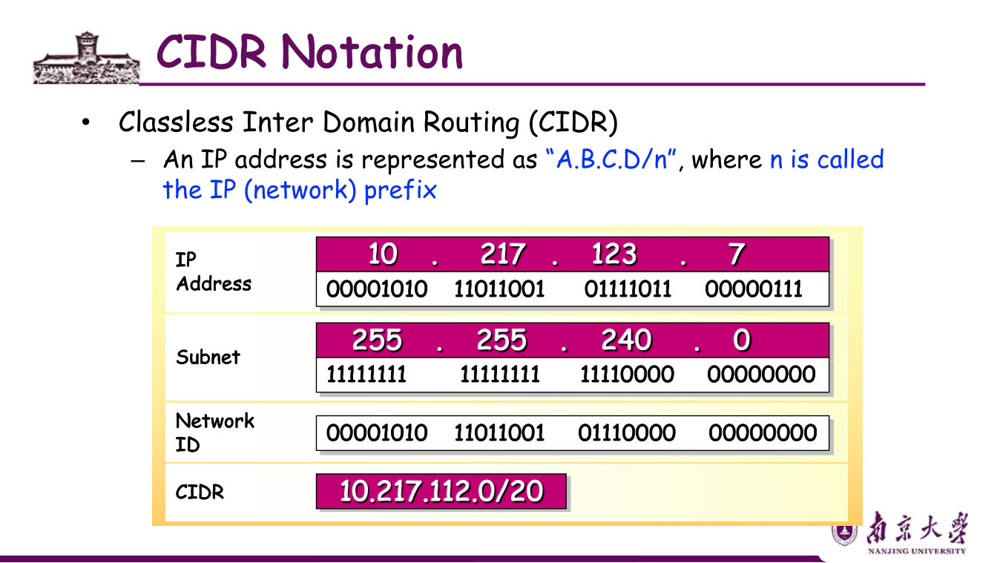

### 13.2 CIDR 的计算

以 `10.217.123.7/20` 为例。

地址二进制形式：

```text
10       .217      .123      .7
00001010 .11011001 .01111011 .00000111
```

`/20` 表示前 20 bit 保留，后 12 bit 置 0 得到网络地址：

```text
00001010 .11011001 .01110000 .00000000
= 10.217.112.0
```

所以该地址所在网络是：

```text
10.217.112.0/20
```

### 13.3 层次化地址

ISP 可以被看作一组子网的集合。

层次化地址的好处：

- 上级 ISP 可以给下级组织分配连续地址块。
- 下级组织内部再划分子网。
- 对外只宣传聚合后的前缀。

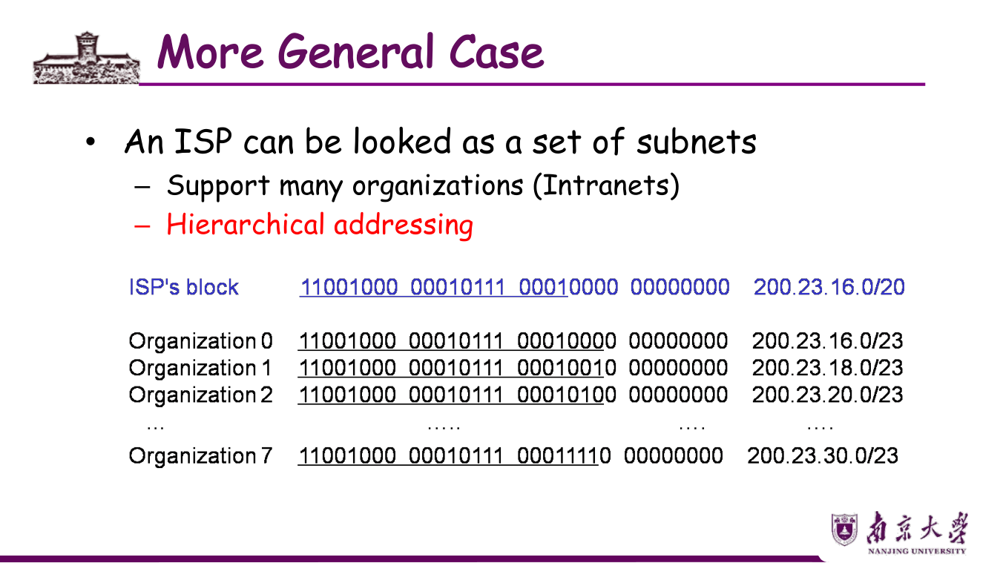

### 13.4 路由聚合

Route aggregation 允许多个更具体前缀合并为一个较短前缀对外发布。

例如，某 ISP 拥有连续地址块：

```text
200.23.16.0/20
```

它可以把内部多个组织的更具体前缀聚合成一个对外路由项。

好处：

- 减少全局路由表规模。
- 提高查表和路由更新的可扩展性。
- 隐藏内部网络细节。

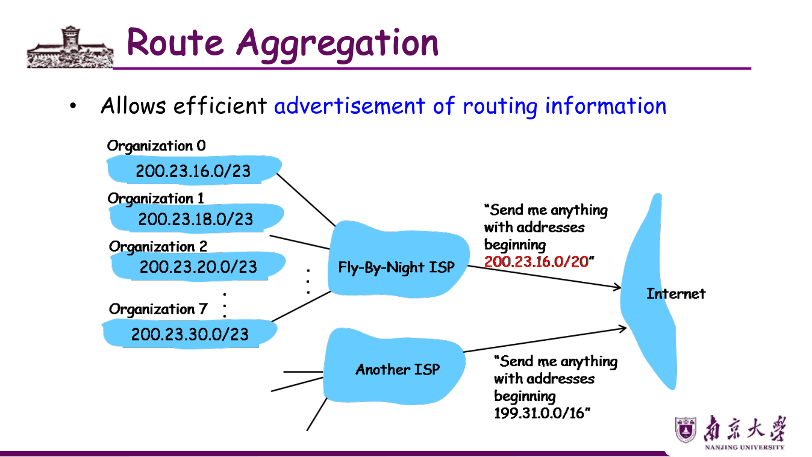

## 14. DHCP

### 14.1 主机如何获得 IP 地址

这个问题可以拆成两个层次：

1. 主机如何获得所在网络内的 IP 地址，也就是 host part？
2. 网络本身如何获得地址块，也就是 network part？

主机获得 IP 地址的方式：

- 管理员手动配置。
- DHCP 动态分配。

DHCP，Dynamic Host Configuration Protocol，提供 plug-and-play 的地址配置。

### 14.2 DHCP 的目标

DHCP 的目标是：主机加入网络时，从网络服务器动态获得 IP 地址和相关配置。

DHCP 支持：

- 地址租约续期。
- 地址复用，主机离开后地址可重新分配。
- 移动用户频繁加入和离开网络。
- 自动配置第一跳路由器、DNS 服务器和网络掩码。

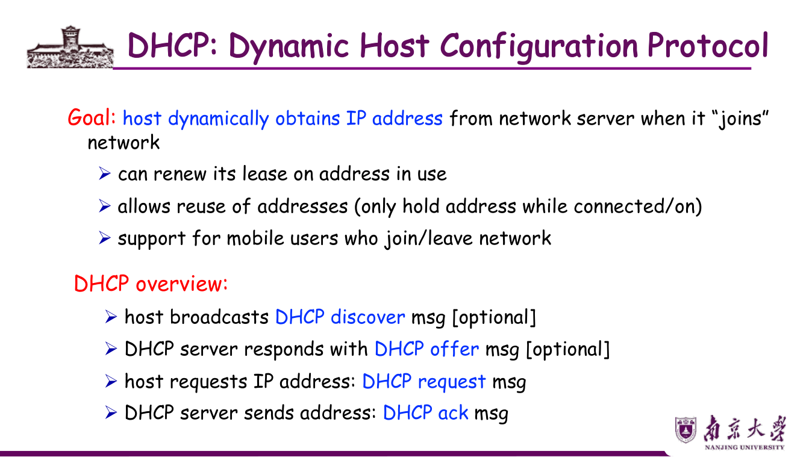

### 14.3 DHCP 四步过程

典型 DHCP 过程包括：

1. DHCP Discover：客户端广播发现消息，寻找 DHCP 服务器。
2. DHCP Offer：服务器返回可用地址和配置。
3. DHCP Request：客户端请求使用某个地址。
4. DHCP ACK：服务器确认分配。

因为刚接入网络的主机还不知道自己的 IP 地址，也不知道 DHCP 服务器地址，所以早期消息通常使用广播。

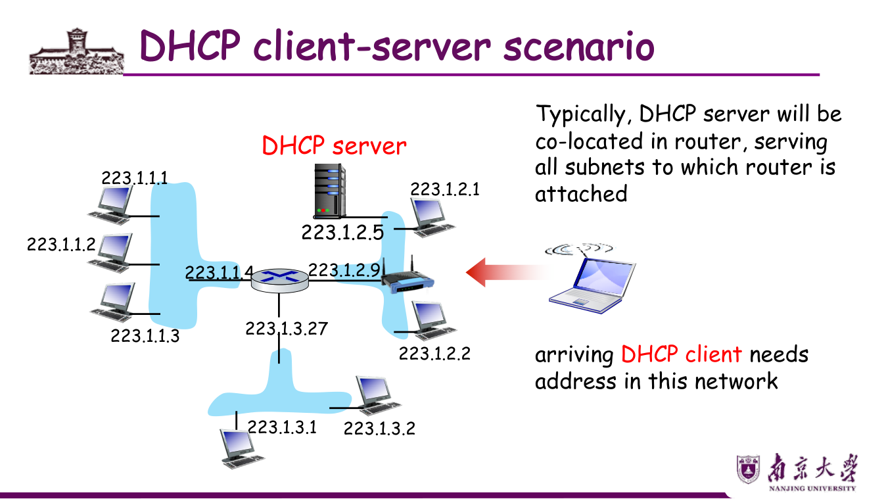

### 14.4 DHCP 返回的不只是 IP 地址

DHCP 可以返回：

- 客户端 IP 地址。
- 第一跳路由器地址。
- DNS 服务器名字和 IP 地址。
- 网络掩码。
- 地址租约时间。

所以 DHCP 不只是“分配 IP”，而是让主机获得上网所需的一组基础网络配置。

### 14.5 DHCP 封装过程

DHCP 报文封装层次：

```text
DHCP message
-> UDP segment
-> IP datagram
-> Ethernet frame
```

客户端发送 DHCP REQUEST 时：

- DHCP 放入 UDP。
- UDP 放入 IP。
- IP 放入以太网帧。
- 以太网目的地址可能是广播地址 `FF:FF:FF:FF:FF:FF`。
- 局域网内运行 DHCP server 的路由器收到该帧。

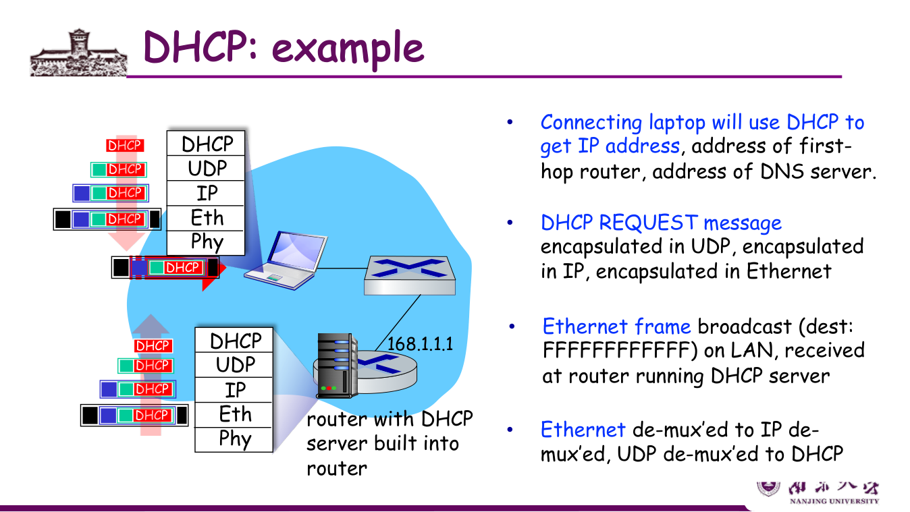

服务器返回 DHCP ACK 时：

- ACK 中包含客户端 IP 地址。
- 还包含第一跳路由器、DNS 服务器等信息。
- 客户端逐层解封装后获得配置。

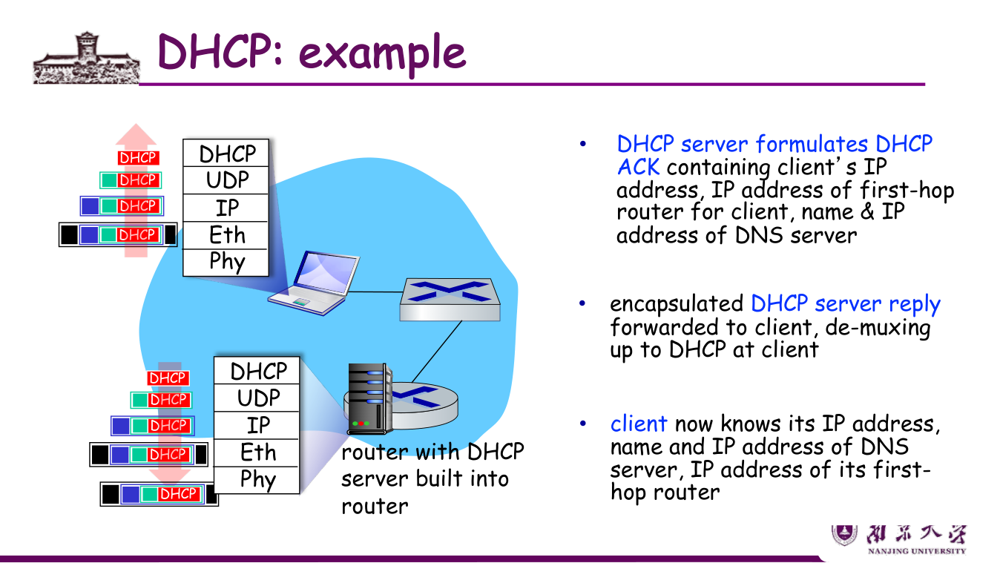

## 15. NAT

### 15.1 NAT 的基本思想

NAT，Network Address Translation，网络地址转换。

它允许内部网络和外部 Internet 使用不同地址空间。

NAT 路由器位于内部网络和外部 Internet 的边界：

- 内部侧使用私有地址。
- 外部侧使用一个或多个公网地址。
- NAT 路由器在分组经过时改写 IP 地址，有时也改写端口号。

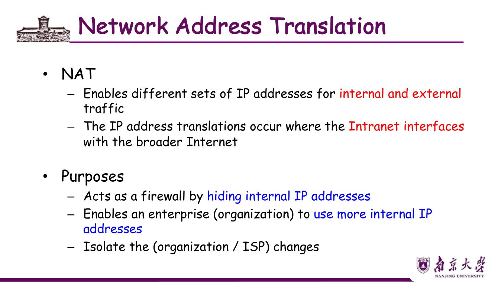

### 15.2 NAT 的目的

NAT 常见目的：

- 隐藏内部 IP 地址，起到一定防护作用。
- 让大量内部主机共享少量公网地址。
- 内部网络地址改变时，不影响外部 Internet。
- 更换 ISP 或公网地址块时，减少内部改动。

### 15.3 三类 NAT

常见 NAT 类型：

| 类型 | 含义 | 常见用途 |
| --- | --- | --- |
| Static NAT | 一个私有 IP 固定映射到一个公网 IP | 内部服务器对外提供服务 |
| Dynamic NAT | 从公网地址池中按需分配公网 IP | 内部客户端访问外网 |
| NAPT | 多个内部地址共享一个公网地址，通过端口区分 | 家庭和企业常用 |

NAPT 也叫：

- Single-Address NAT。
- Overloading。
- Masquerading。
- Network Address Port Translation。

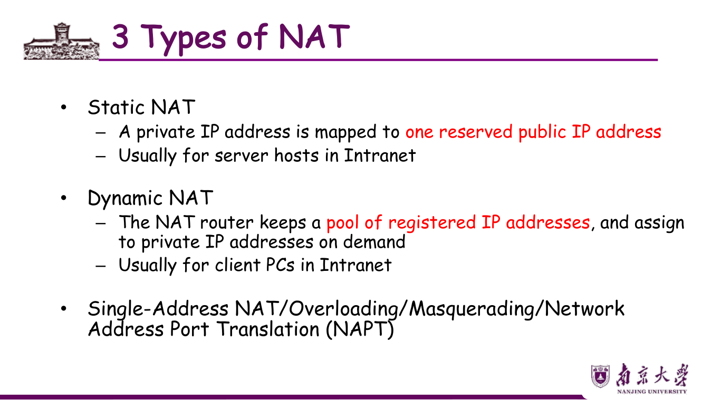

### 15.4 简单 NAT 表

简单 NAT 只改写 IP 地址。

例如内部主机：

```text
10.1.1.1 -> 192.168.2.2
10.1.1.2 -> 192.168.2.3
```

出站时：

- 源地址从内部私有地址改为外部全局地址。

入站返回时：

- 目的地址从外部全局地址改回内部私有地址。

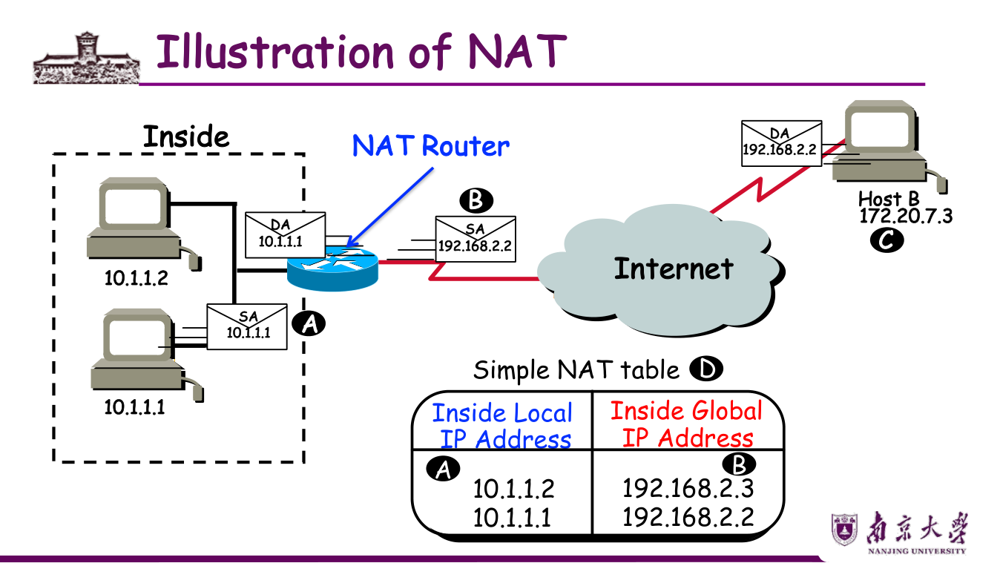

### 15.5 NAPT：地址和端口一起转换

NAPT 用端口号区分多个内部连接。

NAT 表项通常包含：

- 内部本地地址和端口。
- 内部全局地址和端口。
- 外部全局地址和端口。
- 协议类型。

例如：

```text
10.0.0.1:3345 <-> 138.76.29.7:5001
```

内部主机访问 Web 服务器时：

1. 内部主机发出分组，源为 `10.0.0.1:3345`，目的为 `128.119.40.186:80`。
2. NAT 路由器改写源为 `138.76.29.7:5001`，并记录映射。
3. 服务器回复目的为 `138.76.29.7:5001`。
4. NAT 根据表项改写目的为 `10.0.0.1:3345`，转发给内部主机。

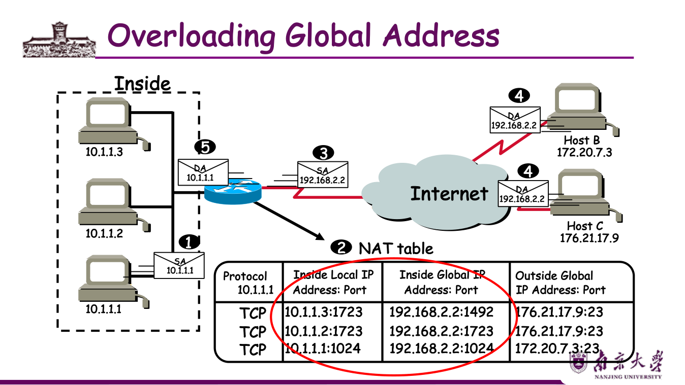

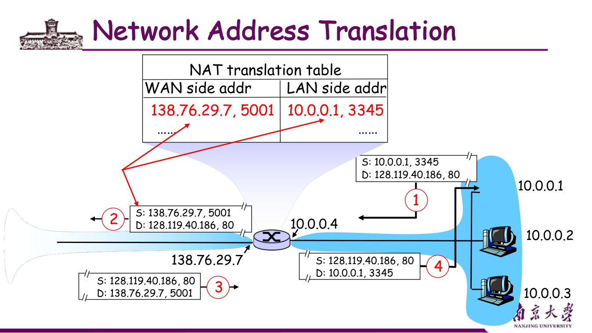

### 15.6 NAT 的争议

NAT 很实用，但也有争议。

争议点包括：

- 破坏端到端原则：中间设备修改传输层端口和 IP 地址。
- 对 P2P、VoIP、游戏等需要外部主动连接内部主机的应用不友好。
- 地址可能随时间变化，应用需要额外处理。
- 某些协议把地址写在应用层载荷中，NAT 只改首部会失效。
- 让网络层和运输层边界变得模糊。

许多应用通过 relay 或 NAT traversal 解决问题。

例如 Skype 中，NAT 后的主机先主动连接 relay，外部客户端也连接 relay，再由 relay 在两条连接之间转发数据。

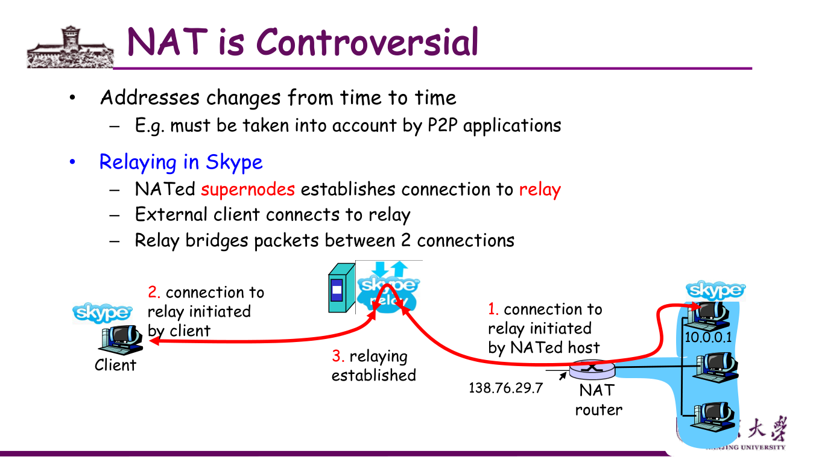

## 16. IPv6

### 16.1 IPv6 的动机

IPv6 最初的主要动机是地址空间耗尽。

IPv4 地址只有 32 bit，随着网络和 Internet 快速增长，地址分配压力越来越大。

IPv6 使用 128 bit 地址，大幅扩大地址空间。

IPv6 还有其他动机：

- 新首部格式加快处理和转发。
- 支持 QoS 相关字段。
- 路由器不再分片。
- 支持 anycast，把分组路由到多个副本服务器中的“较好”一个。

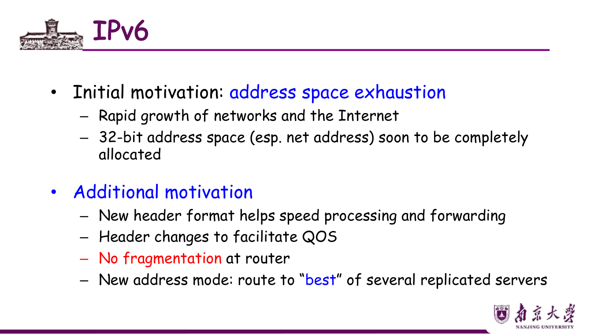

### 16.2 IPv6 首部与 IPv4 首部差别

IPv6 首部相比 IPv4 更固定、更简化。

重要变化：

- 地址从 32 bit 扩展到 128 bit。
- 基本首部固定长度，便于硬件处理。
- 删除 IPv4 header checksum。
- 选项通过扩展首部表示，不再挤在基本首部中。
- 路由器不负责分片，分片由源主机处理。

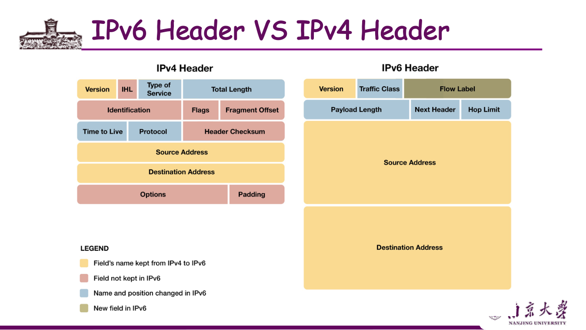

### 16.3 IPv6 首部字段

IPv6 基本首部关键字段：

| 字段 | 含义 |
| --- | --- |
| Version | 4 bit，值为 6 |
| Traffic Class | 8 bit，表示类别或优先级，可用于 QoS |
| Flow Label | 20 bit，标识同一 flow |
| Payload Length | 16 bit，载荷长度，包括扩展首部和上层数据 |
| Next Header | 8 bit，表示下一个首部类型 |
| Hop Limit | 类似 IPv4 TTL |
| Source Address | 128 bit 源地址 |
| Destination Address | 128 bit 目的地址 |

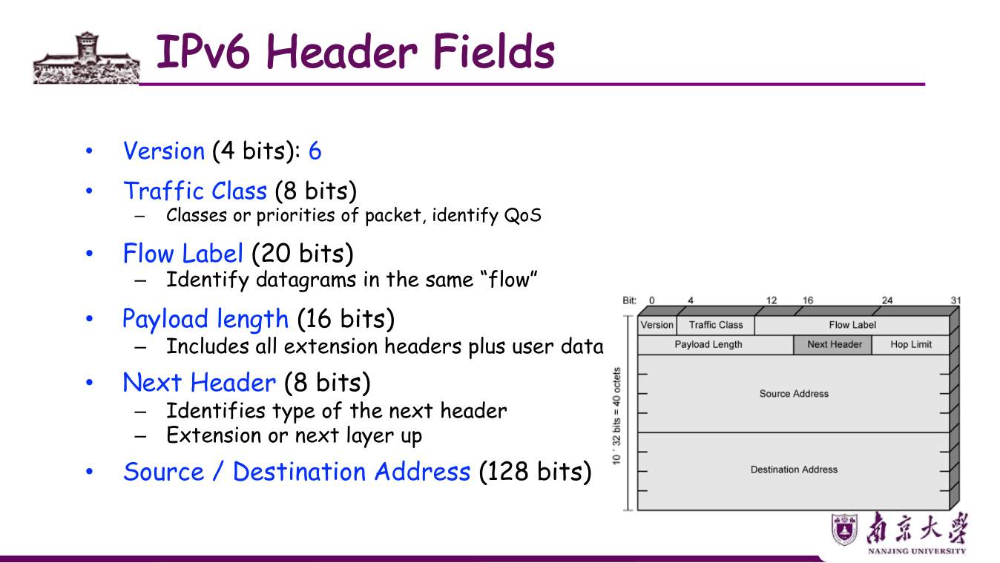

### 16.4 Traffic Class

Traffic Class 是 8 bit 字段，可由源节点或转发路由器使用，用于区分 IPv6 分组的类别或优先级。

例如，它可以作为 DiffServ codepoint 使用。

注意：

- 上层协议可以向网络层提供 traffic class 值。
- 源、转发节点或接收节点都可能改变该字段。
- 上层协议不应假定该值在传输过程中一定保持不变。

### 16.5 Flow 和 Flow Label

IPv6 flow 可以理解为从某个源到某个目的、具有相似处理需求的一组分组。

从主机角度：

- 可能由一个应用产生。
- 可能包含一个或多个 TCP 连接。
- 一个应用也可能产生多个 flow。

从路由器角度：

- 同一 flow 的分组共享影响处理方式的属性。
- 例如路由、资源分配、丢弃需求、计费、安全策略等。

Flow 由以下组合唯一标识：

```text
Source Address + Destination Address + non-zero Flow Label
```

路由器可以通过 Flow Label 查表处理，而不必反复检查更多首部字段。

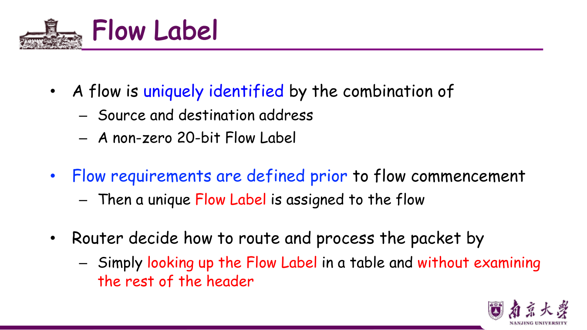

### 16.6 IPv6 相比 IPv4 的优势

IPv6 优势包括：

- 地址空间扩大到 128 bit。
- multicast 地址可扩展性更好。
- 支持 anycast。
- 支持地址自动配置。
- 选项机制更清晰，扩展首部位于 IPv6 首部和运输层首部之间。
- 大多数扩展首部无需中间路由器检查。
- 删除 checksum，降低每跳处理成本。
- Traffic Class 和 Flow Label 有助于资源分配和 QoS。
- 移动性机制更高效。
- IP 层安全机制支持更完整。

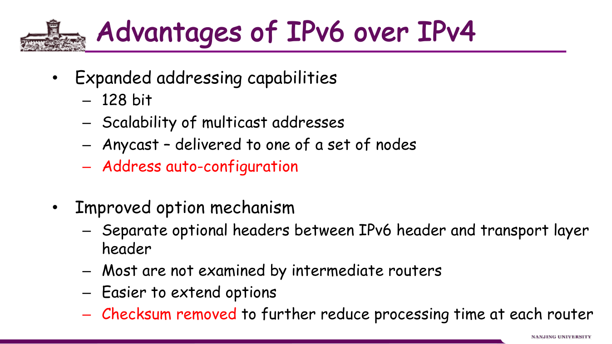

## 17. IPv4 到 IPv6 的过渡

### 17.1 过渡问题

Internet 不可能让所有路由器同时升级到 IPv6。

所以必须考虑混合网络：

- 一些节点只支持 IPv4。
- 一些节点只支持 IPv6。
- 一些节点同时支持 IPv4 和 IPv6。

常见过渡方法：

- Dual Stack。
- Tunneling。

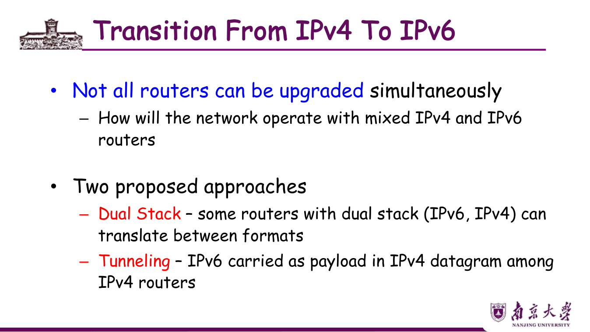

### 17.2 Dual Stack

Dual Stack 指部分路由器同时支持 IPv4 和 IPv6。

这些路由器可以在 IPv4 和 IPv6 之间转换或选择合适协议栈。

优点：

- 直观。
- 允许 IPv4 和 IPv6 共存。

缺点：

- 需要地址和首部格式转换。
- IPv6 的某些字段或功能在转换到 IPv4 时可能丢失。
- 每台双栈设备维护两套协议逻辑。

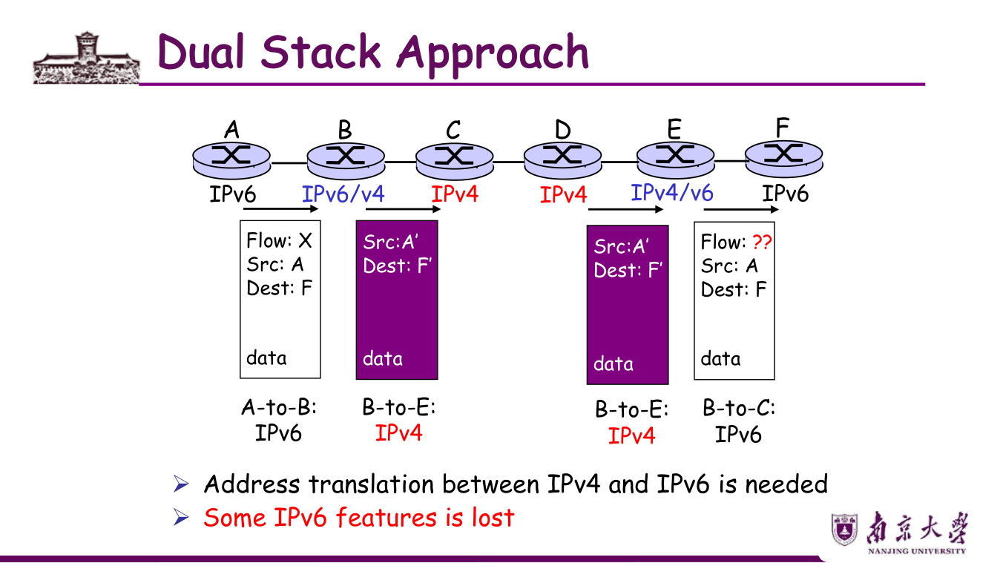

### 17.3 Tunneling

Tunneling 指把 IPv6 datagram 作为 IPv4 datagram 的载荷，在 IPv4 网络中传输。

逻辑上：

```text
IPv6 node -> IPv6 node
```

物理上，中间可能经过 IPv4 网络：

```text
IPv6 -> IPv6-inside-IPv4 -> IPv6
```

隧道入口：

- 把整个 IPv6 datagram 封装进 IPv4 datagram。

隧道出口：

- 去掉 IPv4 外壳，恢复原 IPv6 datagram。

优点：

- 不要求中间 IPv4 路由器理解 IPv6。

缺点：

- 增加封装开销。
- 排错和性能管理更复杂。

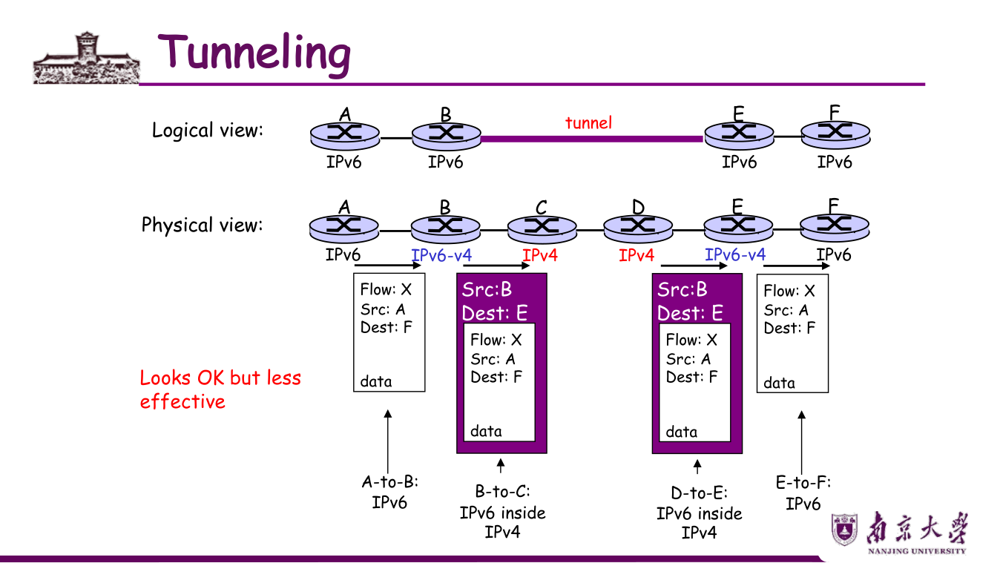

## 18. 通用转发与 SDN

### 18.1 从目的地址转发到 match plus action

传统目的地址转发：

- match：匹配目的 IP 地址的最长前缀。
- action：转发到某个输出端口。

Generalized forwarding 把这个模型扩展为：

```text
match + action
```

match 可以匹配许多首部字段：

- 链路层字段。
- 网络层字段。
- 运输层字段。

action 也不只是转发：

- drop。
- forward。
- modify。
- copy。
- log。
- send to controller。

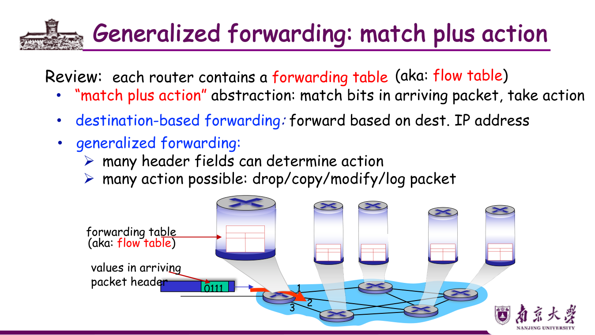

### 18.2 Flow table 抽象

在通用转发中，flow 由首部字段值定义。

Flow table 中的规则通常包含：

- match：匹配哪些字段模式。
- action：匹配后做什么。
- priority：多个规则都匹配时，用优先级消歧。
- counters：统计字节数和分组数。

例子：

| match | action |
| --- | --- |
| `src=10.1.2.3, dest=*.*.*.*` | send to controller |
| `src=1.2.*.*, dest=*.*.*.*` | drop |
| `src=*.*.*.*, dest=3.4.*.*` | forward(2) |

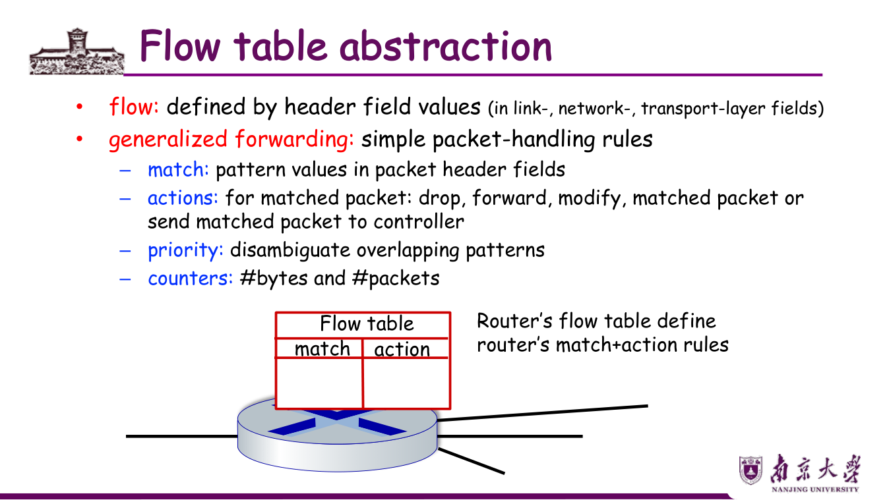

### 18.3 OpenFlow 表项

OpenFlow 是 SDN 中常见的 match+action 实现。

OpenFlow flow table entry 包含：

- Match。
- Action。
- Stats。

可匹配字段横跨多层：

- 入端口。
- 源/目的 MAC。
- Ethernet Type。
- VLAN ID 和 VLAN Priority。
- IP ToS。
- IP Protocol。
- 源/目的 IP。
- TCP/UDP 源/目的端口。

动作包括：

- 转发到一个或多个端口。
- 丢弃。
- 修改首部字段。
- 封装并发给控制器。

统计包括：

- packet counter。
- byte counter。

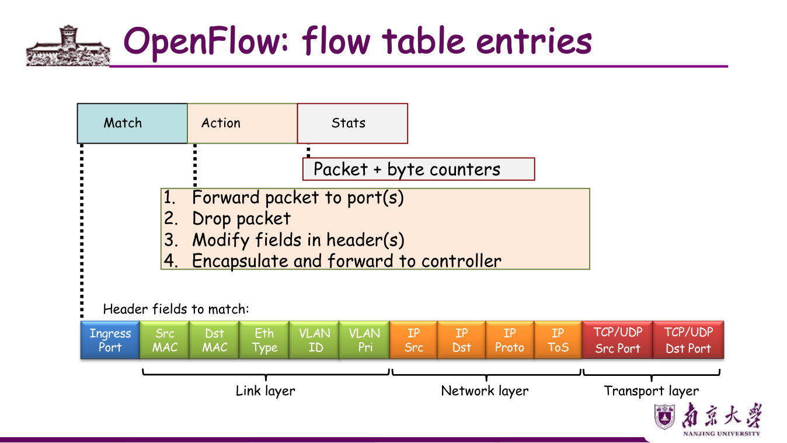

### 18.4 OpenFlow 抽象统一多种设备

match+action 抽象可以统一许多网络设备：

| 设备 | match | action |
| --- | --- | --- |
| Router | 最长目的 IP 前缀 | 从某条链路转发 |
| Switch | 目的 MAC 地址 | 转发或泛洪 |
| Firewall | IP 地址和 TCP/UDP 端口 | 允许或拒绝 |
| NAT | IP 地址和端口 | 改写地址和端口 |

这也是 SDN 的重要价值：用统一抽象表达不同设备的转发行为。

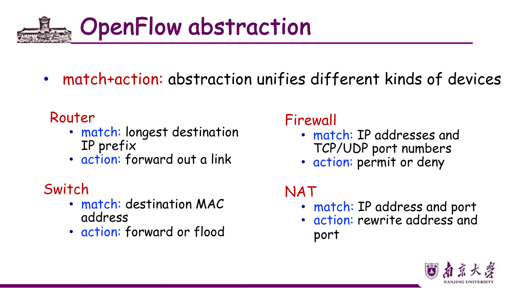

### 18.5 OpenFlow 例子

假设控制器希望实现全网策略：

- 来自主机 `h5` 和 `h6` 的 datagram。
- 目的地是 `h3` 或 `h4`。
- 应经过 `s1`，再到 `s2`。

控制器可以分别在 `s1`、`s2`、`s3` 安装流表规则。

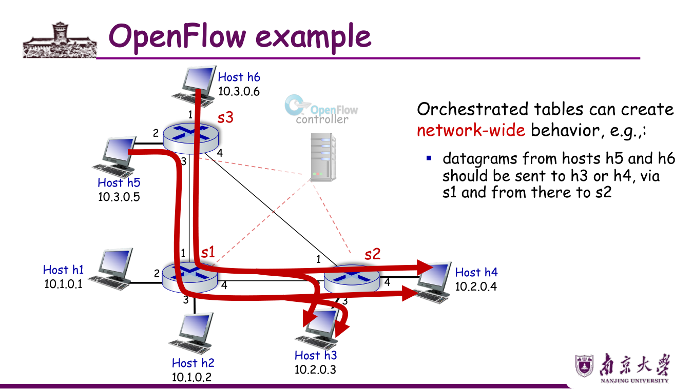

示例规则：

- 在 `s3`：匹配 `IP Src = 10.3.*.*` 且 `IP Dst = 10.2.*.*`，转发到端口 3。
- 在 `s1`：匹配来自端口 2 且目的为 `10.2.0.3` 或 `10.2.0.4` 的流量，分别转发到对应端口。
- 在 `s2`：匹配来自端口 1、源为 `10.3.*.*`、目的为 `10.2.*.*` 的流量，转发到端口 4。

局部规则组合起来形成全网行为。

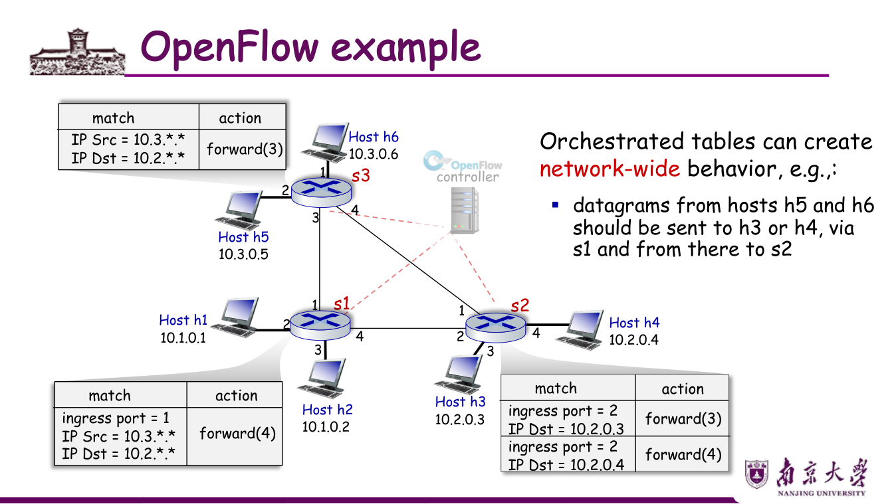

## 19. Middleboxes

### 19.1 什么是 middlebox

Middlebox 指位于源主机和目的主机之间、在数据路径上执行普通 IP 路由器标准功能之外操作的中间设备。

RFC 3234 对 middlebox 的定义强调：

- 它是中间设备。
- 它在数据路径上。
- 它执行的功能超出了普通 IP router 的标准转发。

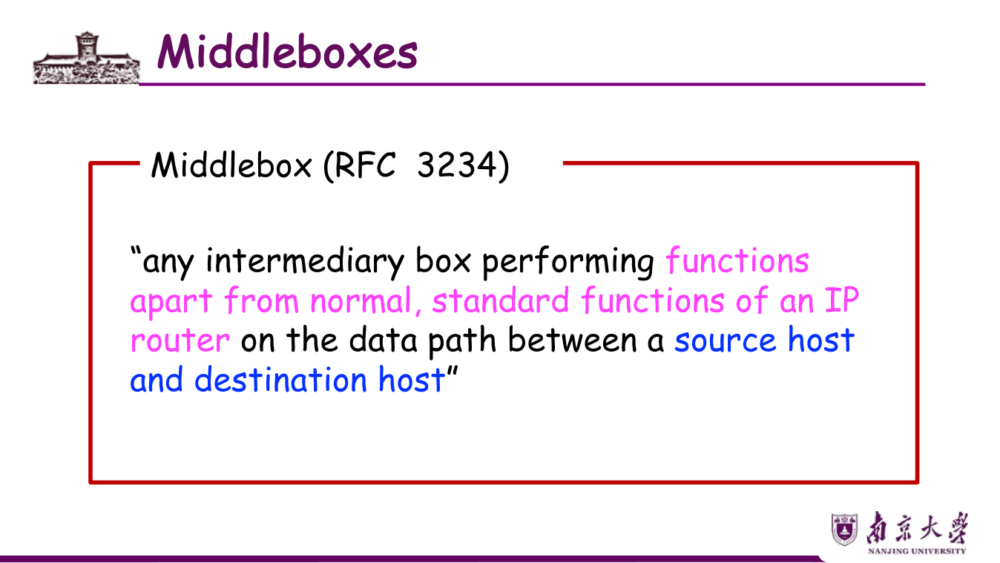

### 19.2 常见 middlebox

Middleboxes 在现代 Internet 中非常常见：

- NAT：家庭、蜂窝网络、机构网络。
- Firewall：企业、机构、运营商。
- IDS/IPS：入侵检测和防护。
- Load balancer：企业、数据中心、移动网络。
- Cache：运营商、移动网络、CDN。
- Application-specific middlebox：特定应用加速或过滤设备。

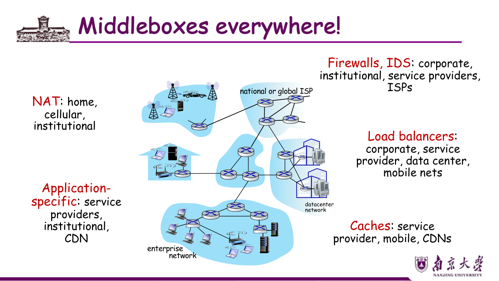

### 19.3 Middlebox 的演进

早期 middlebox 多是专用硬件和封闭系统。

趋势是：

- 从 proprietary hardware 转向 whitebox hardware。
- 通过开放 API 实现可编程本地动作。
- 用 match+action 表达设备行为。
- 差异化更多来自软件。
- SDN 提供集中控制和配置管理。
- NFV，Network Functions Virtualization，把网络功能运行在通用计算、存储和网络资源上。

### 19.4 IP 沙漏模型

Internet 的经典结构常被画成 hourglass：

- 上层有许多应用层和运输层协议，如 HTTP、SMTP、QUIC、DASH、RTP、TCP、UDP。
- 下层有许多链路层和物理层技术，如 Ethernet、WiFi、Bluetooth、PPP、copper、radio、fiber。
- 中间的“细腰”是 IP。

IP 的意义在于：

- 所有 Internet 设备都实现 IP。
- 上层应用不用关心底层链路技术。
- 底层链路技术也不用为每个应用单独适配。

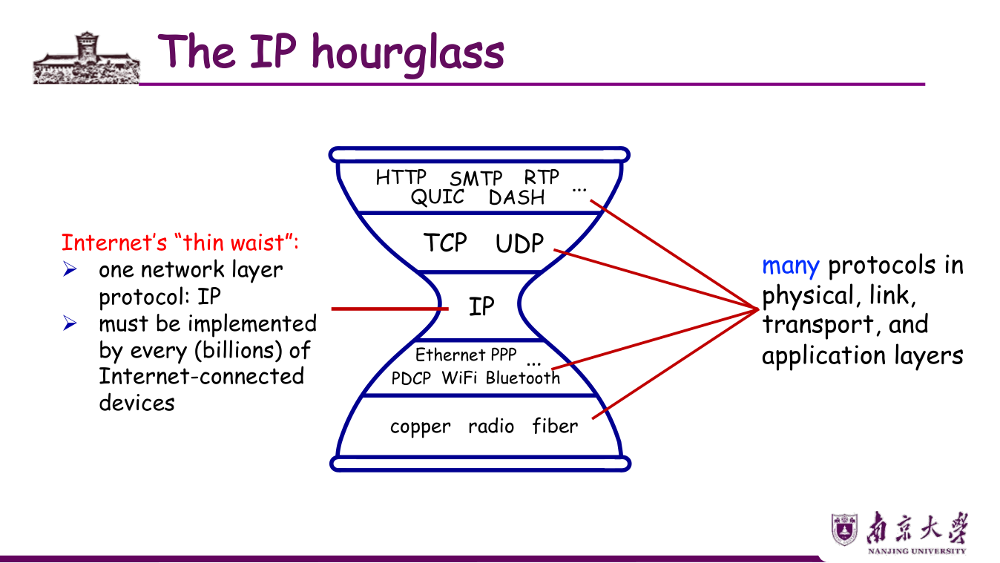

### 19.5 Middlebox 对沙漏模型的影响

Middleboxes 让 Internet 的细腰变厚了。

原因：

- NAT、firewall、cache、NFV 等设备在网络中执行额外逻辑。
- 它们可能检查运输层甚至应用层字段。
- 它们可能修改地址、端口或载荷。
- 端到端透明性减弱。

这带来实用价值，也带来复杂性。

实用价值：

- 安全。
- 地址复用。
- 性能优化。
- 负载均衡。
- 内容缓存。

复杂性：

- 应用协议更难部署。
- 新传输协议可能被中间设备阻拦。
- 排错困难。
- 端到端原则被削弱。

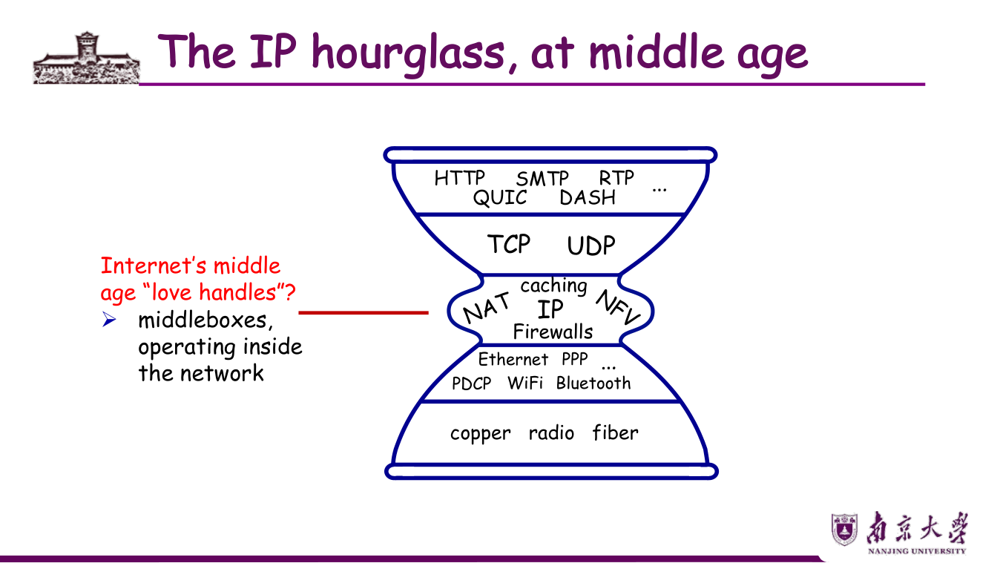

## 20. 本章小结

本章从数据平面角度理解网络层。

最重要的主线是：

- 网络层把运输层 segment 从发送主机送到接收主机。
- 转发是单路由器本地动作，路由是全网路径选择。
- 数据平面负责高速转发，控制平面负责计算和安装转发表。
- IP 服务模型是 best effort，简单但可扩展。
- 路由器由输入端口、交换结构、输出端口和控制处理器组成。
- 输入端口的关键是高速查表，核心规则是最长前缀匹配。
- 交换结构要把输入流量快速搬到输出端口。
- 输出端口要处理排队、缓冲、丢包、标记和调度。
- IPv4 首部承载转发、分片、TTL、协议分用等信息。
- IP 地址通过子网、CIDR 和路由聚合支持可扩展路由。
- DHCP 自动配置主机地址、网关、DNS 和掩码。
- NAT 通过地址和端口转换缓解地址不足，但破坏端到端透明性。
- IPv6 扩大地址空间并简化路由器处理。
- 通用转发和 OpenFlow 把传统“按目的地址转发”推广为 match+action。
- Middleboxes 已成为现代网络的重要组成部分，也让 Internet 的端到端模型更复杂。

