# 第 5 章 网络层：控制平面

> 本章核心问题：
>
> 1. 网络层控制平面负责什么？它和数据平面如何分工？
> 2. 每路由器控制平面和 SDN 控制平面有什么区别？
> 3. 路由协议如何把网络抽象成图，并计算“好路径”？
> 4. Link-State 和 Distance-Vector 路由算法分别如何工作？
> 5. Dijkstra 算法怎样生成最短路径树和转发表？
> 6. Bellman-Ford 方程如何支撑 Distance Vector 算法？
> 7. 为什么 Internet 要用自治系统 AS 实现可扩展路由？
> 8. OSPF 如何在 AS 内部工作？
> 9. BGP 如何在 AS 之间传播可达性、表达策略并选择路径？
> 10. SDN 控制平面为什么更可编程？OpenFlow 在其中扮演什么角色？
> 11. ICMP、Traceroute 和网络管理协议如何支持网络运行与诊断？


## 0. 本章内容结构

第 4 章关注网络层数据平面：一个分组到达路由器后，路由器怎样查表、排队、调度并把它送到输出端口。

第 5 章关注控制平面：这些转发表从哪里来，路径怎样被计算、传播、选择和管理。

本章主要内容包括：

- 网络层控制平面概览。
- 路由协议和图抽象。
- Link-State 路由与 Dijkstra 算法。
- Distance-Vector 路由与 Bellman-Ford 方程。
- 路由可扩展性、自治系统 AS 和 OSPF。
- AS 间路由协议 BGP。
- SDN 控制平面和 OpenFlow。
- ICMP 与 Traceroute。
- 网络管理：SNMP、MIB、NETCONF、YANG。

## 1. 控制平面概览

### 1.1 网络层的两个核心功能

网络层有两个核心功能：

- forwarding：把分组从路由器输入端口移动到正确输出端口。
- routing：决定分组从源到目的地应经过什么路径。

forwarding 属于数据平面，是本地、逐分组、高速执行的动作。

routing 属于控制平面，是全网范围的路径计算和状态维护。

控制平面最终要产出或安装转发表，使数据平面可以直接根据首部字段转发分组。

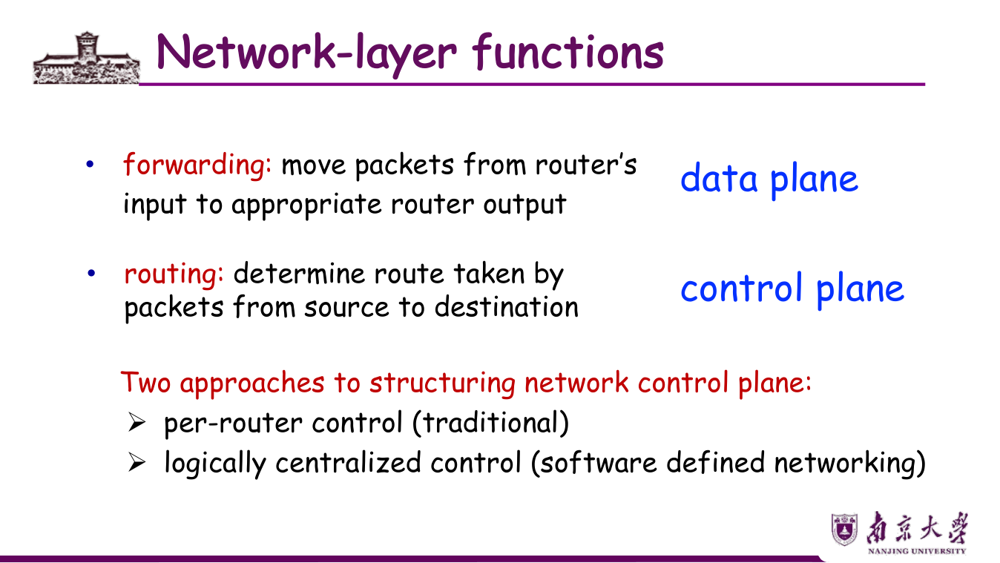

### 1.2 每路由器控制平面

传统 Internet 路由采用每路由器控制平面。

每台路由器都运行路由算法组件：

- 路由器之间交换路由信息。
- 每台路由器根据收到的信息计算自己的转发表。
- 数据平面使用本地转发表转发分组。

这种方式是分布式的。控制逻辑不在一个中央节点，而是在所有路由器中共同运行。

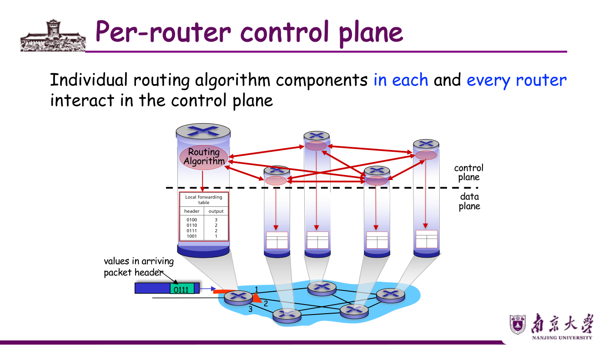

### 1.3 SDN 控制平面

SDN，Software-Defined Networking，采用逻辑集中式控制平面。

基本思想：

- 数据平面交换设备保持简单、快速。
- 远程控制器维护网络状态。
- 控制器计算转发表或流表。
- 控制器把规则安装到交换设备中。

“逻辑集中式”不等于物理上只有一台服务器。实际控制器通常是分布式系统，只是对上层应用呈现集中式网络视图。

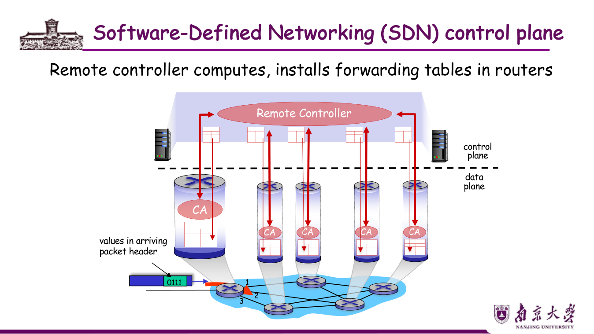

## 2. 路由协议基础

### 2.1 路由协议的目标

Routing protocol 的目标是确定从发送主机到接收主机的“好路径”。

路径 path 是一系列路由器：

```text
source host -> router1 -> router2 -> ... -> destination host
```

“好”可以有不同含义：

- cost 最小。
- 速度最快。
- 拥塞最少。
- 经过的 AS 符合策略。
- 满足运营商流量工程目标。

路由是网络中非常难的问题之一，因为它同时涉及算法、规模、策略、故障、性能和管理。

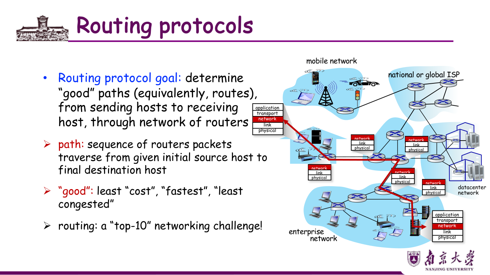

### 2.2 图抽象

路由算法通常把网络抽象成图：

```text
G = (N, E)
```

其中：

- `N` 是节点集合，通常表示路由器。
- `E` 是边集合，表示路由器之间的链路。
- `c(a,b)` 是节点 `a` 到节点 `b` 的直接链路代价。
- 如果 `a` 和 `b` 不直接相连，则 `c(a,b) = ∞`。

链路代价由网络运营者定义，可以是：

- 固定为 1，表示按跳数最少。
- 与带宽成反比，带宽越大代价越小。
- 与拥塞程度相关，越拥塞代价越大。
- 人工配置，用于控制流量走向。

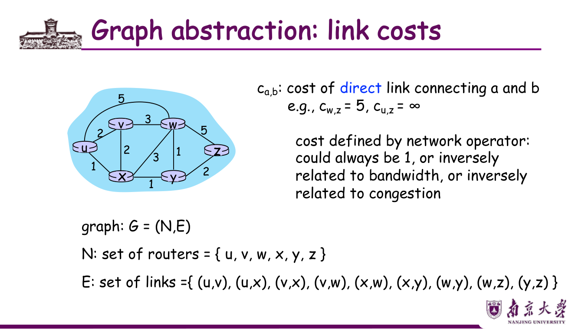

### 2.3 路由算法分类

路由算法可以按信息范围分类。

#### Global routing algorithm

全局算法中，所有路由器都知道完整网络拓扑和链路代价。

典型代表：

- Link-State algorithm。
- Dijkstra 算法。

每个路由器拿到相同的全局图，然后以自己为源节点计算最短路径树。

#### Decentralized routing algorithm

分布式算法中，路由器开始时只知道到相邻节点的链路代价。

它通过迭代和邻居交换信息，逐步计算路径。

典型代表：

- Distance-Vector algorithm。
- Bellman-Ford 方程。

路由算法也可以按变化速度分类：

- Static routing：路由变化很慢，通常人工配置或低频更新。
- Dynamic routing：路由随链路代价、故障、拥塞等变化更快，可以周期更新或事件触发更新。

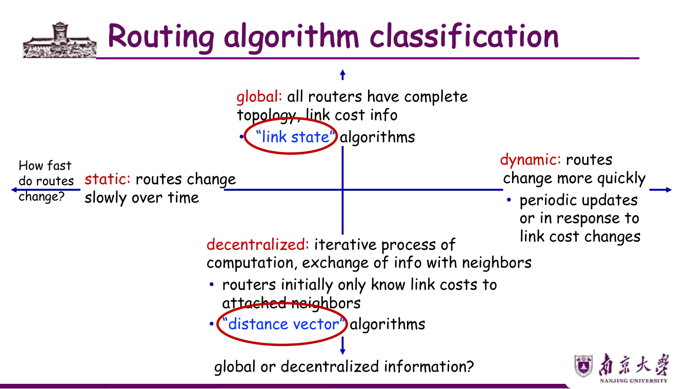

## 3. Link-State 路由与 Dijkstra 算法

### 3.1 Link-State 的基本思想

Link-State 路由要求每个路由器知道完整网络拓扑和链路代价。

实现方式：

- 每个路由器发现自己和邻居之间的链路状态。
- 通过 link-state broadcast 或 flooding 把这些信息传播给所有路由器。
- 每个路由器都构造出相同的网络图。
- 每个路由器以自己为源点运行 Dijkstra 算法。
- 得到从自己到所有目的地的最短路径树和转发表。

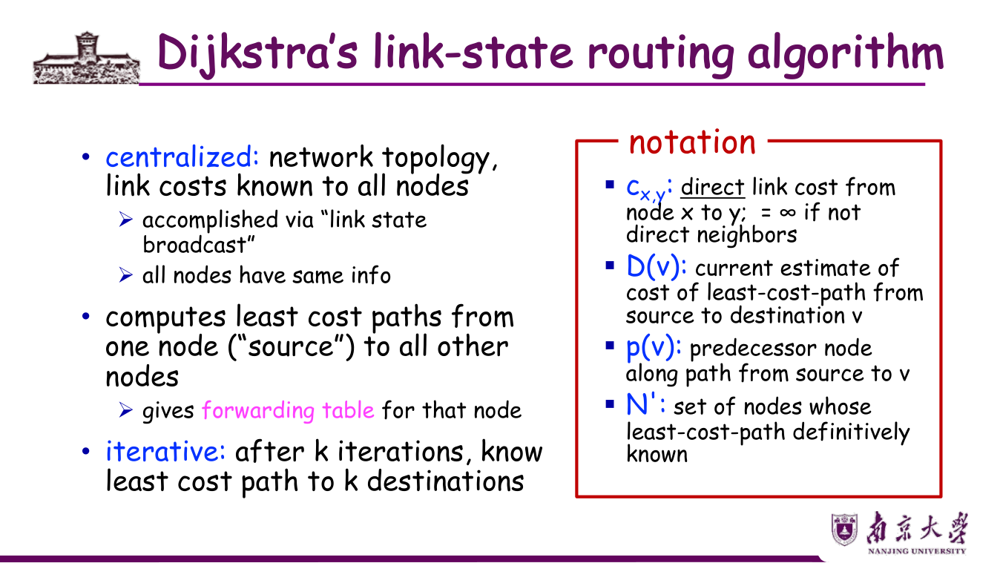

### 3.2 Dijkstra 算法中的符号

以源节点 `u` 计算到所有节点的最短路径。

常用符号：

- `c(x,y)`：从节点 `x` 到节点 `y` 的直接链路代价；如果不相邻则为 `∞`。
- `D(v)`：当前已知的从源节点到目的节点 `v` 的最短路径代价估计。
- `p(v)`：当前最短路径中，`v` 的前驱节点。
- `N'`：已经确定最短路径的节点集合。

Dijkstra 是迭代算法。

第 `k` 次迭代后，算法已经确定到 `k` 个目的节点的最短路径。

### 3.3 Dijkstra 算法步骤

初始化：

```text
N' = {u}
for all nodes v:
    if v adjacent to u:
        D(v) = c(u,v)
    else:
        D(v) = ∞
```

循环：

```text
find w not in N' such that D(w) is minimum
add w to N'
for each neighbor v of w, if v not in N':
    D(v) = min(D(v), D(w) + c(w,v))
```

直到所有节点都加入 `N'`。

算法直觉：

- 每次选当前代价最小的未确定节点。
- 因为所有链路代价非负，这个节点的最短路径已经不可能再被改小。
- 然后用它继续“松弛”邻居节点的路径代价。

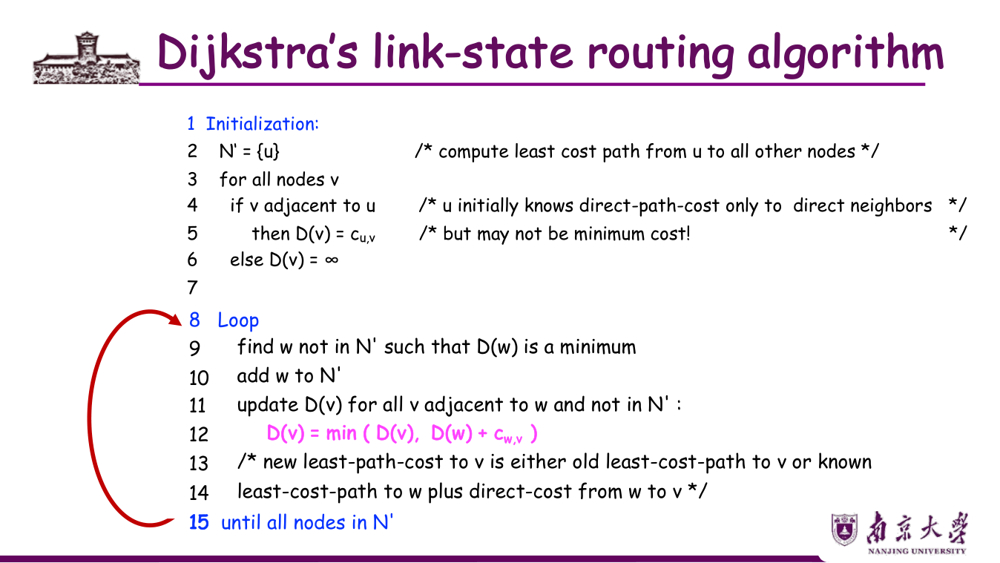

### 3.4 Dijkstra 例子：初始化

以节点 `u` 为源节点。

初始化时：

- `N' = {u}`。
- 如果节点与 `u` 直接相邻，就把 `D` 设为直接链路代价。
- 如果不相邻，就设为 `∞`。

例子中：

| 目的节点 | 初始 `D` | 前驱 |
| --- | --- | --- |
| `v` | 2 | `u` |
| `x` | 1 | `u` |
| `w` | 5 | `u` |
| `y` | ∞ | - |
| `z` | ∞ | - |

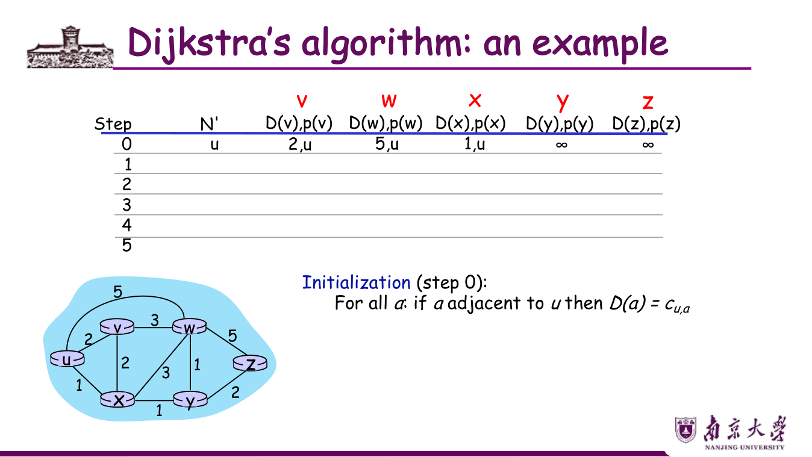

### 3.5 Dijkstra 例子：迭代更新

第一步选择未确定节点中 `D` 最小的节点。

这里 `x` 的代价为 1，于是加入 `N'`：

```text
N' = {u, x}
```

然后用经过 `x` 的路径更新其他节点：

```text
D(v) = min(D(v), D(x) + c(x,v)) = min(2, 1+2) = 2
D(w) = min(D(w), D(x) + c(x,w)) = min(5, 1+3) = 4
D(y) = min(D(y), D(x) + c(x,y)) = min(∞, 1+1) = 2
```

继续迭代时，会依次加入当前代价最小的节点，并更新其邻居。

最终得到：

- 到 `v` 的路径直接走 `u-v`。
- 到其他多个节点的路径先走 `u-x`。

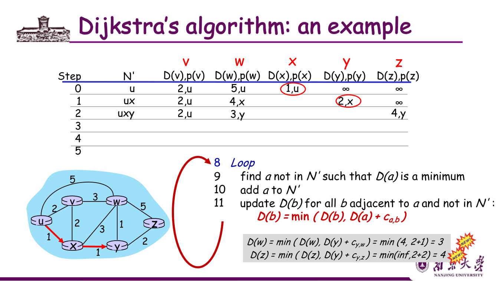

### 3.6 从最短路径树到转发表

Dijkstra 结果可以表示为从源节点出发的 least-cost-path tree。

但路由器真正需要的是转发表：

```text
目的地 -> 输出链路或下一跳
```

以 `u` 为源节点的例子中：

| 目的地 | 从 `u` 出发的输出链路 |
| --- | --- |
| `v` | `(u,v)` |
| `x` | `(u,x)` |
| `y` | `(u,x)` |
| `w` | `(u,x)` |
| `z` | `(u,x)` |

原因是从 `u` 到 `y/w/z` 的最短路径第一跳都经过 `x`。

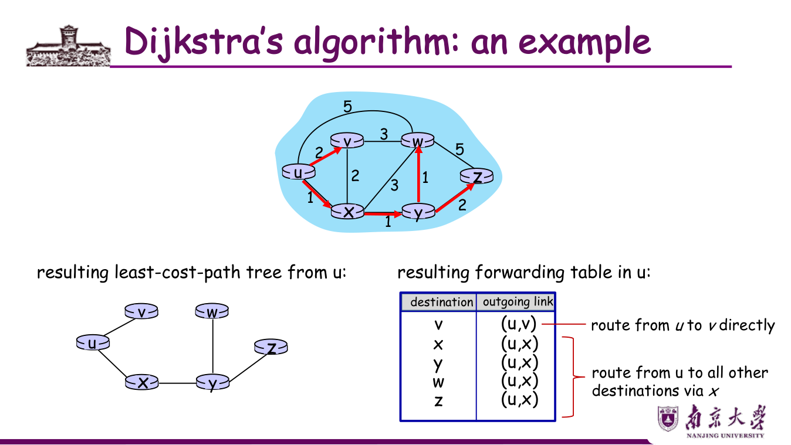

### 3.7 Dijkstra 的另一个例子

在另一个拓扑中，算法同样维护：

- `N'`：已确定节点集合。
- `D(v), p(v)`：到每个节点的当前最短估计和前驱。

如果出现相同代价的节点，tie 可以任意打破。

构造最短路径树时，从目的节点沿 `p(v)` 不断回溯，直到源节点。

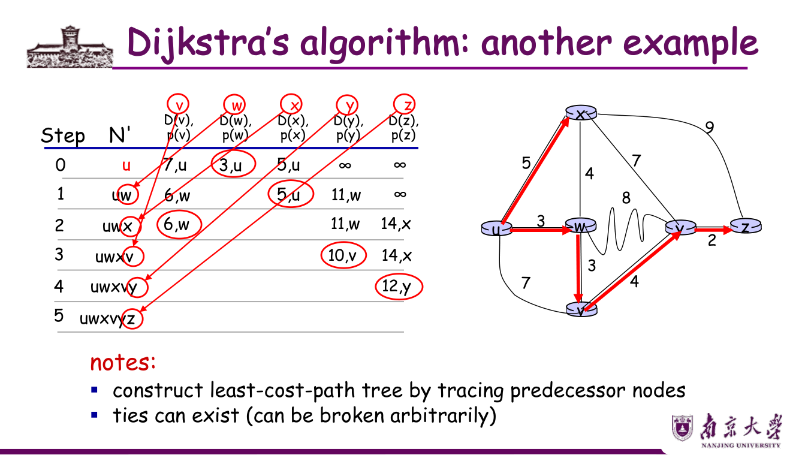

### 3.8 Dijkstra 的复杂度

朴素实现中，若有 `n` 个节点：

- 每轮需要检查不在 `N'` 中的所有节点，找最小 `D`。
- 总比较次数约为：

```text
n(n+1)/2
```

复杂度为：

```text
O(n^2)
```

用更高效的数据结构可以做到：

```text
O(n log n)
```

消息复杂度方面：

- 每个路由器必须把自己的 link-state 信息广播给其他路由器。
- 一条广播消息从一个源扩散到全网需要跨越 `O(n)` 条链路。
- 每个路由器都广播一次时，总体复杂度约为 `O(n^2)`。

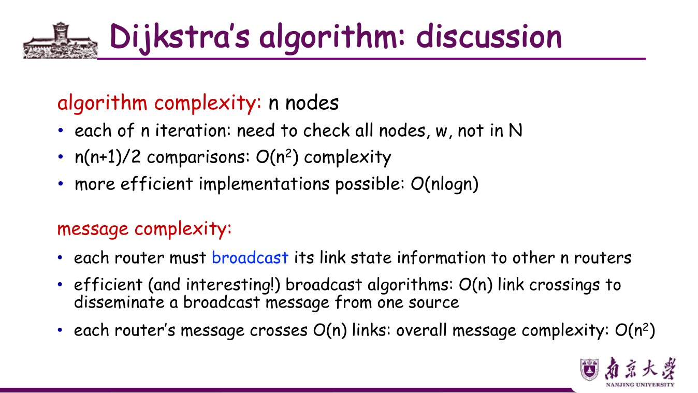

### 3.9 Dijkstra 的振荡问题

如果链路代价依赖当前流量负载，Link-State 路由可能振荡。

原因：

- 某轮计算发现某条路径代价低，于是大量流量迁移过去。
- 迁移后该路径变拥塞，代价升高。
- 下一轮计算又把流量迁移到另一条路径。
- 反复调整，系统可能来回摆动。

这说明：

- 链路代价设计很重要。
- 动态代价可以响应拥塞，但也可能引入不稳定。
- 路由算法和流量工程之间存在复杂反馈。

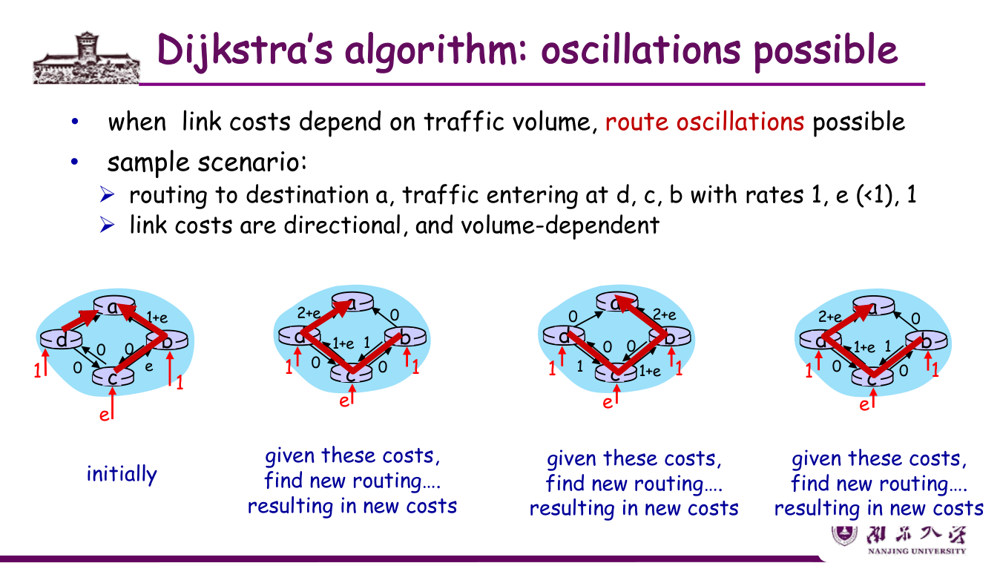

## 4. Distance-Vector 路由

### 4.1 Bellman-Ford 方程

Distance-Vector 算法基于 Bellman-Ford 方程。

设：

```text
D_x(y) = 从 x 到 y 的最小路径代价
```

则：

```text
D_x(y) = min_v { c(x,v) + D_v(y) }
```

其中 `v` 是 `x` 的所有邻居。

含义：

- 从 `x` 到 `y` 的路径，第一跳一定是某个邻居 `v`。
- 选择邻居 `v` 后，总代价等于 `x` 到 `v` 的直接代价，加上 `v` 到 `y` 的最短代价。
- 在所有邻居中取最小值。

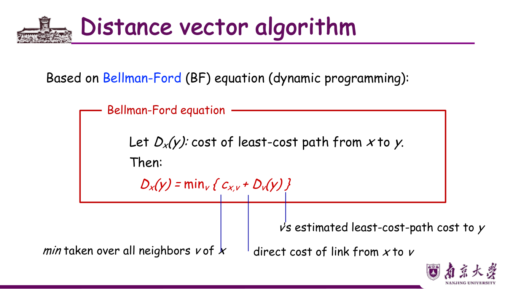

### 4.2 Bellman-Ford 例子

假设节点 `u` 的邻居是 `v`、`x`、`w`，目标是到 `z`。

邻居已经告诉 `u`：

```text
D_v(z) = 5
D_x(z) = 3
D_w(z) = 3
```

已知直接链路代价：

```text
c(u,v) = 2
c(u,x) = 1
c(u,w) = 5
```

则：

```text
D_u(z) = min { 2+5, 1+3, 5+3 }
       = min { 7, 4, 8 }
       = 4
```

因此从 `u` 到 `z` 的下一跳应选 `x`。

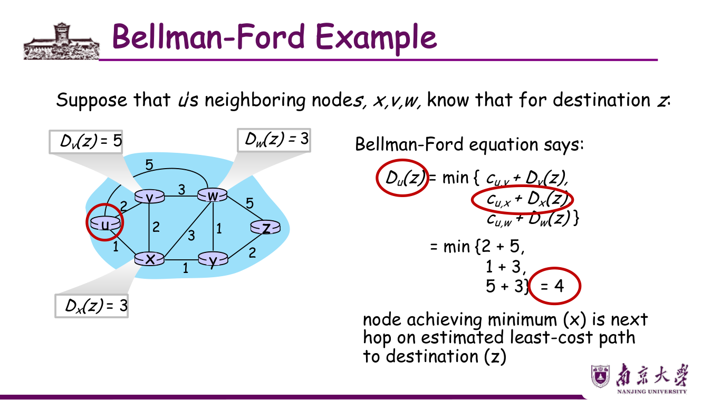

### 4.3 Distance Vector 的基本思想

每个节点维护一个 distance vector：

```text
到每个目的地的当前代价估计
```

基本过程：

- 每个节点偶尔把自己的 distance vector 发送给邻居。
- 节点收到邻居的 distance vector 后，使用 Bellman-Ford 方程更新自己的估计。
- 如果自己的 distance vector 发生变化，再通知邻居。
- 在一定条件下，估计会收敛到真实最短路径代价。

更新公式：

```text
D_x(y) <- min_v { c(x,v) + D_v(y) }
```

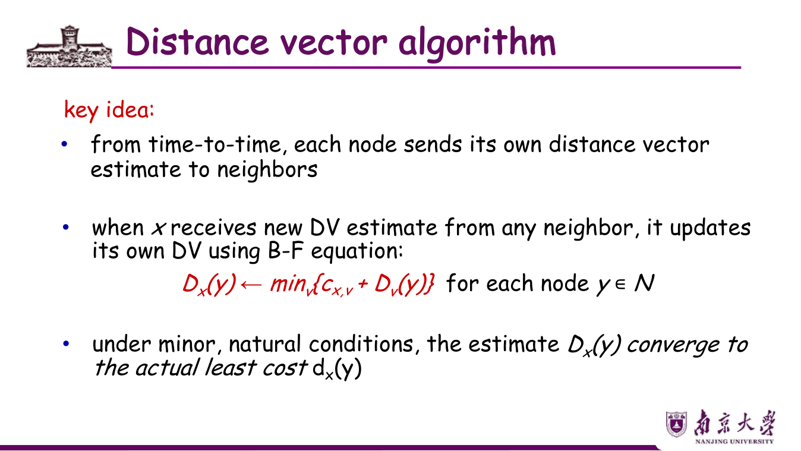

### 4.4 Distance Vector 的算法特征

Distance Vector 是：

- iterative：反复迭代更新。
- asynchronous：不同节点不需要同步轮次。
- distributed：每个节点只和邻居交换信息。
- self-stopping：如果没有更新消息，节点就不动作；如果估计不变，也不继续通知。

本地迭代由两类事件触发：

- 本地链路代价变化。
- 收到邻居发来的 distance vector 更新。

节点动作：

1. 等待本地链路变化或邻居消息。
2. 用收到的信息重新计算 distance vector。
3. 如果到任一目的地的代价改变，就通知邻居。

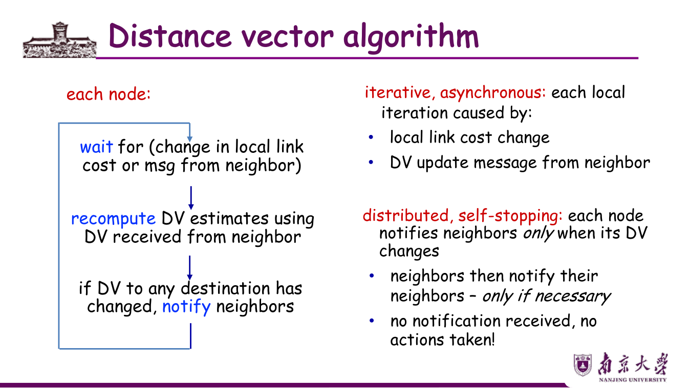

### 4.5 Distance Vector 例子

在初始时刻，每个节点只知道自己到直接邻居的距离。

例如节点 `a` 的初始 distance vector：

```text
D_a(a) = 0
D_a(b) = 8
D_a(d) = 1
D_a(c/e/f/g/h/i) = ∞
```

随后所有节点把自己的本地 distance vector 发给邻居。

邻居收到后，开始用 Bellman-Ford 方程计算可能经过邻居的路径。

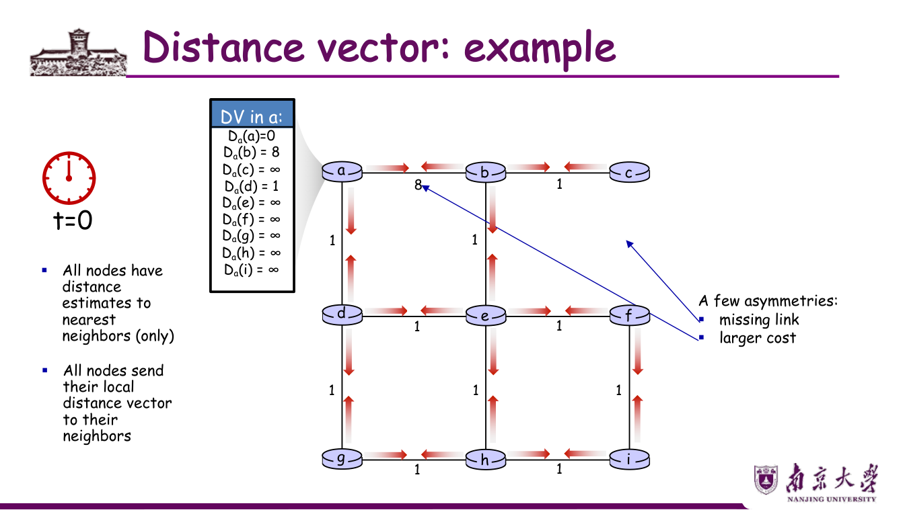

### 4.6 Distance Vector 计算示例

以节点 `b` 为例。

`b` 收到来自 `a`、`c`、`e` 的 distance vector 后，计算到各目的地的新代价。

例如到 `d`：

```text
D_b(d) = min {
    c(b,a) + D_a(d),
    c(b,c) + D_c(d),
    c(b,e) + D_e(d)
}
```

如果：

```text
c(b,a)=8, D_a(d)=1
c(b,c)=1, D_c(d)=∞
c(b,e)=1, D_e(d)=1
```

则：

```text
D_b(d)=min{9, ∞, 2}=2
```

下一跳应选 `e`。

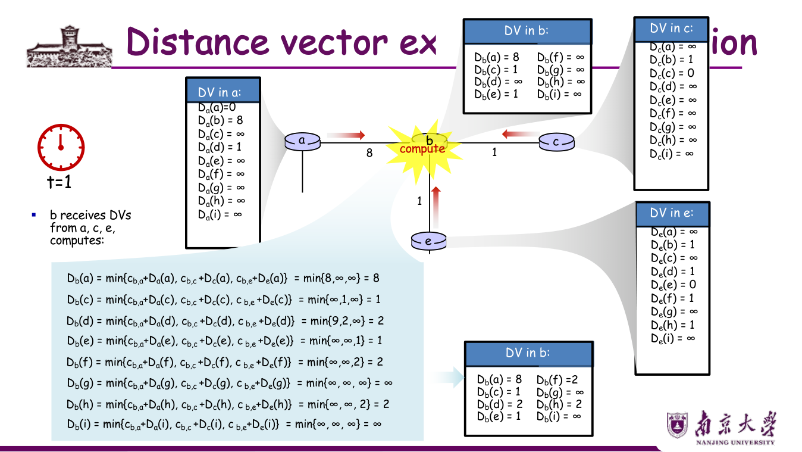

### 4.7 状态信息如何扩散

Distance Vector 的信息传播是逐跳扩散的。

如果 `c` 在 `t=0` 的状态只在 `c` 本地：

- `t=1`：它影响到 `c` 的邻居。
- `t=2`：可能影响到两跳外节点。
- `t=3`：可能影响到三跳外节点。
- 依此类推。

这种扩散方式简单，但意味着收敛速度取决于拓扑、触发时机和更新传播路径。

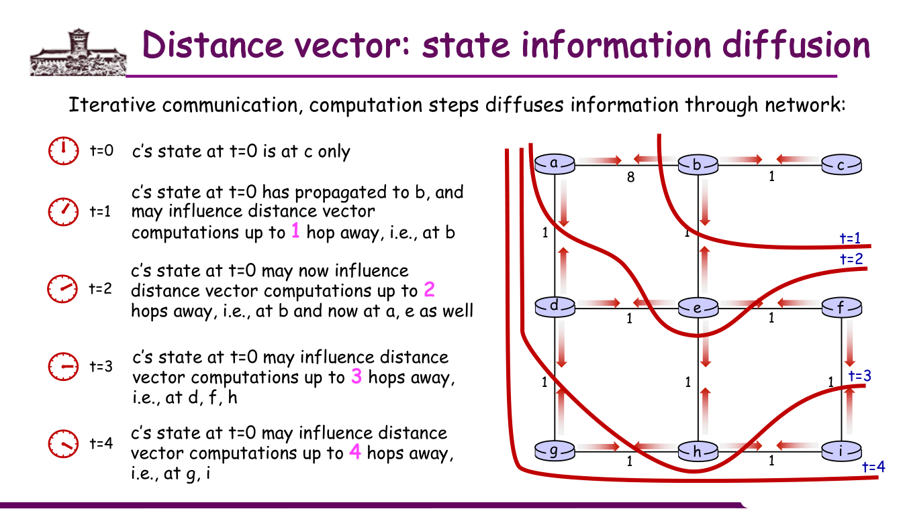

### 4.8 好消息传播快

当链路代价降低时，Distance Vector 通常收敛较快。

例如：

- `y` 检测到到 `x` 的链路代价变小。
- `y` 更新自己的 DV 并通知邻居。
- `z` 收到后发现经 `y` 到 `x` 更便宜，也更新并通知。
- 如果 `y` 再收到 `z` 的更新后自己的代价不变，就不会继续发送。

这种情况叫：

```text
good news travels fast
```

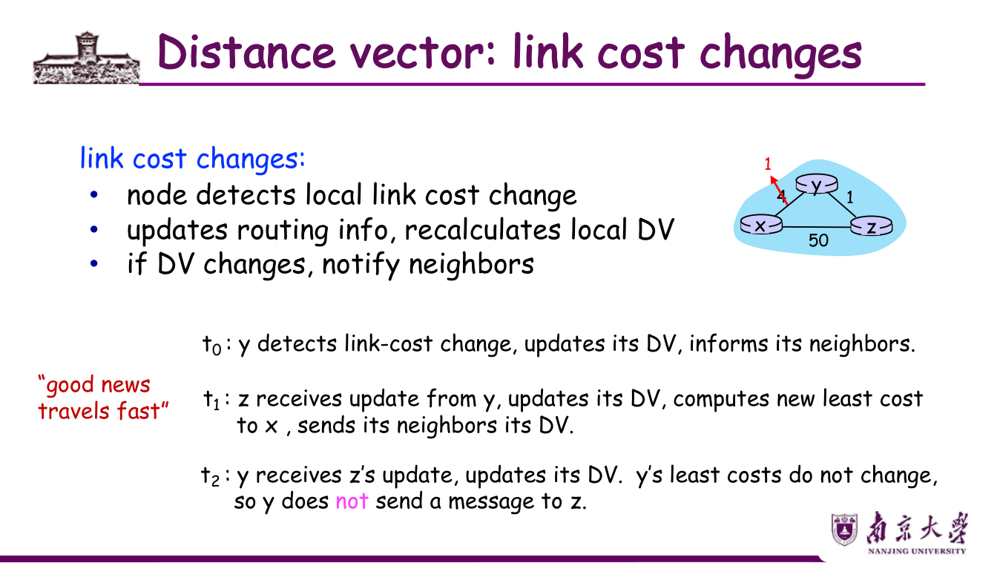

### 4.9 坏消息传播慢与 count-to-infinity

当链路代价升高或路径失效时，Distance Vector 可能出现 count-to-infinity。

例子：

- 原来 `y` 到 `x` 的直连代价为 4。
- 后来直连代价变成 60。
- 但 `z` 曾告诉 `y`：它到 `x` 的代价是 5。
- `y` 误以为可以经 `z` 到 `x`，于是计算新代价为 6。
- `z` 又以为可经 `y` 到 `x`，于是计算为 7。
- 两者不断互相误导，代价 6、7、8、9 地慢慢增加。

这就是：

```text
bad news travels slow
```

本质原因是节点只知道邻居声称的距离，不知道邻居路径背后的完整拓扑。

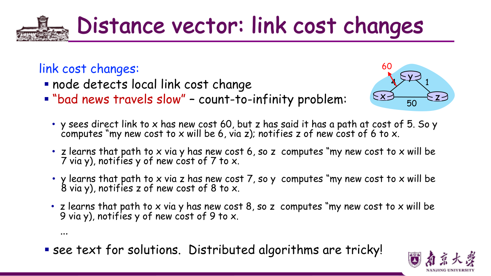

### 4.10 LS 与 DV 对比

| 维度 | Link-State | Distance-Vector |
| --- | --- | --- |
| 信息范围 | 每个节点拥有全局拓扑和链路代价 | 每个节点只与邻居交换距离估计 |
| 典型算法 | Dijkstra | Bellman-Ford |
| 消息复杂度 | 需要广播链路状态，约 `O(n^2)` | 邻居间交换，复杂度依收敛而定 |
| 收敛速度 | 算法复杂度约 `O(n^2)`，但可能振荡 | 收敛时间不定，可能有环路 |
| 常见问题 | 链路代价随流量变动时可能振荡 | count-to-infinity |
| 鲁棒性 | 错误链路代价主要影响本节点计算 | 错误距离向量会被其他节点使用并传播 |

LS 中，坏路由器可以广告错误链路代价，但每台路由器仍自己计算转发表。

DV 中，如果一个路由器声称“我到所有地方都很近”，其他路由器可能被吸引过来，造成黑洞。

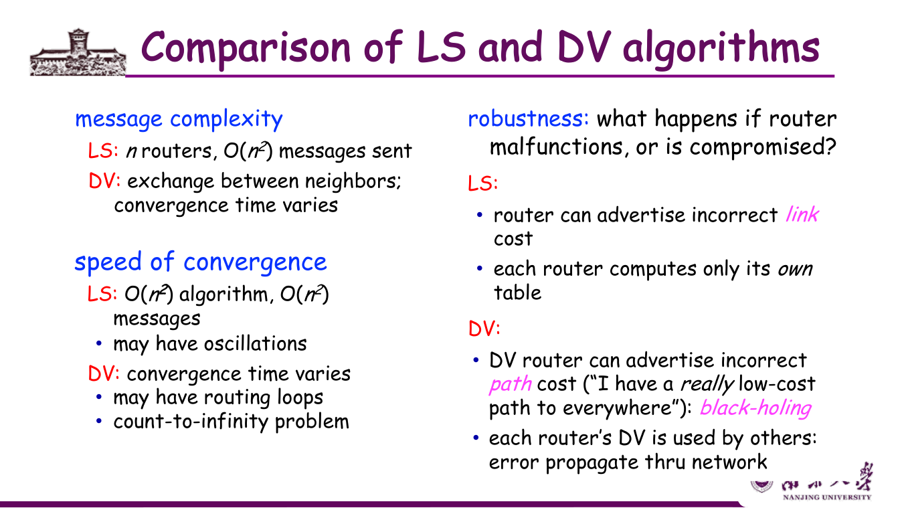

## 5. 路由可扩展性与自治系统

### 5.1 为什么扁平路由不可扩展

前面的路由算法是理想化的：

- 所有路由器身份相同。
- 整个网络是 flat 的。
- 所有路由器都参与同一个路由系统。

现实 Internet 不满足这些假设。

规模问题：

- Internet 有数十亿目的地。
- 不可能在每台路由器中存储所有目的地址。
- 路由表交换会压垮链路。

管理问题：

- Internet 是 network of networks。
- 不同网络由不同组织管理。
- 每个组织可能希望控制自己网络内部路由和对外策略。

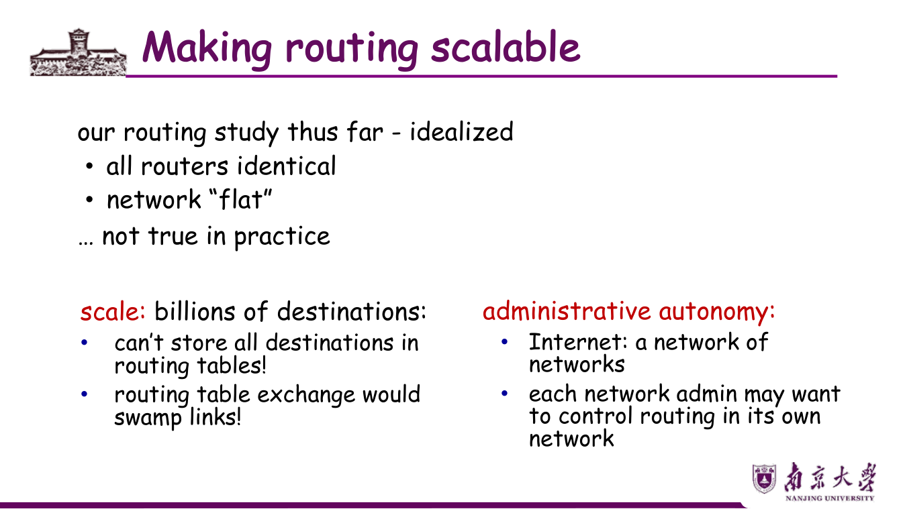

### 5.2 自治系统 AS

Internet 的可扩展路由方法是把路由器聚合成区域，称为：

```text
Autonomous System, AS
```

AS 也叫 domain。

AS 内部路由：

- intra-AS routing。
- intra-domain routing。
- 在同一个 AS 内的路由器之间选择路径。
- 同一 AS 内通常运行相同的内部路由协议。

AS 之间路由：

- inter-AS routing。
- inter-domain routing。
- 在不同 AS 之间传播可达性并选择跨域路径。

Gateway router：

- 位于 AS 边缘。
- 连接本 AS 和其他 AS。
- 同时参与 intra-AS 和 inter-AS 路由。

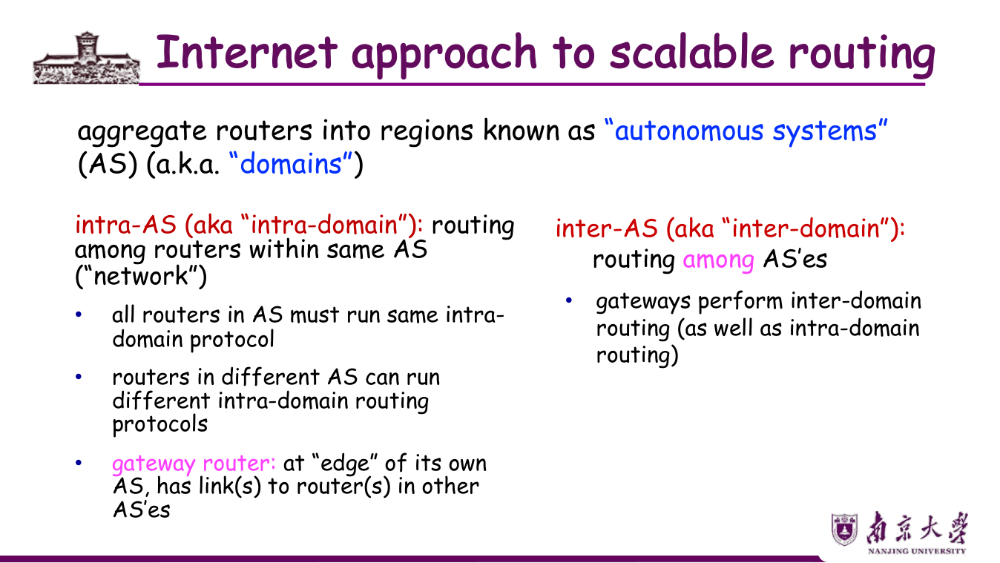

### 5.3 AS 互联与转发表

AS 内部路由和 AS 间路由共同决定转发表。

对于 AS 内目的地：

- 由 intra-AS routing 决定转发表项。

对于 AS 外目的地：

- inter-AS routing 学到外部目的地可经哪个网关到达。
- intra-AS routing 决定本 AS 内部如何到达该网关。
- 两者共同配置到外部目的地的转发表项。

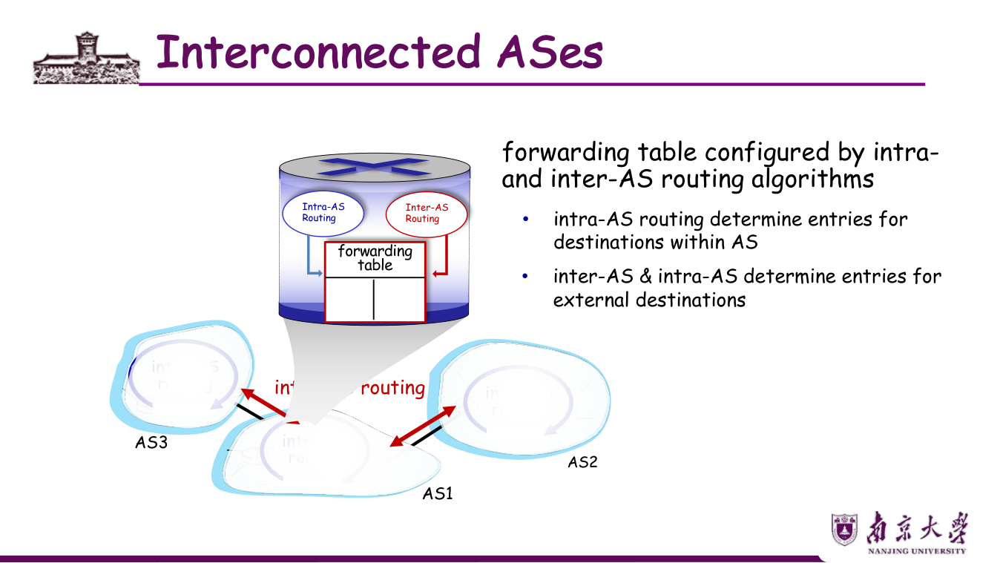

### 5.4 Inter-AS 路由如何影响 AS 内转发

假设 AS1 内某路由器收到一个目的地在 AS1 外部的 datagram。

AS1 的 inter-domain routing 必须：

1. 学到哪些外部目的地可通过 AS2 到达，哪些可通过 AS3 到达。
2. 把这些可达性信息传播给 AS1 内部路由器。

之后 AS1 内部路由器还要决定：

```text
去哪个本 AS 网关？
```

这个问题由 inter-AS 可达性和 intra-AS 到网关的路径共同决定。

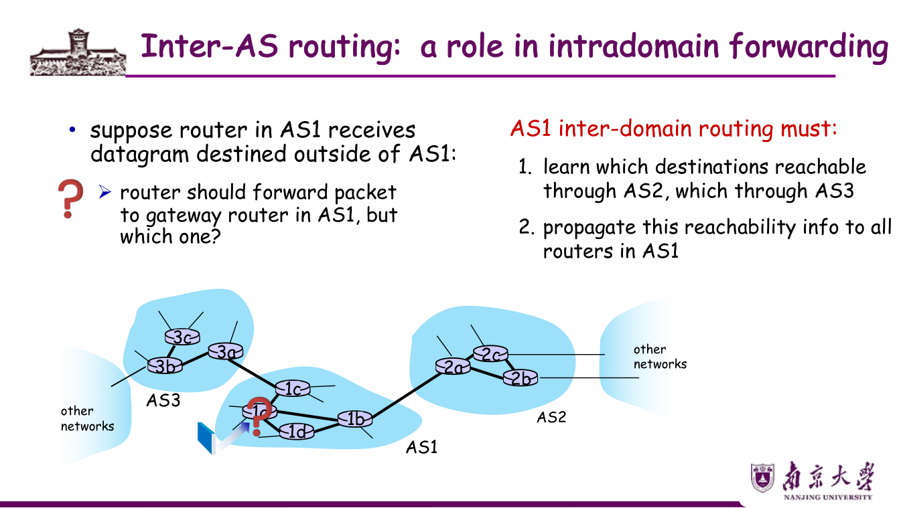

## 6. Intra-AS 路由与 OSPF

### 6.1 常见 Intra-AS 路由协议

常见 AS 内路由协议：

- RIP：Routing Information Protocol，经典 DV 协议，每 30 秒交换 distance vector，今天已不常用。
- EIGRP：Enhanced Interior Gateway Routing Protocol，基于 DV，曾长期是 Cisco 私有协议，后来开放。
- OSPF：Open Shortest Path First，基于 link-state。
- IS-IS：ISO 标准协议，思想上与 OSPF 很相似。

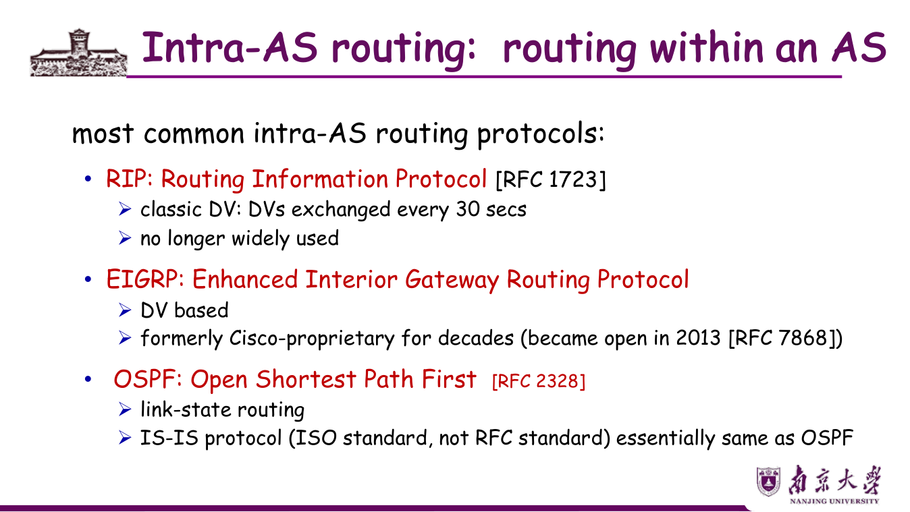

### 6.2 OSPF 基本特点

OSPF 的 Open 表示协议公开可用。

OSPF 是典型 link-state 路由协议：

- 每台路由器向整个 AS flooding 自己的 link-state advertisements。
- OSPF 直接运行在 IP 之上，不使用 TCP 或 UDP。
- 可使用多种链路代价指标，如 bandwidth、delay。
- 每台路由器获得完整拓扑。
- 每台路由器运行 Dijkstra 算法计算转发表。

安全方面：

- OSPF 消息可以认证。
- 目的是防止恶意或错误路由信息注入。

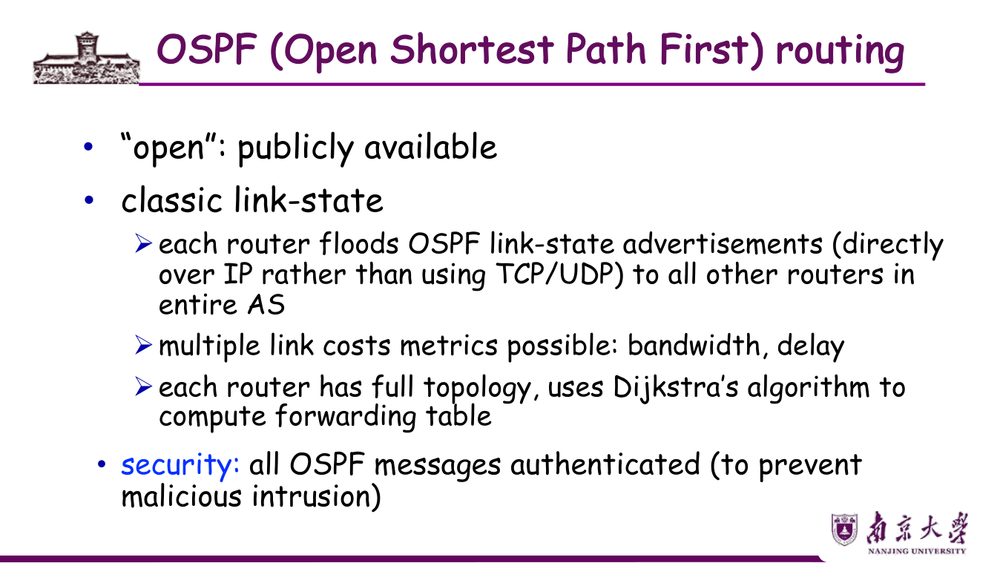

### 6.3 层次化 OSPF

大型 AS 内部如果所有链路状态都在全 AS flooding，开销仍然很大。

Hierarchical OSPF 使用两级层次：

- local area。
- backbone。

特点：

- 链路状态广告只在本 area 或 backbone 内 flooding。
- 每个节点知道本 area 的详细拓扑。
- 对其他 area，只知道到达方向，而不掌握完整细节。

角色：

- Local router：只在本 area 内 flooding LS，计算本 area 内路由，对外流量交给 area border router。
- Area border router：连接 area 和 backbone，汇总本 area 到目的地的距离并在 backbone 中通告。
- Backbone router：在 backbone 中运行 OSPF。
- Boundary router：连接其他 AS。

层次化的核心收益是减少状态传播范围和计算规模。

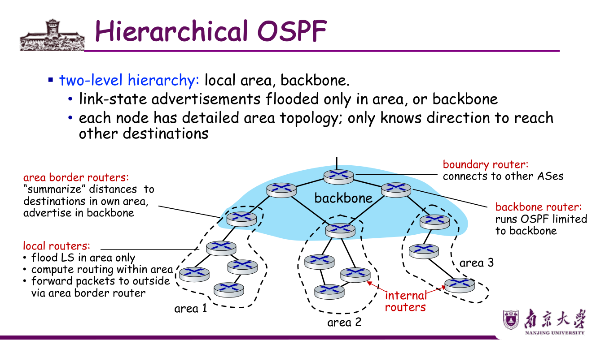

## 7. BGP：AS 间路由

### 7.1 BGP 的地位

BGP，Border Gateway Protocol，是事实上的 Internet inter-domain routing protocol。

它常被称为：

```text
glue that holds the Internet together
```

BGP 让一个网络前缀可以向全 Internet 宣告：

```text
I am here, here is who I can reach, and how.
```

BGP 为每个 AS 提供：

- 从邻居 AS 获取目的网络可达性信息，使用 eBGP。
- 根据可达性和策略选择到其他网络的路径。
- 在 AS 内部传播外部可达性信息，使用 iBGP。
- 向邻居网络广告自己的可达性信息。

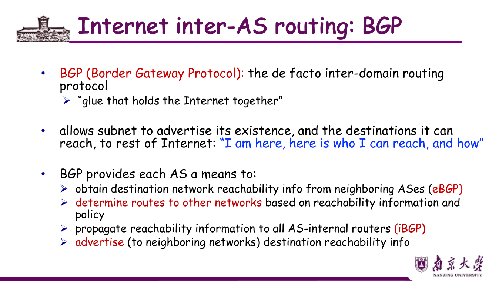

### 7.2 eBGP 与 iBGP

BGP 有两类连接：

- eBGP：external BGP，运行在不同 AS 的网关路由器之间。
- iBGP：internal BGP，运行在同一 AS 内，用来传播通过 eBGP 学到的外部路由。

网关路由器通常同时运行 eBGP 和 iBGP。

例如：

- AS3 的网关通过 eBGP 向 AS2 宣告某目的网络。
- AS2 的网关再通过 iBGP 把这条可达性信息告诉 AS2 内其他路由器。

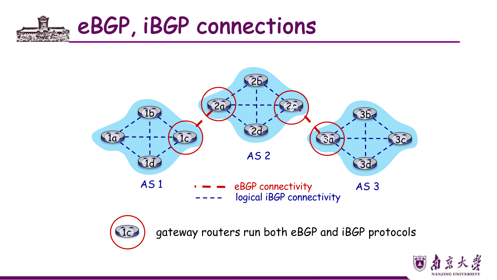

### 7.3 BGP 是 path vector 协议

BGP 会话是两个 BGP peer 之间的半永久 TCP 连接。

BGP 通过该 TCP 连接交换消息，广告到不同目的网络前缀的路径。

BGP 是 path vector 协议：

- 它不只告诉邻居“距离多远”。
- 它会携带路径经过的 AS 序列。

例如 AS3 向 AS2 宣告：

```text
AS3, X
```

含义是：

- AS3 能到达前缀 `X`。
- AS3 承诺会把发往 `X` 的 datagram 继续转发过去。

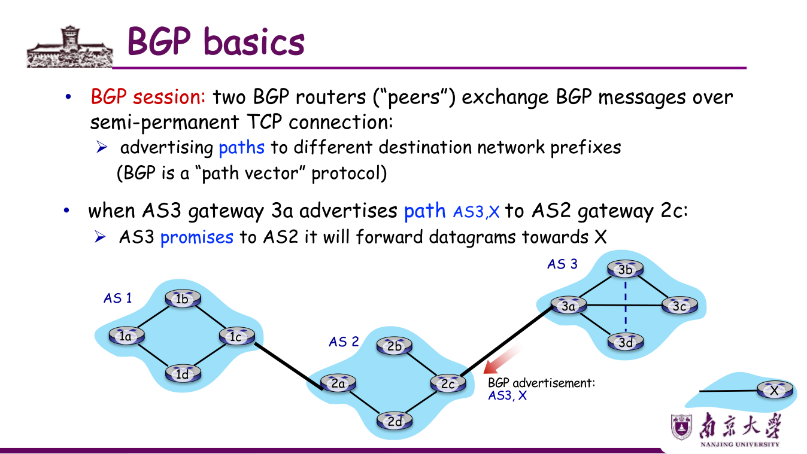

### 7.4 BGP 消息类型

BGP peer 之间通过 TCP 连接交换 BGP 消息。

主要消息类型：

| 消息 | 作用 |
| --- | --- |
| OPEN | 建立到远端 BGP peer 的 TCP 连接，并认证发送方 |
| UPDATE | 广告新路径，或撤销旧路径 |
| KEEPALIVE | 在没有 UPDATE 时保持连接，也用于确认 OPEN |
| NOTIFICATION | 报告前一条消息中的错误，也可用于关闭连接 |

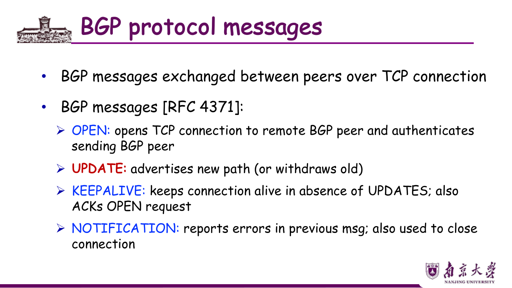

### 7.5 BGP 路由和路径属性

BGP 广告的 route 由两部分组成：

```text
prefix + attributes
```

prefix 是被广告的目的网络。

重要属性：

- AS-PATH：该前缀广告经过的 AS 列表。
- NEXT-HOP：到下一个 AS 的具体内部路由器。

BGP 是 policy-based routing。

网关收到 route advertisement 后，会根据 import policy 决定：

- 接受还是拒绝该路径。
- 是否禁止经过某些 AS。
- 是否把路径继续广告给其他邻居。

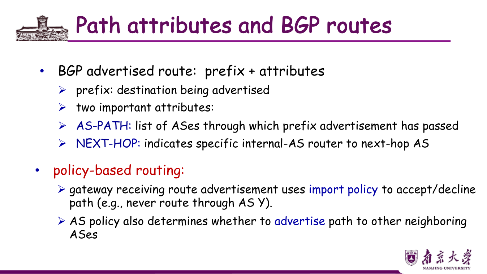

### 7.6 BGP 路径广告

路径广告可以逐 AS 传播。

例如：

1. AS3 的路由器 `3a` 通过 eBGP 向 AS2 的 `2c` 广告路径 `AS3, X`。
2. AS2 根据策略接受该路径。
3. AS2 通过 iBGP 把该信息传播给 AS2 内部路由器。
4. AS2 的 `2a` 通过 eBGP 向 AS1 的 `1c` 广告路径 `AS2, AS3, X`。

路径每经过一个 AS，AS-PATH 会增加该 AS。

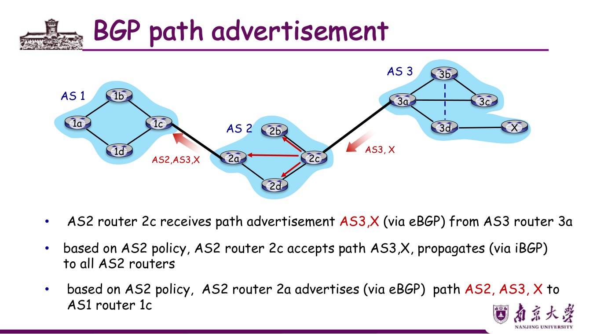

### 7.7 多条路径时如何传播

一个网关可能从不同邻居学到多个到同一目的前缀的路径。

例如 AS1 的网关 `1c` 可能学到：

```text
AS2, AS3, X
AS3, X
```

AS1 根据策略选择其中一条路径。

如果选择 `AS3, X`，则会通过 iBGP 在 AS1 内部传播：

```text
到 X 走 1c，然后走 AS3
```

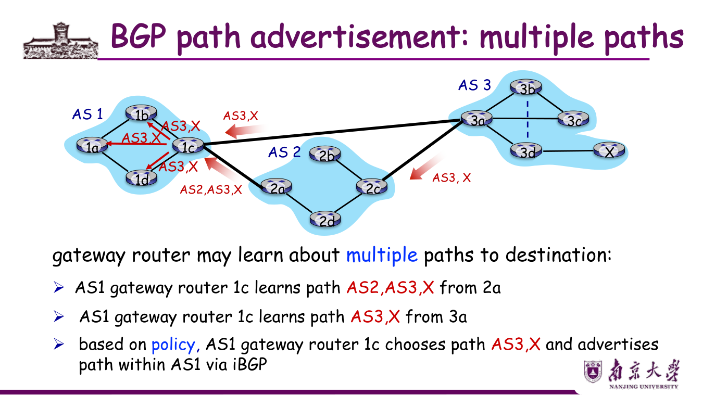

### 7.8 BGP 如何填充转发表

BGP 学到外部前缀后，还需要和 AS 内部路由结合，才能形成具体转发表项。

例如 AS1 内部路由器 `1d` 从 iBGP 学到：

```text
到 X 的路径经过网关 1c
```

但 `1d` 还需要知道：

```text
怎样在 AS1 内部到达 1c？
```

这个由 OSPF 等 intra-AS routing 决定。

如果 OSPF 告诉 `1d` 到 `1c` 应走接口 1，那么 `1d` 的转发表中：

```text
destination X -> interface 1
```

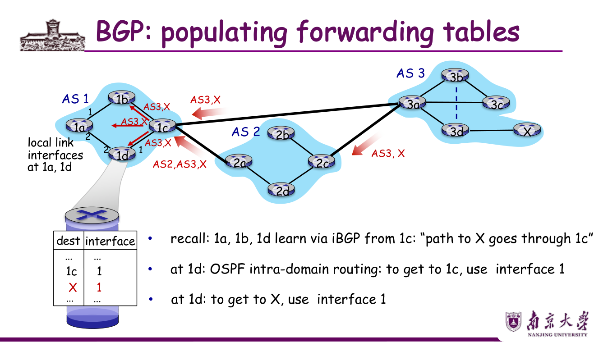

同理，AS1 内部不同路由器到同一个网关的内部最短路径可能不同，因此它们到外部前缀 `X` 的输出接口也可能不同。

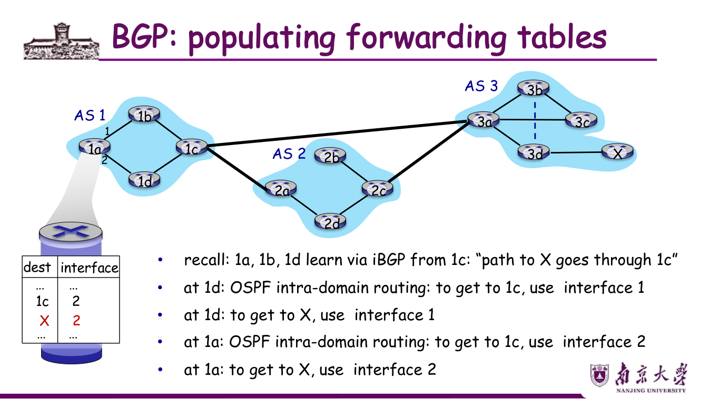

### 7.9 Hot Potato Routing

Hot potato routing 的思想是：

```text
尽快把外部目的流量交给另一个 AS
```

如果路由器学到多个能到达 `X` 的出口网关，它选择 AS 内部代价最低的网关。

它不关心这条路径在 AS 外部是否更短。

例如 `2d` 既可以经 `2a` 到 `X`，也可以经 `2c` 到 `X`：

- 如果到 `2a` 的 AS 内部代价更低，就选 `2a`。
- 即使经 `2a` 的 AS-PATH 更多，也可能被选中。

这反映了运营商策略：优先减少自己网络内部承载成本。

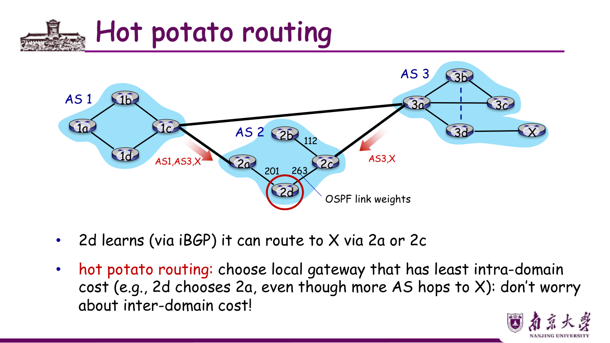

### 7.10 BGP 策略：不当免费中转

BGP 的核心不是单纯最短路径，而是策略。

典型策略：

```text
ISP 只愿意转发去往或来自自己客户网络的流量，
不愿意免费承载其他 ISP 之间的 transit traffic。
```

例子：

- A 向 B 和 C 广告自己能到 `w`。
- B 可以学到 `B-A-w`。
- 但 B 不会把 `B-A-w` 广告给 C。
- 因为如果 C 通过 B 去 A 和 w，B 没有收益，只是在为 C 和 A 做中转。

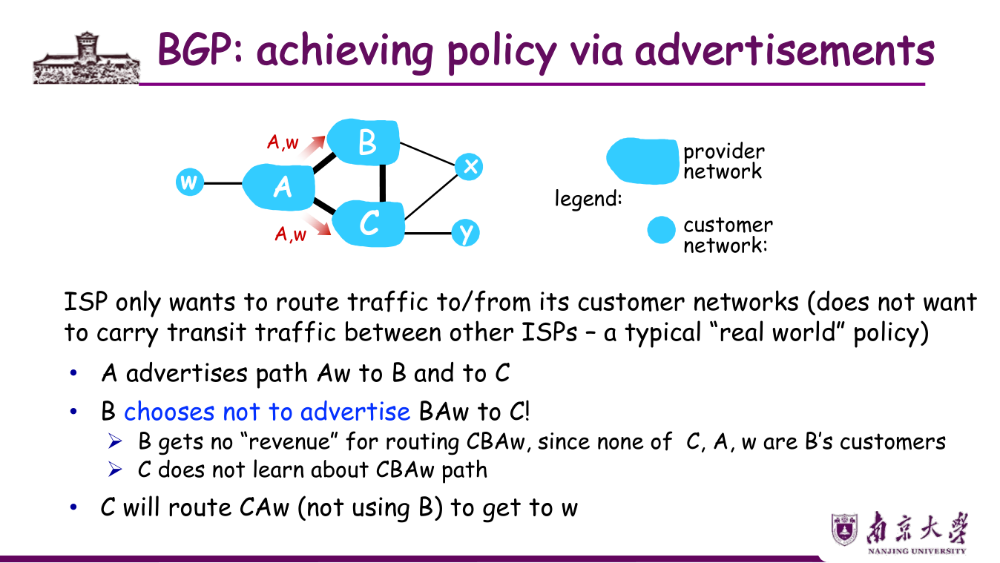

### 7.11 BGP 策略：多宿主客户

如果客户网络 `x` 同时连接到 B 和 C，这叫 dual-homed。

策略可能是：

```text
x 不愿意成为 B 到 C 的中转网络
```

因此：

- `x` 可以从 C 学到到 C 的路由。
- 但 `x` 不会向 B 广告它能到 C。
- 这样 B 就不会把去 C 的流量发给 x。

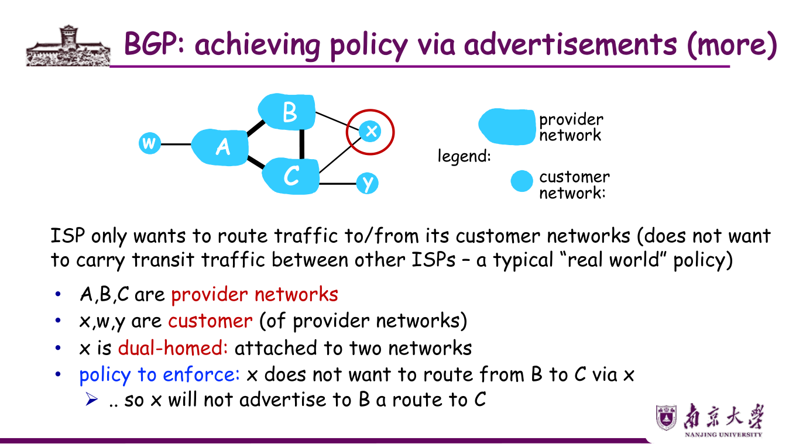

### 7.12 BGP 路由选择规则

路由器可能学到多条到同一目的 AS 或前缀的路由。

BGP 选择通常按以下顺序：

1. Local preference：本地偏好，体现策略决策。
2. Shortest AS-PATH：AS 路径最短。
3. Closest NEXT-HOP：最近下一跳，即 hot potato routing。
4. Additional criteria：其他规则。

注意：策略优先级最高，因此 BGP 不一定选择性能最好的路径。

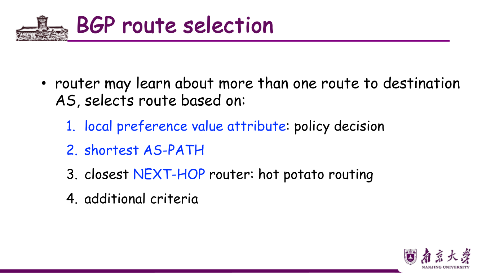

### 7.13 为什么 Intra-AS 和 Inter-AS 路由不同

Intra-AS 和 Inter-AS 路由目标不同。

Policy：

- Inter-AS 中，每个 AS 都有自己的商业和管理策略，需要控制流量如何进出、谁能经过自己网络。
- Intra-AS 中通常由单一组织管理，策略冲突少。

Scale：

- Inter-AS 需要处理 Internet 规模。
- 层次化路由能减少表规模和更新流量。

Performance：

- Intra-AS 可以更关注性能，例如最短路径、带宽、时延。
- Inter-AS 中策略常常压过性能。

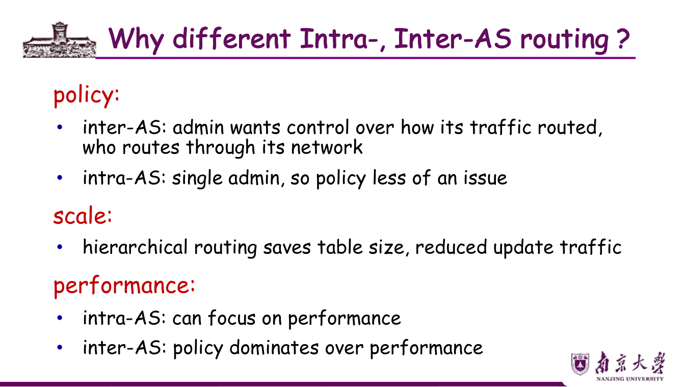

## 8. SDN 控制平面

### 8.1 为什么需要 SDN

传统每路由器控制平面把控制逻辑分散在每台路由器中。

这在 Internet 中很成功，但也带来限制：

- 管理复杂，容易配置错误。
- 流量工程只能通过调整链路权重等间接手段完成。
- 目的地址转发难以按业务类型、流、用户策略做细粒度控制。
- 控制平面常被设备厂商封装，创新速度受限。

SDN 的目标是让网络控制更集中、更开放、更可编程。

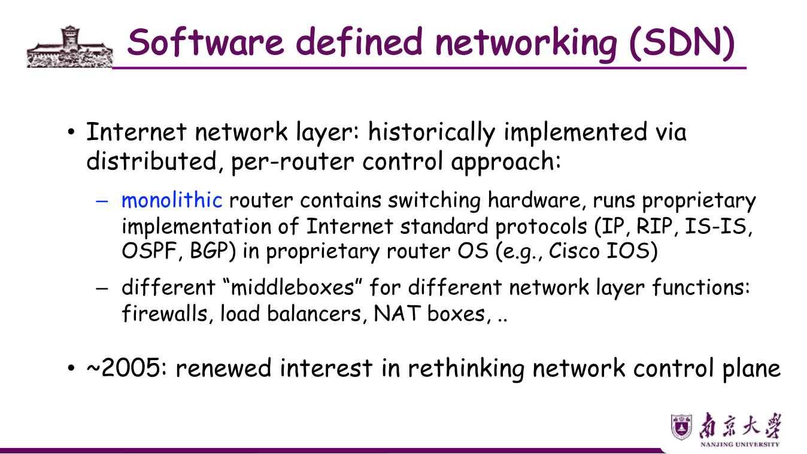

### 8.2 逻辑集中式控制平面的好处

逻辑集中式控制平面带来：

- 更容易管理网络，减少路由器配置错误。
- 更灵活地控制 traffic flow。
- 基于表的转发，如 OpenFlow，让路由器或交换机可以被“编程”。
- 集中计算表项并下发，比让每台路由器通过分布式协议间接计算更直接。
- 开放控制平面接口，促进创新。

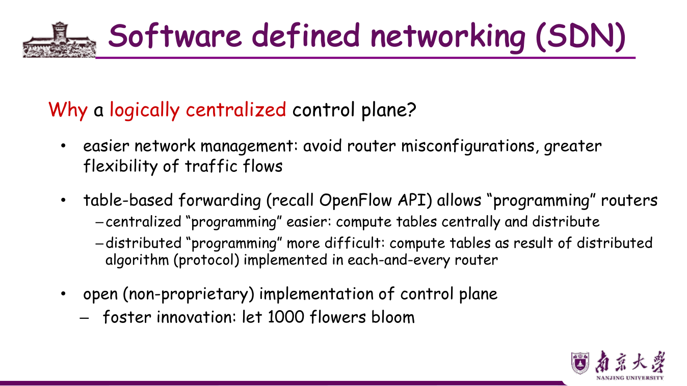

### 8.3 传统路由做流量工程为什么难

传统 destination-based forwarding 和 LS/DV 路由的控制旋钮有限，主要是链路权重。

如果运营商希望：

```text
u 到 z 的流量走 u-v-w-z，而不是 u-x-y-z
```

通常只能重新设计链路权重，让路由算法算出想要的路径。

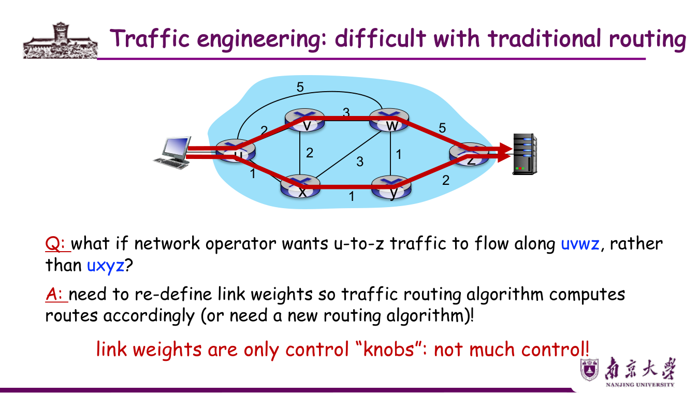

如果运营商希望：

```text
把 u 到 z 的流量分摊到 u-v-w-z 和 u-x-y-z 两条路径
```

传统最短路径路由很难直接表达。

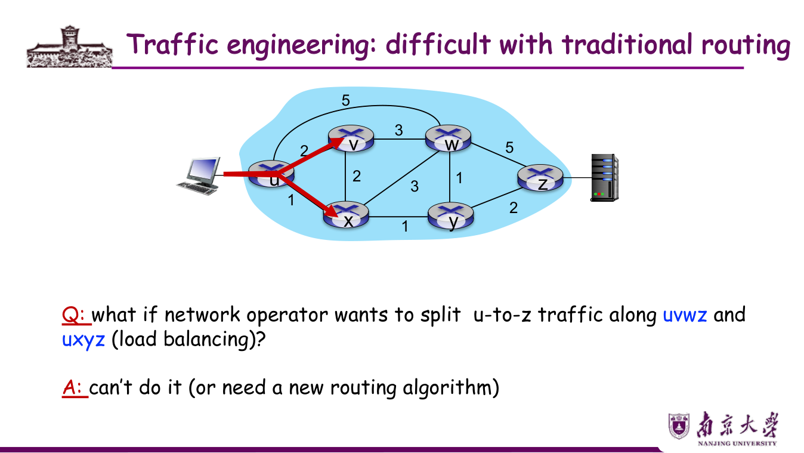

如果希望：

```text
w 到 z 的红色流量和蓝色流量走不同路径
```

仅基于目的地址转发也做不到。

第 4 章的通用转发和 match+action 可以表达这类策略，因此 SDN 更适合复杂流量工程。

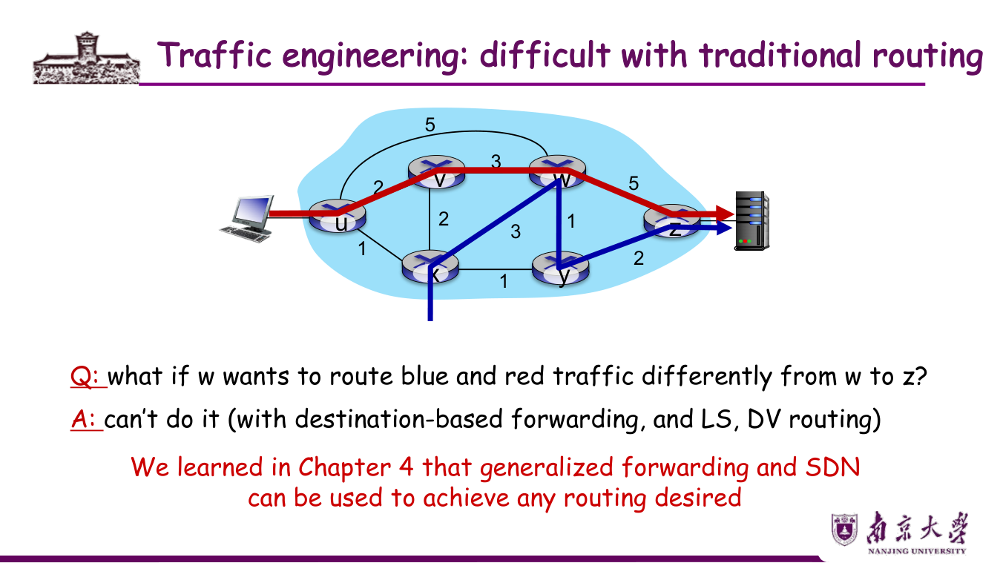

### 8.4 SDN 的四个特征

SDN 的关键特征：

1. Generalized flow-based forwarding，例如 OpenFlow。
2. Control plane 和 data plane 分离。
3. 控制平面功能位于数据平面交换设备外部。
4. 可编程控制应用，如 routing、access control、load balancing。

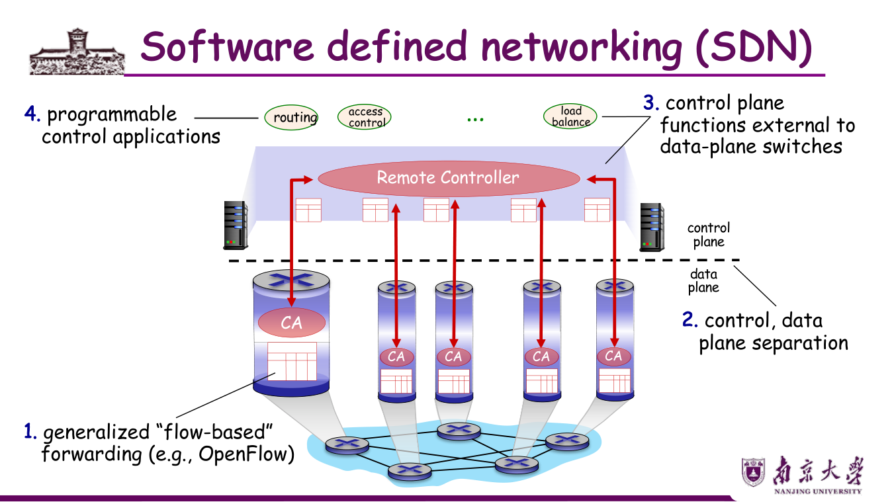

### 8.5 SDN 数据平面交换机

SDN-controlled switch 通常是：

- 快速、简单、商品化的交换设备。
- 在硬件中实现通用数据平面转发。
- flow table 由控制器计算和安装。
- 提供表控制 API，例如 OpenFlow。
- 通过协议与控制器通信。

OpenFlow API 定义：

- 哪些字段可匹配。
- 哪些动作可执行。
- 哪些行为可由控制器控制。

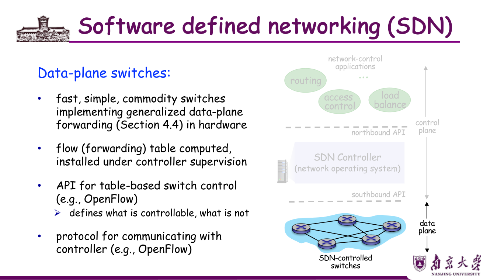

### 8.6 SDN Controller

SDN controller 也叫 network operating system。

它负责：

- 维护网络状态信息。
- 通过 northbound API 与上层网络控制应用交互。
- 通过 southbound API 与下层交换设备交互。
- 作为分布式系统实现，以支持性能、可扩展性、容错和鲁棒性。

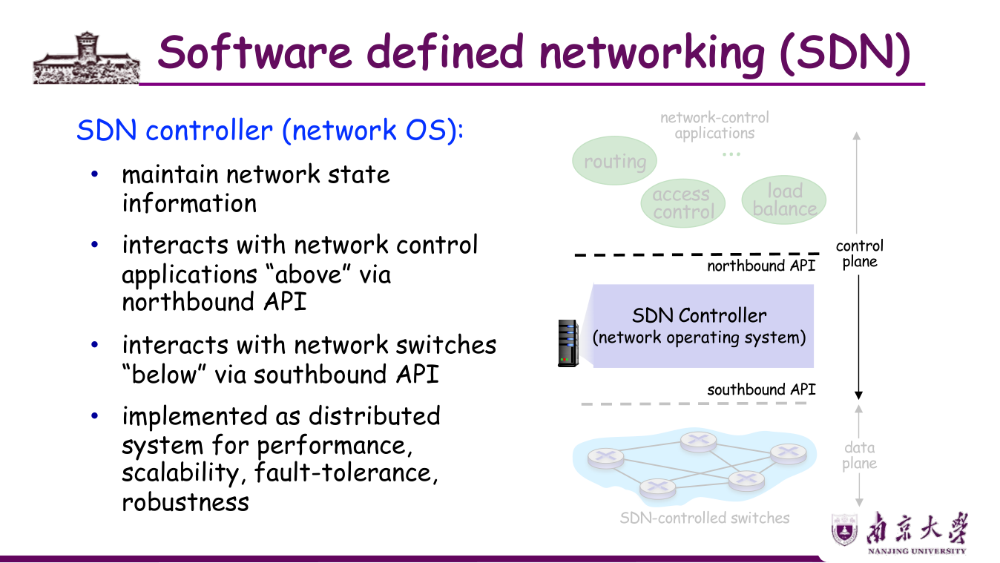

### 8.7 Network-control applications

网络控制应用是控制逻辑的“大脑”。

例子：

- routing。
- access control。
- load balancing。
- traffic engineering。

这些应用使用 SDN controller 提供的低层服务和 API，计算策略或路径，再通过 controller 转化为流表规则。

控制应用可以由第三方提供，不必和交换机厂商绑定。

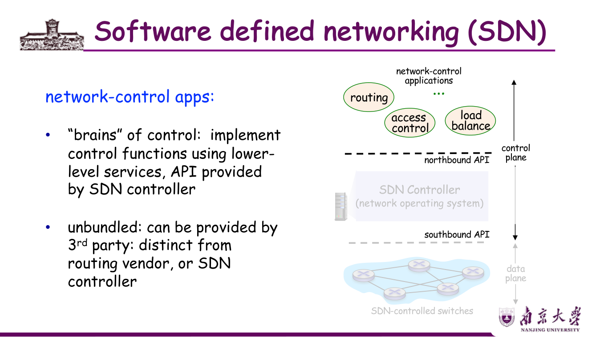

### 8.8 SDN Controller 组件

SDN controller 通常包含三类核心组件：

#### 与设备通信

负责和受控交换设备通信。

协议包括：

- OpenFlow。
- SNMP。
- NETCONF 等。

#### 全网状态管理

维护网络状态数据库：

- link-state info。
- switch info。
- host info。
- statistics。
- flow tables。
- network graph。

#### 面向控制应用的接口

向上层应用提供抽象和 API：

- RESTful API。
- intent。
- network graph。
- 其他控制抽象。

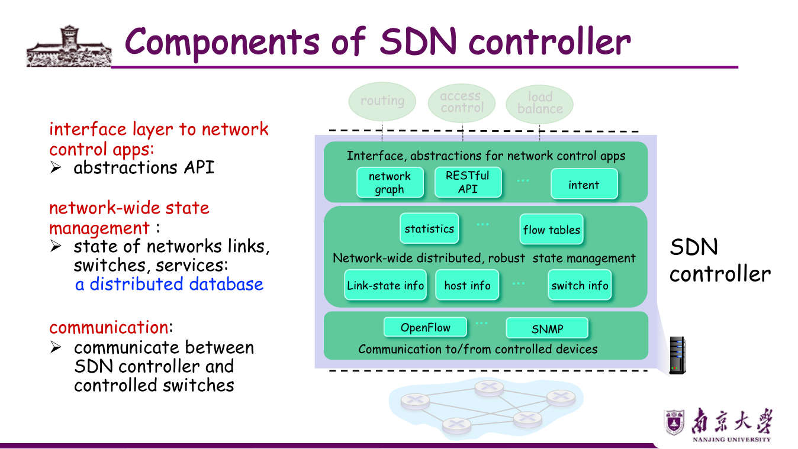

### 8.9 OpenFlow 协议

OpenFlow 协议运行在 controller 和 switch 之间。

特点：

- 使用 TCP 交换消息。
- 可选加密。
- 与 OpenFlow API 不同：API 描述可匹配字段和可执行动作，协议负责实际消息交换。

OpenFlow 消息分为三类：

- controller-to-switch。
- asynchronous，switch-to-controller。
- symmetric，杂项消息。

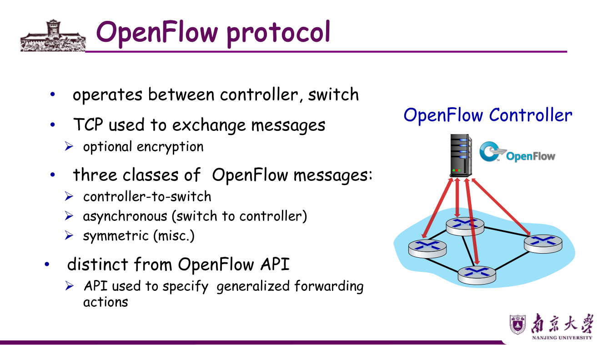

### 8.10 Controller-to-switch 消息

常见 controller-to-switch 消息：

- features：controller 查询 switch 特性，switch 回复。
- configure：controller 查询或设置 switch 配置参数。
- modify-state：增加、删除或修改 OpenFlow 表项。
- packet-out：controller 指示 switch 从特定端口发出某个分组。

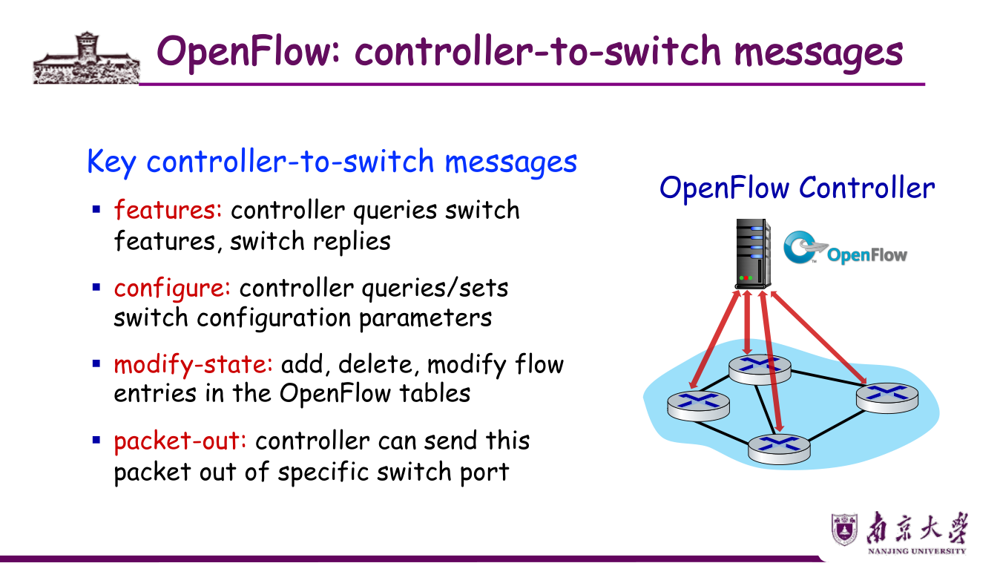

### 8.11 Switch-to-controller 消息

常见 switch-to-controller 消息：

- packet-in：把分组及其控制信息交给 controller。
- flow-removed：通知 controller 某个流表项已被删除。
- port status：通知端口状态变化。

实际网络管理员通常不会手写这些 OpenFlow 消息，而是使用 controller 提供的更高层抽象。

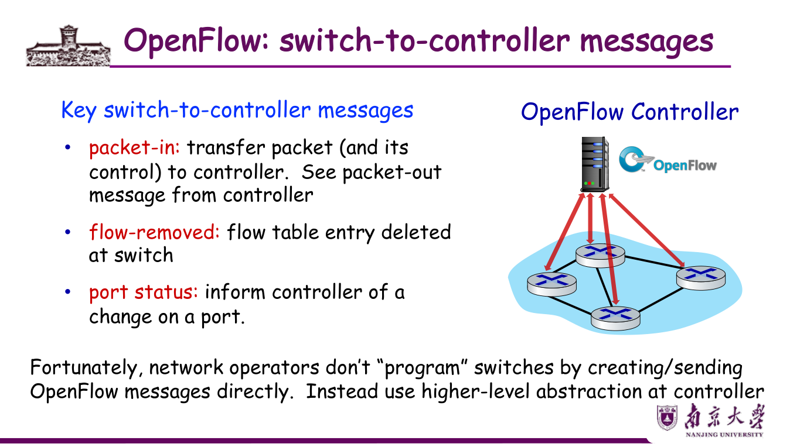

### 8.12 SDN 控制与数据平面交互例子

假设交换机 `s1` 发现链路故障。

交互过程：

1. `s1` 使用 OpenFlow port status 消息通知 controller。
2. controller 收到消息后，更新链路状态信息。
3. Dijkstra 路由应用此前注册了链路状态变化回调，于是被调用。
4. 路由应用读取 controller 中的网络图和链路状态，计算新路径。

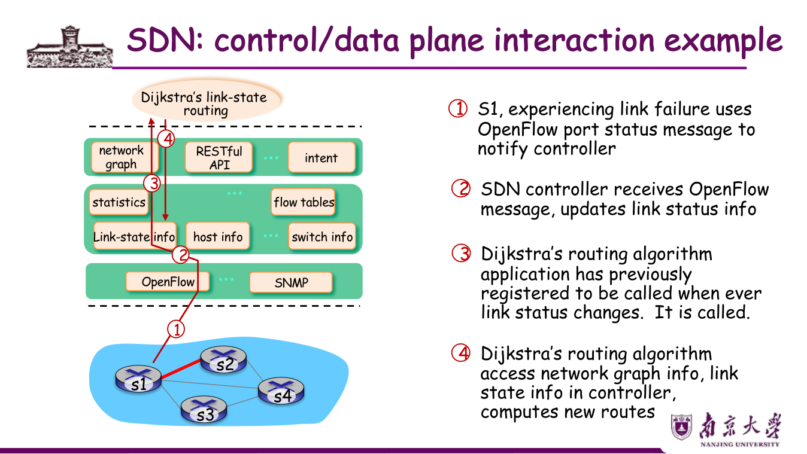

然后：

5. 路由应用与 flow-table computation 组件交互，计算需要的新流表。
6. controller 使用 OpenFlow 把新表项安装到需要更新的交换机。

这个过程展示了 SDN 的核心：控制应用通过集中网络状态做决策，控制器再把决策翻译为设备规则。

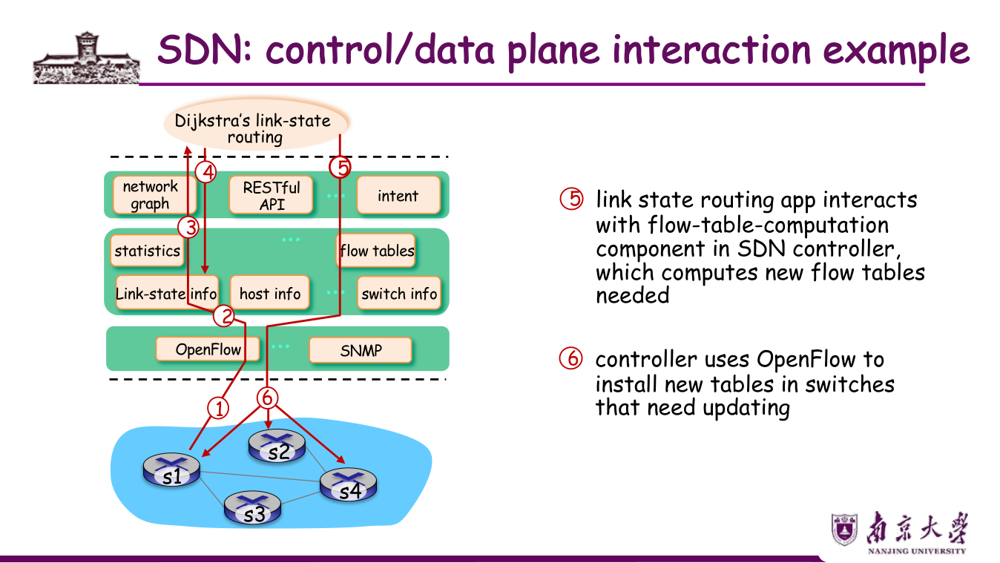

### 8.13 实际 SDN 控制器例子

#### Google ORION

ORION 是 Google 的 SDN 控制平面，用于数据中心网络 Jupiter 和广域网络 B4。

特点：

- routing、intradomain、iBGP、traffic engineering 等作为应用运行在 ORION core 之上。
- 支持 edge-to-edge flow-based control，如 CoFlow scheduling。
- 管理层采用 pub-sub 分布式微服务。
- 使用 OpenFlow 做交换机信令和监控。

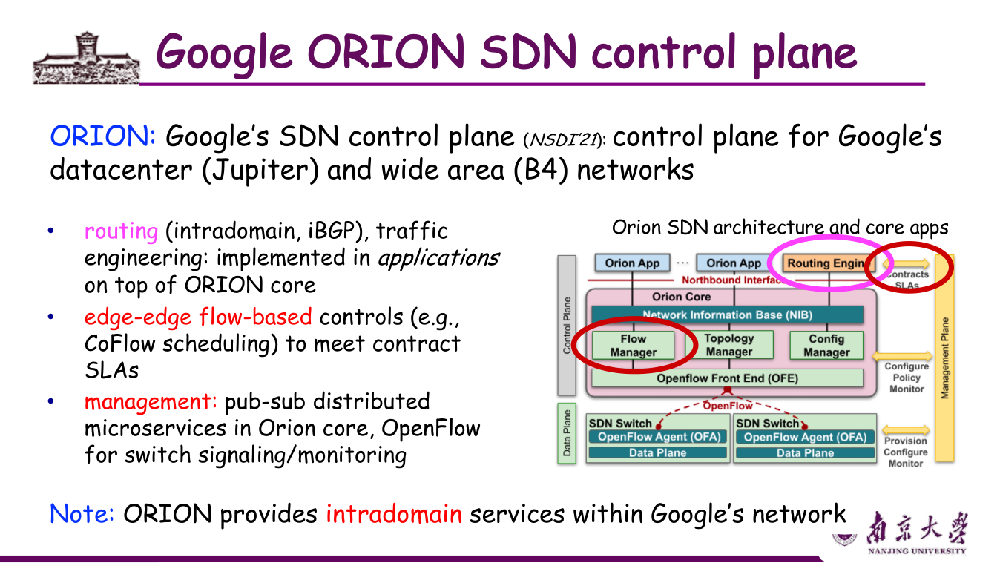

#### OpenDaylight

OpenDaylight 使用 Service Abstraction Layer 连接内部和外部应用服务。

它支持：

- OpenFlow。
- NETCONF。
- SNMP。
- OVSDB。
- REST/RESTCONF/NETCONF API。

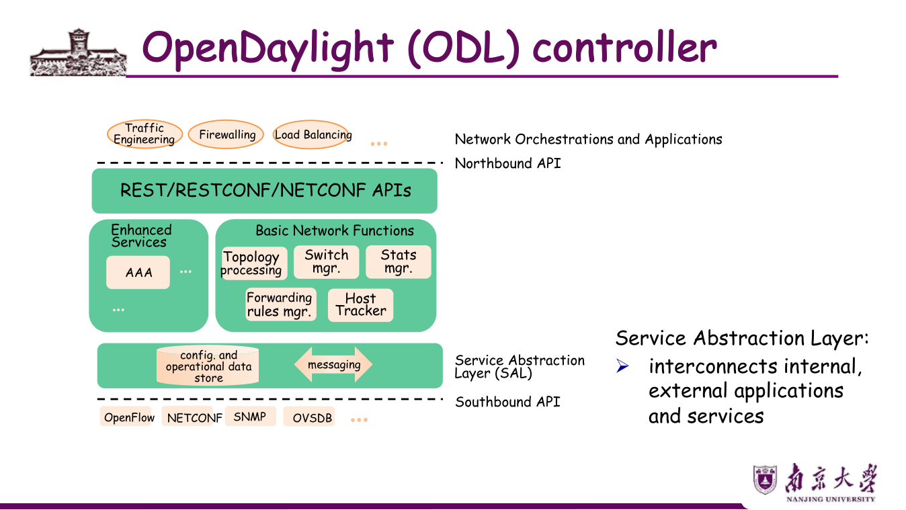

#### ONOS

ONOS 强调分布式核心、服务可靠性、复制和性能扩展。

它提供：

- northbound API，如 REST API 和 intent。
- southbound abstraction，如 device、link、host、flow、packet。
- 控制应用与 controller 分离。

Intent framework 允许应用描述“想要什么”，而不是逐条说明“怎么做”。

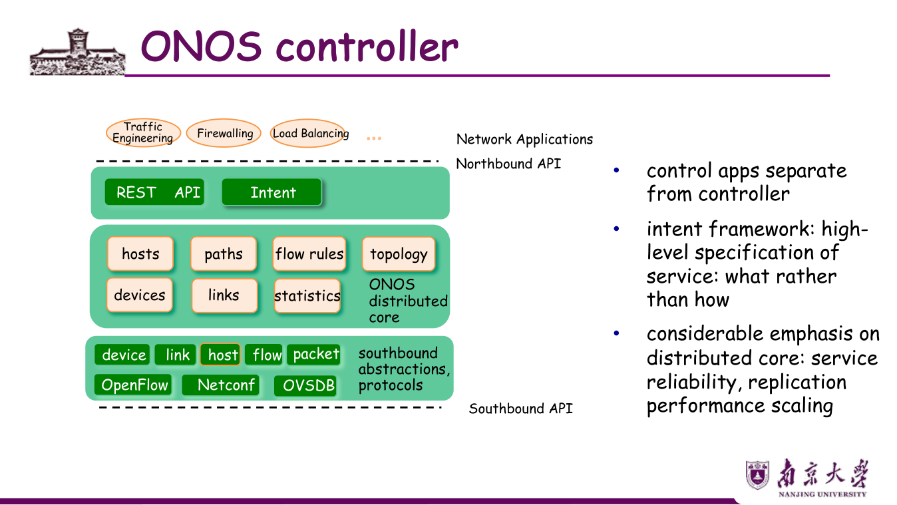

### 8.14 SDN 的挑战

SDN 的挑战包括：

- 控制平面必须可靠、可扩展、安全。
- 控制器是关键基础设施，需要能抵抗故障和攻击。
- 分布式控制器要处理一致性、性能和容错。
- 特定任务网络可能要求实时、超可靠或超安全。
- Internet 级别跨 AS SDN 更复杂。
- SDN 在 5G 网络中非常关键。

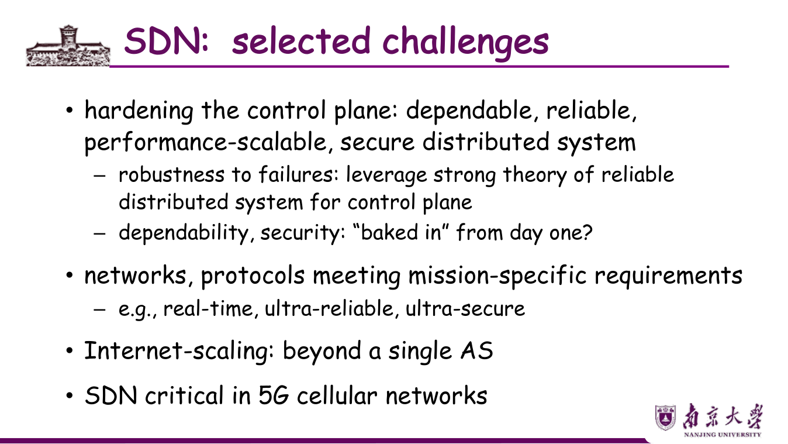

## 9. ICMP 与 Traceroute

### 9.1 ICMP 的作用

ICMP，Internet Control Message Protocol，用于主机和路由器之间传递网络层控制信息。

典型用途：

- 错误报告：网络、主机、端口、协议不可达。
- echo request/reply：ping 使用。
- 路由器发现和通告。

ICMP 位于 IP 之上：

- ICMP 消息封装在 IP datagram 中。
- 但它属于网络层控制协议，而不是普通应用层协议。

ICMP 消息包含：

- type。
- code。
- 导致错误的 IP datagram 前 8 字节等信息。

常见类型：

| Type | Code | 含义 |
| --- | --- | --- |
| 0 | 0 | echo reply |
| 3 | 0 | destination network unreachable |
| 3 | 1 | destination host unreachable |
| 3 | 2 | destination protocol unreachable |
| 3 | 3 | destination port unreachable |
| 8 | 0 | echo request |
| 11 | 0 | TTL expired |

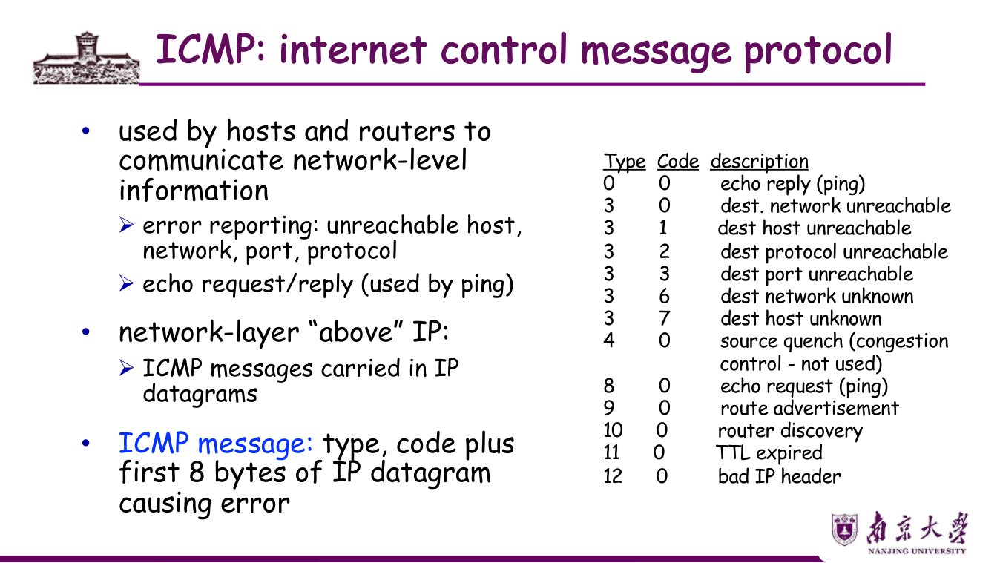

### 9.2 Traceroute 如何使用 ICMP

Traceroute 利用 TTL 和 ICMP。

基本过程：

1. 源主机向目的地发送一组 UDP segment，第一组 TTL = 1。
2. 第一跳路由器收到后把 TTL 减到 0，丢弃 datagram。
3. 该路由器返回 ICMP TTL expired 消息。
4. 源主机记录收到 ICMP 的 RTT，并得到该路由器地址。
5. 源主机继续发送 TTL = 2、TTL = 3 的探测包。
6. 第 `n` 组探测包会到达第 `n` 跳路由器，然后触发 ICMP 返回。

停止条件：

- UDP segment 最终到达目的主机。
- 目的主机上对应 UDP 端口通常没有应用监听。
- 目的主机返回 ICMP port unreachable，type 3 code 3。
- 源主机据此知道已经到达目的地。

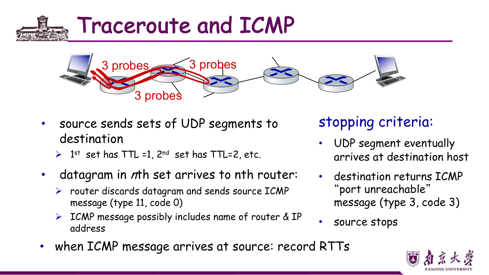

## 10. 网络管理

### 10.1 什么是网络管理

一个 AS 或网络包含大量硬件、软件和配置组件。

网络管理包括：

- 部署。
- 集成。
- 协调硬件、软件和人员。
- 监控、测试、轮询。
- 配置、分析、评估。
- 控制网络和网络元素资源。

目标是在合理成本下满足实时运行、性能和 QoS 要求。

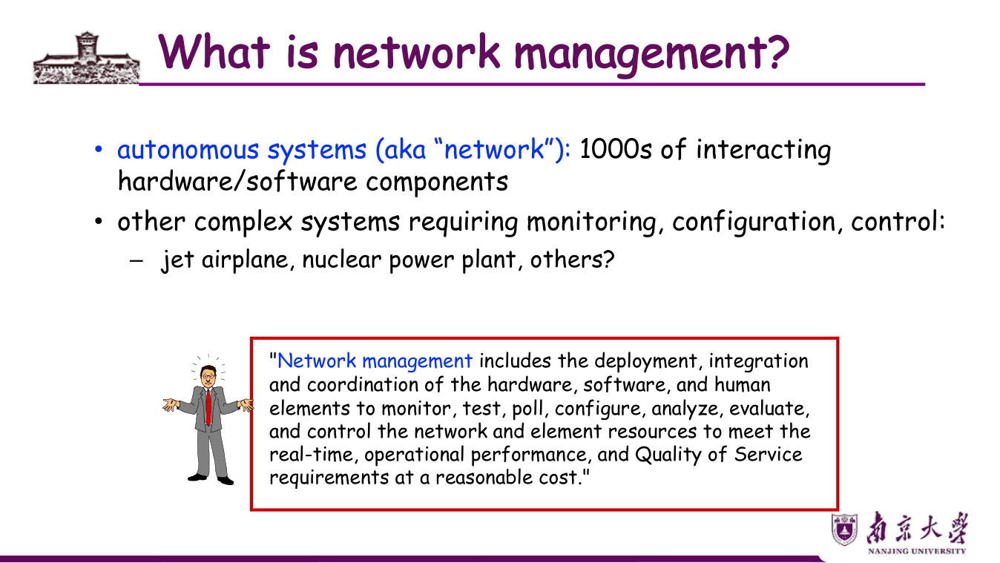

### 10.2 网络管理组件

网络管理系统通常包括：

- Managing server/controller：管理服务器，运行管理应用，通常有人类网络管理员参与。
- Managed device：被管理设备，如路由器、交换机、防火墙等。
- Agent data：设备上的代理和数据。
- Data：配置数据、运行状态、设备统计。
- Network management protocol：管理服务器查询、配置、管理设备；设备也可向服务器报告事件。

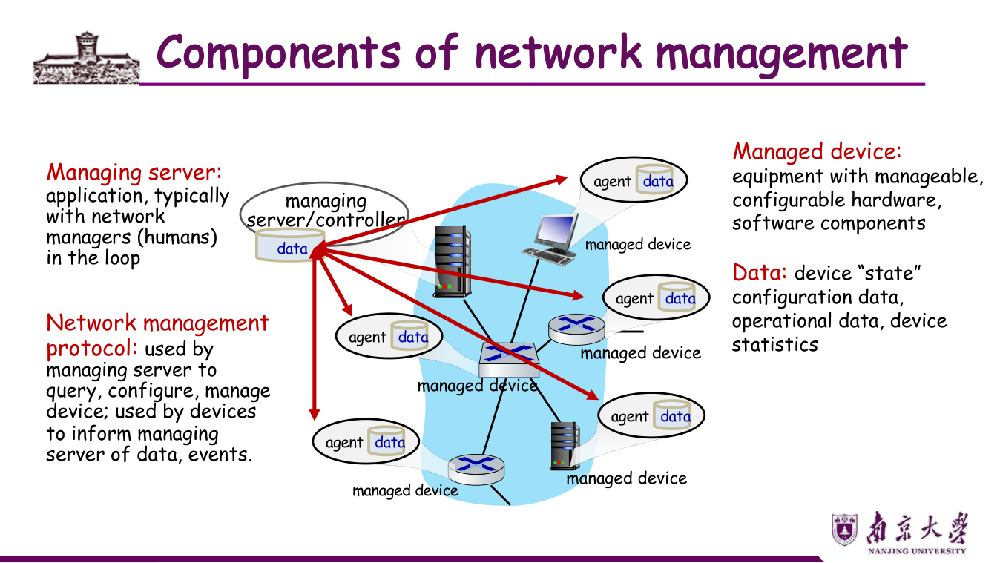

### 10.3 网络运营者的管理方式

常见管理方式：

#### CLI

Command Line Interface。

管理员直接登录单台设备，输入命令或脚本配置。

特点：

- 直观。
- 常用于单设备操作。
- 大规模多设备一致配置较困难。

#### SNMP/MIB

SNMP，Simple Network Management Protocol。

管理员通过 SNMP 查询或设置设备的 MIB 数据。

适合监控和简单管理。

#### NETCONF/YANG

更抽象、全网化、整体化。

重点：

- 多设备配置管理。
- YANG 描述数据模型。
- NETCONF 在远程设备之间传输 YANG 兼容的动作和数据。

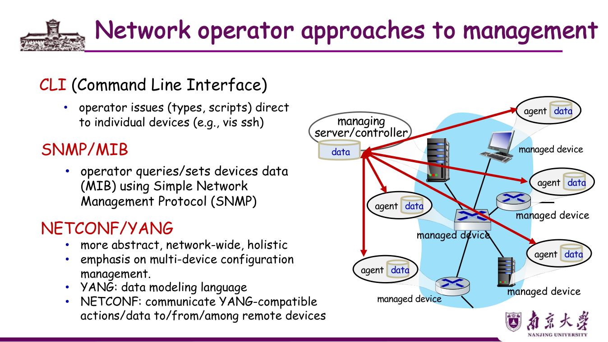

## 11. SNMP 与 MIB

### 11.1 SNMP 的两种通信模式

SNMP 在 managing server 和 managed device agent 之间交换信息。

两种主要模式：

#### Request/Response

管理服务器向设备请求或设置 MIB 数据。

设备返回 response。

#### Trap

设备主动向管理服务器报告异常事件。

Trap 适合告警，例如端口 down、设备异常等。

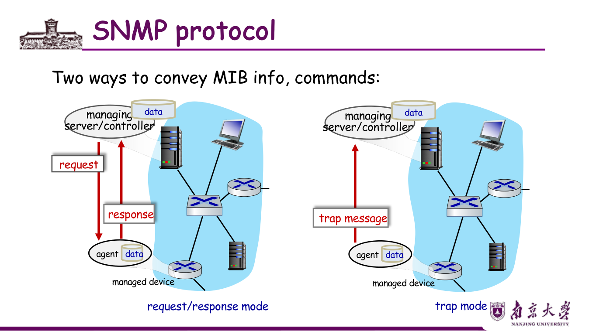

### 11.2 SNMP 消息类型

常见 SNMP 消息类型：

| 消息类型 | 方向 | 作用 |
| --- | --- | --- |
| GetRequest | manager -> agent | 获取某个数据实例 |
| GetNextRequest | manager -> agent | 获取列表中的下一个数据 |
| GetBulkRequest | manager -> agent | 获取一批数据 |
| SetRequest | manager -> agent | 设置 MIB 值 |
| Response | agent -> manager | 返回请求结果或值 |
| Trap | agent -> manager | 报告异常事件 |

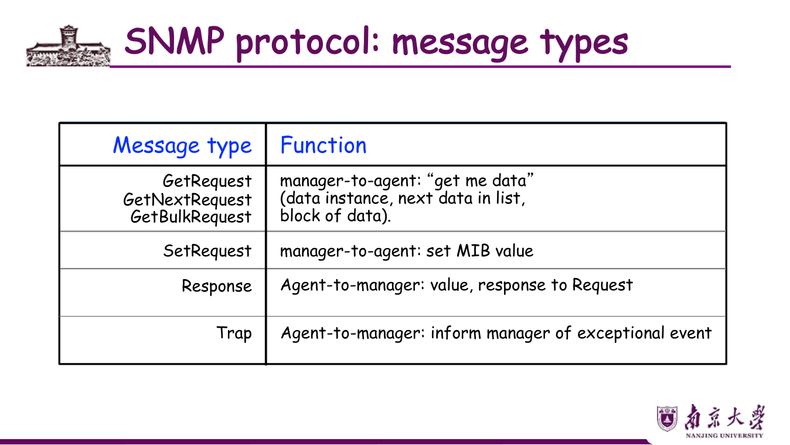

### 11.3 MIB

MIB，Management Information Base，是被管理设备的运行数据和部分配置数据集合。

特点：

- 每个设备有自己的 MIB module。
- RFC 中定义了大量标准 MIB。
- 厂商也可以定义自己的 MIB。

示例 UDP 相关 MIB 变量：

| Object ID | Name | Type | 含义 |
| --- | --- | --- | --- |
| `1.3.6.1.2.1.7.1` | UDPInDatagrams | 32-bit counter | 已交付 UDP datagram 总数 |
| `1.3.6.1.2.1.7.2` | UDPNoPorts | 32-bit counter | 因无端口应用而无法交付的 datagram 数 |
| `1.3.6.1.2.1.7.4` | UDPOutDatagrams | 32-bit counter | 发出的 UDP datagram 总数 |

SMI，Structure of Management Information，是定义这些管理数据的数据定义语言。

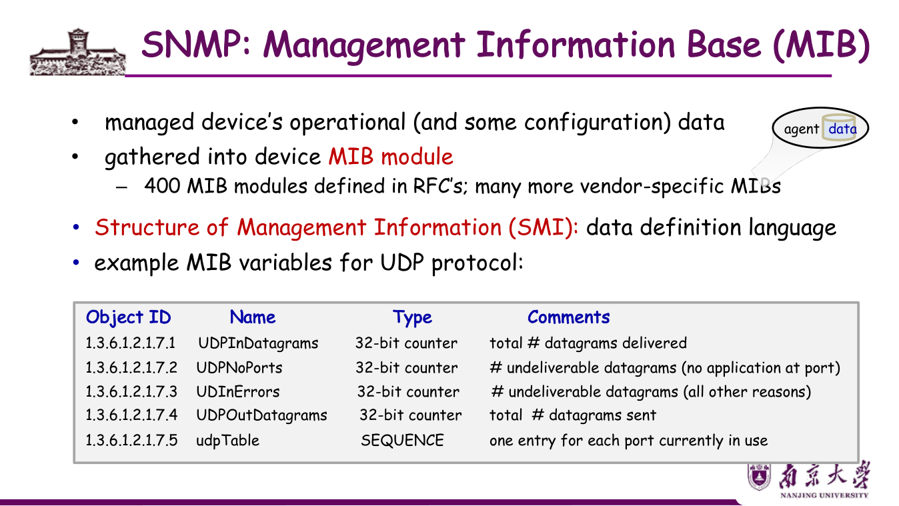

## 12. NETCONF 与 YANG

### 12.1 NETCONF 概览

NETCONF 的目标是主动、系统地管理和配置网络设备。

它运行在 managing server 和 managed network devices 之间。

支持操作：

- retrieve configuration。
- set configuration。
- modify configuration。
- activate configuration。
- 多设备 atomic commit。
- 查询运行状态和统计。
- 订阅设备通知。

NETCONF 使用 RPC 范式：

- 消息用 XML 编码。
- 通过安全、可靠传输协议交换，例如 TLS。

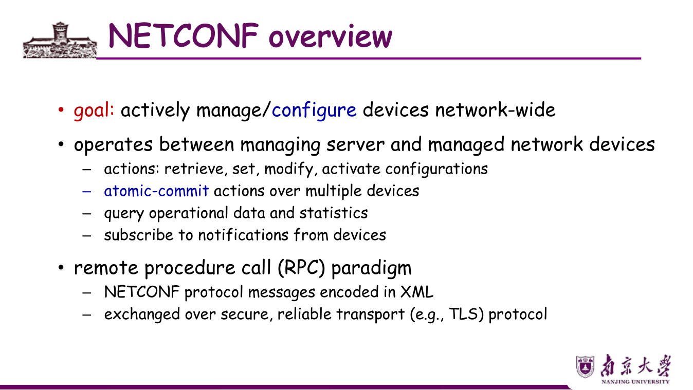

### 12.2 NETCONF 会话

NETCONF 会话一般包括：

1. Session initiation。
2. Capabilities exchange：双方用 `<hello>` 交换能力。
3. 一系列 `<rpc>` 和 `<rpc-reply>`。
4. 设备可以发送 `<notification>`。
5. `<close-session>` 关闭会话。

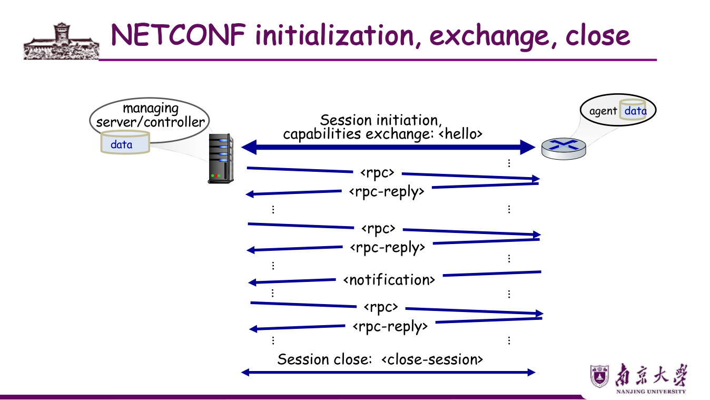

### 12.3 常见 NETCONF 操作

| 操作 | 作用 |
| --- | --- |
| `<get-config>` | 获取指定配置的一部分或全部 |
| `<get>` | 获取配置状态和运行状态数据 |
| `<edit-config>` | 修改设备配置 |
| `<lock>` / `<unlock>` | 锁定或解锁配置 datastore，避免其他来源同时修改 |
| `<create-subscription>` | 订阅设备事件通知 |
| `<notification>` | 设备发送事件通知 |

如果 `<edit-config>` 失败，设备可在 `<rpc-reply>` 中返回错误并回滚。

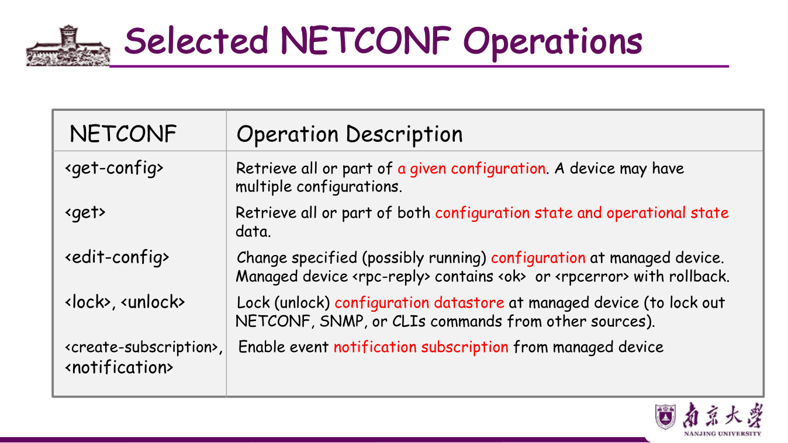

### 12.4 NETCONF RPC 示例

NETCONF RPC 消息可以表达配置修改。

例如：

- 指定 message id。
- 修改 running configuration。
- 把 Ethernet `0/0` 接口 MTU 改为 1500。

这种 XML 结构比手写 CLI 更适合程序化、可验证和自动化配置。

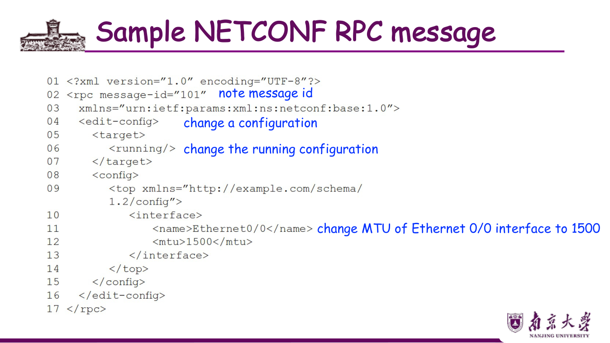

### 12.5 YANG

YANG 是 NETCONF 管理数据的数据建模语言。

它描述：

- 数据结构。
- 语法。
- 语义。
- 约束。

YANG 支持内置数据类型，类似 SMI。

根据 YANG 描述，可以生成 XML 文档，用于描述设备能力和配置数据。

YANG 还可以表达配置之间必须满足的约束，从而保证 NETCONF 配置的正确性和一致性。

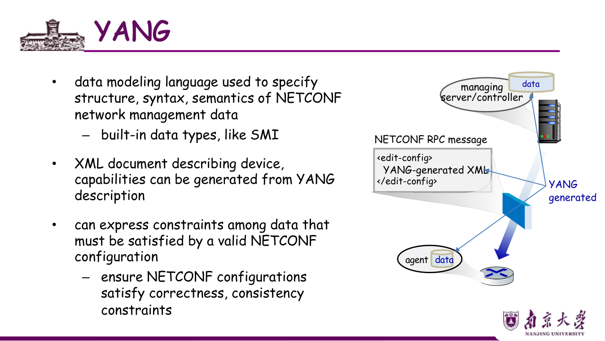

## 13. 本章小结

网络层控制平面回答的是：转发表从哪里来，路径如何计算，策略如何传播，网络如何被管理。

本章主线：

- 网络层分为数据平面和控制平面，前者转发分组，后者计算路径和安装转发表。
- 传统控制平面是 per-router 的，SDN 控制平面是逻辑集中式的。
- 路由算法把网络抽象为图，链路代价由运营者定义。
- Link-State 使用全局拓扑和 Dijkstra 算法，每台路由器独立计算最短路径树。
- Distance-Vector 只和邻居交换距离估计，基于 Bellman-Ford 方程迭代收敛。
- LS 可能振荡，DV 可能出现路由环路和 count-to-infinity。
- Internet 通过 AS 实现层次化路由，AS 内使用 OSPF 等 intra-AS 协议，AS 间使用 BGP。
- OSPF 是公开的 link-state 协议，层次化 OSPF 用 area 和 backbone 控制规模。
- BGP 是 path-vector 协议，使用 eBGP/iBGP 传播可达性，路径选择首先服从策略。
- Hot potato routing 选择 AS 内部代价最近的出口网关。
- SDN 使用集中网络状态、可编程控制应用和 OpenFlow 等协议管理数据平面交换机。
- ICMP 支持网络层错误报告和诊断，Traceroute 利用 TTL 和 ICMP 发现路径。
- 网络管理从 CLI、SNMP/MIB 演进到 NETCONF/YANG，更强调多设备、模型驱动和自动化配置。

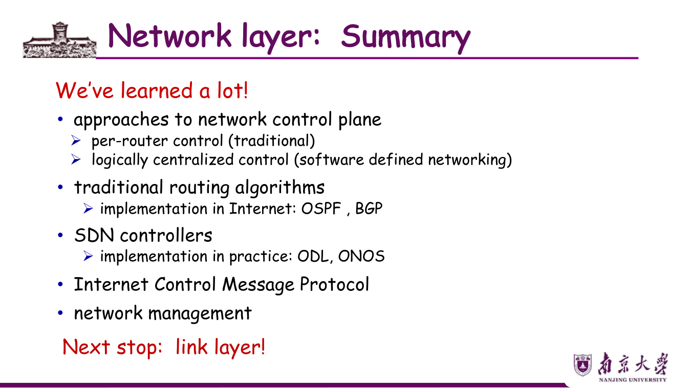

