# 第 6 章 链路层和局域网

> 本章核心问题：
>
> 1. 链路层在协议栈中负责什么？它和网络层如何配合？
> 2. 链路层提供哪些服务：封装、链路访问、差错检测、可靠交付、流量控制？
> 3. 奇偶校验、Internet checksum 和 CRC 如何检测差错？
> 4. 多路访问链路中，多个节点如何共享同一个广播信道？
> 5. TDMA、FDMA、ALOHA、CSMA/CD、轮询和令牌传递各自解决什么问题？
> 6. MAC 地址和 IP 地址有什么区别？ARP 如何完成地址解析？
> 7. 跨子网通信时，IP 地址和 MAC 地址分别如何变化？
> 8. Ethernet 帧格式、CSMA/CD 和交换机自学习如何工作？
> 9. VLAN 如何在同一物理 LAN 上划分多个逻辑 LAN？
> 10. MPLS 为什么可以看作链路虚拟化，它如何支持流量工程？
> 11. 数据中心网络为什么需要多路径、负载均衡和 SDN？
> 12. 一个 Web 请求从接入网络到 HTTP 响应，经过了哪些协议层动作？


## 0. 本章内容结构

前几章从应用层、运输层、网络层逐步向下走。到第 6 章，协议栈来到链路层。

链路层的核心任务是：在一条链路上，把网络层 datagram 从一个节点传给物理相邻的下一个节点。

本章主要内容包括：

- 链路层简介与服务。
- 差错检测和纠正。
- 多路访问协议。
- MAC 地址、ARP 和跨子网链路层寻址。
- Ethernet 和交换式 LAN。
- VLAN。
- MPLS。
- 数据中心网络。
- 一个 Web 请求的一天。

## 1. 链路层概览

### 1.1 基本术语

链路层中的基本术语：

- Node：节点，包括主机和路由器。
- Link：连接相邻节点的通信信道，可以是有线、无线或 LAN。
- Frame：链路层分组，用来封装网络层 datagram。

链路层负责把 datagram 从一个节点传到同一条链路上的相邻节点。

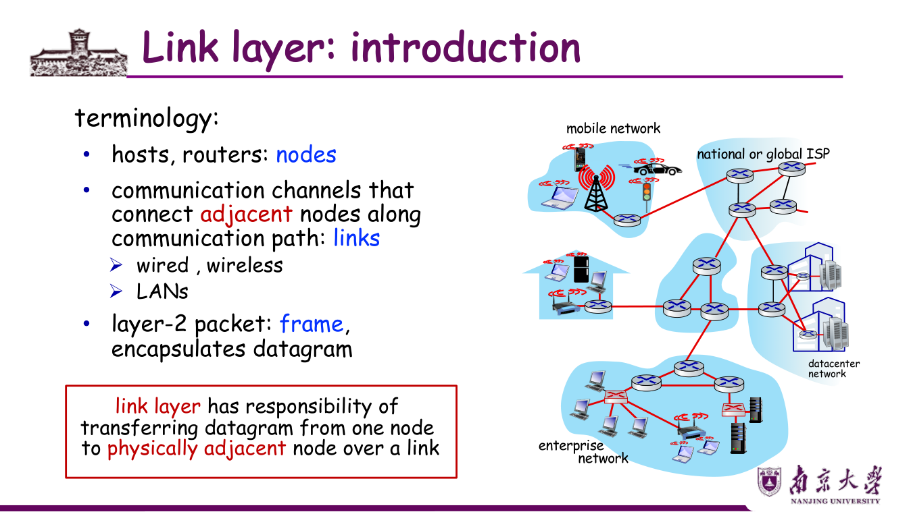

### 1.2 链路层上下文

一个端到端 datagram 可能跨越多条链路。

例如：

- 第一跳使用 WiFi。
- 第二跳使用 Ethernet。
- 之后经过 ISP 核心链路。

每条链路可能使用不同的链路层协议，也可能提供不同服务。

所以网络层的 datagram 在每一跳都会被不同链路层帧封装：

```text
IP datagram -> WiFi frame -> Ethernet frame -> ...
```

IP datagram 的源和目的 IP 地址通常端到端保持不变，但每一跳的链路层帧首部会变化。

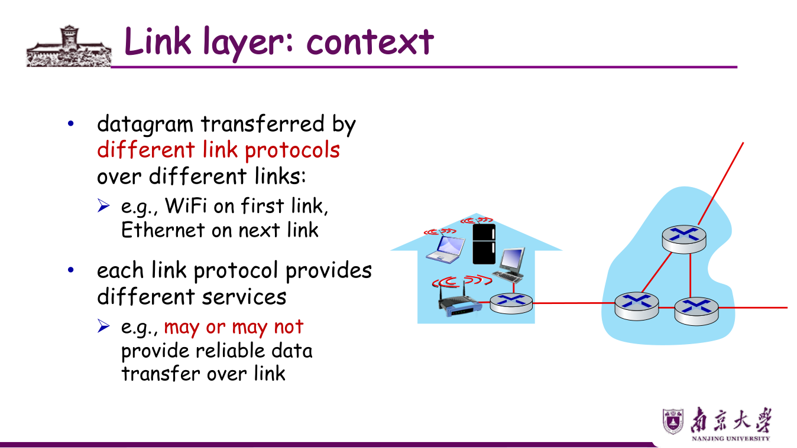

### 1.3 交通类比

课件用从 Princeton 到 Lausanne 的旅行作类比：

- Princeton 到 JFK：limo。
- JFK 到 Geneva：plane。
- Geneva 到 Lausanne：train。

对应到网络：

- tourist：datagram。
- transportation mode：链路层协议。
- route planning：路由算法。
- 每一段交通工具只负责相邻地点之间的移动。

链路层也是如此：它不负责端到端路径规划，只负责当前链路上的一跳传输。

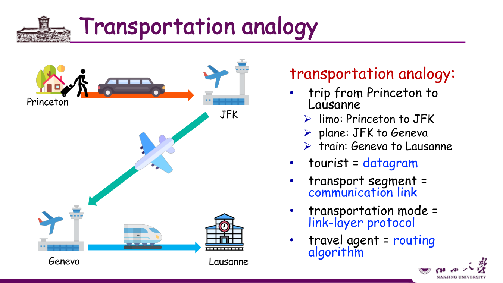

## 2. 链路层服务与实现

### 2.1 Framing 和 Link Access

链路层最基本的服务是 framing。

发送方链路层：

- 接收网络层 datagram。
- 加入链路层 header 和 trailer。
- 形成 frame。

如果链路是共享介质，还需要 link access：

- 决定什么时候可以发送。
- 避免或处理多个节点同时发送造成的冲突。

Frame 首部中通常有 MAC 地址：

- 源 MAC 地址。
- 目的 MAC 地址。

注意：MAC 地址和 IP 地址不同。MAC 地址用于本地链路上的接口识别，IP 地址用于网络层转发。

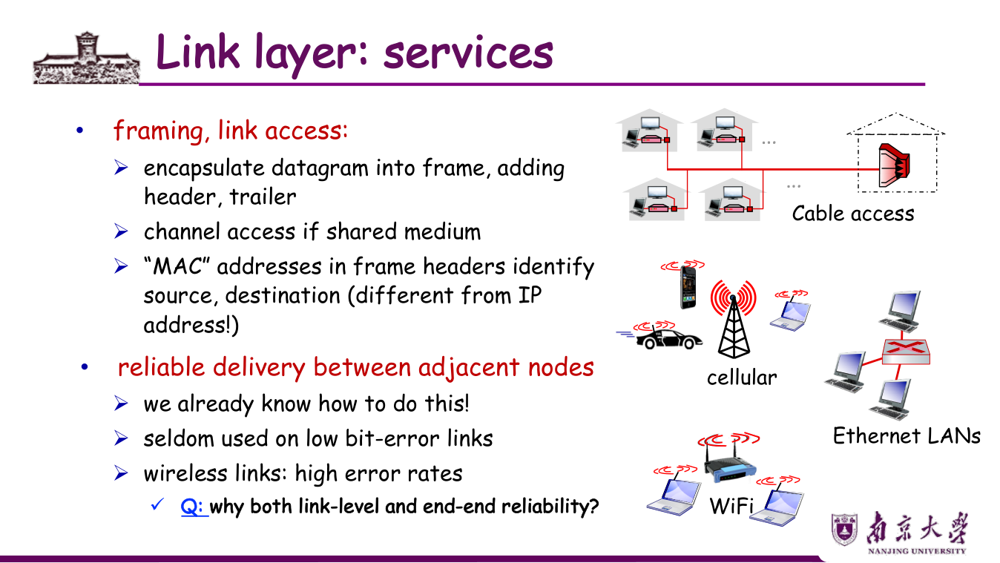

### 2.2 可靠交付

链路层可以在相邻节点之间提供可靠交付。

这和运输层可靠传输思想类似：

- ACK。
- 重传。
- 序号。
- 差错检测。

但并不是所有链路层都提供可靠交付。

在低误码率链路上，如光纤和有线 Ethernet，链路层可靠交付通常很少使用，因为：

- 链路错误少。
- 端到端 TCP 已经能恢复丢失。
- 每跳可靠机制会增加开销。

在无线链路上，误码率较高，链路层可靠交付更常见。

为什么同时需要链路层和端到端可靠性？

- 链路层重传可以快速修复本地无线错误，减少端到端重传代价。
- 端到端可靠性仍然需要，因为分组可能在其他链路或队列中丢失。

### 2.3 其他链路层服务

链路层还可能提供：

- Flow control：相邻发送节点和接收节点之间的速率协调。
- Error detection：接收方检测 bit 错误，发现后丢弃或请求重传。
- Error correction：接收方不仅检测错误，还能纠正某些 bit 错误。
- Half-duplex：两端都能发送，但不能同时发送。
- Full-duplex：两端可以同时发送。

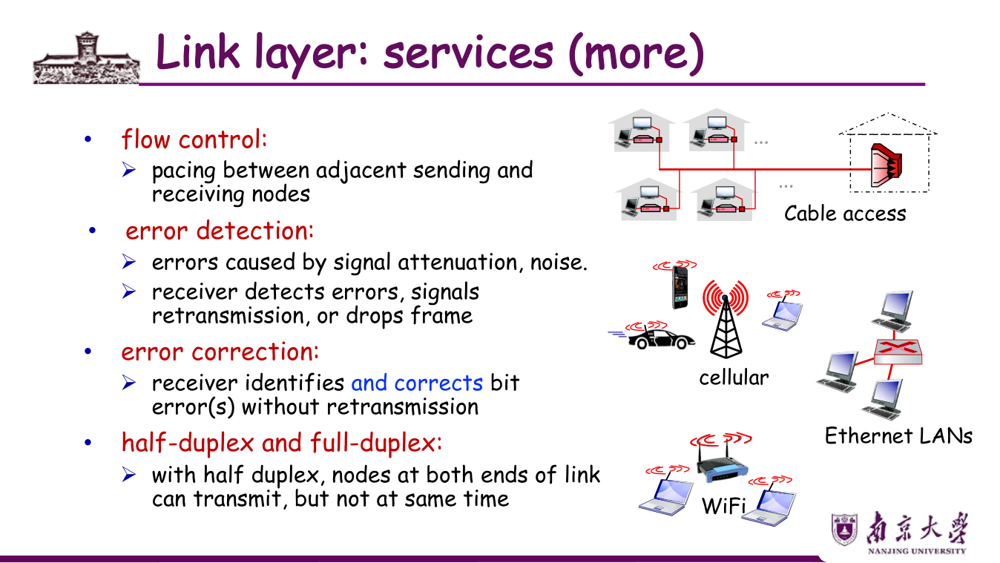

### 2.4 主机中的链路层实现

链路层通常在网络接口卡 NIC 中实现。

NIC 实现：

- 链路层。
- 物理层。

它通过主机总线连接 CPU 和内存，例如 PCI。

链路层实现是硬件、软件和 firmware 的组合：

- 高速收发和 CRC 等常由硬件完成。
- 驱动程序和操作系统负责配置、缓冲、上交分组。
- NIC firmware 可能执行部分控制逻辑。

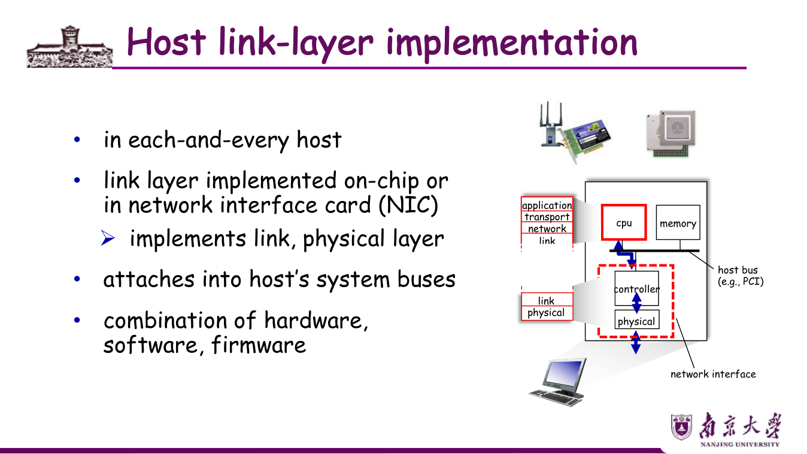

### 2.5 发送接口与接收接口

发送侧：

- 网络层把 datagram 交给链路层。
- 链路层封装成 frame。
- 添加差错检测 bits。
- 根据链路协议执行链路访问、可靠交付、流量控制等。

接收侧：

- 从物理层收到 bits。
- 识别 frame。
- 检查差错。
- 进行可靠交付和流量控制相关处理。
- 取出 datagram，上交网络层。

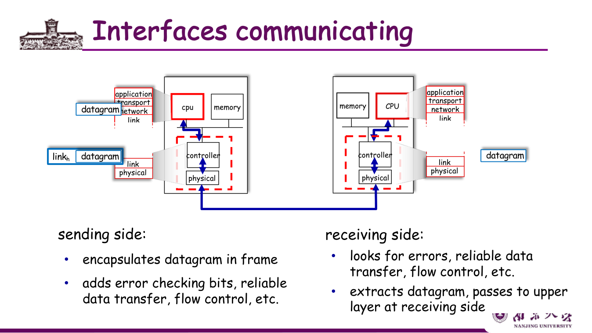

## 3. 差错检测与纠正

### 3.1 Error Detection 基本模型

发送方有数据 `D`，为了检测错误，会额外生成 EDC：

```text
D + EDC
```

EDC 是 error detection and correction bits，也就是冗余信息。

接收方收到：

```text
D' + EDC'
```

然后检查是否满足编码规则：

- 如果检查失败，说明检测到错误。
- 如果检查通过，通常认为没有错误。

但差错检测不是 100% 可靠的。

某些错误模式可能刚好没有被检测出来。一般来说，EDC 越长，检测和纠错能力越强。

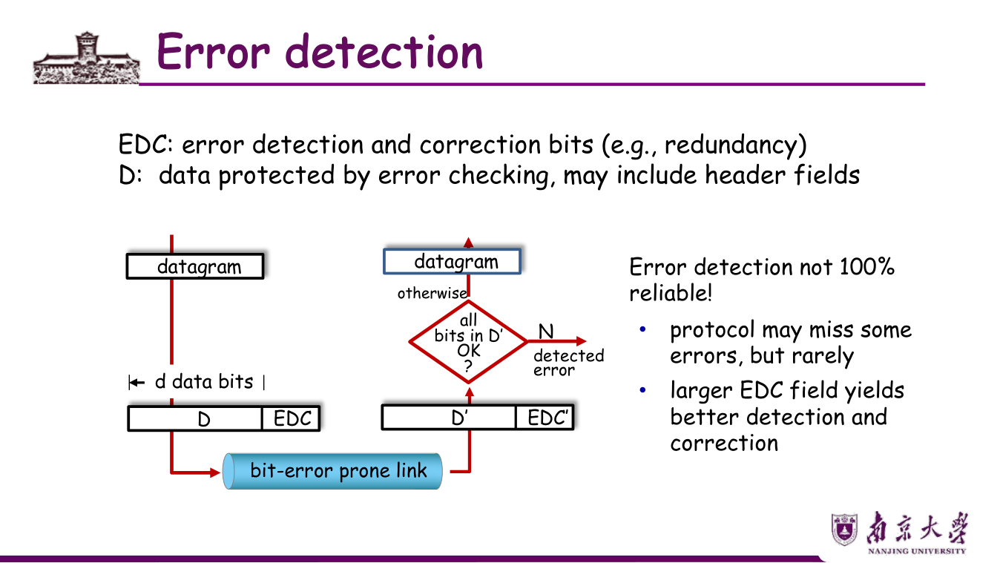

### 3.2 单 bit 奇偶校验

Parity checking 是最简单的差错检测方法。

发送方添加一个 parity bit，使整个比特串中 1 的个数满足要求：

- Even parity：1 的个数为偶数。
- Odd parity：1 的个数为奇数。

接收方重新计算 parity：

- 如果和收到的 parity bit 不一致，检测到错误。
- 如果一致，认为没有错误。

单 bit 奇偶校验能检测单 bit 错误。

缺点：

- 如果有偶数个 bit 同时翻转，可能检测不出来。

### 3.3 二维奇偶校验

二维奇偶校验把数据排成矩阵。

它为每一行和每一列分别计算 parity。

如果只有一个 bit 错：

- 该 bit 所在行 parity 出错。
- 该 bit 所在列 parity 出错。
- 行和列交点就是错误位置。

因此二维奇偶校验可以检测并纠正单 bit 错误。

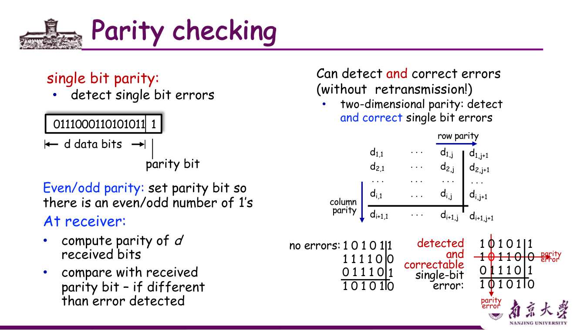

### 3.4 Internet Checksum 回顾

Internet checksum 在运输层已经见过。

发送方：

- 把 UDP segment 内容看成 16-bit 整数序列。
- 计算这些 16-bit 整数的一补和。
- 把 checksum 值放入 UDP checksum 字段。

接收方：

- 对收到的 segment 重新计算 checksum。
- 如果计算结果和 checksum 字段不一致，检测到错误。
- 如果一致，认为没有检测到错误，但仍可能有未检测出的错误。

Checksum 简单、软件实现方便，但检测能力弱于 CRC。

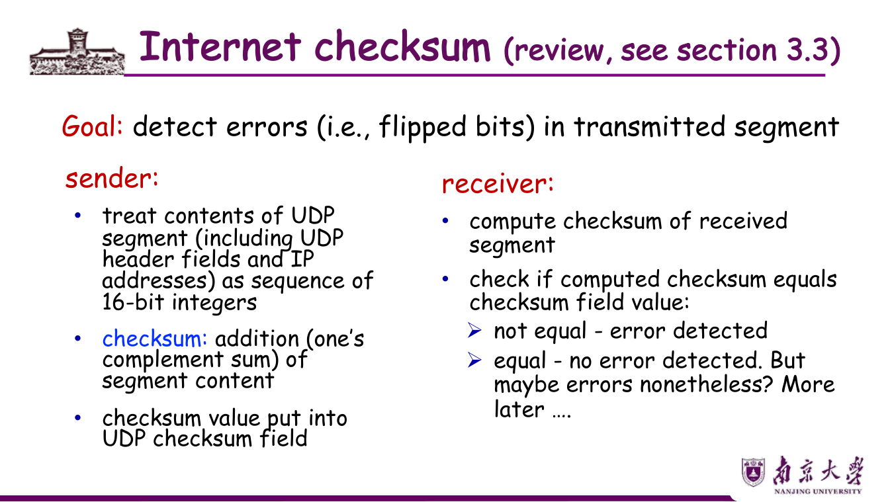

### 3.5 CRC 基本思想

CRC，Cyclic Redundancy Check，是实践中广泛使用的强差错检测编码。

发送方和接收方约定一个生成多项式对应的 bit pattern：

```text
G
```

如果 `G` 有 `r+1` bit，则 CRC 字段 `R` 有 `r` bit。

发送方要计算 `R`，使得：

```text
<D, R>
```

能被 `G` 在模 2 运算下整除。

接收方用同一个 `G` 除收到的 `<D, R>`：

- 余数非 0：检测到错误。
- 余数为 0：没有检测到错误。

CRC 可以检测所有长度小于 `r+1` bit 的突发错误，广泛用于 Ethernet 和 802.11 WiFi。

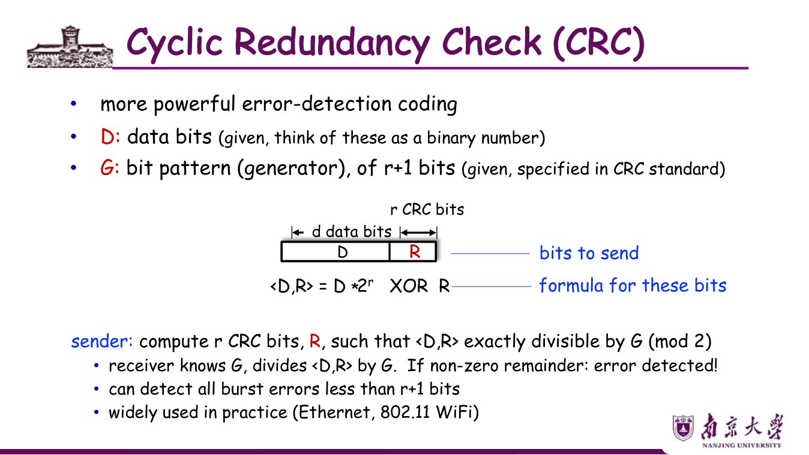

### 3.6 CRC 计算

为了计算 CRC，发送方把数据 `D` 左移 `r` 位：

```text
D * 2^r
```

然后用 `G` 做模 2 除法，得到余数：

```text
R = remainder[(D * 2^r) / G]
```

发送：

```text
D followed by R
```

模 2 运算中，加法和减法都等价于 XOR。

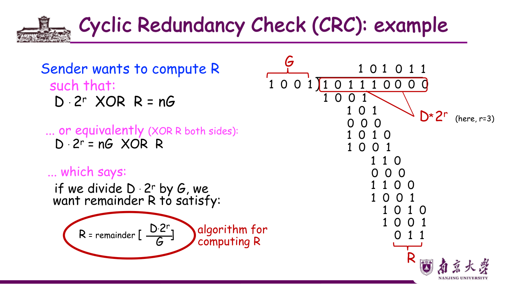

## 4. 多路访问协议

### 4.1 两类链路

链路可以分成两类：

#### Point-to-point link

点到点链路只有两个端点。

例子：

- 主机到 Ethernet switch 的链路。
- 早期拨号接入中的 PPP。

#### Broadcast link

广播链路由多个节点共享同一个传输介质。

例子：

- 早期总线 Ethernet。
- Cable 接入网络的上行 HFC。
- 802.11 无线 LAN。
- 4G/5G 无线、卫星链路。

共享介质中，多个节点同时发送会互相干扰，产生 collision。

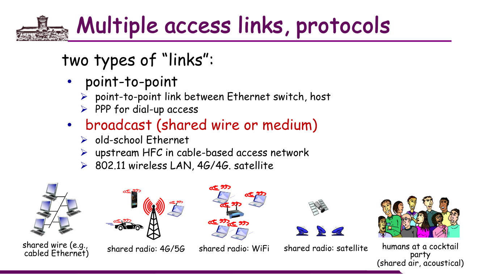

### 4.2 Multiple Access Protocol

Multiple access protocol 要解决：

```text
多个节点如何共享一个广播信道？
```

关键难点：

- 同一个信道上多个节点可能同时发送。
- 同时发送会发生 collision。
- 协调信息也必须通过这个共享信道发送。
- 没有额外的 out-of-band channel 可用于协调。

因此 MAC 协议本质上是一个分布式算法，决定节点何时可以发送。

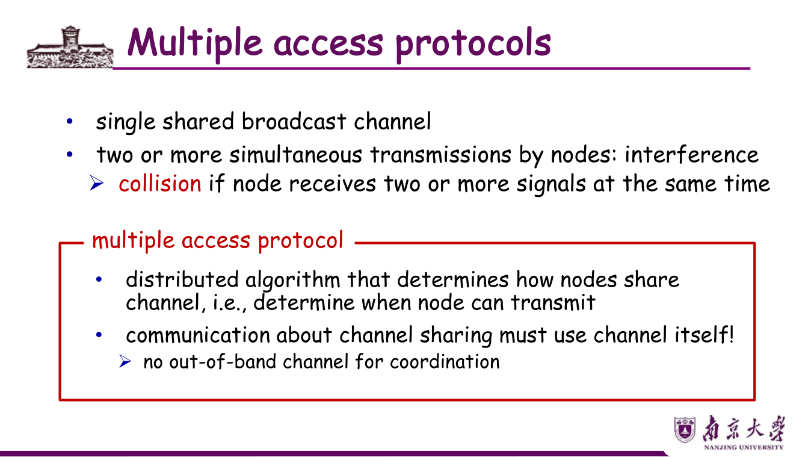

### 4.3 理想 MAC 协议

假设共享信道速率为 `R bps`。

理想 MAC 协议希望满足：

1. 只有一个节点要发送时，它能以 `R` 速率发送。
2. 有 `M` 个节点要发送时，每个节点平均获得 `R/M`。
3. 完全分布式，没有特殊协调节点。
4. 不需要时钟或时隙同步。
5. 简单。

现实协议通常只能在这些目标之间折中。

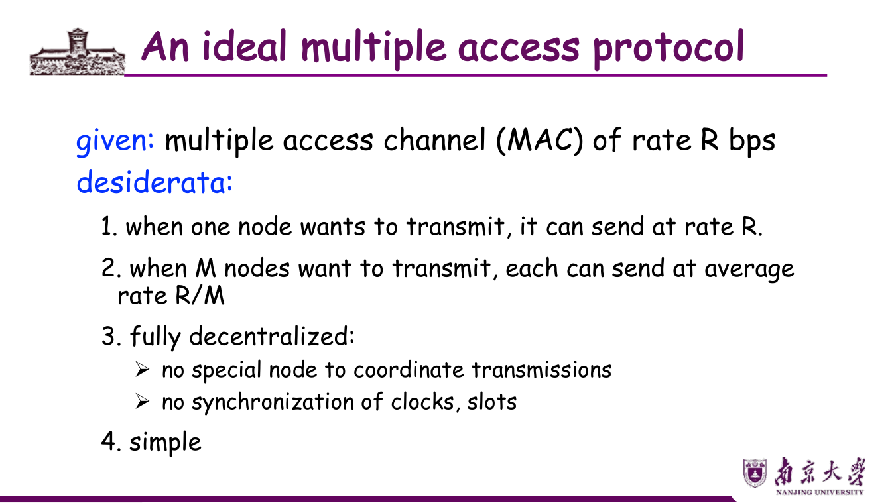

### 4.4 MAC 协议分类

MAC 协议大致分为三类：

#### Channel Partitioning

把信道切成小片：

- 时间片。
- 频率带。
- 码字。

每个节点独占某些片段。

#### Random Access

不预先划分信道。

节点有数据就尝试发送，允许 collision，再用随机延迟等机制恢复。

#### Taking Turns

节点轮流发送。

有更多数据的节点可以获得更长 turn，试图兼顾高负载公平和低负载效率。

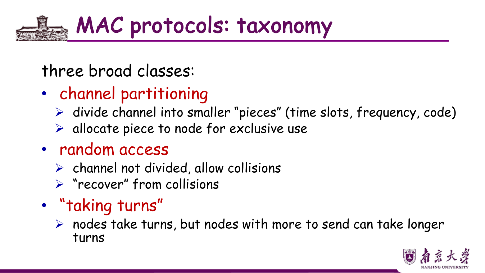

## 5. 信道划分协议

### 5.1 TDMA

TDMA，Time Division Multiple Access。

基本思想：

- 信道访问按 round 组织。
- 每个 round 划分为固定长度 slot。
- 每个站点在每轮获得一个固定 slot。
- slot 长度通常等于发送一个 packet 的时间。

优点：

- 不发生碰撞。
- 高负载下公平。

缺点：

- 如果某个节点没有数据，它的 slot 会空闲浪费。
- 只有一个节点活跃时，也只能用自己的 slot，无法用满信道。

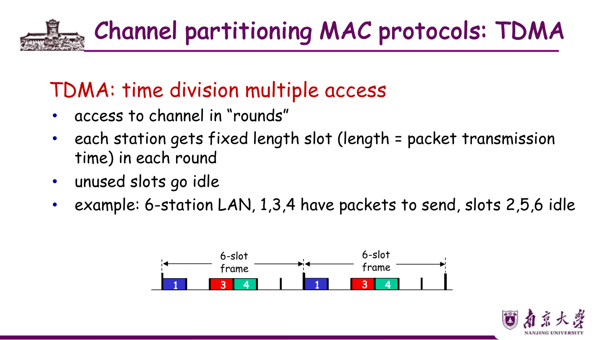

### 5.2 FDMA

FDMA，Frequency Division Multiple Access。

基本思想：

- 把信道频谱划分成多个频带。
- 每个站点分配一个固定频带。
- 各站点可以同时发送，但使用不同频率。

优点：

- 不同节点之间互不碰撞。

缺点：

- 没有数据的站点会浪费自己的频带。
- 单个活跃站点无法使用其他空闲频带。

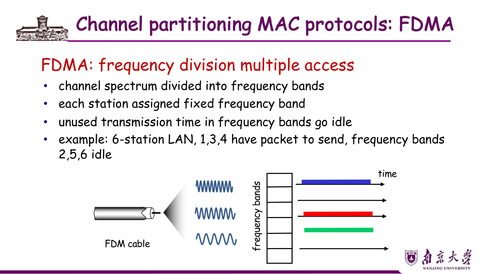

## 6. 随机访问协议

### 6.1 Random Access 基本思想

随机访问协议中：

- 节点有 frame 要发送时，以完整信道速率 `R` 发送。
- 节点之间没有预先协调。
- 两个或更多节点同时发送会 collision。
- 协议规定如何检测 collision，以及如何延迟重传。

典型协议：

- ALOHA。
- Slotted ALOHA。
- CSMA。
- CSMA/CD。
- CSMA/CA。

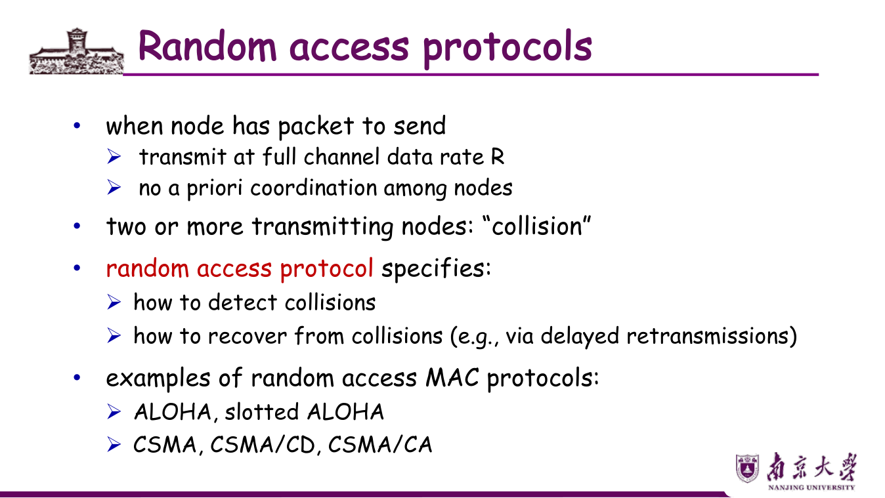

### 6.2 Slotted ALOHA 假设

Slotted ALOHA 的假设：

- 所有 frame 大小相同。
- 时间被划分为相等长度 slot。
- 每个 slot 长度等于发送一个 frame 的时间。
- 节点只能在 slot 开始时发送。
- 所有节点 slot 同步。
- 如果同一个 slot 中有两个或更多节点发送，所有节点都能检测到 collision。

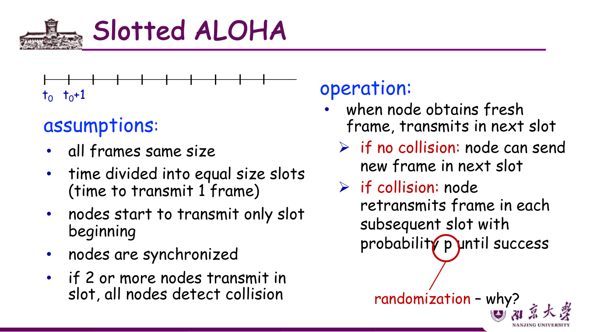

### 6.3 Slotted ALOHA 工作过程

当节点获得新 frame：

- 在下一个 slot 开始时发送。
- 如果没有 collision，发送成功。
- 如果 collision，之后每个 slot 以概率 `p` 重传，直到成功。

随机化的作用是避免碰撞节点永远在同一时刻重传。

优点：

- 单个活跃节点可以连续以信道全速发送。
- 高度分布式，只需要 slot 同步。
- 简单。

缺点：

- collision 会浪费 slot。
- 空 slot 也浪费。
- 需要时钟同步。
- 节点可能能在 frame 发送完前就检测到 collision，但 slotted ALOHA 仍浪费整个 slot。

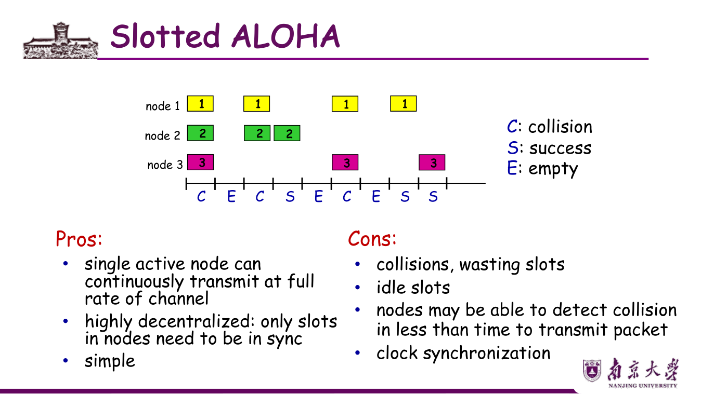

### 6.4 Slotted ALOHA 效率

假设：

- 有 `N` 个节点。
- 每个节点总有 frame 要发送。
- 每个节点在某 slot 以概率 `p` 发送。

某个给定节点成功的概率：

```text
p(1-p)^(N-1)
```

任意一个节点成功的概率：

```text
Np(1-p)^(N-1)
```

选择最优 `p` 并令 `N` 很大，最大效率趋近于：

```text
1/e ≈ 0.37
```

也就是说，即使最优情况下，信道也只有约 37% 的时间用于成功传输。

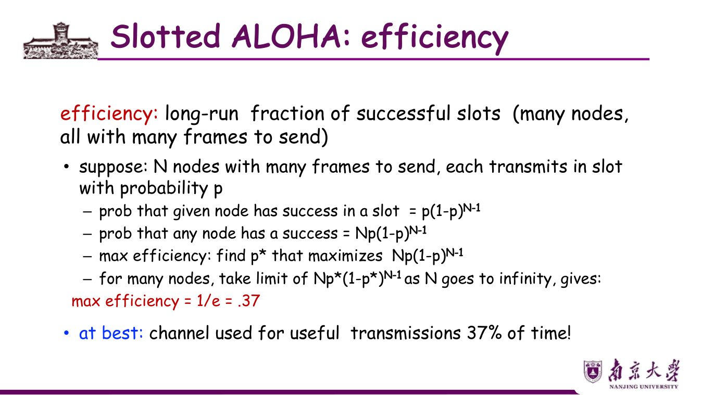

### 6.5 CSMA

CSMA，Carrier Sense Multiple Access。

基本思想：

```text
listen before transmit
```

节点发送前先监听信道：

- 如果信道空闲，发送整个 frame。
- 如果信道忙，推迟发送。

类比人类交流：不要打断别人讲话。

CSMA/CD 是带 collision detection 的 CSMA：

- 发送时继续监听。
- 如果检测到 collision，尽快中止发送。
- 减少碰撞浪费。

Collision detection 在有线链路中较容易，在无线中较困难。

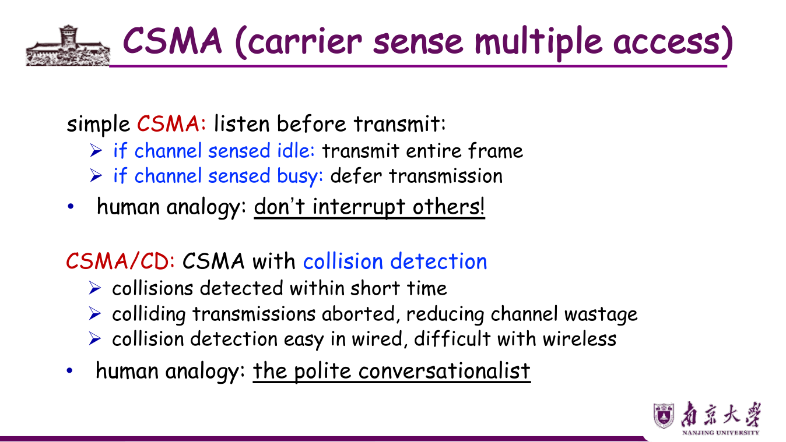

### 6.6 CSMA 为什么仍会碰撞

即使发送前监听，CSMA 仍可能 collision。

原因是 propagation delay。

例子：

- 节点 A 刚开始发送。
- 信号传播到节点 B 需要时间。
- 在 B 听到 A 的信号前，B 也可能认为信道空闲并开始发送。
- 两个信号在链路中相遇，产生 collision。

传播时延越大、节点距离越远，collision 概率越高。

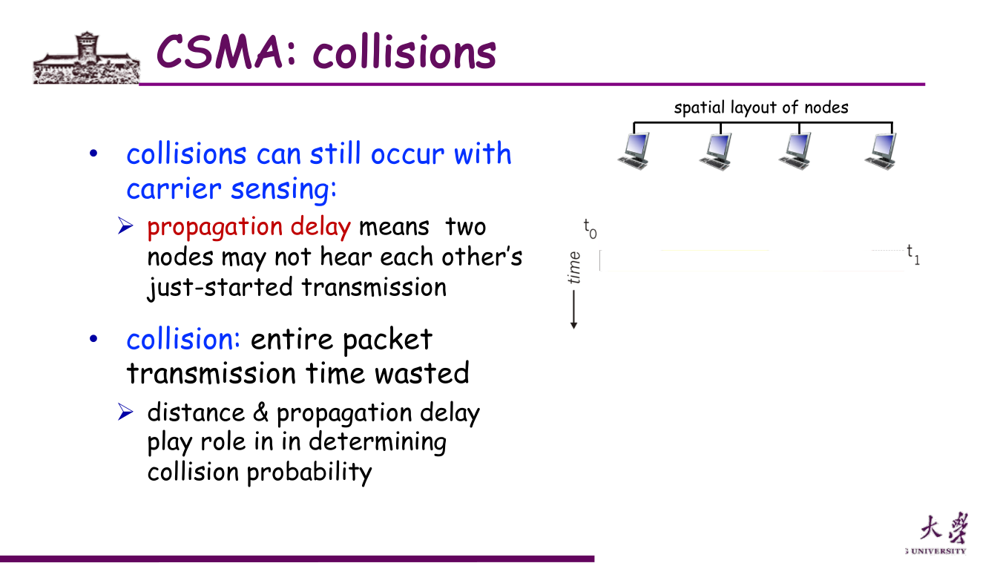

### 6.7 CSMA/CD

CSMA/CD 通过 collision detection 减少浪费。

如果发送节点检测到 collision：

- 立刻停止传输。
- 发送 jam signal。
- 执行 backoff。
- 之后再尝试发送。

这样不会把整个 frame 的发送时间都浪费掉。

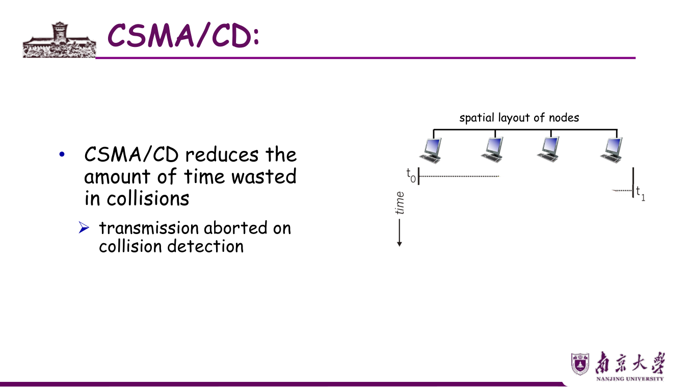

### 6.8 Ethernet CSMA/CD 算法

Ethernet CSMA/CD 步骤：

1. Ethernet 从网络层收到 datagram，创建 frame。
2. 监听信道。
3. 如果信道空闲，开始发送；如果忙，等到空闲再发送。
4. 如果整个 frame 发送完都没有 collision，则完成。
5. 如果发送过程中检测到其他传输，则 abort 并发送 jam signal。
6. 进入 binary exponential backoff。

第 `m` 次 collision 后，随机选择：

```text
K ∈ {0, 1, 2, ..., 2^m - 1}
```

然后等待：

```text
K * 512 bit times
```

再回到监听步骤。

碰撞越多，backoff 范围越大，从而降低再次碰撞概率。

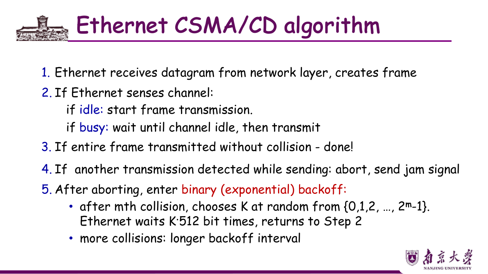

## 7. Taking Turns 协议

### 7.1 为什么需要 Taking Turns

Channel partitioning：

- 高负载下效率和公平性好。
- 低负载下低效，因为即使只有一个活跃节点，也只能用自己那份资源。

Random access：

- 低负载下效率高，单个节点可用满信道。
- 高负载下 collision 开销大。

Taking turns 试图兼顾两者。

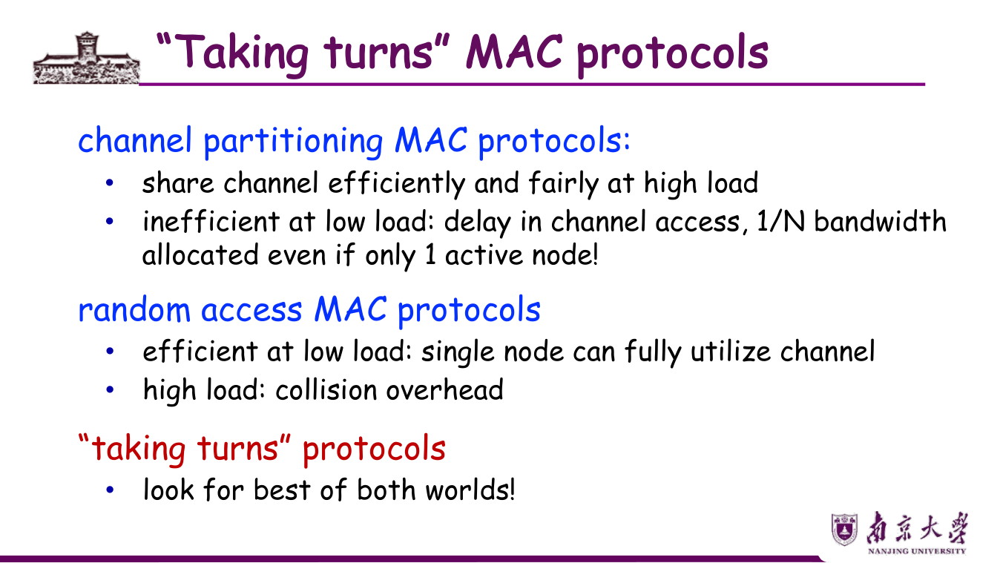

### 7.2 Polling

Polling 使用一个集中 controller。

过程：

- controller 按顺序邀请节点发送。
- 被轮询节点如果有数据，就发送。
- 然后 controller 轮询下一个节点。

优点：

- 避免 collision。
- 可以控制发送顺序。

问题：

- polling overhead。
- 等待轮询会带来 latency。
- controller 是 single point of failure。

Bluetooth 使用 polling 思想。

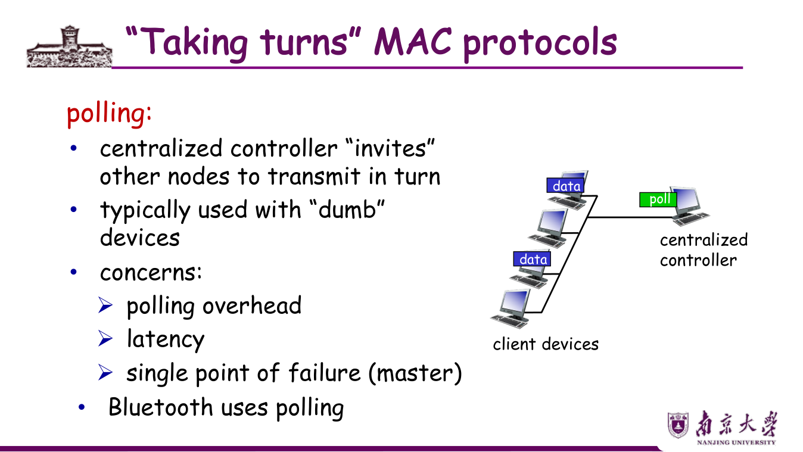

### 7.3 Token Passing

Token passing 中，一个控制 token 在节点之间传递。

规则：

- 只有持有 token 的节点可以发送。
- 发送完或没有数据时，把 token 传给下一个节点。

问题：

- token overhead。
- token 传递 latency。
- token 丢失或故障会影响全网。

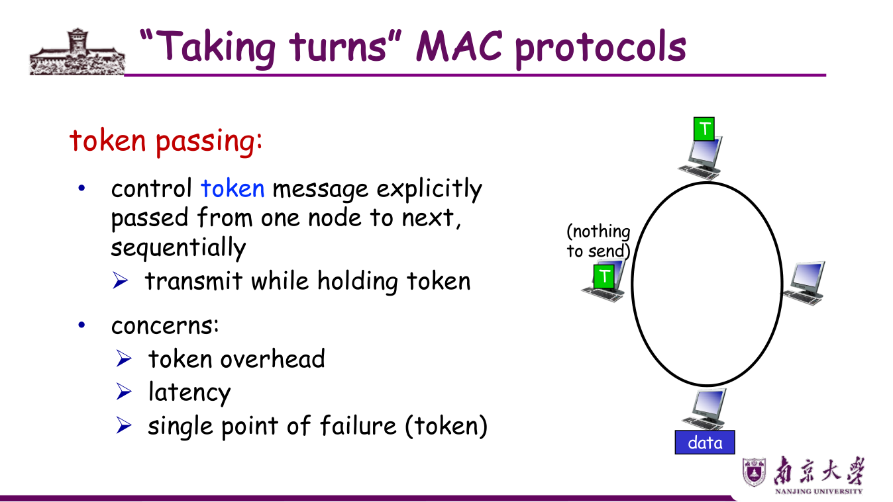

## 8. Cable Access 与 MAC 小结

### 8.1 Cable Access Network

Cable access network 同时使用 FDM、TDM 和随机访问。

组件：

- cable headend。
- CMTS，cable modem termination system。
- cable modem。
- splitter。

Downstream：

- Internet frames、TV channels、control 信息在不同频率上传输。
- 通常是从 CMTS 到用户的广播方向。
- 可有多个 FDM downstream channel。

Upstream：

- 多个用户共享上行信道。
- 一些上行 time slots 被分配。
- 一些 slot 用于 contention，用户随机访问请求资源。

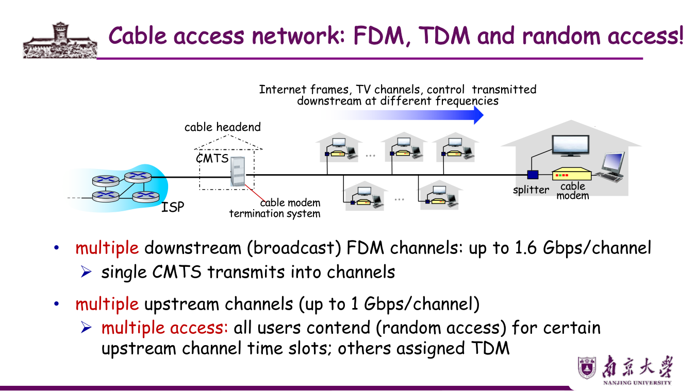

### 8.2 DOCSIS

DOCSIS，Data Over Cable Service Interface Specification。

特点：

- 上行和下行使用不同频率信道。
- 上行采用 TDM。
- 一些 minislots 被分配给特定 cable modem。
- 一些 minislots 用于发送请求，使用随机访问和 binary backoff。
- downstream MAP frame 告诉 modem 上行 slot 如何分配。

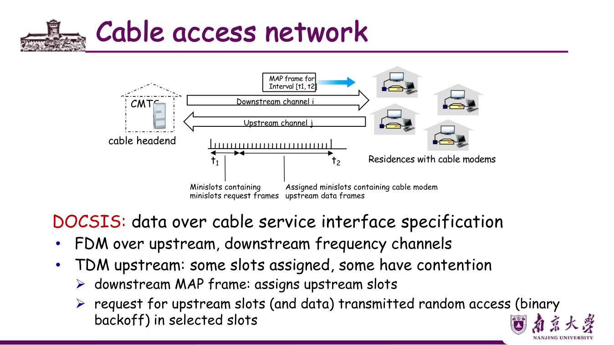

### 8.3 MAC 协议总结

MAC 协议三类：

- Channel partitioning：TDMA、FDMA、CDMA。
- Random access：ALOHA、Slotted ALOHA、CSMA、CSMA/CD、CSMA/CA。
- Taking turns：polling、token passing。

一些实现对应：

- Ethernet 使用 CSMA/CD。
- 802.11 使用 CSMA/CA。
- Bluetooth 使用 polling。
- Token ring 和 FDDI 使用 token passing。

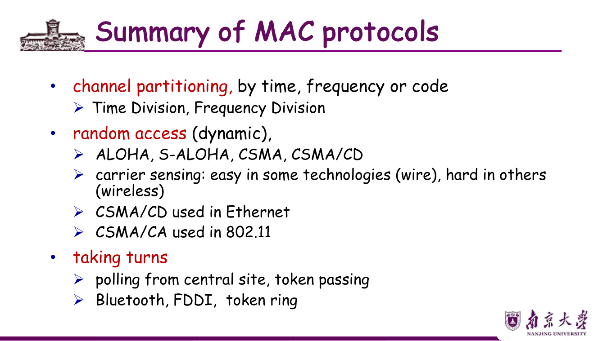

## 9. MAC 地址与 ARP

### 9.1 MAC 地址和 IP 地址

IP 地址：

- 32-bit IPv4 地址。
- 网络层地址。
- 用于 layer 3 转发。
- 体现所在 IP 子网。

MAC 地址：

- 通常是 48-bit。
- 也叫 LAN 地址、physical address、Ethernet address。
- 用于本地链路内，把 frame 从一个接口送到另一个物理相连的接口。
- 常以十六进制写出，例如：

```text
1A-2F-BB-76-09-AD
```

每个十六进制数字代表 4 bit。

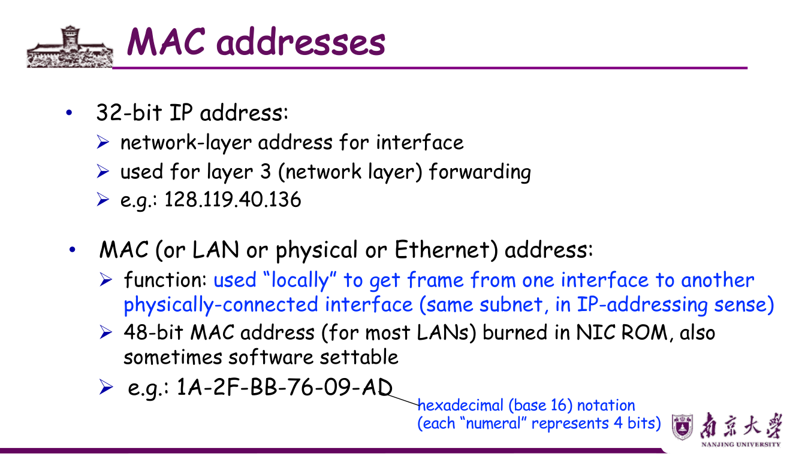

### 9.2 同一 LAN 中的地址

同一 LAN 中，每个接口同时有：

- 一个唯一的 48-bit MAC 地址。
- 一个本地 IP 子网内的 IP 地址。

MAC 地址用于同一链路上的 frame 交付。

IP 地址用于网络层路径选择。

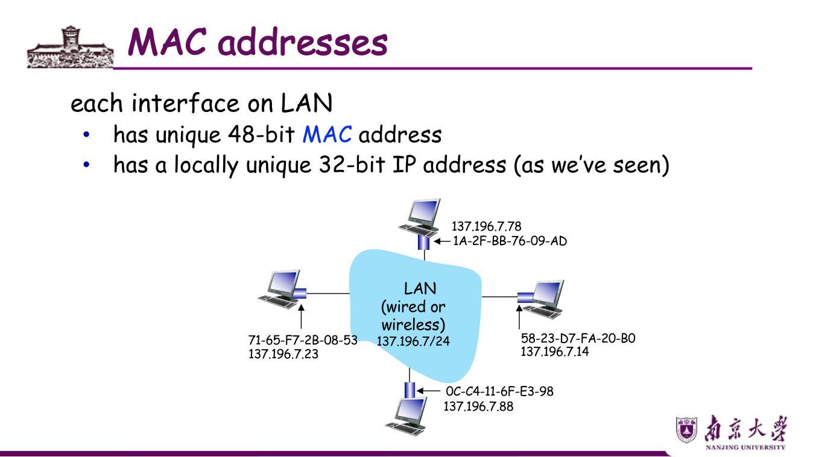

### 9.3 MAC 地址的分配与可移植性

MAC 地址由 IEEE 管理。

厂商购买 MAC 地址空间的一部分，保证全球唯一性。

类比：

- MAC 地址像身份证号，跟接口硬件绑定，移动到另一个 LAN 仍可保持。
- IP 地址像邮政地址，取决于当前连接到哪个网络。

因此：

- MAC 是 flat address，便于接口移动。
- IP 是 hierarchical address，便于路由聚合和转发。

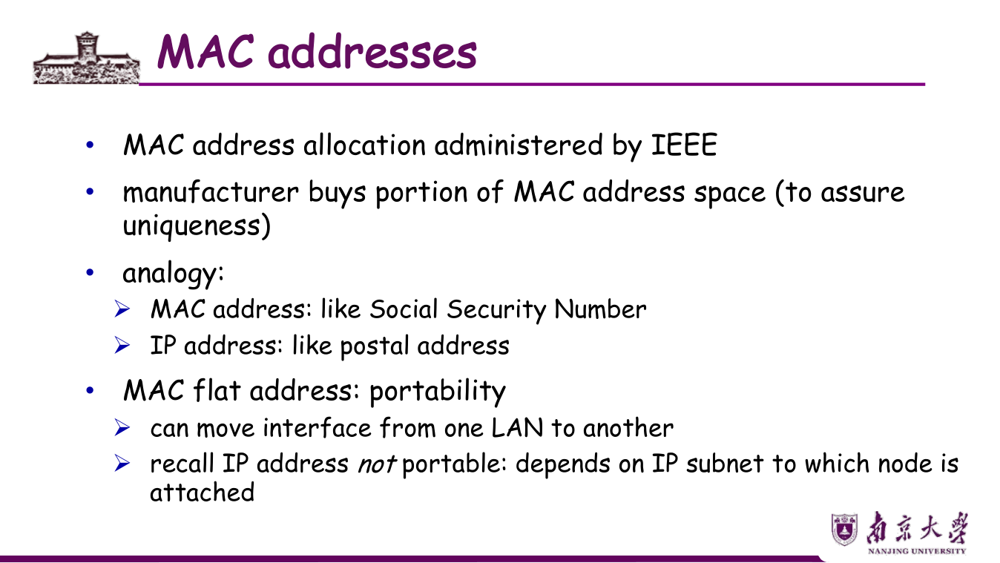

### 9.4 ARP 要解决的问题

ARP，Address Resolution Protocol。

问题：

```text
已知同一 LAN 中某接口的 IP 地址，如何得到它的 MAC 地址？
```

每个 IP 节点，包括主机和路由器，在 LAN 上维护 ARP table。

ARP 表项：

```text
<IP address, MAC address, TTL>
```

TTL 表示该映射多久后过期，典型值约 20 分钟。

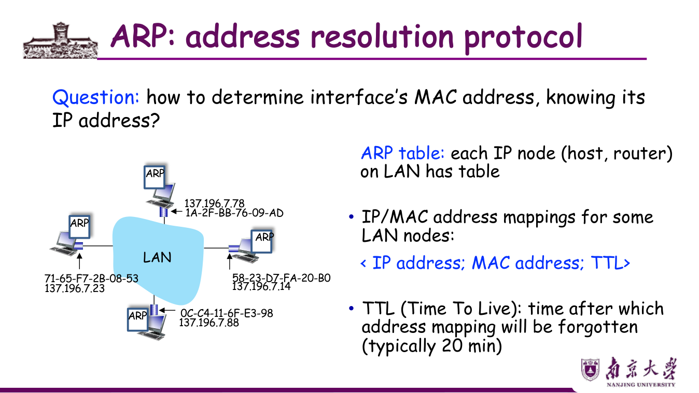

### 9.5 ARP 查询

假设 A 要给同一 LAN 中的 B 发送 datagram，但 A 的 ARP 表中没有 B 的 MAC 地址。

A 会广播 ARP query：

- Ethernet 目的 MAC 地址为：

```text
FF-FF-FF-FF-FF-FF
```

- ARP query 中包含 B 的 IP 地址。
- LAN 上所有节点都会收到该 query。

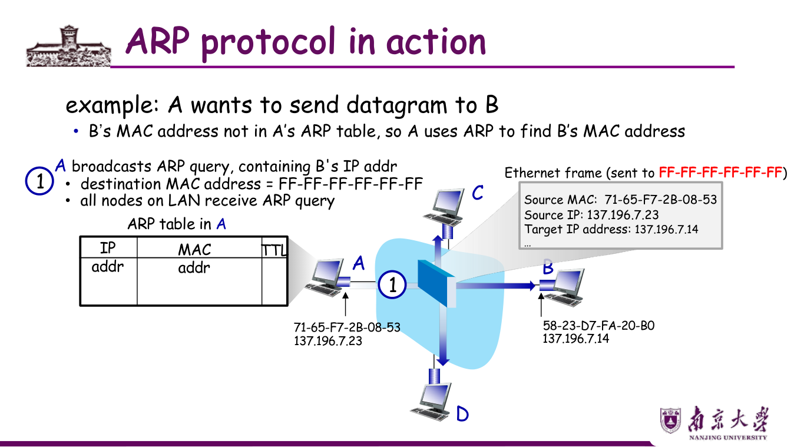

### 9.6 ARP 响应

B 收到 ARP query 后发现 target IP 是自己，于是回复 A：

- ARP reply 中包含 B 的 MAC 地址。
- ARP reply 通常单播给 A。

A 收到后，把映射加入本地 ARP table。

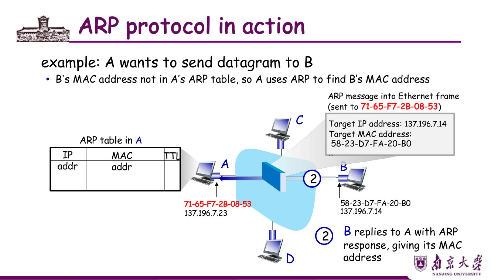

ARP 是 plug-and-play 的：

- 节点自动学习映射。
- 不需要网络管理员手动配置。

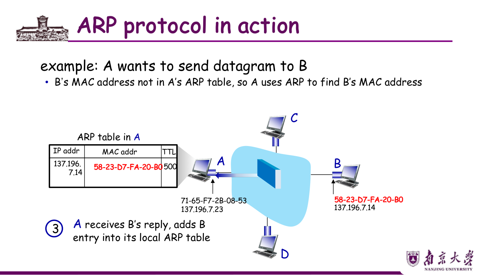

## 10. 跨子网通信中的寻址

### 10.1 场景

考虑主机 A 通过路由器 R 向另一个子网中的主机 B 发送 datagram。

假设：

- A 知道 B 的 IP 地址。
- A 知道第一跳路由器 R 的 IP 地址，通常来自 DHCP。
- A 知道 R 在本 LAN 接口的 MAC 地址，通常通过 ARP 获得。

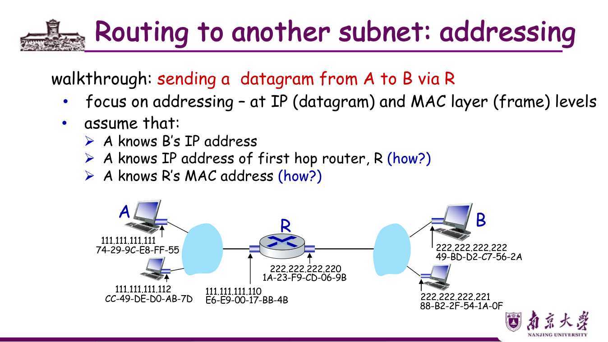

### 10.2 A 发给第一跳路由器

A 创建 IP datagram：

```text
IP src  = A 的 IP 地址
IP dest = B 的 IP 地址
```

然后 A 创建 Ethernet frame。

因为 B 不在本子网，A 不能直接把 frame 发给 B 的 MAC。

所以 frame 的目的 MAC 是 R 在 A 所在 LAN 上的接口 MAC：

```text
MAC src  = A 的 MAC 地址
MAC dest = R 左侧接口的 MAC 地址
```

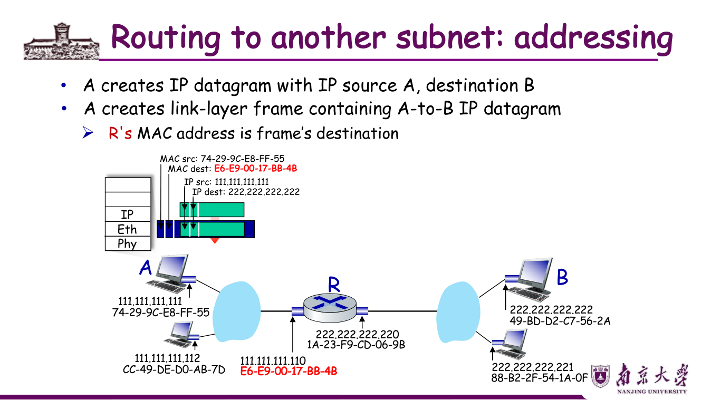

### 10.3 R 重新封装 frame

R 收到 frame 后：

- 检查目的 MAC 是自己。
- 从 frame 中取出 IP datagram。
- 根据 IP destination 查转发表。
- 确定输出接口在 B 所在子网。

R 再创建新的链路层 frame：

```text
IP src  = A 的 IP 地址
IP dest = B 的 IP 地址
MAC src  = R 右侧接口的 MAC 地址
MAC dest = B 的 MAC 地址
```

注意：

- IP 源和目的端到端不变。
- MAC 源和目的每一跳都会变。

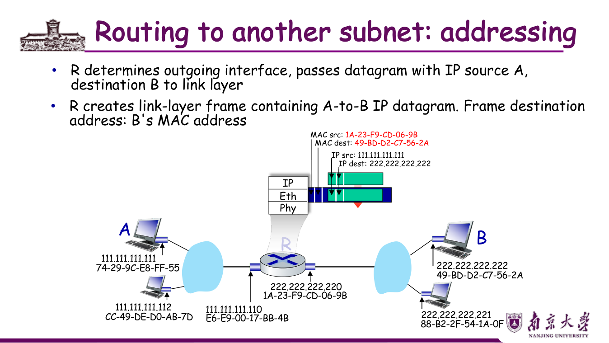

### 10.4 B 接收 datagram

B 收到 R 发来的 frame：

- 发现目的 MAC 是自己。
- 提取 IP datagram。
- 发现 IP destination 是自己。
- 上交给网络层，继续向运输层和应用层解封装。

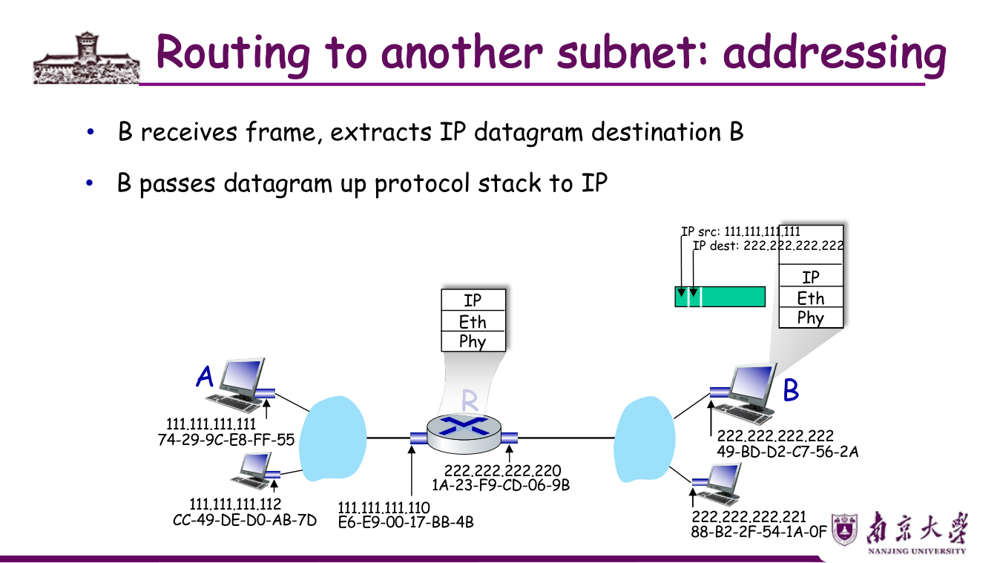

## 11. Ethernet

### 11.1 Ethernet 的地位

Ethernet 是主导性的有线 LAN 技术。

原因：

- 最早被广泛使用的 LAN 技术之一。
- 简单。
- 便宜。
- 速度持续演进，从 10 Mbps 到 400 Gbps。
- 单芯片可支持多种速率。

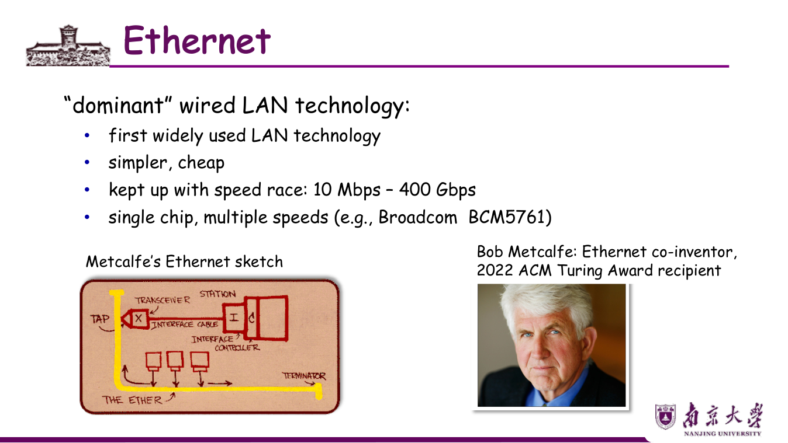

### 11.2 Ethernet 物理拓扑

早期 Ethernet 使用 bus 拓扑：

- 所有节点共享同一根同轴电缆。
- 所有节点在同一个 collision domain。
- 任意两个节点同时发送都可能 collision。

现代 Ethernet 使用 switched topology：

- 中心是主动链路层 switch。
- 每个主机到 switch 是独立链路。
- 每条 spoke 运行独立 Ethernet 协议。
- 节点之间通常不会互相碰撞。

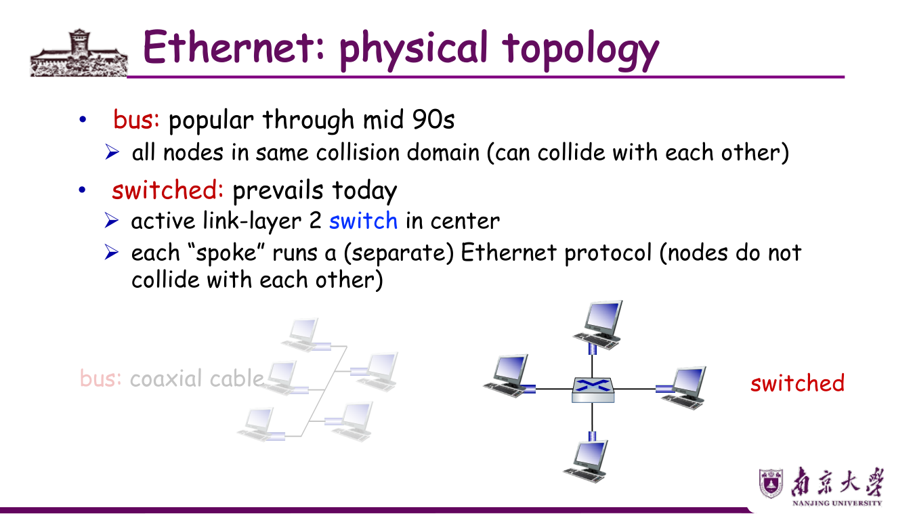

### 11.3 Ethernet Frame 结构

发送接口把 IP datagram 或其他网络层 packet 封装进 Ethernet frame。

典型字段：

- Preamble。
- Destination address。
- Source address。
- Type。
- Data payload。
- CRC。

Preamble：

- 7 bytes 的 `10101010`。
- 后接 1 byte 的 `10101011`。
- 用于同步接收方和发送方时钟。

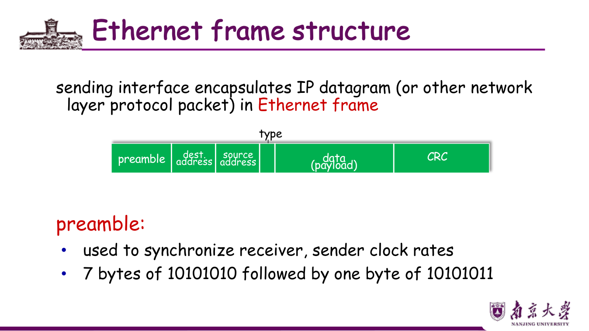

### 11.4 Ethernet Frame 字段

地址字段：

- 目的 MAC 地址：6 bytes。
- 源 MAC 地址：6 bytes。

如果 NIC 收到的 frame 满足以下条件之一，就把 payload 上交：

- 目的 MAC 与本接口 MAC 匹配。
- 目的 MAC 是广播地址。

否则丢弃该 frame。

Type 字段：

- 标识上层协议。
- 大多数是 IP，也可能是其他协议。
- 用于接收方 demultiplex。

CRC：

- 接收方检测差错。
- 如果检测到错误，直接丢弃 frame。

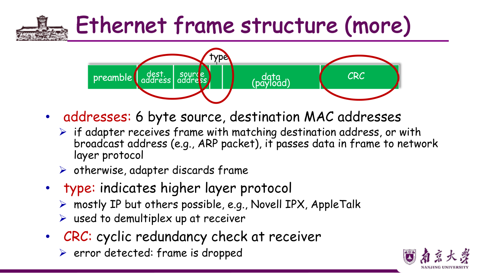

### 11.5 Ethernet 的服务模型

Ethernet 是 connectionless：

- 发送 NIC 和接收 NIC 之间没有握手。

Ethernet 是 unreliable：

- 接收 NIC 不给发送 NIC 发 ACK 或 NAK。
- 如果 frame 因 CRC 错误被丢弃，Ethernet 自身不恢复。
- 如果上层使用 TCP，则由 TCP 端到端恢复。
- 如果上层不用可靠机制，数据就丢失。

Ethernet MAC 协议：

- unslotted CSMA/CD。
- binary backoff。

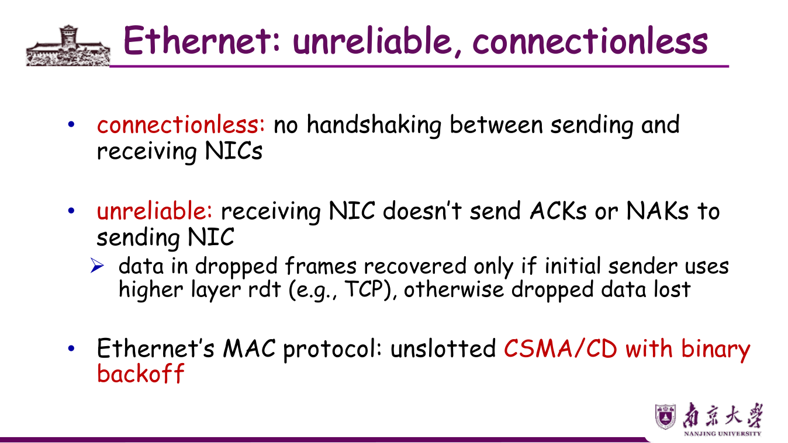

### 11.6 802.3 Ethernet 标准

Ethernet 有很多物理层标准：

- 铜缆。
- 光纤。
- 不同距离和速率。

它们共享：

- MAC protocol。
- frame format。

速率从早期 Mbps 级，发展到 1 Gbps、10 Gbps、40 Gbps、100 Gbps、400 Gbps 等。

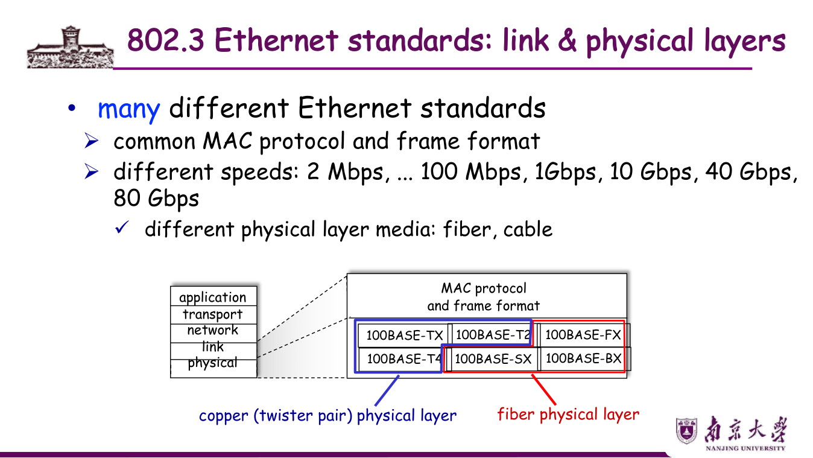

## 12. Ethernet Switch

### 12.1 Switch 是链路层设备

Switch 是主动链路层设备。

它会：

- 接收 Ethernet frame。
- 存储并转发 frame。
- 检查 frame 的目的 MAC 地址。
- 有选择地把 frame 转发到一个或多个输出链路。

Switch 对主机是透明的：

- 主机不需要知道 switch 存在。
- 主机仍按 Ethernet 方式发送 frame。

Switch 是 plug-and-play、self-learning：

- 通常不需要手动配置主机位置。

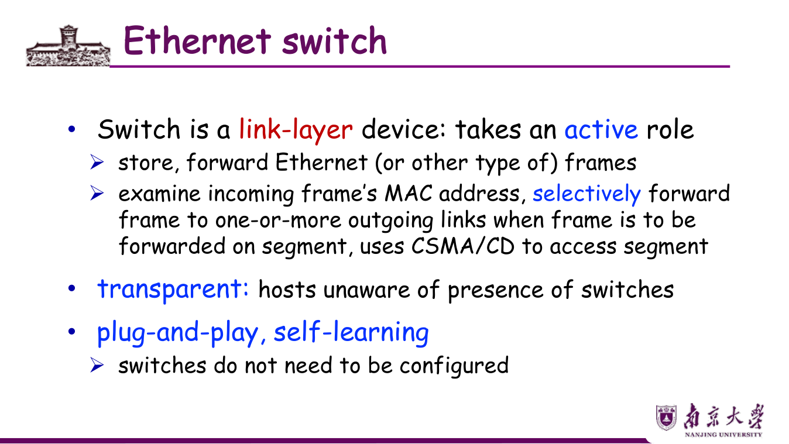

### 12.2 多个同时传输

现代 switch 中：

- 主机到 switch 是专用直连。
- switch 会缓冲 frame。
- 每条链路可全双工。
- 每条链路是自己的 collision domain。

因此：

- A 到 A' 可以发送。
- B 到 B' 可以同时发送。
- 两者不会 collision。

但如果 A 和 C 同时都要发给 A'，输出端口竞争仍然存在，switch 需要排队。

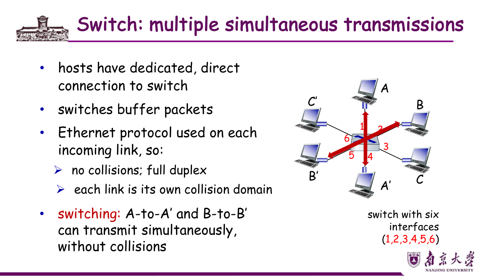

### 12.3 Switch Forwarding Table

Switch 需要知道：

```text
某个 MAC 地址在哪个接口方向？
```

Switch table 表项：

```text
(MAC address, interface, time stamp)
```

它看起来像路由表，但：

- 路由器表项由路由算法或配置产生，基于 IP 地址。
- Switch 表项由 self-learning 产生，基于 MAC 地址。

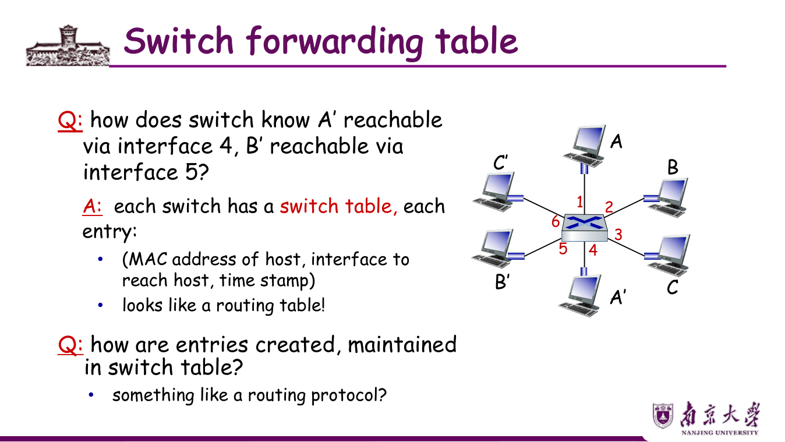

### 12.4 Self-learning

Switch 通过观察 frame 的源 MAC 地址学习。

当 switch 在接口 `i` 收到一个 frame：

- 读取 frame 的 source MAC。
- 记录：

```text
source MAC -> interface i
```

并加上时间戳。

这样以后如果要发给该 source MAC，switch 就知道该从接口 `i` 转发。

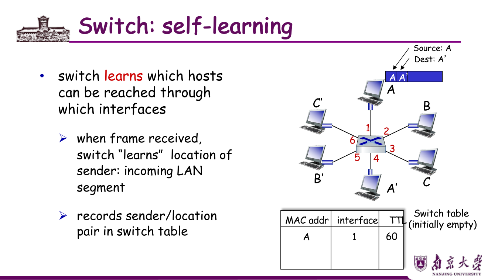

### 12.5 Filtering 和 Forwarding

当 switch 收到 frame：

1. 记录 incoming link 和 source MAC。
2. 用 destination MAC 查 switch table。
3. 如果找到表项：
   - 如果目的地就在 frame 到来的同一接口方向，drop。
   - 否则只转发到表项指定接口。
4. 如果没找到表项：
   - flood 到除 incoming interface 之外的所有接口。

Flooding 用于未知目的地址。

Filtering 用于避免把 frame 发回不需要的方向。

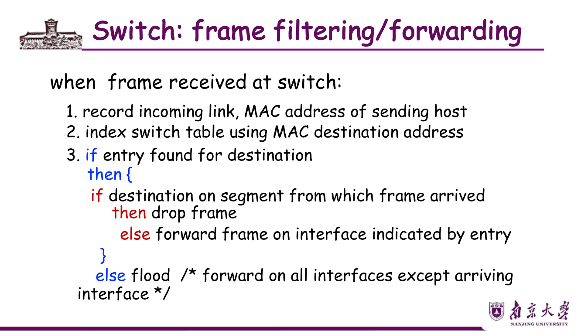

### 12.6 自学习例子

假设 switch table 初始为空。

A 发 frame 给 A'：

- switch 从 source MAC 学到 `A -> interface 1`。
- 目的 A' 未知，于是 flood。

A' 回复 A：

- switch 从 source MAC 学到 `A' -> interface 4`。
- 目的 A 已知，只转发到 interface 1。

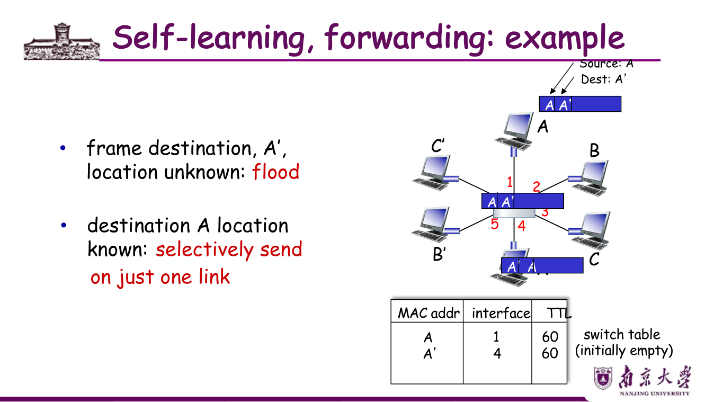

### 12.7 多交换机互联

Self-learning 也适用于多个 switch 互联。

例如 A 要发给 G：

- S1 如果不知道 G 在哪里，先 flood。
- frame 经过其他 switch。
- 每个 switch 都学习 source A 从哪个方向来。
- 当 G 回复 A 时，各 switch 再学习 G 的位置。

所以多交换机网络也可以通过同样机制逐步学习 MAC 位置。

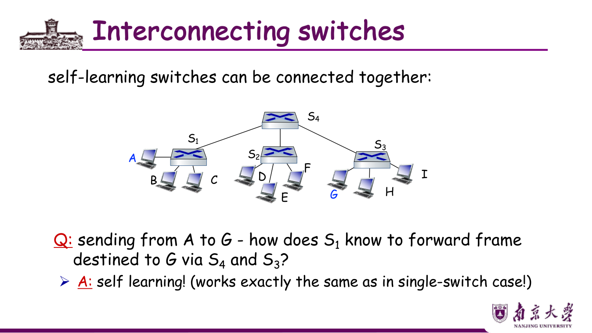

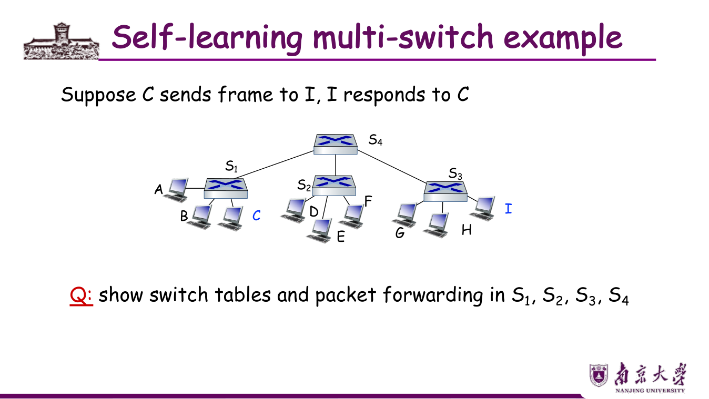

### 12.8 校园网络例子

大型校园网会组合多种技术：

- Ethernet layer-2 switching。
- intra-domain routing。
- inter-domain routing。
- WiFi controller。
- firewall。
- core、aggregation、building closets。

UMass 例子中有：

- 数千台 switches。
- 数千个 wireless access points。
- 大量有线和无线终端。

这说明实际网络是多层、多协议、多设备协作的系统。

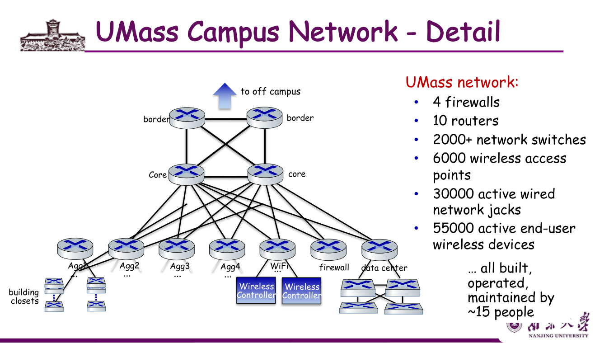

### 12.9 Switches vs Routers

Switch 和 router 都是 store-and-forward。

区别：

| 设备 | 层次 | 查看首部 | 地址 | 转发表来源 |
| --- | --- | --- | --- | --- |
| Switch | Link layer | Link-layer header | MAC address | flooding + self-learning |
| Router | Network layer | Network-layer header | IP address | routing algorithms |

Switch 转发 frame。

Router 转发 datagram。

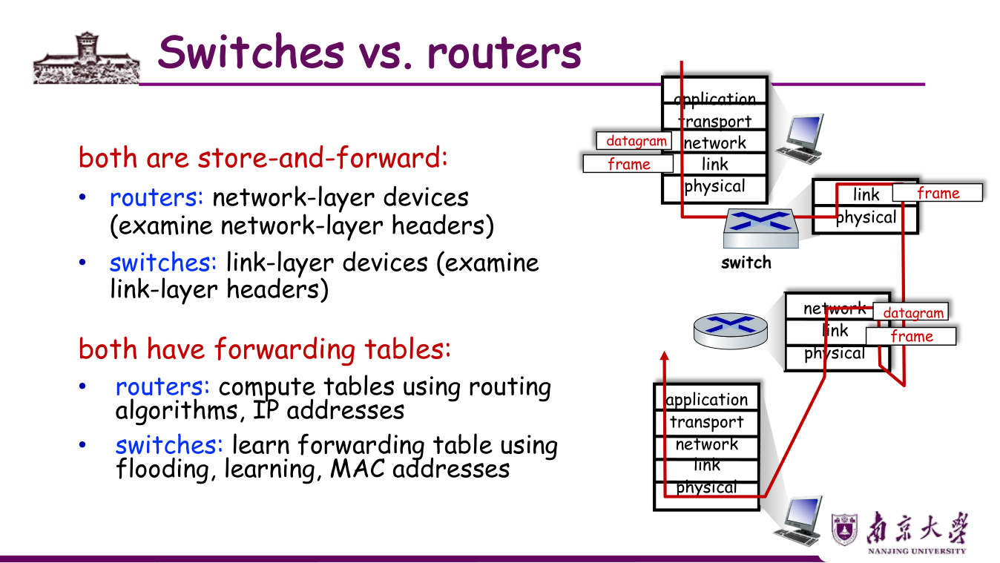

## 13. VLAN

### 13.1 VLAN 的动机

如果一个大型 LAN 是单一 broadcast domain，会有问题：

- ARP、DHCP、未知 MAC flooding 等广播流量会穿过整个 LAN。
- 广播规模大，效率低。
- 安全和隐私差。
- 用户移动位置后，逻辑组织关系和物理连接位置可能不一致。

例如 CS 用户搬到 EE 办公室，但仍希望逻辑上属于 CS 网络。

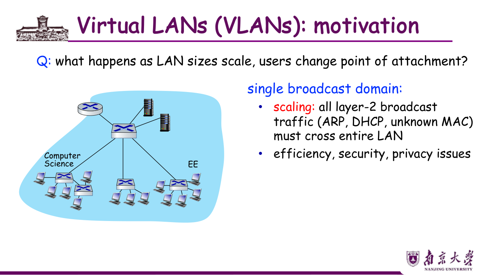

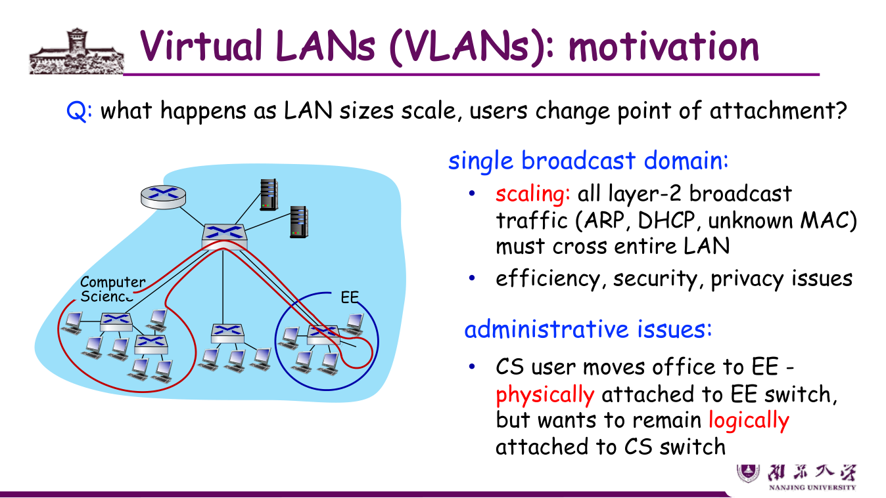

### 13.2 Port-based VLAN

VLAN，Virtual Local Area Network。

支持 VLAN 的 switch 可以在一套物理 LAN 基础设施上定义多个虚拟 LAN。

Port-based VLAN：

- 通过管理软件把 switch ports 分组。
- 每个组形成一个 VLAN。
- 单个物理 switch 像多个虚拟 switch。

例如：

- ports 1-8 属于 EE VLAN。
- ports 9-15 属于 CS VLAN。

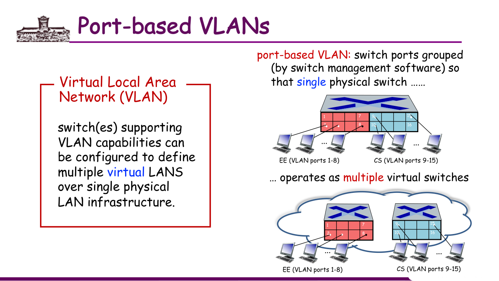

### 13.3 VLAN 隔离与路由

VLAN 提供 traffic isolation：

- VLAN 1 中的 frame 只能到达 VLAN 1 的端口。
- VLAN 2 中的 frame 只能到达 VLAN 2 的端口。

VLAN membership 可以动态调整。

也可以按 MAC 地址定义 VLAN，而不是按端口。

不同 VLAN 之间通信需要 routing：

- 就像不同物理 LAN 之间通信需要 router。
- 实际设备常把 switch 和 router 功能集成在一起。

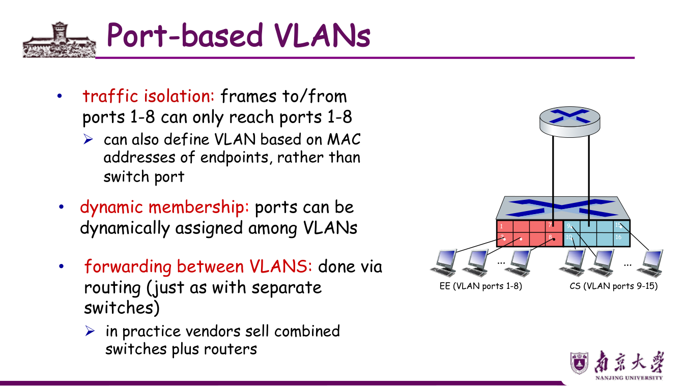

### 13.4 跨交换机 VLAN 和 Trunk

如果同一个 VLAN 跨多个 switch，需要在 switch 之间携带 VLAN 标识。

Trunk port：

- 连接交换机。
- 承载多个 VLAN 的 frame。

普通 Ethernet frame 不包含 VLAN ID，因此 trunk 上传输的 frame 需要额外标签。

802.1Q 会在 frame 中加入 VLAN tag。

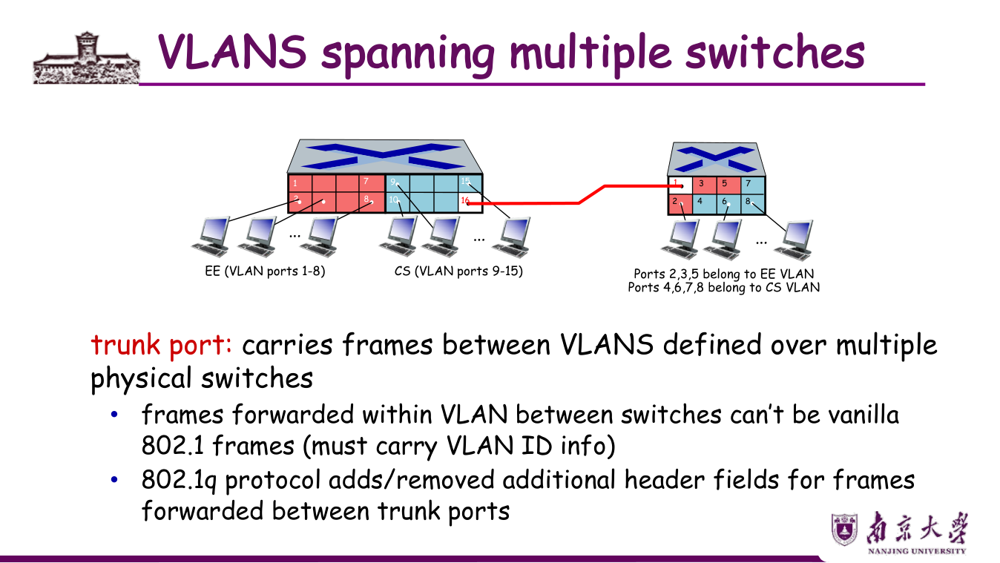

### 13.5 802.1Q Frame Format

802.1Q 在 Ethernet frame 中插入额外字段：

- Tag Protocol Identifier，2 bytes，值为 `0x8100`。
- Tag Control Information。

TCI 中包含：

- 12-bit VLAN ID。
- 3-bit priority，类似 IP ToS。

因为 frame 内容改变，CRC 需要重新计算。

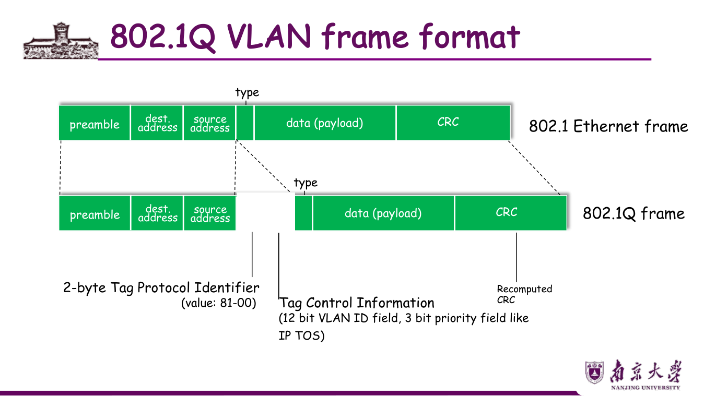

### 13.6 EVPN / VXLAN

EVPN 或 VXLAN 可以把二层 Ethernet 网络扩展到三层 IP 网络之上。

基本思想：

- 把 Ethernet frame 封装进 IP datagram。
- 在现有 IP 网络之上构造 overlay layer-2 network。
- 让不同地点的数据中心看起来像逻辑上相连的 Ethernet。

这种方式常被称为：

```text
stretch a Layer 2 network over Layer 3 infrastructure
```

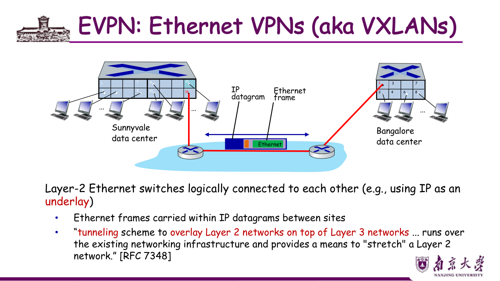

## 14. MPLS

### 14.1 MPLS 的目标

MPLS，Multiprotocol Label Switching。

目标是在 MPLS-capable router 网络中高速转发 IP 分组。

核心思想：

- 在 Ethernet header 和 IP header 之间插入 MPLS header。
- 使用固定长度 label 转发。
- 不必每跳都做最长前缀匹配。

MPLS header 包括：

- Label，20 bit。
- Exp，3 bit。
- S，1 bit。
- TTL，8 bit。

注意：IP datagram 仍保留 IP 源地址和目的地址。

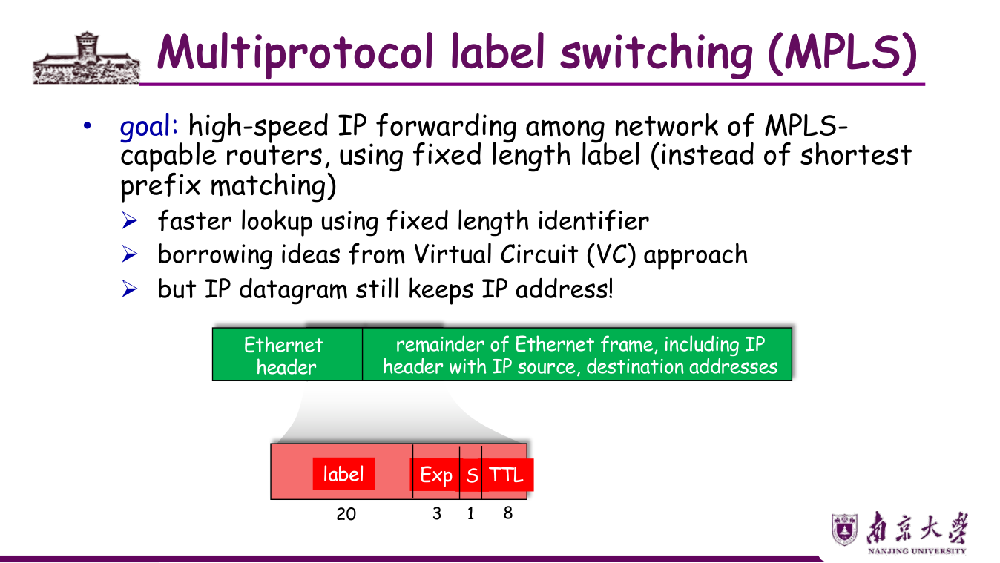

### 14.2 MPLS Router

MPLS-capable router 也叫 label-switched router。

它根据 label value 转发 packet：

- 不检查 IP 地址。
- 使用 MPLS forwarding table。
- MPLS 表与 IP forwarding table 不同。

MPLS 的灵活性：

- 可以让到同一目的地的流量根据源地址或其他字段走不同路径。
- 支持 traffic engineering。
- 可以为链路故障预计算 backup path，快速重路由。

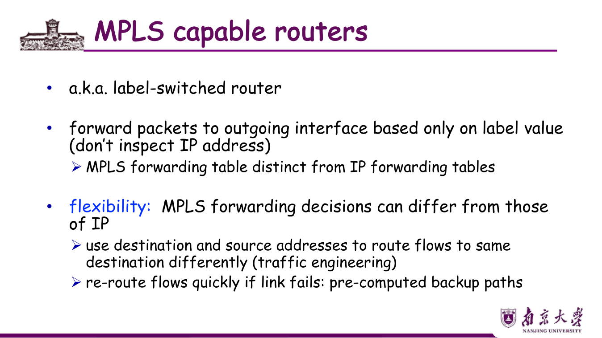

### 14.3 MPLS 与 IP 路径

普通 IP routing：

- 主要由目的 IP 地址决定路径。
- 到同一目的地的流量通常走相同路径。

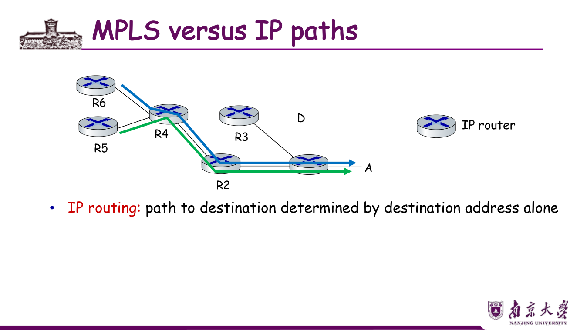

MPLS routing：

- entry MPLS router 可以根据源地址、目的地址或其他字段选择不同 MPLS 路径。
- 到同一目的地的不同 flow 可以走不同路径。
- 这是一种 generalized forwarding，比 OpenFlow 更早出现。

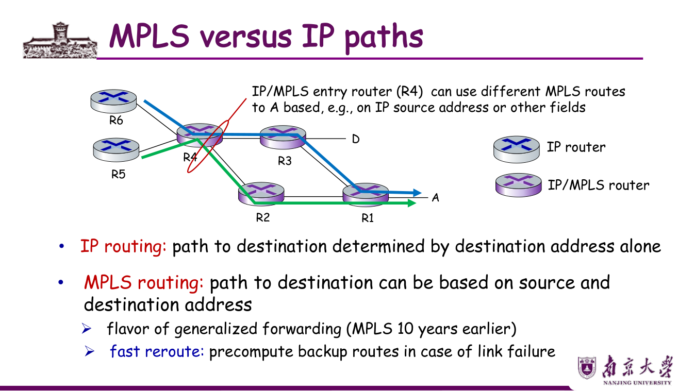

### 14.4 MPLS Signaling

MPLS 需要 signaling 来建立标签转发路径。

相关机制：

- 修改 OSPF、IS-IS 等 link-state flooding，携带 MPLS routing 所需信息。
- 例如链路带宽、已预留带宽。
- entry MPLS router 使用 RSVP-TE 等协议，在下游路由器中建立 MPLS forwarding state。

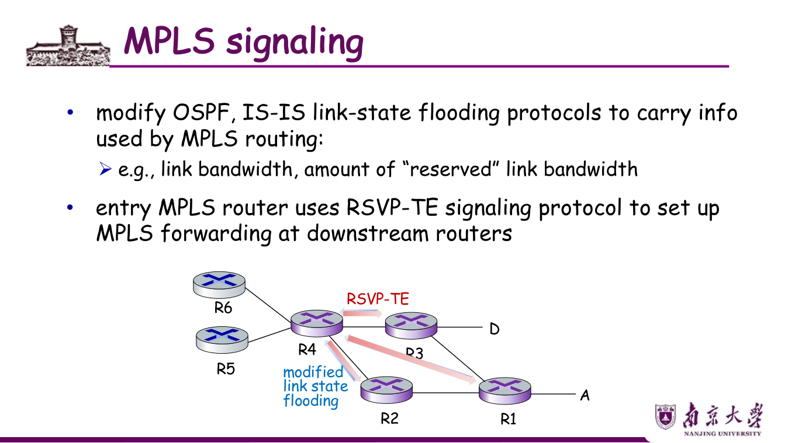

### 14.5 MPLS Forwarding Table

MPLS forwarding table 通常包含：

- incoming label。
- outgoing label。
- destination。
- outgoing interface。

转发时：

- 查 incoming label。
- 替换为 outgoing label。
- 从指定接口发出。

这类似虚电路中的 label swapping。

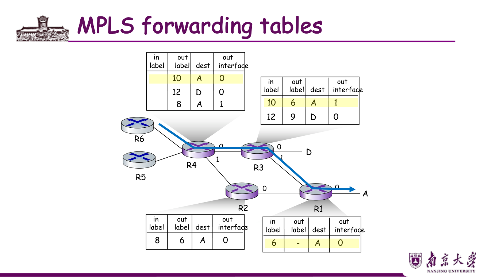

## 15. 数据中心网络

### 15.1 数据中心网络特点

数据中心可能有数万到数十万主机，且距离很近、耦合紧密。

典型场景：

- 电商。
- 内容服务。
- 搜索引擎。
- 数据挖掘。
- 云计算。

挑战：

- 多个应用同时服务海量用户。
- 高可靠性。
- 负载均衡。
- 避免计算、网络和数据瓶颈。

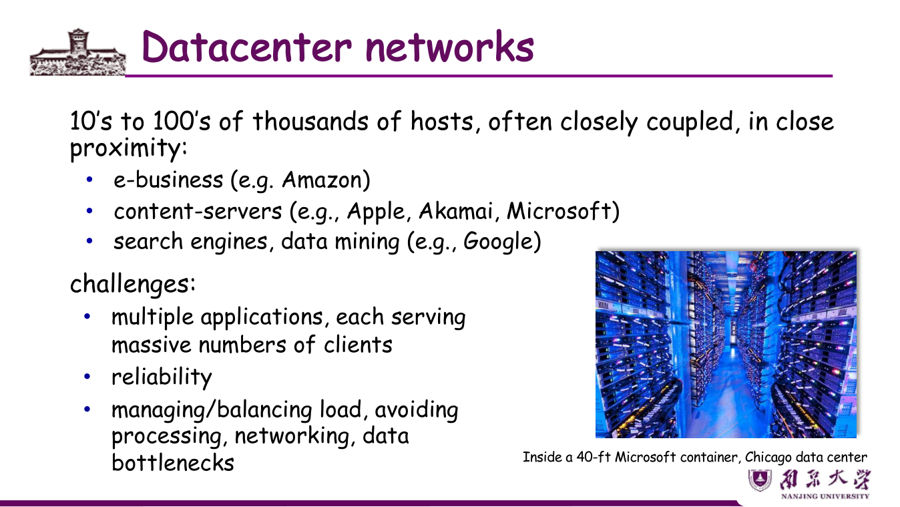

### 15.2 数据中心网络元素

典型元素：

- Server rack：每个 rack 有 20 到 40 台服务器。
- TOR switch：Top of Rack switch，每个 rack 一个。
- Tier-2 switch：连接多个 TOR。
- Tier-1 switch：连接多个 Tier-2。
- Border router：连接数据中心外部。

服务器到 TOR 通常使用高速 Ethernet，例如 100G 到 400G。

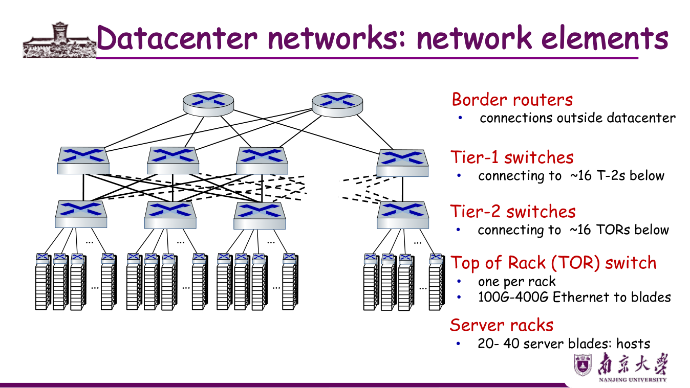

### 15.3 数据中心拓扑

现代数据中心拓扑高度互联。

Facebook F16 等拓扑提供大量并行路径，使得：

- rack 之间有多条可选路径。
- 总吞吐提高。
- 单点链路或交换机故障时有冗余。

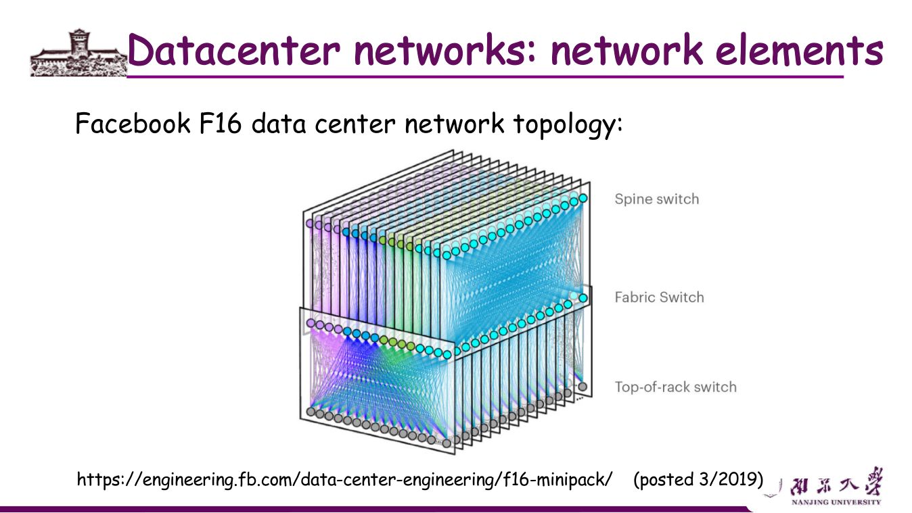

### 15.4 Multipath

数据中心网络中，rich interconnection 带来多路径能力。

好处：

- 提高 rack 间吞吐。
- 支持负载均衡。
- 通过冗余提高可靠性。

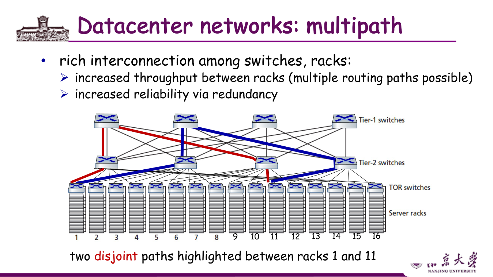

### 15.5 应用层路由与负载均衡

数据中心常使用 load balancer。

Load balancer：

- 接收外部客户端请求。
- 决定把请求分配给哪个内部服务实例。
- 对客户端隐藏数据中心内部结构。
- 收集后端结果并返回给客户端。

这是一种 application-layer routing。

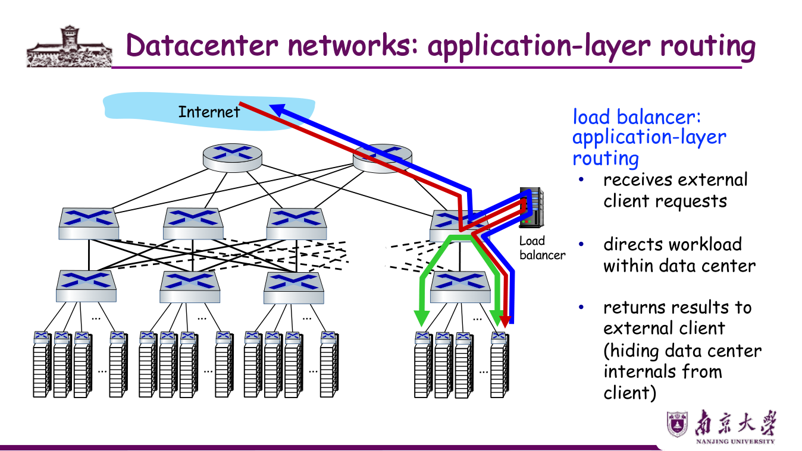

### 15.6 数据中心协议创新

数据中心对协议提出特殊需求。

链路层：

- RoCE：RDMA over Converged Ethernet。

运输层：

- ECN 用于数据中心拥塞控制。
- DCTCP、DCQCN 等利用 ECN 快速响应拥塞。
- 也有 hop-by-hop backpressure 等实验。

路由和管理：

- SDN 在数据中心内和数据中心之间广泛使用。
- 相关服务和数据尽量放近，例如同 rack 或附近 rack，减少高层通信压力。

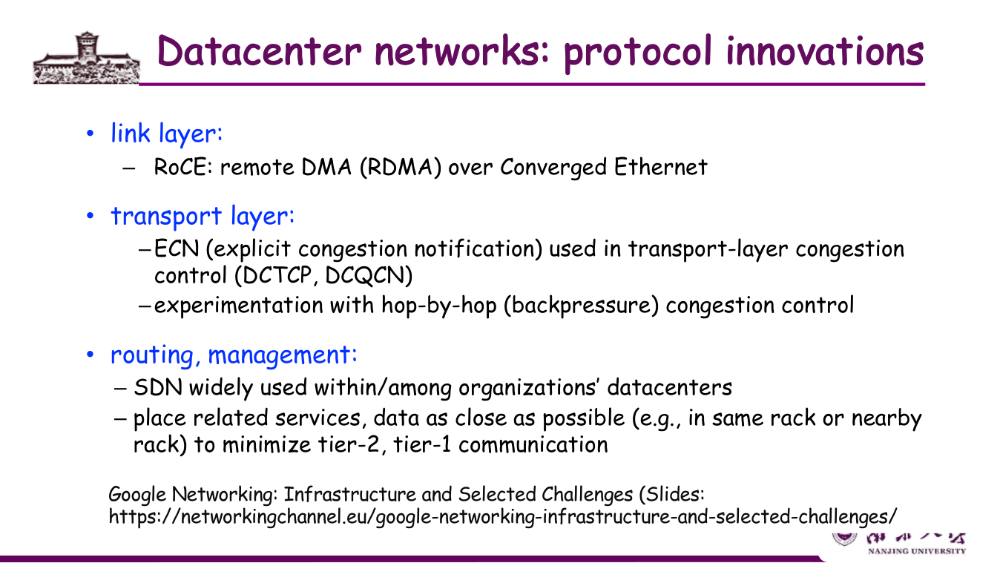

### 15.7 ORION

Google ORION 是内部数据中心 Jupiter 和广域 B4 网络的 SDN 控制平面。

特点：

- routing、iBGP、traffic engineering 作为应用运行在 ORION core 上。
- edge-to-edge flow-based control 支持 CoFlow scheduling 等 SLA。
- 管理采用 pub-sub 分布式微服务。
- OpenFlow 用于 switch signaling 和 monitoring。

这也引出一个问题：越来越多网络功能由 SDN 控制器实现，传统分布式协议会如何演化？

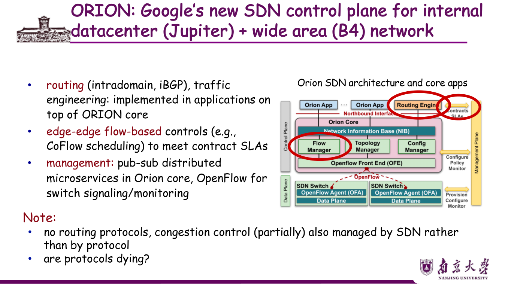

## 16. 一个 Web 请求的一天

### 16.1 综合目标

到链路层为止，应用层、运输层、网络层、链路层已经全部走过。

这个综合案例把所有层串起来：

```text
学生笔记本接入校园网，请求 www.google.com 页面
```

目标是识别这个看似简单动作背后的协议：

- DHCP。
- ARP。
- DNS。
- Ethernet。
- IP routing。
- TCP。
- HTTP。

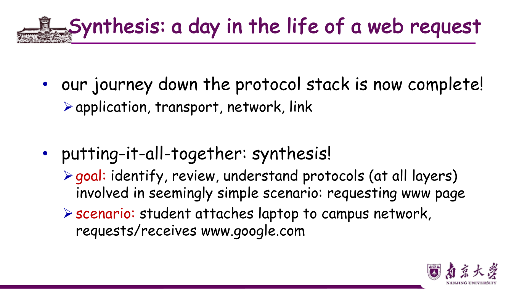

### 16.2 场景

场景中包括：

- 学生笔记本。
- 学校网络。
- Comcast 网络。
- DNS server。
- Google 网络。
- Web server。

用户只看到浏览器请求一个网页，但底层需要完成多步准备和通信。

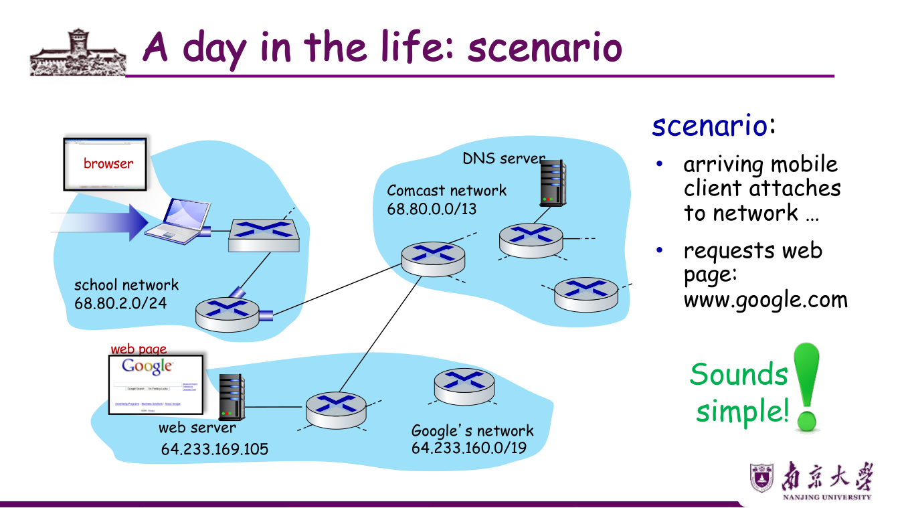

### 16.3 第一步：DHCP 获取配置

刚接入网络的 laptop 需要获得：

- 自己的 IP 地址。
- 第一跳路由器地址。
- DNS server 地址。

它使用 DHCP。

DHCP request 封装过程：

```text
DHCP -> UDP -> IP -> Ethernet -> Physical
```

因为客户端还不知道网络配置，Ethernet frame 使用广播目的 MAC：

```text
FF-FF-FF-FF-FF-FF
```

路由器中的 DHCP server 收到该广播。

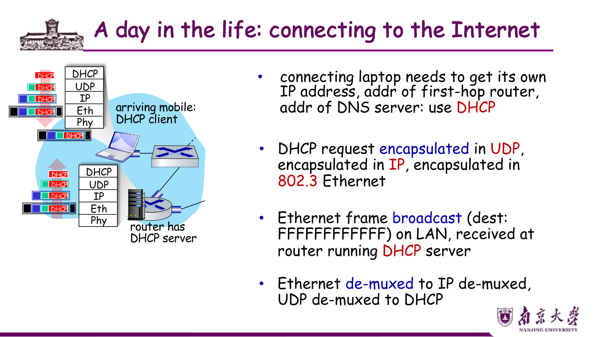

DHCP server 回复 DHCP ACK，其中包含：

- 客户端 IP 地址。
- 第一跳路由器 IP 地址。
- DNS server 名字和地址。

客户端收到 ACK 后，才具备基本上网配置。

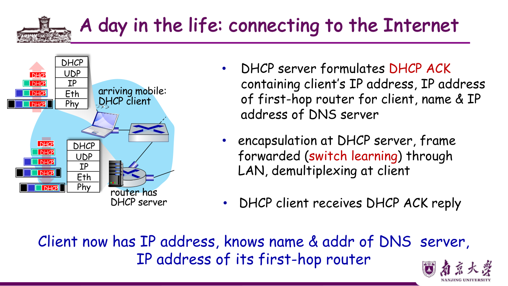

### 16.4 第二步：ARP 获取第一跳路由器 MAC

在发送 DNS query 前，客户端知道 DNS server 的 IP 地址，但要把 IP datagram 发出本 LAN，必须先交给第一跳路由器。

客户端需要第一跳路由器接口的 MAC 地址。

如果 ARP 表中没有该映射：

- 客户端广播 ARP query。
- 路由器收到后返回 ARP reply。
- 客户端缓存路由器 MAC 地址。

然后客户端才能发送承载 DNS query 的 Ethernet frame。

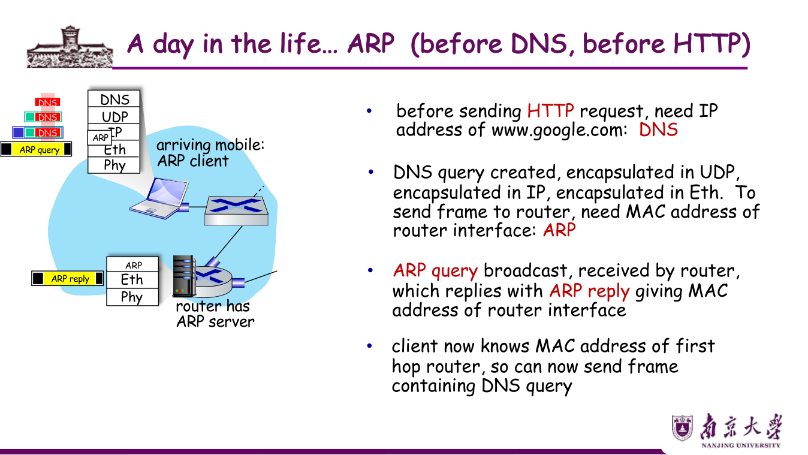

### 16.5 第三步：DNS 查询

客户端创建 DNS query：

```text
DNS -> UDP -> IP -> Ethernet
```

IP datagram 经 LAN switch 到达第一跳路由器。

之后在校园网、ISP 网络中转发。

这些网络中的转发表可能由 RIP、OSPF、IS-IS、BGP 等路由协议生成。

DNS server 收到查询后，返回：

```text
www.google.com 的 IP 地址
```

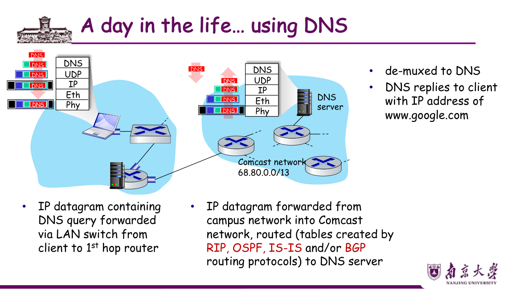

### 16.6 第四步：建立 TCP 连接

得到 Web server IP 地址后，客户端打开到服务器的 TCP socket。

TCP 三次握手：

1. 客户端发送 SYN。
2. 服务器返回 SYNACK。
3. 客户端返回 ACK。

这些 TCP segment 被封装进 IP datagram，再逐跳封装进链路层 frame。

跨 AS 路径由网络层路由完成。

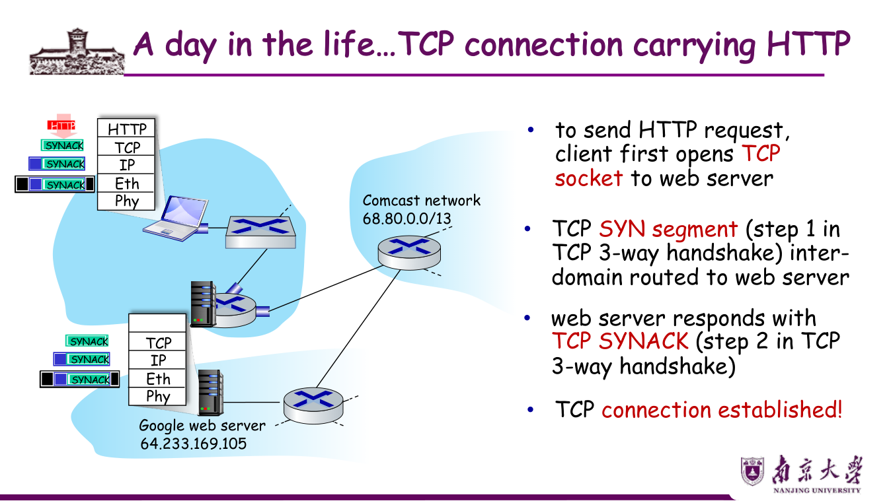

### 16.7 第五步：HTTP 请求和响应

TCP 连接建立后：

- 浏览器把 HTTP request 写入 TCP socket。
- TCP 交给 IP。
- IP datagram 被路由到 Google web server。
- 服务器处理请求，返回 HTTP response。
- response 中包含 web page。
- 客户端最终显示页面。

一个网页显示背后，实际上是多层协议连续协作的结果。

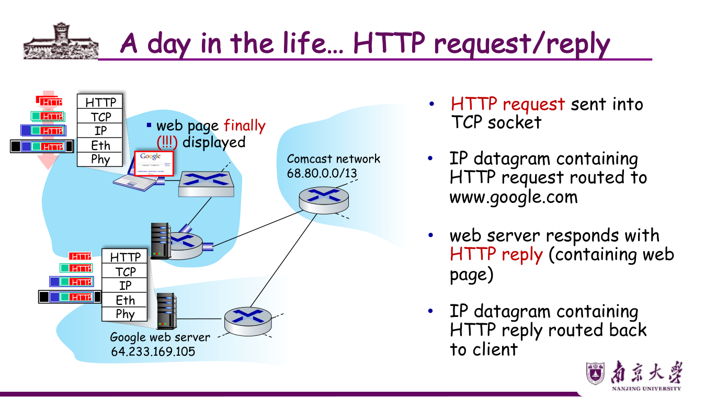

## 17. 本章小结

本章完成了从网络层向下到链路层的学习。

最重要的主线是：

- 链路层负责相邻节点之间的 datagram 传输，链路层分组叫 frame。
- 不同链路可以使用不同链路层协议，并提供不同服务。
- 链路层服务包括 framing、link access、可靠交付、流量控制、差错检测和纠正。
- 奇偶校验简单，二维奇偶校验可纠正单 bit 错误，CRC 是 Ethernet/WiFi 等广泛使用的强检测机制。
- 多路访问协议解决多个节点共享广播信道的问题。
- TDMA/FDMA 通过划分资源避免碰撞，随机访问允许碰撞并恢复，taking turns 轮流使用信道。
- Slotted ALOHA 最大效率约为 `1/e = 0.37`。
- CSMA 先听后发，CSMA/CD 在检测到碰撞后停止发送并执行指数退避。
- MAC 地址用于本地链路交付，IP 地址用于网络层转发。
- ARP 根据同一 LAN 中的 IP 地址解析 MAC 地址。
- 跨子网通信中，IP 源/目的端到端保持不变，MAC 源/目的每一跳改变。
- Ethernet 是主导有线 LAN 技术，使用 frame、MAC 地址、CRC 和 CSMA/CD。
- Switch 是链路层 store-and-forward 设备，通过 self-learning 构建 MAC 转发表。
- VLAN 在同一物理 LAN 上划分多个逻辑广播域，802.1Q 用 VLAN tag 支持 trunk。
- MPLS 使用 label 转发，支持高速查表、流量工程和快速重路由。
- 数据中心网络依赖多路径、负载均衡、协议创新和 SDN。
- 一个 Web 请求会依次涉及 DHCP、ARP、DNS、TCP、HTTP，以及每一跳的 IP 和链路层封装。

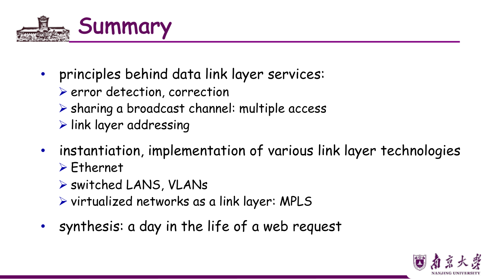

