# 第 7 章 无线网络和移动网络

> 本章核心问题：
>
> 1. 无线网络由哪些基本元素组成？infrastructure mode 和 ad hoc mode 有什么区别？
> 2. 无线链路为什么比有线链路更复杂？衰减、多径、噪声和隐藏终端分别带来什么问题？
> 3. CDMA 如何通过编码让多个用户共享同一频段？
> 4. IEEE 802.11 WLAN 的体系结构、信道、关联和扫描过程如何工作？
> 5. 802.11 为什么使用 CSMA/CA，而不是 Ethernet 中的 CSMA/CD？
> 6. RTS/CTS 如何缓解隐藏终端和碰撞问题？
> 7. 802.11 frame 中多个地址字段分别表示什么？
> 8. 蓝牙等个人区域网络如何组织短距离无线通信？
> 9. 4G LTE 网络由哪些核心组件构成？控制平面和数据平面如何分离？
> 10. OFDMA、PRB 和调度如何支持蜂窝无线接入？
> 11. 5G 相比 4G 的目标、无线技术和体系结构有什么变化？
> 12. 移动性为什么会挑战传统 IP 转发？间接路由和直接路由各自如何解决？
> 13. 4G 网络中移动设备注册、隧道建立和基站切换如何完成？
> 14. 无线和移动性对 TCP、UDP 等高层协议有什么性能影响？


## 0. 本章内容结构

第 6 章讨论的是链路层和局域网，默认链路通常稳定、带宽较高、误码率较低。

第 7 章进入无线和移动场景。无线网络仍然要完成链路层和网络层的基本任务，但传输介质变成开放空间，主机还可能在网络之间移动，因此会出现一组新的问题：

- 无线链路质量随距离、障碍物、反射、干扰而变化。
- 多个无线节点共享频谱，需要特殊的多路访问机制。
- 移动设备要在 AP、基站、访问网络之间切换。
- IP 地址本来依赖网络位置，但移动节点的位置会改变。
- 蜂窝网络需要同时处理接入、认证、计费、移动性和数据转发。

本章主要内容包括：

- 无线网络基本元素和分类。
- 无线链路特性。
- CDMA。
- IEEE 802.11 WiFi。
- Bluetooth。
- 4G/5G 蜂窝网络。
- 移动性管理。
- 4G 中的移动性实现。
- 无线和移动性对高层协议的影响。

## 1. 无线网络概览

### 1.1 无线网络的基本元素

无线网络不是只有“无线链路”这一件事。

一个典型无线网络包含：

- wireless hosts：无线主机。
- base station：基站或接入点。
- wireless link：无线链路。
- wired network infrastructure：有线网络基础设施。

无线链路通常用于把移动设备接入基站，也可以作为骨干链路使用。

基站再连接到有线网络，使无线主机可以访问 Internet 或其他网络服务。

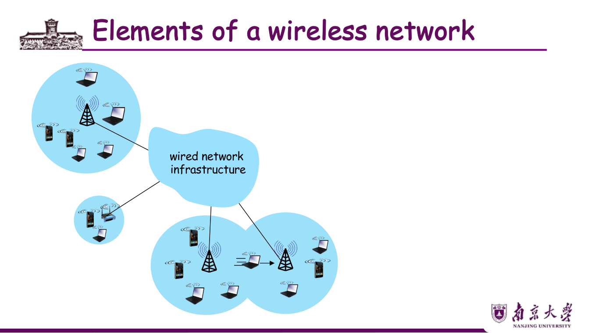

### 1.2 Wireless Hosts

Wireless host 是通过无线接口通信的终端。

典型例子：

- laptop。
- smartphone。
- tablet。
- wearable device。
- IoT device。
- 车载终端。

无线主机运行应用程序，发送和接收应用数据。

主机是否“移动”不是无线网络的必要条件。很多无线设备可以固定不动，例如无线传感器、智能摄像头、智能家居设备。

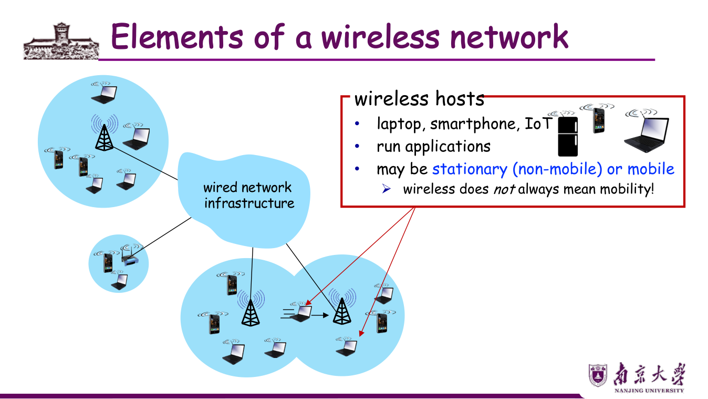

### 1.3 Base Station

Base station 通常连接到有线网络。

它的核心职责是 relay：

- 从无线主机接收 frame。
- 把数据转发到有线网络。
- 从有线网络接收数据。
- 通过无线链路发送给无线主机。

不同网络中的 base station 名称不同：

- WiFi 中通常叫 AP，access point。
- 蜂窝网络中，4G 叫 eNodeB，5G 叫 gNodeB。

主机通常会和某个基站关联，基站成为它进入网络的第一跳。

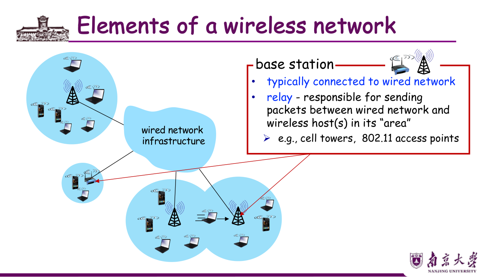

### 1.4 Wireless Link

Wireless link 是无线主机和基站之间的通信链路。

它也可以用于：

- 主机之间的直接通信。
- 无线回程链路。
- 卫星链路。
- 蜂窝基站之间或网络设备之间的无线连接。

无线链路的特点是广播性强：一个节点发出的信号可能被覆盖范围内多个节点听到。

这带来两个结果：

- 需要共享介质访问控制。
- 容易受到干扰、碰撞、窃听和衰减影响。

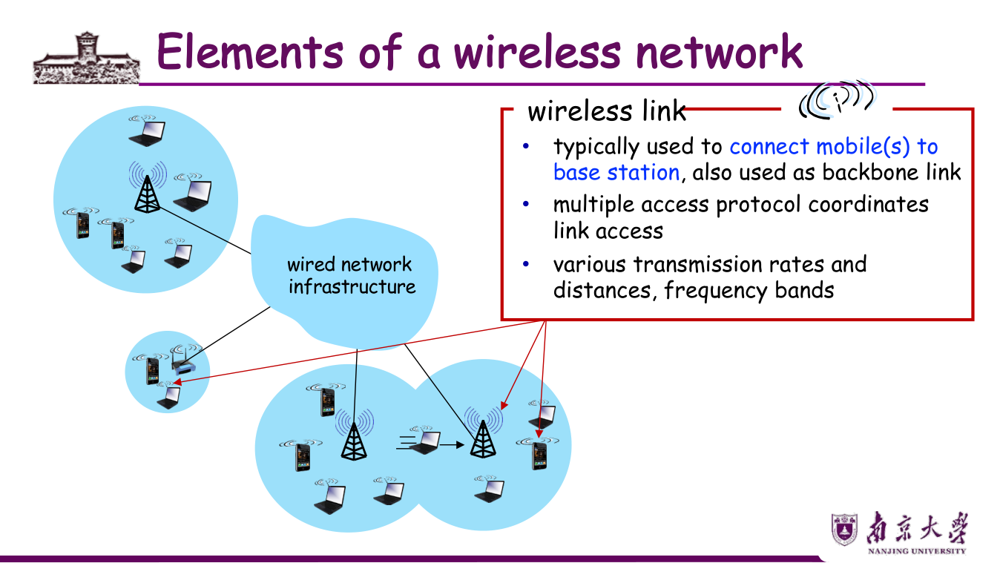

### 1.5 不同无线链路的尺度

无线链路可以按覆盖范围和速率粗略分类。

短距离：

- Bluetooth。
- Zigbee。
- NFC。

中距离：

- WiFi。
- 室内 WLAN。

长距离：

- 4G/5G 蜂窝网络。
- 卫星网络。

不同无线技术在范围、速率、频段、功耗和移动性支持上差异很大。

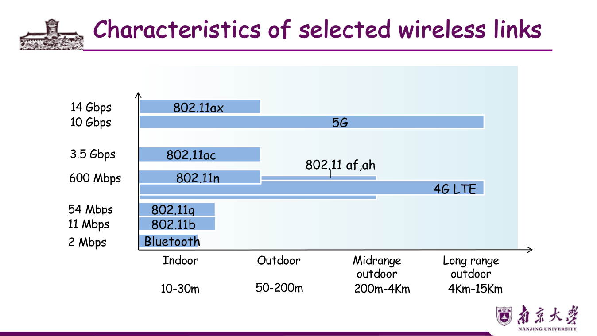

## 2. 无线网络模式与分类

### 2.1 Infrastructure Mode

Infrastructure mode 是最常见的无线网络模式。

基本结构：

- 无线主机连接到 base station。
- base station 连接有线网络。
- 主机通过 base station 访问 Internet。

WiFi 家庭路由器、校园 AP、蜂窝基站都属于这种思路。

这种模式的优点：

- 管理集中。
- 接入认证、地址分配、转发和移动性管理较容易实现。
- 可以依托已有有线网络提供广域连接。

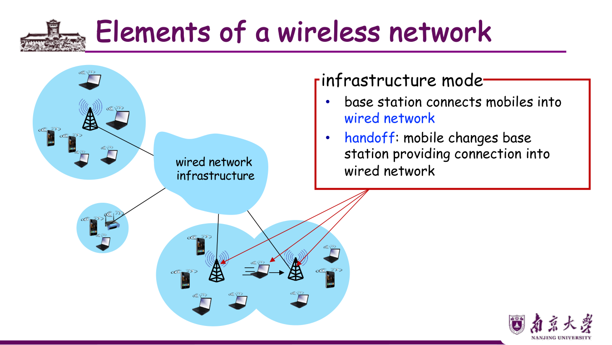

### 2.2 Ad Hoc Mode

Ad hoc mode 中没有基站。

节点只能和通信范围内的其他节点直接通信。

如果目标节点不在无线覆盖范围内，就需要其他节点帮忙中继，形成多跳无线网络。

Ad hoc 网络常见于：

- 临时会议或临时组网。
- 传感器网络。
- 车辆自组织网络。
- 灾害场景中的应急网络。

它的挑战包括路由、节点发现、功耗、链路变化和安全。

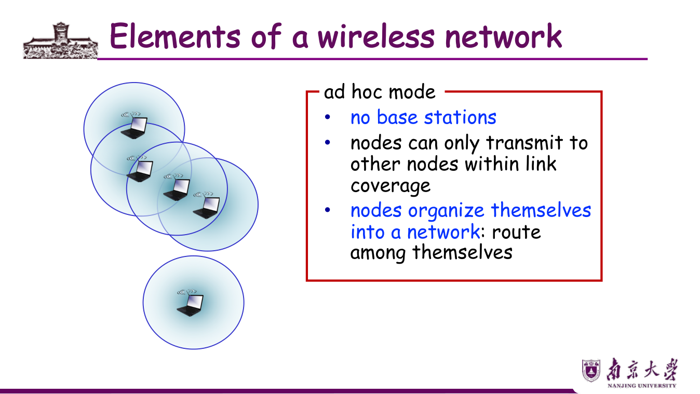

### 2.3 无线网络分类

无线网络可以从两个维度分类：

- 是否有 infrastructure。
- 是否需要 multi-hop。

四类典型场景：

- single hop，infrastructure：主机直接连接 AP 或蜂窝基站。
- single hop，no infrastructure：蓝牙等短距离直接通信。
- multiple hops，infrastructure：mesh AP 或无线回程。
- multiple hops，no infrastructure：移动 ad hoc 网络。

课程后续重点关注两类最重要场景：

- WiFi：以 AP 为中心的无线局域网。
- 4G/5G：以蜂窝基站和运营商核心网为中心的广域移动网络。

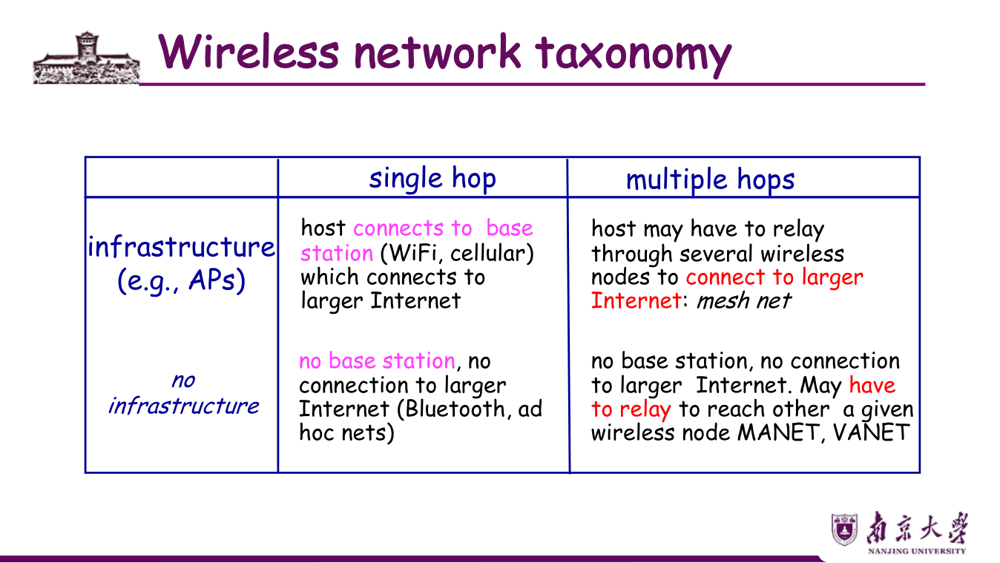

## 3. 无线链路特性

### 3.1 衰减和路径损耗

无线电信号在传播过程中会衰减。

自由空间路径损耗大致与下面两个因素相关：

```text
path loss ~ (f d)^2
```

其中：

- `f` 是频率。
- `d` 是距离。

频率越高，距离越远，路径损耗越大。

这解释了两个现象：

- 高频无线链路通常覆盖范围较短。
- 毫米波 5G 需要更密集的小基站和波束成形。

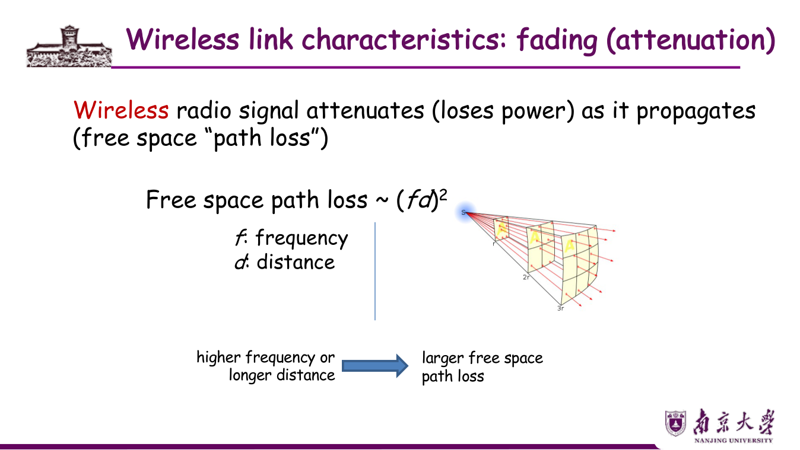

### 3.2 多径传播

无线信号会被地面、建筑物、墙壁、车辆等反射。

同一发送信号可能沿多条路径到达接收方：

- line-of-sight path：直达路径。
- reflected path：反射路径。

不同路径长度不同，因此到达时间略有差异。

这会造成 multipath propagation：

- 信号叠加后可能增强或抵消。
- 接收方看到的信号随位置和时间快速变化。
- 相邻符号可能相互干扰。

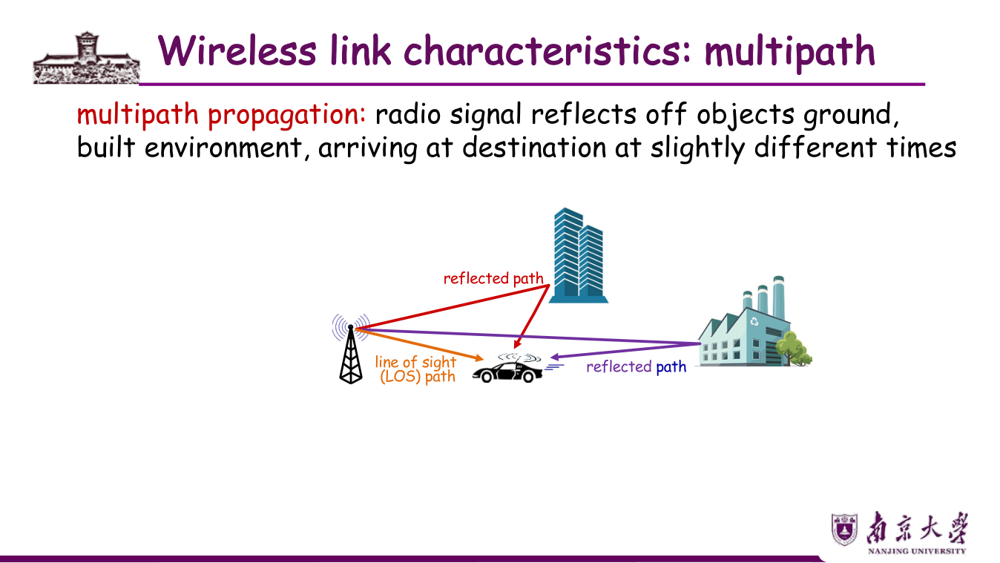

### 3.3 Coherence Time

Coherence time 描述信道在多长时间内可以近似认为“不变”。

直觉上：

- 如果设备移动慢，环境变化慢，coherence time 较长。
- 如果设备移动快，或环境反射变化快，coherence time 较短。

课件中还对比了 bit 在信道中存在的时间。

如果符号时间和信道变化时间尺度接近，接收会更困难。

无线系统需要根据这些物理层特性选择调制、编码、重传和速率适配策略。

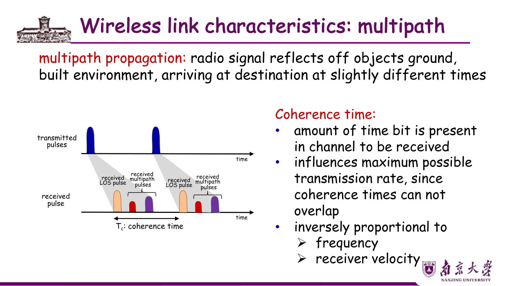

### 3.4 噪声和 SNR

无线信道中存在噪声和干扰。

来源包括：

- 其他无线发送者。
- 电机、电器等外部设备。
- 相邻 AP 或相邻蜂窝小区。
- 同频或邻频干扰。

SNR 是 signal-to-noise ratio：

```text
SNR = signal power / noise power
```

SNR 越大，越容易从噪声中恢复出原始信号。

SNR 越小，误码率越高，可能需要：

- 降低发送速率。
- 使用更强的编码。
- 重传。
- 切换到更好的 AP 或基站。

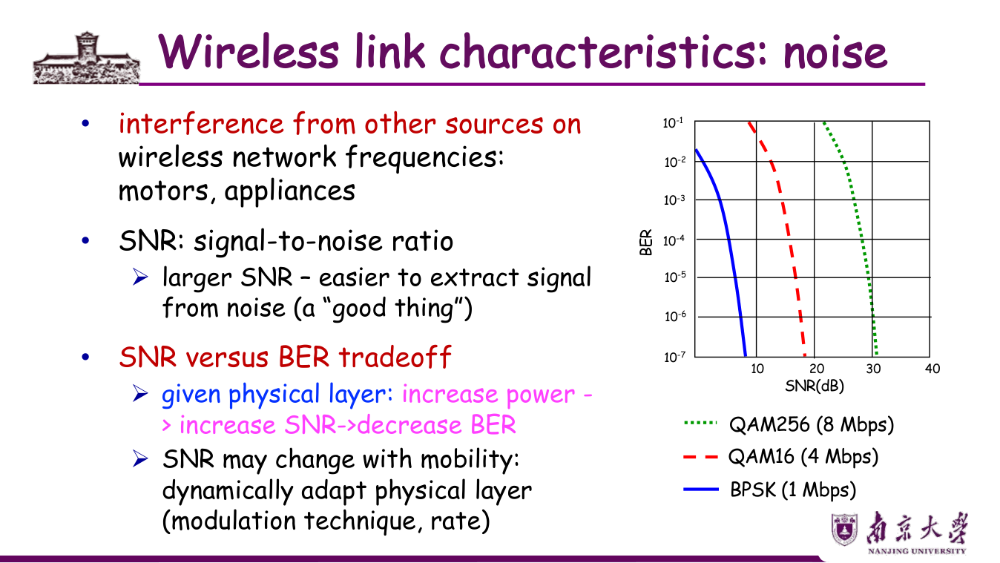

### 3.5 Hidden Terminal Problem

Hidden terminal 是无线网络中的经典问题。

场景：

- A 能听到 B。
- C 能听到 B。
- A 和 C 彼此听不到。

如果 A 和 C 都向 B 发送：

- A 认为信道空闲。
- C 也认为信道空闲。
- 它们在 B 处发生碰撞。

这说明无线 CSMA 中的“先听后发”不够完美。

节点只能感知自己附近的信道状态，不能保证接收方附近也空闲。

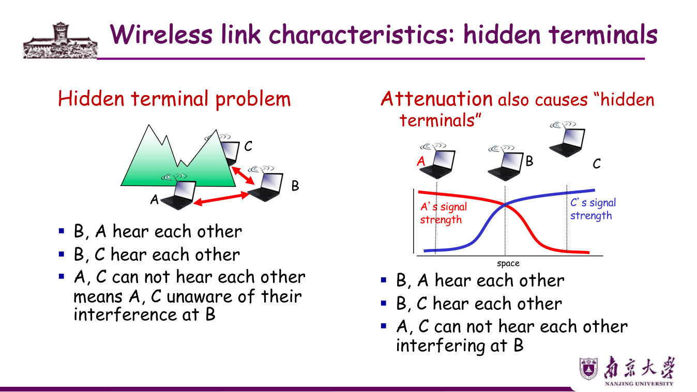

## 4. CDMA

### 4.1 CDMA 的基本思想

CDMA 是 Code Division Multiple Access。

它给每个用户分配一个唯一的 code，也叫 chipping sequence。

所有用户可以：

- 使用同一频段。
- 同时发送。
- 通过不同 code 区分彼此。

如果不同用户的 code 近似正交，接收方可以用目标发送者的 code 从叠加信号中恢复出目标数据。

CDMA 的关键不是把时间或频率切开，而是把编码空间切开。

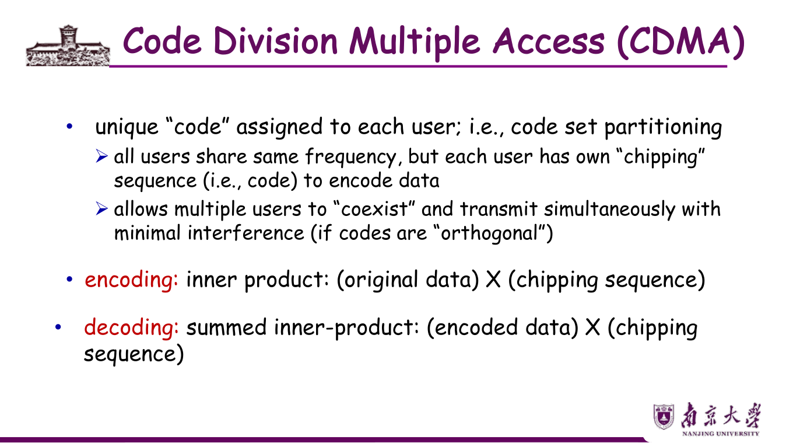

### 4.2 编码和解码

发送者把原始数据 bit 映射为 `+1` 或 `-1`。

然后用它乘以 chipping sequence。

例如：

```text
data bit = +1  -> send code itself
data bit = -1  -> send negated code
```

接收方知道发送者的 code。

它把收到的信号和该 code 做内积，再除以 code 长度，就可以恢复原始 bit。

如果 code 正交，其他发送者的信号在这个内积中会相互抵消。

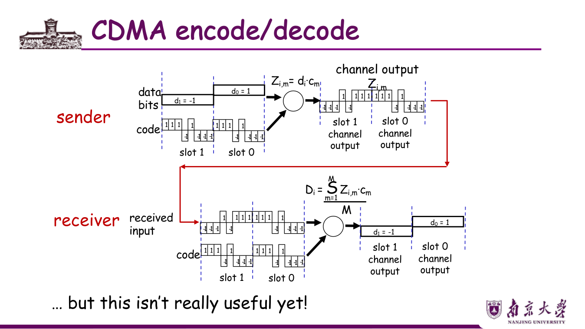

### 4.3 两个发送者同时发送

当两个发送者同时发送时，信道上看到的是两个编码信号的叠加。

接收方如果想恢复 sender 1 的数据：

- 使用 sender 1 的 code 做解码。
- sender 1 的信号会被还原。
- sender 2 的信号因为 code 正交，贡献接近 0。

这就是 CDMA 可以让多个用户共享同一时间和频率资源的原因。

实际系统中 code 不可能永远完美正交，还会受到功率控制、多径和同步问题影响。

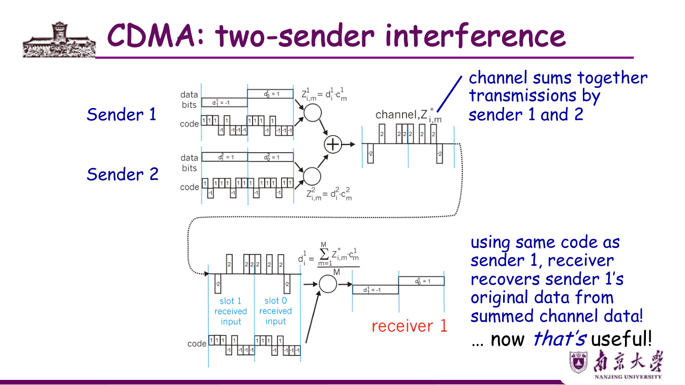

## 5. IEEE 802.11 Wireless LAN

### 5.1 802.11 标准族

IEEE 802.11 是 WiFi 的核心标准族。

不同版本支持不同频段、调制方式和最高速率。

常见版本包括：

- 802.11b。
- 802.11a。
- 802.11g。
- 802.11n。
- 802.11ac。
- 802.11ax。

总体趋势是：

- 速率提高。
- MIMO、多天线和更复杂调制被引入。
- 频段从 2.4 GHz 扩展到 5 GHz、6 GHz 等。

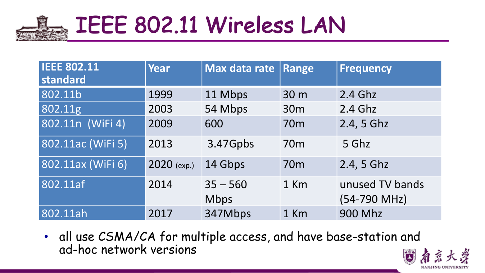

### 5.2 802.11 LAN 架构

802.11 infrastructure mode 中：

- wireless host 和 AP 通信。
- AP 连接到有线网络。
- AP 负责把无线侧 frame 和有线侧 frame 之间转发。

Basic Service Set，BSS，是一个 AP 及其关联无线主机组成的基本服务集合。

BSS 也常被称为 cell。

一个企业或校园 WLAN 由多个 BSS 组成，每个 BSS 覆盖一个区域。

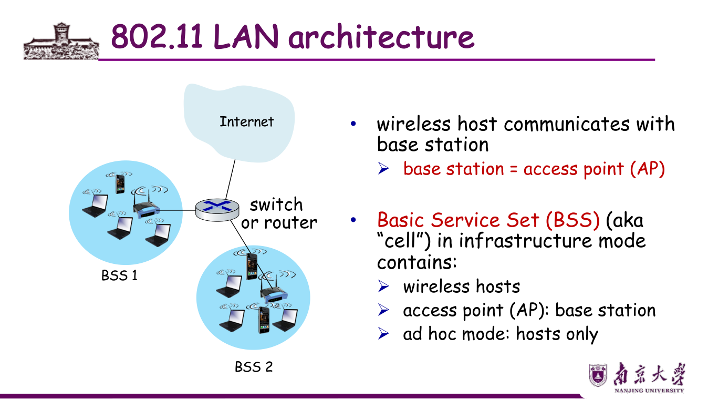

### 5.3 802.11 Channels

WiFi 频谱被划分为多个 channel。

AP 管理者为 AP 选择工作信道。

如果相邻 AP 使用相同或重叠信道，就可能发生干扰。

以 2.4 GHz WiFi 为例：

- 频段被分成多个信道。
- 很多信道之间有重叠。
- 实际部署常选择 1、6、11 这类互不重叠的信道。

信道规划是 WLAN 部署中的重要问题。

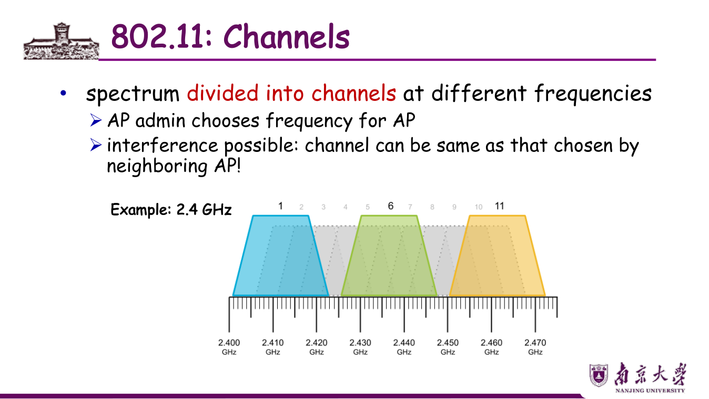

### 5.4 Association

无线主机进入 WLAN 后，必须先和某个 AP 建立 association。

一般过程：

- 主机扫描信道。
- 监听 beacon frame。
- 从 beacon 中获得 AP 的 SSID 和 MAC 地址。
- 选择一个 AP。
- 发起关联。
- 完成认证和关联后开始数据通信。

主机会根据多种因素选择 AP：

- 信号强度。
- 支持速率。
- 安全配置。
- 负载。
- 用户配置的网络优先级。

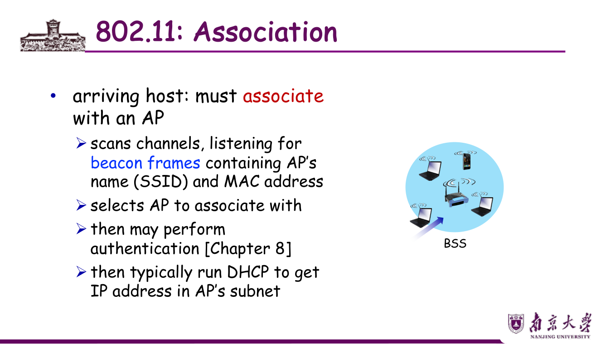

### 5.5 Passive Scanning 和 Active Scanning

802.11 扫描有两种方式。

Passive scanning：

- AP 周期性发送 beacon frame。
- 主机在各个信道上监听 beacon。
- 主机选择 AP 后发送 association request。

Active scanning：

- 主机主动发送 probe request。
- AP 返回 probe response。
- 主机选择 AP 后发送 association request。

Passive scanning 较安静，但可能等待 beacon。

Active scanning 更主动，但会产生额外无线帧。

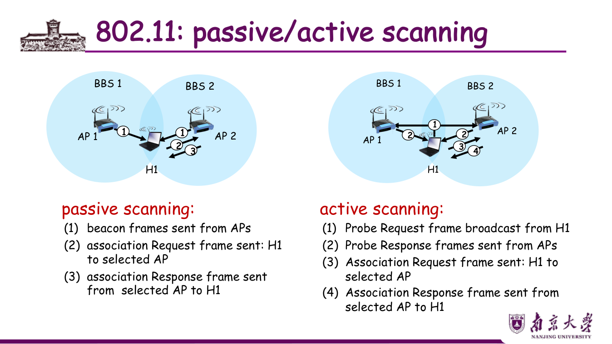

## 6. 802.11 多路访问：CSMA/CA

### 6.1 为什么不能直接用 CSMA/CD

802.11 也使用 CSMA 思想：发送前先感知信道。

但 WiFi 不使用 Ethernet 的 collision detection。

原因：

- 无线网卡发送时自身信号很强，很难同时听到其他较弱信号。
- 碰撞发生在接收方附近，发送方未必能感知。
- hidden terminal 让发送方听到的信道状态不等于接收方看到的状态。

因此 802.11 的目标从 collision detection 转为 collision avoidance。

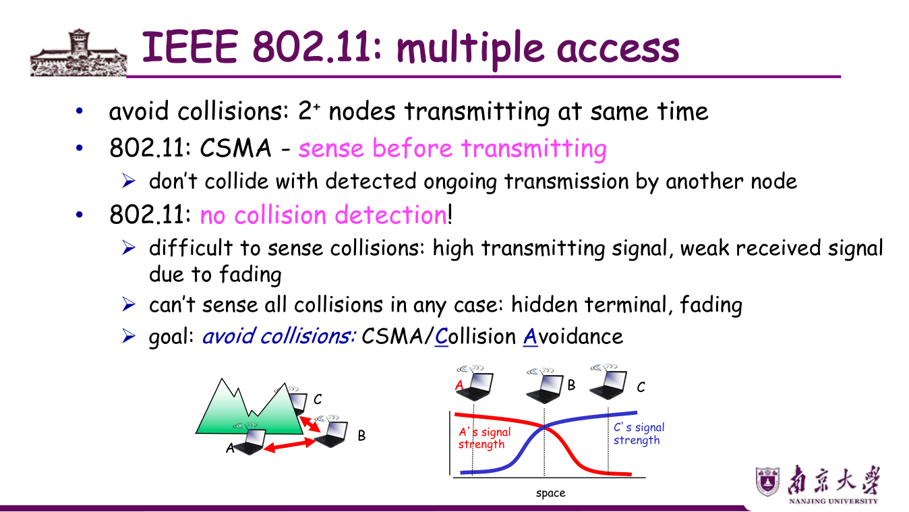

### 6.2 CSMA/CA 基本过程

CSMA/CA 是 Carrier Sense Multiple Access with Collision Avoidance。

发送方过程：

1. 如果信道空闲一个 DIFS 时间，发送整个 frame。
2. 如果信道忙，选择随机 backoff。
3. 只在信道空闲时递减 backoff 计时器。
4. 计时器到 0 后发送。
5. 接收方收到 frame 后，等待 SIFS，返回 ACK。
6. 如果发送方没有收到 ACK，认为发生碰撞或丢失，之后扩大竞争窗口并重试。

802.11 的 ACK 很重要，因为无线链路误码率更高，而且发送方无法可靠检测碰撞。

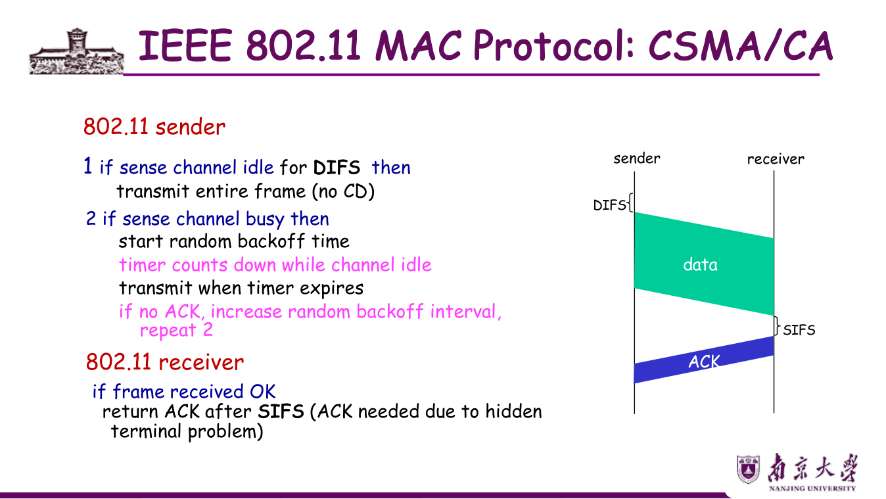

### 6.3 RTS/CTS 的思路

RTS/CTS 是一种预约机制。

RTS 是 request to send。

CTS 是 clear to send。

基本思想：

- 发送方先用很短的 RTS 预约信道。
- AP 或接收方返回 CTS。
- 听到 CTS 的其他节点知道即将有数据传输，于是保持静默。
- 之后发送方再发送较长的数据帧。

即使 RTS 发生碰撞，损失也小，因为 RTS 很短。

RTS/CTS 尤其适合减少长数据帧碰撞代价。

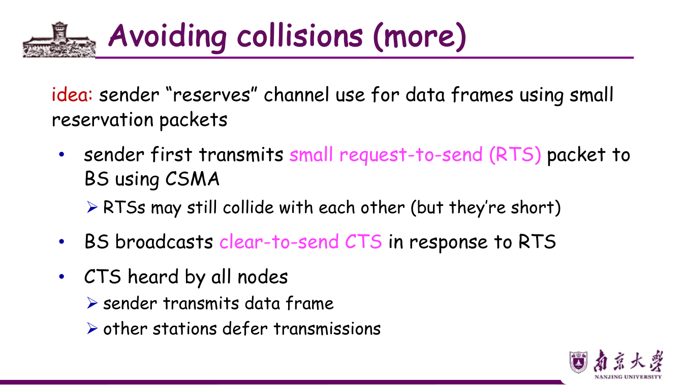

### 6.4 RTS/CTS 如何缓解隐藏终端

在隐藏终端场景中：

- A 和 B 互相听不到。
- A 想向 AP 发送。
- B 也可能向 AP 发送。

如果 A 先发送 RTS，AP 返回 CTS。

B 即使听不到 A 的 RTS，也能听到 AP 的 CTS。

于是 B 知道 AP 附近即将接收 A 的数据，会推迟发送。

这就降低了在 AP 处发生碰撞的概率。

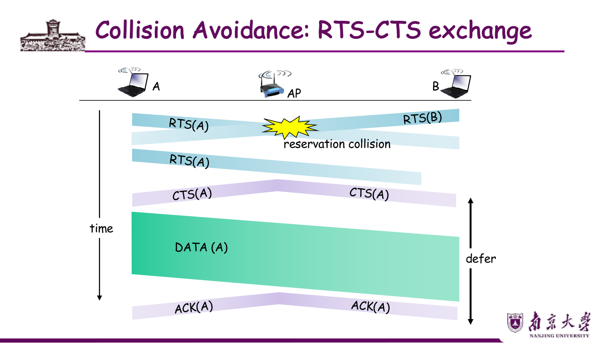

## 7. 802.11 Frame

### 7.1 802.11 Frame 的地址字段

802.11 frame 比 Ethernet frame 更复杂。

典型 802.11 frame 中有多个地址字段：

- Address 1。
- Address 2。
- Address 3。
- 有时还有 Address 4。

这是因为 WiFi frame 可能涉及：

- 无线主机。
- AP。
- 有线网络中的路由器或交换机。
- 分布式系统中的另一个 AP。

一个无线 frame 需要同时表达无线链路上的接收者、发送者，以及最终网络层下一跳相关地址。

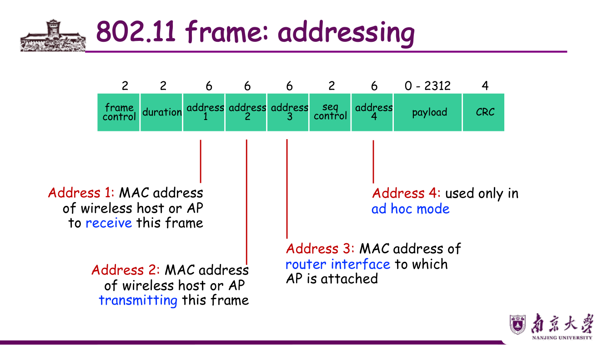

### 7.2 地址字段例子

考虑主机 H1 通过 AP 向 Internet 发送数据。

802.11 frame 中：

- Address 1：接收该无线 frame 的 AP MAC 地址。
- Address 2：发送该无线 frame 的 H1 MAC 地址。
- Address 3：有线侧下一跳路由器 R1 的 MAC 地址。

AP 收到无线 frame 后，把其中的 IP datagram 转发到有线网络中。

此时链路层 frame 会重新封装为 Ethernet frame。

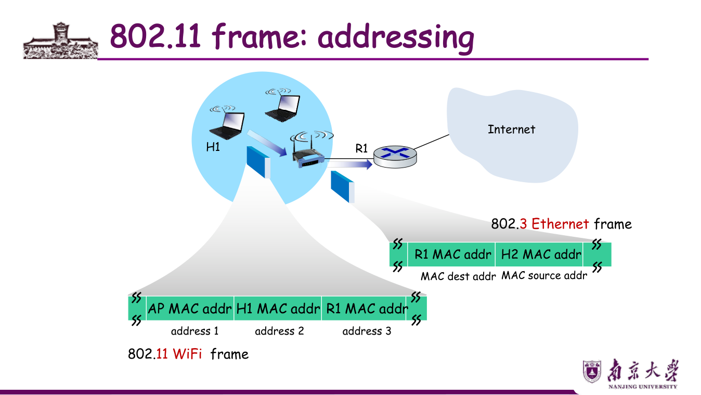

### 7.3 其他 Frame 字段

802.11 frame 还包含：

- frame control。
- duration。
- sequence control。
- payload。
- CRC。

duration 字段可用于虚拟载波监听。

收到 RTS、CTS 或数据帧的节点可以根据 duration 知道信道将被占用多久，从而设置 NAV，Network Allocation Vector。

这也是 collision avoidance 的一部分。

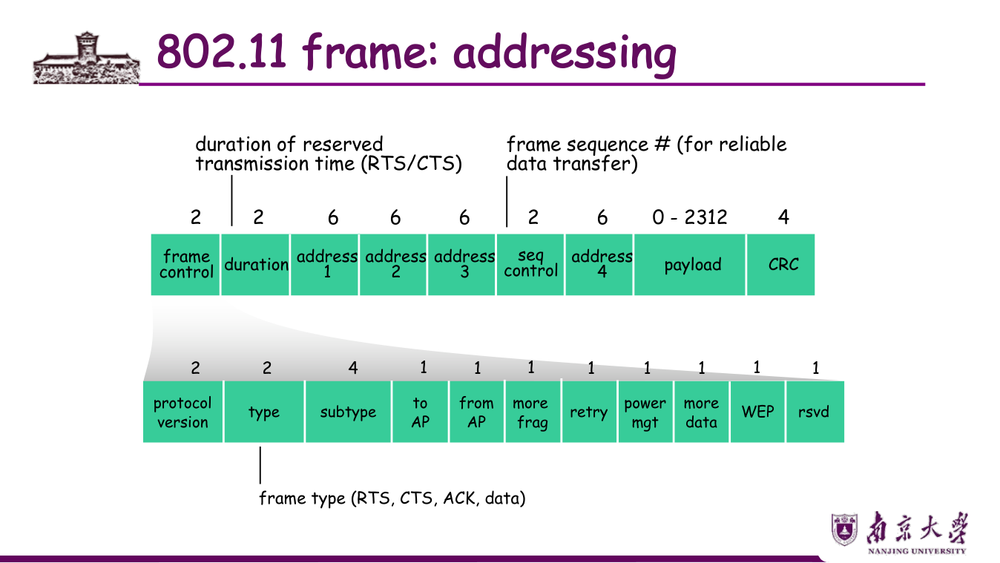

## 8. WiFi 移动性与高级能力

### 8.1 同一子网内移动

如果主机从一个 BSS 移动到另一个 BSS，但仍在同一 IP 子网内：

- 主机 IP 地址可以保持不变。
- 主机重新关联到新的 AP。
- 交换机通过自学习更新转发表。
- 后续 frame 会被转发到新 AP 所在端口。

这种移动性主要由链路层处理，对网络层基本透明。

如果移动跨越 IP 子网，问题会复杂得多，需要移动性管理。

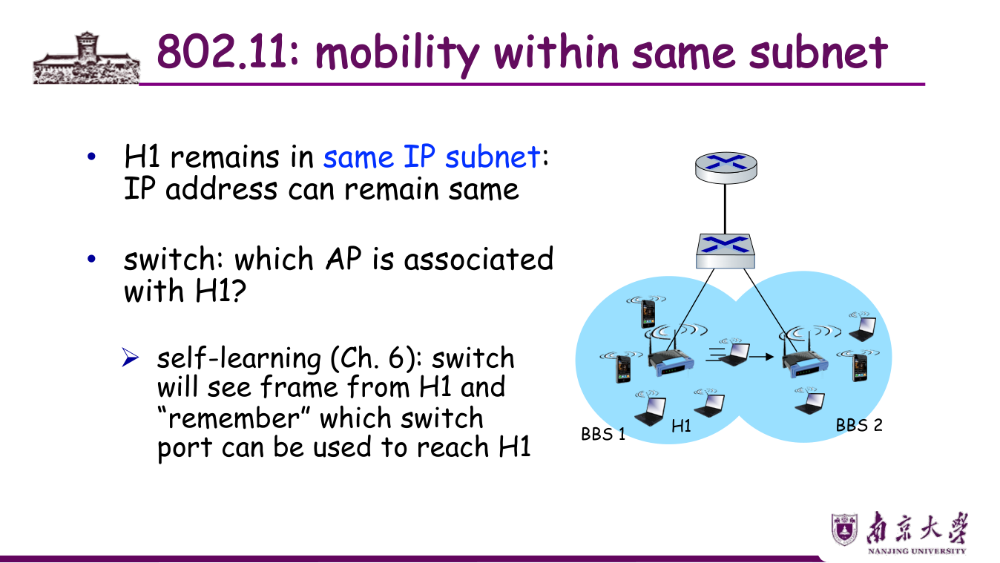

### 8.2 Rate Adaptation

无线信道质量会随距离、遮挡和干扰变化。

因此 AP 和移动主机会动态调整发送速率。

当 SNR 高时：

- 可以使用更高阶调制。
- 发送速率更高。

当 SNR 低时：

- 使用更稳健的调制和编码。
- 发送速率降低。

Rate adaptation 的目标是在吞吐量和可靠性之间取得平衡。

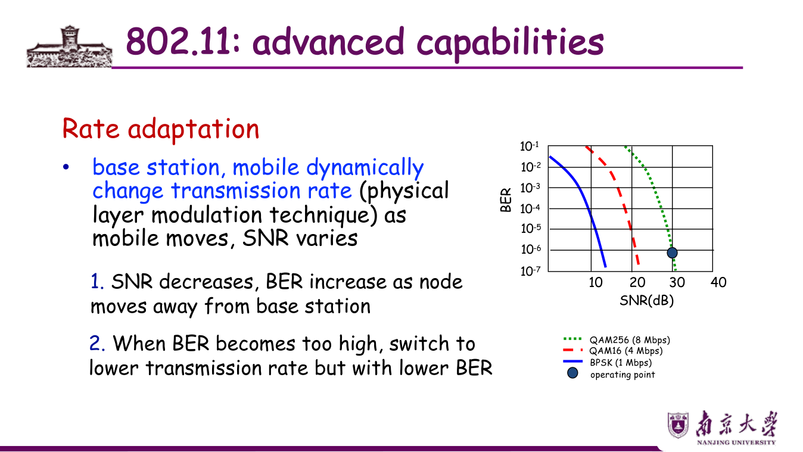

### 8.3 Power Management

移动设备非常关注电池消耗。

802.11 支持 power management。

基本思想：

- 设备告诉 AP 自己会睡眠到下一个 beacon。
- AP 暂存发往该设备的 frame。
- 设备在 beacon 前醒来。
- beacon 中包含哪些设备有缓存数据。
- 如果设备发现 AP 有自己的数据，就保持唤醒并接收。

这样可以减少无线网卡持续监听带来的能耗。

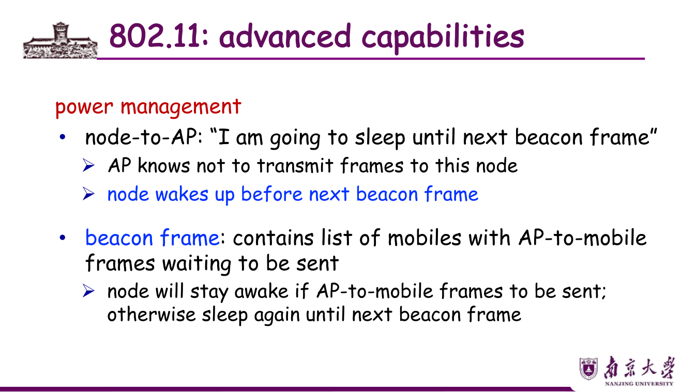

## 9. Bluetooth

### 9.1 Bluetooth 概览

Bluetooth 是个人区域网络技术。

典型覆盖范围小于 10 米。

它常用于替代线缆：

- 鼠标。
- 键盘。
- 耳机。
- 手柄。
- 车载音频。

Bluetooth 可以采用 ad hoc 方式组织，不依赖固定 AP。

多个蓝牙设备可以组成 piconet。

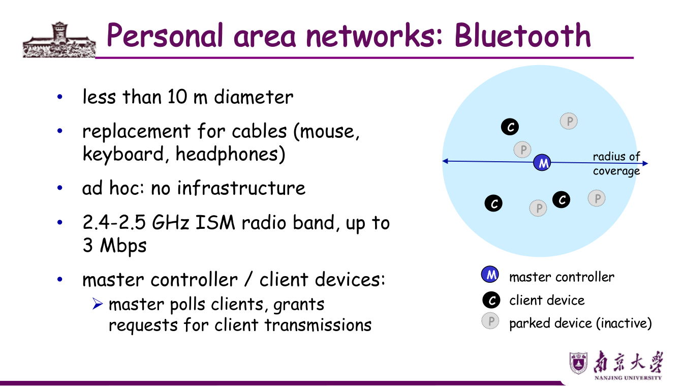

### 9.2 Bluetooth 的时频组织

Bluetooth 使用短时隙。

课件中给出：

- TDM：625 microsecond slot。
- FDM：在 79 个频率信道之间按伪随机顺序跳频。

跳频扩频有几个好处：

- 减少长期停留在受干扰频点上的概率。
- 降低和其他设备持续冲突的概率。
- 让同一区域内多个 piconet 可以共存。

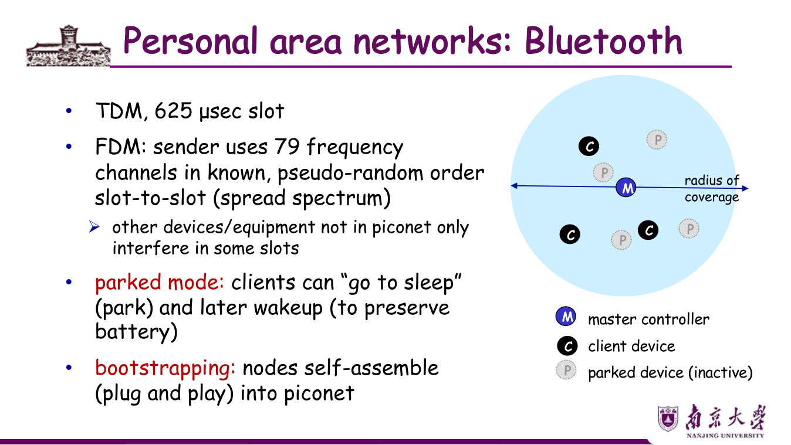

### 9.3 Bluetooth 和疫情接触通知

蓝牙还被用于移动设备之间的近距离发现。

疫情期间，许多接触通知系统使用手机蓝牙信号估计近距离接触。

这类应用体现了蓝牙的特点：

- 短距离。
- 低功耗。
- 不需要基础设施。
- 适合设备间近邻发现。

但它也面临隐私、测距精度、误报漏报等问题。

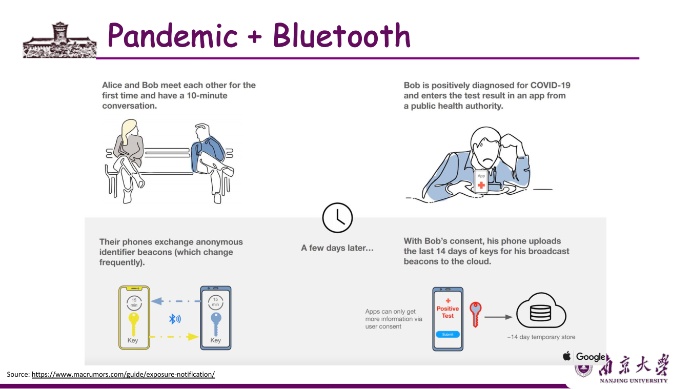

## 10. 4G/5G 蜂窝网络概览

### 10.1 蜂窝网络的目标

4G/5G 蜂窝网络是广域移动 Internet 的主要解决方案。

它和 WiFi 的差异在于：

- 覆盖范围更广。
- 由运营商统一部署和管理。
- 支持高速移动。
- 包含认证、计费、漫游和移动性管理。
- 需要在全球范围内互联。

移动宽带设备数量已经超过固定宽带设备。

蜂窝网络是一个大型、分层、跨运营商的网络系统。

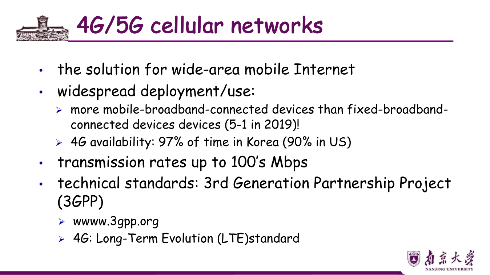

### 10.2 和有线 Internet 的相似性

蜂窝网络和有线 Internet 有相似之处：

- 都有 edge 和 core 的区分。
- 都承载 IP 数据。
- 都需要路由、转发和互联。
- 都是 network of networks。

但蜂窝网络也有特殊性：

- edge 和 core 通常属于同一运营商。
- 接入网络是无线的。
- 用户移动性是核心设计目标。
- 控制平面承担认证、位置管理和会话管理。

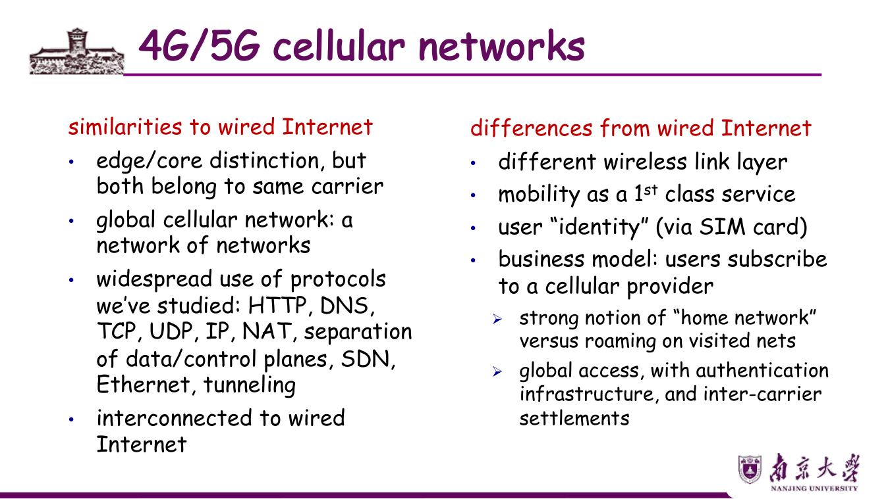

## 11. 4G LTE 架构

### 11.1 LTE 基本组件

4G LTE 架构包括：

- UE，User Equipment：移动设备。
- eNodeB：4G 基站。
- RAN，Radio Access Network：无线接入网络。
- EPC，Enhanced Packet Core：全 IP 核心网。

UE 通过无线链路接入 eNodeB。

eNodeB 连接到核心网，核心网再连接到 Internet 和其他运营商网络。

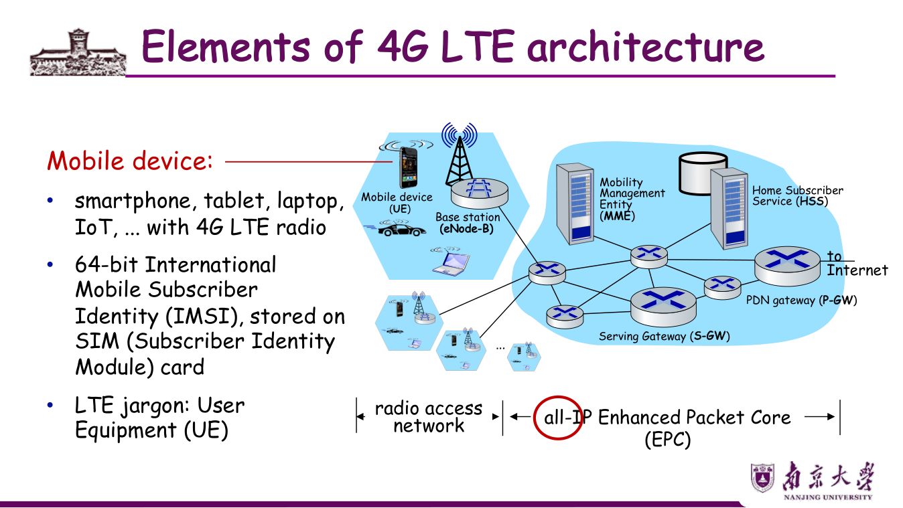

### 11.2 核心网组件

LTE 核心网中常见组件：

- MME，Mobility Management Entity。
- HSS，Home Subscriber Service。
- S-GW，Serving Gateway。
- P-GW，Packet Data Network Gateway。

MME 属于控制平面，负责移动性管理、认证、承载建立等。

HSS 保存用户签约信息和认证信息。

S-GW 和 P-GW 主要位于数据平面路径上，负责转发用户数据和连接外部 IP 网络。

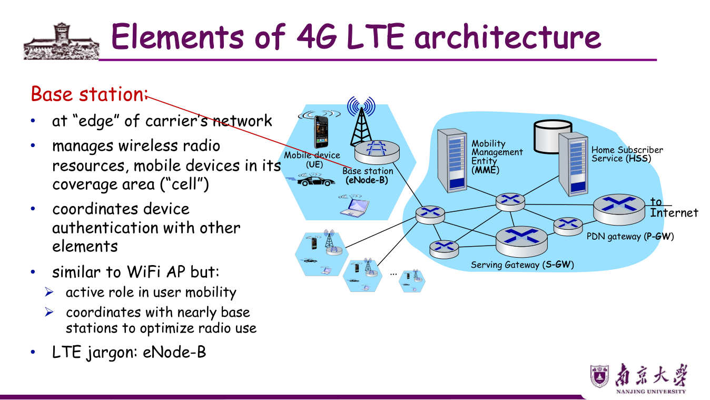

### 11.3 4G Radio Access Network

4G RAN 负责把 UE 连接到 eNodeB。

一个基站可以同时服务多个设备。

蜂窝网络可使用多种频段和多个信道。

常见频段包括：

- 600 MHz。
- 700 MHz。
- 850 MHz。
- 1500 MHz。
- 1700 MHz。
- 1900 MHz。
- 2100 MHz。
- 2600 MHz。

低频覆盖好，高频容量高但覆盖较短。

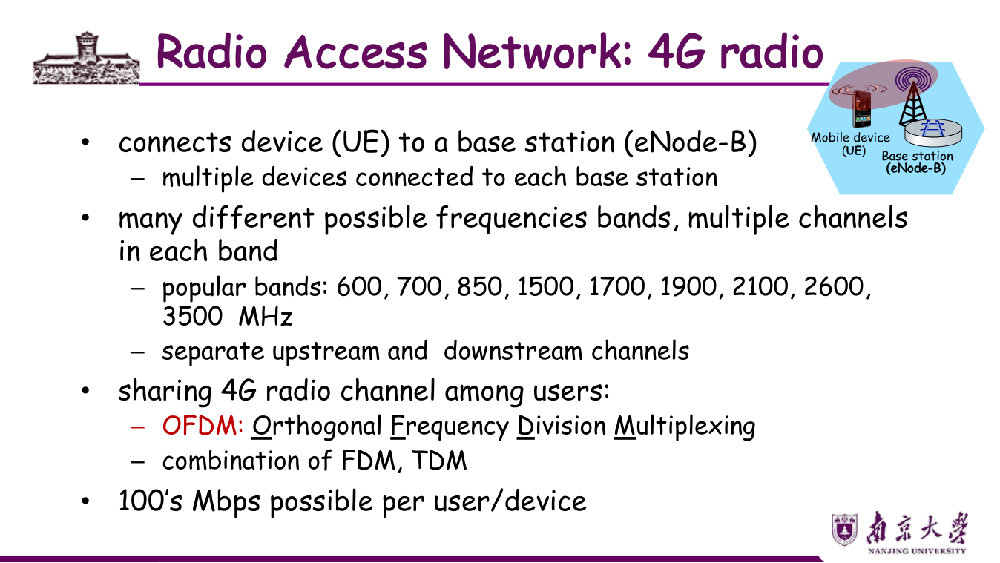

### 11.4 Spectrum

频谱是无线网络最重要的资源之一。

不同国家和地区会把不同频段分配给运营商、公共安全、卫星、WiFi、共享频谱等用途。

CBRS 是一种共享频谱机制示例。

频谱管理要在覆盖、容量、干扰、授权成本和公平使用之间权衡。

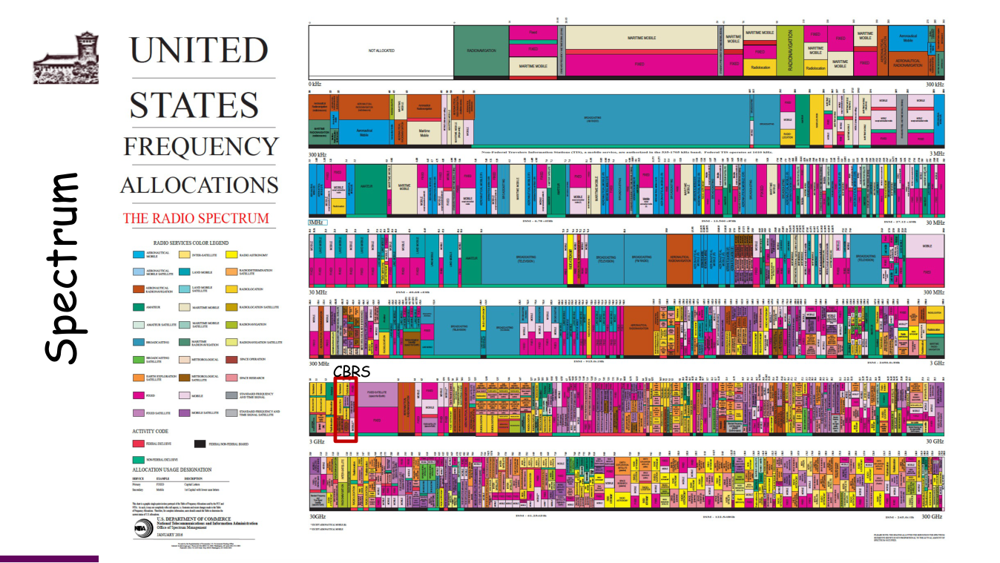

## 12. OFDMA 和 LTE 无线调度

### 12.1 OFDMA 基本思想

LTE 使用 OFDMA 作为下行多址技术。

OFDMA 把无线资源划分到：

- 频率维度：多个 subcarrier。
- 时间维度：多个 symbol。

调度器可以把不同时间-频率资源分配给不同用户。

这比简单 TDMA 或 FDMA 更灵活。

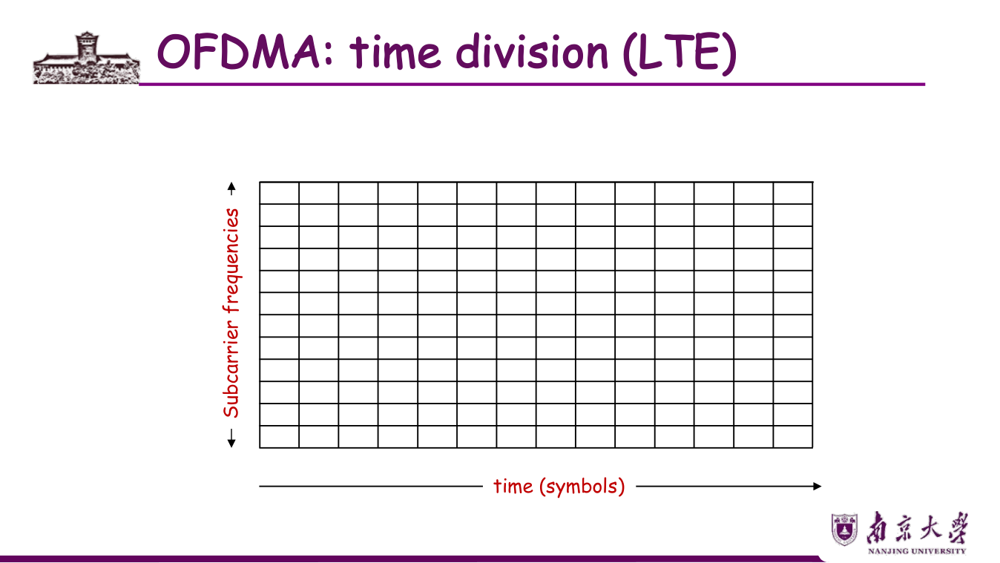

### 12.2 Physical Resource Block

Physical Resource Block，PRB，是 LTE 调度的基本资源单位。

课件中 PRB 由：

```text
7 symbols × 12 subcarrier = 84 resource elements
```

组成。

Resource element 是时间-频率网格中的一个小格。

调度器以 PRB 为单位决定某个用户在某个时间片可以使用哪些无线资源。

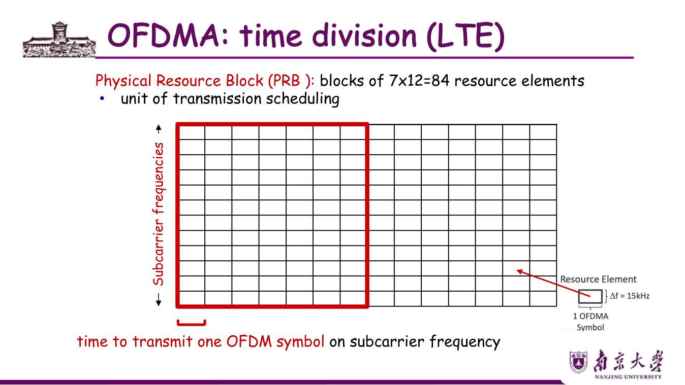

### 12.3 Transmission Time Interval

Transmission Time Interval，TTI，是调度周期。

LTE 中典型 TTI 为：

```text
1 ms
```

每个 TTI，基站调度器根据：

- 用户信道质量。
- 业务需求。
- QoS。
- 公平性。
- 当前负载。

决定资源分配。

这让蜂窝网络可以对不同用户进行细粒度、动态的无线资源调度。

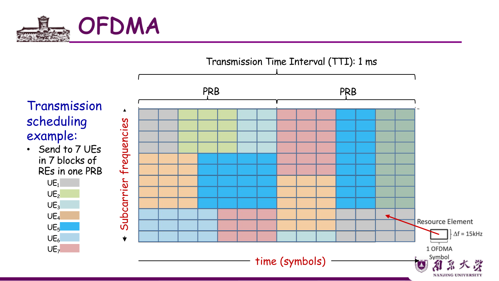

## 13. LTE 网络中的归属、访问与网关

### 13.1 Home Network

移动用户有自己的 home network。

Home network 保存用户身份、签约关系、认证信息和计费相关信息。

HSS 是 home network 中的重要组件。

当用户在其他网络接入时，访问网络也需要向 home network 查询用户是否合法。

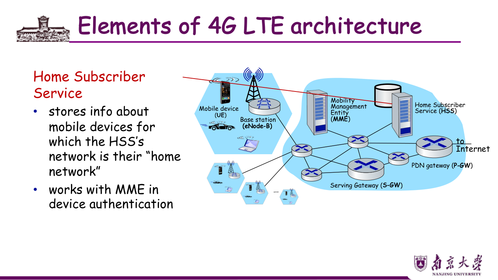

### 13.2 Visited Network

当用户进入另一个运营商或另一个区域的网络时，当前接入网络可视为 visited network。

Visited network 需要完成：

- 接入认证。
- 和 home network 交互。
- 为用户建立数据路径。
- 维护用户当前位置。

移动性管理的本质之一，就是让 home network 和 visited network 协作。

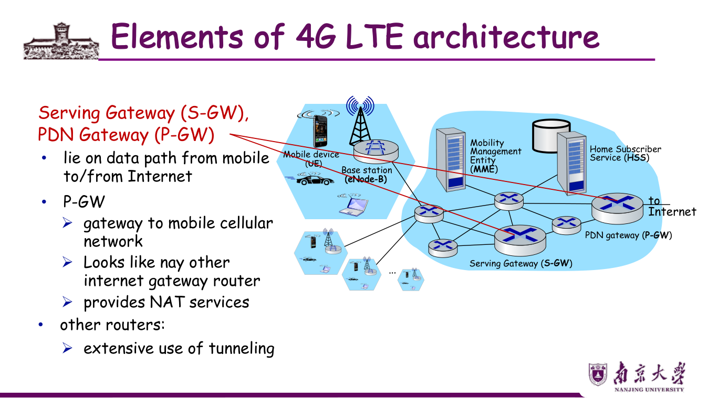

### 13.3 Internet Gateway

P-GW 是 LTE 连接外部 IP 网络的重要网关。

它负责：

- 给 UE 提供到 Internet 的出口。
- 作为用户 IP 会话的锚点。
- 和 S-GW 建立数据转发路径。
- 支持策略和计费控制。

从外部 Internet 看，移动设备的数据通常通过运营商核心网网关进出。

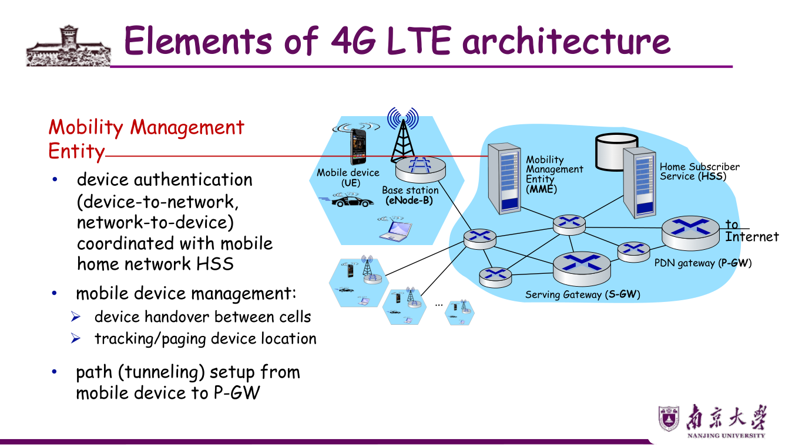

## 14. LTE 控制平面和数据平面

### 14.1 平面分离

LTE 明确区分控制平面和数据平面。

控制平面负责：

- 移动性管理。
- 安全。
- 认证。
- 会话建立。
- 承载管理。

数据平面负责：

- 用户 IP 数据转发。
- 隧道封装。
- 基站、S-GW、P-GW 之间的数据传输。

这种分离和前面网络层中 SDN 的思想有相似之处：控制逻辑和高速数据转发路径分工明确。

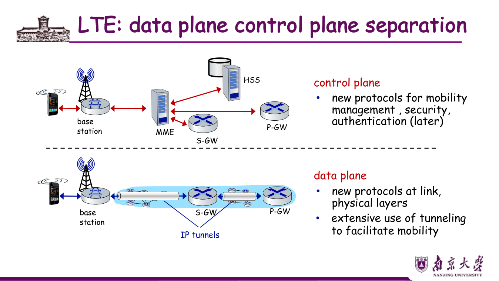

### 14.2 First Hop 协议栈

LTE 第一跳是 UE 到 eNodeB 的无线链路。

数据平面协议栈包括：

- IP。
- PDCP，Packet Data Convergence Protocol。
- RLC，Radio Link Control。
- MAC，Medium Access Control。
- Physical。

这些层共同处理：

- IP 分组承载。
- 加密和头部压缩。
- 可靠传输或重传。
- 无线资源访问。
- 物理层调制编码。

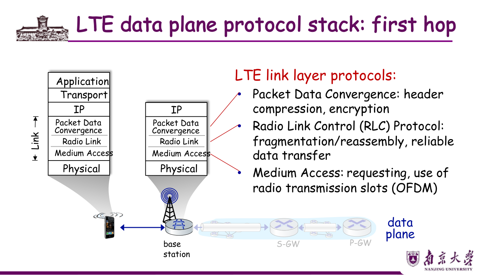

### 14.3 Packet Core 协议栈

在 packet core 中，用户数据通过隧道转发。

典型协议包括：

- GTP-U。
- UDP。
- IP。
- 链路层和物理层协议。

GTP-U 是 GPRS Tunneling Protocol User Plane。

它把用户 IP 数据封装在运营商核心网内部隧道中，从 eNodeB 经 S-GW、P-GW 转发。

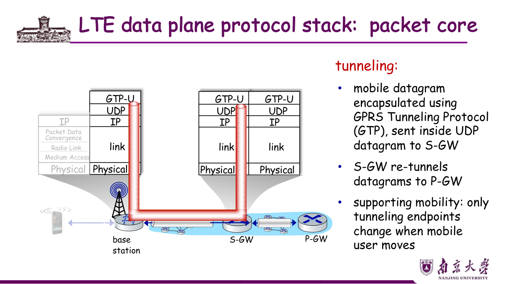

### 14.4 关联到基站

LTE 移动设备接入基站需要一系列步骤。

大致过程：

- 基站周期性广播同步信号。
- UE 扫描频率并发现基站。
- UE 选择合适基站。
- UE 和基站建立无线连接。
- 通过控制平面完成认证和承载建立。
- 数据平面路径被配置。

这比 WiFi association 更复杂，因为蜂窝网络还必须处理运营商身份、SIM、漫游和核心网状态。

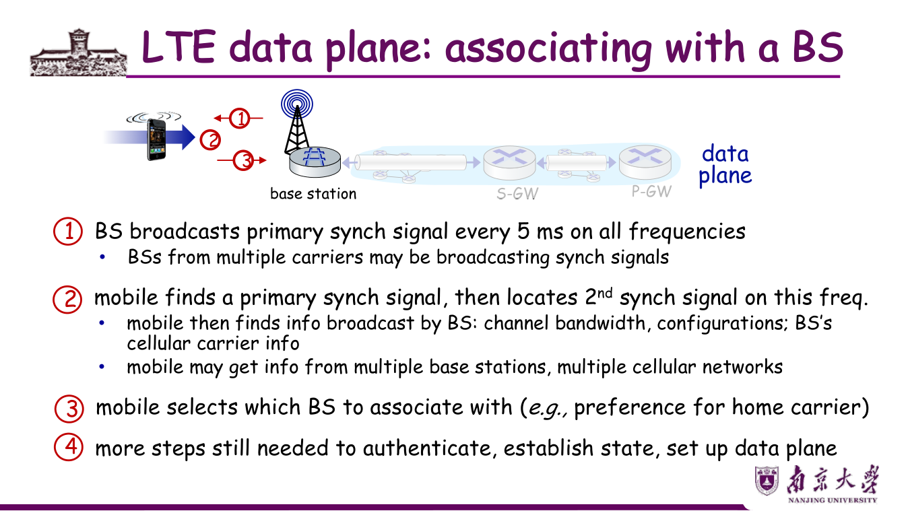

### 14.5 LTE Sleep Modes

和 WiFi、Bluetooth 一样，LTE 设备也需要省电。

设备在无活动后可以进入 sleep mode。

课件中提到：

- light sleep：几百毫秒不活动后进入。
- deep sleep：更长时间不活动后进入。

睡眠模式减少无线电持续开启的能耗。

但睡眠也带来代价：

- 唤醒需要时间。
- 下行数据可能需要等待 paging。
- 过度睡眠会增加交互延迟。

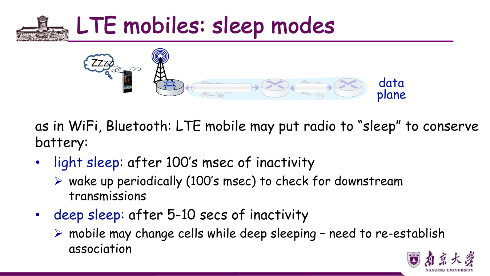

### 14.6 全球蜂窝网络

全球蜂窝网络是 IP 网络的网络。

它包括：

- home mobile carrier network。
- visited mobile carrier network。
- public Internet。
- inter-carrier IPX。

移动用户可以在不同运营商和不同国家之间漫游。

这要求网络之间能够交换认证、位置、计费和数据转发信息。

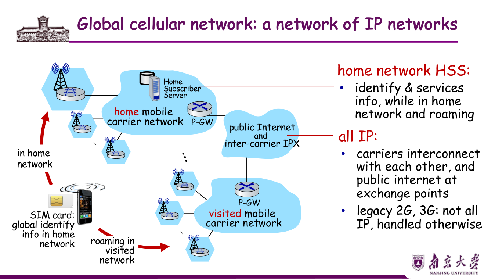

## 15. 5G

### 15.1 5G 的动机

5G 的早期部署重点是 enhanced Mobile Broadband。

但 5G 也被期待支持更多业务模式和使用场景：

- 大规模 IoT。
- 低时延高可靠通信。
- 工业控制。
- 车联网。
- AR/VR。
- 边缘计算。

与 4G 相比，5G 不只是更快的移动宽带，也试图成为面向多行业的通用连接平台。

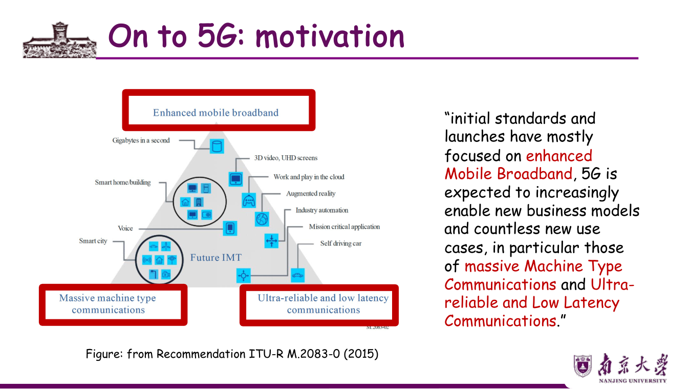

### 15.2 Industry Verticals

5G 面向多个行业垂直领域：

- Manufacturing。
- Construction。
- Transport。
- Healthcare。
- Smart city。
- Energy。

不同场景需要不同网络特性。

例如：

- 视频和 AR 需要高带宽。
- 工业控制需要低时延和高可靠性。
- 传感器网络需要低功耗和海量连接。

这推动 5G 引入网络切片、边缘计算和更灵活的控制架构。

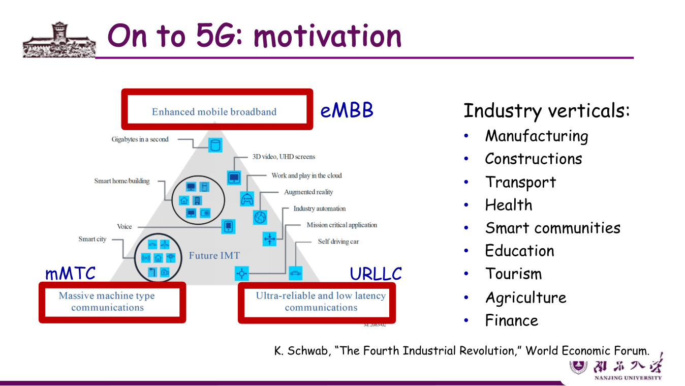

### 15.3 5G Radio

5G Radio 的目标包括：

- 峰值速率提升约 10 倍。
- 时延降低约 10 倍。
- 流量容量提升约 100 倍。

5G NR，New Radio，支持两个频率范围：

- FR1：450 MHz 到 6 GHz。
- FR2：24 GHz 到 52 GHz，毫米波频段。

毫米波带宽大，但路径损耗高、穿透能力弱，因此需要：

- 小基站密集部署。
- beamforming。
- Massive MIMO。

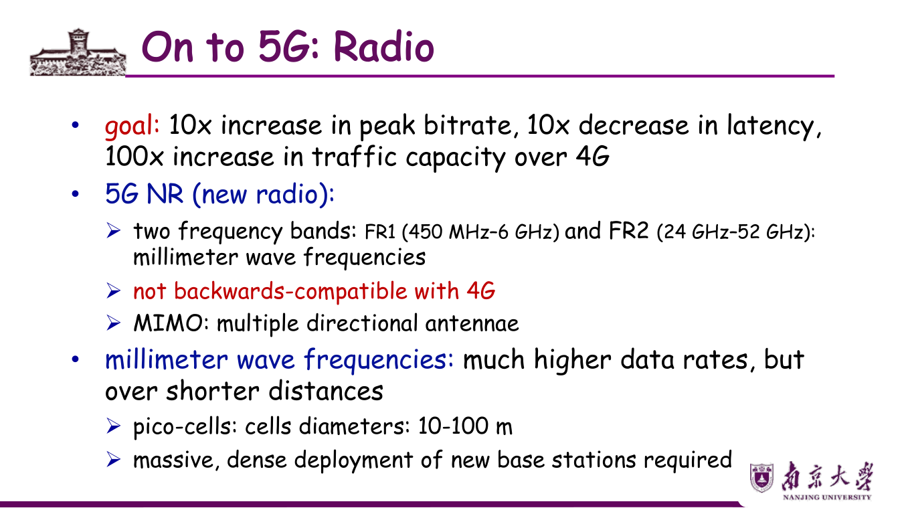

### 15.4 SDN-like Architecture

5G 架构更接近云化和微服务化。

与传统 LTE 相比，5G 更强调：

- 控制平面功能服务化。
- 用户平面功能可下沉到边缘。
- 网络功能虚拟化。
- SDN 控制。
- 网络切片。

这种架构让运营商可以为不同应用定制逻辑网络。

例如，一个低时延工业应用可以使用靠近工厂的边缘用户平面功能。

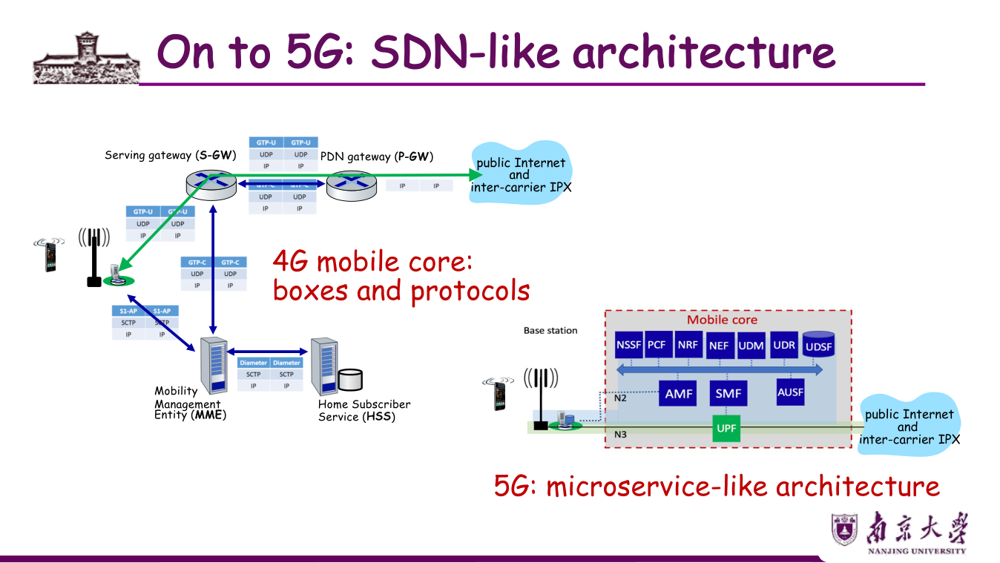

### 15.5 通信、计算和数据资源

5G 网络不仅是通信网络，也和计算、数据资源结合。

图中可以看到：

- UE。
- RAN。
- far edge DC。
- regional DC。
- central DC。

应用可以部署在不同位置。

越靠近用户：

- 时延越低。
- 资源更有限。

越靠近中心：

- 计算和存储更强。
- 时延更高。

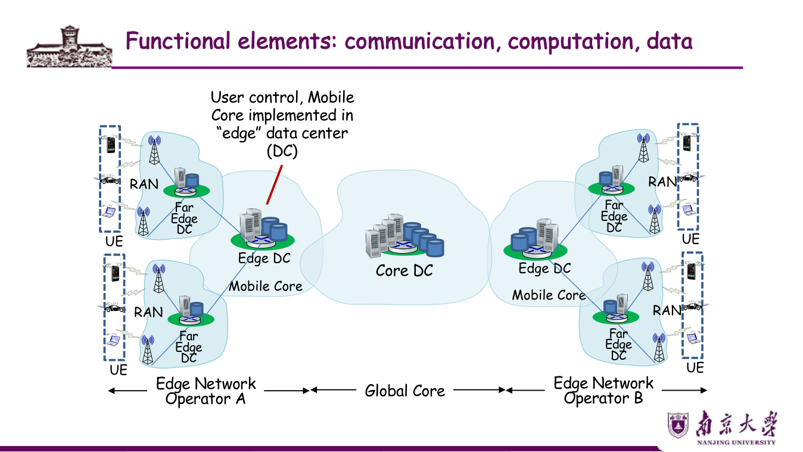

### 15.6 Control Plane：资源控制

控制平面负责资源控制。

它决定：

- 哪些资源分配给哪些用户。
- 哪些应用使用哪些网络切片。
- 用户平面功能部署在哪里。
- 如何根据负载和策略调整路径。

5G 中控制平面更像云平台中的编排系统。

它不仅管理连接，也管理通信、计算和数据资源之间的关系。

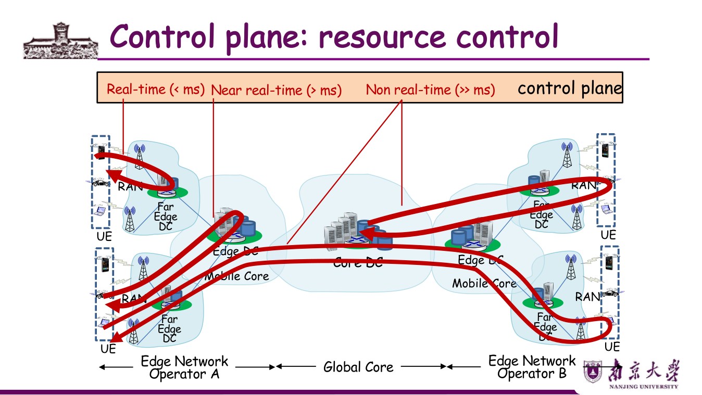

### 15.7 User Plane：用户使用资源

用户平面承载应用实际数据。

资源可能分布在：

- RAN。
- edge data center。
- regional data center。
- central cloud。

不同应用的数据路径可能不同。

例如：

- 普通 Web 流量走公网出口。
- 低时延工业控制走本地边缘。
- 视频业务可能使用边缘缓存。

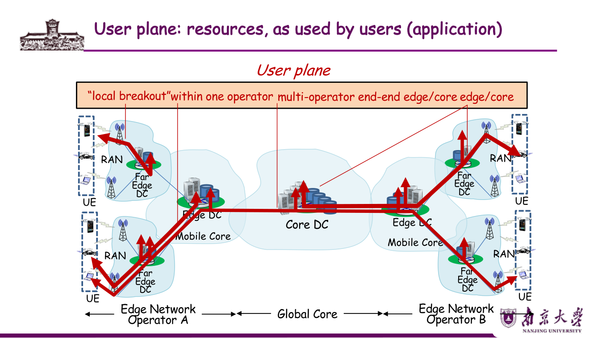

### 15.8 Beyond 5G

课件中提到，未来不一定只用“6G”命名，也常见 NextG、Beyond 5G 等说法。

重要趋势包括：

- 网络继续演进，而不是完全替换。
- SDN、云化和自动化让新功能可以持续部署。
- 企业专网和边缘云推动自下而上的定制。
- 通信、计算、AI 和感知可能进一步融合。

可以把 5G/NextG 看成蜂窝网络向可编程、云化、业务定制平台演进的过程。

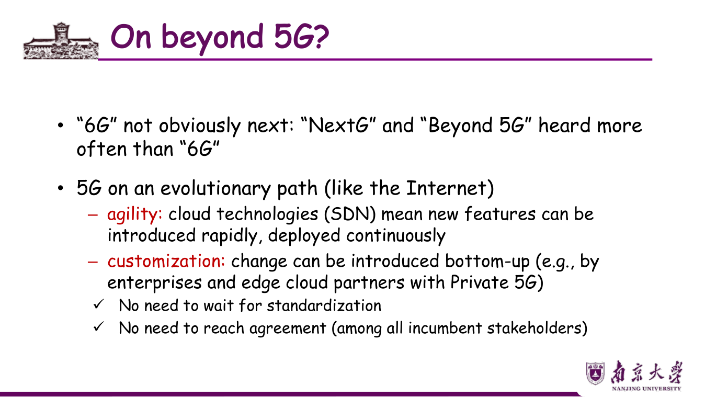

## 16. 移动性问题

### 16.1 什么是 Mobility

从网络视角看，移动性有不同程度。

无移动性：

- 设备一直在同一网络。
- IP 地址和网络位置稳定。

低移动性：

- 设备移动到其他网络，但断开或关机。
- 重新接入时获得新地址。

高移动性：

- 设备在网络之间移动，同时保持连接。
- 正在进行的 TCP 连接、应用会话希望不中断。

真正困难的是最后一种：移动节点改变网络位置，但通信仍要继续。

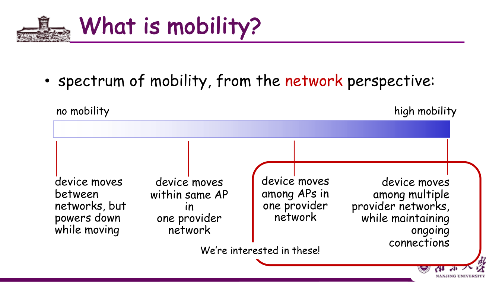

### 16.2 移动性挑战

IP 地址同时承担两种角色：

- 身份标识：你是谁。
- 位置标识：你在哪个网络。

传统 IP 路由根据地址前缀转发。

如果设备从一个网络移动到另一个网络：

- 它的原 IP 前缀不再匹配当前位置。
- 其他主机仍可能把分组发往原网络。
- 路由系统需要知道新的位置。

核心问题是：

```text
网络如何把发往移动节点的分组转发到它当前所在网络？
```

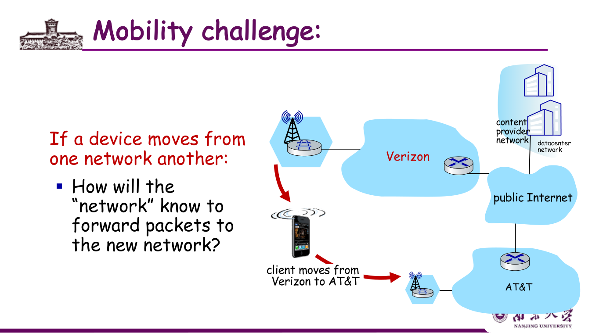

## 17. 移动性方案

### 17.1 让网络路由处理移动性

一种思路是让路由器直接处理移动性。

每个移动节点的位置通过常规路由表交换传播。

这样所有路由器都可以知道：

```text
移动节点当前在哪个网络
```

理论上，Internet 路由可以做到这一点，因为最长前缀匹配可以指向任何位置。

但问题是规模：

- 移动节点数量巨大。
- 移动位置变化频繁。
- 路由表会爆炸。
- 路由更新会非常频繁。

因此 Internet 不采用“每个移动节点都进入全局路由”的方式。

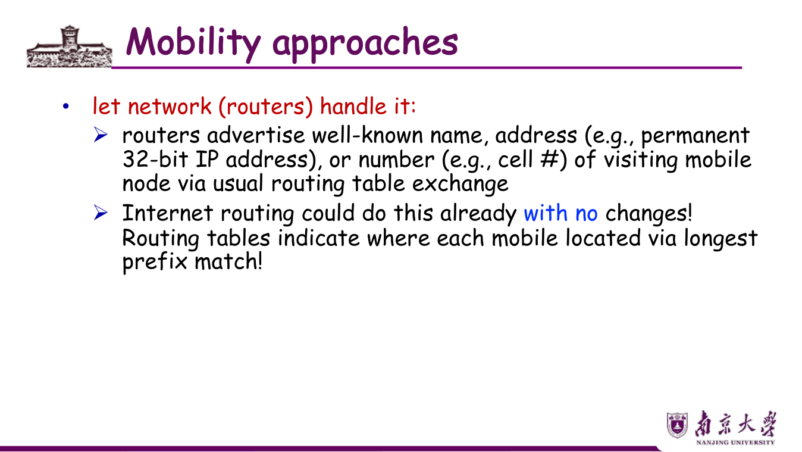

### 17.2 让端系统处理移动性

另一种思路是让端系统或边缘系统处理移动性。

网络核心尽量保持不变。

移动节点可以拥有：

- permanent address：永久地址。
- care-of address：当前位置地址。

其他组件负责把永久地址和当前位置联系起来。

这样全局路由不需要知道每个移动节点的位置。

移动性被限制在主机、归属网络、访问网络和特定移动性管理实体之间处理。

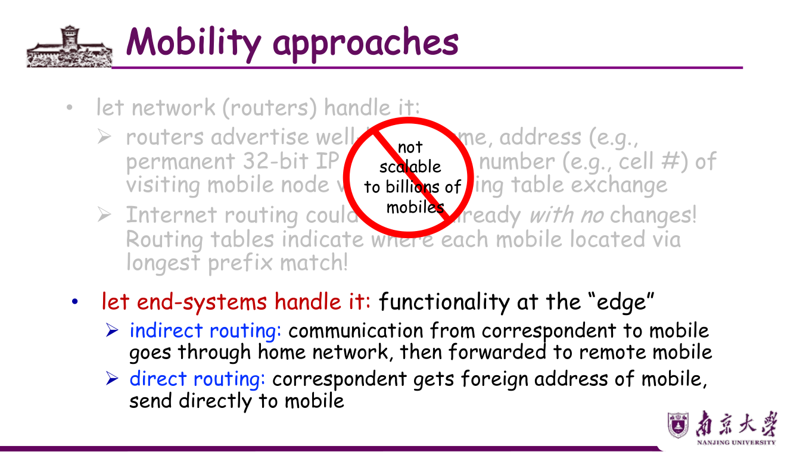

### 17.3 通讯录类比

课件用“找搬家的朋友”作类比。

如果 Alice 经常搬家，你要联系她，可以有几种方式：

- 搜索所有电话簿。
- 让 Alice 主动告诉你新地址。
- 通过她的固定联系人或家乡地址转接。

移动网络中的 home network 就像固定联系人。

它知道移动节点当前在哪里，或者能帮助通信方找到移动节点。

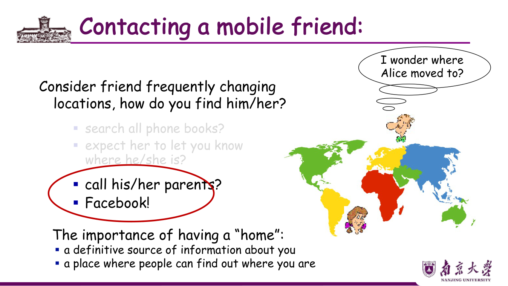

### 17.4 Home Network 和 Visited Network：蜂窝网络

在 4G/5G 中：

- home network 是用户签约的运营商网络。
- visited network 是用户当前接入的网络。

用户漫游到 visited network 后，visited network 需要和 home network 交互。

home network 负责确认用户身份和服务权限。

visited network 负责提供本地接入和转发路径。

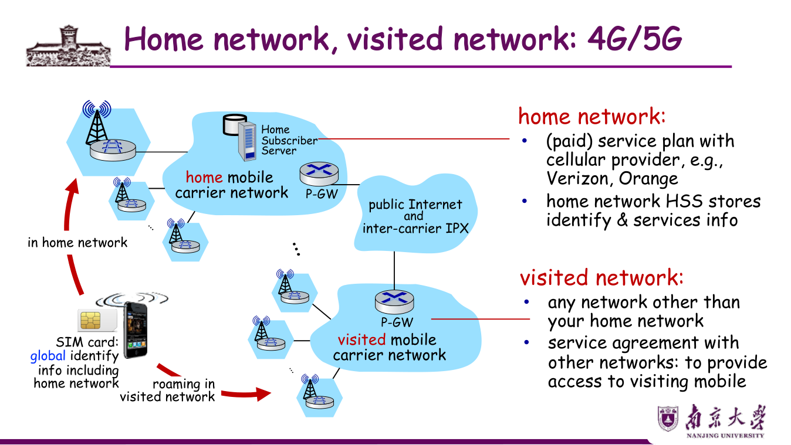

### 17.5 Home Network 和 Visited Network：ISP/WiFi

类似思想也可以用于 ISP/WiFi 场景。

用户可能有：

- 归属网络。
- 访问网络。
- 认证服务器。
- 接入网关。

访问网络可以通过认证基础设施确认用户身份，并决定是否允许接入。

这和校园网、运营商 WiFi、企业 VPN 等场景中的认证和访问控制有相似之处。

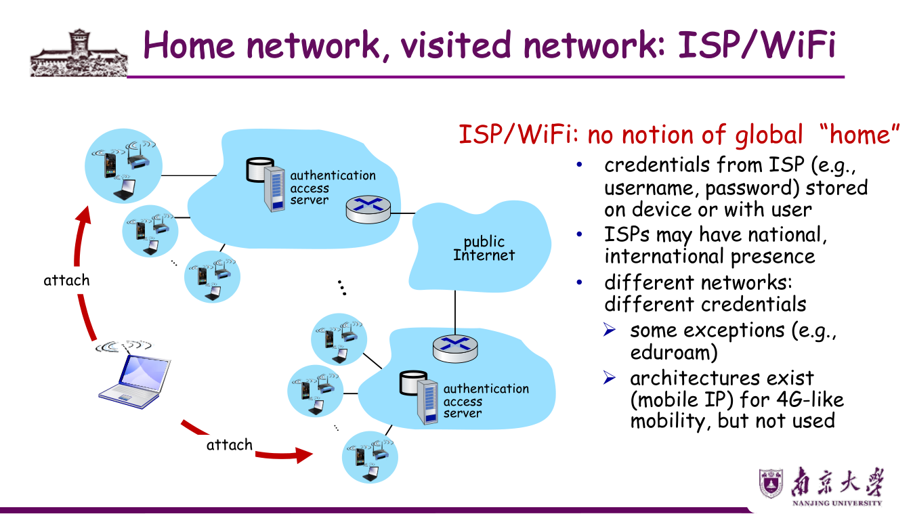

### 17.6 Generic Mobility 架构

通用移动性模型包含：

- mobile node。
- correspondent。
- home network。
- home agent 或 home gateway。
- visited network。
- visited network gateway。

移动节点有永久地址。

当它访问其他网络时，会获得当前位置相关地址或接入点。

home agent 负责维护永久地址到当前位置的映射。

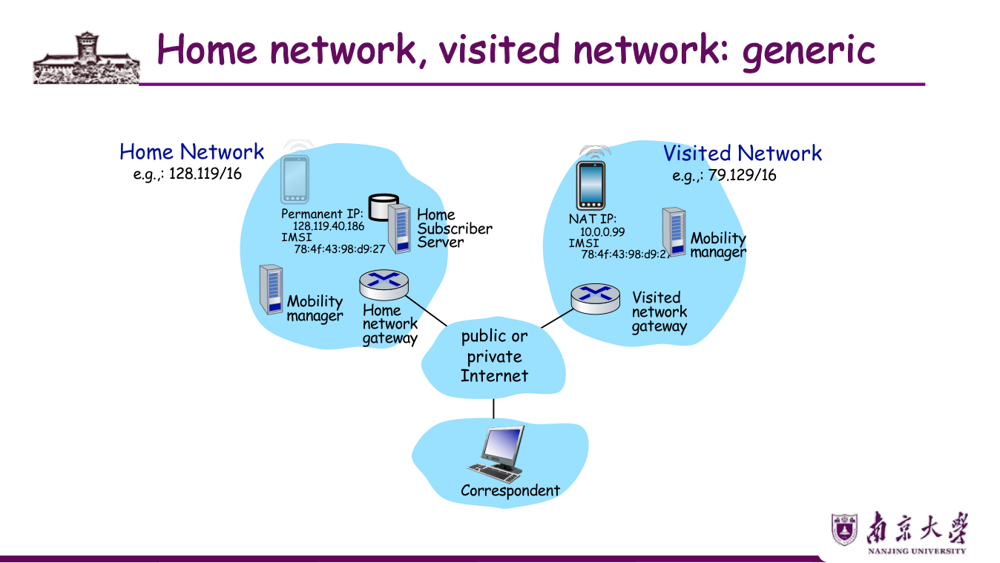

### 17.7 Registration

移动节点进入 visited network 后，home network 必须知道它在哪里。

Registration 的作用是更新映射：

```text
permanent address -> current location / care-of address
```

注册过程通常涉及：

- 移动节点。
- visited network。
- home network。
- 移动性管理实体。

没有注册，发往永久地址的分组只能到达 home network，无法继续找到移动节点。

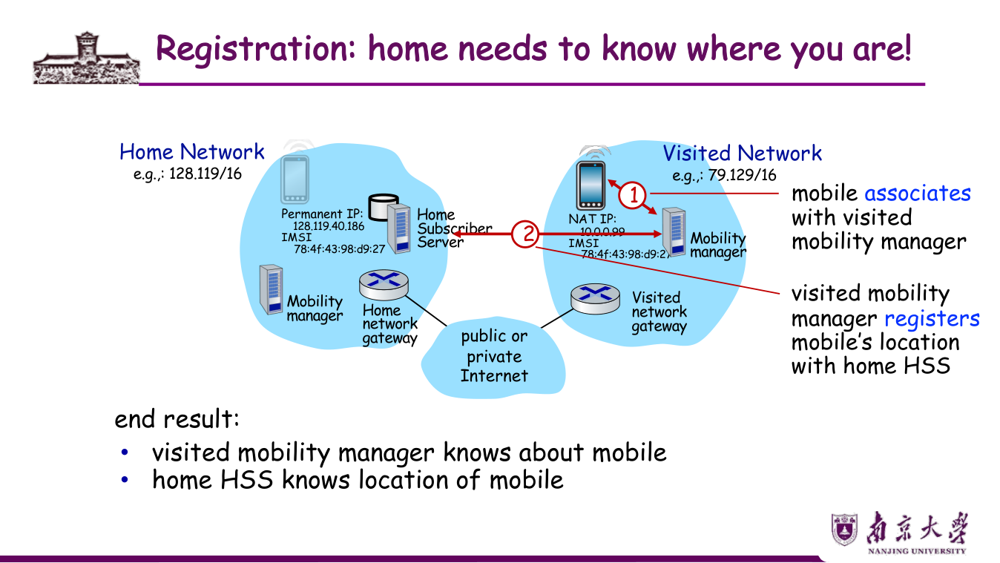

## 18. Indirect Routing

### 18.1 基本过程

Indirect routing 中，通信方不需要知道移动节点当前在哪里。

过程：

1. Correspondent 把分组发往移动节点永久地址。
2. 分组按普通 IP 路由到 home network。
3. Home agent 知道移动节点当前 visited network。
4. Home agent 把分组转发或隧道到 visited network。
5. Visited network 把分组交付给移动节点。

对 correspondent 来说，移动性是透明的。

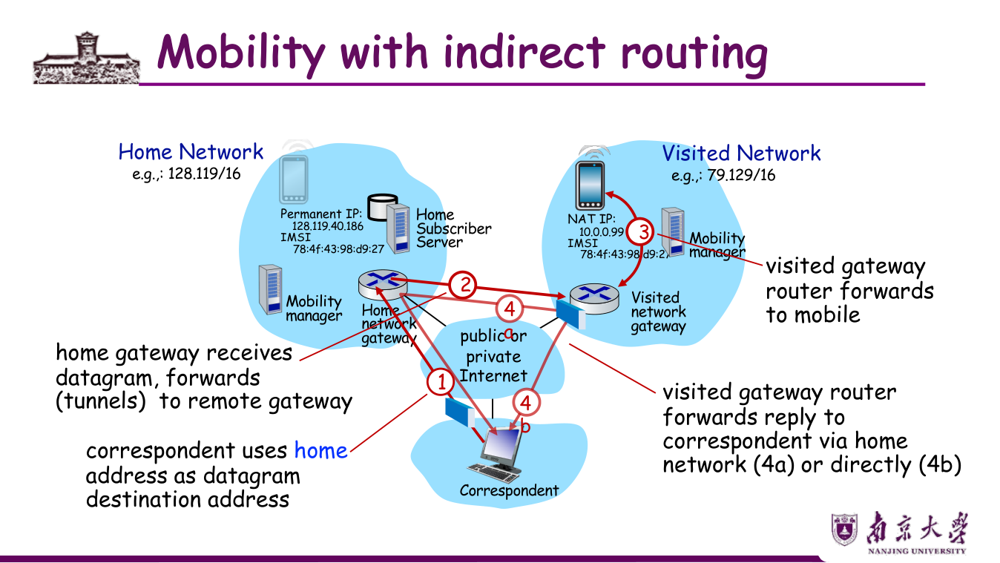

### 18.2 Indirect Routing 的特点

优点：

- correspondent 不需要修改。
- 移动节点换 visited network 时，只需向 home network 更新注册。
- 正在通信的对端不必感知移动。

缺点：

- triangle routing。
- 分组可能绕路经过 home network。
- 如果 correspondent 和 mobile node 在同一 visited network，绕路尤其低效。
- home agent 可能成为瓶颈或单点。

Indirect routing 用透明性换取路径效率。

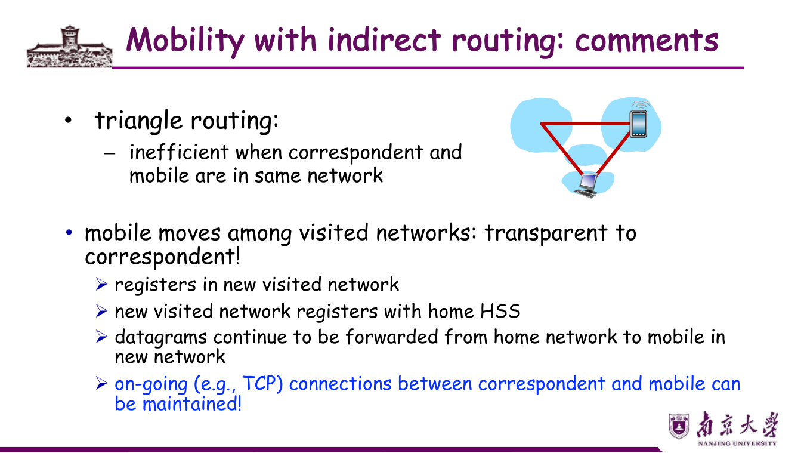

## 19. Direct Routing

### 19.1 基本过程

Direct routing 中，correspondent 会获得移动节点当前位置。

过程：

1. Correspondent 联系 home agent。
2. Home agent 返回 mobile node 的 care-of address。
3. Correspondent 直接把分组发往 visited network。
4. Visited network 把分组交付给 mobile node。

这样可以避免 triangle routing。

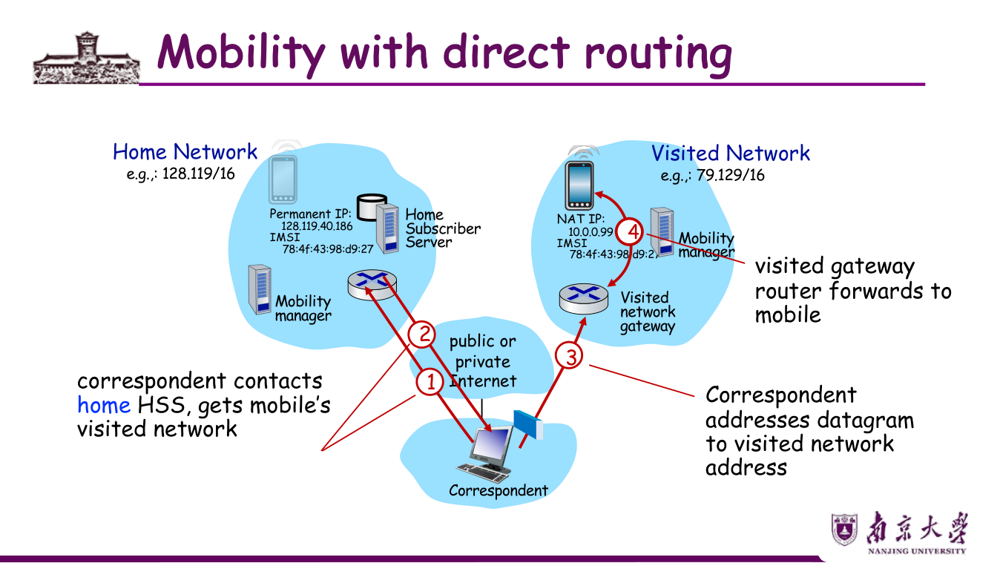

### 19.2 Direct Routing 的特点

优点：

- 路径更直接。
- 避免所有数据都绕经 home network。
- 效率更高。

缺点：

- 对 correspondent 不透明。
- correspondent 必须知道或查询 care-of address。
- 如果 mobile node 再次移动，correspondent 需要更新位置。
- 正在通信时切换 visited network 会更复杂。

Direct routing 用更多端系统参与换取更好的路径效率。

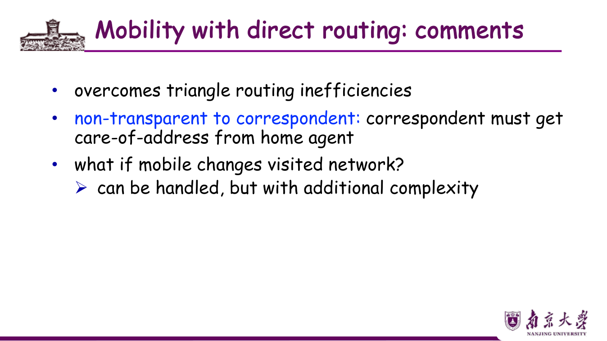

## 20. 4G 网络中的移动性

### 20.1 主要移动性任务

4G 网络中的移动性包括多个任务：

- 发现和选择基站。
- 建立控制平面连接。
- 用户认证。
- 配置数据平面隧道。
- 维护移动节点位置。
- 基站间 handover。
- 在移动时保持数据会话。

这些任务由 UE、基站、MME、S-GW、P-GW、HSS 等组件协同完成。

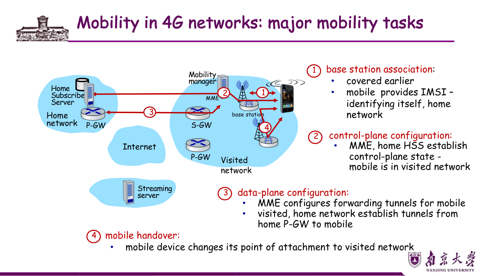

### 20.2 配置 LTE 控制平面元素

移动设备通过基站的控制平面信道与本地 MME 通信。

MME 使用移动设备的 IMSI 信息联系 home HSS。

HSS 返回：

- 认证信息。
- 用户签约信息。
- 服务权限。

MME 完成认证后，继续配置承载和移动性相关状态。

控制平面先建立好，数据平面才可以稳定传输用户数据。

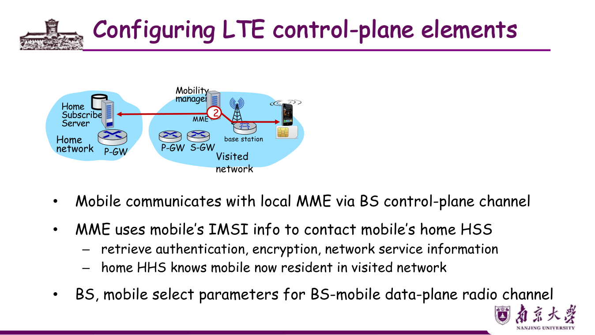

### 20.3 配置数据平面隧道

LTE 数据平面通过隧道把 UE 的 IP 数据接入 Internet。

典型路径：

```text
UE -> base station -> S-GW -> P-GW -> Internet
```

基站、S-GW、P-GW 之间需要建立 GTP-U 隧道。

这些隧道让核心网可以在移动设备切换基站时，重新调整内部路径，同时尽量保持用户 IP 会话不变。

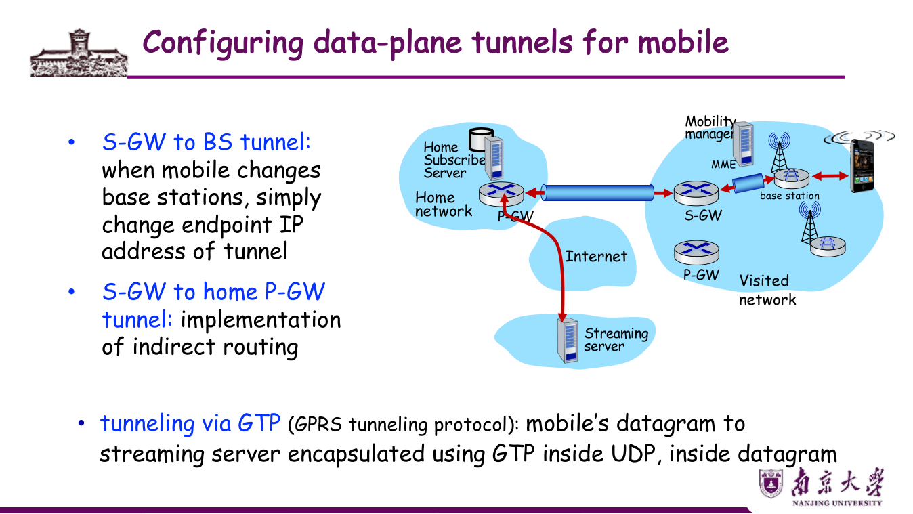

### 20.4 同一蜂窝网络中的 Handover

Handover 是移动设备从一个基站切换到另一个基站。

触发原因：

- 设备移动导致源基站信号变弱。
- 目标基站信号更强。
- 负载均衡。
- 无线质量变化。

切换过程涉及：

- source BS。
- target BS。
- MME。
- S-GW。
- UE。

目标是让移动设备继续通信，同时把无线接入和数据路径迁移到新基站。

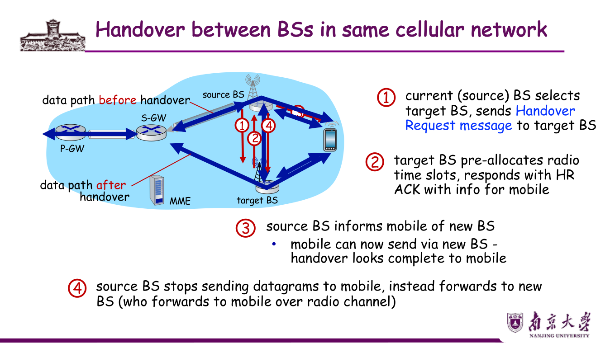

### 20.5 Handover 后续步骤

Handover 过程中可能发生：

- source BS 请求 target BS 准备资源。
- target BS 确认可以接入。
- UE 切换到 target BS。
- target BS 通知 MME。
- S-GW 更新转发路径。
- source BS 清理旧状态。

为了减少丢包，source BS 可能把尚未交付的数据转发给 target BS。

Handover 是移动网络复杂性的集中体现：它同时涉及无线测量、资源预留、路径更新和状态迁移。

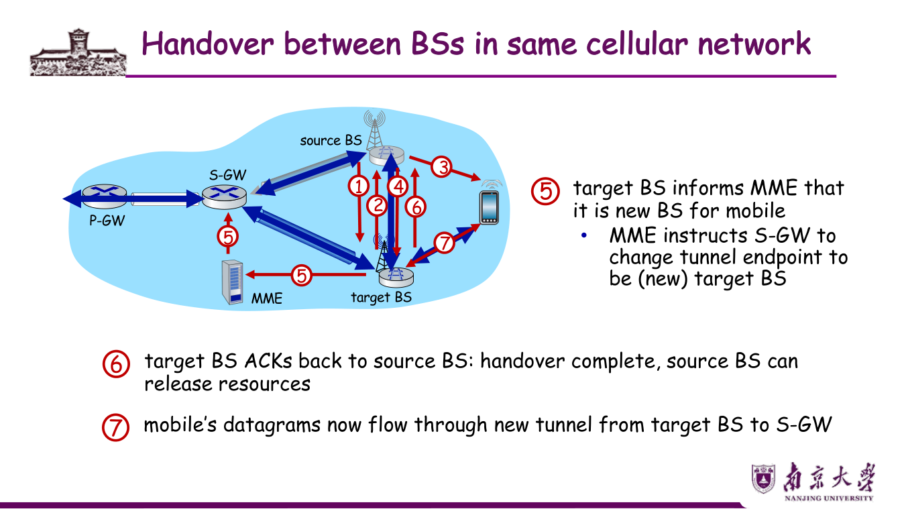

## 21. Mobile IP

### 21.1 Mobile IP 的定位

Mobile IP 是较早标准化的 IP 层移动性架构。

课件提到：

- 大约 20 年前标准化。
- 早于智能手机和 4G 的普及。
- 没有大规模部署使用。

Mobile IP 的基本概念包括：

- home agent。
- foreign agent。
- permanent address。
- care-of address。
- tunneling。

它提供了理解移动性问题的经典模型，但现实移动互联网更多依赖蜂窝网络自身的移动性管理、应用层机制和运营商核心网。

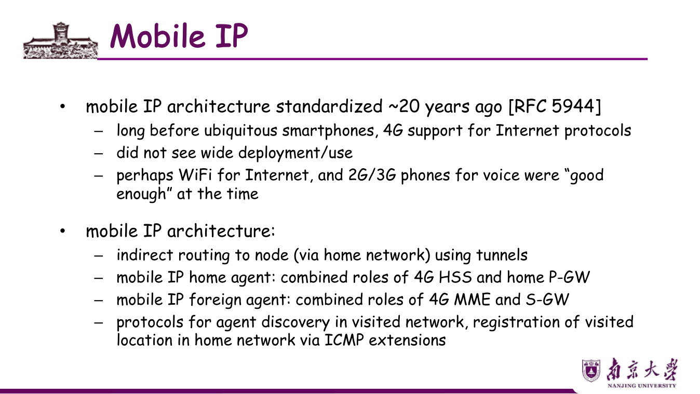

## 22. 对高层协议的影响

### 22.1 逻辑上影响应当很小

从协议分层角度看，无线和移动性不应该改变高层协议的基本语义。

原因：

- Internet 仍然提供 best-effort 服务。
- IP 仍然转发 datagram。
- TCP 和 UDP 仍然可以运行在无线链路上。
- 应用层仍然通过 socket 通信。

因此，逻辑接口保持稳定。

### 22.2 性能上影响很大

虽然逻辑接口稳定，但性能会受到明显影响。

无线和移动性会带来：

- bit error 导致分组丢弃。
- 链路层重传导致延迟增加。
- handover 导致短暂中断。
- 带宽随无线质量变化。
- RTT 波动更大。
- TCP 可能把无线丢包误判为拥塞。

TCP 原本把丢包主要解释为拥塞信号。

但在无线网络中，丢包可能来自误码或切换。

这会导致 TCP 不必要地降低发送速率。

因此实际系统常结合：

- 链路层重传。
- FEC。
- rate adaptation。
- split connection 或代理机制。
- 更适合移动场景的拥塞控制。
- 应用层自适应码率。

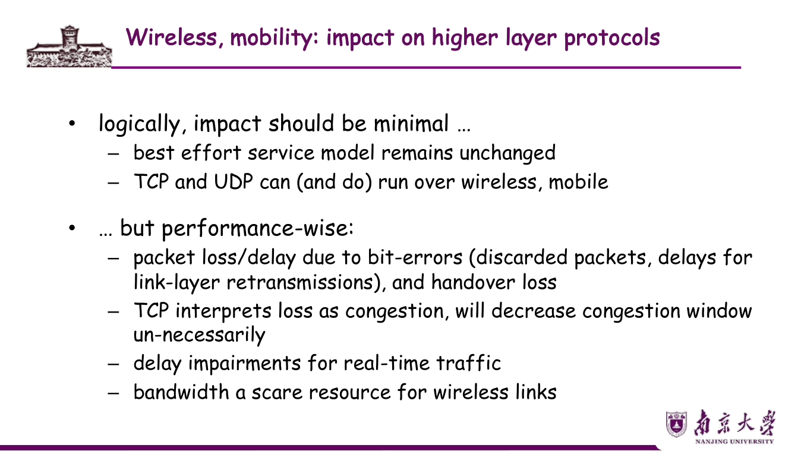

## 23. 本章小结

本章把网络从有线、固定链路扩展到无线和移动场景。

最重要的主线是：

- 无线网络由无线主机、基站、无线链路和有线基础设施组成。
- Infrastructure mode 依赖 AP 或基站接入网络，ad hoc mode 没有固定基础设施。
- 无线链路会受到路径损耗、多径、噪声、干扰和隐藏终端影响。
- SNR 决定接收方从噪声中恢复信号的难度，也影响可用速率。
- CDMA 通过给用户分配 code，让多个用户在同一频段同时发送。
- 802.11 WLAN 由 AP 和 BSS 组织，主机通过扫描和 association 接入 AP。
- WiFi 使用 CSMA/CA，因为无线发送方难以像 Ethernet 那样检测碰撞。
- RTS/CTS 用短控制帧预约信道，可以缓解隐藏终端和长帧碰撞代价。
- 802.11 frame 使用多个地址字段表达无线链路端点和有线侧转发目标。
- WiFi 同子网移动主要由链路层和交换机自学习处理。
- Bluetooth 是短距离个人区域网络，使用 TDM 和跳频等机制。
- 4G/5G 蜂窝网络是广域移动 Internet 的主要基础设施。
- LTE 包含 UE、eNodeB、RAN、EPC、MME、HSS、S-GW、P-GW 等组件。
- LTE 控制平面负责认证、移动性和承载管理，数据平面负责用户 IP 数据转发。
- OFDMA 把无线资源划分成时间-频率网格，PRB 是 LTE 调度基本单位。
- 5G 目标包括更高速率、更低时延、更大容量，并引入云化、SDN-like 和边缘计算架构。
- 移动性挑战来自 IP 地址同时表示身份和位置。
- Indirect routing 对通信方透明，但可能产生 triangle routing。
- Direct routing 路径更优，但要求通信方知道 care-of address，移动时更复杂。
- 4G 移动性通过注册、控制平面配置、数据平面隧道和 handover 实现。
- 无线和移动性逻辑上不改变 TCP/UDP/IP，但会显著影响性能和时延。

