# 第七章

## 个人总结

+ 基本术语：
  + **记忆单元（存储单元/存储元位元）（Cell）**：具有两种稳态的能够表示二进制数码0和1的物理器件
  + **存储单元/编址单元（Addressing Unit）**：具有相同地址的位构成一个存储单元，也称为一个编址单位
  + **存储体/存储矩阵/存储阵列**（Bank）：所有存储单元构成一个存储阵列
  + **编制方式（Addressing Mode）**：按字节编址、按字编址
  + **存储器地址寄存器（MAR）**：用于存放著储存单元地址的寄存器
  + **存储器数据寄存器（MDR）**：用于存放主存单元中的数据的寄存器
+ 分类：
  + **随机存取存储器（RAM）**
  + **顺序存取存储器（SAM）**
  + **直接存取存储器（DAM）**
  + **相联存储器（AM）**
+ **内存：**
  + 属于**易失性存储器（volatie）**，用于临时存放正在运行的程序和数据
  + 存取速度快
  + 成本高，容量相对较小
  + 直接与CPU链接，CPU对内存中可直接进行读写操作
+ **外存：**
  + 存取速度慢
  + 成本低，容量很大
  + 不与CPU直接相连，先传到内存，再被使用
  + 属于**非易失性存储器**

+ 性能指标：
  + 按字节连续编址
  + 存储容量
  + 存取时间TA
  + 存储周期TMC

+ 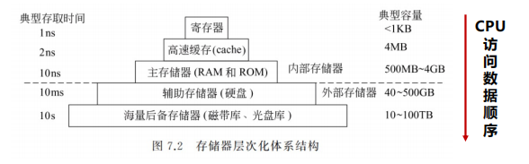

+ 数据一般只在相邻层之间复制传输，而且总是从慢速存储器复制到快速存储器。

+ DRAM的一个重要特点是，数据以电荷的形式保存在电容中，电容的放电使得电荷通常只能维持几十个毫秒左右，相当于1M个时钟周期左右，因此要定期进行刷新（读出后重新写回），按行进行（多有芯片中的同一行一起进行），刷新操作所需时间通常只占1%~2%
+ 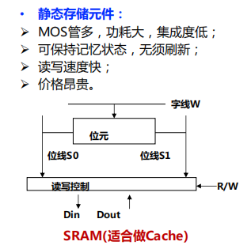

+ 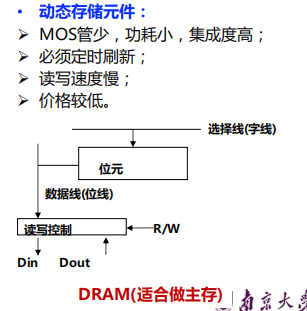

+ CPU和主存之间有**同步**和**异步**两种通信方式
+ **存储器芯片的扩展**：
  + 字扩展（位数不变、扩充容量）
  + 位扩展（字数不变，位数扩展）
  + 字位同时扩展
+ 多模块技术：2个、4个或多个存储器同时工作
+ **条件**：当所有存储模块**一次并行读写的总位数等于存储器总线数据位数**时，采用同时启动方式效率更高
+ **条件**：若每个存储模块**一次读写位数等于总线数据位数**（如模块每次读写1字节，总线宽度为4字节），则需采用轮流启动方式

---

# 第七章存储器层次结构总结

## 1. 存储器的分类、主存储器的组成和基本操作、存储器的层次化结构

**存储器的分类**：

存储器可根据多种特性分类：

- **按工作性质/存取方式**：随机存取存储器（RAM）、顺序存取存储器（SAM）、直接存取存储器（DAM）、相联存储器（CAM）。RAM 的访问时间与位置无关，但现代 DRAM 可能因行缓冲而略有差异。
- **按存储介质**：半导体存储器（如 SRAM、DRAM）、磁表面存储器（如磁盘、磁带）、光存储器（如 CD、DVD）。
- **按信息的可更改性**：读写存储器（可读可写）和只读存储器（ROM）。
- **按断电后信息的可保存性**：非易失性存储器（如 ROM、磁盘）和易失性存储器（如 RAM、Cache）。
- **按功能/容量/速度/位置**：寄存器（速度最快、容量最小）、Cache（SRAM 实现）、主存（DRAM 实现）、外存（磁盘等，容量大但速度慢）。

**主存储器的组成和基本操作**：

主存由存储体（存储矩阵）、地址译码器、驱动器、I/O 控制电路等组成。CPU 通过存储器地址寄存器（MAR）和存储器数据寄存器（MDR）访问主存。基本操作包括：

- **读操作**：CPU 送地址到 MAR，主存译码后输出数据到 MDR。
- **写操作**：CPU 送地址和数据，主存将数据写入指定单元。 主存地址空间大小不等于实际安装容量（如按字节编址时，地址空间可能为 64GB，但物理容量较小）。

**存储器的层次化结构**：

为了缩小处理器与存储器之间的性能差距，采用层次化体系：寄存器 → Cache → 主存 → 外存。速度越快、容量越小、越靠近 CPU。数据仅在相邻层间复制，从慢速层到快速层。

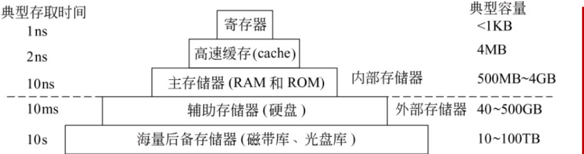

## 2. SRAM 和 DRAM 的区别

- **SRAM（静态 RAM）**：使用六管静态 MOS 存储元件，基于触发器原理。优点是非破坏性读出、无需刷新、速度快；缺点是功耗大、集成度低、价格高，适合做 Cache。

  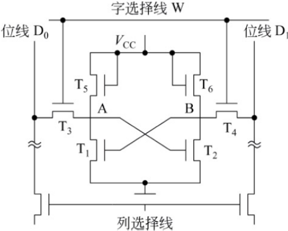

- **DRAM（动态 RAM）**：使用单管动态 MOS 存储元件，依靠电容存储电荷。优点是集成度高、功耗小、成本低；缺点是破坏性读出、需定时刷新（按行进行），速度较慢，适合做主存。

  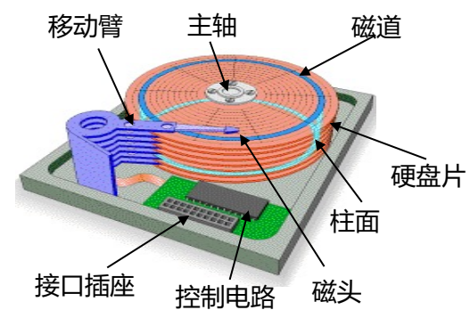

关键区别：SRAM 更快速稳定但昂贵，DRAM 更经济但需刷新。

## 3. 存储器芯片的扩展

通过多个芯片组合扩大容量：

- **字扩展**：位数不变，增加字数（如用 4 个 16K×8 位芯片扩成 64K×8 位）。地址高位数译码生成片选信号。
- **位扩展**：字数不变，增加位数（如用 8 个 4096×1 位芯片构成 4K×8 位）。所有芯片地址线并联。
- **字位同时扩展**：字和位同时增加（如用 8 个 16K×4 位芯片构成 64K×8 位）。 扩展方式包括连续编址和交叉编址（后者可提高并行性）。

## 4. 连续编址方式、交叉编址方式

- **连续编址方式**：主存块连续存放于同一模块，不能提高吞吐率，因为每次只能访问一个模块。

  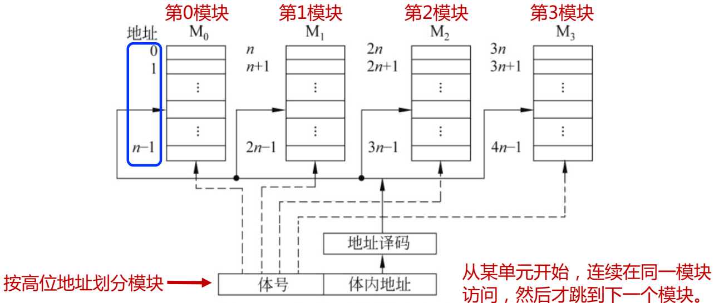

- **交叉编址方式**：主存块分布在不同模块（如多体存储器），可轮流或同时启动多个模块，提高吞吐量。例如，4 体交叉存取可使速度提高近 4 倍。

  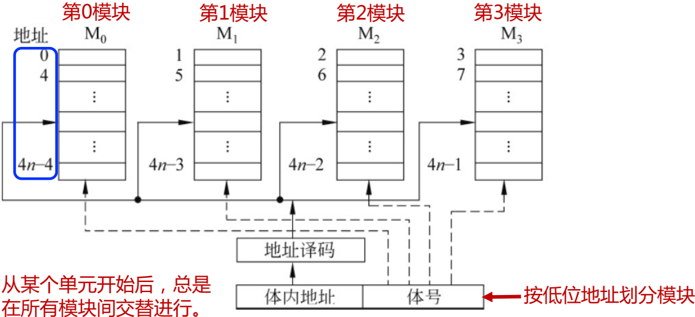

## 5. 磁盘读写的三个步骤

磁盘访问包括：

1. **寻道操作**：磁头移动到指定磁道（由柱面号控制）。

   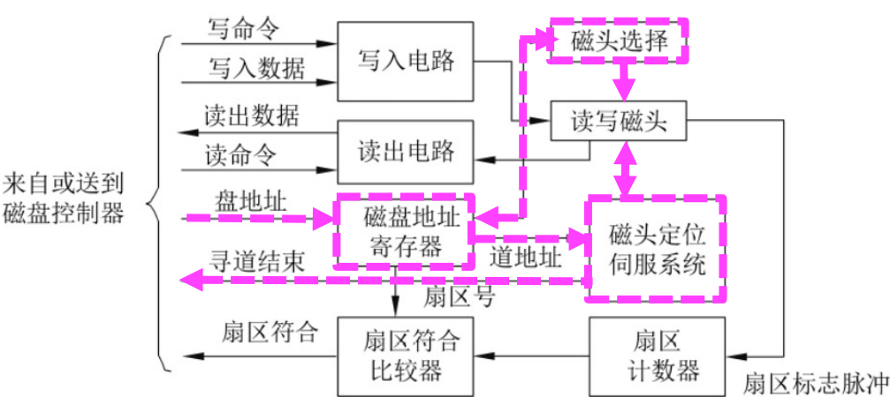

2. **旋转等待**：等待目标扇区旋转到磁头下方（由扇区号控制）。

   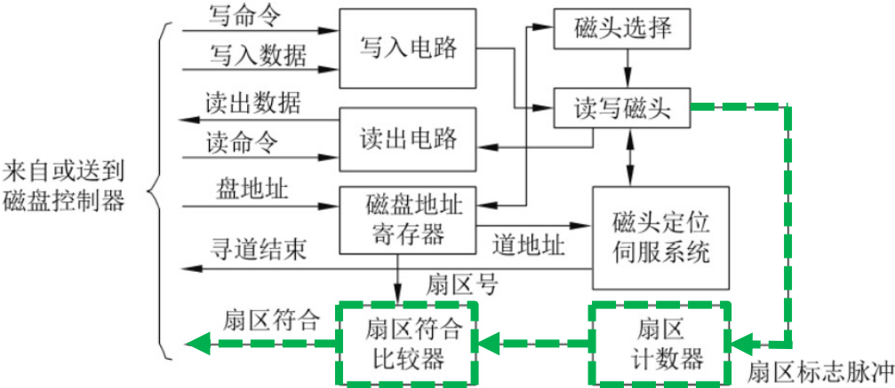

3. **读写操作**：读取或写入扇区数据（通过磁头感应或磁化）。

   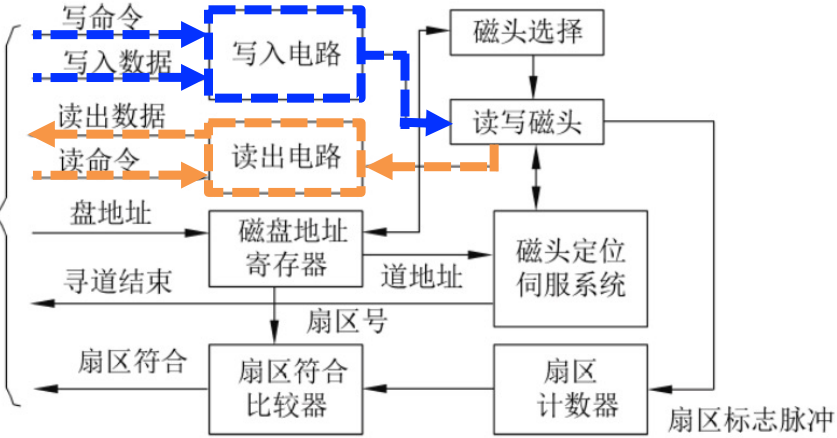

## 6. 磁盘存储器的性能指标

- **记录密度**：包括道密度（磁道数）和位密度（每磁道位数）。现代磁盘采用可变扇区数以提高密度。
- **存储容量**：分未格式化容量（基于物理特性）和格式化容量（实际可用空间，如按 4K 扇区计算）。
- **平均存取时间** = 平均寻道时间（约 5ms） + 平均旋转等待时间（磁盘旋转半周时间，约 4–6ms） + 数据传输时间（可忽略）。转速常见为 5400–10000 RPM。
- **数据传输速率**：单位时间内读写的数据量。

## 7. 数据校验的基本原理、奇偶校验码、循环冗余校验码

**基本原理**：通过冗余校验位检测和纠正错误。码距（d）决定能力：d≥e+1 可检测 e 位错误，d≥2t+1 可纠正 t 位错误。

- **奇偶校验码**：增加一位奇偶位，使数据位和校验位中 1 的个数为奇（奇校验）或偶（偶校验）。只能检测奇数位错误，不能纠错。开销小，适用于字节级校验。

- **循环冗余校验码（CRC）**：用于大批量数据（如磁盘或通信）。将数据左移 k 位后，用生成多项式 G(x) 模 2 除，余数作为校验位。接收端重新计算校验位，若除尽则无错。例如，数据 100011 用 G(x)=x³+1 得 CRC 码 100011111。

  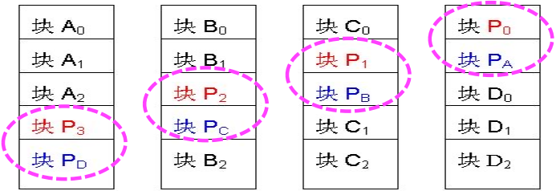

## 8. 程序访问的局部性

程序在短时间内访问的地址集中于小范围，包括：

- **时间局部性**：最近访问的指令或数据可能再次被访问（如循环指令）。
- **空间局部性**：访问地址附近的内容可能被访问（如数组顺序存取）。 举例：循环访问数组 a[i][j] 时，按行优先顺序（程序 A）比按列优先（程序 B）局部性更好，执行速度更快（实测可快 20 倍）。局部性是 Cache 设计的基础。

## 9. Cache 的基本工作原理

Cache 是小容量高速存储器（SRAM 实现），存放主存中活跃数据的副本。工作原理：

- CPU 访问数据时，先检查 Cache（命中则直接读取，命中时间短）。

- 若缺失（Miss），则访问主存，并将数据块调入 Cache（缺失损失大）。

- 

  利用程序局部性提高命中率，平均访问时间 t_avg = t_c + (1-α)t_m（α 为命中率）。

  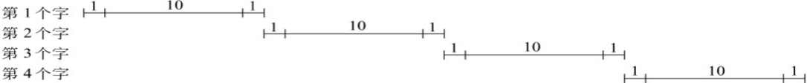

## 10. 直接映射、全相连映射、组相连映射

- **直接映射**：每个主存块映射到 Cache 固定行（行号=块号 mod 行数）。简单、命中时间短，但灵活性差、命中率低。
- **全相连映射**：每个主存块可映射到任意行。灵活、命中率高，但比较电路复杂、命中时间长。
- **组相连映射**：主存块映射到固定组的任一行（组号=块号 mod 组数）。平衡两者，常见 N-路组相联（如 2-路或 4-路）。 **性能指标**：
- 命中率：全相连最高，直接映射最低。
- 命中时间：直接映射最短，全相连最长。
- 缺失损失：访问主存的时间。
- 平均访问时间：取决于命中率和缺失损失。关联度越高，标记位开销越大。

## 11. 先进先出算法（FIFO）、最近最少用算法（LRU）

用于 Cache 或虚拟存储器的替换策略：

- **FIFO**：淘汰最先进入的块，实现简单但可能淘汰常用块，命中率随容量增大不一定会提高（非栈算法）。
- **LRU**：淘汰最近最少使用的块，更有效（栈算法），但需计数器记录使用情况。实现时，每行设 LRU 位，命中时置 0，其他调整；缺失时淘汰计数值最大的块。 举例：LRU 在组相联中能显著提高命中率，而 FIFO 可能引发颠簸。

## 12. 全写法（Write Through）、回写法（Write Back）的区别

- **全写法**：写操作时同时更新 Cache 和主存。优点是一致性好；缺点是速度慢（需写主存）。常配合写缓冲（Write Buffer）减轻瓶颈。
- **回写法**：写操作时只更新 Cache，并设置脏位（Dirty Bit）；仅当块被替换或缺失时，才写回主存。优点是减少主存访问；缺点是控制复杂，可能数据不一致。 选择策略：全写法适用于简单系统，回写法用于高性能 Cache。
- 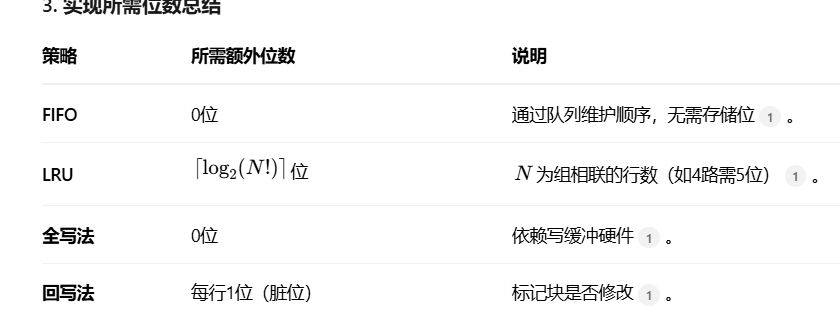--

## 13. 虚拟存储器的基本概念

虚拟存储器通过磁盘扩展主存容量，使程序员在逻辑地址空间（大于物理空间）编写程序。

- 基本思想：程序运行时，仅部分页调入主存，其余存于磁盘。

- 由硬件（MMU）和操作系统共同管理，处理缺页和地址转换。

- 

  优点：提高多道程序并发性，简化编程。

  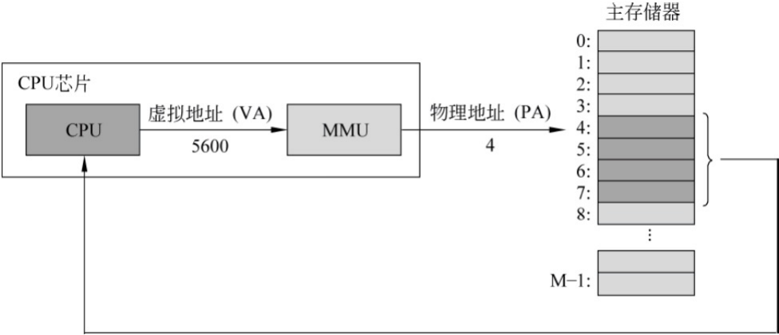

## 14. 进程的虚拟地址空间划分

在类 Unix 系统（如 Linux）中，进程虚拟地址空间分为：

- **内核空间**：存放 OS 内核代码、数据及系统资源。

- **用户空间**：包括代码段（只读）、数据段（可读写）、堆（动态分配）、栈（函数调用）、共享库等。

  举例：X86 系统上，用户空间从低地址开始，内核空间在高地址。

  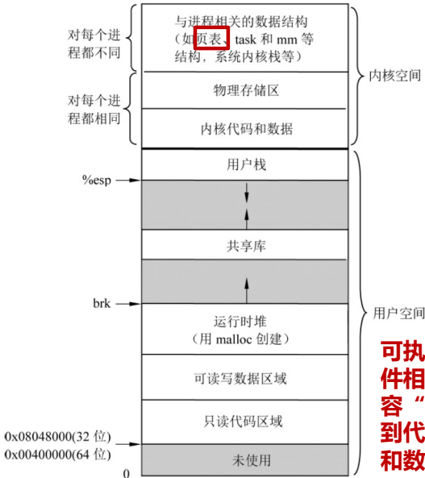

## 15. 分页式虚拟存储器的工作原理

**页表**：存储虚拟页与物理页框的映射关系，每项含有效位、修改位、访问权限等。

**地址转换**：

- CPU 将虚拟地址分为虚页号和页内偏移。

- 通过页表基址寄存器找到页表，用虚页号索引页表项，获得物理页框号。

- 

  物理地址 = 页框号 + 页内偏移。

  **快表（TLB）**：缓存常用页表项，加速转换。TLB 缺失时查主存页表，缺页时触发异常由 OS 处理。

  **CPU 访存过程**：

  1. 查 TLB（命中则获物理地址）。

  2. TLB 缺失则查页表（命中则更新 TLB）。

  3. 页缺失则引发缺页故障，OS 调页。

  4. 

     最后访问 Cache 或主存。

     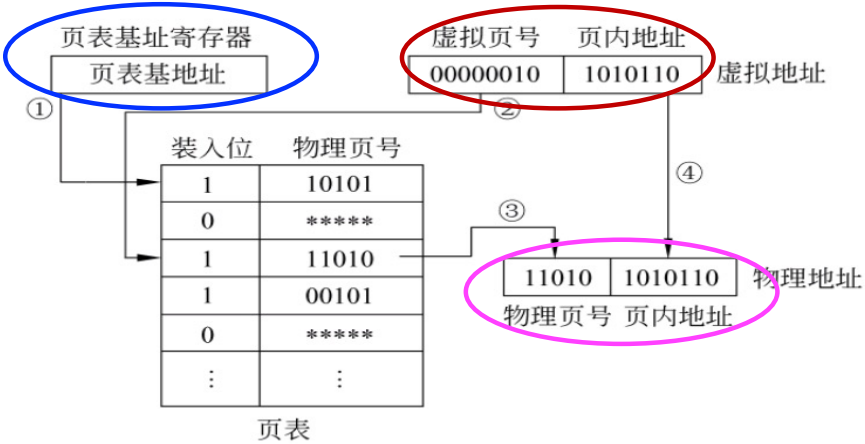

