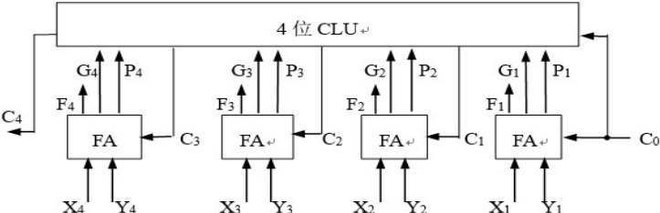
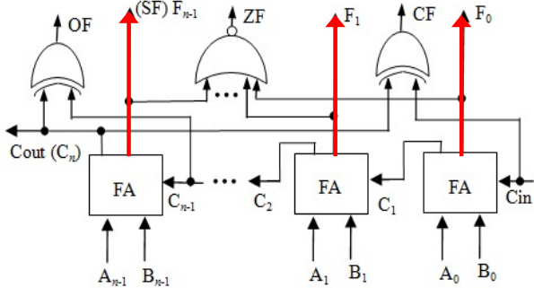

# 第三章

## 1. 常见的汇编指令（以MIPS为例）

文档1详细列出了MIPS指令系统中涉及运算的指令，主要分为逻辑运算、定点算术运算、浮点运算和数据传送类。以下是关键指令及功能：

### 逻辑运算指令

- 

  **按位与**：`and $1,$2,$3`→ `$1 = $2 & $3`

- 

  **按位或**：`or $1,$2,$3`→ `$1 = $2 | $3`

- 

  **逻辑左移/右移**：`sll/srl $1,$2,10`→ 左移/右移10位（无符号数逻辑移位）

- 

  **算术右移**：`sra $1,$2,10`→ 带符号整数右移（高位补符号位）

### 定点算术运算指令

- 

  **加/减**：`add/sub $1,$2,$3`→ 带符号整数加减（检测溢出）；`addu/subu`为无符号加减（不检测溢出）

- 

  **乘/除**：`mult/div $2,$3`→ 带符号整数乘除（结果存Hi/Lo寄存器）；`multu/divu`为无符号版本

### 浮点运算指令

- 

  **单精度浮点加/减/乘/除**：`add.s/sub.s/mul.s/div.s $f2,$f4,$f6`

- 

  **双精度浮点运算**：使用`.d`后缀，如 `add.d`

- 

  **数据传送**：`lwc1/swc1`用于浮点数加载/存储，地址运算使用定点加法

**关键点**：

- 

  MIPS指令区分带符号和无符号运算，通过不同指令处理溢出。

- 

  浮点数运算使用专用寄存器（`$f0-$f31`），双精度数占用连续两个寄存器。

------

## 2. 加法器原理

文档1介绍了三种加法器结构，从基础到优化：

### 串行进位加法器

- 

  **原理**：每位全加器依次传递进位，延迟与位数成正比（n位延迟约2n级门延迟）。

- 

  **缺点**：速度慢，适合低速场景。

- 

  全加器逻辑：

  Fi=Xi⊕Yi⊕Ci−1

  Ci=Xi⋅Yi+(Xi+Yi)⋅Ci−1

### 并行进位加法器（先行进位，CLA）

- 

  **原理**：通过进位生成函数 Gi=Xi⋅Yi和传递函数 Pi=Xi+Yi，直接计算所有进位，避免串行等待。

  例如：

  C1=G0+P0⋅C0

  C2=G1+P1⋅G0+P1⋅P0⋅C0

- 

  **优点**：延迟恒定，高速运算。

  

### 带标志加法器

- 

  **原理**：在加法器基础上输出标志位，用于判断溢出、零值等条件：

  - 

    溢出标志 `OF = C_n ⊕ C_{n-1}`（符号位进位与次高位进位异或）

  - 

    符号标志 `SF = F_{n-1}`（结果最高位）

  - 

    零标志 `ZF = 1`（当结果全0）

  - 

    进位标志 `CF = C_{out} ⊕ C_{in}`（无符号运算借位）

- 

  **应用**：支持带符号整数加减，Sub信号控制加减操作（Sub=1时做减法）。

  

------

## 3. 补码加减运算

文档2中补码加减运算是带符号整数运算的基础：

- 

  **公式**：

  [X+Y]补=[X]补+[Y]补mod2n

  [X−Y]补=[X]补+[−Y]补mod2n

  其中 [−Y]补=[Y]补+1（按位取反加1）。

- 

  **电路实现**：使用带标志加法器，Sub控制端选择加减：

  - 

    Sub=0：执行A + B

  - 

    Sub=1：执行A + ¬B + 1（即A - B）

- 

  **溢出判断**：OF标志位为1时表示溢出（例如同号数相加结果符号相反）。

**示例**：

- 

  计算-7 - 6：-7补码为111001，-6补码为111010，减法转换为加[-6]补：

  111001 + 000110 = 111111（补码表示-13），但OF=1表示溢出（实际-13超出4位表示范围）。

------

## 4. 原码与补码乘除运算规则

文档2详细介绍了乘除运算，以下为关键规则：

### 原码乘法

- 

  **规则**：符号位单独异或，数值部分用无符号乘法。

- 

  **示例**：[X]原=0.1110,[Y]原=1.1101，积符为1，数值1110 × 1101 = 10110110，结果 1.10110110。

- 

  **原码两位乘法**：每次处理乘数两位，速度提升一倍（操作规则基于乘数位组合）。

### 补码乘法（布斯算法）

- 

  **规则**：根据乘数位 yi和 yi−1决定操作：

  - 

    yi−1−yi=1：加被乘数

  - 

    yi−1−yi=−1：减被乘数

  - 

    其他情况：移位

- 

  **优点**：符号与数值统一处理，避免单独转换。

### 补码除法

- 

  **判断够减规则**：

  - 

    被除数与除数同号：做减法，余数符号不变则够减（商1）

  - 

    被除数与除数异号：做加法，余数符号不变则够减（商1）

- 

  **不恢复余数法（加减交替法）**：省去恢复步骤，提高效率。

------

## 5. 乘除运算溢出判断与常量乘除

### 溢出判断规则（文档2）

- 

  **无符号乘法**：乘积高n位非0则溢出（例如8位乘结果超出255）。

- 

  **带符号乘法**：乘积高n位不全等于低n位最高位则溢出（例如4位补码-8×2=-16，高4位非全1溢出）。

- 

  **除法溢出**：被除数为0或商超出表示范围时发生。

### 常量乘除运算

- 

  **除以2^k**：右移k位实现（无符号数直接移位；带符号负数需加偏移量 2k−1再移位，避免截断误差）。

  **示例**：计算x/32（32=2^5）：

  ```
  int div32(int x) {
      int b = (x >> 31) & 0x1F; // 取符号位生成偏移量
      return (x + b) >> 5;       // 负数加31后右移
  }
  ```

------

## 6. 浮点数加减运算与舍入方式

文档2中浮点数运算基于IEEE 754标准：

### 浮点数加减步骤

1. 

   **对阶**：小阶向大阶对齐，尾数右移（保留附加位）。

2. 

   **尾数加减**：隐藏位还原后运算。

3. 

   **规格化**：

   - 

     左规：尾数高位为0时左移（阶码减1）

   - 

     右规：尾数溢出时右移（阶码加1）

4. 

   **舍入**：根据附加位（保护位、舍入位、粘位）处理精度。

5. 

   **溢出判断**：阶码全1时上溢（∞），阶码全0时下溢（0）。

### 舍入方式（IEEE 754）

- 

  **就近舍入**：中间值强迫为偶数（如1.11010 → 1.1110）。

- 

  **朝+∞舍入**：向上取整。

- 

  **朝-∞舍入**：向下取整。

- 

  **朝0舍入**：截断。

**示例**：

单精度浮点数0.5（1.000×2^{-1}）与-0.4375（-1.110×2^{-2}）相加：

- 

  对阶：-0.4375 → -0.111×2^{-1}

- 

  尾数加：1.000 + (-0.111) = 0.001

- 

  左规：0.001×2^{-1} → 1.000×2^{-4} = 0.0625

------

## 总结

第三章系统讲解了从基础逻辑运算到复杂浮点运算的硬件实现方法：

- 

  **运算指令**：MIPS通过不同指令区分运算类型和溢出处理。

- 

  **运算部件**：加法器从串行到并行优化，带标志位支持条件判断。

- 

  **数值运算**：补码简化加减运算，乘除通过迭代和 Booth 算法高效实现。

- 

  **浮点运算**：对阶、规格化和舍入确保精度，IEEE 754标准定义异常处理。

此总结覆盖了您提出的所有问题点，如需进一步细节或示例，可参考文档中具体案例。