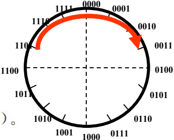

# 数据的机器级表示

+ 用二进制编码的原因：
  + 制造两个稳定态的物理器件容易
  + 二进制编码、计数、运算规则简单
  + 正好与逻辑命题对应，便于逻辑运算，并可方便的用逻辑电路实现算术运算

+ 用八进制与十六进制的原因：
  + 便于阅读书写
  + 与二进制三者之间易转换
+ 进制表示：
  + 二进制：B
  + 八进制：O
  + 十进制：D
  + 十六进制：H
+ 十进制转二进制小数：*2取1
+ 负数的补码是正数补码的“各位取反、末尾加一”
+ LSB：最低有效位
+ MSB：最高有效位
+ 小端：低地址放低字节
+ 大端：低地址放高字节
+ IEEE 754标准：
  + 32位：符号s一位、阶码e八位，移码，编制2^(n-1) - 1= 127,尾数f 23位，源码，第一位为1，隐藏
  + 64位：符号s 1位，阶码e 11 位，移码，编制1023，尾数 f 52位，隐藏第一位1
+ 全0阶码全0尾数：+0/-0
+ 全1阶码全0尾数：+∞/-∞
+ 全1阶码非0尾数：NaN
+ 至少需要两个字节表示一个汉字内码
+ 字为16位，字长为32位
+ 容量为2的幂次方，带宽为10的幂次方

# 第二章《数据的机器级表示》内容总结

## 1. 二进制、八进制、十六进制、十进制数之间的转换

文档在“数制和编码”部分详细介绍了进位计数制及其转换方法：

### 进制基础

- **二进制（R=2）**：基本符号0、1，后缀B（如10011B）。
- **八进制（R=8）**：基本符号0-7，后缀O（如1246O）。
- **十进制（R=10）**：基本符号0-9，后缀D或省略（如56D）。
- **十六进制（R=16）**：基本符号0-9、A-F，后缀H（如308FH）。
- **转换关系**：八进制和十六进制是二进制的简便表示，便于阅读和书写（一个八进制数字对应3位二进制，一个十六进制数字对应4位二进制）。

### 转换方法

- **R进制转十进制**：按权展开。

  例如：

  - 二进制 `10101.01B = 1×2⁴ + 0×2³ + 1×2² + 0×2¹ + 1×2⁰ + 0×2⁻¹ + 1×2⁻² = 21.25`
  - 十六进制 `3A.CH = 3×16¹ + 10×16⁰ + 12×16⁻¹ = 58.75`

- **十进制转R进制**：整数和小数部分分别转换。

  - **整数部分**：除基取余，上低下高。

    例如：`135 = 10000111B`（135 ÷ 2 取余）。

  - **小数部分**：乘基取整，上高下低。

    例如：`0.6875 × 2 = 1.375 → 取整1 → 0.375 × 2 = 0.75 → 取整0 → 0.75 × 2 = 1.5 → 取整1 → 0.5 × 2 = 1.0 → 取整1`，因此 `0.6875 = 0.1011B`。

  - **简便方法**：先转二进制，再转八/十六进制（如 `4123.25 = 4096 + 16 + 8 + 2 + 1 + 0.25 = 1000000011011.01B = 101B.4H`）。

- **二、八、十六进制互转**：直接按位分组转换。

  - 十六进制转二进制：`2B.5EH = 0010 1011.0101 1110B`。
  - 二进制转十六进制：`11001.11B = 0001 1001.1100B = 19.CH`（高位补0）。

------

## 2. 原码、补码、移码表示法

文档在“数制和编码”部分解释了定点数的编码方式：

### 原码表示法

- **规则**：符号位（最高位）表示正负（0正1负），数值部分为真值的绝对值。

  例如：

  - `+10`（真值`+1010B`）→ 原码 `00001010B`。
  - `-0.625`（真值`-0.101B`）→ 原码 `11010000B`（小数点在最高位后）。

- **缺点**：0的表示不唯一（`+0=00000000B`，`-0=10000000B`），加减运算不统一，不利于硬件设计。

### 补码表示法

- **原理**：基于模运算系统（如时钟模12），负数用模减绝对值表示。

  - 定义：`[X_T]补 = M + X_T (mod M)`，其中M为模（定点整数M=2ⁿ，定点小数M=2）。

  - 正数补码等于自身，负数补码等于“各位取反，末位加1”。

    

    例如：8位系统中，`-123`的补码：先求`123=01111011B`，取反`10000100B`，加1得`10000101B`（85H）。

- **优点**：0表示唯一（`[+0]补 = [-0]补 = 00000000B`），加减运算统一，硬件实现简单。

- **特殊值**：

  - `[-2ⁿ⁻¹]补 = 10...0B`（n-1个0）。
  - `[-1]补 = 11...1B`（n个1）。

### 移码表示法

- **规则**：真值加偏置常数（通常为2ⁿ⁻¹），用于浮点数阶码表示。

  例如：n=4时，偏置=8，真值-8的移码为`-8+8=0 → 0000B`，真值+7的移码为`7+8=15 → 1111B`。

- **特点**：便于浮点数对阶时比较大小，0的表示唯一。

### 变形补码

- **用途**：双符号位（如模4补码）判断溢出。左边为真实符号位，右边用于检测溢出（符号位不同则溢出）。

  例如：4位补码中`-8`无法表示，但变形补码可保留符号位和数值位。

------

## 3. 无符号整数、带符号整数表示

文档在“整数的表示”部分对比了两种整数表示：

### 无符号整数

- **表示**：所有位表示数值，无符号位。

  例如：8位无符号整数范围0~255（`11111111B=255`）。

- **应用**：地址运算、指针表示等正数场景。

- **扩展操作**：短数转长数时高位补0（0扩展）。

### 带符号整数（补码表示）

- **表示**：最高位为符号位（0正1负），现代计算机统一用补码。

  例如：8位带符号整数范围-128~+127（`10000000B=-128`，`01111111B=+127`）。

- **优点**（相比原码/反码）：

  - 0表示唯一。
  - 加减运算统一（模运算系统）。
  - 多表示一个最小负数（-2ⁿ⁻¹）。

- **扩展操作**：短数转长数时高位补符号位（符号扩展）。

- **比较规则**：

  - 无符号数：MSB=1的数大于MSB=0的数（如`111...1B > 000...1B`）。
  - 带符号整数：MSB=1的数为负数，小于正数（如`111...1B(-1) < 000...1B(+1)`）。

- **MIPS指令示例**：

  - 无符号加载`lbu $t0,0($s0)`（0扩展）。
  - 带符号加载`lb $t0,0($s0)`（符号扩展）。
  - 比较指令`sltu`（无符号）和`slt`（带符号）。

### C语言中的整数类型

- **无符号数**：`unsigned int/short/long`，后缀U（如`0U`）。

- **带符号整数**：`int/short/long`。

- **混合运算**：带符号整数被强制转为无符号数。

  文档提供了关系表达式示例（如`-1 < 0U`结果为0，因为无符号比较时`-1`的机器数`11...1B`被解释为最大无符号数）。

------

## 4. 浮点数的表示（IEEE 754标准）

文档在“实数的表示”部分重点介绍了IEEE 754浮点数标准：

### 浮点数格式

- **科学计数法基础**：规格化形式（如二进制`1.xxxx×2^E`）。

- **IEEE 754标准**：由William Kahan制定，统一了浮点数表示。

  

- **单精度（32位）**：

  - 1位符号位（S）。
  - 8位阶码（e），移码表示，偏置常数127（范围-126~+127）。
  - 23位尾数（f），隐藏第一位1（实际精度24位）。
  - 值：`(-1)^S × (1.f) × 2^(e-127)`。

- **双精度（64位）**：

  - 1位符号位。
  - 11位阶码，偏置常数1023。
  - 52位尾数。
  - 值：`(-1)^S × (1.f) × 2^(e-1023)`。

### 特殊值的表示

- **全0阶码全0尾数**：±0（如`0 00000000 000...0`为+0）。
- **全0阶码非0尾数**：非规格化数（隐藏位0），用于处理阶码下溢。
- **全1阶码全0尾数**：±∞（如除以0的结果）。
- **全1阶码非0尾数**：NaN（Not a Number），表示未定义结果（如`0/0`或`∞-∞`）。
  - 尾数最高位1：不发信号NaN（不触发异常）。
  - 尾数最高位0：发信号NaN（触发异常）。

### 转换示例

- **十进制转IEEE 754**：
  - `-12.75`→ 二进制`1100.11B`→ 规格化`1.10011×2^3`→ 阶码`127+3=130=10000010B`→ 符号位1 → 结果`1 10000010 10011000000000000000000 = C14C0000H`。
- **IEEE 754转十进制**：
  - `BEE00000H`→ 二进制`101111101110000...`→ 符号位1（负）→ 阶码`01111101B=125`→ 指数`125-127=-2`→ 尾数`1.11B=1.75`→ 值`-1.75×2^(-2) = -0.4375`。

------

## 5. C语言中的整数、浮点数类型

文档在“数据的宽度和存储”部分讨论了C语言数据类型的机器级表示：

### 数据类型宽度

- **宽度随机器和编译器变化**：

  | C声明       | 典型32位机器（字节） | Compaq Alpha（64位机器，字节） |
  | ----------- | -------------------- | ------------------------------ |
  | `char`      | 1                    | 1                              |
  | `short int` | 2                    | 2                              |
  | `int`       | 4                    | 4                              |
  | `long int`  | 4                    | 8                              |
  | `float`     | 4                    | 4                              |
  | `double`    | 8                    | 8                              |

- **指针类型**：`char*`在32位机器占4字节，64位机器占8字节。

### 类型转换规则

- **整数与浮点数转换**：
  - `int`→ `float`：可能舍入，但不会溢出。
  - `int`/`float`→ `double`：保留精确值。
  - `double`→ `float`：可能溢出或舍入。
  - `float`/`double`→ `int`：向0截断。
- **示例验证**：
  - `i == (int)(double) i`：永真（double精度足够）。
  - `f == (float)(double) f`：永真。
  - `d == (float) d`：不永真（可能舍入）。

------

## 6. 数据的存储和排列顺序

文档在“数据的宽度和存储”部分解释了数据的存储细节：

### 数据宽度和单位

- **比特（bit）**：最小单位。
- **字节（Byte）**：8位，最小可寻址单位。
- **字（word）**：由多个字节组成（如2、4、8字节），用于度量数据类型宽度。
- **字长**：CPU数据通路宽度（如32位或64位），与“字”的宽度可能不同（如x86中字为16位，字长为32位）。

### 存储单位

- **容量单位**：基于2的幂次方（如1KB=1024B，1MB=1024KB）。
- **带宽单位**：基于10的幂次方（如1kbps=1000bps）。

### 字节顺序（大端/小端）

- **大端模式（Big Endian）**：最高有效字节（MSB）存放在低地址。

  例如：数`0x12345678H`在地址1000的存储：

  | 地址 | 1000 | 1001 | 1002 | 1003 |
  | ---- | ---- | ---- | ---- | ---- |
  | 内容 | 12H  | 34H  | 56H  | 78H  |

- **小端模式（Little Endian）**：最低有效字节（LSB）存放在低地址。

  例如：同一数的存储：

  | 地址 | 1000 | 1001 | 1002 | 1003 |
  | ---- | ---- | ---- | ---- | ---- |
  | 内容 | 78H  | 56H  | 34H  | 12H  |

- **影响**：系统间数据通信时需转换顺序（如网络通信常用大端，x86用小端）。

### 对齐要求

- **按边界对齐**：数据地址为其宽度的倍数（如32位字地址为4的倍数），提高访存效率。
- **不对齐**：可能增加访存次数。
- **示例**：在32位机器上，`int`变量地址应为4的倍数，否则可能需两次内存访问。