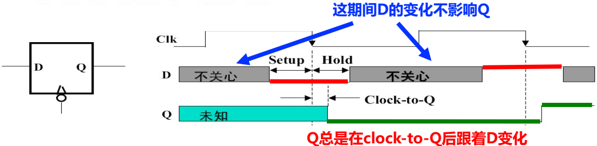
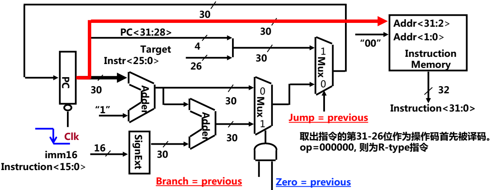
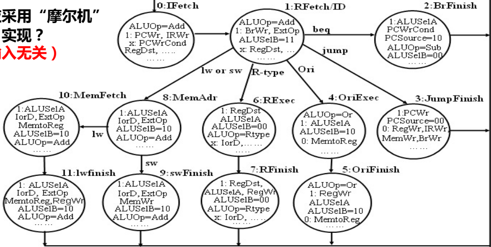

# 中央处理器

## 个人总结

### CPU基本组成

+ CPU执行指令的过程
  + 取指令（最开始）
  + PC + “1” 送pc
  + 指令译码（执行前）
  + 进行主存地址运算
  + 取操作数
  + 进行算术/逻辑运算
  + 存结果
  + 以上每步都需检测“异常” ——缺页、越界等
  + 若有异常，则自动切换到异常处理程序
  + 检测是否有“中断请求”，有则转中断处理

+ 描述语言陈伟寄存器传送语言RTL

  （1）用R[r]表示寄存器r的内容；

  （2）用M[addr]表示主存单元addr的内容；

  （3）用M[R[r]]表示寄存器r的内容所指存储单元的内容；

  （4）程序计数器PC直接用PC表示其内容。

  （5）M[PC]表示Pc所指存储单元的内容；

  （6）SEXT[imm]表示对imm将进行符号扩展；

  （7）ZEXT[imm]表示对imm进行零扩展；

  （8）传送方向用“←”表示，传送源在右，传送目的在左；

+ 指令寄存器：IR，程序寄存器：PC

  

+ ALU：算术逻辑单元

+ 数据通路：指令执行过程中，数据所经过的路径，包括路径中的部件。它是指令的执行部件。
+ 控制器：对指令进行译码，生成指令对应的控制信号，控制数据通路的动作。能对执行部件发出控制信号，是指令的控制部件。

+ 操作元件：加法器（Adder）、多路选择器（MUX）、算逻部件（ALU）、译码器（Decoder）
+ 状态元件：具有存储功能，在时钟控制下输入被写到电路中，指导下个时钟到达；输入端状态由时钟决定何时被写入，输出端状态随时可以读出。
+ 定时方式：规定信号何时写入状态元件或何时从状态原件读出

### 数据通路与时序控制

+ 同步系统：所有动作有专门时序信号来定时，由时序信号规定何时发出什么动作
+ 指令周期：取并执行一条指令的时间
+ 时钟周期 = 锁存延迟+最长传输延迟+建立时间+时钟偏移

+ R型指令数据通路
  

+ 带立即数的I型数据指令
  

  蓝色部分与R型指令区分开

+ 装入指令（lw）的数据通路
  

+ 

+ 

### 控制器设计

+ RegDst： 决定写入寄存器堆的目标地址是来自指令的 rt字段（0）还是 rd字段（1）。用于区分R型（如add）和I型（如addi, lw）指令。
+ RegWrite： 寄存器写使能。只有当它为1时，数据才会在时钟边沿写入目标寄存器。
+ ALUSrc： 决定ALU的第二个操作数来自寄存器（0）还是来自符号扩展器扩展后的立即数（1）。
+ ALUctr： 由控制器根据指令产生，直接告诉ALU执行何种具体操作（加、减、与、或等）。
+ MemWrite 与 MemRead： 内存写使能和读控制。MemWrite=1仅出现在 sw指令，将数据写入内存。
+ MemtoReg： 决定写回寄存器堆的数据是来自ALU的结果（0）还是来自数据存储器（1）。这是 lw指令的关键信号。
+ Branch 与 Jump： 处理程序流改变。Branch与ALU的零标志结合，决定是否进行条件跳转；Jump直接进行无条件跳转。
+ ExtOp： 控制符号扩展器对立即数进行符号扩展（1）还是零扩展（0）。

### 多周期处理器设计

+ **多时钟周期中解决“竞争”问题的方案**
  + 确认地址和数据在第N周期结束时已稳定
  + 使写使能信号在一个周期后(即：第N+1周期)有效
  + 在写使能信号无效前地址和数据不改变

+ **取指结束时，新的PC值(PC+4)开始写入PC：**

  **即下个周期里，PC中已经是PC+4了。**

## 解题的零散知识

+ 需要将结果保存到寄存器里的触发的是写操作，由RegWr控制，以及会有该操作的指令有：算术/逻辑指令、lw指令、数据传输指令

# CPU核心概念详解

## 1. CPU执行指令过程

CPU执行指令的过程是一个标准化的流水线式操作，主要包括以下步骤：

- **取指令（Fetch）**：从程序计数器（PC）所指的内存地址读取指令，并存入指令寄存器（IR）。同时，PC值更新为下一条指令地址（PC+4）。

- **指令译码（Decode）**：解析IR中的指令，确定操作类型（如算术运算、访存等）和操作数地址。控制器生成相应的控制信号。

- **执行（Execute）**：根据译码结果，数据通路执行具体操作。例如：

  - 

    对于算术指令（如add），ALU对寄存器值进行运算。

  - 

    对于访存指令（如lw），计算内存地址（基址+偏移量）。

- **访存（Memory Access）**：若指令涉及内存读写（如lw或sw），则访问内存单元读取或写入数据。

- **写回（Write Back）**：将执行结果写入寄存器或内存（如将ALU结果存入目标寄存器）。

- **异常检测**：每步均检测异常（如溢出、缺页），若有异常则转处理程序；同时检测中断请求。

整个过程由控制器同步控制，每一步由时钟信号定时。文档1强调：“取指令一定在最开始做，译码须在指令执行前做”。

## 2. CPU的基本组成：操作元件与状态元件的区别

CPU由**数据通路**（执行部件）和**控制器**（控制部件）组成：

- **数据通路**：指令执行过程中数据流动的路径，包含两类元件：

  - **操作元件（组合逻辑元件）**：无存储功能，实时处理数据，如ALU（算术逻辑单元）、扩展器（Extender）。其输出仅依赖当前输入。
  - **状态元件（存储元件）**：有时序功能，能存储信息，在时钟边沿更新，如寄存器、存储器、PC。其输出反映之前时钟的输入状态。

  关键区别：

  - **功能**：操作元件进行数据变换（如运算）；状态元件存储数据（如保存中间结果）。
  - **定时**：操作元件输出随时变化；状态元件仅在时钟边沿更新（如上升沿触发）。
  - **示例**：ALU是操作元件，寄存器组是状态元件。

文档1通过触发器示例说明状态元件的时序特性：

## 3. 指令周期与时钟周期

- **指令周期**：完成一条指令所需的时间，包括取指、译码、执行等所有阶段。不同指令的指令周期可能不同（如简单指令需3周期，复杂指令需5周期）。
- **时钟周期**：CPU时钟信号的一个完整周期，是同步系统的基本定时单位。现代计算机中，时钟周期取代了早期三级时序系统（机器周期-节拍-脉冲），每个时钟周期对应一个节拍。

文档1指出：“时钟周期=锁存延迟+最长传输延迟+建立时间+时钟偏移”。单周期处理器中，时钟周期以最复杂指令（如load）为准，效率低；多周期处理器将指令分多阶段，时钟周期以最长阶段为准，提高效率。

## 4. MIPS指令格式及典型指令功能

MIPS指令分为三种格式（文档1中表格）：

- **R型指令**（寄存器-寄存器）：用于算术逻辑运算，格式为 `op | rs | rt | rd | shamt | func`，示例：
  - `add rd, rs, rt`：功能为 `R[rd] ← R[rs] + R[rt]`（若溢出则转异常处理）。
- **I型指令**（立即数或访存）：格式为 `op | rs | rt | immediate`，示例：
  - `lw rt, rs, imm16`：功能为 `Addr ← R[rs] + SignExt(imm16); R[rt] ← M[Addr]`。
  - `ori rt, rs, imm16`：功能为 `R[rt] ← R[rs] or ZeroExt(imm16)`。
- **J型指令**（跳转）：格式为 `op | target address`，示例：
  - `j target`：功能为 `PC ← PC<31:28> concat target<25:0>`。

所有指令的公共操作：取指令（`M[PC]`）和更新PC（`PC ← PC+4`）。文档1强调立即数扩展方式：符号扩展用于地址计算（如lw），零扩展用于逻辑运算（如ori）。

## 5. 单周期数据通路设计及控制信号

单周期处理器中，所有指令在一个时钟周期内完成，数据通路整合各指令所需元件。文档1以7条MIPS指令（add、sub、ori、lw、sw、beq、j）为例设计数据通路，关键部件包括：

- **取指令部件**：PC、存储器、加法器（PC+4）。
- **寄存器堆**：双读口单写口，地址由指令的rs、rt、rd字段控制。
- **ALU**：执行运算，控制信号ALUctr决定操作类型（如add、sub）。
- **多路选择器（MUX）**：根据控制信号选择数据源，如ALUSrc选择寄存器值或立即数。
- **扩展器**：ExtOp控制符号扩展或零扩展。

局部数据通路示例（R型指令add）：

- 数据流：寄存器rs和rt值送ALU，结果写回寄存器rd。
- 控制信号：RegDst=1（目标寄存器为rd）、ALUSrc=0（操作数来自寄存器）、RegWrite=1（写寄存器）、ALUctr=add。

完整数据通路图整合所有指令，控制信号取值如表所示：

控制信号逻辑由控制器实现，根据操作码（op）和功能码（func）生成。例如，RegWrite信号在R型、ori、lw指令中为1。

## 6. 多周期数据通路设计及状态转换

多周期处理器将指令执行分为多个阶段，每阶段一个时钟周期，提高效率。文档2设计的数据通路共享功能部件（如ALU和存储器），通过临时寄存器（如IR、A、B、MDR）保存中间结果。

**典型指令阶段**：

- **lw指令（5周期）**：取指 → 译码/读寄存器 → 地址计算 → 内存读 → 写回。
- **beq指令（3周期）**：取指 → 译码/读寄存器 → 分支判断和地址更新。

**控制信号**：每周期信号不同，例如：

- 取指周期：MemWr=0, IRWr=1, PCWr=1。
- 分支周期：ALUSelA=1, ALUSelB=01, Branch=1。

**状态转换图**：文档2给出有限状态机，状态包括IFetch、ID/RFetch、MemAdr、BrFinish等。例如：

- 状态0（IFetch）后，根据操作码转入不同状态（如ori指令转入状态4）。
- 异常处理状态（如状态12用于未定义指令）。

状态转换图示例：

多周期设计解决了单周期的时钟周期过长问题，允许功能部件复用。

## 7. 微程序控制器

**基本思想**：仿照软件编程，将控制信号存储为微程序（固件）。每条指令对应一个微程序，由微指令组成；每条微指令包含一组微命令（控制信号）。

**基本结构**：

- **控存（CS）**：只读存储器，存储微程序。

  **微程序计数器（μPC）**：指向下条微指令地址。

- **微指令寄存器（μIR）**：保存当前微指令。

- **地址生成逻辑**：根据条件码或操作码确定下条微指令地址。

**执行过程**：

1. 取微指令：从CS中按μPC地址读取微指令到μIR。
2. 译码：微指令中的微命令直接或译码后生成控制信号。
3. 执行：控制数据通路操作；μPC更新（顺序或转移）。

**编码方式**：

- **不译法（直接控制）**：微指令每位对应一个控制信号，并行能力强但微指令长。
- **字段编码法**：将互斥微命令编码在同一字段，减少微指令长度。例如，ALU操作字段编码add、sub等。

文档2指出，微程序控制器适用于复杂指令集（如IA-32），硬连线控制器用于简单指令集（如MIPS）。

## 8. 带异常处理的数据通路与有限状态机

异常处理需扩展数据通路和控制器状态。文档2以MIPS为例：

**数据通路增强**：

- **新增寄存器**：EPC（存断点地址）、Cause（存异常原因）。
- **控制信号**：EPCWr（写EPC）、CauseWr（写Cause）、IntCause（选择异常类型）。
- **地址多路器**：增加异常处理程序入口地址（如MIPS的0x80000180）。

**有限状态机扩展**：在原有状态机中加入异常处理状态，例如：

- **状态12（未定义指令）**：检测到非法操作码时，设置Cause=0，写EPC（PC-4），跳转异常程序。
- **状态13（溢出）**：ALU溢出时，设置Cause=1，写EPC，跳转。

异常检测时机：

- 未定义指令：译码阶段。
- 溢出：执行阶段（如R型指令）。

带异常处理的状态机确保CPU在异常发生时保存上下文并转入处理程序，提高可靠性。