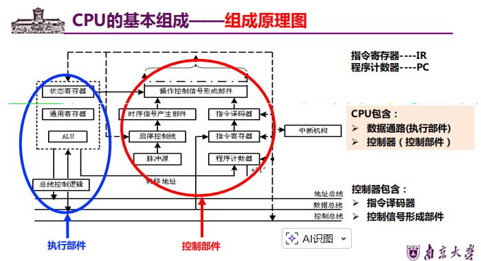
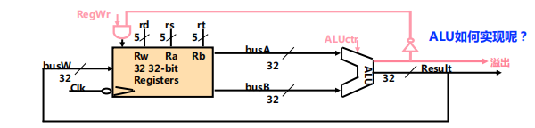
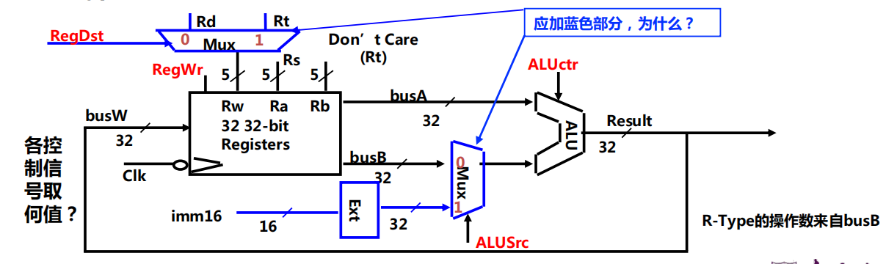
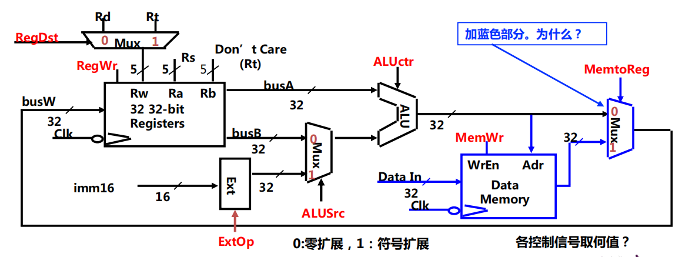
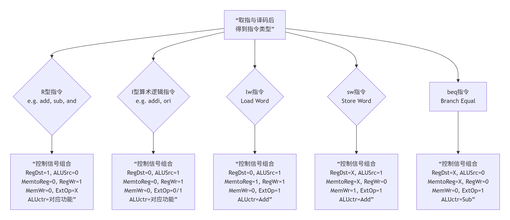
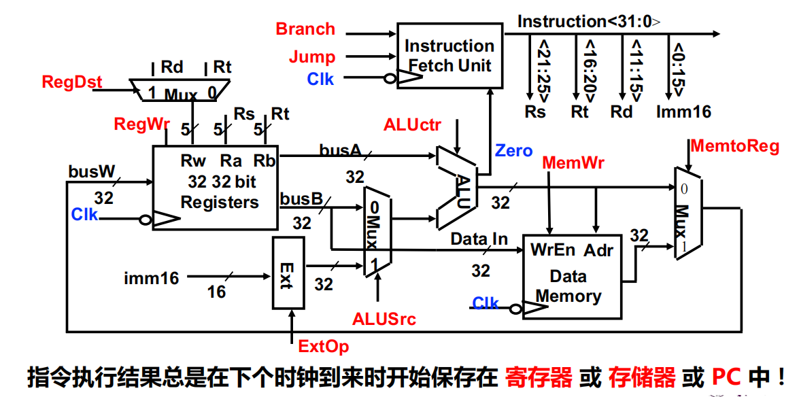

# 中央处理器

## 个人总结

### CPU基本组成

+ CPU执行指令的过程
  + 取指令（最开始）
  + PC + “1” 送pc
  + 指令译码（执行前）
  + 进行主存地址运算
  + 取操作数
  + 进行算术/逻辑运算
  + 存结果
  + 以上每步都需检测“异常” ——缺页、越界等
  + 若有异常，则自动切换到异常处理程序
  + 检测是否有“中断请求”，有则转中断处理

+ 描述语言陈伟寄存器传送语言RTL

  （1）用R[r]表示寄存器r的内容；

  （2）用M[addr]表示主存单元addr的内容；

  （3）用M[R[r]]表示寄存器r的内容所指存储单元的内容；

  （4）程序计数器PC直接用PC表示其内容。

  （5）M[PC]表示Pc所指存储单元的内容；

  （6）SEXT[imm]表示对imm将进行符号扩展；

  （7）ZEXT[imm]表示对imm进行零扩展；

  （8）传送方向用“←”表示，传送源在右，传送目的在左；

+ 指令寄存器：IR，程序寄存器：PC

  

+ ALU：算术逻辑单元

+ 数据通路：指令执行过程中，数据所经过的路径，包括路径中的部件。它是指令的执行部件。
+ 控制器：对指令进行译码，生成指令对应的控制信号，控制数据通路的动作。能对执行部件发出控制信号，是指令的控制部件。

+ 操作元件：加法器（Adder）、多路选择器（MUX）、算逻部件（ALU）、译码器（Decoder）
+ 状态元件：具有存储功能，在时钟控制下输入被写到电路中，指导下个时钟到达；输入端状态由时钟决定何时被写入，输出端状态随时可以读出。
+ 定时方式：规定信号何时写入状态元件或何时从状态原件读出

### 数据通路与时序控制

+ 同步系统：所有动作有专门时序信号来定时，由时序信号规定何时发出什么动作
+ 指令周期：取并执行一条指令的时间
+ 时钟周期 = 锁存延迟+最长传输延迟+建立时间+时钟偏移

+ R型指令数据通路
  

+ 带立即数的I型数据指令
  

  蓝色部分与R型指令区分开

+ 装入指令（lw）的数据通路
  

+ 

+ 

### 控制器设计

+ RegDst： 决定写入寄存器堆的目标地址是来自指令的 rt字段（0）还是 rd字段（1）。用于区分R型（如add）和I型（如addi, lw）指令。
+ RegWrite： 寄存器写使能。只有当它为1时，数据才会在时钟边沿写入目标寄存器。
+ ALUSrc： 决定ALU的第二个操作数来自寄存器（0）还是来自符号扩展器扩展后的立即数（1）。
+ ALUctr： 由控制器根据指令产生，直接告诉ALU执行何种具体操作（加、减、与、或等）。
+ MemWrite 与 MemRead： 内存写使能和读控制。MemWrite=1仅出现在 sw指令，将数据写入内存。
+ MemtoReg： 决定写回寄存器堆的数据是来自ALU的结果（0）还是来自数据存储器（1）。这是 lw指令的关键信号。
+ Branch 与 Jump： 处理程序流改变。Branch与ALU的零标志结合，决定是否进行条件跳转；Jump直接进行无条件跳转。
+ ExtOp： 控制符号扩展器对立即数进行符号扩展（1）还是零扩展（0）。

### 多周期处理器设计

+ **多时钟周期中解决“竞争”问题的方案**
  + 确认地址和数据在第N周期结束时已稳定
  + 使写使能信号在一个周期后(即：第N+1周期)有效
  + 在写使能信号无效前地址和数据不改变

+ **取指结束时，新的PC值(PC+4)开始写入PC：**

  **即下个周期里，PC中已经是PC+4了。**

## 解题的零散知识

+ 需要将结果保存到寄存器里的触发的是写操作，由RegWr控制，以及会有该操作的指令有：算术/逻辑指令、lw指令、数据传输指令