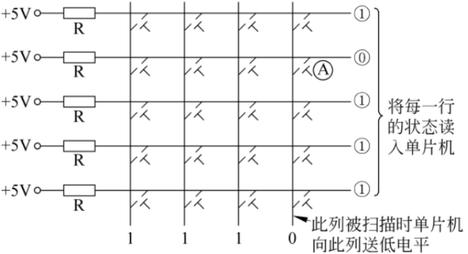
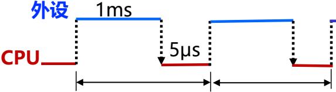
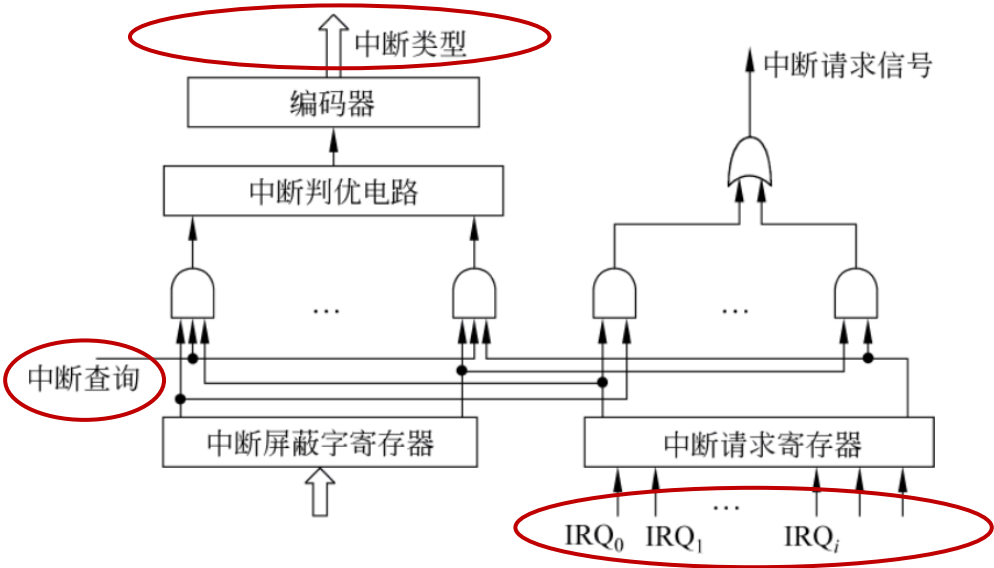

# 第八章“系统互联及输入输出组织”内容总结

## 1. 外设的分类

外设（外部设备）根据不同的标准进行分类：

- 

  **按信息的传输方向分类**：

  - 

    输入设备：如键盘、鼠标、扫描仪等，用于向计算机输入数据。

  - 

    输出设备：如打印机、显示器等，用于从计算机输出数据。

  - 

    输入/输出设备：如磁盘驱动器、光盘驱动器、网卡等，既能输入也能输出数据。

- 

  **按功能分类**：

  - 

    人机交互设备：用于用户和计算机之间的交互，如键盘、鼠标、显示器。

  - 

    存储设备：作为外存储器使用，如磁盘驱动器、光盘驱动器。

  - 

    机-机通信设备：用于计算机之间的通信，如网卡、调制解调器。

外设的特点包括：**异步性**（外设与CPU工作时钟不同步）、**实时性**（CPU需及时处理高速设备的数据）、**多样性**（导致连接复杂，需标准接口简化控制）。

## 2. 总线、系统总线、数据线、地址线、控制线

- 

  **总线**：计算机内数据传输的公共路径，用于部件间的信息交换。

- 

  **系统总线**：连接处理器、存储器和I/O模块等主要部件的总线，通常由以下三组线构成：

  - 

    **数据线**：承载传输的数据，宽度决定一次传送的数据位数。

  - 

    **地址线**：指定数据所在的主存单元或I/O端口地址，宽度决定寻址空间。

  - 

    **控制线**：传输定时信号和命令信息，如时钟、存储器读/写、中断请求等。

- 

  总线的性能指标包括总线宽度、工作频率、带宽、定时方式（同步、异步、半同步）和传送方式（非突发、突发）。

## 3. 基于总线的互连结构（主要模块以及连接的总线）

基于总线的互连结构以Core i7系列处理器为例：

- 

  **处理器总线**：如前端总线（FSB）或快速通道互连（QPI）总线，用于CPU芯片与北桥或I/O Hub之间的高速连接。QPI是基于包交换的串行点对点连接，带宽高。

- 

  **存储器总线**：直接连接CPU和内存条，例如三通道内存插槽，带宽由宽度和频率决定。

- 

  **I/O总线**：为I/O设备提供通道，如PCI-Express总线（串行总线，主流），通过链路和通路实现高速数据传输。

- 

  主要模块包括CPU、内存控制器（集成在CPU内）、I/O Hub等，通过总线分层互连，实现高效数据交换。

（此图在键盘部分展示列扫描法，但基于总线的互连结构部分文档无直接图片，因此不嵌入额外图片。）

## 4. I/O接口的职能与通用结构

- 

  **I/O接口的职能**：

  - 

    数据缓冲：通过缓冲寄存器匹配主机与外设的速度差异。

  - 

    错误或状态检测：通过状态寄存器保存错误或状态信息供CPU查询。

  - 

    控制和定时：接收系统总线的控制信号，协调数据传输。

  - 

    数据格式转换：实现外部接口与内部接口之间的格式转换。

  - 

    与主机和设备通信：完成命令、状态和数据的交换。

- 

  **I/O接口的通用结构**：包括数据寄存器、状态寄存器、控制寄存器等端口，CPU通过访问这些端口（称为I/O端口）来控制外设。结构上，I/O控制器通过数据线、地址线和控制线与系统总线连接。

## 5. I/O端口的独立编址方式与统一编址方式

- 

  **独立编址方式（特殊I/O指令方式）**：I/O端口单独编号，形成独立的I/O地址空间。CPU使用专门的I/O指令（如IN/OUT）访问，通过不同的控制信号（如IOR/IOW）区分I/O和存储器访问。优点是指令明确，缺点是需额外指令。

- 

  **统一编址方式（内存映射方式）**：I/O端口与主存单元统一编址，共享地址空间。CPU使用访存指令（如LOAD/STORE）访问I/O端口，无需专用I/O指令。优点是简化指令集，但可能占用主存地址空间。

- 

  区别：独立编址通过控制信号区分访问，统一编址通过地址译码实现。文档中以Intel（独立）和RISC架构（统一）为例说明。

## 6. 程序直接控制I/O方式、中断控制I/O方式、DMA方式的工作原理与区别

- 

  **程序直接控制方式**：

  - 

    工作原理：CPU主动查询外设状态（轮询），通过I/O指令直接读写数据。分为无条件传送（简单外设）和条件传送（查询方式）。

  - 

    缺点：CPU效率低，适合低速设备。

- 

  **中断控制I/O方式**：

  - 

    工作原理：外设准备好后向CPU发中断请求，CPU中止当前程序，执行中断服务程序完成I/O，然后返回。中断响应由硬件完成，处理由软件实现。

  - 

    优点：CPU与外设并行，提高效率。

  - 

    缺点：中断开销大，不适合高速设备。

- 

  **DMA方式**：

  - 

    工作原理：由DMA控制器直接控制总线，在外设和主存间批量传输数据，无需CPU干预。DMA请求时，CPU让出总线，传输完成后通过中断通知CPU。

  - 

    优点：高速传输，CPU负担轻。

- 

  **区别**：

  - 

    数据传送主体：程序控制由CPU软件完成，中断由CPU软件完成，DMA由硬件控制器完成。

  - 

    并行性：中断和DMA支持CPU与外设并行，程序控制不支持。

  - 

    适用场景：程序控制用于低速设备，中断用于中低速设备，DMA用于高速设备（如磁盘）。

（这些图在比较程序控制和中断方式时嵌入，展示时间线对比。）

## 7. 中断响应、中断处理与中断优先权的动态分配

- 

  **中断响应**：CPU在指令执行结束后检测中断请求，满足条件（开中断、有未屏蔽请求）时执行隐指令，完成关中断、保护断点（PC和PSW入栈）、识别中断源（取得中断类型号）并跳转到中断服务程序。

- 

  **中断处理**：执行中断服务程序，包括三个阶段：

  - 

    先行段：保护现场、设置新屏蔽字，然后开中断。

  - 

    本体段：具体I/O操作，允许被更高优先级中断打断（多重中断）。

  - 

    结束段：关中断、恢复现场、清中断请求、开中断并返回。

- 

  **中断优先权的动态分配**：通过中断屏蔽字实现。中断响应优先级由硬件固定，处理优先级由屏蔽字动态设定。例如，高优先级中断可屏蔽低优先级，实现嵌套。文档中以四中断源为例，展示不同屏蔽字下CPU的运行轨迹。

（此图在中断控制器部分嵌入，展示中断请求和判优硬件结构。）

## 8. 三种DMA方式：CPU停止法、周期挪用法、交替分时访问法

- 

  **CPU停止法（成组传送）**：DMA传输时，CPU完全停止访问主存，直到一块数据传送结束。优点简单，但CPU利用率低。

- 

  **周期挪用法（单字传送）**：DMA每次窃取一个总线周期传送一个数据，然后释放总线，CPU可插空访问主存。优点平衡效率，适合I/O准备时间较长的情况。

- 

  **交替分时访问法**：将存储周期分为两个时间片，分别分配给CPU和DMA，两者交替访问主存。优点无冲突，但需硬件支持。

- 

  比较：CPU停止法适合高速成批传输，周期挪用法通用性好，交替分时法理想但复杂。文档强调DMA方式需与中断结合，用于高速设备。

## 9. I/O子系统层次结构及每层基本功能

I/O子系统采用四层层次结构，从高到低：

- 

  **用户层I/O软件**：用户程序通过高级语言函数（如printf()）提出I/O请求，最终转换为系统调用。

- 

  **与设备无关的I/O软件**：属于OS内核，提供统一接口、缓冲处理、错误报告、文件打开/关闭和逻辑块大小处理，屏蔽设备差异。

- 

  **设备驱动程序**：与设备相关，直接控制硬件，通过I/O指令访问端口。根据I/O方式（程序控制、中断、DMA）实现具体操作。

- 

  **I/O中断处理程序**：处理中断请求，完成数据传送或后处理，使用特权指令。

- 

  功能协作：用户请求通过系统调用陷入内核，各层协作完成I/O，确保安全性、共享性和复杂性处理。

## 10. 用户程序、C语言库、内核之间的关系

- 

  **用户程序**：通过调用C标准库函数（如printf()、fread()）提出I/O请求，这些函数封装了底层细节。

- 

  **C语言库**：作为运行时系统，将高级函数转换为系统调用（如write()），使请求从用户态切换到内核态。

- 

  **内核**：操作系统核心，提供系统调用服务例程（如sys_write()），执行设备无关软件、设备驱动和中断处理，直接管理硬件。

- 

  关系：用户程序→C库函数→系统调用→内核I/O软件→硬件。例如，printf()调用最终通过write()系统调用进入内核，由内核处理I/O，再返回用户程序。文档以Linux为例说明执行过程。

# 第八章题目相关知识点及公式总结

根据您提供的文档，我将针对课本第310-312页的第7、8、9、10题，总结所需的相关知识点，并重点突出涉及的公式。回复结构按题目顺序组织，每个题目包括相关概念、关键公式和应用要点。文档中的图片在相关知识点处嵌入，以增强理解（遵循紧邻原始描述的原则）。

## 针对题目7：中断方式适用性计算

**题目内容**：判断中断方式是否适用于不同数据传输率的外设，基于CPU主频、外设数据传输率、数据缓存器大小和中断服务程序执行时间。

### 相关知识点：

- 

  **中断控制I/O方式**：外设通过中断请求通知CPU，CPU执行中断服务程序完成I/O操作。中断方式适用于中低速设备，但需确保中断处理能及时响应外设数据流，避免数据丢失。

- 

  **中断响应时间**：包括检测中断、保护现场、执行中断服务程序等时间。关键因素是中断服务程序执行时间（以时钟周期计）和外设数据传输率。

- 

  **数据传输率匹配**：若外设的数据传输率过高，中断处理可能无法及时完成，导致缓冲区溢出或数据丢失。

### 关键公式：

- 

  **中断服务程序执行时间（秒）**：

  T中断=CPU主频中断服务程序时钟周期数

  例如，题目中CPU主频为500 MHz，中断服务程序执行500个时钟周期，则：

  T中断=500×106500=1×10−6s=1μs。

- 

  **外设数据产生间隔**：

  T数据=外设最大数据传输率数据缓存器大小

  例如，外设数据缓存器为16位（2字节），外设最大数据传输率为20 KB/s：

  T数据=20×103字节/秒2字节=0.1×10−3s=100μs。

- 

  **适用性判断条件**：

  若 T中断≤T数据，则中断方式可行（中断处理能跟上数据产生速度）；否则不可行。

  - 

    对于20 KB/s外设：T数据=100μs>T中断=1μs→ 可行。

  - 

    对于2 MB/s外设：T数据=2×106字节/秒2字节=1μs，与 T中断=1μs相等，但中断处理需严格小于数据间隔才可靠，通常边缘情况不可行（需留余量）。

### 应用要点：

- 

  中断方式适合低速设备（如键盘），高速设备（如磁盘）需用DMA方式。

- 

  计算时注意单位统一（如字节、秒）。

------

## 针对题目8：中断屏蔽字和CPU运行过程

**题目内容**：设计中断屏蔽字，并画出CPU运行过程示意图，涉及中断响应优先级和处理优先级。

### 相关知识点：

- 

  **中断优先级**：

  - 

    **响应优先级**：由硬件固定，决定多个中断同时请求时哪个先被响应。

  - 

    **处理优先级**：由中断屏蔽字动态设定，决定中断服务程序执行时是否允许被更高优先级中断打断（即多重中断嵌套）。

- 

  **中断屏蔽字**：一个二进制位串，每位对应一个中断源。0表示屏蔽（禁止该中断），1表示开放（允许该中断）。屏蔽字存储在中断屏蔽字寄存器中。

- 

  **多重中断处理过程**：包括保护现场、设置新屏蔽字、开中断（本体段可被嵌套）、关中断、恢复现场等阶段。

### 关键公式：

- 

  无显式公式，但需根据处理优先级设计屏蔽字：

  - 

    若中断A的处理优先级高于B，则A的屏蔽字中B的位应为0（屏蔽B），而B的屏蔽字中A的位应为1（开放A）。

  - 

    题目示例：响应优先级为1#>2#>3#>4#>5#，处理优先级为1#>4#>5#>2#>3#。屏蔽字设计如下（0屏蔽，1开放）：

| 中断源 | 1#   | 2#   | 3#   | 4#   | 5#   |
| ------ | ---- | ---- | ---- | ---- | ---- |
| 1#     | 1    | 0    | 0    | 0    | 0    |
| 2#     | 1    | 1    | 1    | 1    | 1    |
| 3#     | 1    | 0    | 1    | 1    | 1    |
| 4#     | 1    | 0    | 0    | 1    | 0    |
| 5#     | 1    | 0    | 0    | 1    | 1    |

- 

  **CPU运行过程**：基于屏蔽字，当多个中断请求发生时，CPU按响应优先级响应，但处理时根据屏蔽字允许嵌套。例如，处理2#中断时，若1#请求到来，因2#屏蔽字中1#位为1，则立即嵌套处理1#。

（此图展示中断控制器硬件，用于理解中断请求和判优，与屏蔽字设计相关。）

### 应用要点：

- 

  屏蔽字设计需确保高处理优先级中断能打断低优先级。

- 

  示意图需体现中断嵌套的时间线，如文档中图8.19和8.20。

------

## 针对题目9：磁盘性能与指令执行时间

**题目内容**：计算磁盘最大数据传输率、主存空闲百分比，以及指令执行时间（考虑磁盘I/O干扰）。

### 相关知识点：

- 

  **磁盘数据传输率**：取决于旋转速度、磁道数据块大小和间隙时间。

- 

  **主存存储周期**：CPU访问主存的时间，与总线带宽相关。

- 

  **指令执行时间**：在多周期处理器中，受存储周期和I/O操作影响（如DMA周期挪用）。

### 关键公式：

- 

  **磁盘最大数据传输率**：

  R磁盘=旋转一圈时间每磁道数据量

  题目中：旋转速度3000转/分钟 → 旋转一圈时间 T旋转=300060=0.02s=20ms。

  每磁道2个数据块，每块8000字节 → 每磁道数据量 =2×8000=16000字节。

  间隙时间2 ms需扣除，有效数据传送时间 =T旋转−间隙时间=20ms−2ms=18ms。

  因此：

  R磁盘=18×10−3s16000字节≈888.89KB/s。

  （注：严格来说，数据传输率通常基于整个旋转时间，但题目指定“最大”，可能忽略间隙，需根据上下文判断。）

- 

  **主存存储周期空闲百分比**：

  主存存储周期 T存储=500ns。

  磁盘按最大速率传输时，主存被DMA或CPU访问。空闲百分比取决于DMA方式（如周期挪用）。

  公式：空闲百分比 =(1−总时间DMA占用时间)×100%。

  但题目未明确DMA细节，需假设：若DMA采用周期挪用法，主存空闲时间由DMA请求间隔决定。

- 

  **指令执行时间**：

  - 

    **无I/O干扰时**：SS型加法指令执行时间包括取指令和存取数据时间。多周期处理器下，CPU时钟周期 = 存储周期 = 500 ns。

    指令执行时间 =时钟周期数×T存储。

    题目未指定时钟周期数，但典型SS指令需多个周期（如取指、译码、执行、存结果）。

  - 

    **有I/O干扰时**：DMA周期挪用法会延迟CPU访问主存。

    - 

      最快执行时间：无DMA请求时，正常执行。

    - 

      最慢执行时间：DMA请求与CPU访存冲突，CPU延迟一个存储周期。

      公式：最慢时间 =正常时间+延迟时间。

### 应用要点：

- 

  磁盘数据传输率计算需考虑间隙时间。

- 

  主存空闲百分比与DMA方式紧密相关（见题目10）。

- 

  指令执行时间需结合具体CPU周期和DMA冲突概率。

------

## 针对题目10：DMA方式下指令执行速度降低

**题目内容**：计算周期挪用法DMA传送时，总线宽度不同对指令执行速度降低的百分比。

### 相关知识点：

- 

  **DMA周期挪用法**：DMA每次窃取一个总线周期传送一个数据，然后释放总线，CPU可插空访问主存。适用于I/O设备读写周期大于主存周期的情况。

- 

  **总线带宽**：决定数据传输能力，公式为 B=W×F/N，其中W为总线宽度（位），F为时钟频率，N为时钟周期数。

- 

  **指令执行速度降低**：由于DMA占用总线，CPU执行指令时可能被延迟。

### 关键公式：

- 

  **DMA传送一个数据的时间**：

  磁盘旋转一圈时间 T旋转=8.192ms，每磁道16个扇区，每扇区512字节。

  DMA传送一个扇区数据的时间 TDMA=16T旋转=168.192×10−3=0.512×10−3s=512μs。

  但DMA实际传送一个数据（如一个字节或字）的时间取决于总线宽度。

- 

  **总线带宽计算**：

  题目中总线周期为250 ns，总线宽度为8位或16位。

  - 

    对于8位总线：一次传送1字节。

    总线带宽 B=88位/总线周期=250×10−9s1字节=4MB/s（与题目给定一致）。

  - 

    对于16位总线：一次传送2字节，带宽 B=816/(250×10−9)=8MB/s。

- 

  **指令执行速度降低百分比**：

  每条指令执行时间 T指令=2×总线周期=2×250ns=500ns。

  DMA周期挪用时，DMA每传送一个数据窃取一个总线周期（250 ns）。

  - 

    **降低百分比公式**：

    降低百分比=总时间DMA占用时间比例×100%。

    DMA占用时间比例取决于DMA请求频率。

    题目中，DMA传送一个扇区（512字节）需窃取的总线周期数：

    - 

      8位总线：传送512字节需512次窃取，总窃取时间 =512×250ns=128μs。

    - 

      16位总线：传送512字节需256次窃取（每次传2字节），总窃取时间 =256×250ns=64μs。

      但DMA请求间隔由磁盘旋转决定（每扇区时间512 μs）。

      **关键**：在DMA传送一个扇区期间，CPU执行指令数减少。

      平均每个指令周期内DMA占用时间比例：

      占用比例=T指令窃取一个数据的时间×指令数窃取次数。

      简化计算：假设DMA连续传送，指令执行速度降低比等于DMA占用总线的时间比例。

    - 

      对于8位总线：DMA窃取时间比例 =512μs128μs=25%（因为DMA每512 μs内占用128 μs）。

    - 

      对于16位总线：比例 =512μs64μs=12.5%。

      因此，指令执行速度降低百分比即为占用比例：

    - 

      8位总线：降低25%。

    - 

      16位总线：降低12.5%。

（这些图对比I/O方式的时间线，帮助理解DMA的周期挪用概念。）

### 应用要点：

- 

  周期挪用法下，DMA占用时间比例直接决定CPU性能影响。

- 

  总线宽度越大，DMA传送效率越高，对CPU影响越小。

------

## 总结

以上知识点和公式覆盖了题目7-10的核心内容，重点包括：

- 

  **中断方式**：基于时间匹配判断适用性（公式涉及中断服务时间、数据间隔）。

- 

  **中断优先级**：屏蔽字设计逻辑（无公式，但需二进制位操作）。

- 

  **磁盘性能**：数据传输率、主存空闲百分比（公式基于旋转时间和数据量）。

- 

  **DMA方式**：周期挪用法下指令速度降低（公式基于总线宽度、DMA占用比例）。

请结合题目具体参数应用这些公式。如有进一步问题，可参考文档中相关图表加深理解。