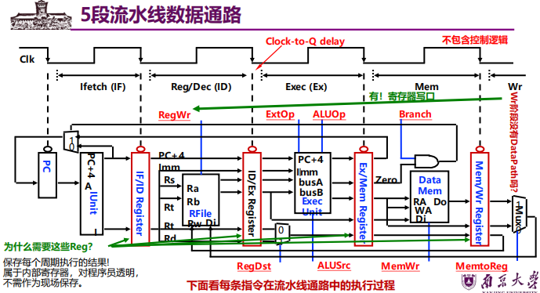

# 第六章

## 个人总结

+ 一条流水线由如下5个流水段组成：
  + 取指令（IF）：从存储器取指令；
  + 指令译码（ID）：产生指令执行所需的控制信号
  + 取操作数（OF）：读取操作数
  + 执行（EX）：对操作数完成指定操作；
  + 写回（WB）：将结果写回

+ 
+ **Exec阶段的控制信号有四个**：
  + ExtOp (扩展器操作)：1- 符号扩展；0- 零扩展
  + ALUSrc (ALU的B口来源)：1- 来源于扩展器；0- 来源于BusB
  + ALUOp (主控制器输出，用于辅助局部ALU控制逻辑来决定ALUCtrl)
  + RegDst (指定目的寄存器)：1- Rd；0- Rt

+ **Mem阶段的控制信号有两个**：
  + MemWr (DM的写信号)：Store指令时为1，其他指令为0
  + Branch (是否为分支指令)：分支指令时为1，其他指令为0

+ **Wr阶段的控制信号有两个**：
  + MemtoReg (寄存器的写入源)：1- DM输出；0- ALU输出
  + RegWr (寄存器堆写信号)：结果写寄存器的指令都为1，其他指令为0

+ **结构冒险也称硬件资源冲突：同一个执行部件被多条指令使用。**

+ 为了避免**结构冒险**，规定**流水线数据通路中功能部件的设置原则为**：
  + **每个部件在特定的阶段被用！**（如：ALU总在第三阶段被用！）
  + 将**指令存储器（Im）和数据存储器（Dm）**分开
  + 将寄存器**读口和写口**独立开来

+ **数据冒险**的解决方法：
  + 方法1：硬件阻塞（stall）
  + 方法2：软件插入“NOP”指令
  + 方法3：合理实现寄存器堆的读/写操作（不能解决所有数据冒险）
    + 前半时钟周期写，后半时钟周期读，若同一个时钟内前面指令写入的数据正好是后面 指令所读数据，则不会发生数据冒险
  + 方法4：转发（Forwarding或Bypassing 旁路）技术
    + 若相关数据是ALU结果，则如何？可通过转发解决
    + 若相关数据是上条指令DM读出内容，则如何？不能通过转发解决，随后指令需被阻塞一个时钟 或 加NOP指令
  + 方法5：编译优化：调整指令顺序（不能解决所有数据冒险）

### AI辅助总结  

### **一、 指令流水线的组成与各段功能**

经典的MIPS五级流水线将一条指令的执行划分为五个阶段，每个阶段在一个时钟周期内完成，从而实现时间重叠的并行处理。

| 流水段  | 英文全称                    | 主要功能                                                     |
| ------- | --------------------------- | ------------------------------------------------------------ |
| **IF**  | Instruction Fetch 取指令    | 1. 根据PC（程序计数器）从指令存储器中取出指令。 2. 计算下一条指令地址：PC = PC + 4。 |
| **ID**  | Instruction Decode 指令译码 | 1. **译码**：解析指令，产生控制信号。 2. **读寄存器堆**：根据rs和rt字段读出两个源操作数。 3. **符号扩展**：将16位立即数符号扩展为32位。 4. **分支判定**：计算分支目标地址并判断分支条件是否成立（部分设计将分支计算移至EX阶段）。 |
| **EX**  | Execute 执行/地址计算       | 1. **算术逻辑运算**：ALU根据控制信号对操作数进行计算。 2. **计算内存地址**：为load/store指令计算有效地址。 3. **计算分支目标地址**：PC + (sign-extend(offset) << 2)。 |
| **MEM** | Memory Access 存储器访问    | 1. **Load**：从数据存储器中读取数据。 2. **Store**：将数据写入数据存储器。 3. **分支跳转**：若分支条件成立，则更新PC为目标地址。 |
| **WB**  | Write Back 写回             | 将结果写回寄存器堆。结果可能来自ALU运算结果（R型指令）或从内存读取的数据（Load指令）。 |

**流水段寄存器**：位于各段之间（如IF/ID, ID/EX, EX/MEM, MEM/WB），用于锁存上一个阶段的结果，并将其作为下一个阶段的输入。这是实现流水线并行和状态传递的关键硬件。

------

### **二、 典型MIPS指令的功能段划分与数据通路**

所有MIPS指令都流经五个阶段，但各阶段的操作有所不同。

| 指令类型              | IF     | ID       | EX                  | MEM                  | WB         |
| --------------------- | ------ | -------- | ------------------- | -------------------- | ---------- |
| **R型 (add, sub...)** | 取指令 | 读rs, rt | ALU运算             | (无操作)             | 结果写回rd |
| **Load (lw)**         | 取指令 | 读基址rs | 计算地址            | 读存储器             | 数据写回rt |
| **Store (sw)**        | 取指令 | 读rs, rt | 计算地址            | 写存储器             | (无操作)   |
| **分支 (beq)**        | 取指令 | 读rs, rt | 比较 & 计算目标地址 | 更新PC（若分支成立） | (无操作)   |
| **跳转 (j)**          | 取指令 | (无操作) | (无操作)            | 更新PC               | (无操作)   |

**控制信号取值**：控制信号在ID阶段由主控制器根据`Opcode`产生，并随指令在流水线寄存器中向后传递，在相应的阶段生效（如`MemRead`在MEM阶段生效，`RegWrite`在WB阶段生效）。

------

### **三、 结构冒险及解决方法**

- **现象**：因硬件资源冲突，无法支持多条指令在同一时钟周期执行。例如，单端口存储器无法同时支持IF和MEM阶段的访问。
- **解决方法**： **资源重复**：最常用。使用**分离的指令Cache和数据Cache**，从根本上避免冲突。 **资源分时复用**：插入**气泡（Stall）**，让冲突的指令等待一个周期。这会降低性能。

------

### **四、 数据冒险及解决方法**

- **现象**：后一条指令需要用到前一条指令尚未产生的结果（RAW - 写后读），导致读到的数据是旧值。
- **解决方法**： 
  + **转发（旁路）** **思想**：将前一条指令在流水线寄存器（EX/MEM或MEM/WB）中的**中间结果**，直接旁路到后一条指令ALU的输入端，避免等待其写回寄存器堆。
  +  **路径**：`EX/MEM -> ALU输入`；`MEM/WB -> ALU输入`。 
  + **条件**：比较后一条指令ID/EX寄存器中的源寄存器编号（Rs, Rt）与前一条指令EX/MEM或MEM/WB寄存器中的目的寄存器编号（Rd/Rt）。
  +  **局限性**：无法解决Load-use冒险。
  +  **阻塞（流水线停顿）** **思想**：插入气泡，让流水线暂停一个周期。 
  + **主要场景**：**Load-use冒险**。 **检测**：当发现`ID/EX.MemRead`（表明是Load指令）且`ID/EX.RegisterRt == IF/ID.RegisterRs`（或Rt）时，触发阻塞。 **处理**：将ID/EX寄存器清零（插入NOP），并阻止PC和IF/ID寄存器更新。下个周期，Load数据已存入MEM/WB寄存器，可通过转发给后续指令使用。

**通常结合使用转发和阻塞**：转发解决大多数ALU指令间的数据冒险，阻塞专门处理Load-use冒险。

------

### **五、 控制冒险及解决方法**

- **现象**：分支、跳转等改变程序流向的指令导致后续已进入流水线的指令无效。
- **解决方法**： 
  + **简单停顿**：检测到分支指令后，暂停流水线直到分支结果确定（在EX阶段）。简单但性能损失大。
  +  **分支预测** **静态预测**：编译器或硬件固定策略（如“总是预测不跳转”或“总是预测跳转”）。**动态预测**：硬件根据运行时历史行为进行预测。 **1位饱和计数器**：记录上次分支是否成功跳转。 **2位饱和计数器**：状态机（如“强不跳转”、“弱不跳转”、“弱跳转”、“强跳转”），需两次预测错误才改变方向，更稳定。 **分支目标缓冲**：缓存之前成功分支的目标地址，实现快速取指。 **延迟分支** **思想**：无论分支是否成功，都执行分支指令后的**一条**指令（位于“延迟槽”）。 **编译器职责**：寻找可以安全填充到延迟槽中的指令（如来自分支前的、或肯定执行的指令），以隐藏分支延迟。 **注意**：现代深度流水线处理器已不采用此方法。

------

### **六、 异常和中断引起的控制冒险及处理**

- **现象**：异常（内部事件，如溢出、非法指令）或中断（外部事件）会打断正常程序流，需要跳转到特定的处理程序（如操作系统内核）。
- **挑战**：异常可能在流水线的任何阶段发生，且多条指令可能同时引发异常。
- **关键目标**：实现**精确异常**——确保异常指令之前的所有指令都已完成，之后的指令都像没开始一样。
- **处理方法**： **记录原因**：在流水线寄存器中增加字段，记录该指令是否引发异常及异常类型。 **按序响应**：当异常指令到达流水线末尾（如MEM或WB阶段）时，才**统一处理**。此时，该指令之前的指令已提交，之后的指令可被安全清空。 **保存现场**：将当前PC（或导致异常的指令地址）保存到特定寄存器（如EPC），并跳转到预定义的异常处理程序入口地址。 **恢复执行**：异常处理程序结束后，通过特殊指令（如MIPS的`ERET`）从EPC恢复执行。

**流水线清空**：在响应异常时，需要清空异常指令之后进入流水线的所有指令（将其转化为气泡）。