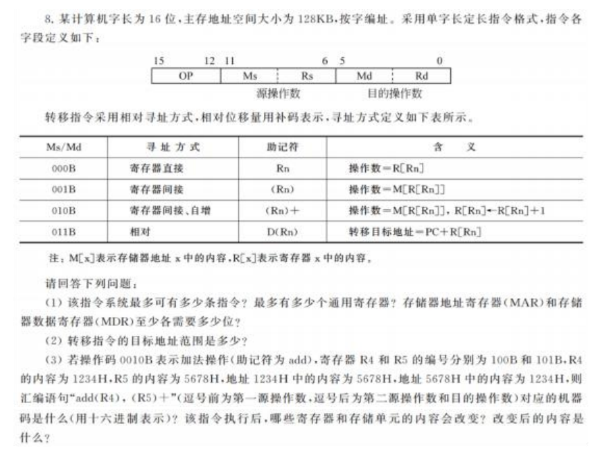

# 第四章 指令系统详细笔记

## 一、指令格式设计

### 1.1 指令的基本构成要素

指令由**操作码**和**地址码**两部分组成：

- **操作码**：指明指令执行的操作性质（如加、减、转移）
- **地址码**：指明操作数来源、结果存放地址或下条指令地址

### 1.2 地址码结构类型（按地址数量分类）

| 类型           | 格式               | 功能说明         | 应用场景                                                     |
| -------------- | ------------------ | ---------------- | ------------------------------------------------------------ |
| **零地址指令** | OP                 | 无显式操作数地址 | 1. 无需操作数的指令（如NOP、HLT） 2. 操作数隐含在堆栈中的指令（如PUSH、POP） |
| **一地址指令** | OP + A1            | 只有一个显式地址 | 1. 单操作数指令（INC、DEC） 2. 另一操作数隐含在累加器ACC中（如ADD A） |
| **二地址指令** | OP + A1 + A2       | 两个操作数地址   | 最常见格式，A1为源操作数，A2为目的操作数兼结果存放处         |
| **三地址指令** | OP + A1 + A2 + A3  | 三个操作数地址   | A1、A2为源操作数地址，A3为结果地址（如RISC指令）             |
| **多地址指令** | OP + A1 + ... + An | 多个地址字段     | 用于向量、矩阵等特殊运算                                     |

### 1.3 操作码设计技术

#### 1.3.1 定长操作码

- **特点**：操作码长度固定不变
- **优点**：译码简单、速度快，适合流水线处理
- **缺点**：指令数量受限制
- **示例**：若操作码占8位，则最多有2⁸=256条指令

#### 1.3.2 变长操作码（扩展操作码）

- **特点**：操作码长度可变，不同类型指令操作码长度不同
- **设计原则**： 使用频度高的指令分配短操作码 使用频度低的指令分配长操作码 短码不能是长码的前缀（哈夫曼编码思想）
- **实现方式**： `操作码扩展示例（假设指令字长16位）： 00×× ×××× ×××× ××××    // 4条一地址指令 01×× ×××× ×××× ×××× 10×× ×××× ×××× ×××× 11×× ×××× ×××× ×××× 1100 ×××× ×××× ××××    // 扩展为二地址指令 1101 ×××× ×××× ×××× 1101 10×× ×××× ××××    // 进一步扩展`

#### 1.3.3 操作码与地址码的权衡

- 地址码数量增加 → 操作码长度减少 → 指令功能增强但指令数减少
- 固定指令字长下的优化策略：高频指令用短地址码，低频指令用长地址码

### 1.4 指令字长设计

#### 1.4.1 定长指令字

- 所有指令长度相同
- 优点：简化指令译码，便于流水线实现
- 缺点：可能浪费存储空间
- 典型代表：RISC架构（如MIPS、ARM的32位固定长度）

#### 1.4.2 变长指令字

- 不同指令长度不同
- 优点：节省存储空间，提高代码密度
- 缺点：译码复杂，不利于流水线
- 典型代表：CISC架构（如x86指令长度1-15字节）

#### 1.4.3 指令格式设计实例

```
x86指令示例：
操作码(1-2字节) + ModR/M(1字节) + SIB(0-1字节) + 位移(0-4字节) + 立即数(0-4字节)

MIPS指令示例：
R型：6位操作码 + 5位rs + 5位rt + 5位rd + 5位shamt + 6位funct
I型：6位操作码 + 5位rs + 5位rt + 16位立即数/地址偏移
J型：6位操作码 + 26位跳转目标地址
```

## 二、指令系统设计

### 2.1 CISC与RISC设计哲学对比

| 特性           | CISC（复杂指令集计算机）       | RISC（精简指令集计算机）     |
| -------------- | ------------------------------ | ---------------------------- |
| **设计目标**   | 面向高级语言，增强单条指令功能 | 面向编译器优化，简化硬件设计 |
| **指令数量**   | 多（通常200条以上）            | 少（通常100条以内）          |
| **指令格式**   | 变长、格式多样                 | 定长、格式规整（通常2-3种）  |
| **寻址方式**   | 复杂多样（10种以上）           | 简单规整（通常≤5种）         |
| **执行时间**   | 不同指令差异大                 | 大多数指令单周期完成         |
| **实现方式**   | 微程序控制为主                 | 硬布线控制为主               |
| **寄存器数量** | 较少                           | 大量通用寄存器               |
| **典型架构**   | x86、VAX                       | MIPS、ARM、PowerPC、RISC-V   |

### 2.2 现代指令系统设计的权衡因素

#### 2.2.1 硬件成本与性能

- **简单指令系统**：硬件实现简单，但程序较长
- **复杂指令系统**：程序较短，但硬件复杂，可能降低主频

#### 2.2.2 兼容性与创新

- **向后兼容**：新处理器必须支持旧指令，限制了架构创新
- **创新设计**：放弃兼容性可获得更优设计，但需重建软件生态

#### 2.2.3 可编程性与编译优化

- **面向程序员**：提供丰富、强大的指令，便于汇编编程
- **面向编译器**：提供规整、简单的指令，便于编译优化0

### 2.3 指令系统的关键技术

#### 2.3.1 流水线技术

- **RISC的关键特征**：几乎所有指令等长、执行时间相近，便于深度流水
- **流水线冒险处理**： 结构冒险：资源冲突（通过资源复制解决） 数据冒险：数据相关（通过转发、暂停解决） 控制冒险：分支预测错误（通过预测、延迟槽解决）

#### 2.3.2 现代架构融合趋势

- **RISC核心+CISC外层**：现代x86内部将复杂指令分解为RISC微操作
- **混合长度指令集**：如ARM的Thumb-2（16/32位混合）
- **可配置指令集**：如RISC-V的模块化扩展

## **指令系统复习笔记（按考试要点框架整理）**

#### **1. 指令格式设计**

- **核心构成**：一条机器指令由**操作码（OP）** 和**地址码（A）** 两部分组成。操作码指明操作性质，地址码指明操作数地址。
- **地址码数目分类**： 
  + **三地址/二地址指令**：用于算术逻辑运算，结果写回寄存器或存储器。
  +  **一地址指令**：常隐含使用**累加器（ACC）**，如 `(ACC) OP (A) -> ACC`。 
  + **零地址指令**：操作数隐含在堆栈中，或为控制指令（如HLT）。
- **设计权衡**：指令字长有限，需平衡操作码位数（决定指令条数）与地址码位数（决定寻址范围）。采用**扩展操作码技术**实现灵活设计。
- **字长类型**：分为**定长指令字**（RISC特点，利于译码流水）和**变长指令字**（CISC特点，节省程序空间）。

#### **2. 操作数类型、寻址方式、操作类型、操作码编码**

- **操作数类型**：包括地址、数字（定点、浮点、十进制）、字符（ASCII）、逻辑数据（按位运算）。
- **寻址方式**（关键考点）： 
  + **立即寻址**：操作数直接在指令中，最快。
  +  **直接寻址**：`EA = A`，地址在指令中，简单但寻址范围有限。 
  + **间接寻址**：`EA = (A)`，指令中地址指向操作数地址，可扩大寻址范围但速度慢。
  +  **寄存器（间接）寻址**：操作数在寄存器中或地址在寄存器中，速度快。
  +  **基址寻址**：`EA = (BR) + A`，基址寄存器+偏移量，**BR内容由OS管理**，用于多道程序与地址重定位。
  +  **变址寻址**：`EA = (IX) + A`，变址寄存器+基址，**IX内容由用户程序改变**，用于处理数组、循环。 
  + **相对寻址**：`EA = (PC) + A`，PC+偏移量，用于转移指令，便于程序浮动。
  + **堆栈寻址**：操作数在堆栈中
- **操作类型**：
  +  **数据传送**（MOV, LOAD/STORE）
  +  **算术逻辑运算**（ADD, SUB, AND, SHIFT）
  +  **程序控制**（JMP, CALL/RET，条件分支） 
  + **I/O操作** 
  + **处理机控制**（开/关中断）
- **操作码编码**：主要采用**扩展操作码法**，遵循“地址码越少，可分配的操作码位数越多”的原则，且短码不能是长码的前缀，确保译码唯一性。

#### **3. 异常和中断的区别**

- **中断**：来自CPU外部，与当前执行指令**异步**，用于响应外部设备请求（如I/O完成）。通常**可屏蔽**，处理完成后返回下条指令继续执行。
- **异常**：来自CPU内部，由当前正在执行的指令**同步**触发，如溢出、缺页、非法操作码、系统调用等。通常**不可屏蔽**，处理可能终止当前程序或修正错误后重新执行故障指令。
- **核心联系**：两者都是强制改变程序正常流程，转向特定处理程序（如中断服务程序或异常处理程序）的事件。现代CPU通常使用统一的“中断向量表”来管理两者的入口地址。

#### **4. MIPS指令格式和寻址方式**

- **指令格式（三类，32位定长）**： 
  + **R型（寄存器-寄存器）**：`op(6) + rs(5) + rt(5) + rd(5) + shamt(5) + funct(6)`。用于算术逻辑运算。
  +  **I型（立即数/访存）**：`op(6) + rs(5) + rt(5) + immediate(16)`。用于立即数运算、Load/Store（如`lw, sw`）、条件分支（如`beq`）。
  +  **J型（跳转）**：`op(6) + address(26)`。用于长跳转（如`j, jal`）。
- **寻址方式**：
  + **立即数寻址**：操作数在指令的`immediate`字段。
  +  **寄存器寻址**：操作数在`rs, rt, rd`指定的寄存器中。
  +  **基址寻址**：用于`lw/sw`，`EA = (rs) + SignExt(immediate)`。
  +  **PC相对寻址**：用于条件分支`beq/bne`，目标地址 `= (PC+4) + SignExt(immediate)<<2`。
  +  **伪直接寻址**：用于跳转指令`j/jal`，目标地址 `= (PC+4的高4位) ∥ (address << 2)`。

#### **5. 选择结构、循环结构的汇编指令表示**

- **核心机制**：利用**条件分支指令**（如MIPS的`beq`, `bne`）和**无条件跳转指令**（`j`）改变程序流。

- **选择结构（If-Else）示例（MIPS）**： 

  ```
  beq $s1, $s2, Ltrue   # if (a == b)
     (else-part instructions)
     j Lend
  Ltrue:
     (then-part instructions)
  Lend:
  ```

- **循环结构（While）示例（MIPS）**： 

  ```
  Loop:
     slt $t0, $s1, $s2     # 设置条件 (i < n)
     beq $t0, $zero, Exit  # 条件不成立则退出循环
     (loop-body instructions)
     addi $s1, $s1, 1      # i++
     j Loop
  Exit:
  ```

  

- **机器代码关系**：在I型格式中，分支指令的`immediate`字段存储的是**偏移量（字偏移）**，而非绝对地址。汇编器/链接器负责计算该偏移量。

#### **6. 过程调用的指令、执行步骤、栈和栈帧的变化**

- **关键指令**：
  +  **调用指令**：如MIPS的`jal ProcedureAddress`。功能：1) 将返回地址（`PC+4`）存入`$ra`寄存器；2) 跳转到目标过程。
  +  **返回指令**：`jr $ra`，跳转到`$ra`保存的地址。
- **执行步骤（以MIPS为例）**：
  + **调用者准备实参**：将前几个实参放入寄存器`$a0-$a3`，多余参数压入调用者栈帧。
  +  **保存现场**：调用者保存需要保护的寄存器（`$ra, $s0-$s7`等）到自己的栈帧。
  +  **执行`jal`**：跳转到被调用过程，同时`$ra`存好返回地址。
  +  **被调用者建立栈帧**：分配栈空间（`$sp`下移），并保存需要保护的寄存器（如`$fp, $s0`等）。
  +  **过程体执行**。 
  + **返回值准备**：将返回值放入`$v0-$v1`。
  +  **恢复现场并撤销栈帧**：恢复保存的寄存器，`$sp`上移。
  +  **执行`jr $ra`**：返回调用者。
- **栈与栈帧的变化**： 栈从高地址向低地址增长。 每个过程的活动记录（栈帧）通常包括：保存的寄存器、局部变量、溢出参数等。
  +  **调用时**：调用者`$sp`下移（压入参数/返回地址），`jal`后控制权转移。
  +  **进入被调用过程**：被调用者`$sp`继续下移，开辟自己的栈帧。
  +  **返回时**：`$sp`上移，释放被调用者栈帧，回到调用者栈帧环境。 栈指针`$sp`和帧指针`$fp`共同维护栈帧边界。

# 题目注解



(1)解：

+ 指令码一共有四位，故2^4=16   
+  通过表格，可以看出通用寄存器占3位，最多有八个寄存器        
+ 主存地址空间大小为128KB，按字编址。总字数 = 128KB/2B = 64K字。64K = 2^16，故需要16位地址。MAR位数至少为16位
+ 与机器字长相等，字长为16位，故MDR位数至少为16位

(2)解：

+ 采用相对寻址方式寻址，目标地址 = PC + R[Rn]
+ Rn为16位，则为16位补码，故范围为（PC - 32768） ~ （PC + 32767）
+ 则目标地址范围为0000H~FFFFH
+ 只要机器字长大于等于内存地址长度即可访问所有地址

(3)解：

+ **寄存器 R5** 内容改变：由 `5678H`→ **`5679H`**
+ **存储单元 5678H** 内容改变：由 `1234H`→ **`68ACH`**