# 软件工程 II 画图专项练习（纯题目版）

> 使用说明：本练习依据 `123.txt`、`语音版重点.md`、`考试题目类型与重点.md` 以及 2020、2022 往年卷的设问方式整理。前半部分仅总结画法并引用课件原图；后半部分只有题目，没有答案、半成品图或解题提示。满分 100 分。

## 一、考试涉及的图与语言规范

### 1. 总体语言规则

本表按课件示例及“分析模型使用业务语言、设计模型与代码保持一致”的原则整理。老师并未要求整张图只能使用一种语言，因此混合使用时以对象性质为准。

| 图 | 图中文字规范 |
|---|---|
| 用例图 | **中文**：参与者、用例、系统边界名称；UML 关键字 `<<include>>`、`<<extend>>` 使用英文。 |
| 系统顺序图 | **中英混合**：参与者和外部系统名称用中文；发往系统的操作消息使用英文方法名，如 `submitReservation(...)`；系统返回的业务结果可以用中文。 |
| 概念类图 | **中文**：概念类、属性、关联名称使用领域业务用语；不要写方法。 |
| 物理包图 | **英文**：包、接口、实现类、VO、PO 使用英文代码命名；层名可写“展示层（Presentation Layer）”这类中英对照。 |
| 组件图 | **英文**：组件、模块、接口及构建产物名称应和代码、JAR/WAR 名称一致；说明性注释可以中文。 |
| 设计类图 | **英文**：类名、接口名、属性、方法、参数和类型均与代码一致；UML 关系关键字用英文。 |
| 详细顺序图 | **英文**：对象名、类名、消息、参数、返回值与代码一致；业务说明可中文注释。 |
| 状态图 | **英文**：状态、事件、守卫条件、动作与枚举/方法名一致；图标题和解释可以中文。 |
| 程序流程图 | **英文**：变量、表达式和方法名与代码一致；`Start`、`End`、`Yes`、`No` 统一用英文。 |
| 对话结构图 | **中文**：界面状态（节点）和用户操作（边）使用用户能理解的界面语言。 |
| 线框图 | **中文**：页面标题、字段、按钮、提示和状态信息使用面向用户的界面语言。 |

### 2. 用例图

画法：先确定系统边界，再识别边界外的参与者和边界内、具有完整业务价值的用例；参与者与用例用实线关联。`include` 表示必定复用，箭头由基础用例指向被包含用例；`extend` 表示条件性扩展，箭头由扩展用例指向基础用例。不要把登录、输入字段、连接数据库等单一步骤或实现细节当作独立用例。

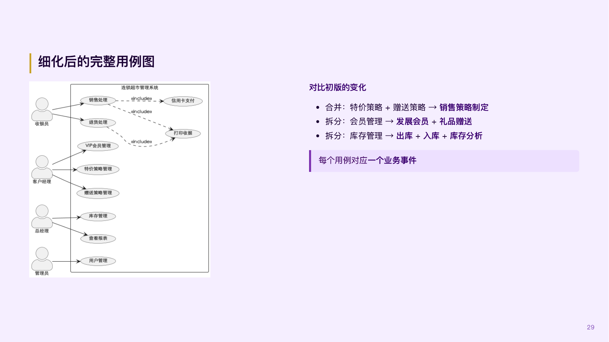

来源：`课件/02-03-用例建模与用户故事.pdf` 第 29 页。

### 3. 系统顺序图

画法：把整个待开发系统看成一个黑箱，只画外部参与者、`:系统` 和必要的外部系统；按时间自上而下排列参与者与系统之间的消息。用户请求通常写成系统操作，返回消息使用虚线。系统内部的 Controller、Service、DAO、数据库不得出现在系统顺序图中；替代或异常场景可用 `alt`、`opt`、`loop` 组合片段表达。

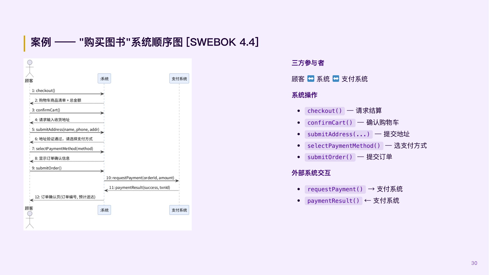

来源：`课件/02-04-需求分析与AI辅助建模.pdf` 第 30 页。

### 4. 概念类图

画法：从题干名词中识别领域概念，筛去界面、数据库、框架等技术实现概念；为概念类补充重要业务属性，画出关联、聚合、组合、继承及多重性。概念类图处于分析阶段，**只有类、属性和关系，没有方法**。组合表示整体与部分存在生命周期绑定；聚合仅表示整体与部分关系。

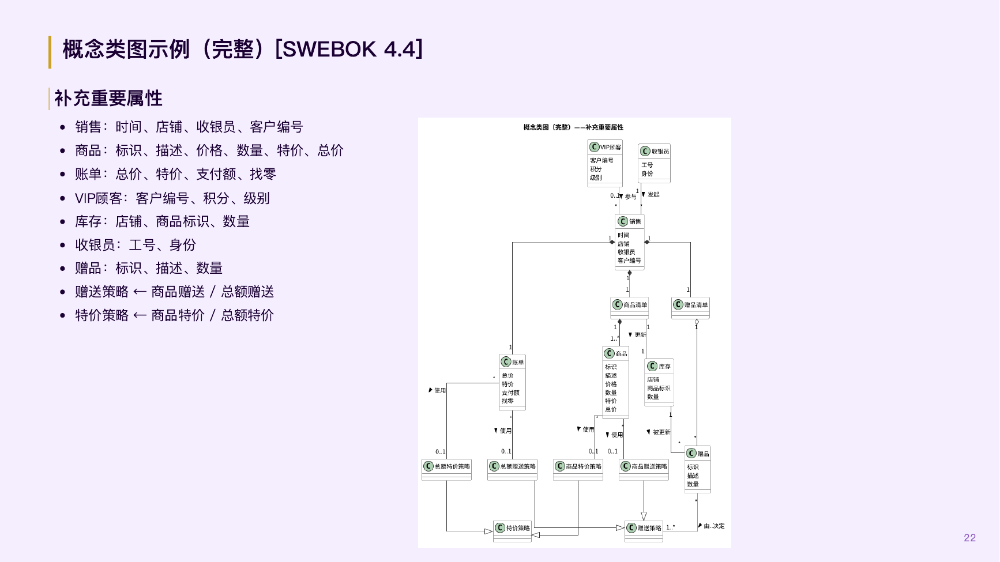

来源：`课件/02-04-需求分析与AI辅助建模.pdf` 第 22 页。

### 5. 物理包图

画法：先划分展示层、业务逻辑层和数据访问层，再按业务模块细分包；展示层依赖 Service Interface，Service Impl 实现 Service Interface 并依赖 DAO Interface，DAO Impl 实现 DAO Interface。展示层与逻辑层通过 VO 传递所需展示数据，逻辑层与数据层通过 PO 映射持久化数据。依赖使用虚线箭头，接口实现使用实线加空心三角箭头；要体现客户端、服务器端、HTTP/REST 跨网络通信及题干要求的全部功能模块。

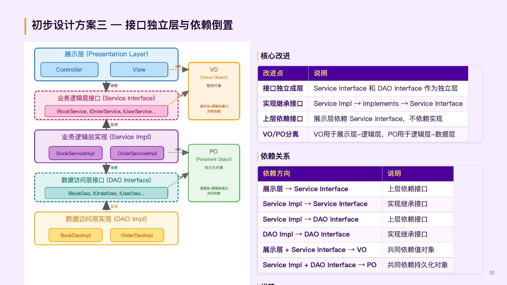

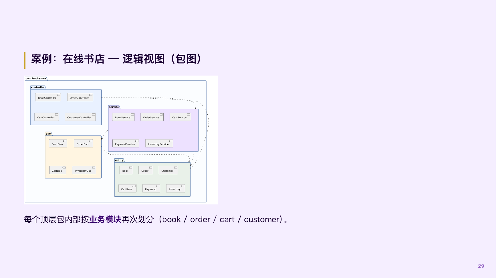

来源：`课件/03-02-体系结构风格与设计过程.pdf` 第 51 页；`课件/03-03-体系结构设计实践与验证.pdf` 第 29 页。

### 6. 组件图

画法：组件图表达开发视图中的代码组织、构建单元和交付物。画出组件/模块、内部关键构件、组件间依赖，以及完整的供接口（Provided Interface）与需接口（Required Interface）；模块名、接口名和构建产物应与实现一致。组件图不是本次最核心题型，但 `123.txt` 明确提到它可用于表达体系结构，故纳入专项练习。

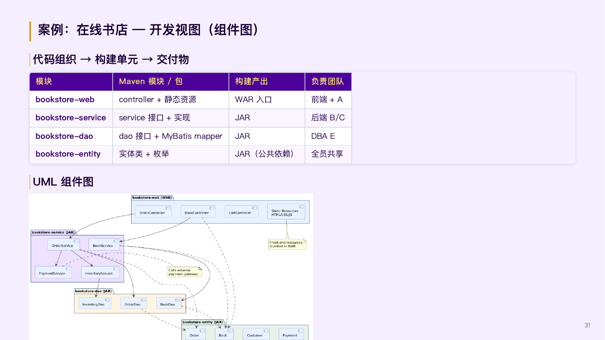

来源：`课件/03-03-体系结构设计实践与验证.pdf` 第 31 页。

### 7. 设计类图

画法：设计类图属于设计阶段，需要给出类/接口、属性、方法、参数、返回类型、可见性及关系。用空心三角表示继承或接口实现，虚线表示依赖，空心菱形表示聚合，实心菱形表示组合，并标注多重性。设计应体现信息专家、创建者、控制器、低耦合、高内聚、多态等 GRASP/类设计原则。

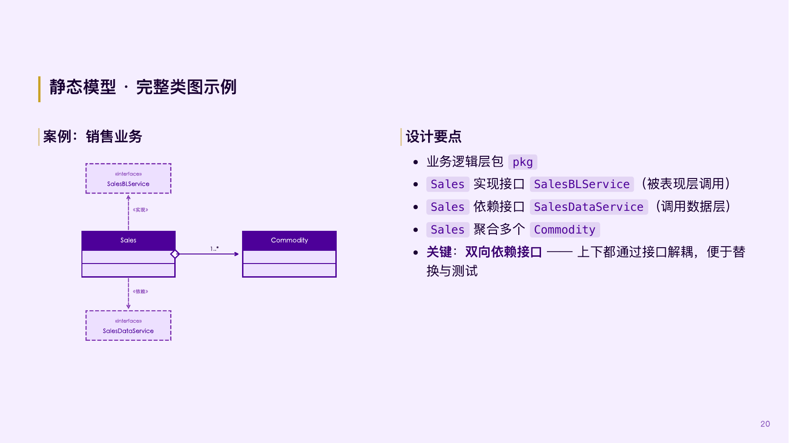

来源：`课件/04-01-详细设计.pdf` 第 20 页。

### 8. 详细顺序图

画法：详细顺序图展开系统内部对象协作，应出现边界/控制/实体对象或 Controller、Service、DAO、PO/VO 等实际设计对象。按调用顺序画同步消息、必要的创建消息、返回消息、激活条和组合片段；对象和消息必须能在设计类图中找到对应定义。同步消息使用实线和实心箭头，异步消息使用实线和鱼骨箭头，返回消息使用虚线。

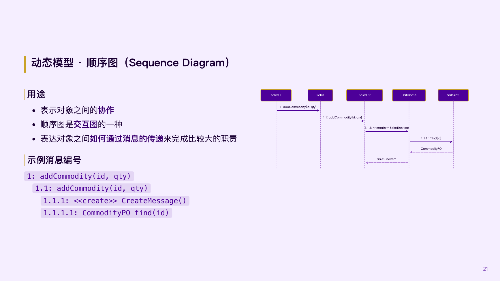

来源：`课件/04-01-详细设计.pdf` 第 21 页。

### 9. 状态图

画法：第一步先明确状态机主体，只描述一个对象的生命周期。使用实心圆表示初态、同心圆表示终态，状态间转换标注为“事件 `[守卫条件]` / 动作”；状态必须是具有持续时间的稳定情形，而不是瞬时操作。应覆盖正常、取消、失败等合法转换，不画题干不允许的跨状态跳转。

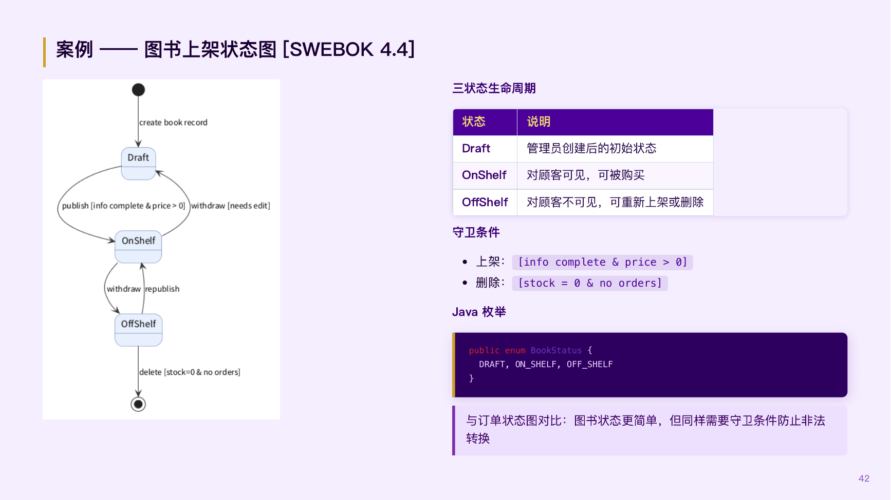

来源：`课件/02-04-需求分析与AI辅助建模.pdf` 第 42 页。

### 10. 程序流程图

画法：圆角矩形表示开始/结束，矩形表示处理，平行四边形表示输入/输出，菱形表示判断；所有分支都标明 `Yes/No`，循环必须有返回边和明确退出条件。流程图描述一个方法内部的控制流程，不要混入跨对象调用关系。

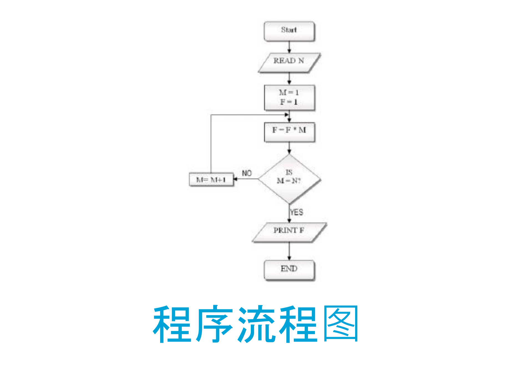

来源：`课件/代码设计.pdf` 第 44 页。

### 11. 对话结构图

画法：节点表示界面状态或页面，边表示用户操作；从初始界面出发，覆盖主要任务路径、返回路径、取消路径和输入错误等异常分支。节点写“用户当前看到的状态”，边写“用户执行的操作”，不要画 Controller、API 或数据库。

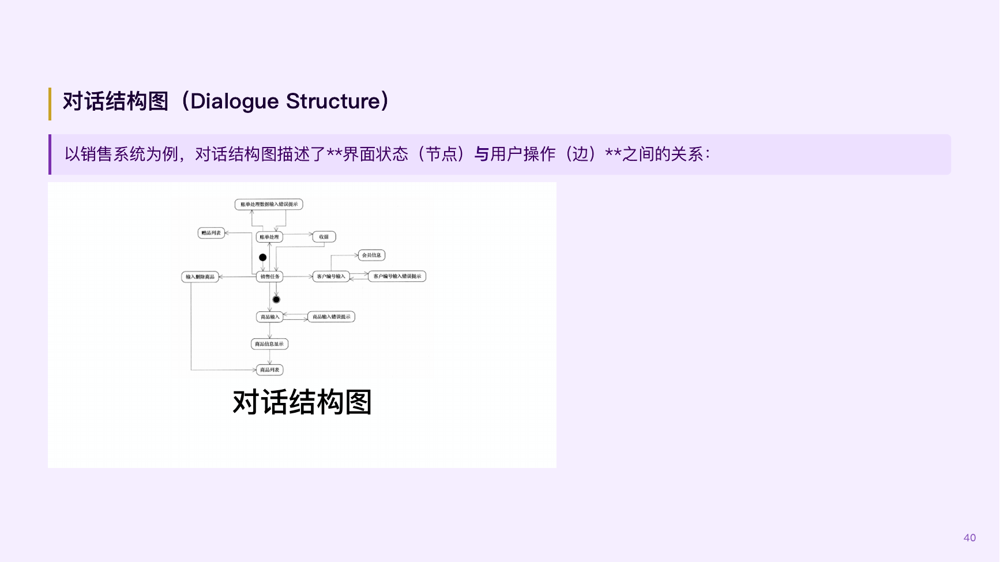

来源：`课件/03-04-人机交互设计.pdf` 第 40 页。

### 12. 线框图

画法：用低保真矩形区域表达页面信息层次、字段、按钮、导航、反馈与错误提示，不追求颜色和视觉装饰。布局应支持用户任务，突出主要操作，危险操作与常用操作分离，并体现状态可见、识别优于回忆、防错和可恢复。

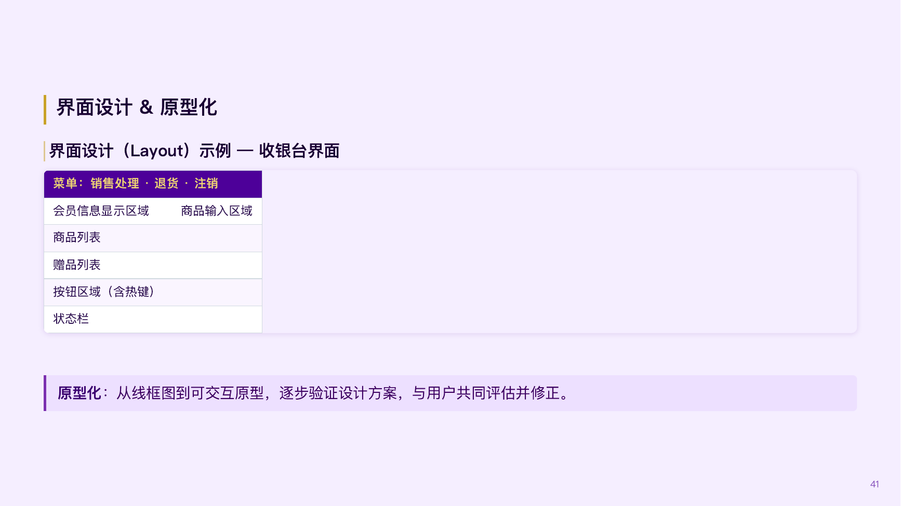

来源：`课件/03-04-人机交互设计.pdf` 第 41 页。

---

## 二、专项练习题（只含题目）

### 统一情景：高校实验设备预约与借用系统

某高校实验中心管理显微镜、示波器、3D 打印机和激光切割机等设备。现有预约、审批、借用、归还和收费工作主要依靠纸质登记与微信群，存在时间冲突、设备状态不透明、超时归还难追踪等问题。学校拟建设一套 Web 版“实验设备预约与借用系统”。

系统用户包括学生、指导教师和实验员。学生可以查询设备、查看可预约时段、提交预约申请、取消尚未开始的预约、查看预约记录和缴纳费用。指导教师负责审批高风险设备的预约申请。实验员负责维护设备信息、设置可用时段、办理借出和归还、登记设备损坏情况。系统还需与校园统一支付平台及门禁系统交互。

学生提交预约申请时，需要选择设备、使用日期、开始时间、结束时间，填写实验用途并指定指导教师。系统先检查学生是否有未缴费用或未处理的严重违规；再检查设备是否处于可用状态、申请时段是否与已有有效预约冲突。检查不通过时，系统应说明原因且不创建预约。

对于普通设备，检查通过后系统自动批准预约；对于高风险设备，系统创建“待审批”预约并通知指导教师。指导教师可以批准或驳回，驳回时必须填写原因。预约开始前 30 分钟，系统向门禁系统申请临时通行权限。学生到场后向实验员出示预约二维码，实验员核验预约和设备状态后办理借出。

归还时，实验员登记实际归还时间和设备状况。未超时且设备正常时费用为 0；超时部分按每小时 20 元计费，不满 1 小时按 1 小时计算，超时费最高 200 元；轻微损坏收取 50 元，严重损坏按设备重置价格收费。应收金额大于 0 时，系统调用校园统一支付平台生成待支付账单。支付成功后预约完成；无费用时归还后直接完成。学生在预约开始前可以取消；已借出后不得取消。

系统采用三层 Web 体系结构。浏览器中的 HTML、CSS、JavaScript 位于客户端；展示层、业务逻辑层和数据访问层位于服务器端，通过 HTTP 和 REST API 通信。系统按设备、预约、借还、收费、用户五个功能域组织代码。展示层与逻辑层之间使用 VO，逻辑层与数据层之间使用 PO，并通过独立接口隔离实现。

### 第 1 题：用例图（8 分）

根据统一情景，画出“实验设备预约与借用系统”的完整用例图。

要求：

1. 画出系统边界。
2. 识别学生、指导教师、实验员、校园统一支付平台、门禁系统等参与者。
3. 覆盖题干中所有具有独立业务价值的主要用例。
4. 对确有必要的公共行为或条件性行为使用 `<<include>>` 或 `<<extend>>`，并保证箭头方向正确。
5. 不得将登录、输入时间、连接数据库等步骤或技术细节作为独立用例。

### 第 2 题：系统顺序图（10 分）

针对“学生预约高风险设备”用例，画出包含主成功场景及两个失败场景的系统顺序图。

主成功场景：学生查看可预约时段，提交高风险设备预约申请；系统检查资格和时段后创建待审批预约；指导教师批准；系统返回预约成功信息。

失败场景至少包括：

1. 学生存在未缴费用或严重违规。
2. 申请时段与已有有效预约冲突。

要求：把待开发系统视为一个黑箱；只画学生、指导教师、`:系统` 及确有必要的外部参与者，不得出现 Controller、Service、DAO 或数据库；使用组合片段表达不同场景。

### 第 3 题：概念类图（10 分）

通过名词分析法确定统一情景中的概念类，识别重要属性和概念类之间的关系，并画出完整概念类图。

要求：

1. 重点分析人员、设备、设备类型、可用时段、预约、审批、借用记录、归还记录、违规、账单、支付记录和门禁权限等概念。
2. 根据业务语义辨识普通关联、聚合、组合和继承，并标注关联名称及多重性。
3. 识别能够支持题干业务规则的重要属性。
4. 概念类中不得出现方法，不得出现 Controller、Service、DAO、数据库表等实现概念。

### 第 4 题：物理包图（12 分）

按照分层体系结构风格，画出能够体现整个系统体系结构的具体物理包图。

要求：

1. 体现客户端与服务器端的物理边界，以及浏览器和服务器之间基于 HTTP、REST API 的通信。
2. 客户端包含 HTML、CSS、JavaScript；服务器端体现展示层、Service Interface、Service Impl、DAO Interface、DAO Impl。
3. 按 `device`、`reservation`、`checkout`、`billing`、`user` 五个功能域细分包，体现题干全部功能模块。
4. 画出 VO 包与 PO 包及其合理依赖方。
5. 画出主要包间依赖和接口实现关系，依赖方向必须正确。
6. 展示层不能直接依赖 DAO 或数据库，业务逻辑实现不能绕过 DAO Interface。

### 第 5 题：组件图（8 分）

在第 4 题包图的基础上，画出系统开发视图的 UML 组件图。

要求：

1. 至少划分 `lab-web`、`lab-service`、`lab-dao`、`lab-entity` 四个构建模块，并标明其构建产物类型。
2. 在组件内部标出能够体现五个功能域的关键构件。
3. 表达组件之间的依赖关系。
4. 为 `lab-service` 和 `lab-dao` 表达合理的供接口与需接口；接口命名与后续设计保持一致。
5. 表达系统对校园统一支付平台和门禁系统的外部依赖。

### 第 6 题：设计类图（12 分）

系统当前只有“普通设备自动审批”和“高风险设备教师审批”两种审批规则。学校预计未来增加“学院管理员审批”“实验中心主任审批”及多级组合审批。收费方式当前包括超时收费、轻微损坏收费和严重损坏收费，未来可能增加耗材费，但不希望每增加一种规则就修改预约核心类。

请为预约、审批和收费部分画出设计类图。

要求：

1. 图中至少包含 `Reservation`、`Device`、`Student`、`Instructor`、`ApprovalPolicy`、两种现有审批策略、`ChargePolicy`、现有收费策略、`Bill`、`Payment` 等必要类或接口。
2. 写出支持题干场景的关键属性和方法，包括参数、返回类型及可见性。
3. 使用抽象、接口、多态或组合，使新增审批规则和收费规则时尽量不修改稳定核心。
4. 正确画出继承/实现、依赖、聚合/组合及多重性。
5. 避免使用 `type` 或布尔 Flag 在单个大方法中控制全部审批和收费分支。

### 第 7 题：详细顺序图（12 分）

针对“实验员办理归还并生成账单”场景，画出对象之间协作的详细顺序图。

基本流程：实验员提交预约编号、实际归还时间和设备状况；系统查询有效预约和借用记录；计算超时费及损坏费；保存归还记录；若费用为 0，则完成预约；若费用大于 0，则创建账单并调用校园统一支付平台生成支付单，等待平台返回支付单号和支付状态。

要求：

1. 至少包含界面/Controller、归还业务 Service、预约 DAO、借用记录 DAO、收费策略对象、账单 DAO、校园统一支付平台以及必要的 VO/PO 或实体对象。
2. 画出同步调用、返回消息、必要的创建消息及激活条。
3. 使用 `alt` 片段区分“费用为 0”和“费用大于 0”。
4. 对象、方法及返回值必须与第 6 题设计类图在语义上保持一致。

### 第 8 题：状态图（10 分）

以**单个预约 `Reservation` 对象**为状态机主体，画出其完整生命周期状态图。

要求覆盖：

1. 普通设备申请通过后自动批准。
2. 高风险设备申请后等待教师审批，审批可通过或驳回。
3. 已批准预约可在开始前由学生取消。
4. 已批准预约经核验后借出，已借出预约不能取消。
5. 归还后，无费用则直接完成；有费用则等待支付，支付成功后完成。
6. 资格检查失败或时段冲突时不创建预约对象，因此不要把它们误画成预约的持久状态。
7. 所有转换标明事件，必要时标明守卫条件和动作，并画出初态与终态。

### 第 9 题：程序流程图（6 分）

为方法 `calculateCharge(dueTime, returnTime, damageLevel, replacementPrice)` 画出完整程序流程图。

计费规则如下：

1. 若 `returnTime <= dueTime`，超时费为 0；否则按超出的整小时数向上取整，每小时 20 元，超时费最高 200 元。
2. `damageLevel == NONE` 时损坏费为 0。
3. `damageLevel == MINOR` 时损坏费为 50 元。
4. `damageLevel == MAJOR` 时损坏费为 `replacementPrice`。
5. 方法返回超时费与损坏费之和。

要求：使用标准流程图符号，所有判断分支标明 `Yes/No`，变量和表达式使用英文。

### 第 10 题：对话结构图（6 分）

针对学生端“查询设备并提交预约申请”的完整交互过程，画出对话结构图。

要求至少覆盖以下界面状态和交互：设备列表、筛选结果、设备详情、可预约时段、预约信息填写、提交确认、预约成功、资格检查失败、时段冲突、取消填写、返回修改。节点表示界面状态，边表示用户操作；画出初始节点和任务完成节点。

### 第 11 题：线框图（6 分）

为学生端“预约信息填写与确认”页面画一张低保真线框图。

页面必须支持：

1. 查看当前选择的设备及其风险等级。
2. 选择日期、开始时间和结束时间。
3. 填写实验用途并选择指导教师。
4. 查看预约规则、费用/违规状态提示和时段冲突反馈。
5. 提交预约、保存草稿、取消并返回。
6. 对高风险设备清楚提示“需指导教师审批”。

要求：体现信息层次、主要操作、错误预防、系统状态反馈和危险操作隔离；只画布局和控件，不进行高保真美化。

---

## 三、提交要求

1. 请按“第 1 题”至“第 11 题”编号提交图片或扫描件，一题一图最便于批改。
2. 手绘或 UML 工具绘制均可；若使用工具，仍需遵守本练习规定的中英文和 UML 符号规范。
3. 图中文字和箭头必须清晰；多页作答请在每页标注题号。
4. 不需要提交解释文字，除非图中某个取舍无法仅靠 UML 符号说明。

收到你的作答后，将按每题分值分别给出：得分、元素遗漏、关系/箭头错误、语言与符号规范、跨图一致性，以及建议修改版要点。
